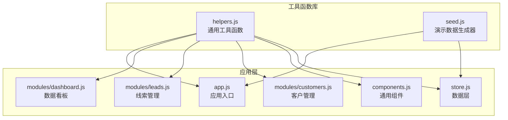
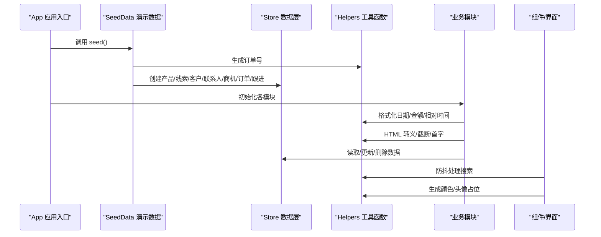
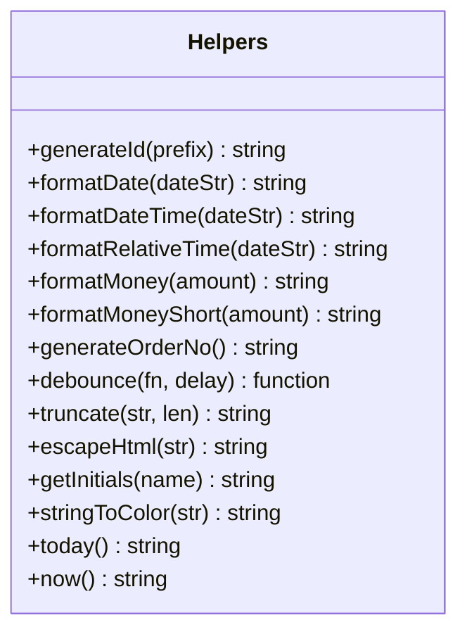
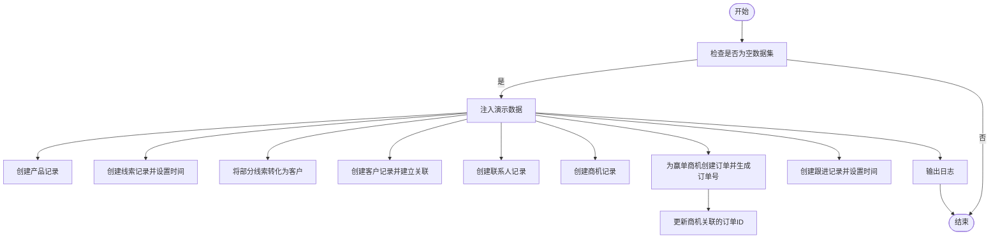
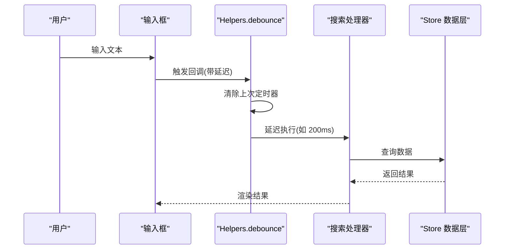
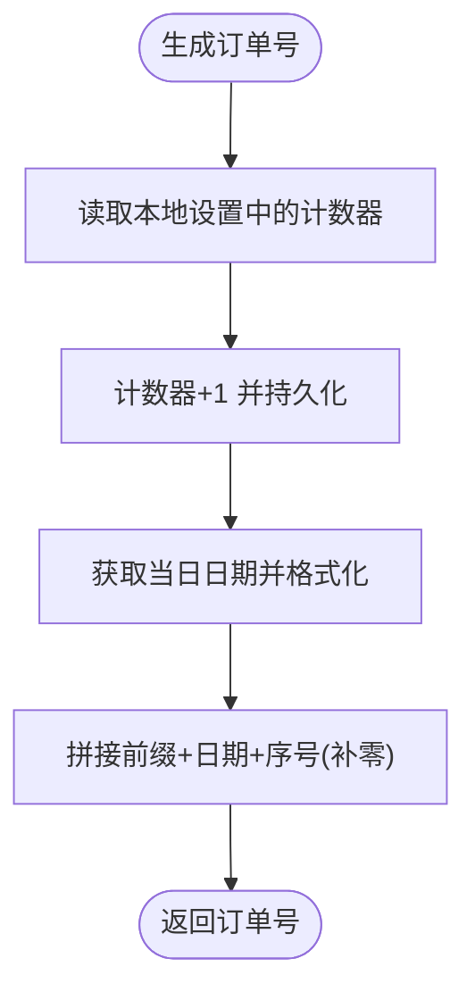
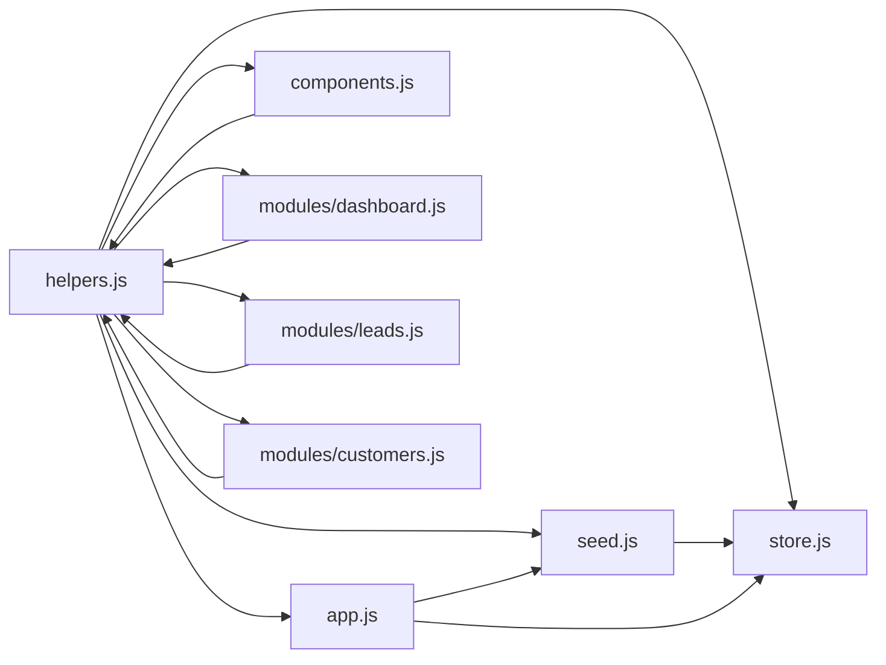

# 工具函数库

<cite>
**本文档引用的文件**
- [helpers.js](file://js/utils/helpers.js)
- [seed.js](file://js/utils/seed.js)
- [app.js](file://js/app.js)
- [store.js](file://js/store.js)
- [components.js](file://js/components.js)
- [dashboard.js](file://js/modules/dashboard.js)
- [leads.js](file://js/modules/leads.js)
- [customers.js](file://js/modules/customers.js)
</cite>

## 目录
1. [简介](#简介)
2. [项目结构](#项目结构)
3. [核心组件](#核心组件)
4. [架构总览](#架构总览)
5. [详细组件分析](#详细组件分析)
6. [依赖分析](#依赖分析)
7. [性能考虑](#性能考虑)
8. [故障排除指南](#故障排除指南)
9. [结论](#结论)
10. [附录](#附录)

## 简介
本文件为 CRM 系统的工具函数库文档，聚焦于以下方面：
- 辅助工具函数的功能与使用方法：ID 生成器、数据格式化、防抖优化、HTML 转义、截断文本、颜色哈希、相对时间、订单号生成等
- 演示数据生成器的实现原理与使用场景：如何在首次运行时注入演示数据，并与订单号生成器协同工作
- 设计原则与性能考量：可复用性、安全性、可维护性与性能优化策略
- 扩展方法与自定义选项：如何基于现有工具函数扩展新的格式化规则或生成策略
- 在整个系统中的作用与重要性：贯穿应用初始化、页面渲染、数据交互与演示数据注入的关键支撑

## 项目结构
工具函数库位于 js/utils 目录下，主要包含两个核心模块：
- helpers.js：提供通用工具函数集合，被多个模块广泛调用
- seed.js：提供演示数据注入逻辑，配合 Store 和 Helpers 使用

图表来源
- [helpers.js:1-113](file://js/utils/helpers.js#L1-L113)
- [seed.js:1-142](file://js/utils/seed.js#L1-L142)
- [app.js:1-316](file://js/app.js#L1-L316)
- [store.js:1-139](file://js/store.js#L1-L139)
- [components.js:1-324](file://js/components.js#L1-L324)
- [dashboard.js:1-220](file://js/modules/dashboard.js#L1-L220)
- [leads.js:1-200](file://js/modules/leads.js#L1-L200)
- [customers.js:1-200](file://js/modules/customers.js#L1-L200)

章节来源
- [helpers.js:1-113](file://js/utils/helpers.js#L1-L113)
- [seed.js:1-142](file://js/utils/seed.js#L1-L142)
- [app.js:1-316](file://js/app.js#L1-L316)

## 核心组件
本节概述工具函数库提供的核心能力及其典型用途。

- ID 生成器
  - 用途：为新增记录生成唯一标识符，避免冲突
  - 典型调用：Store.create 中用于生成记录 id
  - 复杂度：O(1)，性能优异
- 日期与时间格式化
  - 用途：统一日期、时间、相对时间的展示格式
  - 典型调用：Dashboard、Leads、Customers 等模块渲染时间字段
  - 复杂度：O(1)
- 金额格式化
  - 用途：本地化货币格式与简写展示
  - 典型调用：全局搜索结果、看板统计、列表列渲染
  - 复杂度：O(1)
- 订单编号生成
  - 用途：生成带日期与递增序号的订单号
  - 典型调用：SeedData 注入订单时生成订单号
  - 复杂度：O(1)
- 防抖优化
  - 用途：降低高频输入事件的处理频率，提升交互流畅度
  - 典型调用：全局搜索、数据表格搜索
  - 复杂度：O(1)
- 文本处理
  - HTML 转义：防止 XSS 攻击
  - 截断文本：控制显示长度
  - 名字首字：生成头像占位字符
  - 颜色哈希：根据字符串生成稳定颜色
  - 复杂度：O(n)，n 为字符串长度
- 便捷时间
  - 今日日期字符串与 ISO 时间戳，便于快速获取当前时间

章节来源
- [helpers.js:1-113](file://js/utils/helpers.js#L1-L113)
- [store.js:54-85](file://js/store.js#L54-L85)
- [seed.js:98-109](file://js/utils/seed.js#L98-L109)

## 架构总览
工具函数库在系统中的角色是“基础设施层”，向上支撑应用入口、模块与组件，向下与数据层协作。其关键交互如下：

图表来源
- [app.js:6-41](file://js/app.js#L6-L41)
- [seed.js:10-134](file://js/utils/seed.js#L10-L134)
- [store.js:54-96](file://js/store.js#L54-L96)
- [helpers.js:6-111](file://js/utils/helpers.js#L6-L111)
- [components.js:186-200](file://js/components.js#L186-L200)

## 详细组件分析

### 工具函数集合（Helpers）
该集合以对象形式集中管理各类工具函数，具备高内聚、低耦合的特点，便于跨模块复用。

图表来源
- [helpers.js:4-113](file://js/utils/helpers.js#L4-L113)

使用场景与示例路径
- ID 生成：在 Store.create 中生成记录 id
  - 示例路径：[store.js:59](file://js/store.js#L59)
- 日期格式化：在 Dashboard、Leads、Customers 的渲染中使用
  - 示例路径：[dashboard.js:89](file://js/modules/dashboard.js#L89), [leads.js:51](file://js/modules/leads.js#L51), [customers.js:62](file://js/modules/customers.js#L62)
- 金额格式化：在全局搜索结果、看板统计中使用
  - 示例路径：[app.js:95](file://js/app.js#L95), [dashboard.js:89](file://js/modules/dashboard.js#L89)
- 订单号生成：在 SeedData 注入订单时使用
  - 示例路径：[seed.js:99](file://js/utils/seed.js#L99)
- 防抖：在全局搜索与数据表格搜索中使用
  - 示例路径：[app.js:70](file://js/app.js#L70), [components.js:187](file://js/components.js#L187)
- HTML 转义：在组件渲染中保护输出安全
  - 示例路径：[components.js:74](file://js/components.js#L74), [components.js:97](file://js/components.js#L97)
- 截断文本：在活动列表中限制显示长度
  - 示例路径：[dashboard.js:191](file://js/modules/dashboard.js#L191)
- 颜色哈希：为标签/头像提供稳定配色
  - 示例路径：[helpers.js:93-101](file://js/utils/helpers.js#L93-L101)
- 今日日期与时间戳：用于导出文件命名与数据时间记录
  - 示例路径：[app.js:242](file://js/app.js#L242), [store.js:56](file://js/store.js#L56)

章节来源
- [helpers.js:4-113](file://js/utils/helpers.js#L4-L113)
- [store.js:54-85](file://js/store.js#L54-L85)
- [app.js:69-160](file://js/app.js#L69-L160)
- [components.js:184-200](file://js/components.js#L184-L200)
- [dashboard.js:89-191](file://js/modules/dashboard.js#L89-L191)
- [leads.js:44-76](file://js/modules/leads.js#L44-L76)
- [customers.js:45-82](file://js/modules/customers.js#L45-L82)

### 演示数据生成器（SeedData）
该模块负责在首次运行时注入演示数据，确保用户能直接体验系统功能。其核心流程包括：
- 判断是否为空数据集（通过 Store.isEmpty）
- 生成产品、线索、客户、联系人、商机、订单、跟进记录
- 与订单号生成器协同，保证订单编号唯一且有序
- 更新线索状态与关联关系，形成闭环

图表来源
- [seed.js:6-142](file://js/utils/seed.js#L6-L142)
- [helpers.js:52-61](file://js/utils/helpers.js#L52-L61)

使用场景与示例路径
- 首次运行注入：App.init 中调用 SeedData.seed
  - 示例路径：[app.js:7-8](file://js/app.js#L7-L8)
- 重置演示数据：设置页中清空数据并重新注入
  - 示例路径：[app.js:284-292](file://js/app.js#L284-L292)
- 订单号生成：SeedData 在创建订单时调用 Helpers.generateOrderNo
  - 示例路径：[seed.js:99](file://js/utils/seed.js#L99)

章节来源
- [seed.js:6-142](file://js/utils/seed.js#L6-L142)
- [app.js:6-41](file://js/app.js#L6-L41)

### 防抖优化（Debounce）
防抖函数通过延迟执行回调，减少高频事件触发带来的性能压力。在全局搜索与数据表格搜索中广泛应用。

图表来源
- [helpers.js:63-70](file://js/utils/helpers.js#L63-L70)
- [app.js:70-142](file://js/app.js#L70-L142)
- [components.js:186-200](file://js/components.js#L186-L200)

使用场景与示例路径
- 全局搜索：在 App.bindGlobalSearch 中使用防抖
  - 示例路径：[app.js:70-142](file://js/app.js#L70-L142)
- 数据表格搜索：在 Components.DataTable 中使用防抖
  - 示例路径：[components.js:186-200](file://js/components.js#L186-L200)

章节来源
- [helpers.js:63-70](file://js/utils/helpers.js#L63-L70)
- [app.js:70-142](file://js/app.js#L70-L142)
- [components.js:184-200](file://js/components.js#L184-L200)

### 订单编号生成器（OrderNo）
订单编号采用“前缀-日期-序号”的格式，序号来自本地存储的计数器，确保全局唯一且递增。

图表来源
- [helpers.js:52-61](file://js/utils/helpers.js#L52-L61)
- [seed.js:98-109](file://js/utils/seed.js#L98-L109)

使用场景与示例路径
- 注入订单：SeedData 在创建订单时调用
  - 示例路径：[seed.js:99](file://js/utils/seed.js#L99)

章节来源
- [helpers.js:52-61](file://js/utils/helpers.js#L52-L61)
- [seed.js:98-109](file://js/utils/seed.js#L98-L109)

## 依赖分析
工具函数库的依赖关系清晰，耦合度低，便于维护与扩展。

图表来源
- [helpers.js:1-113](file://js/utils/helpers.js#L1-L113)
- [seed.js:1-142](file://js/utils/seed.js#L1-L142)
- [store.js:1-139](file://js/store.js#L1-L139)
- [app.js:1-316](file://js/app.js#L1-L316)
- [components.js:1-324](file://js/components.js#L1-L324)
- [dashboard.js:1-220](file://js/modules/dashboard.js#L1-L220)
- [leads.js:1-200](file://js/modules/leads.js#L1-L200)
- [customers.js:1-200](file://js/modules/customers.js#L1-L200)

章节来源
- [helpers.js:1-113](file://js/utils/helpers.js#L1-L113)
- [seed.js:1-142](file://js/utils/seed.js#L1-L142)
- [store.js:1-139](file://js/store.js#L1-L139)
- [app.js:1-316](file://js/app.js#L1-L316)
- [components.js:1-324](file://js/components.js#L1-L324)
- [dashboard.js:1-220](file://js/modules/dashboard.js#L1-L220)
- [leads.js:1-200](file://js/modules/leads.js#L1-L200)
- [customers.js:1-200](file://js/modules/customers.js#L1-L200)

## 性能考虑
- 防抖策略
  - 在高频输入场景（如搜索）中显著降低计算与渲染次数，建议根据实际场景调整延迟参数
- 本地存储与缓存
  - Store 对集合进行内存缓存，减少重复读取；同时使用本地存储持久化，注意容量限制与异常处理
- 字符串处理
  - HTML 转义与截断操作复杂度线性于字符串长度，建议在大量数据渲染时批量处理或分页
- 日期与金额格式化
  - 采用本地化 API，性能稳定；在大数据量渲染时可考虑虚拟滚动或懒加载

## 故障排除指南
- 防抖无效或频繁触发
  - 检查回调函数是否正确绑定上下文与参数
  - 确认延迟参数是否合理，避免过短导致抖动仍频繁
- 订单号重复或不连续
  - 检查本地存储计数器是否被意外重置
  - 确认日期格式与序号补零逻辑一致
- HTML 输出异常或存在安全风险
  - 确保所有用户输入均经过 Helpers.escapeHtml 处理
- 搜索结果不准确
  - 检查搜索字段与过滤条件是否匹配
  - 确认防抖延迟设置是否影响实时性

章节来源
- [helpers.js:63-70](file://js/utils/helpers.js#L63-L70)
- [helpers.js:78-84](file://js/utils/helpers.js#L78-L84)
- [store.js:23-30](file://js/store.js#L23-L30)

## 结论
工具函数库在 CRM 系统中扮演着“基础设施”的关键角色，提供了统一的数据格式化、ID 生成、防抖优化与演示数据注入能力。其设计遵循高内聚、低耦合的原则，广泛应用于应用入口、模块与组件中，显著提升了系统的可维护性与用户体验。通过合理的性能优化与安全防护，工具函数库能够稳定支撑业务发展与功能扩展。

## 附录
- 扩展方法与自定义选项
  - 新增格式化规则：在 Helpers 中添加新的格式化函数，遵循现有命名与返回值规范
  - 自定义防抖延迟：根据业务场景调整延迟参数，平衡响应速度与性能
  - 订单号策略扩展：可在 Helpers.generateOrderNo 中增加前缀或规则变体
  - 安全增强：在所有用户输入输出处统一使用 HTML 转义与输入校验
- 最佳实践
  - 在模块间共享工具函数时，优先使用 Helpers，避免重复实现
  - 对高频事件使用防抖，对一次性操作保持即时响应
  - 在数据持久化前进行必要的校验与清理，确保数据一致性