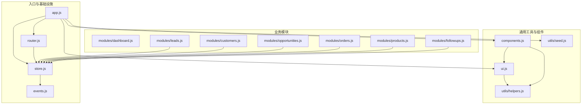
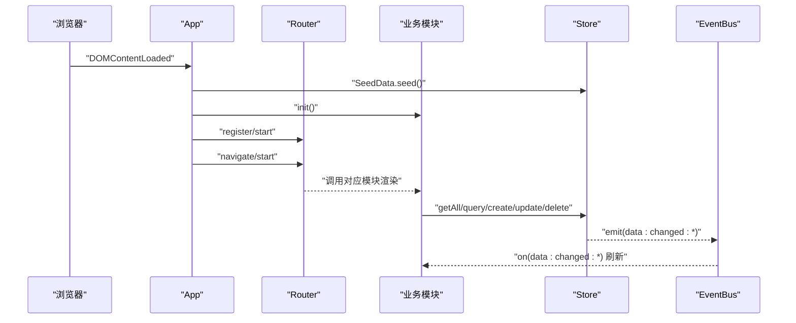
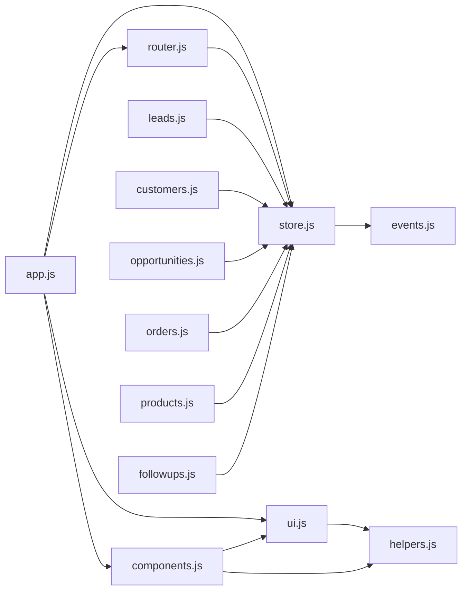

# 代码规范

<cite>
**本文引用的文件**
- [js/app.js](file://js/app.js)
- [js/components.js](file://js/components.js)
- [js/router.js](file://js/router.js)
- [js/store.js](file://js/store.js)
- [js/events.js](file://js/events.js)
- [js/ui.js](file://js/ui.js)
- [js/utils/helpers.js](file://js/utils/helpers.js)
- [js/utils/seed.js](file://js/utils/seed.js)
- [js/modules/dashboard.js](file://js/modules/dashboard.js)
- [js/modules/customers.js](file://js/modules/customers.js)
- [js/modules/products.js](file://js/modules/products.js)
- [js/modules/leads.js](file://js/modules/leads.js)
- [js/modules/opportunities.js](file://js/modules/opportunities.js)
- [js/modules/orders.js](file://js/modules/orders.js)
- [js/modules/followups.js](file://js/modules/followups.js)
</cite>

## 目录
1. [引言](#引言)
2. [项目结构](#项目结构)
3. [核心组件](#核心组件)
4. [架构总览](#架构总览)
5. [详细组件分析](#详细组件分析)
6. [依赖分析](#依赖分析)
7. [性能考虑](#性能考虑)
8. [故障排查指南](#故障排查指南)
9. [结论](#结论)
10. [附录：代码规范与最佳实践](#附录代码规范与最佳实践)

## 引言
本文件面向CRM系统的前端JavaScript代码，提供一套统一的编码规范与最佳实践，涵盖ES6+语法使用、变量与函数命名、注释规范、代码组织原则、格式化标准、错误处理与异常抛出、以及代码审查清单与质量保障标准。目标是提升代码一致性、可读性、可维护性与可扩展性。

## 项目结构
项目采用“按功能模块划分”的组织方式，核心入口与基础设施位于js根目录，业务模块集中在modules目录，通用工具与辅助函数位于utils目录，通用UI组件与通用组件封装位于components.js与ui.js中，路由与事件总线分别由router.js与events.js提供。

图表来源
- [js/app.js:1-316](file://js/app.js#L1-L316)
- [js/router.js:1-62](file://js/router.js#L1-L62)
- [js/store.js:1-139](file://js/store.js#L1-L139)
- [js/events.js:1-36](file://js/events.js#L1-L36)
- [js/ui.js:1-364](file://js/ui.js#L1-L364)
- [js/utils/helpers.js:1-113](file://js/utils/helpers.js#L1-L113)
- [js/utils/seed.js:1-142](file://js/utils/seed.js#L1-L142)
- [js/components.js:1-324](file://js/components.js#L1-L324)
- [js/modules/dashboard.js:1-220](file://js/modules/dashboard.js#L1-L220)
- [js/modules/leads.js:1-286](file://js/modules/leads.js#L1-L286)
- [js/modules/customers.js:1-229](file://js/modules/customers.js#L1-L229)
- [js/modules/opportunities.js:1-485](file://js/modules/opportunities.js#L1-L485)
- [js/modules/orders.js:1-234](file://js/modules/orders.js#L1-L234)
- [js/modules/products.js:1-175](file://js/modules/products.js#L1-L175)
- [js/modules/followups.js:1-189](file://js/modules/followups.js#L1-L189)

章节来源
- [js/app.js:1-316](file://js/app.js#L1-L316)
- [js/router.js:1-62](file://js/router.js#L1-L62)
- [js/store.js:1-139](file://js/store.js#L1-L139)
- [js/events.js:1-36](file://js/events.js#L1-L36)
- [js/ui.js:1-364](file://js/ui.js#L1-L364)
- [js/utils/helpers.js:1-113](file://js/utils/helpers.js#L1-L113)
- [js/utils/seed.js:1-142](file://js/utils/seed.js#L1-L142)
- [js/components.js:1-324](file://js/components.js#L1-L324)
- [js/modules/dashboard.js:1-220](file://js/modules/dashboard.js#L1-L220)
- [js/modules/leads.js:1-286](file://js/modules/leads.js#L1-L286)
- [js/modules/customers.js:1-229](file://js/modules/customers.js#L1-L229)
- [js/modules/opportunities.js:1-485](file://js/modules/opportunities.js#L1-L485)
- [js/modules/orders.js:1-234](file://js/modules/orders.js#L1-L234)
- [js/modules/products.js:1-175](file://js/modules/products.js#L1-L175)
- [js/modules/followups.js:1-189](file://js/modules/followups.js#L1-L189)

## 核心组件
- 应用入口与初始化：负责注入演示数据、初始化各模块、注册路由、绑定导航与搜索、启动路由与事件监听。
- 路由系统：基于hash的轻量路由，支持模式匹配、参数提取、编程式导航与hash变化监听。
- 数据层：基于localStorage的简单持久化，提供集合缓存、增删改查、导入导出、清空等能力，并通过事件总线广播数据变更。
- 事件总线：发布订阅模式，支持通配符事件，便于模块间解耦通信。
- UI工具：Toast、模态框、确认框、表单构建与校验、面包屑与页面标题设置、内容渲染。
- 通用组件：数据表格、状态标签、详情卡片、标签页等，提供搜索、排序、分页、筛选等交互能力。
- 工具函数：ID生成、日期与金额格式化、防抖、截断、HTML转义、颜色哈希、时间戳等。
- 演示数据：按业务实体注入初始数据，确保首次运行可用。

章节来源
- [js/app.js:1-316](file://js/app.js#L1-L316)
- [js/router.js:1-62](file://js/router.js#L1-L62)
- [js/store.js:1-139](file://js/store.js#L1-L139)
- [js/events.js:1-36](file://js/events.js#L1-L36)
- [js/ui.js:1-364](file://js/ui.js#L1-L364)
- [js/components.js:1-324](file://js/components.js#L1-L324)
- [js/utils/helpers.js:1-113](file://js/utils/helpers.js#L1-L113)
- [js/utils/seed.js:1-142](file://js/utils/seed.js#L1-L142)

## 架构总览
系统采用“模块化+事件驱动”的前端架构：
- 模块化：每个业务模块独立实现init、render、路由注册与数据交互。
- 事件驱动：通过EventBus在数据变更、导入、清空等场景下广播事件，模块响应刷新。
- UI与组件：UI负责交互体验，通用组件提供可复用的表格、标签、卡片等。
- 数据流：Store作为单一数据源，提供CRUD与查询；Router控制页面导航；App协调模块初始化与事件绑定。

图表来源
- [js/app.js:1-316](file://js/app.js#L1-L316)
- [js/router.js:1-62](file://js/router.js#L1-L62)
- [js/store.js:1-139](file://js/store.js#L1-L139)
- [js/events.js:1-36](file://js/events.js#L1-L36)
- [js/modules/dashboard.js:1-220](file://js/modules/dashboard.js#L1-L220)
- [js/modules/leads.js:1-286](file://js/modules/leads.js#L1-L286)
- [js/modules/customers.js:1-229](file://js/modules/customers.js#L1-L229)
- [js/modules/opportunities.js:1-485](file://js/modules/opportunities.js#L1-L485)
- [js/modules/orders.js:1-234](file://js/modules/orders.js#L1-L234)
- [js/modules/products.js:1-175](file://js/modules/products.js#L1-L175)
- [js/modules/followups.js:1-189](file://js/modules/followups.js#L1-L189)

## 详细组件分析

### 应用入口 App
- 责任边界：应用初始化、模块注册、导航绑定、搜索绑定、移动端侧边栏、路由启动与导航高亮。
- 关键流程：注入种子数据 -> 初始化模块 -> 注册设置路由 -> 绑定导航/搜索/侧边栏 -> 启动路由 -> 监听路由变化更新导航高亮。
- 注意点：全局搜索使用防抖；移动端侧边栏点击遮罩关闭；路由变化通过事件总线通知。

章节来源
- [js/app.js:1-316](file://js/app.js#L1-L316)

### 路由系统 Router
- 模式匹配：支持路径参数(:id)，解析hash并匹配正则，提取命名组参数。
- 导航控制：navigate支持相同hash的手动触发；start监听hashchange并解析。
- 未匹配处理：默认跳转到仪表盘。

章节来源
- [js/router.js:1-62](file://js/router.js#L1-L62)

### 数据层 Store
- 缓存策略：按集合缓存于内存，避免重复读取localStorage。
- 持久化：保存时捕获存储空间不足等异常，提示用户。
- 事件广播：create/update/delete后通过EventBus广播事件，便于模块响应。
- 导入导出：支持全量导出与导入，清空指定集合或全部集合。

章节来源
- [js/store.js:1-139](file://js/store.js#L1-L139)

### 事件总线 EventBus
- 发布订阅：on返回解绑函数；支持通配符事件（如data:changed:*）。
- 清理：clear清空监听器。

章节来源
- [js/events.js:1-36](file://js/events.js#L1-L36)

### 通用组件 Components
- DataTable：提供搜索、排序、分页、筛选、行点击、操作按钮等能力；支持自定义列渲染与工具栏扩展。
- Badge：状态标签组件。
- DetailCard：详情字段展示。
- Tabs：标签页切换与内容渲染。

章节来源
- [js/components.js:1-324](file://js/components.js#L1-L324)

### UI 工具 UI
- 图标库：SVG图标常量，支持按尺寸输出。
- Toast：通知展示，支持类型映射与自动移除。
- Modal/Confirm/FormModal：模态框、确认框、表单构建与校验、回车提交。
- 表单校验：必填字段、错误样式与错误消息、标签输入处理。
- 页面标题与面包屑：setPageTitle支持面包屑与汉堡菜单绑定。

章节来源
- [js/ui.js:1-364](file://js/ui.js#L1-L364)

### 工具函数 Helpers
- ID生成、日期/时间格式化、相对时间、金额格式化、订单号生成、防抖、截断、HTML转义、首字母、颜色哈希、今日日期、ISO时间戳。

章节来源
- [js/utils/helpers.js:1-113](file://js/utils/helpers.js#L1-L113)

### 演示数据 SeedData
- 条件注入：当Store为空时注入演示数据。
- 数据关系：产品、线索、客户、联系人、商机、订单、跟进记录的完整链路。
- 时间与状态：随机时间、状态推进、订单号生成。

章节来源
- [js/utils/seed.js:1-142](file://js/utils/seed.js#L1-L142)

### 业务模块（以 Leads 为例）
- 字段定义：FIELDS定义表单字段与渲染规则。
- 列表页：DataTable集成搜索、筛选、排序、动作按钮、行点击跳转。
- 详情页：Tabs分页展示基本信息与跟进记录；支持转化客户、删除等操作。
- 转化流程：线索转化为客户，自动创建联系人与跟进记录。

章节来源
- [js/modules/leads.js:1-286](file://js/modules/leads.js#L1-L286)

### 业务模块（以 Opportunities 为例）
- 阶段管理：STAGES与概率映射；阶段推进与Win/Lose处理。
- 赢单流程：弹窗创建订单，填充产品明细、计算小计与合计，更新商机状态并创建跟进记录。
- 子列表：嵌入客户详情页展示商机列表。

章节来源
- [js/modules/opportunities.js:1-485](file://js/modules/opportunities.js#L1-L485)

### 业务模块（以 Orders 为例）
- 列表页：按状态筛选、金额汇总、订单号等字段展示。
- 详情页：基本信息、订单明细、合计金额；支持编辑与删除。
- 子列表：嵌入客户详情页展示订单列表。

章节来源
- [js/modules/orders.js:1-234](file://js/modules/orders.js#L1-L234)

### 业务模块（以 FollowUps 为例）
- 列表页：按关联类型与对象展示跟进记录，支持删除。
- 时间线：在详情页内嵌时间线展示，支持添加跟进。
- 动态关联：未提供关联信息时，表单动态选择关联类型与对象。

章节来源
- [js/modules/followups.js:1-189](file://js/modules/followups.js#L1-L189)

### 业务模块（以 Customers/Products/Dashboard 为例）
- Customers：客户管理，支持标签、状态、商机/订单/联系人/跟进统计。
- Products：产品管理，支持分类、价格、状态、搜索与排序。
- Dashboard：看板统计、销售漏斗、线索来源分布、待办提醒、最近活动。

章节来源
- [js/modules/customers.js:1-229](file://js/modules/customers.js#L1-L229)
- [js/modules/products.js:1-175](file://js/modules/products.js#L1-L175)
- [js/modules/dashboard.js:1-220](file://js/modules/dashboard.js#L1-L220)

## 依赖分析
- 模块耦合：各业务模块依赖Store与UI；Router负责导航；EventBus负责跨模块通信。
- 外部依赖：无第三方库，纯原生JS与DOM API。
- 可能的循环依赖：当前结构未见明显循环依赖；若新增模块需避免相互require/init。

图表来源
- [js/app.js:1-316](file://js/app.js#L1-L316)
- [js/router.js:1-62](file://js/router.js#L1-L62)
- [js/store.js:1-139](file://js/store.js#L1-L139)
- [js/events.js:1-36](file://js/events.js#L1-L36)
- [js/ui.js:1-364](file://js/ui.js#L1-L364)
- [js/utils/helpers.js:1-113](file://js/utils/helpers.js#L1-L113)
- [js/components.js:1-324](file://js/components.js#L1-L324)
- [js/modules/leads.js:1-286](file://js/modules/leads.js#L1-L286)
- [js/modules/customers.js:1-229](file://js/modules/customers.js#L1-L229)
- [js/modules/opportunities.js:1-485](file://js/modules/opportunities.js#L1-L485)
- [js/modules/orders.js:1-234](file://js/modules/orders.js#L1-L234)
- [js/modules/products.js:1-175](file://js/modules/products.js#L1-L175)
- [js/modules/followups.js:1-189](file://js/modules/followups.js#L1-L189)

## 性能考虑
- 渲染优化：DataTable内置防抖搜索、分页与排序，减少DOM操作与重排。
- 缓存策略：Store对集合进行内存缓存，降低localStorage访问频率。
- 事件节流：全局搜索使用防抖，避免高频输入导致的重复渲染。
- 本地存储：保存失败时提示用户，避免阻塞主线程。
- 按需渲染：UI.render根据传入类型决定字符串或DOM节点插入，减少不必要的模板拼接。

[本节为通用指导，无需列出具体文件来源]

## 故障排查指南
- 路由不生效：检查Router.register与Router.start是否正确调用；确认hash变化监听是否触发。
- 数据不更新：确认Store的create/update/delete是否调用EventBus.emit；模块是否监听对应事件并刷新。
- 搜索无结果：检查DataTable的searchKeys与applySearch逻辑；确认输入值大小写与过滤条件。
- 本地存储异常：Store保存时捕获异常并提示；检查浏览器存储容量与权限。
- 表单校验失败：确认UI.getFormData中的必填字段与错误提示逻辑；检查标签输入与表单元素命名。

章节来源
- [js/router.js:1-62](file://js/router.js#L1-L62)
- [js/store.js:1-139](file://js/store.js#L1-L139)
- [js/ui.js:1-364](file://js/ui.js#L1-L364)
- [js/components.js:1-324](file://js/components.js#L1-L324)

## 结论
本规范文档总结了CRM系统前端的编码风格、模块职责、数据流与交互模式，提供了可操作的格式化、注释与错误处理建议，并给出了代码审查清单与质量保障要点。遵循这些规范有助于团队协作、代码质量与长期演进。

[本节为总结性内容，无需列出具体文件来源]

## 附录：代码规范与最佳实践

### ES6+ 语法使用规范
- 使用const/let声明变量，优先const，避免var。
- 使用箭头函数简化回调与事件处理器。
- 使用模板字符串替代字符串拼接。
- 使用解构赋值与展开运算符简化对象/数组处理。
- 使用类与模块化组织业务逻辑（如UI、Components等）。

[本节为通用规范，无需列出具体文件来源]

### 命名约定
- 常量：全大写下划线分隔（如UI.icons、STATUS_MAP）。
- 变量：驼峰命名（如filteredData、currentSortKey）。
- 函数：动词短语或名词短语（如formatMoney、bindNavigation）。
- 类/模块：帕斯卡命名（如UI、Components、Helpers、Store）。
- 模块常量：模块内常量使用大写（如COLLECTION、FIELDS）。

[本节为通用规范，无需列出具体文件来源]

### 注释标准
- 文件头部注释：简述模块用途与职责。
- 函数注释：说明参数、返回值、副作用与注意事项。
- 复杂逻辑注释：对算法、状态机、数据转换过程进行步骤说明。
- TODO/NOTE注释：明确问题与后续计划。

[本节为通用规范，无需列出具体文件来源]

### 代码组织原则
- 模块导入导出：每个模块自包含init/render/字段定义；通过App集中注册与启动。
- 文件命名：模块文件使用小驼峰或复数形式（如leads.js、opportunities.js），工具文件使用小驼峰（如helpers.js、seed.js）。
- 目录结构：modules按业务域划分，utils存放通用工具，components与ui提供可复用组件与UI能力。
- 路由注册：每个模块在init中注册对应路由与视图渲染。

[本节为通用规范，无需列出具体文件来源]

### 缩进、空格与换行
- 缩进：统一使用2空格缩进。
- 空行：函数之间保留空行；逻辑块之间适当空行。
- 换行：长表达式分行书写，逗号与运算符后空一格；对象/数组元素分行对齐。

[本节为通用规范，无需列出具体文件来源]

### 错误处理与异常抛出
- 本地存储异常：在Store保存时捕获并提示用户，避免抛出未处理异常。
- 表单校验：在UI.getFormData中进行必填与类型校验，返回null表示失败。
- 路由未匹配：Router默认跳转到仪表盘，避免死链。
- 事件清理：EventBus.on返回解绑函数，避免内存泄漏。

[本节为通用规范，无需列出具体文件来源]

### 代码审查检查清单
- 是否使用ES6+语法与现代特性？
- 命名是否一致且语义清晰？
- 是否存在重复代码与硬编码？
- 是否有充分的注释与复杂逻辑说明？
- 是否处理了边界情况与异常？
- 是否使用防抖/节流优化交互？
- 是否遵循模块化与单一职责原则？
- 是否使用UI与Components提供的通用能力？

[本节为通用规范，无需列出具体文件来源]