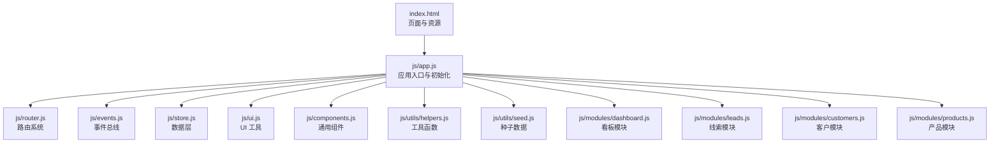
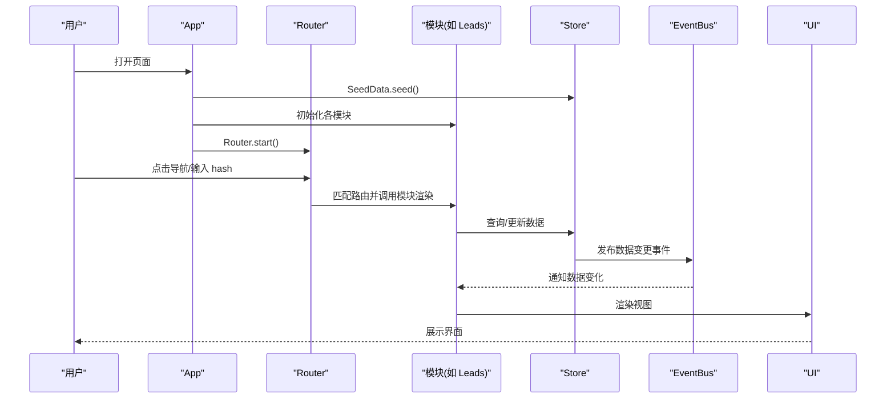
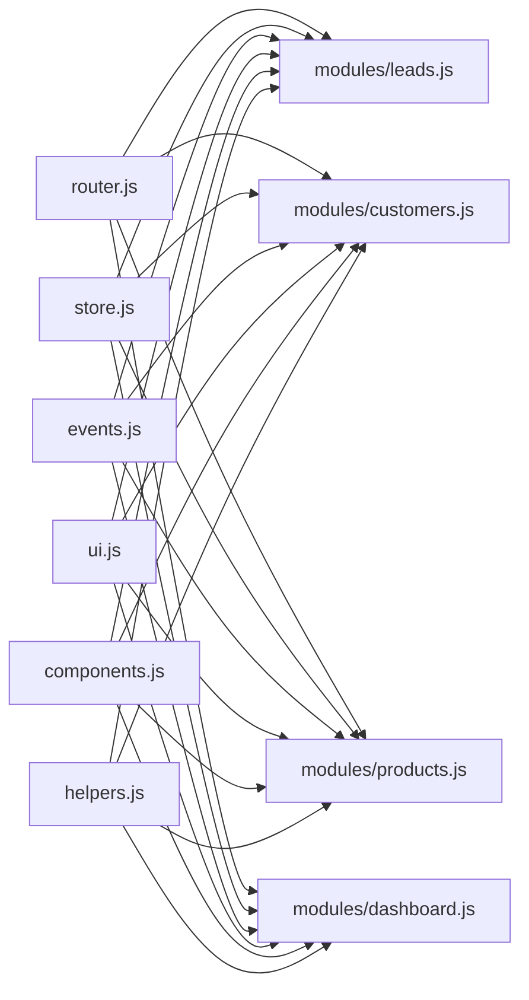

# 开发指南

<cite>
**本文引用的文件列表**
- [index.html](file://index.html)
- [app.js](file://js/app.js)
- [router.js](file://js/router.js)
- [store.js](file://js/store.js)
- [events.js](file://js/events.js)
- [ui.js](file://js/ui.js)
- [components.js](file://js/components.js)
- [helpers.js](file://js/utils/helpers.js)
- [seed.js](file://js/utils/seed.js)
- [dashboard.js](file://js/modules/dashboard.js)
- [leads.js](file://js/modules/leads.js)
- [customers.js](file://js/modules/customers.js)
- [products.js](file://js/modules/products.js)
- [base.css](file://css/base.css)
</cite>

## 目录
1. [简介](#简介)
2. [项目结构](#项目结构)
3. [核心组件](#核心组件)
4. [架构总览](#架构总览)
5. [详细组件分析](#详细组件分析)
6. [依赖关系分析](#依赖关系分析)
7. [性能与内存优化](#性能与内存优化)
8. [调试与开发工具](#调试与开发工具)
9. [扩展机制与插件开发](#扩展机制与插件开发)
10. [测试指南](#测试指南)
11. [版本控制与协作流程](#版本控制与协作流程)
12. [结论](#结论)

## 简介
本开发指南面向CRM系统的前端开发者，目标是帮助你快速理解系统架构、掌握代码规范与最佳实践，并能够高效地开发新的业务模块、调试问题、扩展系统能力、编写测试以及优化性能。本文档基于仓库中的实际代码进行分析，涵盖模块结构、事件与路由机制、UI组件与工具、数据持久化、搜索与导航、以及可扩展性与测试策略。

## 项目结构
系统采用“模块化+工具函数+UI组件”的组织方式：
- 入口与应用初始化：index.html 引入脚本顺序严格控制；js/app.js 负责启动与全局绑定。
- 路由与事件：js/router.js 提供 hash 路由；js/events.js 提供事件总线。
- 数据层：js/store.js 基于 localStorage 的 CRUD 与缓存。
- UI 与组件：js/ui.js 提供通用 UI 工具（Toast、模态框、表单、面包屑等）；js/components.js 提供通用组件（数据表格、标签页、状态标签等）。
- 工具函数：js/utils/helpers.js 提供 ID、日期、金额、防抖、截断、HTML 转义、颜色映射等工具。
- 种子数据：js/utils/seed.js 在首次运行时注入演示数据。
- 业务模块：js/modules 下的每个模块负责一个领域（如 Leads、Customers、Products、Dashboard 等），统一通过 Router 注册路由并使用 Store 与 UI 组件。

图表来源
- [index.html:110-126](file://index.html#L110-L126)
- [app.js:1-41](file://js/app.js#L1-L41)
- [router.js:1-62](file://js/router.js#L1-L62)
- [events.js:1-36](file://js/events.js#L1-L36)
- [store.js:1-139](file://js/store.js#L1-L139)
- [ui.js:1-364](file://js/ui.js#L1-L364)
- [components.js:1-324](file://js/components.js#L1-L324)
- [helpers.js:1-113](file://js/utils/helpers.js#L1-L113)
- [seed.js:1-142](file://js/utils/seed.js#L1-L142)
- [dashboard.js:1-220](file://js/modules/dashboard.js#L1-L220)
- [leads.js:1-286](file://js/modules/leads.js#L1-L286)
- [customers.js:1-229](file://js/modules/customers.js#L1-L229)
- [products.js:1-175](file://js/modules/products.js#L1-L175)

章节来源
- [index.html:1-129](file://index.html#L1-L129)
- [app.js:1-41](file://js/app.js#L1-L41)

## 核心组件
- 应用入口与初始化：负责注入种子数据、初始化各模块、注册设置路由、绑定导航与搜索、启动路由、监听路由变化更新导航高亮。
- 路由系统：支持模式匹配与参数提取，提供编程式导航与当前路由查询。
- 事件总线：支持订阅、取消订阅、广播与通配符事件。
- 数据层：提供集合缓存、CRUD、导出/导入/清空、计数与条件查询。
- UI 工具：Toast、模态框、确认框、表单构建与校验、面包屑、内容渲染。
- 通用组件：数据表格（搜索、筛选、排序、分页、操作列）、标签页、状态标签、详情卡片。
- 工具函数：ID 生成、日期/时间格式化、金额格式化、防抖、截断、HTML 转义、颜色映射、订单号生成、今日与时间戳。
- 种子数据：在空数据时注入演示数据，包含产品、线索、客户、联系人、商机、订单、跟进记录。

章节来源
- [app.js:1-316](file://js/app.js#L1-L316)
- [router.js:1-62](file://js/router.js#L1-L62)
- [events.js:1-36](file://js/events.js#L1-L36)
- [store.js:1-139](file://js/store.js#L1-L139)
- [ui.js:1-364](file://js/ui.js#L1-L364)
- [components.js:1-324](file://js/components.js#L1-L324)
- [helpers.js:1-113](file://js/utils/helpers.js#L1-L113)
- [seed.js:1-142](file://js/utils/seed.js#L1-L142)

## 架构总览
系统采用“单页应用 + 本地存储”的轻量架构：
- 视图层：index.html 提供布局与占位，js/ui.js 动态渲染内容。
- 控制层：各模块负责业务逻辑与视图渲染，通过 Router 与 EventBus 协作。
- 数据层：Store 抽象 localStorage，提供缓存与持久化。
- 交互层：UI 工具与通用组件提供一致的交互体验。

图表来源
- [app.js:1-41](file://js/app.js#L1-L41)
- [router.js:21-60](file://js/router.js#L21-L60)
- [leads.js:281-285](file://js/modules/leads.js#L281-L285)
- [store.js:53-96](file://js/store.js#L53-L96)
- [events.js:18-30](file://js/events.js#L18-L30)
- [ui.js:351-362](file://js/ui.js#L351-L362)

## 详细组件分析

### 应用入口与全局行为
- 初始化流程：注入种子数据 -> 初始化模块 -> 注册设置路由 -> 绑定导航/搜索/移动端侧边栏 -> 启动路由 -> 监听路由变化更新导航高亮。
- 全局搜索：支持跨模块搜索，使用防抖，结果点击跳转，ESC 关闭，点击外部关闭。
- 导航高亮：根据当前路由模块更新侧边栏 active 状态。

章节来源
- [app.js:1-316](file://js/app.js#L1-L316)

### 路由系统
- 支持路径参数捕获与通配符事件。
- 提供编程式导航与当前路由查询。
- hash 变化时解析并触发对应处理器，同时发布路由变更事件。

章节来源
- [router.js:1-62](file://js/router.js#L1-L62)

### 事件总线
- on/off/emit 支持通配符事件（如 data:changed:*）。
- 用于模块间解耦与数据变更通知。

章节来源
- [events.js:1-36](file://js/events.js#L1-L36)

### 数据层（Store）
- 缓存策略：按集合缓存到内存，写入时同步持久化。
- CRUD：创建/更新/删除均触发相应事件，便于模块响应。
- 导出/导入/清空：支持全量数据迁移与重置。
- 计数与查询：支持条件过滤与计数。

章节来源
- [store.js:1-139](file://js/store.js#L1-L139)

### UI 工具
- Toast：支持多种类型与自动消失。
- 模态框/确认框：统一的对话框体验，支持 ESC 关闭。
- 表单构建与校验：支持多种输入类型与必填校验。
- 面包屑与内容渲染：统一页面标题与内容区渲染。

章节来源
- [ui.js:1-364](file://js/ui.js#L1-L364)

### 通用组件
- 数据表格：搜索、筛选、排序、分页、操作列、行点击回调、刷新方法。
- 标签页：切换与内容渲染。
- 状态标签与详情卡片：简洁展示数据。

章节来源
- [components.js:1-324](file://js/components.js#L1-L324)

### 工具函数
- ID 生成、日期/时间格式化、相对时间、金额格式化、订单号生成。
- 防抖、截断、HTML 转义、颜色映射、今日与时间戳。

章节来源
- [helpers.js:1-113](file://js/utils/helpers.js#L1-L113)

### 种子数据
- 首次运行检测空数据，注入产品、线索、客户、联系人、商机、订单、跟进记录。
- 生成订单号并关联相关实体。

章节来源
- [seed.js:1-142](file://js/utils/seed.js#L1-L142)

### 业务模块示例：线索管理（Leads）
- 列表页：支持状态筛选、搜索、排序、操作列（查看/编辑/删除）、行点击跳转。
- 详情页：基本信息、跟进记录、转化客户（含预览与表单）。
- 表单：统一 UI 表单模态框，提交后刷新当前页或返回列表。
- 事件：监听数据变更以自动刷新看板。

章节来源
- [leads.js:1-286](file://js/modules/leads.js#L1-L286)

### 业务模块示例：客户管理（Customers）
- 列表页：状态筛选、搜索、商机/订单数列、操作列。
- 详情页：基本信息、联系人、商机、订单、跟进记录标签页。
- 表单：统一 UI 表单模态框，提交后刷新当前页或返回列表。

章节来源
- [customers.js:1-229](file://js/modules/customers.js#L1-L229)

### 业务模块示例：产品管理（Products）
- 列表页：搜索、排序、状态标签、操作列。
- 详情页：基本信息卡片。
- 表单：统一 UI 表单模态框，提交后刷新当前页或返回列表。

章节来源
- [products.js:1-175](file://js/modules/products.js#L1-L175)

### 业务模块示例：数据看板（Dashboard）
- 统计卡片、销售漏斗、线索来源分布、待办提醒、最近活动。
- 自动监听数据变更并在当前路由为看板时刷新。

章节来源
- [dashboard.js:1-220](file://js/modules/dashboard.js#L1-L220)

## 依赖关系分析
- 模块依赖：各模块仅依赖 Router、Store、UI、Components、Helpers；模块之间通过 EventBus 解耦。
- 初始化顺序：index.html 中脚本加载顺序决定依赖可用性，必须先加载事件、工具、数据层、路由、UI、组件，再加载各模块，最后加载种子数据与应用入口。
- 事件传播：Store 的 CRUD 操作通过 EventBus 发布事件，模块可订阅通配符事件实现响应式更新。

图表来源
- [index.html:110-126](file://index.html#L110-L126)
- [router.js:1-62](file://js/router.js#L1-L62)
- [store.js:1-139](file://js/store.js#L1-L139)
- [events.js:1-36](file://js/events.js#L1-L36)
- [ui.js:1-364](file://js/ui.js#L1-L364)
- [components.js:1-324](file://js/components.js#L1-L324)
- [helpers.js:1-113](file://js/utils/helpers.js#L1-L113)
- [leads.js:281-285](file://js/modules/leads.js#L281-L285)
- [customers.js:224-227](file://js/modules/customers.js#L224-L227)
- [products.js:170-173](file://js/modules/products.js#L170-L173)
- [dashboard.js:211-218](file://js/modules/dashboard.js#L211-L218)

## 性能与内存优化
- 防抖与节流：全局搜索使用防抖减少频繁查询；组件内部也使用防抖处理输入事件。
- 本地缓存：Store 对集合进行内存缓存，避免重复读取 localStorage。
- 事件解耦：通过 EventBus 实现模块间解耦，避免直接互相引用导致的循环依赖与内存泄漏。
- DOM 复用：UI.render 与组件渲染复用容器，避免重复创建节点。
- 内存释放：路由切换时移除搜索结果容器；模态框关闭时清理事件监听。
- 大数据处理：数据表格支持分页与排序，避免一次性渲染大量节点。

章节来源
- [app.js:63-160](file://js/app.js#L63-L160)
- [components.js:184-260](file://js/components.js#L184-L260)
- [store.js:8-30](file://js/store.js#L8-L30)
- [ui.js:48-134](file://js/ui.js#L48-L134)

## 调试与开发工具
- 浏览器控制台：App 启动日志；Store 保存失败错误提示；全局搜索与事件调试。
- 断点调试：在模块渲染函数、事件回调、路由处理器中设置断点定位问题。
- 事件追踪：通过 EventBus.on 订阅特定事件（如 data:changed:*）观察数据变更。
- 路由调试：Router.current() 与 hashchange 监听辅助定位路由问题。
- UI 辅助：UI.toast 与 UI.confirm 提供即时反馈，便于定位交互问题。

章节来源
- [app.js:40](file://js/app.js#L40)
- [store.js:24-29](file://js/store.js#L24-L29)
- [router.js:49-60](file://js/router.js#L49-L60)
- [ui.js:48-78](file://js/ui.js#L48-L78)

## 扩展机制与插件开发
- 模块化扩展：新增模块遵循现有结构，在 js/modules 下创建模块文件，实现 init() 注册路由，使用 Store 与 UI 组件。
- 事件扩展：通过 EventBus 发布/订阅事件，模块间通过事件通信，无需直接依赖。
- 组件扩展：在 components.js 中扩展通用组件，或在模块内封装专用组件。
- UI 扩展：在 ui.js 中扩展 UI 工具（如新增弹窗类型、表单控件），保持一致的交互风格。
- 数据扩展：在 store.js 中扩展 CRUD 与查询方法，确保事件一致性。

章节来源
- [dashboard.js:211-218](file://js/modules/dashboard.js#L211-L218)
- [leads.js:281-285](file://js/modules/leads.js#L281-L285)
- [customers.js:224-227](file://js/modules/customers.js#L224-L227)
- [products.js:170-173](file://js/modules/products.js#L170-L173)
- [events.js:18-30](file://js/events.js#L18-L30)
- [components.js:1-324](file://js/components.js#L1-L324)
- [ui.js:1-364](file://js/ui.js#L1-L364)
- [store.js:53-132](file://js/store.js#L53-L132)

## 测试指南
- 单元测试建议
  - 路由：验证 Router.register 与 navigate 的行为，以及参数匹配。
  - 事件：验证 EventBus.on/off/emit 与通配符事件。
  - Store：验证 CRUD、导出/导入/清空、计数与查询。
  - 工具：验证 Helpers 的格式化、防抖、转义、颜色映射。
  - UI：验证 UI.toast、UI.modal、UI.confirm、UI.formModal 的渲染与交互。
- 集成测试建议
  - 模块渲染：验证模块 init() 注册路由后，Router 能正确渲染视图。
  - 数据联动：验证 Store 的 CRUD 事件是否触发模块刷新。
  - 表单提交：验证表单模态框提交后，Store 更新并 UI 刷新。
  - 搜索与导航：验证全局搜索与侧边栏导航的行为。
- 测试环境
  - 使用浏览器或 Node 环境（结合 jsdom）模拟 DOM。
  - 使用测试框架（如 Jest、Vitest）组织测试用例。

章节来源
- [router.js:8-60](file://js/router.js#L8-L60)
- [events.js:7-34](file://js/events.js#L7-L34)
- [store.js:32-132](file://js/store.js#L32-L132)
- [helpers.js:6-113](file://js/utils/helpers.js#L6-L113)
- [ui.js:48-191](file://js/ui.js#L48-L191)
- [leads.js:281-285](file://js/modules/leads.js#L281-L285)
- [customers.js:224-227](file://js/modules/customers.js#L224-L227)
- [products.js:170-173](file://js/modules/products.js#L170-L173)

## 版本控制与协作流程
- 分支策略
  - develop：主开发分支，合并功能分支。
  - feature/*：功能开发分支，完成后合并到 develop。
  - hotfix/*：紧急修复分支，从 master 切出，修复后合并回 master 并回并到 develop。
- 提交规范
  - 类型：feat、fix、docs、style、refactor、test、chore
  - 示例：feat(leads): 添加线索状态筛选功能
- 代码审查
  - PR 至 develop，至少一名 reviewer 通过。
  - 确保新增模块遵循现有结构与命名约定。
- 发布流程
  - master：稳定版本，打标签发布。
  - develop：持续集成，自动化测试通过后合并。

章节来源
- [app.js:1-41](file://js/app.js#L1-L41)
- [router.js:1-62](file://js/router.js#L1-L62)
- [store.js:1-139](file://js/store.js#L1-L139)
- [ui.js:1-364](file://js/ui.js#L1-L364)
- [components.js:1-324](file://js/components.js#L1-L324)
- [helpers.js:1-113](file://js/utils/helpers.js#L1-L113)
- [seed.js:1-142](file://js/utils/seed.js#L1-L142)
- [dashboard.js:1-220](file://js/modules/dashboard.js#L1-L220)
- [leads.js:1-286](file://js/modules/leads.js#L1-L286)
- [customers.js:1-229](file://js/modules/customers.js#L1-L229)
- [products.js:1-175](file://js/modules/products.js#L1-L175)

## 结论
本指南总结了 CRM 系统的架构与实现要点，提供了开发新模块的方法、调试技巧、扩展机制、测试策略与协作流程。遵循现有模块结构与命名约定，利用事件总线与通用组件，可以快速、安全地扩展系统功能，并在保证性能与可维护性的前提下提升用户体验。