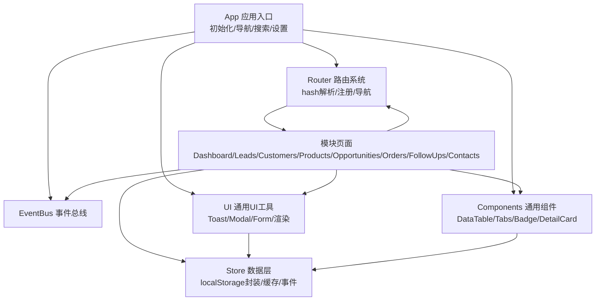
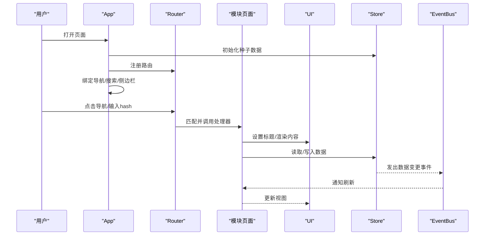
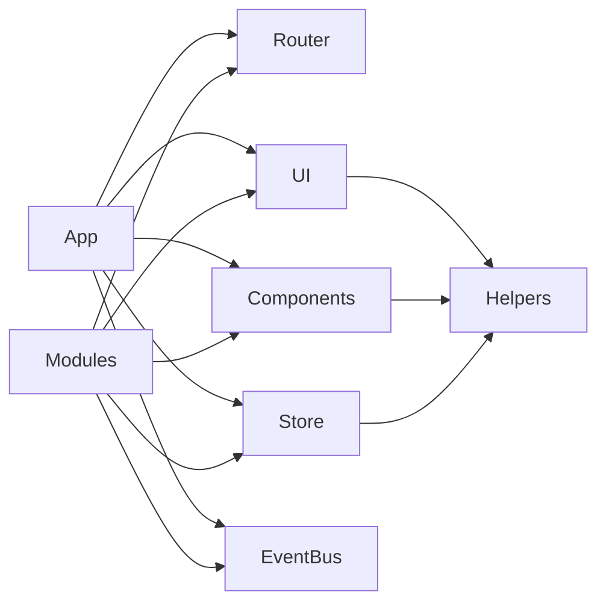

# 性能优化

<cite>
**本文引用的文件**
- [js/app.js](file://js/app.js)
- [js/store.js](file://js/store.js)
- [js/events.js](file://js/events.js)
- [js/router.js](file://js/router.js)
- [js/ui.js](file://js/ui.js)
- [js/components.js](file://js/components.js)
- [js/utils/helpers.js](file://js/utils/helpers.js)
- [js/modules/dashboard.js](file://js/modules/dashboard.js)
- [js/modules/leads.js](file://js/modules/leads.js)
- [js/modules/customers.js](file://js/modules/customers.js)
- [js/modules/products.js](file://js/modules/products.js)
- [js/modules/followups.js](file://js/modules/followups.js)
- [js/modules/opportunities.js](file://js/modules/opportunities.js)
- [js/modules/orders.js](file://js/modules/orders.js)
- [js/modules/contacts.js](file://js/modules/contacts.js)
- [js/utils/seed.js](file://js/utils/seed.js)
</cite>

## 目录
1. [引言](#引言)
2. [项目结构](#项目结构)
3. [核心组件](#核心组件)
4. [架构总览](#架构总览)
5. [详细组件分析](#详细组件分析)
6. [依赖分析](#依赖分析)
7. [性能考量](#性能考量)
8. [故障排查指南](#故障排查指南)
9. [结论](#结论)
10. [附录](#附录)

## 引言
本指南面向CRM系统的前端性能优化，围绕内存管理、DOM操作、数据处理、缓存策略、事件系统、UI渲染以及性能监控与分析等方面，结合代码库的实际实现，给出可落地的最佳实践与改进建议。目标是在保证功能完整性的前提下，提升交互流畅度、降低资源占用，并增强可维护性。

## 项目结构
系统采用模块化组织，以“入口应用 -> 路由 -> 模块页面 -> 组件/UI工具 -> 数据层”的层次化结构组织代码。入口应用负责初始化与导航绑定；路由系统基于hash实现；模块页面负责业务视图；组件与UI工具提供通用控件与交互；数据层通过本地存储持久化并提供事件总线解耦。

图表来源
- [js/app.js:1-316](file://js/app.js#L1-L316)
- [js/router.js:1-62](file://js/router.js#L1-L62)
- [js/ui.js:1-364](file://js/ui.js#L1-L364)
- [js/components.js:1-324](file://js/components.js#L1-L324)
- [js/store.js:1-139](file://js/store.js#L1-L139)
- [js/events.js:1-36](file://js/events.js#L1-L36)

章节来源
- [js/app.js:1-316](file://js/app.js#L1-L316)
- [js/router.js:1-62](file://js/router.js#L1-L62)
- [js/ui.js:1-364](file://js/ui.js#L1-L364)
- [js/components.js:1-324](file://js/components.js#L1-L324)
- [js/store.js:1-139](file://js/store.js#L1-L139)
- [js/events.js:1-36](file://js/events.js#L1-L36)

## 核心组件
- 应用入口与全局行为：初始化种子数据、模块注册、导航绑定、全局搜索、移动端侧边栏、路由变化后的导航高亮更新。
- 路由系统：基于hash的轻量路由，支持参数匹配与手动导航。
- 事件总线：发布/订阅模式，支持通配符事件，用于模块间解耦。
- 数据层：封装localStorage访问，提供缓存、增删改查、导入导出、清空等能力，并在变更时发出事件。
- UI工具：统一的Toast、Modal、Confirm、Form构建与校验、页面标题设置、内容渲染。
- 通用组件：数据表格（含搜索、筛选、排序、分页）、标签页、状态徽章、详情卡片。
- 工具函数：防抖、截断、HTML转义、ID生成、金额/日期格式化、颜色映射等。

章节来源
- [js/app.js:1-316](file://js/app.js#L1-L316)
- [js/router.js:1-62](file://js/router.js#L1-L62)
- [js/events.js:1-36](file://js/events.js#L1-L36)
- [js/store.js:1-139](file://js/store.js#L1-L139)
- [js/ui.js:1-364](file://js/ui.js#L1-L364)
- [js/components.js:1-324](file://js/components.js#L1-L324)
- [js/utils/helpers.js:1-113](file://js/utils/helpers.js#L1-L113)

## 架构总览
系统采用“单页应用 + hash路由 + 本地存储 + 事件总线”的轻量架构。模块页面通过组件与UI工具组合渲染，Store作为数据中枢，EventBus协调跨模块通信。入口应用负责全局交互与初始化。

图表来源
- [js/app.js:1-316](file://js/app.js#L1-L316)
- [js/router.js:1-62](file://js/router.js#L1-L62)
- [js/ui.js:1-364](file://js/ui.js#L1-L364)
- [js/store.js:1-139](file://js/store.js#L1-L139)
- [js/events.js:1-36](file://js/events.js#L1-L36)

## 详细组件分析

### 数据层（Store）与缓存策略
- 缓存机制：Store内部维护内存缓存，首次访问集合时从localStorage读取并缓存，后续读取直接命中内存，减少IO与JSON解析成本。
- 写入策略：每次增删改后立即同步写回localStorage，确保一致性；同时发出事件通知订阅者。
- 导入导出：支持全量导出为JSON，导入时批量写入并刷新内存缓存。
- 存储限制：写入失败时捕获异常并提示，避免崩溃影响用户体验。

优化建议
- 大数据量场景：考虑延迟批量写入，合并多次变更后再持久化，降低频繁IO。
- 缓存失效：提供显式清理或版本控制，避免脏数据导致的渲染问题。
- 存储上限：在写入前检测剩余容量，必要时提示用户清理或压缩数据。

章节来源
- [js/store.js:1-139](file://js/store.js#L1-L139)

### 事件系统（EventBus）与模块解耦
- 事件模型：on/off/emit，支持通配符事件（如“data:changed:*”），便于模块按需订阅。
- 使用场景：数据变更、路由变化、导入/清空等全局事件广播。
- 监听器管理：off支持移除特定回调，避免重复绑定造成内存泄漏。

优化建议
- 事件粒度：尽量细化事件，避免过度宽泛的通配符导致不必要的重渲染。
- 生命周期：在模块卸载时主动off移除监听，防止页面切换后残留回调。

章节来源
- [js/events.js:1-36](file://js/events.js#L1-L36)
- [js/app.js:36-38](file://js/app.js#L36-L38)

### 路由系统（Router）与导航
- 路由注册：支持静态路径与带参数路径（:id），解析hash并匹配处理器。
- 导航方式：支持编程式navigate与hashchange驱动的解析。
- 初始加载：启动时解析当前hash并执行对应处理器。

优化建议
- 防抖导航：在快速切换时避免重复渲染，可在navigate中增加去抖逻辑。
- 参数校验：在处理器中对缺失或非法参数进行兜底处理。

章节来源
- [js/router.js:1-62](file://js/router.js#L1-L62)
- [js/app.js:21-33](file://js/app.js#L21-L33)

### UI工具（UI）与交互
- Toast/Modal/Confirm：统一的提示与对话框，支持自动消失与ESC关闭。
- 表单构建与校验：动态生成表单、字段校验、错误展示与清除。
- 页面渲染：统一的渲染入口，支持字符串与DOM节点。

优化建议
- Toast复用：避免短时间内大量Toast堆积，可合并同类消息或限制最大数量。
- Modal生命周期：关闭时移除事件监听，防止内存泄漏。

章节来源
- [js/ui.js:1-364](file://js/ui.js#L1-L364)

### 通用组件（Components）
- DataTable：内置搜索、筛选、排序、分页，支持行点击与操作按钮；使用防抖处理搜索输入。
- Tabs：标签页切换与内容渲染。
- Badge/DetailCard：状态徽章与详情卡片，简化模板拼接。

优化建议
- 大表格分页：当前为前端分页，建议在数据量较大时引入虚拟滚动或服务端分页。
- 事件绑定：组件内部绑定事件时应支持销毁或复用，避免重复绑定。

章节来源
- [js/components.js:1-324](file://js/components.js#L1-L324)

### 工具函数（Helpers）
- 防抖：debounce用于高频事件（如搜索、窗口大小变化）。
- HTML转义：escapeHtml用于安全渲染，防止XSS。
- 格式化：日期、金额、相对时间等格式化工具。

优化建议
- 防抖时机：在组件内部使用时，应在组件销毁时清理定时器，避免悬挂回调。
- 字符串处理：对超长文本进行截断或懒渲染，避免主线程阻塞。

章节来源
- [js/utils/helpers.js:1-113](file://js/utils/helpers.js#L1-L113)

### 模块页面（以Leads为例）
- 列表页：使用DataTable展示线索，支持搜索、筛选、排序与分页。
- 详情页：Tab切换展示基本信息与跟进记录。
- 表单：统一的表单弹窗，提交时进行校验并调用Store写入。

优化建议
- 列表渲染：对长列表启用虚拟滚动或服务端分页，减少DOM节点数量。
- 事件委托：在表格中使用事件委托处理行点击与操作按钮，降低事件绑定数量。

章节来源
- [js/modules/leads.js:1-286](file://js/modules/leads.js#L1-L286)

### 全局搜索（App）
- 输入防抖：200ms防抖，避免频繁查询。
- 结果渲染：动态创建结果容器，支持点击跳转与ESC关闭。
- 外部点击关闭：点击文档外部自动清理结果。

优化建议
- 搜索范围：限定搜索字段与结果数量，避免跨模块全量扫描导致卡顿。
- 结果缓存：对相同关键词的结果进行短时缓存，减少重复计算。

章节来源
- [js/app.js:63-160](file://js/app.js#L63-L160)

## 依赖分析
- 模块间依赖：各模块页面依赖Router、UI、Components、Store；UI与Components依赖Helpers；App依赖Router、UI、Helpers、Store、EventBus。
- 数据流向：Store是数据唯一真相源，模块通过Store读写数据，变更后通过EventBus广播，其他模块订阅后刷新视图。
- 路由与导航：Router负责hash解析与导航，App负责绑定导航事件与侧边栏交互。

图表来源
- [js/app.js:1-316](file://js/app.js#L1-L316)
- [js/router.js:1-62](file://js/router.js#L1-L62)
- [js/ui.js:1-364](file://js/ui.js#L1-L364)
- [js/components.js:1-324](file://js/components.js#L1-L324)
- [js/store.js:1-139](file://js/store.js#L1-L139)
- [js/events.js:1-36](file://js/events.js#L1-L36)
- [js/utils/helpers.js:1-113](file://js/utils/helpers.js#L1-L113)

章节来源
- [js/app.js:1-316](file://js/app.js#L1-L316)
- [js/router.js:1-62](file://js/router.js#L1-L62)
- [js/ui.js:1-364](file://js/ui.js#L1-L364)
- [js/components.js:1-324](file://js/components.js#L1-L324)
- [js/store.js:1-139](file://js/store.js#L1-L139)
- [js/events.js:1-36](file://js/events.js#L1-L36)
- [js/utils/helpers.js:1-113](file://js/utils/helpers.js#L1-L113)

## 性能考量

### 内存管理与垃圾回收优化
- 对象生命周期管理
  - 在组件销毁或页面切换时，及时移除事件监听与定时器，避免悬挂回调与闭包持有。
  - 对于长列表渲染，使用事件委托替代逐项绑定，减少监听器数量。
- 垃圾回收优化
  - 避免在循环中创建临时对象，优先复用DOM节点与数据结构。
  - 对大数组进行分批处理，避免一次性创建过多中间对象。

### DOM操作优化
- 批量更新
  - 使用DocumentFragment或一次性innerHTML替换，减少回流与重绘。
  - 合并多次DOM修改，在最后统一提交。
- 事件委托
  - 将事件绑定在父容器上，利用冒泡处理子元素事件，降低绑定数量。
- 减少重排与重绘
  - 避免频繁读写布局属性（如offsetWidth/scrollHeight等），可先收集再批量写入。
  - 使用transform与opacity动画，避免触发布局与绘制。

### 数据处理优化
- 大数据量分页
  - 当前DataTable为前端分页，建议在数据量超过阈值时改为服务端分页或虚拟滚动。
- 虚拟滚动
  - 仅渲染可视区域内的行，滚动时动态更新可见行，显著降低DOM节点数量。
- 搜索与过滤
  - 使用防抖与结果缓存，限制搜索范围与返回数量，避免全量扫描。

### 缓存策略
- localStorage合理使用
  - Store已内置内存缓存，建议在页面切换或长时间不操作后主动清理缓存，避免内存膨胀。
  - 对热点数据（如用户偏好、最近访问）可增加短期缓存，减少IO。
- 数据缓存机制
  - 在路由切换或模块初始化时，优先使用内存缓存，再根据需要异步拉取最新数据。

### 事件系统优化
- 监听器管理
  - 在模块卸载或组件销毁时，调用off移除监听；对全局事件（如键盘、窗口）在不需要时及时解绑。
- 防抖与节流
  - 对resize、scroll、input等高频事件使用防抖/节流，减少回调频率。
  - 在组件内部使用时，确保在销毁阶段清理定时器。

### UI渲染优化
- 避免不必要的重绘与重排
  - 合理使用CSS类切换，避免频繁读取布局属性。
  - 对复杂动画使用will-change或GPU加速属性。
- 组件化与懒加载
  - 将大型组件拆分为子组件，按需渲染；对非首屏内容采用懒加载。
- 列表渲染
  - 使用key稳定标识列表项，避免无key导致的整列重排。
  - 对长列表启用虚拟滚动或分页。

### 性能监控与分析
- 关键指标
  - 首屏时间（First Contentful Paint）、交互就绪时间（Time to Interactive）、内存峰值、DOM节点数、事件监听器数量。
- 测量方法
  - 使用Performance API记录关键时间点；使用Memory API观察内存变化。
  - 通过埋点记录用户关键操作耗时（如搜索、分页、表单提交）。
- 瓶颈识别
  - 使用浏览器性能面板定位长任务、布局抖动与脚本执行热点。
  - 结合日志与Toast反馈，收集用户侧感知性能问题。

## 故障排查指南
- 页面空白或渲染异常
  - 检查Store读取是否抛错，确认localStorage可用；查看事件总线是否正确订阅。
- 搜索无响应或卡顿
  - 检查防抖参数是否合理；确认搜索范围与结果数量限制。
- 表格卡顿
  - 检查是否启用虚拟滚动或服务端分页；确认事件委托是否正确使用。
- 内存增长
  - 检查是否存在未移除的事件监听器与定时器；确认缓存策略是否合理。
- 路由跳转无效
  - 检查Router注册与hash变化监听；确认navigate调用时机。

章节来源
- [js/store.js:12-29](file://js/store.js#L12-L29)
- [js/app.js:63-160](file://js/app.js#L63-L160)
- [js/components.js:184-260](file://js/components.js#L184-L260)
- [js/router.js:54-60](file://js/router.js#L54-L60)

## 结论
本指南基于代码库现状，从内存管理、DOM操作、数据处理、缓存策略、事件系统、UI渲染与性能监控七个维度提出了优化建议。建议优先实施事件监听器清理、防抖/节流、虚拟滚动与缓存策略，以获得最明显的性能收益。后续可根据业务增长逐步引入服务端分页与更精细的性能监控体系。

## 附录
- 参考实现位置
  - 入口与导航：[js/app.js:1-316](file://js/app.js#L1-L316)
  - 路由系统：[js/router.js:1-62](file://js/router.js#L1-L62)
  - 事件总线：[js/events.js:1-36](file://js/events.js#L1-L36)
  - 数据层：[js/store.js:1-139](file://js/store.js#L1-L139)
  - UI工具：[js/ui.js:1-364](file://js/ui.js#L1-L364)
  - 通用组件：[js/components.js:1-324](file://js/components.js#L1-L324)
  - 工具函数：[js/utils/helpers.js:1-113](file://js/utils/helpers.js#L1-L113)
  - 模块页面（示例）：[js/modules/leads.js:1-286](file://js/modules/leads.js#L1-L286)
  - 种子数据：[js/utils/seed.js:1-142](file://js/utils/seed.js#L1-L142)