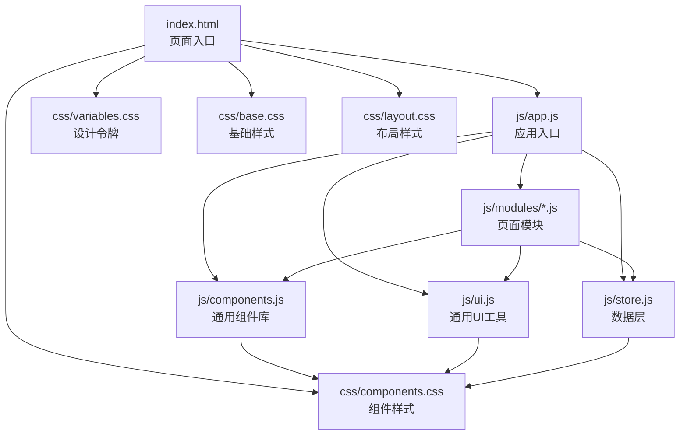
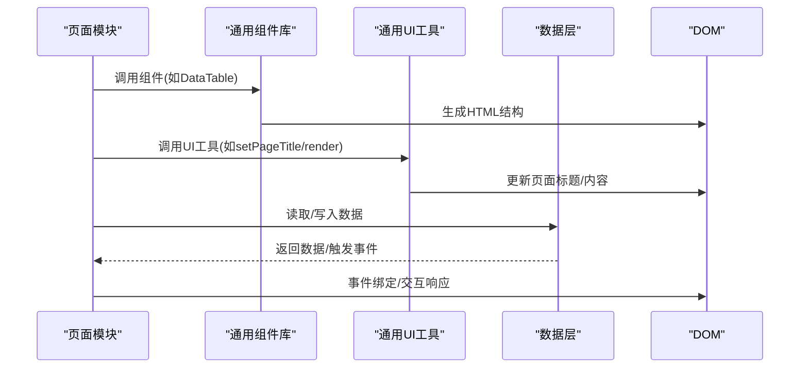
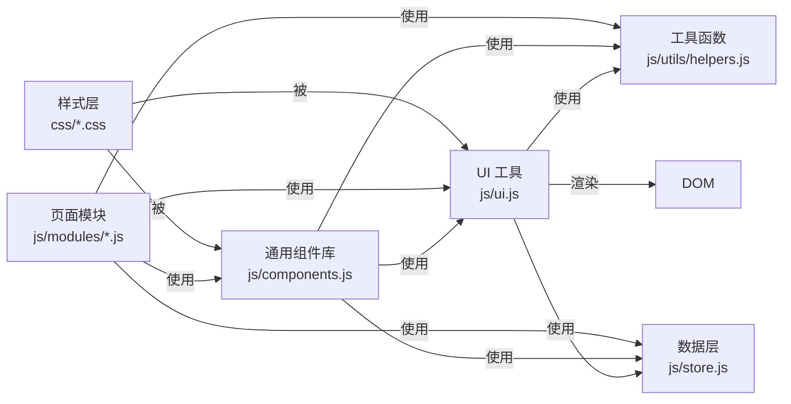

# UI组件扩展

<cite>
**本文引用的文件列表**
- [index.html](file://index.html)
- [ui.js](file://js/ui.js)
- [components.js](file://js/components.js)
- [helpers.js](file://js/utils/helpers.js)
- [store.js](file://js/store.js)
- [app.js](file://js/app.js)
- [dashboard.js](file://js/modules/dashboard.js)
- [leads.js](file://js/modules/leads.js)
- [variables.css](file://css/variables.css)
- [base.css](file://css/base.css)
- [layout.css](file://css/layout.css)
- [components.css](file://css/components.css)
</cite>

## 目录
1. [简介](#简介)
2. [项目结构](#项目结构)
3. [核心组件](#核心组件)
4. [架构总览](#架构总览)
5. [详细组件分析](#详细组件分析)
6. [依赖关系分析](#依赖关系分析)
7. [性能考量](#性能考量)
8. [故障排查指南](#故障排查指南)
9. [结论](#结论)
10. [附录](#附录)

## 简介
本指南面向希望在CRM系统中扩展UI组件的开发者，目标是帮助你：
- 了解现有UI组件体系（通用工具、通用组件、页面模块）的组织方式与实现范式
- 学会如何创建新的UI组件类型（HTML结构、CSS样式、JavaScript行为）
- 掌握组件的注册与使用方式（在页面中调用新组件）
- 规范组件样式开发（CSS变量、主题定制）
- 理解组件事件处理与数据绑定机制
- 提供可直接参考的扩展示例（图表组件、数据表格组件、表单验证组件）
- 给出组件测试与兼容性保障的实践建议

## 项目结构
该CRM系统采用“模块化前端架构”，主要由以下层次组成：
- 页面入口与资源加载：index.html
- 应用入口与初始化：js/app.js
- UI通用能力：js/ui.js（图标、Toast、模态框、表单构建等）
- 通用组件库：js/components.js（数据表格、标签页、状态标签等）
- 工具函数：js/utils/helpers.js（防抖、转义、格式化、颜色等）
- 数据层：js/store.js（本地存储封装、事件总线触发）
- 页面模块：js/modules/*.js（业务页面逻辑，如仪表盘、线索管理等）
- 样式层：css/*.css（设计令牌、基础样式、布局、组件样式）

**图表来源**
- [index.html:1-140](file://index.html#L1-L140)
- [app.js:1-316](file://js/app.js#L1-L316)
- [ui.js:1-364](file://js/ui.js#L1-L364)
- [components.js:1-324](file://js/components.js#L1-L324)
- [store.js:1-139](file://js/store.js#L1-L139)
- [variables.css:1-128](file://css/variables.css#L1-L128)
- [base.css:1-171](file://css/base.css#L1-L171)
- [layout.css:1-482](file://css/layout.css#L1-L482)
- [components.css:1-893](file://css/components.css#L1-L893)

**章节来源**
- [index.html:1-140](file://index.html#L1-L140)
- [app.js:1-316](file://js/app.js#L1-L316)

## 核心组件
本节梳理系统中的核心UI能力与组件，便于后续扩展时复用与对齐。

- 通用UI工具（UI）
  - 图标库：通过SVG字符串维护统一的图标集，支持尺寸控制
  - Toast通知：支持多种类型（成功/错误/警告/信息），自动移除
  - 模态框：支持标题、内容、尺寸、关闭回调、底部按钮
  - 确认框：基于模态框的确认对话
  - 表单模态框：自动构建表单、校验、提交
  - 表单构建器：根据字段定义生成HTML，支持多类型输入、必填、全宽等
  - 表单数据提取与校验：统一的表单验证与错误提示
  - 页面标题与面包屑：动态设置页面标题与面包屑导航
  - 内容渲染：统一的页面内容渲染接口

- 通用组件库（Components）
  - 数据表格（DataTable）：搜索、筛选、排序、分页、行点击、操作按钮、空状态
  - 状态标签（Badge）：按类型渲染不同颜色与点状徽标
  - 详情卡片（DetailCard）：键值对展示，支持自定义渲染
  - 标签页（Tabs）：切换面板，支持动态渲染

- 工具函数（Helpers）
  - 防抖、HTML转义、日期格式化、金额格式化、ID生成、颜色映射等

- 数据层（Store）
  - 封装localStorage，提供增删改查、导出导入、清空、计数、事件触发

**章节来源**
- [ui.js:1-364](file://js/ui.js#L1-L364)
- [components.js:1-324](file://js/components.js#L1-L324)
- [helpers.js:1-113](file://js/utils/helpers.js#L1-L113)
- [store.js:1-139](file://js/store.js#L1-L139)

## 架构总览
系统采用“页面模块 + 通用组件 + 通用UI工具”的分层架构：
- 页面模块负责业务场景（如仪表盘、线索管理），通过通用组件与UI工具完成界面渲染与交互
- 通用组件提供可复用的UI能力（如数据表格、标签页）
- 通用UI工具提供通用交互（如Toast、模态框、表单构建）
- 数据层通过事件总线驱动页面刷新与状态同步

**图表来源**
- [leads.js:21-86](file://js/modules/leads.js#L21-L86)
- [dashboard.js:6-209](file://js/modules/dashboard.js#L6-L209)
- [components.js:6-271](file://js/components.js#L6-L271)
- [ui.js:318-362](file://js/ui.js#L318-L362)
- [store.js:32-96](file://js/store.js#L32-L96)

## 详细组件分析

### 通用UI工具（UI）
- 功能要点
  - 图标：通过SVG字符串提供统一图标库，支持尺寸参数
  - Toast：容器懒创建、自动移除、支持类型图标与关闭按钮
  - 模态框：Overlay + Modal结构，支持尺寸、关闭回调、ESC关闭
  - 确认框：基于模态框的确认对话，支持危险/警告/成功类型
  - 表单模态框：自动构建表单、回车提交、统一校验
  - 表单构建器：支持输入框、选择框、文本域、日期、数字、标签输入等
  - 表单数据提取与校验：统一错误类名与提示位置
  - 页面标题与面包屑：支持面包屑导航与侧边栏开关
  - 内容渲染：支持字符串与DOM节点两种渲染方式

- 使用示例（路径参考）
  - [UI.setPageTitle:318-349](file://js/ui.js#L318-L349)
  - [UI.render:351-362](file://js/ui.js#L351-L362)
  - [UI.modal/UI.confirm/UI.formModal:80-191](file://js/ui.js#L80-L191)
  - [UI.buildForm/UI.getFormData:193-316](file://js/ui.js#L193-L316)

- 扩展建议
  - 新增组件时优先复用UI工具的渲染与交互能力，减少重复实现
  - 统一使用HTML转义与防抖，确保安全与性能

**章节来源**
- [ui.js:1-364](file://js/ui.js#L1-L364)

### 通用组件库（Components）
- 数据表格（DataTable）
  - 结构：工具栏（搜索、筛选、信息）、表头（可排序）、表体（空状态）、分页
  - 行为：搜索过滤、排序、分页、行点击、操作按钮（查看/编辑/删除/自定义）
  - 可插拔：列渲染函数、空文本、工具栏扩展、排序回调
  - 刷新：返回容器并提供refresh方法

- 状态标签（Badge）
  - 支持多种类型（primary/success/warning/danger/info/gray）

- 详情卡片（DetailCard）
  - 键值对展示，支持自定义渲染

- 标签页（Tabs）
  - 多面板切换，支持动态渲染与切换回调

- 使用示例（路径参考）
  - [DataTable:6-271](file://js/components.js#L6-L271)
  - [Badge:273-276](file://js/components.js#L273-L276)
  - [DetailCard:278-287](file://js/components.js#L278-L287)
  - [Tabs:289-322](file://js/components.js#L289-L322)

- 扩展建议
  - 新组件尽量遵循“参数对象 + 返回DOM容器 + 可刷新”的模式
  - 事件绑定集中在内部，避免外部重复绑定

**章节来源**
- [components.js:1-324](file://js/components.js#L1-L324)

### 页面模块（以仪表盘与线索为例）
- 仪表盘（Dashboard）
  - 使用统计卡片、销售漏斗、来源分布、待办提醒、最近活动等组件
  - 通过UI.setPageTitle与UI.render渲染页面
  - 监听数据变更事件自动刷新

- 线索管理（Leads）
  - 使用DataTable渲染列表，支持搜索、筛选、排序、行点击、操作按钮
  - 使用Tabs渲染详情页的多个面板
  - 使用UI.formModal与UI.buildForm构建表单

- 使用示例（路径参考）
  - [Dashboard.render:6-209](file://js/modules/dashboard.js#L6-L209)
  - [Leads.renderList:21-86](file://js/modules/leads.js#L21-L86)
  - [Leads.renderDetail:88-157](file://js/modules/leads.js#L88-L157)
  - [Leads.showForm:159-180](file://js/modules/leads.js#L159-L180)

**章节来源**
- [dashboard.js:1-220](file://js/modules/dashboard.js#L1-L220)
- [leads.js:1-286](file://js/modules/leads.js#L1-L286)

## 依赖关系分析

**图表来源**
- [ui.js:1-364](file://js/ui.js#L1-L364)
- [components.js:1-324](file://js/components.js#L1-L324)
- [helpers.js:1-113](file://js/utils/helpers.js#L1-L113)
- [store.js:1-139](file://js/store.js#L1-L139)
- [dashboard.js:1-220](file://js/modules/dashboard.js#L1-L220)
- [leads.js:1-286](file://js/modules/leads.js#L1-L286)
- [components.css:1-893](file://css/components.css#L1-L893)

**章节来源**
- [ui.js:1-364](file://js/ui.js#L1-L364)
- [components.js:1-324](file://js/components.js#L1-L324)
- [helpers.js:1-113](file://js/utils/helpers.js#L1-L113)
- [store.js:1-139](file://js/store.js#L1-L139)
- [dashboard.js:1-220](file://js/modules/dashboard.js#L1-L220)
- [leads.js:1-286](file://js/modules/leads.js#L1-L286)

## 性能考量
- 防抖与节流
  - 搜索、输入等高频事件使用防抖，降低渲染压力
  - 参考：[Helpers.debounce:63-70](file://js/utils/helpers.js#L63-L70)
- DOM操作最小化
  - 通过统一渲染接口（UI.render）替换整个内容区，避免频繁DOM拼接
  - 参考：[UI.render:351-362](file://js/ui.js#L351-L362)
- 组件刷新
  - 通用组件提供refresh方法，避免重建DOM树
  - 参考：[Components.DataTable.refresh:264-270](file://js/components.js#L264-L270)
- 动画与过渡
  - 使用CSS变量控制过渡时长与曲线，提升交互流畅度
  - 参考：[CSS变量:111-115](file://css/variables.css#L111-L115)

[本节为通用指导，无需列出具体文件来源]

## 故障排查指南
- 页面无法渲染或空白
  - 检查UI.render是否正确传入DOM或字符串
  - 参考：[UI.render:351-362](file://js/ui.js#L351-L362)
- 模态框无法关闭或ESC无效
  - 确认事件监听与overlay清理逻辑
  - 参考：[UI.modal/UI.closeModal:80-134](file://js/ui.js#L80-L134)
- 表单提交失败或校验不生效
  - 检查UI.getFormData返回值与错误类名
  - 参考：[UI.getFormData:276-316](file://js/ui.js#L276-L316)
- 数据未更新或未触发刷新
  - 确认Store的create/update/delete是否触发事件
  - 参考：[Store.create/update/delete:53-96](file://js/store.js#L53-L96)
- 样式异常或主题不一致
  - 检查CSS变量是否正确引用
  - 参考：[CSS变量:1-128](file://css/variables.css#L1-L128)

**章节来源**
- [ui.js:80-134](file://js/ui.js#L80-L134)
- [ui.js:276-316](file://js/ui.js#L276-L316)
- [store.js:53-96](file://js/store.js#L53-L96)
- [variables.css:1-128](file://css/variables.css#L1-L128)

## 结论
本指南总结了CRM系统中UI组件的组织方式与扩展范式，强调：
- 以“参数对象 + DOM容器 + 可刷新”为核心模式
- 复用UI工具与通用组件，减少重复实现
- 使用CSS变量与主题令牌，确保样式一致性与可定制性
- 通过事件总线与数据层联动，实现组件间解耦与自动刷新

在此基础上，你可以快速扩展新的UI组件类型，并将其无缝集成到现有页面模块中。

[本节为总结，无需列出具体文件来源]

## 附录

### 如何创建新的UI组件类型（步骤与规范）
- 步骤
  1) 在js/components.js中新增组件工厂函数，接收参数对象，返回DOM容器
  2) 在组件内部实现HTML结构生成、事件绑定、数据刷新逻辑
  3) 在页面模块中调用组件，传入所需数据与回调
  4) 在css/components.css中补充样式，优先使用CSS变量
  5) 在页面中通过UI.render或直接appendChild挂载组件
- 规范
  - 参数命名清晰，字段齐全（如columns/data/searchKeys等）
  - 返回容器并提供refresh方法，便于外部刷新
  - 统一使用Helpers.escapeHtml与防抖
  - 事件绑定集中在组件内部，避免重复绑定

**章节来源**
- [components.js:6-271](file://js/components.js#L6-L271)
- [helpers.js:78-84](file://js/utils/helpers.js#L78-L84)
- [helpers.js:63-70](file://js/utils/helpers.js#L63-L70)

### 组件样式的开发规范（CSS变量与主题定制）
- 设计令牌
  - 使用CSS变量统一管理主色、语义色、中性色、阴影、圆角、间距、字体、过渡、Z-index等
  - 参考：[CSS变量:1-128](file://css/variables.css#L1-L128)
- 基础与布局
  - 基础样式与布局样式分别独立，组件样式集中于components.css
  - 参考：[base.css:1-171](file://css/base.css#L1-L171)、[layout.css:1-482](file://css/layout.css#L1-L482)
- 组件样式
  - 优先使用CSS变量，避免硬编码颜色与尺寸
  - 为交互状态（hover/active/disabled）提供明确样式
  - 为响应式提供媒体查询适配
  - 参考：[components.css:1-893](file://css/components.css#L1-L893)

**章节来源**
- [variables.css:1-128](file://css/variables.css#L1-L128)
- [base.css:1-171](file://css/base.css#L1-L171)
- [layout.css:1-482](file://css/layout.css#L1-L482)
- [components.css:1-893](file://css/components.css#L1-L893)

### 组件的事件处理与数据绑定机制
- 事件绑定
  - 在组件内部完成事件绑定，避免外部重复绑定
  - 使用防抖处理高频事件（如搜索）
  - 参考：[DataTable事件绑定:184-260](file://js/components.js#L184-L260)、[Helpers.debounce:63-70](file://js/utils/helpers.js#L63-L70)
- 数据绑定
  - 通过参数对象传递数据与回调，组件内部负责渲染与交互
  - 使用UI.buildForm/UI.getFormData统一表单处理
  - 参考：[UI.buildForm/UI.getFormData:193-316](file://js/ui.js#L193-L316)
- 数据层联动
  - Store提供create/update/delete，组件通过UI与Store交互
  - 参考：[Store:53-96](file://js/store.js#L53-L96)

**章节来源**
- [components.js:184-260](file://js/components.js#L184-L260)
- [helpers.js:63-70](file://js/utils/helpers.js#L63-L70)
- [ui.js:193-316](file://js/ui.js#L193-L316)
- [store.js:53-96](file://js/store.js#L53-L96)

### 扩展示例（图表组件、数据表格组件、表单验证组件）
- 图表组件（柱状/折线/环形）
  - 结构：容器 + 图表绘制（可选Canvas/SVG/D3）
  - 行为：接收数据数组与配置项，支持resize与刷新
  - 样式：使用CSS变量控制颜色与间距
  - 事件：支持点击/悬停回调
  - 参考：[Sales funnel（漏斗）实现思路:108-122](file://js/modules/dashboard.js#L108-L122)
- 数据表格组件（复用DataTable）
  - 结构：工具栏（搜索/筛选/信息）、表头（可排序）、表体（空状态）、分页
  - 行为：搜索过滤、排序、分页、行点击、操作按钮
  - 样式：复用components.css中的表格样式
  - 参考：[DataTable:6-271](file://js/components.js#L6-L271)
- 表单验证组件
  - 结构：表单容器 + 字段组 + 错误提示
  - 行为：统一校验、错误提示、回车提交、禁用提交按钮
  - 样式：复用表单样式与错误类名
  - 参考：[UI.formModal/UI.getFormData:164-191](file://js/ui.js#L164-L191)、[UI.getFormData:276-316](file://js/ui.js#L276-L316)

**章节来源**
- [dashboard.js:108-122](file://js/modules/dashboard.js#L108-L122)
- [components.js:6-271](file://js/components.js#L6-L271)
- [ui.js:164-191](file://js/ui.js#L164-L191)
- [ui.js:276-316](file://js/ui.js#L276-L316)

### 组件测试与兼容性保证
- 单元测试
  - 对工具函数（防抖、转义、格式化）编写单元测试
  - 对组件工厂函数（参数校验、DOM生成、事件绑定）编写快照测试
- 集成测试
  - 在页面模块中集成组件，模拟用户交互（点击、输入、筛选、分页）
  - 验证数据层事件触发与页面刷新
- 兼容性
  - 使用CSS变量与现代浏览器特性，必要时提供降级方案
  - 在移动端与桌面端分别验证交互与布局
- 参考实现
  - [Helpers:1-113](file://js/utils/helpers.js#L1-L113)
  - [UI:1-364](file://js/ui.js#L1-L364)
  - [Components:1-324](file://js/components.js#L1-L324)
  - [Store:1-139](file://js/store.js#L1-L139)

**章节来源**
- [helpers.js:1-113](file://js/utils/helpers.js#L1-L113)
- [ui.js:1-364](file://js/ui.js#L1-L364)
- [components.js:1-324](file://js/components.js#L1-L324)
- [store.js:1-139](file://js/store.js#L1-L139)