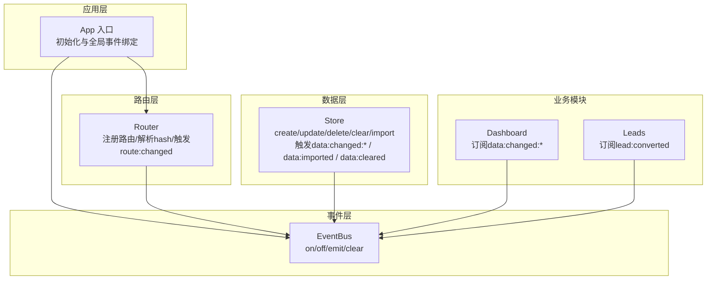
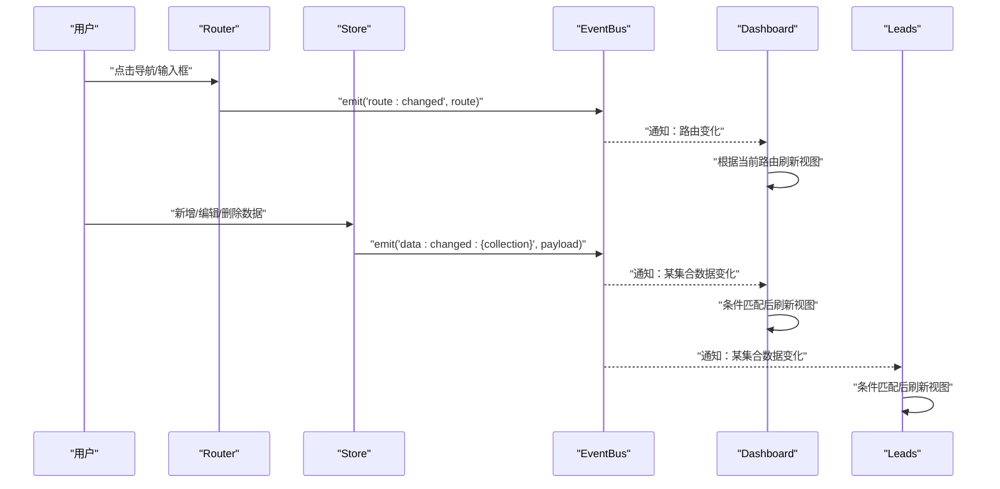
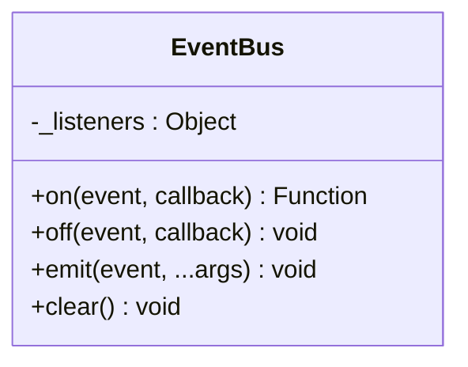
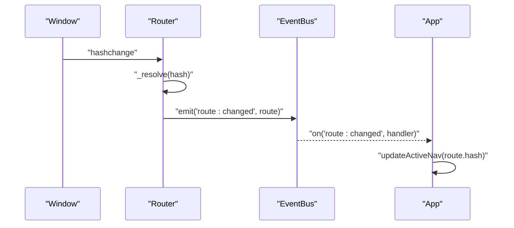
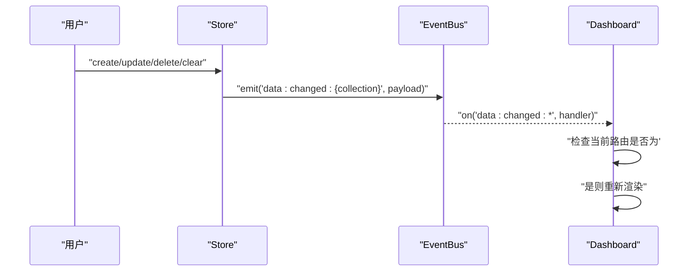
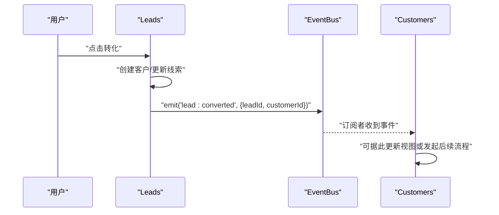
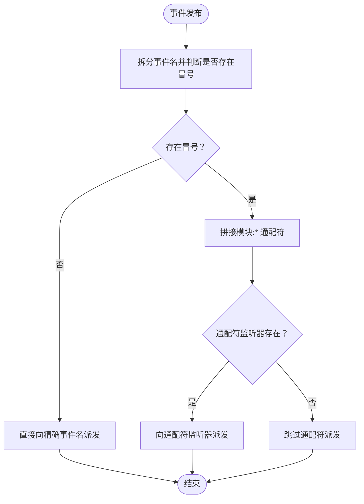
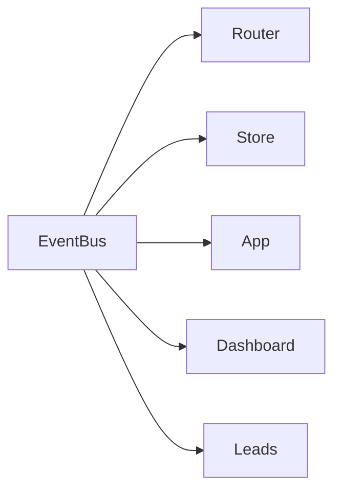

# 事件系统扩展

<cite>
**本文引用的文件**
- [events.js](file://js/events.js)
- [app.js](file://js/app.js)
- [router.js](file://js/router.js)
- [store.js](file://js/store.js)
- [dashboard.js](file://js/modules/dashboard.js)
- [leads.js](file://js/modules/leads.js)
- [helpers.js](file://js/utils/helpers.js)
</cite>

## 目录
1. [简介](#简介)
2. [项目结构](#项目结构)
3. [核心组件](#核心组件)
4. [架构总览](#架构总览)
5. [详细组件分析](#详细组件分析)
6. [依赖分析](#依赖分析)
7. [性能考虑](#性能考虑)
8. [故障排查指南](#故障排查指南)
9. [结论](#结论)
10. [附录](#附录)

## 简介
本指南面向希望在CRM系统中扩展事件系统的开发者，系统性讲解如何定义与使用自定义事件、EventBus的使用方法与事件命名规范、发布与订阅机制（on/off/emit）、监听器注册与注销流程及内存泄漏防护、通配符事件支持与高级事件处理模式，并提供可直接落地的扩展示例（自定义业务事件、跨模块事件通信、异步事件处理），以及事件调试与性能优化建议。

## 项目结构
事件系统位于前端模块化架构中，采用“模块化功能 + 通用工具”的组织方式：
- 事件总线：独立的EventBus模块，提供on/off/emit/clear能力
- 应用入口：App负责初始化与全局事件绑定
- 路由系统：Router在路由变更时发出事件
- 数据层：Store在数据增删改清空时发出事件
- 模块：各业务模块（如Dashboard、Leads等）订阅事件以实现响应式更新

图表来源
- [app.js:36-38](file://js/app.js#L36-L38)
- [router.js:29](file://js/router.js#L29)
- [store.js:65](file://js/store.js#L65)
- [dashboard.js:214-217](file://js/modules/dashboard.js#L214-L217)
- [leads.js:276](file://js/modules/leads.js#L276)

章节来源
- [app.js:6-41](file://js/app.js#L6-L41)
- [router.js:8-61](file://js/router.js#L8-L61)
- [store.js:53-132](file://js/store.js#L53-L132)
- [dashboard.js:211-218](file://js/modules/dashboard.js#L211-L218)
- [leads.js:276](file://js/modules/leads.js#L276)

## 核心组件
- EventBus：事件总线，提供订阅、取消订阅、发布与清理能力
- Router：路由系统，在路由变化时触发事件
- Store：数据层，在数据变更时触发事件
- App：应用入口，绑定全局事件
- Dashboard/Leads等模块：订阅事件并响应

章节来源
- [events.js:4-35](file://js/events.js#L4-L35)
- [router.js:22-30](file://js/router.js#L22-L30)
- [store.js:53-96](file://js/store.js#L53-L96)
- [app.js:36-38](file://js/app.js#L36-L38)
- [dashboard.js:214-217](file://js/modules/dashboard.js#L214-L217)
- [leads.js:276](file://js/modules/leads.js#L276)

## 架构总览
事件驱动的交互流程如下：
- 用户操作触发路由或数据变更
- Router/Store通过EventBus发布事件
- 订阅者（如Dashboard、Leads等模块）接收事件并更新视图或状态

图表来源
- [router.js:29](file://js/router.js#L29)
- [store.js:65](file://js/store.js#L65)
- [dashboard.js:214-217](file://js/modules/dashboard.js#L214-L217)
- [leads.js:276](file://js/modules/leads.js#L276)

## 详细组件分析

### EventBus 组件分析
EventBus是一个轻量级事件总线，提供以下能力：
- on(event, callback)：订阅事件，返回一个可调用的注销函数
- off(event, callback)：取消订阅
- emit(event, ...args)：发布事件；支持通配符“模块:*”
- clear()：清空所有监听器

图表来源
- [events.js:4-35](file://js/events.js#L4-L35)

章节来源
- [events.js:7-30](file://js/events.js#L7-L30)

### 路由事件（route:changed）
Router在解析到匹配路由后，会通过EventBus发布“route:changed”事件，携带当前路由信息。App通过该事件更新导航高亮。

图表来源
- [router.js:22-30](file://js/router.js#L22-L30)
- [app.js:36-38](file://js/app.js#L36-L38)

章节来源
- [router.js:22-30](file://js/router.js#L22-L30)
- [app.js:36-38](file://js/app.js#L36-L38)

### 数据变更事件（data:changed:*）
Store在create/update/delete/clear/import等操作后，会发布“data:changed:{collection}”事件，携带动作与记录信息。Dashboard订阅该事件，仅当当前处于dashboard路由时才刷新视图。

图表来源
- [store.js:65](file://js/store.js#L65)
- [store.js:83](file://js/store.js#L83)
- [store.js:94](file://js/store.js#L94)
- [store.js:123](file://js/store.js#L123)
- [store.js:115](file://js/store.js#L115)
- [dashboard.js:214-217](file://js/modules/dashboard.js#L214-L217)

章节来源
- [store.js:53-96](file://js/store.js#L53-L96)
- [store.js:115-132](file://js/store.js#L115-L132)
- [dashboard.js:214-217](file://js/modules/dashboard.js#L214-L217)

### 自定义业务事件示例（Leads -> Customer 转化）
Leads模块在完成线索转化后，发布“lead:converted”事件，携带转化后的客户ID，供其他模块订阅并做后续处理。

图表来源
- [leads.js:276](file://js/modules/leads.js#L276)

章节来源
- [leads.js:198-279](file://js/modules/leads.js#L198-L279)
- [leads.js:276](file://js/modules/leads.js#L276)

### 通配符事件与高级模式
EventBus支持通配符事件，例如“data:changed:*”，允许订阅者一次性监听多个集合的数据变更。Dashboard即采用该模式，避免为每个集合单独注册监听器。

图表来源
- [events.js:22-30](file://js/events.js#L22-L30)
- [dashboard.js:214-217](file://js/modules/dashboard.js#L214-L217)

章节来源
- [events.js:22-30](file://js/events.js#L22-L30)
- [dashboard.js:214-217](file://js/modules/dashboard.js#L214-L217)

## 依赖分析
- EventBus是全局共享的事件中枢，被Router、Store、App、各业务模块广泛依赖
- Router与Store通过EventBus解耦，不直接互相依赖
- Dashboard通过通配符订阅Store事件，实现按需刷新
- Leads通过自定义事件与其他模块建立松耦合的业务联动

图表来源
- [router.js:29](file://js/router.js#L29)
- [store.js:65](file://js/store.js#L65)
- [app.js:36-38](file://js/app.js#L36-L38)
- [dashboard.js:214-217](file://js/modules/dashboard.js#L214-L217)
- [leads.js:276](file://js/modules/leads.js#L276)

章节来源
- [router.js:22-30](file://js/router.js#L22-L30)
- [store.js:53-96](file://js/store.js#L53-L96)
- [app.js:36-38](file://js/app.js#L36-L38)
- [dashboard.js:214-217](file://js/modules/dashboard.js#L214-L217)
- [leads.js:276](file://js/modules/leads.js#L276)

## 性能考虑
- 事件风暴控制：在高频操作（如搜索、滚动）中，建议结合防抖策略，减少事件触发频率
- 监听器数量管理：避免在同一事件上注册过多监听器，必要时使用通配符合并订阅
- 作用域隔离：仅在必要模块注册监听器，避免全局广播导致的全量刷新
- 异步事件处理：对于耗时任务，采用异步处理并在完成后发布事件，避免阻塞主线程

## 故障排查指南
- 事件未触发
  - 检查事件名是否正确（大小写、冒号分隔）
  - 确认发布方是否在正确的时机调用emit
  - 使用浏览器开发者工具的断点或日志定位
- 事件重复触发
  - 检查是否多次注册同一监听器
  - 确保在组件卸载时调用off或返回的注销函数
- 通配符未生效
  - 确认事件名层级与通配符一致（如“data:changed:*”）
  - 检查监听器是否已注册
- 内存泄漏
  - 在组件销毁时显式调用off或使用返回的注销函数
  - 对于全局事件，确保在页面卸载时清理

章节来源
- [events.js:10](file://js/events.js#L10)
- [events.js:13-16](file://js/events.js#L13-L16)
- [dashboard.js:214-217](file://js/modules/dashboard.js#L214-L217)

## 结论
本事件系统以EventBus为核心，配合Router与Store的事件发布，实现了模块间的低耦合与高内聚。通过通配符事件与自定义业务事件，系统具备良好的扩展性与可维护性。遵循本文的命名规范、注册/注销流程与性能优化建议，可安全地扩展更多业务事件场景。

## 附录

### 事件命名规范
- 命名层级：使用冒号分隔模块与子事件，如“data:changed:leads”、“route:changed”
- 通配符：使用“模块:*”统一监听某模块下的多类事件
- 自定义事件：以业务语义命名，如“lead:converted”

章节来源
- [events.js:22-30](file://js/events.js#L22-L30)
- [store.js:65](file://js/store.js#L65)
- [leads.js:276](file://js/modules/leads.js#L276)

### 核心方法使用指南
- on(event, callback)：返回一个注销函数，便于在组件销毁时清理
- off(event, callback)：取消特定监听器
- emit(event, ...args)：发布事件，支持通配符派发
- clear()：清空所有监听器（谨慎使用）

章节来源
- [events.js:7-30](file://js/events.js#L7-L30)

### 扩展示例清单
- 自定义业务事件
  - 场景：线索转化完成后通知客户模块
  - 实现：在转化逻辑中发布“lead:converted”，其他模块订阅并处理
  - 参考路径：[leads.js:276](file://js/modules/leads.js#L276)
- 跨模块事件通信
  - 场景：数据变更后，Dashboard按需刷新
  - 实现：Store发布“data:changed:{collection}”，Dashboard订阅“data:changed:*”
  - 参考路径：[store.js:65](file://js/store.js#L65)，[dashboard.js:214-217](file://js/modules/dashboard.js#L214-L217)
- 异步事件处理
  - 场景：后台任务完成后发布事件
  - 实现：在异步回调中调用emit，避免阻塞UI
  - 参考路径：[helpers.js:64-70](file://js/utils/helpers.js#L64-L70)

### 监听器注册与注销流程（内存泄漏防护）
- 注册：在组件初始化时调用on，保存返回的注销函数
- 注销：在组件销毁时调用该注销函数，或在页面卸载时调用clear

章节来源
- [events.js:10](file://js/events.js#L10)
- [events.js:32-35](file://js/events.js#L32-L35)