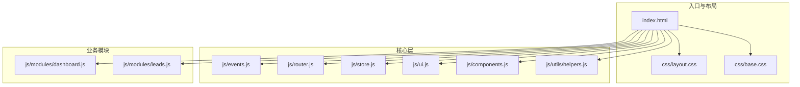
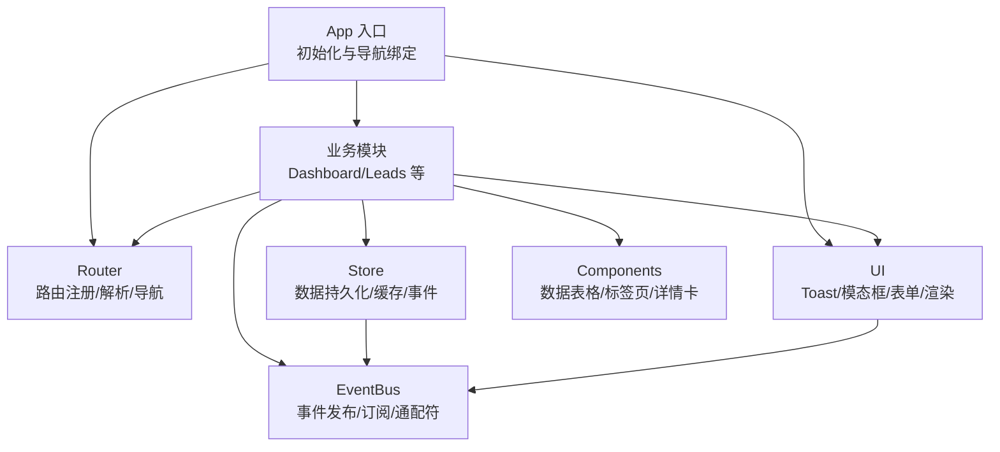
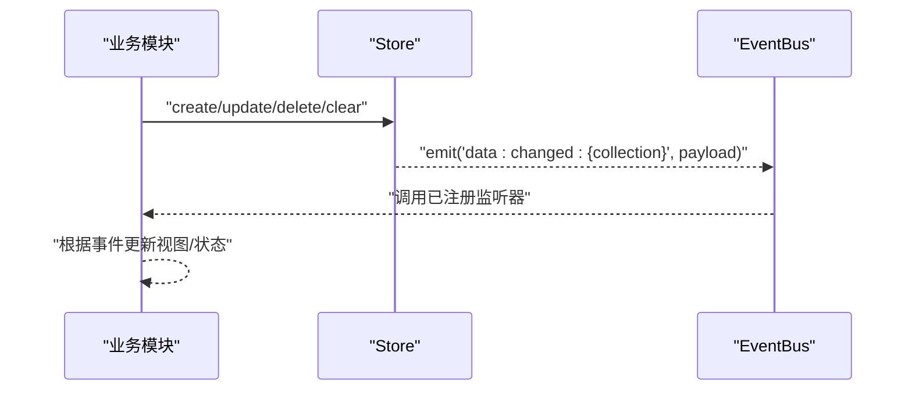
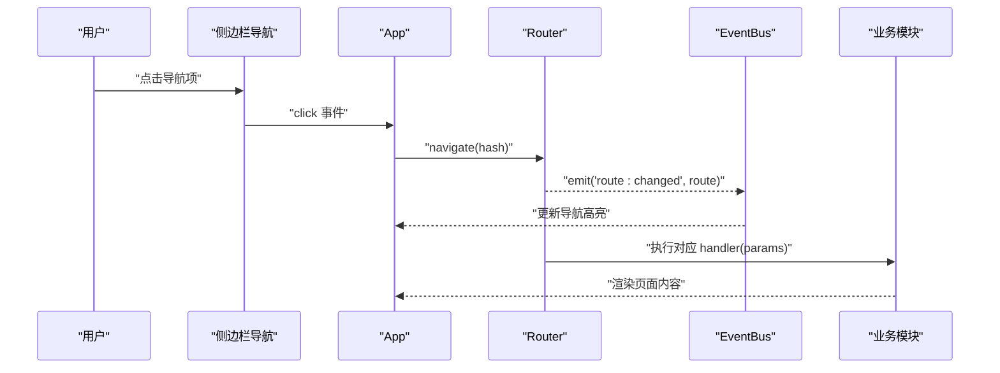
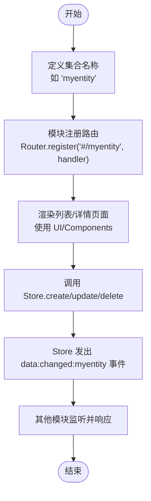
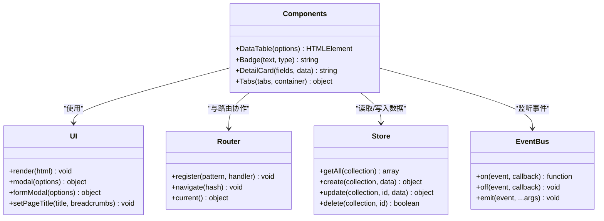
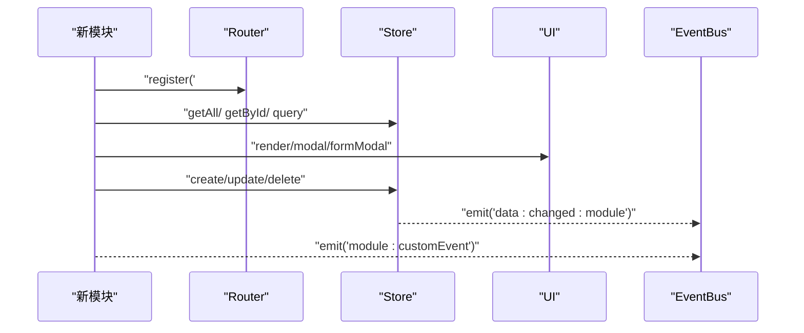
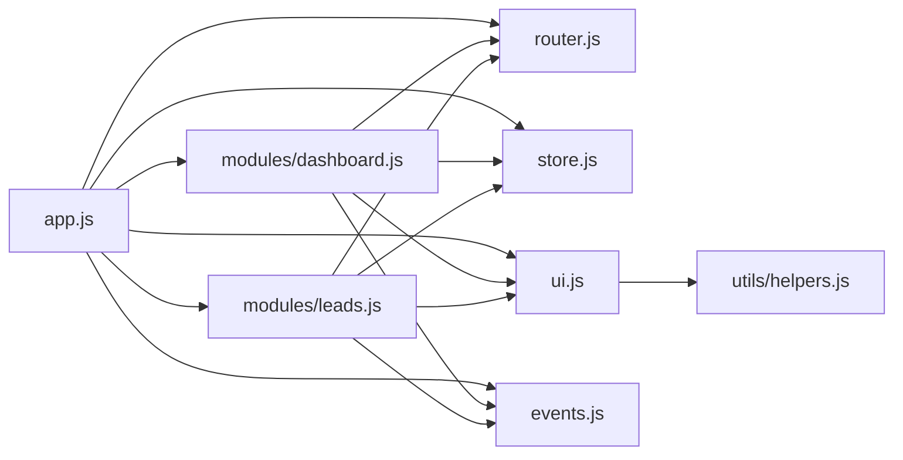

# 扩展指南

<cite>
**本文档引用的文件**
- [index.html](file://index.html)
- [app.js](file://js/app.js)
- [store.js](file://js/store.js)
- [events.js](file://js/events.js)
- [router.js](file://js/router.js)
- [ui.js](file://js/ui.js)
- [components.js](file://js/components.js)
- [helpers.js](file://js/utils/helpers.js)
- [dashboard.js](file://js/modules/dashboard.js)
- [leads.js](file://js/modules/leads.js)
- [base.css](file://css/base.css)
- [layout.css](file://css/layout.css)
</cite>

## 目录
1. [简介](#简介)
2. [项目结构](#项目结构)
3. [核心组件](#核心组件)
4. [架构总览](#架构总览)
5. [详细组件分析](#详细组件分析)
6. [依赖关系分析](#依赖关系分析)
7. [性能考虑](#性能考虑)
8. [故障排除指南](#故障排除指南)
9. [结论](#结论)
10. [附录](#附录)

## 简介
本指南面向希望扩展 CRM 系统的开发者，涵盖以下主题：
- 如何添加新的业务功能模块（如新增实体、路由、UI 组件）
- 事件系统的扩展方法（自定义事件与监听器注册）
- UI 组件扩展指南（创建新组件类型并与现有系统集成）
- 路由系统的扩展方式（新增页面与导航菜单配置）
- 数据模型扩展方法（新实体与 Store 模块扩展）
- 第三方集成指导（API 对接与数据同步机制）
- 具体扩展示例与最佳实践

## 项目结构
系统采用模块化架构，前端以模块为单位组织业务功能，通过统一的事件总线、路由与数据层进行解耦协作。核心文件组织如下：
- 入口与应用初始化：index.html、js/app.js
- 核心基础设施：js/events.js、js/router.js、js/store.js、js/ui.js、js/components.js、js/utils/helpers.js
- 业务模块：js/modules/*.js（如 dashboard.js、leads.js 等）
- 样式：css/*.css

**图表来源**
- [index.html:1-129](file://index.html#L1-L129)
- [layout.css:1-337](file://css/layout.css#L1-L337)
- [base.css:1-102](file://css/base.css#L1-L102)

**章节来源**
- [index.html:1-129](file://index.html#L1-L129)

## 核心组件
- 事件总线（EventBus）：提供发布/订阅模式，支持通配符事件，用于模块间解耦通信。
- 路由系统（Router）：基于 hash 的轻量路由，支持参数化路径与编程式导航。
- 数据层（Store）：封装本地存储访问与缓存，提供 CRUD、导出/导入、清理等能力，并在变更时发出事件。
- UI 工具（UI）：提供图标库、Toast、模态框、表单构建与渲染等通用 UI 能力。
- 通用组件（Components）：提供数据表格、标签页、详情卡片、状态标签等可复用组件。
- 工具函数（Helpers）：提供 ID 生成、日期/金额格式化、防抖、HTML 转义等工具。

**章节来源**
- [events.js:1-36](file://js/events.js#L1-L36)
- [router.js:1-62](file://js/router.js#L1-L62)
- [store.js:1-139](file://js/store.js#L1-L139)
- [ui.js:1-364](file://js/ui.js#L1-L364)
- [components.js:1-324](file://js/components.js#L1-L324)
- [helpers.js:1-113](file://js/utils/helpers.js#L1-L113)

## 架构总览
系统采用“模块化业务 + 统一基础设施”的架构。模块通过 Router 注册页面，使用 Store 进行数据持久化，通过 EventBus 发布/订阅事件，UI 提供一致的交互体验。

**图表来源**
- [app.js:1-316](file://js/app.js#L1-L316)
- [router.js:1-62](file://js/router.js#L1-L62)
- [store.js:1-139](file://js/store.js#L1-L139)
- [events.js:1-36](file://js/events.js#L1-L36)
- [ui.js:1-364](file://js/ui.js#L1-L364)
- [components.js:1-324](file://js/components.js#L1-L324)
- [dashboard.js:1-220](file://js/modules/dashboard.js#L1-L220)
- [leads.js:1-286](file://js/modules/leads.js#L1-L286)

## 详细组件分析

### 事件系统扩展（自定义事件与监听器）
- 自定义事件命名规范：建议使用领域前缀，如 data:changed:{collection}、lead:converted 等，便于模块间约定。
- 通配符事件：EventBus 支持通配符，例如 data:changed:* 可监听任意集合的数据变更。
- 监听器注册：模块在初始化时通过 EventBus.on 注册监听器；返回的取消函数可用于移除监听器。
- 触发时机：Store 在 create/update/delete/clear/imported 等操作后主动 emit 事件，模块可据此实现响应逻辑。

**图表来源**
- [store.js:65-95](file://js/store.js#L65-L95)
- [events.js:18-30](file://js/events.js#L18-L30)
- [dashboard.js:214-217](file://js/modules/dashboard.js#L214-L217)

**章节来源**
- [events.js:1-36](file://js/events.js#L1-L36)
- [store.js:1-139](file://js/store.js#L1-L139)
- [dashboard.js:211-218](file://js/modules/dashboard.js#L211-L218)

### 路由系统扩展（新增页面与导航菜单）
- 路由注册：模块通过 Router.register(pattern, handler) 注册页面；pattern 支持冒号参数，如 '#/leads/view/:id'。
- 编程式导航：Router.navigate(hash) 实现跳转；hash 相同时会触发相同 hash 的解析流程。
- 事件联动：Router 在解析成功后 emit 'route:changed'，App 通过 EventBus.on('route:changed', ...) 更新导航高亮。
- 导航菜单配置：index.html 中的侧边栏 nav-item 通过 data-route 绑定点击事件，App 通过 bindNavigation 绑定 Router.navigate。

**图表来源**
- [app.js:43-61](file://js/app.js#L43-L61)
- [router.js:38-60](file://js/router.js#L38-L60)
- [events.js:18-30](file://js/events.js#L18-L30)
- [index.html:28-76](file://index.html#L28-L76)

**章节来源**
- [router.js:1-62](file://js/router.js#L1-L62)
- [app.js:1-41](file://js/app.js#L1-L41)
- [index.html:17-76](file://index.html#L17-L76)

### 数据模型扩展（新实体与 Store 模块）
- 新增集合：在 Store 中无需显式声明集合，直接使用 collection 参数即可；但需要在导出/统计等处补充相应集合名。
- CRUD 操作：Store 提供 create/update/delete/getById/query/count 等方法；每次变更都会触发 data:changed:{collection} 事件。
- 数据导入/导出：Store.exportAll 与 Store.importAll 会遍历集合键，确保新增集合也能被正确处理。
- 模块内使用：业务模块通过 Store.getAll/Store.getById/Store.query 等方法读取数据；通过 Store.create/update/delete 写入数据。

**图表来源**
- [store.js:32-96](file://js/store.js#L32-L96)
- [store.js:98-132](file://js/store.js#L98-L132)
- [leads.js:281-284](file://js/modules/leads.js#L281-L284)

**章节来源**
- [store.js:1-139](file://js/store.js#L1-L139)
- [leads.js:1-286](file://js/modules/leads.js#L1-L286)

### UI 组件扩展（创建新组件类型）
- 通用组件设计：Components 提供 DataTable、Tabs、DetailCard、Badge 等组件，均以函数形式暴露，接收配置对象并返回 DOM 容器。
- 组件生命周期：组件内部维护状态（如分页、排序、筛选），通过 render() 生成 HTML 并绑定事件；可通过容器.refresh(newData) 刷新数据。
- 与现有系统集成：组件通过 UI.render/UI.modal/UI.formModal 等 UI 工具进行渲染与交互；与 Router/Store/EventBus 协作实现页面跳转、数据驱动与事件响应。

**图表来源**
- [components.js:1-324](file://js/components.js#L1-L324)
- [ui.js:1-364](file://js/ui.js#L1-L364)
- [router.js:1-62](file://js/router.js#L1-L62)
- [store.js:1-139](file://js/store.js#L1-L139)
- [events.js:1-36](file://js/events.js#L1-L36)

**章节来源**
- [components.js:1-324](file://js/components.js#L1-L324)
- [ui.js:1-364](file://js/ui.js#L1-L364)

### 业务模块扩展（新增业务功能模块）
- 模块模板：参考 Leads/Dashboard 等模块，包含 COLLECTION 常量、FIELDS 字段定义、渲染函数、表单弹窗、删除确认、路由注册等。
- 路由注册：在模块 init() 中通过 Router.register 注册列表页与详情页路由。
- 数据驱动：使用 Store.getAll/Store.getById/Store.query 获取数据；通过 Store.create/update/delete 写入数据。
- 事件联动：在合适时机 emit 自定义事件（如 lead:converted），其他模块可监听并响应。

**图表来源**
- [leads.js:1-286](file://js/modules/leads.js#L1-L286)
- [dashboard.js:1-220](file://js/modules/dashboard.js#L1-L220)
- [router.js:8-13](file://js/router.js#L8-L13)
- [store.js:54-96](file://js/store.js#L54-L96)

**章节来源**
- [leads.js:1-286](file://js/modules/leads.js#L1-L286)
- [dashboard.js:1-220](file://js/modules/dashboard.js#L1-L220)

### 第三方集成（API 对接与数据同步）
- 数据层适配：在 Store 外层增加 API 层（如 ApiStore），在 create/update/delete 时同时写入本地与远端；在初始化时从远端拉取数据并写入本地。
- 事件驱动同步：当本地数据变更时，通过 EventBus 触发同步任务；远端成功后再清除本地缓存或标记。
- 错误处理：对网络异常、超时、鉴权失败等情况进行统一处理，提示用户并允许重试。
- 最佳实践：采用幂等性设计，避免重复写入；对批量操作进行节流/防抖；对敏感字段进行脱敏。

[本节为概念性指导，不直接分析具体文件]

## 依赖关系分析
- 模块依赖：业务模块依赖 Router、Store、UI、Components、EventBus；UI 依赖 Helpers；App 依赖 Router、EventBus、UI、Store。
- 耦合度：模块通过 Router/Store/EventBus 解耦，降低相互依赖；UI 与组件通过统一接口集成。
- 循环依赖：当前未发现循环依赖；若新增模块，需避免相互 require。

**图表来源**
- [app.js:1-41](file://js/app.js#L1-L41)
- [router.js:1-62](file://js/router.js#L1-L62)
- [store.js:1-139](file://js/store.js#L1-L139)
- [ui.js:1-364](file://js/ui.js#L1-L364)
- [events.js:1-36](file://js/events.js#L1-L36)
- [dashboard.js:1-220](file://js/modules/dashboard.js#L1-L220)
- [leads.js:1-286](file://js/modules/leads.js#L1-L286)
- [helpers.js:1-113](file://js/utils/helpers.js#L1-L113)

**章节来源**
- [index.html:110-126](file://index.html#L110-L126)

## 性能考虑
- 本地存储与缓存：Store 使用内存缓存减少 localStorage 读写次数；建议对大数据量集合进行分页与懒加载。
- 防抖与去抖：全局搜索、输入事件使用 Helpers.debounce 减少频繁计算与渲染。
- 事件监听：模块在不需要时及时 off 监听器，避免内存泄漏。
- UI 渲染：组件内部通过局部刷新（refresh/newData）减少不必要的 DOM 重建。

[本节提供一般性指导，不直接分析具体文件]

## 故障排除指南
- 路由不生效：检查 Router.register 是否正确注册；确认 hash 是否与 pattern 匹配；确认 Router.start 是否调用。
- 数据不更新：确认 Store.create/update/delete 是否成功；检查 EventBus.on('data:changed:*', ...) 是否监听到事件；确认当前页面是否在监听。
- UI 不显示：确认 UI.render 是否被调用；确认 UI.modal/UI.formModal 的 content 类型是否正确；检查样式是否加载。
- 导航高亮不更新：确认 EventBus.on('route:changed', ...) 是否注册；确认 App.updateActiveNav 是否被调用。

**章节来源**
- [router.js:54-60](file://js/router.js#L54-L60)
- [store.js:65-95](file://js/store.js#L65-L95)
- [events.js:32-35](file://js/events.js#L32-L35)
- [app.js:36-61](file://js/app.js#L36-L61)
- [ui.js:352-362](file://js/ui.js#L352-L362)

## 结论
该 CRM 系统通过模块化架构与统一基础设施实现了良好的扩展性。开发者可按以下步骤快速扩展：
- 新增业务模块：定义路由、渲染函数、表单与删除确认，注册到 Router。
- 扩展数据模型：直接使用 Store 的集合参数；在导出/统计处补充集合名。
- 扩展 UI 组件：在 Components 中新增组件函数，遵循现有参数与事件绑定模式。
- 扩展事件系统：使用 EventBus.on/emit 发布/订阅事件，必要时使用通配符。
- 集成第三方：在 Store 外层增加 API 层，结合事件驱动实现数据同步。

[本节为总结性内容，不直接分析具体文件]

## 附录

### 扩展示例清单
- 新增实体“合同”：在 Store 中使用 'contracts' 集合；在 UI 中创建合同列表与详情组件；在 Router 中注册 '/contracts' 与 '/contracts/view/:id'；在侧边栏添加导航项。
- 自定义事件“contract:signed”：在合同创建/更新时 emit；其他模块监听并触发后续流程（如生成发票、发送通知）。
- 新增通用组件“进度条”：在 Components 中新增 ProgressBar(options)，返回 DOM 并绑定事件；在业务页面中复用。
- 第三方 API 集成：新增 ApiStore，封装 create/update/delete 并与本地 Store 同步；在 EventBus 上监听数据变更并触发远程同步。

[本节为概念性示例，不直接分析具体文件]