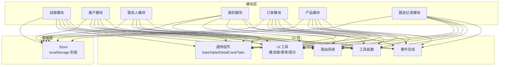
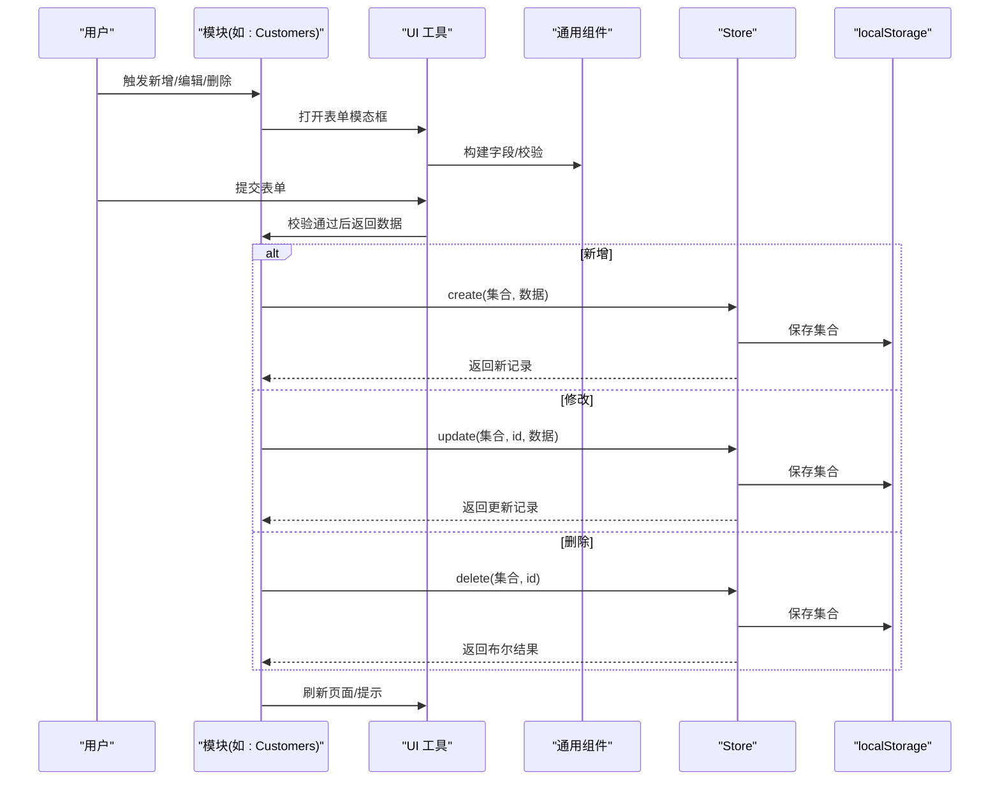
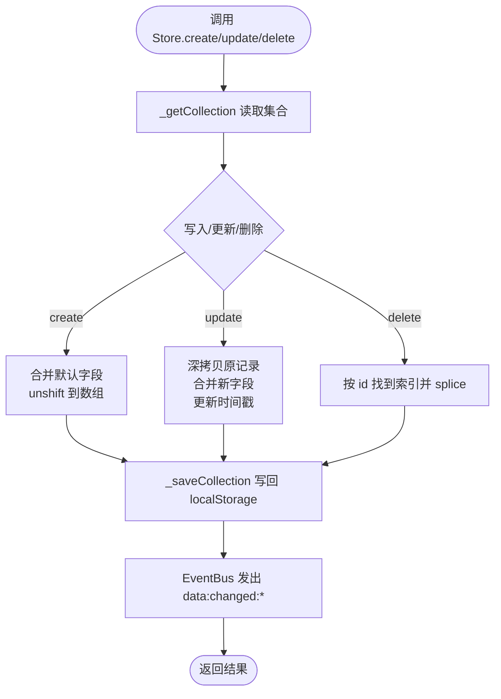
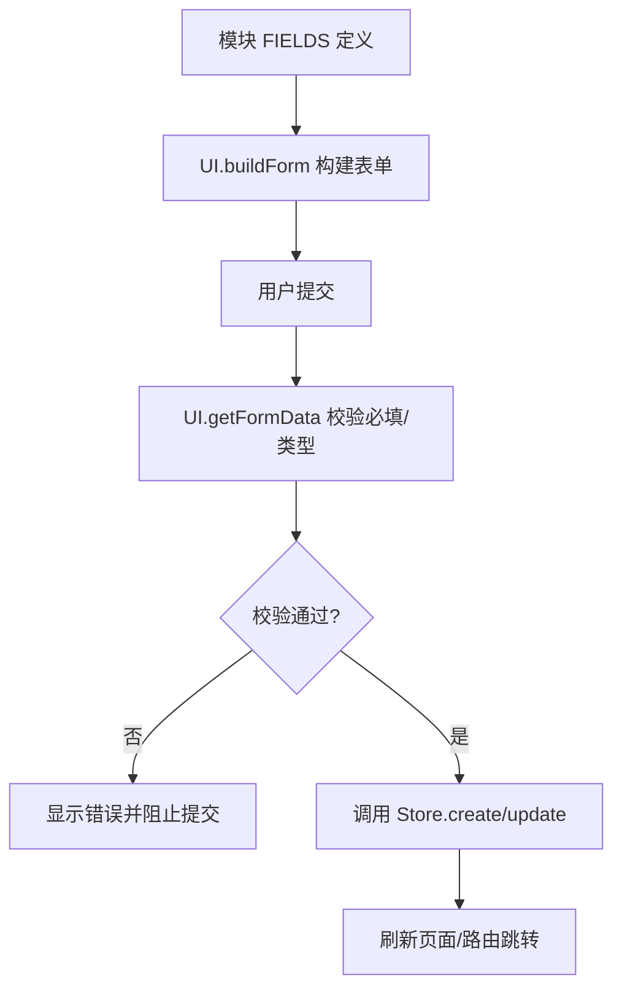
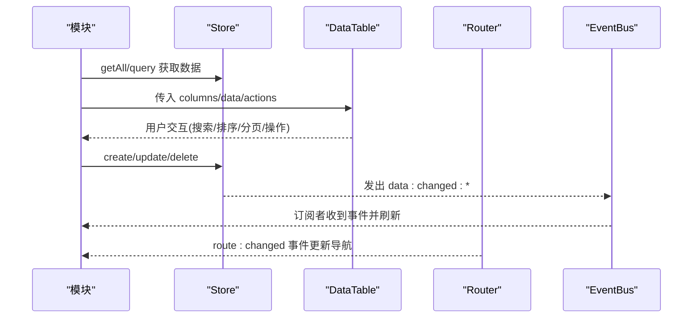
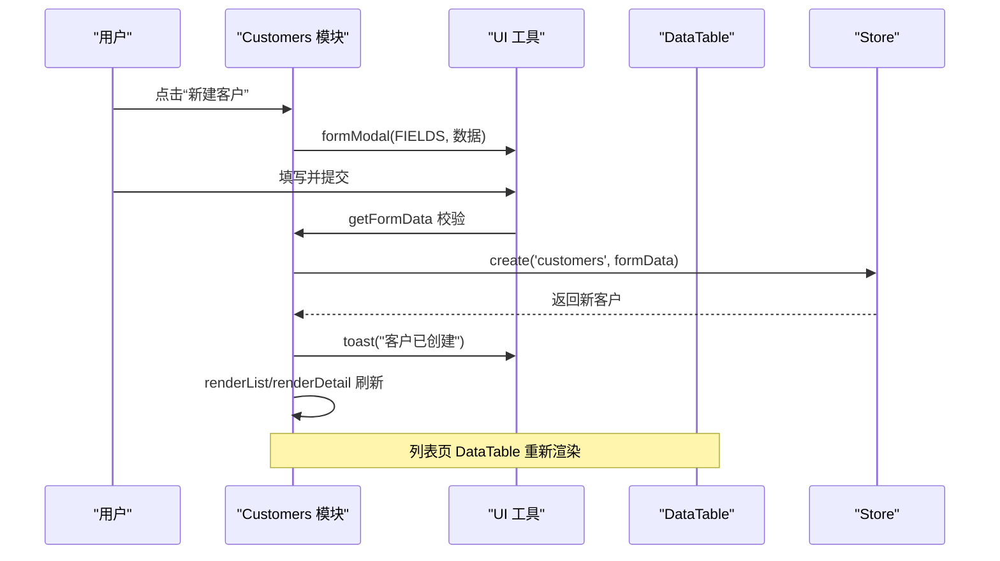
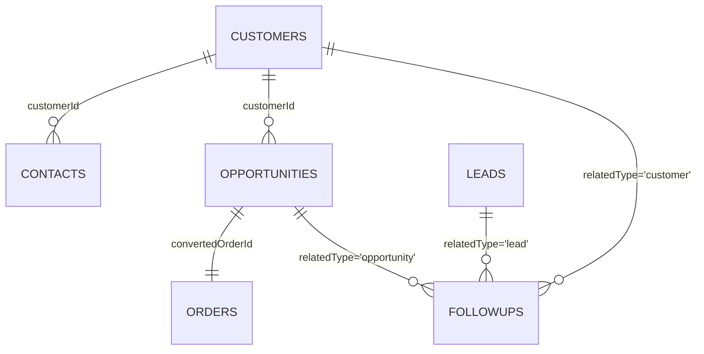
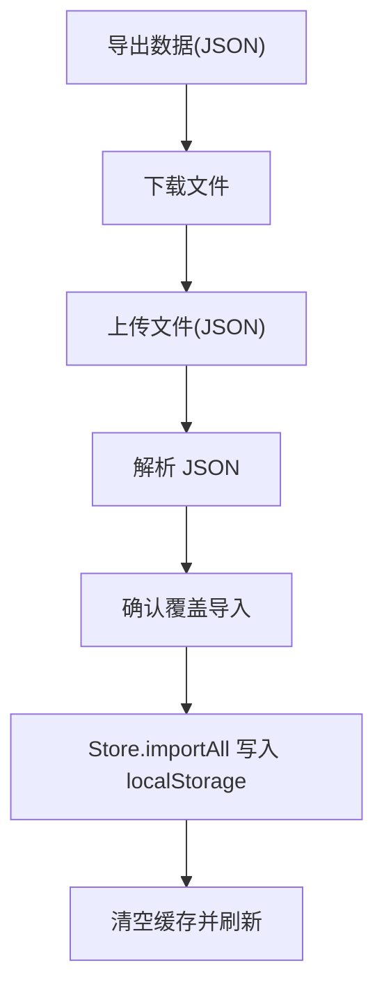
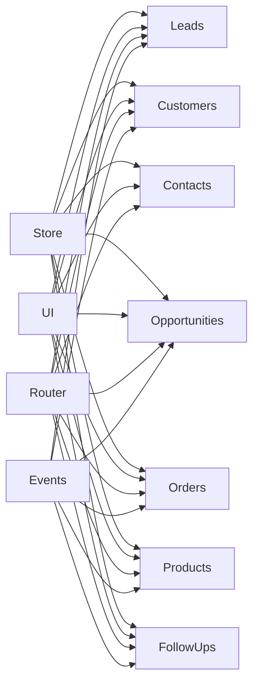

# 数据模型扩展

<cite>
**本文引用的文件**
- [store.js](file://js/store.js)
- [helpers.js](file://js/utils/helpers.js)
- [seed.js](file://js/utils/seed.js)
- [ui.js](file://js/ui.js)
- [router.js](file://js/router.js)
- [events.js](file://js/events.js)
- [app.js](file://js/app.js)
- [components.js](file://js/components.js)
- [leads.js](file://js/modules/leads.js)
- [customers.js](file://js/modules/customers.js)
- [contacts.js](file://js/modules/contacts.js)
- [opportunities.js](file://js/modules/opportunities.js)
- [orders.js](file://js/modules/orders.js)
- [products.js](file://js/modules/products.js)
- [followups.js](file://js/modules/followups.js)
</cite>

## 目录
1. [引言](#引言)
2. [项目结构](#项目结构)
3. [核心组件](#核心组件)
4. [架构总览](#架构总览)
5. [详细组件分析](#详细组件分析)
6. [依赖分析](#依赖分析)
7. [性能考虑](#性能考虑)
8. [故障排除指南](#故障排除指南)
9. [结论](#结论)
10. [附录](#附录)

## 引言
本指南面向希望在 CRM 系统中扩展数据模型的开发者，目标是帮助你在 Store 模块中定义新模型、实现 CRUD 操作、建立数据验证与约束、绑定 UI 组件并管理数据流；同时提供扩展示例与数据迁移、版本兼容性处理建议。文档基于仓库中的实际代码进行分析，确保每一步建议均可落地。

## 项目结构
系统采用“模块化 + 数据层”的组织方式：
- 数据层：Store 提供统一的本地存储封装，负责集合的增删改查、导入导出与清空。
- 模块层：每个业务实体（线索、客户、联系人、商机、订单、产品、跟进记录）独立模块，定义字段、视图与交互。
- UI 层：通用组件（数据表格、详情卡片、标签页）、工具函数与路由系统支撑页面渲染与导航。
- 事件与工具：EventBus 提供跨模块通信，Helpers 提供通用工具，Router 实现前端路由。

图表来源
- [store.js:1-139](file://js/store.js#L1-L139)
- [leads.js:1-286](file://js/modules/leads.js#L1-L286)
- [customers.js:1-229](file://js/modules/customers.js#L1-L229)
- [contacts.js:1-185](file://js/modules/contacts.js#L1-L185)
- [opportunities.js:1-485](file://js/modules/opportunities.js#L1-L485)
- [orders.js:1-234](file://js/modules/orders.js#L1-L234)
- [products.js:1-175](file://js/modules/products.js#L1-L175)
- [followups.js:1-189](file://js/modules/followups.js#L1-L189)
- [components.js:1-324](file://js/components.js#L1-L324)
- [ui.js:1-371](file://js/ui.js#L1-L371)
- [router.js:1-62](file://js/router.js#L1-L62)
- [helpers.js:1-113](file://js/utils/helpers.js#L1-L113)
- [events.js:1-36](file://js/events.js#L1-L36)

章节来源
- [store.js:1-139](file://js/store.js#L1-L139)
- [leads.js:1-286](file://js/modules/leads.js#L1-L286)
- [customers.js:1-229](file://js/modules/customers.js#L1-L229)
- [contacts.js:1-185](file://js/modules/contacts.js#L1-L185)
- [opportunities.js:1-485](file://js/modules/opportunities.js#L1-L485)
- [orders.js:1-234](file://js/modules/orders.js#L1-L234)
- [products.js:1-175](file://js/modules/products.js#L1-L175)
- [followups.js:1-189](file://js/modules/followups.js#L1-L189)
- [components.js:1-324](file://js/components.js#L1-L324)
- [ui.js:1-371](file://js/ui.js#L1-L371)
- [router.js:1-62](file://js/router.js#L1-L62)
- [helpers.js:1-113](file://js/utils/helpers.js#L1-L113)
- [events.js:1-36](file://js/events.js#L1-L36)

## 核心组件
- Store：提供集合的增删改查、条件查询、计数、导入导出、清空与缓存机制；所有模块通过 Store 与 localStorage 交互。
- Helpers：提供 ID 生成、日期/金额格式化、防抖、订单号生成等工具。
- UI：提供模态框、表单构建与校验、Toast 提示、页面标题设置与内容渲染。
- Router：基于 hash 的前端路由，支持参数提取与事件通知。
- EventBus：轻量事件总线，用于模块间解耦通信。
- 通用组件：DataTable（搜索、排序、分页、筛选）、DetailCard（详情展示）、Tabs（标签页）。

章节来源
- [store.js:1-139](file://js/store.js#L1-L139)
- [helpers.js:1-113](file://js/utils/helpers.js#L1-L113)
- [ui.js:1-371](file://js/ui.js#L1-L371)
- [router.js:1-62](file://js/router.js#L1-L62)
- [events.js:1-36](file://js/events.js#L1-L36)
- [components.js:1-324](file://js/components.js#L1-L324)

## 架构总览
数据模型扩展遵循“模块定义 → Store CRUD → UI 绑定 → 事件联动”的流程。模块通过 COLLECTION 常量标识集合，FIELDS 描述字段与校验规则，渲染列表/详情/表单并通过 Store 进行持久化。UI 通过通用组件与路由系统驱动页面流转，EventBus 在关键变更时广播事件，实现跨模块同步。

图表来源
- [customers.js:184-206](file://js/modules/customers.js#L184-L206)
- [ui.js:164-191](file://js/ui.js#L164-L191)
- [store.js:53-96](file://js/store.js#L53-L96)

## 详细组件分析

### Store 数据层（CRUD 与缓存）
- 集合访问与缓存：_getCollection 从 localStorage 读取并缓存；_saveCollection 写回 localStorage。
- 查询能力：getAll、getById、query、count 支持过滤器。
- 写入能力：create 自动补全 id、createdAt、updatedAt；update 保留原始 id/createdAt 并更新 updatedAt；delete 按 id 删除。
- 导入导出：exportAll、importAll 支持全量数据迁移；clear 支持按集合或全量清空。
- 事件通知：每次写入后通过 EventBus 发出 data:changed:* 事件，便于模块订阅刷新。

图表来源
- [store.js:9-96](file://js/store.js#L9-L96)

章节来源
- [store.js:1-139](file://js/store.js#L1-L139)

### 模块字段定义与校验（以客户为例）
- 字段结构：每个模块的 FIELDS 数组定义字段键、标签、类型、是否必填、占位符、默认值、可选值等。
- 表单校验：UI.getFormData 对必填字段进行非空校验，并在表单上显示错误提示。
- 类型转换：数值字段自动转换为 number；布尔字段在联系人模块中将字符串转换为布尔值。

图表来源
- [customers.js:7-19](file://js/modules/customers.js#L7-L19)
- [ui.js:194-316](file://js/ui.js#L194-L316)

章节来源
- [customers.js:1-229](file://js/modules/customers.js#L1-L229)
- [ui.js:164-316](file://js/ui.js#L164-L316)

### UI 组件与数据流绑定
- DataTable：支持列定义、搜索、排序、分页、筛选、行点击、操作按钮；模块通过 Store.getAll/query 获取数据并传入组件。
- DetailCard：根据字段定义渲染详情卡片，支持自定义 render。
- Tabs：模块详情页常用，按标签切换不同面板内容。
- 事件驱动：模块在 CRUD 后通过 EventBus 通知 UI 刷新；路由变化时更新导航高亮。

图表来源
- [components.js:6-271](file://js/components.js#L6-L271)
- [leads.js:43-86](file://js/modules/leads.js#L43-L86)
- [router.js:22-36](file://js/router.js#L22-L36)
- [events.js:18-30](file://js/events.js#L18-L30)

章节来源
- [components.js:1-324](file://js/components.js#L1-L324)
- [leads.js:1-286](file://js/modules/leads.js#L1-L286)
- [router.js:1-62](file://js/router.js#L1-L62)
- [events.js:1-36](file://js/events.js#L1-L36)

### 典型模块（客户）的 CRUD 流程
- 列表页：渲染 DataTable，支持搜索、筛选、排序与操作按钮。
- 详情页：渲染 DetailCard 与 Tabs，嵌入子列表（联系人/商机/订单/跟进）。
- 表单页：UI.formModal 构建表单，提交后调用 Store.create/update，再根据路由决定刷新列表或详情。

图表来源
- [customers.js:184-206](file://js/modules/customers.js#L184-L206)
- [ui.js:164-191](file://js/ui.js#L164-L191)
- [store.js:53-67](file://js/store.js#L53-L67)

章节来源
- [customers.js:1-229](file://js/modules/customers.js#L1-L229)

### 数据关联关系示例
- 客户与联系人：联系人模块通过 customerId 关联客户，详情页可直接跳转到客户详情。
- 客户与商机：商机模块通过 customerId 关联客户，详情页可查看该客户的商机列表。
- 商机与订单：商机赢单后创建订单，订单记录 convertedOrderId 指向商机。
- 跟进记录：跟进记录通过 relatedType/relatedId 关联线索/客户/商机，详情页内嵌时间线。

图表来源
- [contacts.js:41-44](file://js/modules/contacts.js#L41-L44)
- [opportunities.js:196-204](file://js/modules/opportunities.js#L196-L204)
- [orders.js:84-86](file://js/modules/orders.js#L84-L86)
- [followups.js:42-49](file://js/modules/followups.js#L42-L49)

章节来源
- [contacts.js:1-185](file://js/modules/contacts.js#L1-L185)
- [opportunities.js:1-485](file://js/modules/opportunities.js#L1-L485)
- [orders.js:1-234](file://js/modules/orders.js#L1-L234)
- [followups.js:1-189](file://js/modules/followups.js#L1-L189)

### 数据迁移与版本兼容
- 导入导出：Store.exportAll/Store.importAll 支持全量数据迁移；App.renderSettings 提供 UI 操作入口。
- 种子数据：SeedData.seed 在首次运行时注入演示数据，包含产品、线索、客户、联系人、商机、订单、跟进记录。
- 版本兼容：新增字段时，Store.create 会自动补全 createdAt/updatedAt；导入时若缺少字段，模块表单默认值可保证兼容。

图表来源
- [store.js:98-116](file://js/store.js#L98-L116)
- [app.js:235-275](file://js/app.js#L235-L275)

章节来源
- [store.js:1-139](file://js/store.js#L1-L139)
- [seed.js:1-142](file://js/utils/seed.js#L1-L142)
- [app.js:172-311](file://js/app.js#L172-L311)

## 依赖分析
- 模块对 Store 的依赖：所有模块均通过 Store.getAll/getById/query/count/create/update/delete 与数据层交互。
- UI 对模块的依赖：UI 组件（DataTable/DetailCard/Tabs）由各模块传入数据与行为回调。
- 路由与事件：Router 与 EventBus 作为横切关注点，驱动页面切换与模块间通信。
- 工具函数：Helpers 为 ID 生成、日期/金额格式化、防抖等提供统一能力。

图表来源
- [store.js:1-139](file://js/store.js#L1-L139)
- [leads.js:1-286](file://js/modules/leads.js#L1-L286)
- [customers.js:1-229](file://js/modules/customers.js#L1-L229)
- [contacts.js:1-185](file://js/modules/contacts.js#L1-L185)
- [opportunities.js:1-485](file://js/modules/opportunities.js#L1-L485)
- [orders.js:1-234](file://js/modules/orders.js#L1-L234)
- [products.js:1-175](file://js/modules/products.js#L1-L175)
- [followups.js:1-189](file://js/modules/followups.js#L1-L189)
- [ui.js:1-371](file://js/ui.js#L1-L371)
- [router.js:1-62](file://js/router.js#L1-L62)
- [events.js:1-36](file://js/events.js#L1-L36)

章节来源
- [store.js:1-139](file://js/store.js#L1-L139)
- [leads.js:1-286](file://js/modules/leads.js#L1-L286)
- [customers.js:1-229](file://js/modules/customers.js#L1-L229)
- [contacts.js:1-185](file://js/modules/contacts.js#L1-L185)
- [opportunities.js:1-485](file://js/modules/opportunities.js#L1-L485)
- [orders.js:1-234](file://js/modules/orders.js#L1-L234)
- [products.js:1-175](file://js/modules/products.js#L1-L175)
- [followups.js:1-189](file://js/modules/followups.js#L1-L189)
- [ui.js:1-371](file://js/ui.js#L1-L371)
- [router.js:1-62](file://js/router.js#L1-L62)
- [events.js:1-36](file://js/events.js#L1-L36)

## 性能考虑
- Store 缓存：_getCollection 使用内存缓存减少重复解析，提升渲染性能。
- 防抖搜索：全局搜索与组件内部搜索均使用 Helpers.debounce，降低频繁查询开销。
- 分页与排序：DataTable 内置分页与排序，避免一次性渲染大量数据。
- 事件节流：EventBus 事件在写入后发出，模块可通过订阅实现增量刷新，避免全量重绘。

## 故障排除指南
- 保存失败：Store._saveCollection 捕获异常并提示存储空间不足，检查浏览器存储配额。
- 数据丢失：确认 localStorage 中是否存在对应集合前缀；必要时使用导入功能恢复。
- 表单校验失败：检查字段 required、type 与默认值；UI.getFormData 会在必填为空时报错。
- 路由不生效：确认 Router.register 是否正确注册；hash 变化后需触发 _resolve。
- 事件未触发：确认 EventBus.on 是否正确订阅；通配符事件需遵循 pattern:subpattern 格式。

章节来源
- [store.js:23-30](file://js/store.js#L23-L30)
- [ui.js:276-316](file://js/ui.js#L276-L316)
- [router.js:22-36](file://js/router.js#L22-L36)
- [events.js:18-30](file://js/events.js#L18-L30)

## 结论
通过 Store 的统一抽象与模块化的业务实现，CRM 系统具备良好的扩展性。新增数据实体只需定义 COLLECTION 与 FIELDS、实现 CRUD、在 UI 中渲染即可；通过事件总线与路由系统，模块间可实现松耦合协作。配合导入导出与种子数据机制，可平滑处理数据迁移与版本演进。

## 附录

### 扩展步骤清单
- 定义集合与字段
  - 在新模块中声明 COLLECTION 常量与 FIELDS 数组，明确字段类型、是否必填、默认值与可选值。
  - 参考路径：[customers.js:5-19](file://js/modules/customers.js#L5-L19)
- 实现 CRUD
  - 列表页：使用 Store.getAll/query 获取数据，传入 DataTable。
  - 详情页：使用 Store.getById 获取单条记录，结合 DetailCard/Tabs 渲染。
  - 表单页：使用 UI.formModal 构建表单，提交后调用 Store.create/update。
  - 删除：使用 Store.delete 并提示结果。
  - 参考路径：[leads.js:21-86](file://js/modules/leads.js#L21-L86)、[opportunities.js:33-101](file://js/modules/opportunities.js#L33-L101)
- 数据验证与约束
  - 必填字段：在 FIELDS 中设置 required；UI.getFormData 会自动校验。
  - 类型转换：数值/布尔等字段在模块中进行转换，确保 Store 接收的数据类型一致。
  - 参考路径：[ui.js:276-316](file://js/ui.js#L276-L316)、[contacts.js:142-144](file://js/modules/contacts.js#L142-L144)
- UI 绑定与数据流
  - 列表/详情/表单分别对应不同的渲染与交互逻辑；通过 Router 控制页面跳转。
  - 使用 EventBus 在写入后通知订阅者刷新，避免直接耦合。
  - 参考路径：[router.js:8-36](file://js/router.js#L8-L36)、[events.js:18-30](file://js/events.js#L18-L30)
- 数据关联
  - 通过外键字段（如 customerId、relatedType/relatedId）建立关联；在渲染时查询并跳转。
  - 参考路径：[opportunities.js:196-204](file://js/modules/opportunities.js#L196-L204)、[followups.js:42-49](file://js/modules/followups.js#L42-L49)
- 数据迁移与版本兼容
  - 新增字段时，Store.create 会自动补全时间戳；导入时若字段缺失，模块默认值可保证兼容。
  - 使用 Store.exportAll/importAll 进行全量迁移。
  - 参考路径：[store.js:57-62](file://js/store.js#L57-L62)、[store.js:98-116](file://js/store.js#L98-L116)