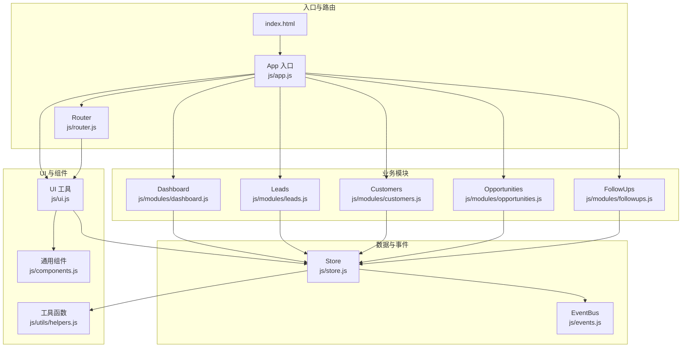
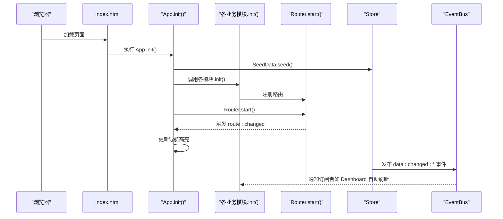
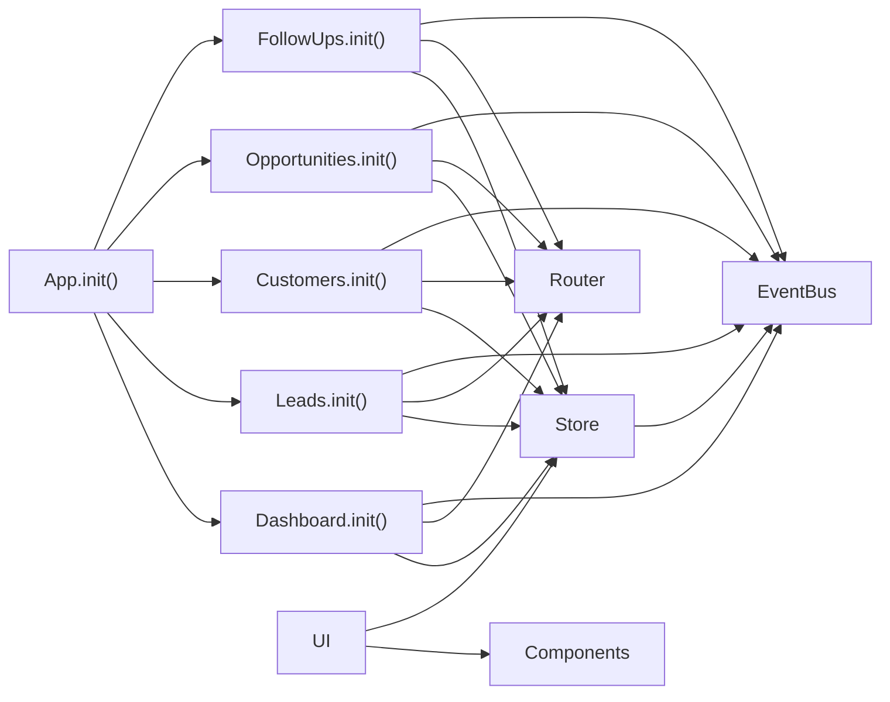

# 模块扩展开发

<cite>
**本文引用的文件**
- [index.html](file://index.html)
- [app.js](file://js/app.js)
- [events.js](file://js/events.js)
- [store.js](file://js/store.js)
- [router.js](file://js/router.js)
- [ui.js](file://js/ui.js)
- [components.js](file://js/components.js)
- [helpers.js](file://js/utils/helpers.js)
- [seed.js](file://js/utils/seed.js)
- [dashboard.js](file://js/modules/dashboard.js)
- [leads.js](file://js/modules/leads.js)
- [customers.js](file://js/modules/customers.js)
- [opportunities.js](file://js/modules/opportunities.js)
- [followups.js](file://js/modules/followups.js)
</cite>

## 目录
1. [引言](#引言)
2. [项目结构](#项目结构)
3. [核心组件](#核心组件)
4. [架构总览](#架构总览)
5. [详细组件分析](#详细组件分析)
6. [依赖关系分析](#依赖关系分析)
7. [性能考量](#性能考量)
8. [故障排查指南](#故障排查指南)
9. [结论](#结论)
10. [附录：模块开发模板与最佳实践](#附录模块开发模板与最佳实践)

## 引言
本指南面向希望为 CRM 系统添加新业务功能模块的开发者。文档基于现有代码库，系统阐述模块的基本结构、初始化流程与生命周期管理；解释模块与 App 入口的集成方式（在 App.init() 中注册新模块）；提供完整的模块开发模板（init() 方法、数据模型定义与 UI 渲染逻辑）；说明模块间依赖与通信机制（通过 EventBus 进行事件传递）；并给出扩展示例（新增销售阶段模块与自定义报表模块）以及测试与调试的最佳实践。

## 项目结构
系统采用“模块化 + 轻量前端框架”的组织方式：
- 入口与路由：index.html 引入脚本，js/app.js 负责应用初始化与导航绑定；js/router.js 提供 hash 路由。
- 数据层：js/store.js 提供本地持久化与 CRUD，配合 js/events.js 的事件总线。
- UI 层：js/ui.js 提供统一 UI 工具（Toast、模态框、表单构建等），js/components.js 提供通用组件（表格、标签页、详情卡片等）。
- 工具层：js/utils/helpers.js 提供通用工具函数；js/utils/seed.js 提供演示数据注入。
- 业务模块：js/modules 下的各模块（如 dashboard、leads、customers、opportunities、followups 等）各自负责路由注册、数据渲染与交互逻辑。

图表来源
- [index.html:121-137](file://index.html#L121-L137)
- [app.js:6-41](file://js/app.js#L6-L41)
- [router.js:4-61](file://js/router.js#L4-L61)
- [store.js:4-138](file://js/store.js#L4-L138)
- [events.js:4-35](file://js/events.js#L4-L35)
- [ui.js:4-363](file://js/ui.js#L4-L363)
- [components.js:4-323](file://js/components.js#L4-L323)
- [helpers.js:4-112](file://js/utils/helpers.js#L4-L112)
- [dashboard.js:4-219](file://js/modules/dashboard.js#L4-L219)
- [leads.js:4-285](file://js/modules/leads.js#L4-L285)
- [customers.js:4-228](file://js/modules/customers.js#L4-L228)
- [opportunities.js:4-484](file://js/modules/opportunities.js#L4-L484)
- [followups.js:4-188](file://js/modules/followups.js#L4-L188)

章节来源
- [index.html:121-137](file://index.html#L121-L137)
- [app.js:6-41](file://js/app.js#L6-L41)

## 核心组件
- App 入口：负责种子数据注入、模块初始化、导航绑定、全局搜索、移动端侧边栏、路由启动与导航高亮更新。
- Router：基于 hash 的轻量路由，支持路径参数与通配符匹配，触发路由变更事件。
- Store：封装 localStorage 的数据访问，提供 CRUD、导入导出、清空与缓存；写入时通过 EventBus 发布数据变更事件。
- EventBus：轻量事件总线，支持命名空间监听与通配符事件。
- UI：统一的 UI 工具集，包括 Toast、模态框、表单构建、面包屑、内容渲染等。
- Components：通用组件库，如数据表格、标签页、详情卡片、徽章等。
- Helpers：通用工具函数，如 ID 生成、日期格式化、防抖、HTML 转义、颜色哈希等。
- SeedData：演示数据注入器，首次运行时自动注入。

章节来源
- [app.js:6-41](file://js/app.js#L6-L41)
- [router.js:4-61](file://js/router.js#L4-L61)
- [store.js:4-138](file://js/store.js#L4-L138)
- [events.js:4-35](file://js/events.js#L4-L35)
- [ui.js:4-363](file://js/ui.js#L4-L363)
- [components.js:4-323](file://js/components.js#L4-L323)
- [helpers.js:4-112](file://js/utils/helpers.js#L4-L112)
- [seed.js:4-141](file://js/utils/seed.js#L4-L141)

## 架构总览
系统采用“入口集中初始化 + 模块自治”的架构：
- App.init() 在启动时调用各模块的 init()，完成路由注册与事件监听。
- 模块内部通过 Router.register() 注册自身路由，通过 Store 访问数据，通过 UI/Components 渲染界面。
- 模块间通过 EventBus 进行松耦合通信，例如线索转化、商机赢单等事件。

图表来源
- [index.html:121-137](file://index.html#L121-L137)
- [app.js:6-41](file://js/app.js#L6-L41)
- [router.js:53-60](file://js/router.js#L53-L60)
- [store.js:65-95](file://js/store.js#L65-L95)
- [events.js:18-30](file://js/events.js#L18-L30)

## 详细组件分析

### App 入口与生命周期
- 初始化流程
  - 注入种子数据（首次运行）
  - 初始化各模块（调用各模块的 init()）
  - 注册设置/导出路由
  - 绑定导航、全局搜索、移动端侧边栏
  - 启动路由并监听路由变化事件，更新导航高亮
- 生命周期管理
  - 模块在 App.init() 中注册，随应用启动而生效
  - 模块内部通过 Router 管理页面渲染与交互
  - 通过 EventBus 实现跨模块事件驱动的刷新与联动

章节来源
- [app.js:6-41](file://js/app.js#L6-L41)
- [app.js:43-61](file://js/app.js#L43-L61)
- [app.js:63-160](file://js/app.js#L63-L160)
- [app.js:162-170](file://js/app.js#L162-L170)

### 路由系统（Router）
- 支持静态路由与带参数的动态路由
- 通过正则匹配与分组提取参数
- 触发路由变更事件，供 App 更新导航高亮

章节来源
- [router.js:8-36](file://js/router.js#L8-L36)
- [router.js:38-60](file://js/router.js#L38-L60)

### 数据层（Store）与事件总线（EventBus）
- Store 提供集合级 CRUD、查询、计数、导入导出、清空等能力，并在每次写入后发布对应事件
- EventBus 支持命名空间监听与通配符事件，便于模块间解耦通信

章节来源
- [store.js:32-96](file://js/store.js#L32-L96)
- [store.js:98-132](file://js/store.js#L98-L132)
- [events.js:7-30](file://js/events.js#L7-L30)

### UI 工具与通用组件
- UI 提供 Toast、模态框、表单构建、面包屑、内容渲染等
- Components 提供数据表格、标签页、详情卡片、徽章等，支持搜索、排序、分页、筛选与行点击

章节来源
- [ui.js:48-78](file://js/ui.js#L48-L78)
- [ui.js:80-191](file://js/ui.js#L80-L191)
- [ui.js:193-316](file://js/ui.js#L193-L316)
- [ui.js:318-362](file://js/ui.js#L318-L362)
- [components.js:6-271](file://js/components.js#L6-L271)
- [components.js:273-322](file://js/components.js#L273-L322)

### 模块模式与典型实现
以现有模块为例，总结模块的通用结构与职责：
- 常量与字段定义：COLLECTION、FIELDS、状态映射等
- 渲染方法：renderList/renderDetail 等，负责页面标题设置、数据获取、表格/详情渲染、事件绑定
- 表单与删除：showForm、handleDelete 等，结合 UI.formModal 与 Store CRUD
- 路由注册：init() 中注册列表与详情路由
- 事件联动：通过 EventBus 发布/订阅事件，实现跨模块联动（如线索转化、商机赢单）

章节来源
- [dashboard.js:4-219](file://js/modules/dashboard.js#L4-L219)
- [leads.js:4-285](file://js/modules/leads.js#L4-L285)
- [customers.js:4-228](file://js/modules/customers.js#L4-L228)
- [opportunities.js:4-484](file://js/modules/opportunities.js#L4-L484)
- [followups.js:4-188](file://js/modules/followups.js#L4-L188)

## 依赖关系分析
- 模块依赖
  - 各模块依赖 Router 进行路由注册与导航
  - 各模块依赖 Store 进行数据访问与持久化
  - 各模块依赖 UI/Components 进行界面渲染与交互
  - 各模块通过 EventBus 与其他模块解耦通信
- 入口依赖
  - App.init() 依赖各模块的 init() 完成模块注册
  - App.init() 依赖 Router.start() 与 EventBus 事件驱动导航高亮
- 数据与事件
  - Store 写入后通过 EventBus 发布 data:changed:* 事件
  - 模块可通过通配符监听实现自动刷新（如 Dashboard）

图表来源
- [app.js:10-18](file://js/app.js#L10-L18)
- [dashboard.js:211-218](file://js/modules/dashboard.js#L211-L218)
- [leads.js:281-284](file://js/modules/leads.js#L281-L284)
- [customers.js:224-227](file://js/modules/customers.js#L224-L227)
- [opportunities.js:480-483](file://js/modules/opportunities.js#L480-L483)
- [followups.js:185-187](file://js/modules/followups.js#L185-L187)
- [store.js:65-95](file://js/store.js#L65-L95)
- [events.js:18-30](file://js/events.js#L18-L30)
- [router.js:8-36](file://js/router.js#L8-L36)
- [ui.js:4-363](file://js/ui.js#L4-L363)
- [components.js:4-323](file://js/components.js#L4-L323)

章节来源
- [app.js:10-18](file://js/app.js#L10-L18)
- [store.js:65-95](file://js/store.js#L65-L95)
- [events.js:18-30](file://js/events.js#L18-L30)

## 性能考量
- 数据缓存：Store 对集合进行内存缓存，减少重复读取 localStorage 的开销
- 防抖：全局搜索与表格搜索均使用防抖，降低频繁计算与渲染压力
- 轻量路由：hash 路由无需服务端支持，避免网络往返
- 组件化：通用组件支持分页与排序，避免一次性渲染大量数据
- 事件驱动：通过 EventBus 通配符事件实现按需刷新，避免全量重绘

章节来源
- [store.js:8-30](file://js/store.js#L8-L30)
- [helpers.js:63-70](file://js/utils/helpers.js#L63-L70)
- [components.js:186-200](file://js/components.js#L186-L200)

## 故障排查指南
- 页面空白或路由不生效
  - 检查 index.html 中脚本加载顺序是否正确
  - 确认 App.init() 是否在 DOMContentLoaded 后执行
  - 确认模块的 init() 是否在 App.init() 中被调用
- 数据无法持久化
  - 检查 localStorage 是否可用
  - Store 写入失败会抛出错误并提示存储空间不足
- 路由不更新导航高亮
  - 确认 Router.start() 是否执行
  - 确认 EventBus 是否监听到 route:changed 事件
- 模块间联动失效
  - 确认 EventBus 事件命名是否一致
  - 确认通配符监听是否正确（如 data:changed:*）

章节来源
- [index.html:121-137](file://index.html#L121-L137)
- [app.js:36-40](file://js/app.js#L36-L40)
- [store.js:24-29](file://js/store.js#L24-L29)
- [events.js:18-30](file://js/events.js#L18-L30)

## 结论
该 CRM 系统采用清晰的模块化架构，入口集中初始化、模块自治渲染、事件驱动解耦，具备良好的扩展性。开发者只需遵循现有模块模式，在 App.init() 中注册新模块、在模块内完成路由注册与 UI 渲染，并通过 EventBus 实现模块间通信，即可快速扩展新的业务功能模块。

## 附录：模块开发模板与最佳实践

### 一、模块基本结构与初始化流程
- 基本结构
  - 常量与字段定义：COLLECTION、FIELDS、状态映射等
  - 渲染方法：renderList()/renderDetail() 等
  - 表单与删除：showForm()/handleDelete()
  - 路由注册：init() 中注册列表与详情路由
  - 事件联动：通过 EventBus 发布/订阅事件
- 初始化流程
  - 在 App.init() 中调用模块的 init()
  - 在 init() 中通过 Router.register() 注册路由
  - 在需要时订阅 EventBus 事件以实现自动刷新或联动

章节来源
- [leads.js:4-285](file://js/modules/leads.js#L4-L285)
- [customers.js:4-228](file://js/modules/customers.js#L4-L228)
- [opportunities.js:4-484](file://js/modules/opportunities.js#L4-L484)
- [followups.js:4-188](file://js/modules/followups.js#L4-L188)
- [app.js:10-18](file://js/app.js#L10-L18)
- [router.js:8-36](file://js/router.js#L8-L36)
- [events.js:18-30](file://js/events.js#L18-L30)

### 二、模块开发模板（步骤化）
- 步骤 1：在 App.init() 中注册新模块
  - 在 App.init() 的模块初始化段落中调用新模块的 init()
- 步骤 2：在模块内实现 init()
  - 使用 Router.register() 注册列表与详情路由
  - 可选择性订阅 EventBus 事件以实现自动刷新
- 步骤 3：定义数据模型与字段
  - 定义 COLLECTION 常量与 FIELDS 字段描述
  - 如有状态映射，定义状态/类型映射表
- 步骤 4：实现渲染逻辑
  - renderList()：使用 Components.DataTable 构建列表页
  - renderDetail()：使用 UI.setPageTitle 与 Components.Tabs 构建详情页
- 步骤 5：实现表单与 CRUD
  - showForm()：使用 UI.formModal 构建表单
  - handleDelete()：使用 UI.confirm 与 Store.delete
  - 提交时根据 isEdit 决定 Store.create 或 Store.update
- 步骤 6：模块间通信
  - 通过 EventBus.emit() 发布事件
  - 在其他模块中通过 EventBus.on() 或通配符监听实现联动

章节来源
- [app.js:10-18](file://js/app.js#L10-L18)
- [router.js:8-36](file://js/router.js#L8-L36)
- [ui.js:164-191](file://js/ui.js#L164-L191)
- [components.js:6-271](file://js/components.js#L6-L271)
- [events.js:7-30](file://js/events.js#L7-L30)

### 三、模块间依赖与通信机制
- 依赖关系
  - 模块依赖 Router、Store、UI/Components
  - 模块通过 EventBus 与其它模块解耦通信
- 通信机制
  - 发布事件：Store 写入后自动发布 data:changed:* 事件
  - 订阅事件：模块可订阅通配符事件实现自动刷新
  - 自定义事件：模块间通过 EventBus.emit()/on() 发布/订阅自定义事件

章节来源
- [store.js:65-95](file://js/store.js#L65-L95)
- [events.js:18-30](file://js/events.js#L18-L30)
- [dashboard.js:214-217](file://js/modules/dashboard.js#L214-L217)

### 四、扩展示例

#### 示例 1：新增销售阶段模块
- 目标：新增一个“销售阶段”模块，用于管理销售流程阶段与概率
- 实施要点
  - 定义 COLLECTION 与 FIELDS（阶段名称、概率、类型等）
  - 实现 renderList() 与 renderDetail()，使用 Components.DataTable 与 Components.Tabs
  - 实现 showForm() 与 handleDelete()，结合 UI.formModal 与 Store CRUD
  - 在 App.init() 中注册模块的 init()
  - 通过 EventBus.emit()/on() 与商机模块联动（如商机阶段变更时同步更新）

章节来源
- [opportunities.js:4-484](file://js/modules/opportunities.js#L4-L484)
- [app.js:10-18](file://js/app.js#L10-L18)
- [events.js:7-30](file://js/events.js#L7-L30)

#### 示例 2：自定义报表模块
- 目标：新增一个“自定义报表”模块，基于 Store 数据生成图表与统计
- 实施要点
  - 在 render() 中使用 Store.getAll() 获取所需集合数据
  - 使用 Helpers 进行数据聚合与格式化
  - 通过 UI.render() 输出 HTML 结构
  - 订阅 EventBus.data:changed:* 事件，当数据变化时自动刷新
  - 可选：提供导出功能，结合 UI.confirm 与 Store.exportAll()

章节来源
- [dashboard.js:4-219](file://js/modules/dashboard.js#L4-L219)
- [store.js:98-116](file://js/store.js#L98-L116)
- [ui.js:235-275](file://js/ui.js#L235-L275)
- [events.js:18-30](file://js/events.js#L18-L30)

### 五、模块测试与调试最佳实践
- 单元测试建议
  - 对渲染方法进行快照对比，确保 UI 输出稳定
  - 对 CRUD 方法进行断言，验证 Store.create/update/delete 的行为
  - 对路由注册进行断言，确保 Router.register 生效
- 集成测试建议
  - 模拟用户交互（点击、输入、选择），验证 UI.formModal 与 UI.confirm 的行为
  - 触发 EventBus 事件，验证订阅模块的自动刷新
- 调试技巧
  - 在关键路径打印日志（如 Router._resolve、Store.create/update/delete）
  - 使用浏览器开发者工具检查 localStorage 数据一致性
  - 使用 UI.toast 输出关键状态，辅助定位问题

章节来源
- [ui.js:48-78](file://js/ui.js#L48-L78)
- [store.js:53-96](file://js/store.js#L53-L96)
- [router.js:21-36](file://js/router.js#L21-L36)