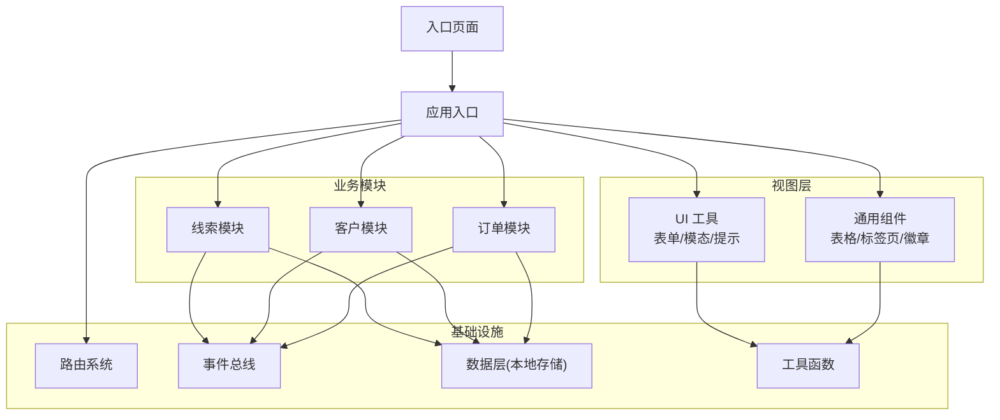
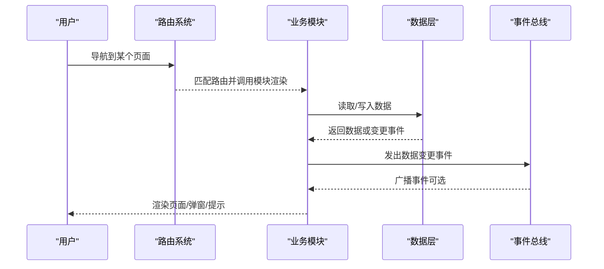
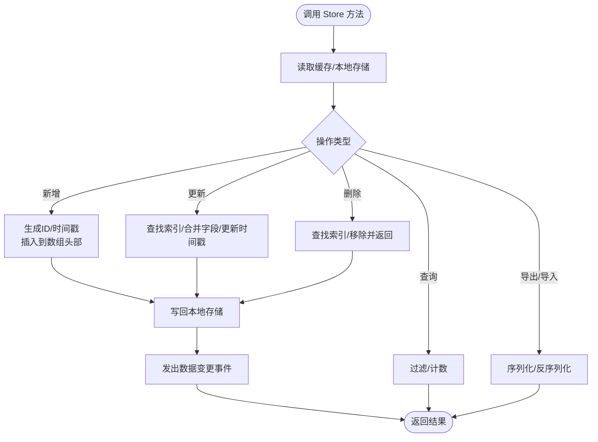
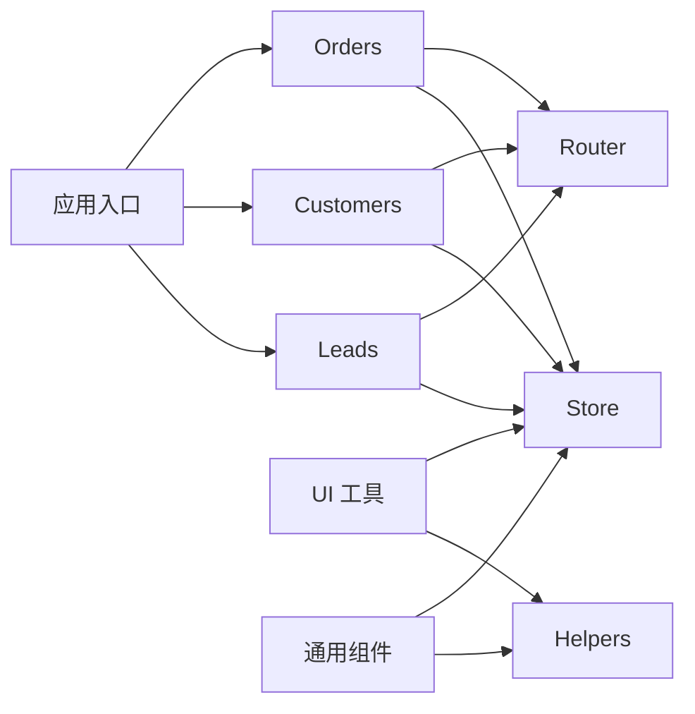

# 第三方集成

<cite>
**本文引用的文件**
- [index.html](file://index.html)
- [app.js](file://js/app.js)
- [router.js](file://js/router.js)
- [store.js](file://js/store.js)
- [helpers.js](file://js/utils/helpers.js)
- [events.js](file://js/events.js)
- [ui.js](file://js/ui.js)
- [components.js](file://js/components.js)
- [leads.js](file://js/modules/leads.js)
- [customers.js](file://js/modules/customers.js)
- [orders.js](file://js/modules/orders.js)
- [seed.js](file://js/utils/seed.js)
- [variables.css](file://css/variables.css)
- [base.css](file://css/base.css)
</cite>

## 目录
1. [引言](#引言)
2. [项目结构](#项目结构)
3. [核心组件](#核心组件)
4. [架构总览](#架构总览)
5. [详细组件分析](#详细组件分析)
6. [依赖分析](#依赖分析)
7. [性能考虑](#性能考虑)
8. [故障排查指南](#故障排查指南)
9. [结论](#结论)
10. [附录](#附录)

## 引言
本指南面向希望在 CRM 系统中接入第三方 API 与服务的开发者，涵盖以下主题：
- 如何通过现有前端架构发起 HTTP 请求与解析响应
- 数据同步机制的设计思路（定时同步、手动同步、增量同步）
- 认证与授权（API Key 与 OAuth）的集成要点
- 数据转换与映射（字段映射、格式转换）
- 实际集成示例（邮件服务、支付网关、外部数据库）
- 集成测试与错误处理最佳实践

本系统采用纯前端架构，数据持久化基于浏览器本地存储，路由与事件总线提供模块间解耦，UI 组件与工具函数支撑表单、表格与交互体验。

## 项目结构
系统采用“页面即模块”的组织方式，每个业务模块（线索、客户、订单等）独立封装，通过路由注册与事件总线协同工作；数据层统一通过 Store 抽象访问本地存储；UI 层提供通用组件与工具函数。

图表来源
- [index.html](file://index.html)
- [app.js](file://js/app.js)
- [router.js](file://js/router.js)
- [store.js](file://js/store.js)
- [ui.js](file://js/ui.js)
- [components.js](file://js/components.js)
- [leads.js](file://js/modules/leads.js)
- [customers.js](file://js/modules/customers.js)
- [orders.js](file://js/modules/orders.js)

章节来源
- [index.html](file://index.html)
- [app.js](file://js/app.js)
- [router.js](file://js/router.js)
- [store.js](file://js/store.js)
- [ui.js](file://js/ui.js)
- [components.js](file://js/components.js)
- [leads.js](file://js/modules/leads.js)
- [customers.js](file://js/modules/customers.js)
- [orders.js](file://js/modules/orders.js)

## 核心组件
- 应用入口与初始化：负责注入演示数据、初始化模块、注册设置路由、绑定导航与搜索、启动路由与高亮更新。
- 路由系统：基于 hash 的轻量路由，支持参数匹配与编程式导航。
- 数据层：以集合为单位的本地存储抽象，提供增删改查、导出导入、清空等能力。
- 事件总线：模块间解耦通信，支持通配符事件。
- UI 工具：Toast、模态框、确认框、表单构建与校验、页面标题与内容渲染。
- 通用组件：数据表格、详情卡片、标签页、徽章等。
- 工具函数：ID 生成、日期/金额格式化、防抖、截断、HTML 转义、颜色哈希、时间戳等。

章节来源
- [app.js](file://js/app.js)
- [router.js](file://js/router.js)
- [store.js](file://js/store.js)
- [events.js](file://js/events.js)
- [ui.js](file://js/ui.js)
- [components.js](file://js/components.js)
- [helpers.js](file://js/utils/helpers.js)

## 架构总览
系统采用“前端即服务”模式，业务逻辑集中在模块内部，通过 Store 与事件总线实现跨模块协作。路由驱动页面切换，UI 组件提供一致的交互体验。本地存储作为默认数据源，便于离线使用与快速原型验证。

图表来源
- [router.js](file://js/router.js)
- [store.js](file://js/store.js)
- [events.js](file://js/events.js)
- [leads.js](file://js/modules/leads.js)
- [customers.js](file://js/modules/customers.js)
- [orders.js](file://js/modules/orders.js)

## 详细组件分析

### 数据层（Store）与本地存储
- 职责：以集合为单位封装本地存储，提供缓存、序列化/反序列化、增删改查、导出导入、清空等。
- 特点：读写分离（内存缓存 + localStorage），异常时给出提示并阻止崩溃。
- 使用建议：对外暴露统一接口，避免直接操作 localStorage；在模块中仅通过 Store 访问数据。

图表来源
- [store.js](file://js/store.js)

章节来源
- [store.js](file://js/store.js)

### 路由系统（Router）
- 职责：注册路由模式、解析 hash、匹配参数、编程式导航、初始加载与 hash 变更监听。
- 特点：正则参数匹配，支持动态路由；未匹配自动跳转至仪表盘。
- 集成启示：第三方页面可通过注册路由接入；若需跨域 API，应在模块内封装请求与响应解析。

章节来源
- [router.js](file://js/router.js)

### 事件总线（EventBus）
- 职责：订阅/发布事件，支持通配符事件（如 data:*）。
- 集成启示：模块间解耦通过事件完成；第三方数据变更可由模块发出事件，其他模块订阅并更新 UI。

章节来源
- [events.js](file://js/events.js)

### UI 工具与通用组件
- UI 工具：Toast、模态框、确认框、表单构建与校验、页面标题与内容渲染。
- 通用组件：数据表格（含搜索、排序、分页、筛选）、详情卡片、标签页、徽章。
- 集成启示：第三方集成的弹窗、确认、进度提示均可复用 UI 工具；复杂页面可用组件组合。

章节来源
- [ui.js](file://js/ui.js)
- [components.js](file://js/components.js)

### 模块化业务（线索/客户/订单）
- 线索模块：字段定义、状态/来源映射、列表/详情/表单、删除确认、线索转客户流程。
- 客户模块：字段定义、状态映射、子列表（联系人/商机/订单/跟进）、新建商机快捷入口。
- 订单模块：字段定义、状态映射、订单明细展示、编号生成、与客户/商机关联。
- 集成启示：模块内已内置表单与校验，第三方数据可映射到这些字段；通过事件与 Store 协作实现联动。

章节来源
- [leads.js](file://js/modules/leads.js)
- [customers.js](file://js/modules/customers.js)
- [orders.js](file://js/modules/orders.js)

## 依赖分析
- 模块依赖：各业务模块依赖 Store 与 Router；UI 与组件依赖 Helpers；应用入口依赖所有模块与 Router。
- 外部依赖：系统未引入第三方库，完全基于原生 API 与自研工具。
- 风险点：本地存储容量限制、跨标签页并发写入冲突、大量数据导致的内存与渲染压力。

图表来源
- [app.js](file://js/app.js)
- [leads.js](file://js/modules/leads.js)
- [customers.js](file://js/modules/customers.js)
- [orders.js](file://js/modules/orders.js)
- [store.js](file://js/store.js)
- [router.js](file://js/router.js)
- [ui.js](file://js/ui.js)
- [components.js](file://js/components.js)
- [helpers.js](file://js/utils/helpers.js)

章节来源
- [app.js](file://js/app.js)
- [store.js](file://js/store.js)
- [router.js](file://js/router.js)
- [ui.js](file://js/ui.js)
- [components.js](file://js/components.js)
- [helpers.js](file://js/utils/helpers.js)
- [leads.js](file://js/modules/leads.js)
- [customers.js](file://js/modules/customers.js)
- [orders.js](file://js/modules/orders.js)

## 性能考虑
- 渲染优化：表格组件内置分页与搜索防抖，减少不必要的重排；骨架屏动画提升加载体验。
- 存储优化：Store 使用内存缓存降低频繁读写；导出/导入批量写入，避免逐条更新。
- 交互优化：模态框与 Toast 动画采用 CSS 动画，保证流畅度；滚动条与选中色提升可读性。
- 建议：第三方集成时尽量采用分页/懒加载、请求去抖、缓存响应、增量更新策略。

章节来源
- [base.css](file://css/base.css)
- [variables.css](file://css/variables.css)
- [components.js](file://js/components.js)
- [ui.js](file://js/ui.js)
- [store.js](file://js/store.js)

## 故障排查指南
- 本地存储异常：当存储空间不足或解析失败时，Store 会输出错误日志并提示用户；检查浏览器存储配额与数据格式。
- 路由异常：未匹配路由将自动跳转仪表盘；检查路由注册与 hash 是否正确。
- 表单校验失败：UI 工具会在必填字段缺失时标记错误并阻止提交；检查字段定义与必填规则。
- 事件未触发：确认事件命名规范与通配符使用；确保模块在初始化时注册了监听。
- UI 渲染问题：确认 UI.render 的调用时机与容器存在；检查 CSS 变量是否正确加载。

章节来源
- [store.js](file://js/store.js)
- [router.js](file://js/router.js)
- [ui.js](file://js/ui.js)
- [events.js](file://js/events.js)
- [variables.css](file://css/variables.css)

## 结论
本 CRM 系统以模块化、事件驱动与本地存储为核心，提供了清晰的第三方集成扩展面。通过在模块内封装 HTTP 请求、响应解析、数据转换与映射，并结合 UI 工具与通用组件，可以快速实现邮件服务、支付网关、外部数据库等集成场景。建议在生产环境中补充服务端代理、鉴权中间件与完善的错误监控体系。

## 附录

### HTTP 请求与响应解析（集成步骤）
- 在目标模块（如线索/客户/订单）中新增请求封装函数，使用 fetch 或 XMLHttpRequest。
- 对响应进行结构化解析（如 JSON），并根据业务规则映射到模块字段。
- 成功后通过 Store 更新本地数据，并发出事件通知相关模块刷新。
- 失败时使用 UI 工具提示错误，必要时回滚或重试。

章节来源
- [leads.js](file://js/modules/leads.js)
- [customers.js](file://js/modules/customers.js)
- [orders.js](file://js/modules/orders.js)
- [ui.js](file://js/ui.js)

### 数据同步策略
- 定时同步：在模块初始化或后台任务中周期性拉取第三方数据，对比本地 ID/时间戳后增量更新。
- 手动同步：提供“刷新/同步”按钮，触发一次性全量或增量拉取。
- 增量同步：基于时间戳或版本号字段，仅传输变更数据，减少网络与存储压力。

章节来源
- [store.js](file://js/store.js)
- [events.js](file://js/events.js)

### 认证与授权
- API Key：在请求头中携带密钥；在模块内集中管理密钥（避免硬编码），必要时通过环境变量或安全存储。
- OAuth：在登录页集成授权流程，获取访问令牌后在请求头中携带；模块内统一拦截与刷新逻辑。
- 最佳实践：最小权限原则、短时效令牌、失败重试与降级策略。

章节来源
- [router.js](file://js/router.js)
- [ui.js](file://js/ui.js)

### 数据转换与映射
- 字段映射：将第三方字段映射到模块字段（如来源/状态/金额），必要时进行格式转换。
- 格式转换：日期/金额/货币单位统一通过工具函数处理，确保一致性。
- 示例：邮件服务的收件人列表映射到联系人集合；支付网关的状态码映射到订单状态。

章节来源
- [helpers.js](file://js/utils/helpers.js)
- [leads.js](file://js/modules/leads.js)
- [customers.js](file://js/modules/customers.js)
- [orders.js](file://js/modules/orders.js)

### 集成示例
- 邮件服务：在“跟进记录”模块中集成邮件发送，使用 API Key 认证，将邮件模板与 CRM 字段映射，成功后记录日志。
- 支付网关：在“订单”模块中集成支付回调，使用 OAuth 获取令牌，解析支付状态并更新订单状态。
- 外部数据库：在“线索/客户”模块中定时同步外部系统数据，采用增量策略与冲突解决（如最后修改时间）。

章节来源
- [leads.js](file://js/modules/leads.js)
- [customers.js](file://js/modules/customers.js)
- [orders.js](file://js/modules/orders.js)
- [seed.js](file://js/utils/seed.js)

### 集成测试与错误处理
- 单元测试：针对请求封装、字段映射、格式转换编写测试用例。
- 集成测试：模拟第三方 API 响应，验证 UI 与数据流；覆盖失败路径与边界条件。
- 错误处理：统一捕获网络错误、解析错误与业务错误，使用 UI 提示并记录日志；提供重试与降级策略。

章节来源
- [ui.js](file://js/ui.js)
- [helpers.js](file://js/utils/helpers.js)
- [store.js](file://js/store.js)