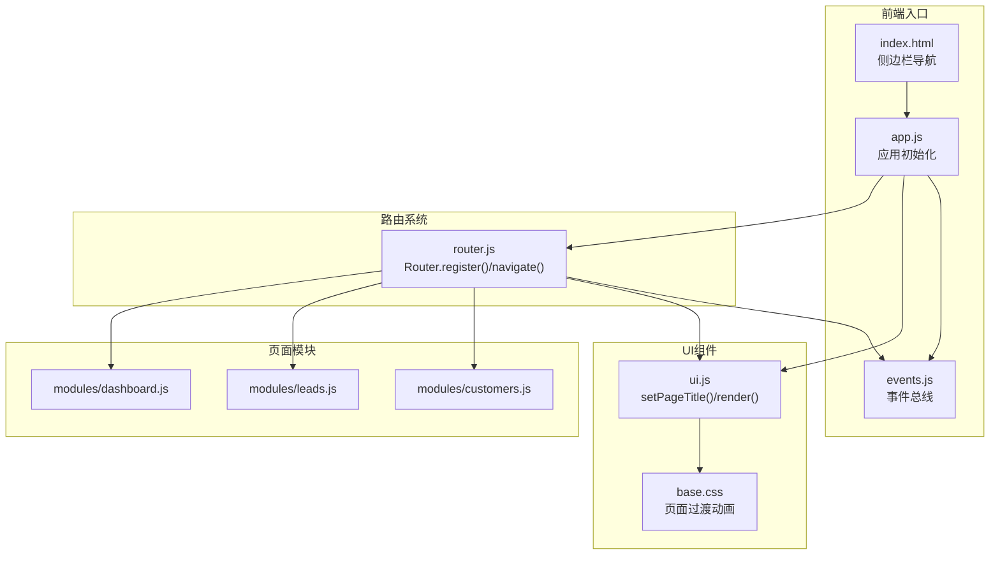
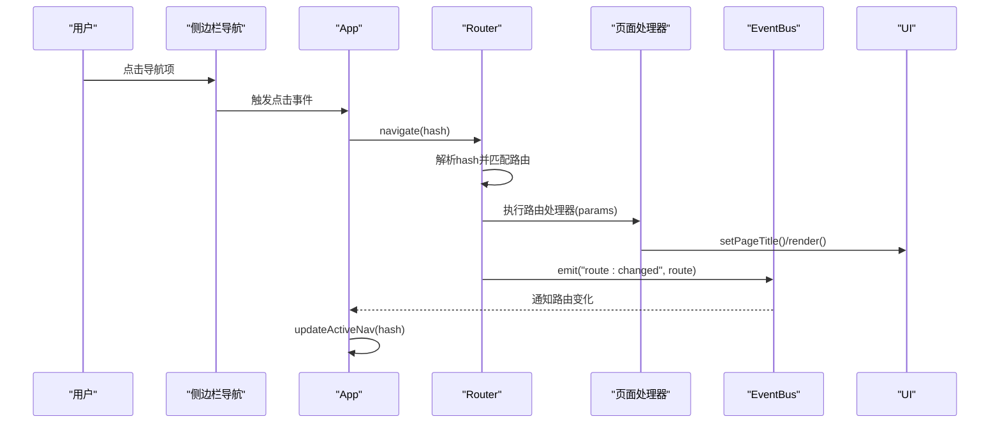
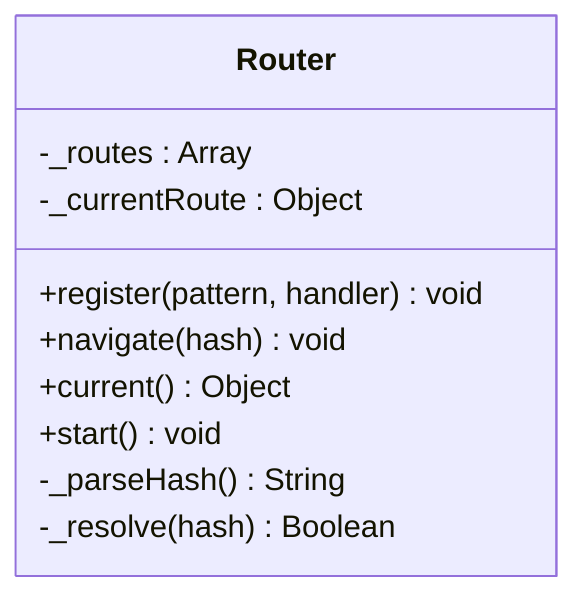
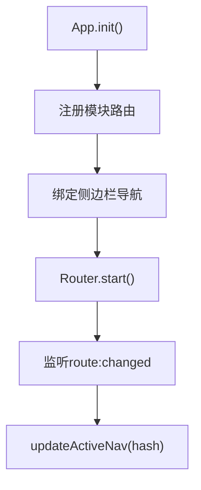
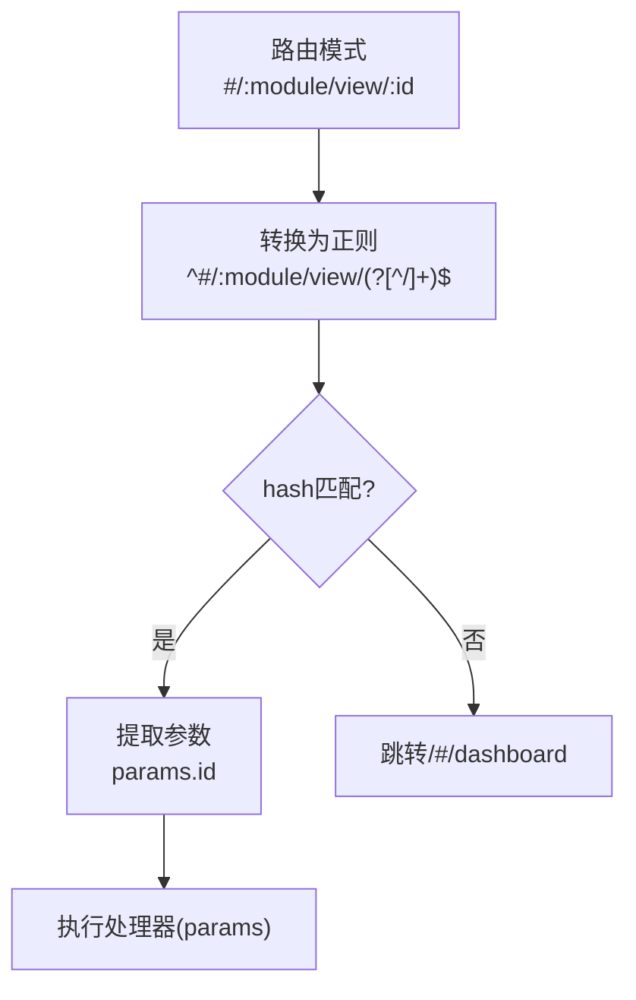
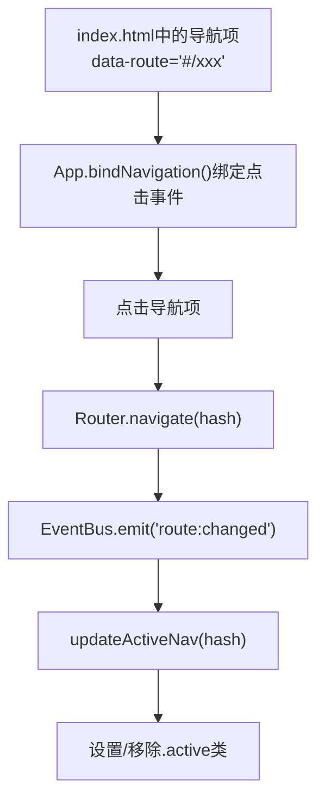
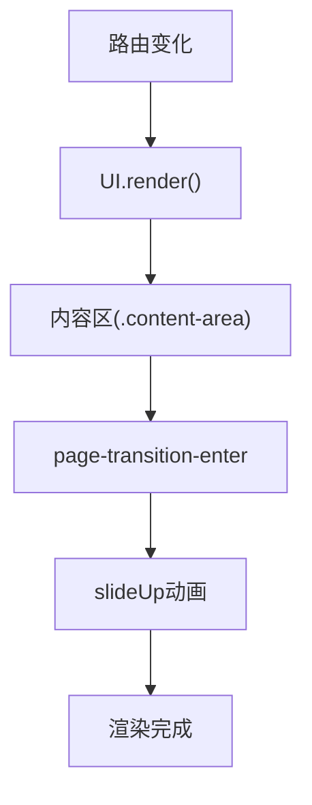
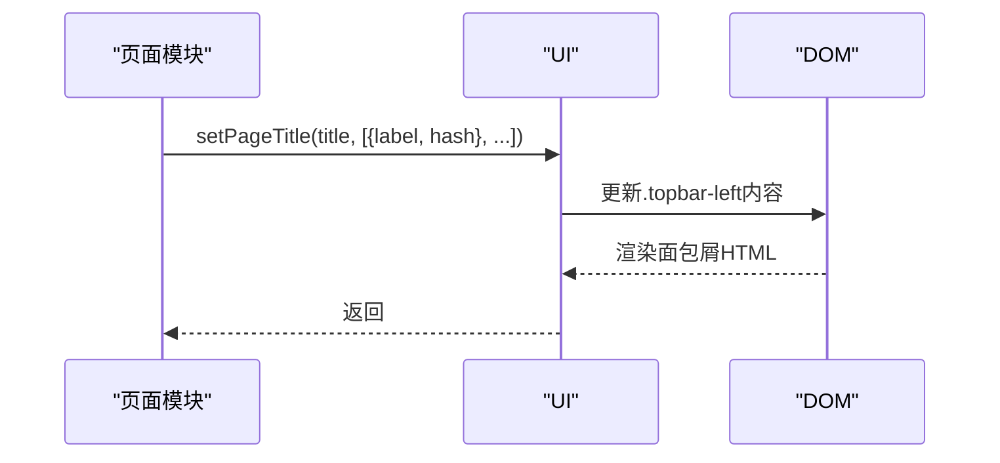
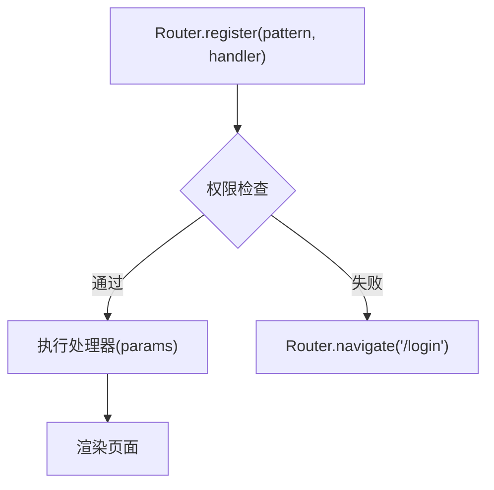
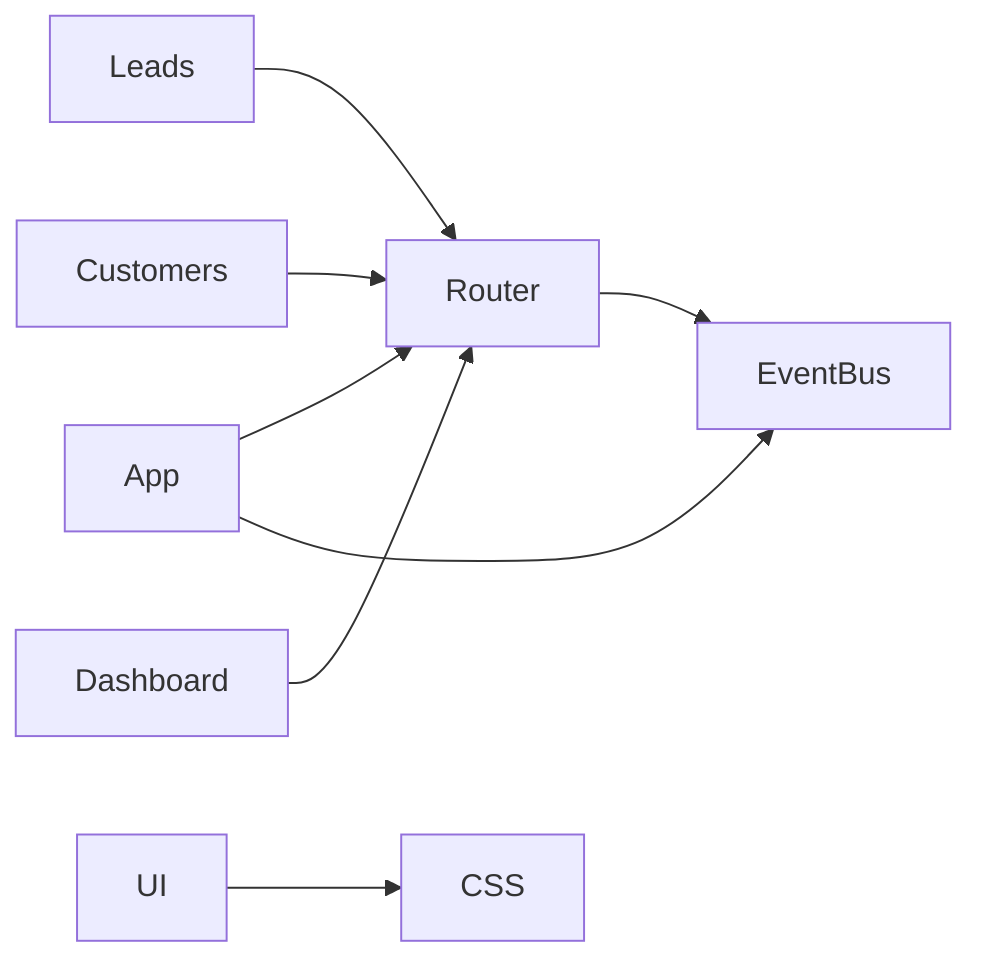

# 路由系统扩展

<cite>
**本文引用的文件列表**
- [router.js](file://js/router.js)
- [app.js](file://js/app.js)
- [events.js](file://js/events.js)
- [ui.js](file://js/ui.js)
- [index.html](file://index.html)
- [leads.js](file://js/modules/leads.js)
- [customers.js](file://js/modules/customers.js)
- [dashboard.js](file://js/modules/dashboard.js)
- [base.css](file://css/base.css)
</cite>

## 目录
1. [简介](#简介)
2. [项目结构](#项目结构)
3. [核心组件](#核心组件)
4. [架构概览](#架构概览)
5. [详细组件分析](#详细组件分析)
6. [依赖分析](#依赖分析)
7. [性能考虑](#性能考虑)
8. [故障排除指南](#故障排除指南)
9. [结论](#结论)
10. [附录](#附录)

## 简介
本指南面向CRM系统的前端开发者，提供完整的路由系统扩展文档。系统采用基于哈希的SPA路由方案，通过Router.register()注册页面路由，支持动态路由参数解析，并通过事件总线实现路由变化监听。文档涵盖：
- 新页面路由的注册与参数配置
- 动态路由参数的处理方式
- 导航菜单配置与激活状态管理
- 路由变化监听与页面切换动画
- 具体扩展示例（新增业务页面、配置面包屑导航、实现权限控制）
- 性能优化与SEO友好实践

## 项目结构
CRM系统采用模块化组织，路由系统位于js/router.js，应用入口在js/app.js，导航菜单在index.html中定义，页面渲染通过UI组件库在js/ui.js中实现。

**图表来源**
- [index.html:48-139](file://index.html#L48-L139)
- [app.js:1-41](file://js/app.js#L1-L41)
- [router.js:1-61](file://js/router.js#L1-L61)
- [ui.js:318-371](file://js/ui.js#L318-L371)
- [base.css:163-171](file://css/base.css#L163-L171)

**章节来源**
- [index.html:1-140](file://index.html#L1-L140)
- [app.js:1-41](file://js/app.js#L1-L41)
- [router.js:1-61](file://js/router.js#L1-L61)

## 核心组件
- Router：负责路由注册、匹配、导航与当前路由状态管理
- App：应用初始化、模块注册、导航绑定、事件监听
- EventBus：路由变化事件发布与订阅
- UI：页面标题与内容渲染，支持面包屑导航
- 页面模块：各业务页面的列表/详情视图与路由绑定

**章节来源**
- [router.js:4-61](file://js/router.js#L4-L61)
- [app.js:4-41](file://js/app.js#L4-L41)
- [events.js:4-35](file://js/events.js#L4-L35)
- [ui.js:318-371](file://js/ui.js#L318-L371)

## 架构概览
系统采用“事件驱动”的路由架构：App初始化时注册各模块路由，用户点击导航或调用Router.navigate()触发hash变化；Router匹配路由并执行对应处理器，同时通过EventBus发布route:changed事件；App监听该事件更新侧边栏激活状态；UI根据路由渲染页面内容。

**图表来源**
- [app.js:43-61](file://js/app.js#L43-L61)
- [router.js:38-60](file://js/router.js#L38-L60)
- [ui.js:318-371](file://js/ui.js#L318-L371)
- [events.js:18-30](file://js/events.js#L18-L30)

## 详细组件分析

### Router组件
Router提供路由注册、导航、当前路由查询与启动功能。其核心特性：
- 使用正则表达式将路由模式转换为可匹配的正则，支持动态参数捕获
- 在hash变化时自动解析并执行匹配的处理器
- 提供navigate()进行编程式导航，相同hash时手动触发解析
- 通过EventBus发布route:changed事件，携带当前路由信息

**图表来源**
- [router.js:4-61](file://js/router.js#L4-L61)

**章节来源**
- [router.js:8-60](file://js/router.js#L8-L60)

### App组件与导航绑定
App在init()中完成以下关键步骤：
- 注册各模块路由（如/#/settings）
- 绑定侧边栏导航点击事件，调用Router.navigate()
- 启动路由系统并监听route:changed事件以更新导航激活状态
- 实现移动端侧边栏开关逻辑

**图表来源**
- [app.js:6-41](file://js/app.js#L6-L41)
- [app.js:43-61](file://js/app.js#L43-L61)

**章节来源**
- [app.js:6-41](file://js/app.js#L6-L41)
- [app.js:43-61](file://js/app.js#L43-L61)

### 动态路由参数处理
系统通过正则表达式支持动态参数，例如：
- 模式：'#/leads/view/:id'
- 正则：^#/leads/view/(?<id>[^/]+)$
- 参数提取：match.groups.id作为id参数传入处理器

**图表来源**
- [router.js:9-13](file://js/router.js#L9-L13)
- [router.js:22-36](file://js/router.js#L22-L36)

**章节来源**
- [router.js:9-13](file://js/router.js#L9-L13)
- [router.js:22-36](file://js/router.js#L22-L36)

### 导航菜单配置与激活状态管理
导航菜单在index.html中定义，每个导航项包含data-route属性，App通过querySelectorAll遍历并绑定点击事件，点击后调用Router.navigate()。路由变化时，App根据hash的模块部分（如'/leads'）更新侧边栏导航项的active类。

**图表来源**
- [index.html:54-103](file://index.html#L54-L103)
- [app.js:43-61](file://js/app.js#L43-L61)

**章节来源**
- [index.html:54-103](file://index.html#L54-L103)
- [app.js:43-61](file://js/app.js#L43-L61)

### 页面切换动画效果
系统通过CSS动画实现页面切换与内容入场效果：
- 页面过渡动画：.page-transition-enter配合pageIn关键帧
- 内容区切换：.content-area > * 使用slideUp动画
- 表格行入场：.data-table tbody tr使用fadeIn并带延迟序列

**图表来源**
- [base.css:118-171](file://css/base.css#L118-L171)
- [ui.js:358-371](file://js/ui.js#L358-L371)

**章节来源**
- [base.css:118-171](file://css/base.css#L118-L171)
- [ui.js:358-371](file://js/ui.js#L358-L371)

### 面包屑导航配置
UI.setPageTitle()支持传入面包屑数组，自动渲染在品牌区域之后，支持链接点击跳转。示例中线索详情页通过UI.setPageTitle()设置面包屑，包含“线索管理”和当前名称。

**图表来源**
- [ui.js:318-347](file://js/ui.js#L318-L347)
- [leads.js:92-98](file://js/modules/leads.js#L92-L98)

**章节来源**
- [ui.js:318-347](file://js/ui.js#L318-L347)
- [leads.js:92-98](file://js/modules/leads.js#L92-L98)

### 路由守卫机制
系统未内置路由守卫，但可通过以下方式实现类似功能：
- 在Router.register()的处理器中进行权限判断，若无权限则跳转至登录或错误页
- 使用EventBus监听路由变化，在App层统一处理权限校验
- 对于需要保护的路由，先检查用户状态再决定是否执行后续处理器

[本节为概念性说明，不直接分析具体文件，故无章节来源]

## 依赖分析
- Router依赖EventBus用于发布路由变化事件
- App依赖Router进行导航与当前路由查询，依赖EventBus监听路由变化
- 页面模块依赖Router进行内部导航（如列表到详情）
- UI依赖CSS动画类实现页面切换效果

**图表来源**
- [router.js:28-30](file://js/router.js#L28-L30)
- [app.js:35-38](file://js/app.js#L35-L38)
- [leads.js:69-73](file://js/modules/leads.js#L69-L73)
- [base.css:163-171](file://css/base.css#L163-L171)

**章节来源**
- [router.js:28-30](file://js/router.js#L28-L30)
- [app.js:35-38](file://js/app.js#L35-L38)

## 性能考虑
- 路由匹配复杂度：正则匹配为O(n)（n为已注册路由数量），建议控制路由数量或按需注册
- 事件监听：仅在路由变化时触发，避免频繁重绘
- 动画性能：使用transform与opacity属性，减少布局抖动
- 内存管理：页面切换时确保DOM清理，避免内存泄漏

[本节提供一般性指导，无需特定文件分析]

## 故障排除指南
- 路由无法匹配：检查Router.register()的pattern是否正确，动态参数命名是否一致
- 导航无响应：确认App.bindNavigation()已绑定点击事件，Router.navigate()被调用
- 导航高亮不更新：检查EventBus事件是否正常触发，App.updateActiveNav()逻辑是否正确
- 页面切换无动画：确认CSS类名与关键帧定义一致，UI.render()是否被调用

**章节来源**
- [router.js:38-60](file://js/router.js#L38-L60)
- [app.js:43-61](file://js/app.js#L43-L61)
- [ui.js:358-371](file://js/ui.js#L358-L371)

## 结论
CRM系统的路由系统设计简洁高效，通过Router.register()与EventBus实现了清晰的路由生命周期管理。通过本文档提供的扩展指南，开发者可以快速添加新页面路由、配置导航菜单、实现面包屑导航与权限控制，并结合CSS动画提升用户体验。

[本节为总结性内容，无需特定文件分析]

## 附录

### 路由扩展示例

#### 示例一：添加新的业务页面
- 在模块文件中注册路由：
  - 列表页：Router.register('#/模块', () => this.renderList())
  - 详情页：Router.register('#/模块/view/:id', ({ id }) => this.renderDetail(id))
- 在页面模块中实现renderList()与renderDetail()，使用UI.setPageTitle()设置标题与面包屑
- 在index.html的侧边栏添加导航项，设置data-route属性

**章节来源**
- [leads.js:281-286](file://js/modules/leads.js#L281-L286)
- [customers.js:224-228](file://js/modules/customers.js#L224-L228)
- [index.html:54-103](file://index.html#L54-L103)

#### 示例二：配置面包屑导航
- 在详情页调用UI.setPageTitle(名称, [{label: '上级页面', hash: '#/上级路由'}, {label: 当前名称}])
- 确保面包屑中的链接指向正确的路由

**章节来源**
- [leads.js:92-98](file://js/modules/leads.js#L92-L98)
- [ui.js:318-347](file://js/ui.js#L318-L347)

#### 示例三：实现权限控制路由
- 在处理器中进行权限检查，若无权限则Router.navigate('#/login')
- 或在App层监听route:changed事件，统一执行权限校验

**章节来源**
- [router.js:22-36](file://js/router.js#L22-L36)
- [app.js:35-38](file://js/app.js#L35-L38)

### SEO友好最佳实践
- 使用静态站点生成或服务端渲染替代纯前端路由（本系统为前端SPA）
- 为重要页面提供robots.txt排除规则，避免重复索引
- 使用结构化数据标记关键页面内容
- 为页面设置合适的meta描述与标题

[本节为概念性指导，不直接分析具体文件]