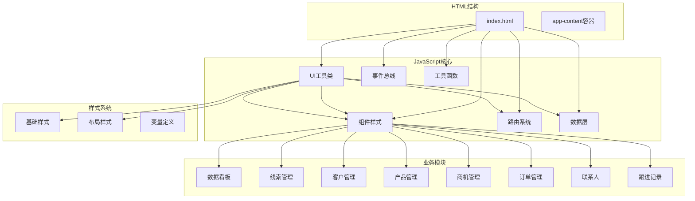
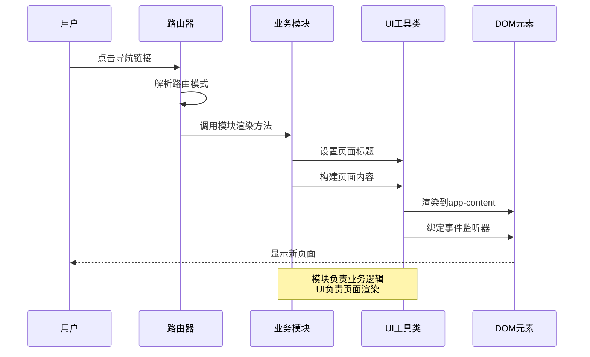
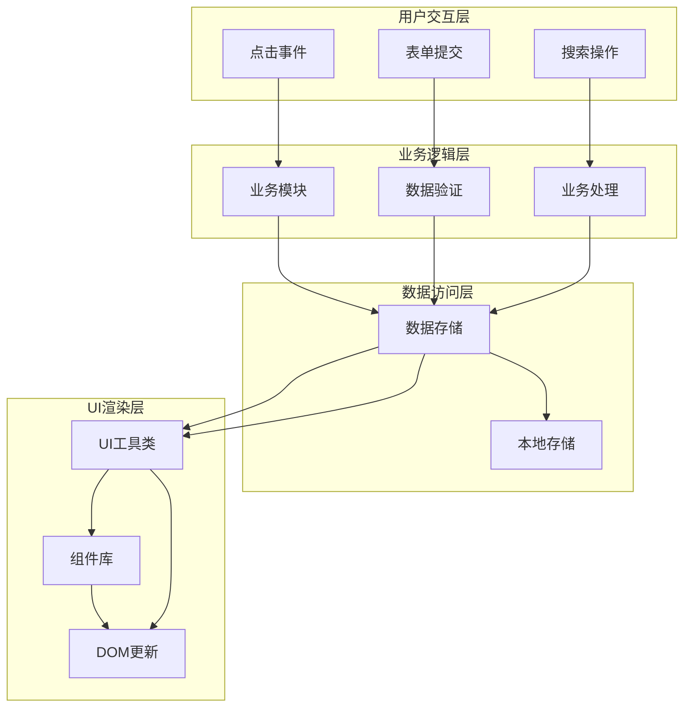
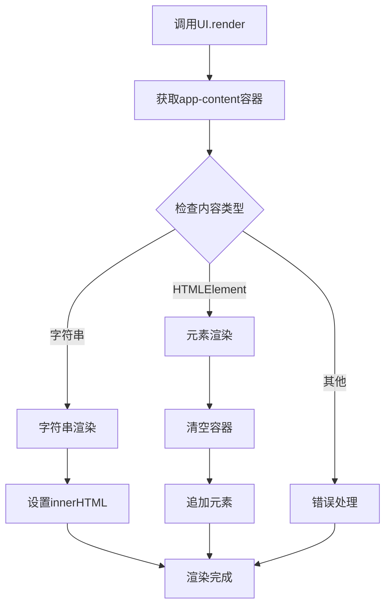
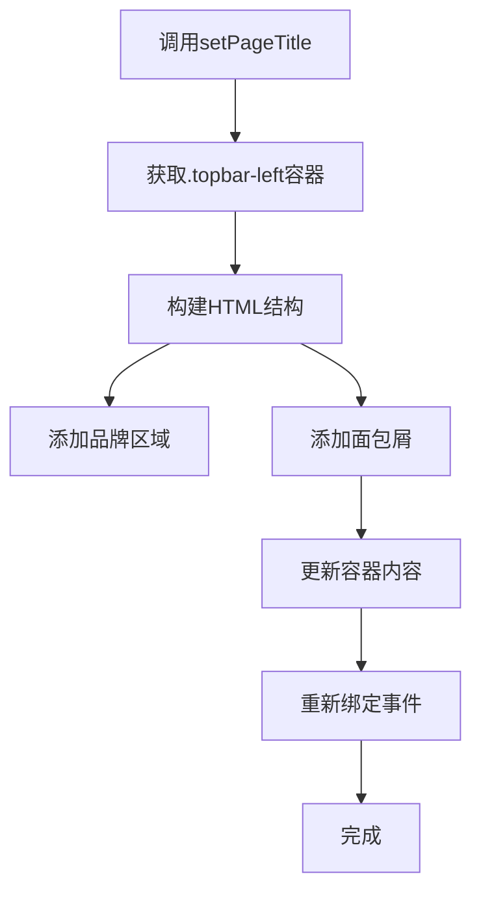
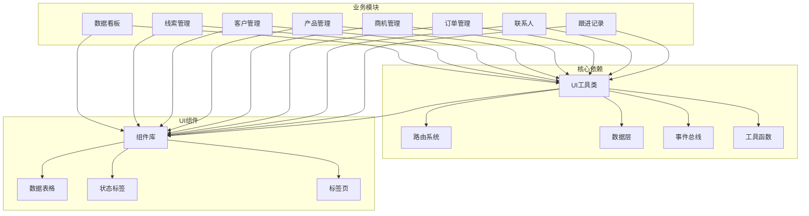
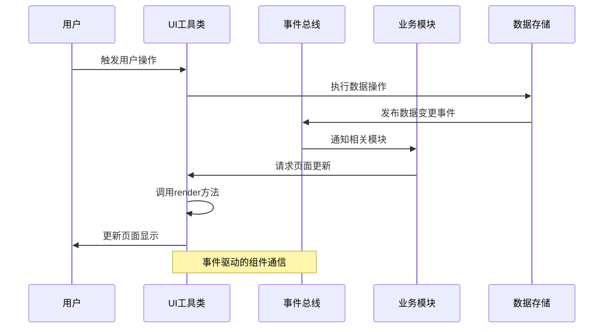

# UI集成指南

<cite>
**本文档引用的文件**
- [index.html](file://index.html)
- [ui.js](file://js/ui.js)
- [app.js](file://js/app.js)
- [components.js](file://js/components.js)
- [router.js](file://js/router.js)
- [store.js](file://js/store.js)
- [events.js](file://js/events.js)
- [helpers.js](file://js/utils/helpers.js)
- [dashboard.js](file://js/modules/dashboard.js)
- [leads.js](file://js/modules/leads.js)
- [customers.js](file://js/modules/customers.js)
- [base.css](file://css/base.css)
- [layout.css](file://css/layout.css)
- [components.css](file://css/components.css)
</cite>

## 目录
1. [简介](#简介)
2. [项目结构](#项目结构)
3. [核心组件](#核心组件)
4. [架构概览](#架构概览)
5. [详细组件分析](#详细组件分析)
6. [依赖关系分析](#依赖关系分析)
7. [性能考虑](#性能考虑)
8. [故障排除指南](#故障排除指南)
9. [结论](#结论)

## 简介

CRM系统UI集成指南旨在为开发者提供在模块中集成UI组件和页面渲染的完整指导。该系统采用模块化架构，通过统一的UI工具类、组件库和路由系统实现高效的页面渲染和用户交互。

本指南涵盖以下核心主题：
- UI.render()方法的使用和页面结构组织
- UI组件的创建和管理方式
- 页面模板编写规范和CSS类名使用
- 用户交互事件绑定和处理
- 响应式设计实现方法
- UI组件复用最佳实践
- 页面标题和面包屑导航设置

## 项目结构

CRM系统采用清晰的模块化文件组织结构，确保UI集成的可维护性和可扩展性。



**图表来源**
- [index.html:14-138](file://index.html#L14-L138)
- [ui.js:4-371](file://js/ui.js#L4-L371)
- [components.js:4-324](file://js/components.js#L4-L324)

**章节来源**
- [index.html:1-140](file://index.html#L1-L140)
- [ui.js:1-371](file://js/ui.js#L1-L371)

## 核心组件

### UI工具类 (UI)

UI工具类是整个系统的核心，提供了统一的UI渲染和交互功能。

#### 主要功能特性

1. **图标系统**: 内置丰富的SVG图标库，支持动态尺寸调整
2. **通知系统**: Toast通知、模态框、确认框的统一管理
3. **表单处理**: 动态表单构建、验证和数据提取
4. **页面标题**: 支持面包屑导航的页面标题设置
5. **内容渲染**: 统一的内容区渲染接口

#### 核心方法

- `UI.icon(name, size)`: 获取指定图标的HTML
- `UI.toast(message, type, duration)`: 显示通知
- `UI.modal(options)`: 打开模态框
- `UI.confirm(options)`: 显示确认对话框
- `UI.formModal(options)`: 表单模态框
- `UI.buildForm(fields, data)`: 构建表单HTML
- `UI.getFormData(container, fields)`: 获取表单数据
- `UI.setPageTitle(title, breadcrumbs)`: 设置页面标题和面包屑
- `UI.render(html)`: 渲染内容到页面

**章节来源**
- [ui.js:4-371](file://js/ui.js#L4-L371)

### 组件库 (Components)

组件库提供可复用的UI组件，支持数据表格、标签页、状态标签等常用界面元素。

#### 组件类型

1. **DataTable**: 高级数据表格组件，支持搜索、排序、分页、筛选
2. **Badge**: 状态标签组件
3. **DetailCard**: 详情卡片组件
4. **Tabs**: 标签页组件

#### DataTable组件特性

- 支持列定义和自定义渲染
- 内置搜索和过滤功能
- 分页控制和排序功能
- 操作按钮和行点击事件
- 响应式设计支持

**章节来源**
- [components.js:4-324](file://js/components.js#L4-L324)

### 路由系统 (Router)

基于Hash的前端路由系统，支持动态路由参数和事件监听。

#### 路由特性

- 支持路径参数捕获
- 路由变化事件通知
- 编程式导航支持
- 自动路由解析

**章节来源**
- [router.js:4-62](file://js/router.js#L4-L62)

## 架构概览

系统采用模块化架构，每个业务模块独立管理自己的UI渲染逻辑。



**图表来源**
- [router.js:22-36](file://js/router.js#L22-L36)
- [ui.js:358-370](file://js/ui.js#L358-L370)

### 数据流架构



**图表来源**
- [store.js:4-139](file://js/store.js#L4-L139)
- [ui.js:358-370](file://js/ui.js#L358-L370)

## 详细组件分析

### UI.render()方法详解

UI.render()是页面渲染的核心方法，支持多种内容类型的渲染。

#### 方法签名和参数

```javascript
UI.render(html) {
    // 参数可以是：
    // - 字符串HTML内容
    // - HTMLElement对象
    // - DOM元素节点
}
```

#### 使用场景

1. **模块页面渲染**: 在业务模块的render方法中调用
2. **动态内容更新**: 根据数据变化更新页面内容
3. **组件内容插入**: 将组件渲染到指定容器

#### 实现原理



**图表来源**
- [ui.js:358-370](file://js/ui.js#L358-L370)

**章节来源**
- [ui.js:358-370](file://js/ui.js#L358-L370)

### 页面模板编写规范

#### HTML结构组织

1. **页面头部**: 使用.page-header容器组织页面标题和操作按钮
2. **主要内容**: 使用.grid类或.card容器组织内容布局
3. **响应式设计**: 使用CSS Grid和Flexbox实现自适应布局

#### CSS类名使用规范

- **按钮类**: `.btn`, `.btn-primary`, `.btn-secondary`
- **表单类**: `.form-group`, `.form-input`, `.form-label`
- **卡片类**: `.card`, `.card-header`, `.card-body`
- **表格类**: `.data-table-container`, `.data-table`, `.table-toolbar`
- **状态类**: `.badge`, `.badge-primary`, `.badge-success`

#### 示例模板结构

```html
<div class="page-header">
    <div class="page-header-left">
        <h2 class="page-title">页面标题</h2>
        <p class="page-subtitle">页面描述</p>
    </div>
    <div class="page-header-right">
        <button class="btn btn-primary">操作按钮</button>
    </div>
</div>
<div class="card">
    <div class="card-body">
        <div class="form-grid">
            <div class="form-group">
                <label class="form-label">字段名称</label>
                <input class="form-input" type="text">
            </div>
        </div>
    </div>
</div>
```

**章节来源**
- [dashboard.js:54-209](file://js/modules/dashboard.js#L54-L209)
- [components.css:159-187](file://css/components.css#L159-L187)

### 用户交互事件绑定

#### 事件绑定策略

1. **模块内绑定**: 在业务模块的render方法中绑定事件
2. **委托绑定**: 使用事件委托处理动态内容的事件绑定
3. **路由事件**: 监听路由变化事件更新页面状态

#### 常见交互类型

1. **按钮点击**: 使用`.addEventListener('click', handler)`
2. **表单提交**: 处理表单验证和数据提交
3. **导航切换**: 路由导航和页面跳转
4. **搜索过滤**: 实时搜索和数据过滤

#### 事件处理最佳实践

```javascript
// 好的做法：使用事件委托
el.addEventListener('click', (e) => {
    const button = e.target.closest('.action-btn');
    if (button) {
        const action = button.dataset.action;
        const id = button.dataset.id;
        handleAction(action, id);
    }
});

// 避免的做法：重复绑定
buttons.forEach(button => {
    button.addEventListener('click', handler); // 可能导致内存泄漏
});
```

**章节来源**
- [leads.js:68-85](file://js/modules/leads.js#L68-L85)
- [customers.js:75-90](file://js/modules/customers.js#L75-L90)

### 响应式设计实现

#### 移动端适配策略

1. **侧边栏抽屉**: 在小屏幕上使用抽屉式侧边栏
2. **导航简化**: 隐藏文字标签，只显示图标
3. **内容调整**: 减少内边距，优化触摸目标大小

#### 媒体查询实现

```css
@media (max-width: 1024px) {
    .sidebar {
        width: var(--sidebar-collapsed-width);
        min-width: var(--sidebar-collapsed-width);
    }
    .sidebar .sidebar-section-title,
    .sidebar .nav-item span,
    .sidebar .nav-badge { display: none; }
}

@media (max-width: 768px) {
    .sidebar {
        position: fixed;
        transform: translateX(-100%);
    }
    .sidebar.open {
        transform: translateX(0);
    }
    .btn-sidebar-toggle { display: flex; }
}
```

#### 响应式组件设计

1. **网格系统**: 使用CSS Grid实现自适应布局
2. **弹性容器**: 使用Flexbox实现内容的弹性排列
3. **字体缩放**: 使用相对单位实现字体的自适应

**章节来源**
- [layout.css:432-482](file://css/layout.css#L432-L482)

### UI组件复用最佳实践

#### 组件封装原则

1. **单一职责**: 每个组件专注于特定的功能
2. **参数化**: 通过参数配置组件的行为和外观
3. **事件接口**: 提供标准化的事件回调接口
4. **状态管理**: 组件内部管理状态，对外暴露简单接口

#### 组件生命周期管理

```javascript
// DataTable组件的生命周期
const table = Components.DataTable({
    columns: [...],
    data: [...],
    actions: {
        onView: (id) => {...},
        onEdit: (id) => {...},
        onDelete: (id) => {...}
    }
});

// 刷新数据
table.refresh(newData);
```

#### 参数传递模式

1. **配置对象**: 使用单个配置对象传递多个参数
2. **回调函数**: 通过回调函数处理用户交互
3. **事件驱动**: 通过事件系统实现组件间通信

**章节来源**
- [components.js:24-271](file://js/components.js#L24-L271)

### 页面标题和面包屑导航

#### 标题设置方法

```javascript
UI.setPageTitle('页面标题', [
    { label: '父级页面', hash: '#/parent' },
    { label: '当前页面', hash: '#/current' }
]);
```

#### 面包屑实现原理



**图表来源**
- [ui.js:318-356](file://js/ui.js#L318-L356)

**章节来源**
- [ui.js:318-356](file://js/ui.js#L318-L356)

## 依赖关系分析

### 模块依赖图



**图表来源**
- [ui.js:4-371](file://js/ui.js#L4-L371)
- [components.js:4-324](file://js/components.js#L4-L324)

### 事件流分析



**图表来源**
- [events.js:4-36](file://js/events.js#L4-L36)
- [store.js:65-96](file://js/store.js#L65-L96)

**章节来源**
- [events.js:4-36](file://js/events.js#L4-L36)
- [store.js:65-96](file://js/store.js#L65-L96)

## 性能考虑

### 渲染性能优化

1. **虚拟滚动**: 对于大量数据的表格，考虑实现虚拟滚动
2. **防抖处理**: 搜索和过滤操作使用防抖机制
3. **懒加载**: 图片和大数据的懒加载策略
4. **内存管理**: 及时清理事件监听器和定时器

### 事件处理优化

```javascript
// 使用防抖优化搜索
const debouncedSearch = Helpers.debounce((term) => {
    // 搜索逻辑
}, 300);

// 使用事件委托减少监听器数量
container.addEventListener('click', (e) => {
    const element = e.target.closest('.action-btn');
    // 处理点击
});
```

### 样式性能优化

1. **CSS变量**: 使用CSS变量减少样式计算
2. **硬件加速**: 合理使用transform和opacity属性
3. **动画优化**: 使用will-change属性优化动画性能

## 故障排除指南

### 常见问题及解决方案

#### 页面不显示内容

**问题**: 页面空白或内容不显示
**原因**: UI.render()调用时机错误或DOM元素不存在
**解决**: 确保在DOM加载完成后调用渲染方法

#### 事件不响应

**问题**: 点击按钮无反应
**原因**: 事件绑定时机错误或元素不存在
**解决**: 使用事件委托或确保元素已渲染完成

#### 数据不更新

**问题**: 修改数据后页面不刷新
**原因**: 缺少事件监听或数据变更通知
**解决**: 使用EventBus发布数据变更事件

#### 样式不生效

**问题**: 自定义样式不显示
**原因**: CSS优先级问题或样式加载顺序
**解决**: 检查CSS加载顺序和选择器优先级

**章节来源**
- [ui.js:358-370](file://js/ui.js#L358-L370)
- [events.js:18-30](file://js/events.js#L18-L30)

## 结论

CRM系统的UI集成遵循模块化、组件化的架构原则，通过统一的UI工具类和组件库实现了高度可复用的界面组件。该系统的关键优势包括：

1. **统一的渲染接口**: UI.render()方法提供了简洁一致的页面渲染方式
2. **强大的组件库**: DataTable、Badge、Tabs等组件支持复杂业务场景
3. **事件驱动架构**: 基于EventBus的事件系统实现了松耦合的组件通信
4. **响应式设计**: 完善的移动端适配确保了跨设备的一致体验
5. **可维护性**: 模块化的文件结构便于代码维护和功能扩展

开发者在集成新的UI组件时，应遵循本文档提供的规范和最佳实践，确保系统的整体一致性和可维护性。通过合理使用UI工具类和组件库，可以快速构建高质量的CRM界面。