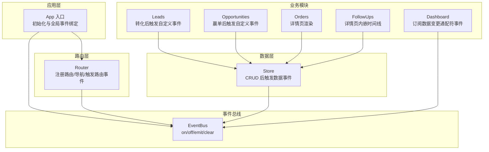
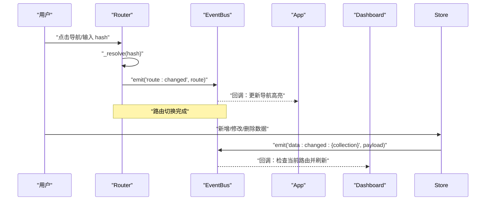
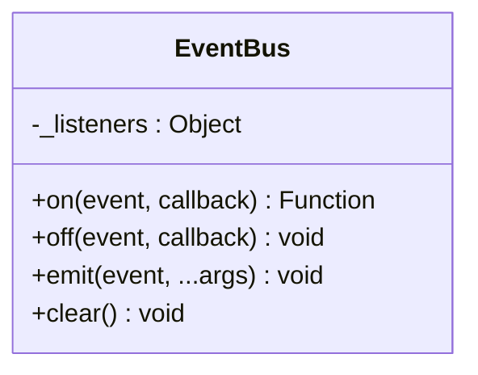
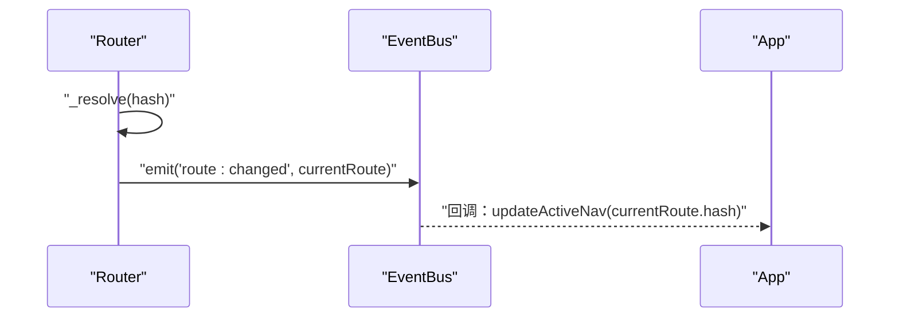
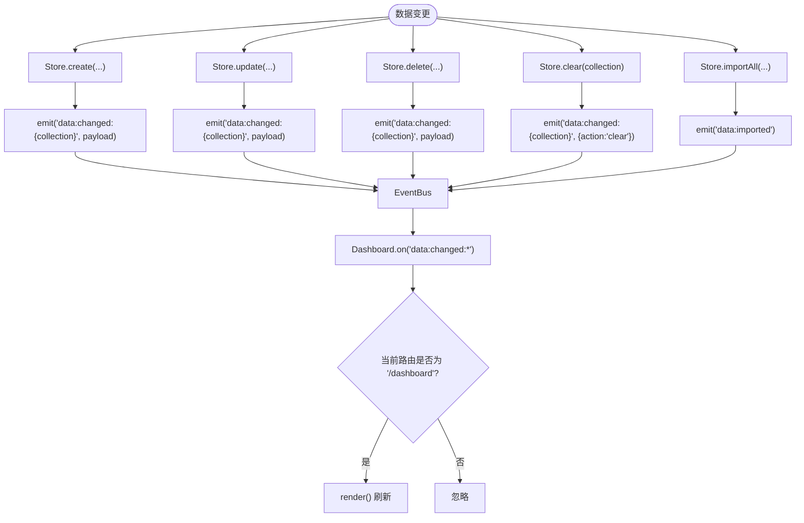
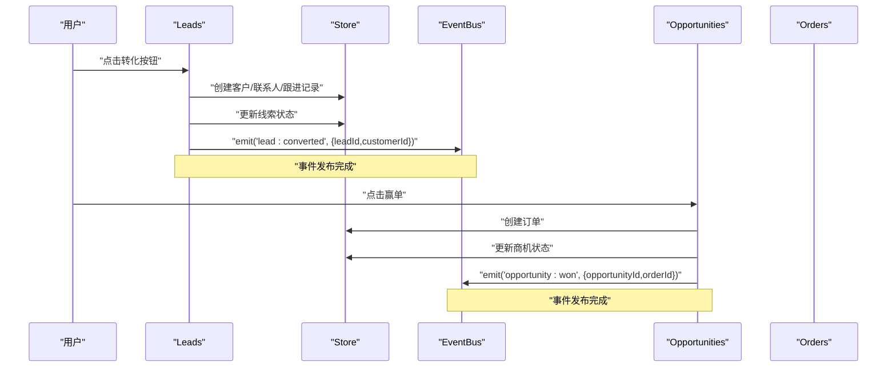
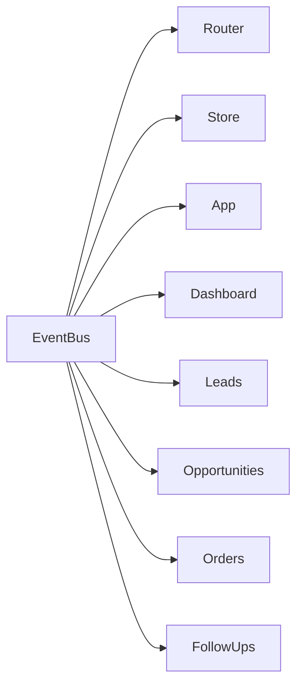

# 事件通信机制

<cite>
**本文引用的文件**
- [events.js](file://js/events.js)
- [app.js](file://js/app.js)
- [store.js](file://js/store.js)
- [router.js](file://js/router.js)
- [dashboard.js](file://js/modules/dashboard.js)
- [leads.js](file://js/modules/leads.js)
- [opportunities.js](file://js/modules/opportunities.js)
- [orders.js](file://js/modules/orders.js)
- [followups.js](file://js/modules/followups.js)
- [helpers.js](file://js/utils/helpers.js)
</cite>

## 目录
1. [简介](#简介)
2. [项目结构](#项目结构)
3. [核心组件](#核心组件)
4. [架构总览](#架构总览)
5. [详细组件分析](#详细组件分析)
6. [依赖分析](#依赖分析)
7. [性能考虑](#性能考虑)
8. [故障排查指南](#故障排查指南)
9. [结论](#结论)
10. [附录](#附录)

## 简介
本文件系统性阐述 CRM 系统中的事件通信机制，围绕 EventBus 事件总线的设计与实现展开，涵盖事件的发布、订阅与取消订阅流程；模块间通信的标准路径；事件命名规范与组织方式；通配符事件支持与高级事件处理技巧；以及内存管理与性能优化策略，并提供调试事件通信问题的方法与工具。

## 项目结构
事件通信机制贯穿应用入口、路由系统、数据层与业务模块之间：
- 应用入口负责初始化与全局事件绑定
- 路由系统在导航切换时发出路由变更事件
- 数据层在 CRUD 操作后发出数据变更事件
- 业务模块通过订阅事件实现跨模块联动与自动刷新

图表来源
- [app.js:36-40](file://js/app.js#L36-L40)
- [router.js:29](file://js/router.js#L29)
- [store.js:65](file://js/store.js#L65)
- [dashboard.js:214-217](file://js/modules/dashboard.js#L214-L217)
- [leads.js:276](file://js/modules/leads.js#L276)
- [opportunities.js:459](file://js/modules/opportunities.js#L459)

章节来源
- [app.js:6-41](file://js/app.js#L6-L41)
- [router.js:8-36](file://js/router.js#L8-L36)
- [store.js:54-96](file://js/store.js#L54-L96)
- [dashboard.js:211-218](file://js/modules/dashboard.js#L211-L218)

## 核心组件
- 事件总线 EventBus：提供 on/off/emit/clear 四大能力，支持通配符事件
- 路由 Router：在路由切换时触发 route:changed 事件
- 数据层 Store：在 create/update/delete/clear/import 等操作后触发 data:changed:* 或 data:imported/data:cleared 事件
- 业务模块：订阅事件以实现跨模块联动与自动刷新

章节来源
- [events.js:4-35](file://js/events.js#L4-L35)
- [router.js:29](file://js/router.js#L29)
- [store.js:65](file://js/store.js#L65)
- [dashboard.js:214-217](file://js/modules/dashboard.js#L214-L217)

## 架构总览
事件驱动的模块间通信遵循“发布-订阅”模式：
- 发布方：Router 在导航切换时发布 route:changed；Store 在数据变更时发布 data:changed:{collection}
- 订阅方：App 订阅路由事件以更新导航高亮；Dashboard 订阅 data:changed:* 通配符事件以在仪表盘自动刷新

图表来源
- [router.js:29](file://js/router.js#L29)
- [app.js:36-38](file://js/app.js#L36-L38)
- [store.js:65](file://js/store.js#L65)
- [dashboard.js:214-217](file://js/modules/dashboard.js#L214-L217)

## 详细组件分析

### 事件总线 EventBus 设计与实现
- 数据结构：内部维护 _listeners 字典，键为事件名，值为回调数组
- 订阅：on(event, callback) 返回一个取消订阅的函数句柄，便于模块在销毁时清理
- 取消订阅：off(event, callback) 过滤掉指定回调
- 发布：emit(event, ...args) 先触发精确事件，再尝试通配符事件（按冒号分隔取前缀 + “:*”）
- 清理：clear() 清空所有监听器

图表来源
- [events.js:4-35](file://js/events.js#L4-L35)

章节来源
- [events.js:7-16](file://js/events.js#L7-L16)
- [events.js:18-30](file://js/events.js#L18-L30)
- [events.js:32-35](file://js/events.js#L32-L35)

### 路由事件：route:changed
- Router 在解析并执行路由后，向 EventBus 发布 route:changed 事件，参数为当前路由对象
- App 订阅该事件以更新导航高亮

图表来源
- [router.js:29](file://js/router.js#L29)
- [app.js:36-38](file://js/app.js#L36-L38)

章节来源
- [router.js:22-36](file://js/router.js#L22-L36)
- [app.js:54-61](file://js/app.js#L54-L61)

### 数据事件：data:changed:* 与通用事件
- Store 在 create/update/delete/clear/import 后发布 data:changed:{collection} 事件
- Dashboard 订阅 data:changed:* 通配符事件，当当前路由为仪表盘时自动刷新
- Store 在导入数据后发布 data:imported；在清空数据后发布 data:cleared

图表来源
- [store.js:65](file://js/store.js#L65)
- [store.js:83](file://js/store.js#L83)
- [store.js:94](file://js/store.js#L94)
- [store.js:123](file://js/store.js#L123)
- [store.js:115](file://js/store.js#L115)
- [dashboard.js:214-217](file://js/modules/dashboard.js#L214-L217)

章节来源
- [store.js:54-96](file://js/store.js#L54-L96)
- [store.js:109-132](file://js/store.js#L109-L132)
- [dashboard.js:213-218](file://js/modules/dashboard.js#L213-L218)

### 自定义事件：线索转化与商机赢单
- Leads.convertToCustomer(...) 成功转化后发布 lead:converted 事件，携带 { leadId, customerId }
- Opportunities.handleWin(...) 赢单并创建订单后发布 opportunity:won 事件，携带 { opportunityId, orderId }

图表来源
- [leads.js:276](file://js/modules/leads.js#L276)
- [opportunities.js:459](file://js/modules/opportunities.js#L459)

章节来源
- [leads.js:198-279](file://js/modules/leads.js#L198-L279)
- [opportunities.js:303-462](file://js/modules/opportunities.js#L303-L462)

### 事件命名规范与组织方式
- 命名层级：模块名:动作:目标 或 模块名:动作
- 路由事件：route:changed
- 数据事件：data:changed:{collection}
- 导入/清空：data:imported、data:cleared
- 自定义业务事件：如 lead:converted、opportunity:won
- 通配符：使用冒号分隔的前缀 + “:*”，如 data:changed:*

章节来源
- [router.js:29](file://js/router.js#L29)
- [store.js:65](file://js/store.js#L65)
- [store.js:115](file://js/store.js#L115)
- [store.js:123](file://js/store.js#L123)
- [dashboard.js:214-217](file://js/modules/dashboard.js#L214-L217)
- [leads.js:276](file://js/modules/leads.js#L276)
- [opportunities.js:459](file://js/modules/opportunities.js#L459)

### 通配符事件与高级技巧
- 通配符支持：EventBus.emit 在触发精确事件后，若事件包含冒号，则尝试触发前缀 + “:*”
- 高级用法：Dashboard 使用 data:changed:* 通配符统一监听所有数据变更，结合 Router.current() 判断当前路由，避免非必要刷新
- 取消订阅：on 返回的函数可用于在模块卸载时清理监听器，防止内存泄漏

章节来源
- [events.js:22-30](file://js/events.js#L22-L30)
- [dashboard.js:214-217](file://js/modules/dashboard.js#L214-L217)
- [events.js:10](file://js/events.js#L10)

## 依赖分析
- EventBus 是全局共享的单例，被 Router、Store、App、Dashboard、Leads、Opportunities 等多处依赖
- Router 与 Store 作为事件发布者，Dashboard 与 App 作为事件消费者
- 事件依赖链清晰，耦合度低，便于扩展新的事件与订阅者

图表来源
- [router.js:29](file://js/router.js#L29)
- [store.js:65](file://js/store.js#L65)
- [app.js:36-38](file://js/app.js#L36-L38)
- [dashboard.js:214-217](file://js/modules/dashboard.js#L214-L217)
- [leads.js:276](file://js/modules/leads.js#L276)
- [opportunities.js:459](file://js/modules/opportunities.js#L459)

章节来源
- [router.js:22-36](file://js/router.js#L22-L36)
- [store.js:54-96](file://js/store.js#L54-L96)
- [app.js:36-40](file://js/app.js#L36-L40)
- [dashboard.js:213-218](file://js/modules/dashboard.js#L213-L218)

## 性能考虑
- 事件发布成本低：EventBus.emit 仅遍历监听器数组，复杂度 O(n)，n 为该事件监听器数量
- 通配符开销：每次发布都会尝试一次通配符匹配，建议仅在必要场景使用
- 避免过度订阅：模块应在合适时机调用 off 或返回的取消函数，减少无效回调
- 路由与数据刷新：Dashboard 通过通配符 + 当前路由判断避免不必要的渲染
- 防抖与节流：全局搜索等高频交互使用防抖，降低事件风暴影响

章节来源
- [helpers.js:64-70](file://js/utils/helpers.js#L64-L70)
- [dashboard.js:214-217](file://js/modules/dashboard.js#L214-L217)

## 故障排查指南
- 事件未触发
  - 检查发布方是否正确调用 emit，事件名是否拼写一致
  - 对于通配符事件，确认事件名层级与冒号分隔是否正确
- 订阅无效
  - 确认 on 的返回值是否被正确保存并在销毁时调用 off
  - 检查订阅时机：确保在发布之前完成订阅
- 重复触发或内存泄漏
  - 确保模块卸载时调用 off 或返回的取消函数
  - 避免在回调中重复注册监听器
- 调试方法
  - 在 EventBus.emit 中增加日志，输出事件名与监听器数量
  - 在关键模块的 on/off 中打印订阅/取消信息
  - 使用浏览器开发者工具断点定位事件回调执行路径

章节来源
- [events.js:7-16](file://js/events.js#L7-L16)
- [events.js:18-30](file://js/events.js#L18-L30)

## 结论
本系统采用轻量级 EventBus 实现模块间解耦的事件通信，通过标准化的事件命名与通配符机制，实现了路由与数据变更的自动联动。配合合理的订阅生命周期管理与性能优化策略，事件通信机制在保证可维护性的同时兼顾了运行效率。建议在新增模块时严格遵循事件命名规范，并在模块销毁时及时清理监听器，以避免潜在的内存泄漏风险。

## 附录
- 事件清单
  - 路由事件：route:changed
  - 数据事件：data:changed:{collection}
  - 导入/清空：data:imported、data:cleared
  - 自定义事件：lead:converted、opportunity:won
- 通配符事件：data:changed:*
- 取消订阅：on 返回的函数句柄