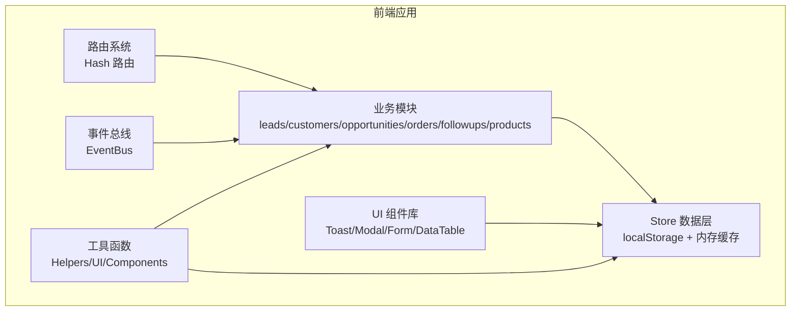
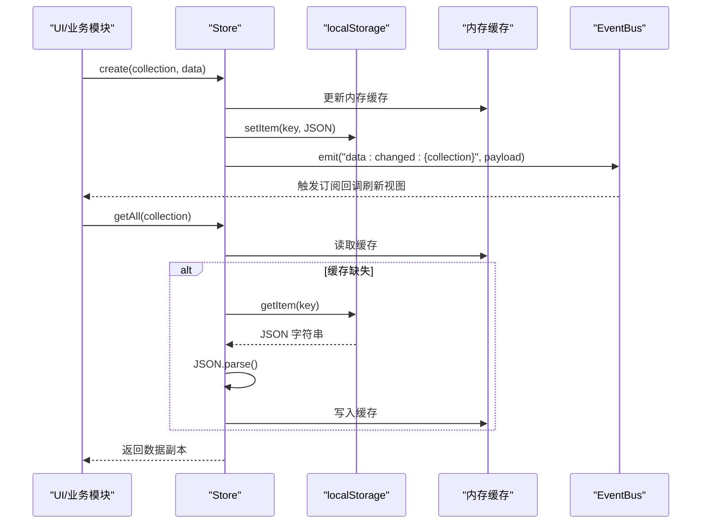
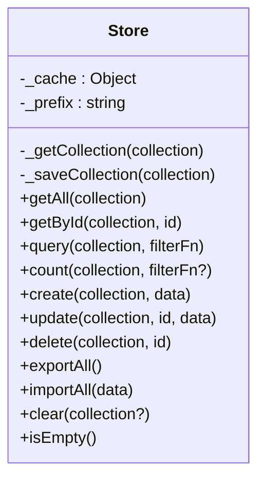
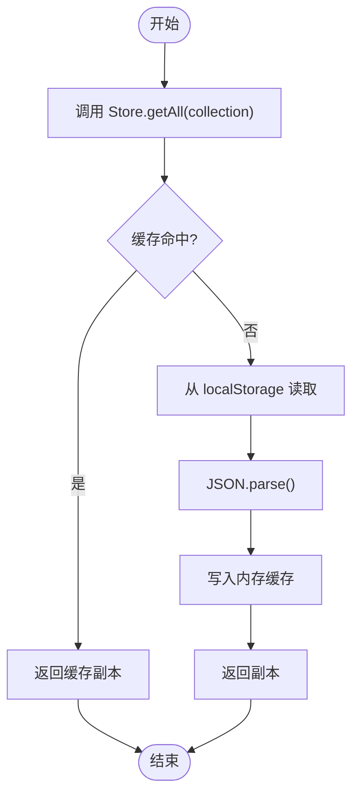
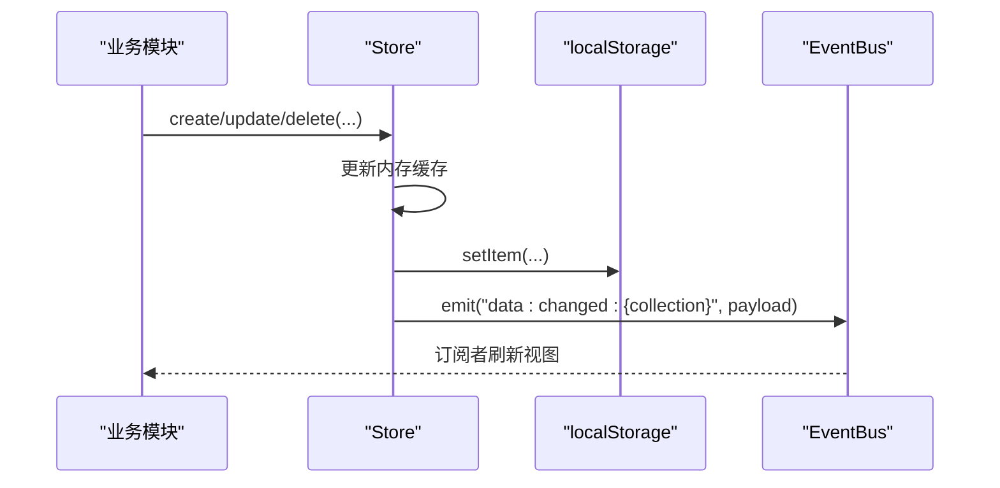
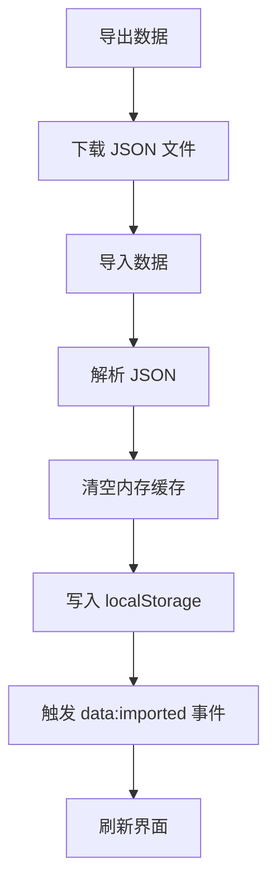
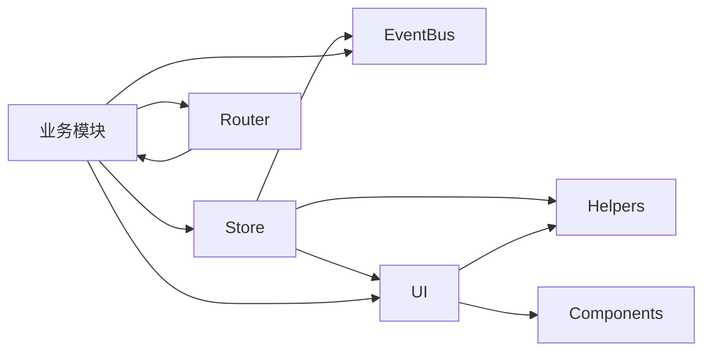

# 数据存储集成

<cite>
**本文档引用的文件**
- [store.js](file://js/store.js)
- [helpers.js](file://js/utils/helpers.js)
- [events.js](file://js/events.js)
- [router.js](file://js/router.js)
- [ui.js](file://js/ui.js)
- [components.js](file://js/components.js)
- [leads.js](file://js/modules/leads.js)
- [customers.js](file://js/modules/customers.js)
- [opportunities.js](file://js/modules/opportunities.js)
- [orders.js](file://js/modules/orders.js)
- [followups.js](file://js/modules/followups.js)
- [seed.js](file://js/utils/seed.js)
- [app.js](file://js/app.js)
</cite>

## 目录
1. [简介](#简介)
2. [项目结构](#项目结构)
3. [核心组件](#核心组件)
4. [架构总览](#架构总览)
5. [详细组件分析](#详细组件分析)
6. [依赖关系分析](#依赖关系分析)
7. [性能考虑](#性能考虑)
8. [故障排查指南](#故障排查指南)
9. [结论](#结论)
10. [附录](#附录)

## 简介
本指南面向CRM系统的数据存储集成，聚焦于Store模块的设计与使用，涵盖数据模型、CRUD操作、查询方法、数据验证与错误处理、缓存策略、性能优化、数据同步与一致性、以及数据迁移与版本管理等主题。通过阅读本指南，开发者可以快速掌握如何在前端环境中以本地存储为核心的数据层进行高效、可靠的数据操作。

## 项目结构
CRM系统采用模块化的前端架构，Store作为统一的数据层，各业务模块（线索、客户、商机、订单、跟进记录、产品等）通过Store进行数据读写；UI组件负责展示与交互；路由系统驱动页面切换；工具函数提供通用能力；事件总线用于模块间解耦通信。

图表来源
- [store.js:1-139](file://js/store.js#L1-L139)
- [leads.js:1-286](file://js/modules/leads.js#L1-L286)
- [customers.js:1-229](file://js/modules/customers.js#L1-L229)
- [opportunities.js:1-485](file://js/modules/opportunities.js#L1-L485)
- [orders.js:1-234](file://js/modules/orders.js#L1-L234)
- [followups.js:1-189](file://js/modules/followups.js#L1-L189)
- [ui.js:1-371](file://js/ui.js#L1-L371)
- [router.js:1-62](file://js/router.js#L1-L62)
- [events.js:1-36](file://js/events.js#L1-L36)
- [helpers.js:1-113](file://js/utils/helpers.js#L1-L113)
- [components.js:1-324](file://js/components.js#L1-L324)

章节来源
- [store.js:1-139](file://js/store.js#L1-L139)
- [app.js:1-316](file://js/app.js#L1-L316)

## 核心组件
- Store：统一的数据访问层，封装localStorage读写、内存缓存、事件广播、数据导出/导入、清空等能力。
- Helpers：通用工具函数，如ID生成、时间格式化、防抖、HTML转义、金额格式化等。
- EventBus：轻量事件总线，支持命名空间通配符，用于模块间解耦通信。
- Router：基于hash的前端路由，支持参数解析与编程式导航。
- UI：通用UI组件与交互工具，包括Toast、Modal、Form、DataTable等。
- Components：通用组件库，如数据表格、标签页、详情卡片等。
- 各业务模块：线索、客户、商机、订单、跟进记录、产品等，均通过Store进行数据操作。

章节来源
- [store.js:1-139](file://js/store.js#L1-L139)
- [helpers.js:1-113](file://js/utils/helpers.js#L1-L113)
- [events.js:1-36](file://js/events.js#L1-L36)
- [router.js:1-62](file://js/router.js#L1-L62)
- [ui.js:1-371](file://js/ui.js#L1-L371)
- [components.js:1-324](file://js/components.js#L1-L324)

## 架构总览
Store模块以localStorage为持久化介质，结合内存缓存提升读取性能，并通过事件总线在数据变更时通知相关模块，实现松耦合的前端数据流。

图表来源
- [store.js:1-139](file://js/store.js#L1-L139)
- [events.js:1-36](file://js/events.js#L1-L36)

## 详细组件分析

### Store 模块详解
- 数据模型
  - 所有集合均以数组形式存储，每条记录包含基础字段：id、createdAt、updatedAt。
  - create/update自动维护时间戳，确保数据可追踪。
- 查询方法
  - getAll(collection)：返回集合副本，避免外部修改影响缓存。
  - getById(collection, id)：按主键查找，不存在返回null。
  - query(collection, filterFn)：条件过滤，支持复杂查询。
  - count(collection, filterFn?)：计数，可选过滤器。
- 写入方法
  - create(collection, data)：新增记录，自动生成id与时间戳，写入缓存并持久化，触发data:changed:*事件。
  - update(collection, id, data)：按id更新，返回新记录或null。
  - delete(collection, id)：按id删除，返回布尔值。
- 数据管理
  - exportAll()/importAll(data)/clear(collection?)：全量导出/导入/清空。
  - isEmpty()：判断初始数据是否为空。
- 错误处理
  - 读取/保存失败时记录错误日志并提示用户（通过UI.toast），避免崩溃。
- 缓存策略
  - _cache：内存缓存，按集合维度缓存，首次读取从localStorage解析后写入缓存。
  - _getCollection/_saveCollection：封装缓存与持久化的读写逻辑。

图表来源
- [store.js:1-139](file://js/store.js#L1-L139)

章节来源
- [store.js:1-139](file://js/store.js#L1-L139)

### CRUD 操作与数据模型
- create(collection, data)
  - 自动填充id（若未提供）、createdAt、updatedAt。
  - 使用Helpers.now()与Helpers.generateId()生成时间戳与唯一标识。
  - 写入缓存与localStorage，触发data:changed:*事件。
- update(collection, id, data)
  - 保持原id、createdAt不变，更新updatedAt。
  - 触发data:changed:*事件。
- delete(collection, id)
  - 删除后立即持久化，触发data:changed:*事件。
- 数据模型约定
  - 所有记录至少包含：id、createdAt、updatedAt。
  - 部分模块在create时追加业务字段（如leads、customers、opportunities、orders、followups、products）。

章节来源
- [store.js:54-96](file://js/store.js#L54-L96)
- [helpers.js:5-11](file://js/utils/helpers.js#L5-L11)
- [leads.js:159-180](file://js/modules/leads.js#L159-L180)
- [customers.js:184-206](file://js/modules/customers.js#L184-L206)
- [opportunities.js:277-301](file://js/modules/opportunities.js#L277-L301)
- [orders.js:182-211](file://js/modules/orders.js#L182-L211)
- [followups.js:118-169](file://js/modules/followups.js#L118-L169)
- [products.js:126-151](file://js/modules/products.js#L126-L151)

### 查询方法与数据获取
- getAll(collection)
  - 返回集合副本，避免外部直接修改缓存。
- getById(collection, id)
  - 快速定位记录，不存在返回null。
- query(collection, filterFn)
  - 支持任意过滤逻辑，常用于按字段筛选。
- count(collection, filterFn?)
  - 可选过滤器，便于统计。
- 典型使用场景
  - 全局搜索：App.bindGlobalSearch()遍历多个集合进行模糊匹配。
  - 子列表渲染：模块内部使用Store.getAll()/query()构建子表格。
  - 统计展示：App.renderSettings()调用Store.count()展示各类数据量。

图表来源
- [store.js:33-51](file://js/store.js#L33-L51)
- [app.js:80-110](file://js/app.js#L80-L110)

章节来源
- [store.js:33-51](file://js/store.js#L33-L51)
- [app.js:80-110](file://js/app.js#L80-L110)

### 数据更新与删除
- create/update/delete
  - 统一触发data:changed:*事件，订阅者可响应刷新。
  - 删除后立即持久化，避免状态不一致。
- 业务模块中的典型用法
  - Leads.showForm()/handleDelete()：表单提交与删除确认。
  - Customers.showForm()/handleDelete()：客户管理。
  - Opportunities.handleWin()：赢单流程中创建订单并更新商机。
  - Orders.showForm()/handleDelete()：订单管理。
  - FollowUps.showForm()/handleDelete()：跟进记录管理。
  - Products.showForm()/handleDelete()：产品管理。

图表来源
- [store.js:54-96](file://js/store.js#L54-L96)
- [leads.js:168-178](file://js/modules/leads.js#L168-L178)
- [customers.js:194-205](file://js/modules/customers.js#L194-L205)
- [opportunities.js:308-339](file://js/modules/opportunities.js#L308-L339)
- [orders.js:194-210](file://js/modules/orders.js#L194-L210)
- [followups.js:137-154](file://js/modules/followups.js#L137-L154)
- [products.js:136-150](file://js/modules/products.js#L136-L150)

章节来源
- [leads.js:168-196](file://js/modules/leads.js#L168-L196)
- [customers.js:194-222](file://js/modules/customers.js#L194-L222)
- [opportunities.js:308-339](file://js/modules/opportunities.js#L308-L339)
- [orders.js:194-227](file://js/modules/orders.js#L194-L227)
- [followups.js:137-183](file://js/modules/followups.js#L137-L183)
- [products.js:136-168](file://js/modules/products.js#L136-L168)

### 数据验证与错误处理
- 表单验证
  - UI.getFormData()对必填字段进行校验，添加错误样式与提示。
  - 支持number类型的数值转换与空值处理。
- 存储错误处理
  - Store读取/保存失败时记录错误并弹出Toast提示，避免抛出异常中断流程。
- 业务层保护
  - 大多数模块在执行删除、更新等危险操作前进行二次确认（UI.confirm）。
  - 详情页访问时对不存在的记录进行兜底处理（提示并跳转）。

章节来源
- [ui.js:276-316](file://js/ui.js#L276-L316)
- [store.js:14-29](file://js/store.js#L14-L29)
- [leads.js:185-195](file://js/modules/leads.js#L185-L195)
- [customers.js:211-221](file://js/modules/customers.js#L211-L221)
- [opportunities.js:467-477](file://js/modules/opportunities.js#L467-L477)
- [orders.js:216-226](file://js/modules/orders.js#L216-L226)
- [followups.js:172-182](file://js/modules/followups.js#L172-L182)
- [products.js:157-167](file://js/modules/products.js#L157-L167)

### 缓存策略与性能优化
- 内存缓存
  - Store._cache按集合维度缓存，首次读取从localStorage解析后写入缓存，后续读取直接命中。
- 防抖与搜索优化
  - Helpers.debounce用于全局搜索与表格搜索，降低频繁计算开销。
  - Components.DataTable内置搜索、排序、分页，支持大数据集的虚拟滚动友好体验。
- 事件驱动刷新
  - 通过EventBus在数据变更时通知订阅者，避免全量轮询。
- 性能建议
  - 对高频查询使用query+filterFn组合，避免重复遍历。
  - 大批量写入时尽量合并操作，减少多次emit与持久化。
  - 在UI层对长列表使用分页或虚拟滚动（DataTable已内置分页）。

章节来源
- [store.js:5-20](file://js/store.js#L5-L20)
- [helpers.js:64-70](file://js/utils/helpers.js#L64-L70)
- [components.js:34-67](file://js/components.js#L34-L67)
- [app.js:70-160](file://js/app.js#L70-L160)

### 数据同步与一致性
- 事件总线
  - Store在每次create/update/delete后emit对应事件，订阅者可刷新视图。
  - EventBus支持通配符（如data:*），便于模块级监听。
- 并发访问
  - 由于采用单页应用与内存缓存，同一浏览器上下文中不存在跨标签页并发写入问题。
  - 若需跨标签页同步，可在localStorage上监听storage事件进行同步（当前未实现）。
- 一致性保障
  - 写入顺序：更新内存缓存 -> 写入localStorage -> 发布事件 -> 视图刷新。
  - 读取顺序：优先内存缓存 -> 读取localStorage -> 写入缓存 -> 返回副本。

章节来源
- [store.js:65-96](file://js/store.js#L65-L96)
- [events.js:18-30](file://js/events.js#L18-L30)

### 数据迁移与版本管理
- 数据导出/导入
  - Store.exportAll()导出所有集合数据；App.renderSettings()提供下载按钮。
  - Store.importAll()导入数据并清空内存缓存，随后触发data:imported事件。
- 演示数据注入
  - SeedData.seed()在首次运行时注入演示数据，避免空数据状态。
  - SeedData.shouldSeed()根据Store.isEmpty()判断是否需要注入。
- 版本管理建议
  - 导出数据时保留版本号字段，导入时进行兼容性检查。
  - 迁移脚本可先exportAll()，再对数据结构进行转换，最后importAll()。
  - 清空数据时同时清理缓存（Store.clear() + Store._cache = {}）。

图表来源
- [store.js:99-116](file://js/store.js#L99-L116)
- [app.js:236-275](file://js/app.js#L236-L275)
- [seed.js:6-11](file://js/utils/seed.js#L6-L11)

章节来源
- [store.js:99-116](file://js/store.js#L99-L116)
- [app.js:236-293](file://js/app.js#L236-L293)
- [seed.js:6-11](file://js/utils/seed.js#L6-L11)

## 依赖关系分析

图表来源
- [store.js:1-139](file://js/store.js#L1-L139)
- [leads.js:1-286](file://js/modules/leads.js#L1-L286)
- [customers.js:1-229](file://js/modules/customers.js#L1-L229)
- [opportunities.js:1-485](file://js/modules/opportunities.js#L1-L485)
- [orders.js:1-234](file://js/modules/orders.js#L1-L234)
- [followups.js:1-189](file://js/modules/followups.js#L1-L189)
- [ui.js:1-371](file://js/ui.js#L1-L371)
- [router.js:1-62](file://js/router.js#L1-L62)
- [events.js:1-36](file://js/events.js#L1-L36)
- [helpers.js:1-113](file://js/utils/helpers.js#L1-L113)
- [components.js:1-324](file://js/components.js#L1-L324)

章节来源
- [store.js:1-139](file://js/store.js#L1-L139)
- [leads.js:1-286](file://js/modules/leads.js#L1-L286)
- [customers.js:1-229](file://js/modules/customers.js#L1-L229)
- [opportunities.js:1-485](file://js/modules/opportunities.js#L1-L485)
- [orders.js:1-234](file://js/modules/orders.js#L1-L234)
- [followups.js:1-189](file://js/modules/followups.js#L1-L189)
- [ui.js:1-371](file://js/ui.js#L1-L371)
- [router.js:1-62](file://js/router.js#L1-L62)
- [events.js:1-36](file://js/events.js#L1-L36)
- [helpers.js:1-113](file://js/utils/helpers.js#L1-L113)
- [components.js:1-324](file://js/components.js#L1-L324)

## 性能考虑
- 读写路径
  - 读：内存缓存命中则直接返回；未命中则从localStorage读取并写入缓存。
  - 写：先更新内存缓存，再持久化，最后发布事件。
- 搜索与排序
  - DataTable内置搜索、排序、分页，避免一次性渲染大量数据。
  - 使用Helpers.debounce降低输入事件频率。
- 事件与刷新
  - 通过EventBus精准通知订阅者，避免全量刷新。
- 存储限制
  - localStorage容量有限，建议控制单次导出大小，必要时拆分导出。

[本节为通用指导，无需特定文件来源]

## 故障排查指南
- 无法保存数据
  - 检查localStorage可用性与容量；Store在保存失败时会记录错误并弹出Toast。
  - 确认网络环境与浏览器隐私模式设置。
- 页面不刷新或数据不同步
  - 确认订阅了data:changed:*事件；必要时手动触发刷新。
  - 检查EventBus订阅是否正确注册。
- 表单提交失败
  - 使用UI.getFormData()返回值判断验证是否通过；查看必填字段是否为空。
- 导入/导出异常
  - 确认JSON格式正确；导入前先备份当前数据。
  - 导入后检查data:imported事件是否触发。

章节来源
- [store.js:24-29](file://js/store.js#L24-L29)
- [ui.js:276-316](file://js/ui.js#L276-L316)
- [events.js:18-30](file://js/events.js#L18-L30)
- [app.js:236-275](file://js/app.js#L236-L275)

## 结论
Store模块通过localStorage与内存缓存的组合，提供了简洁而强大的前端数据层能力。配合EventBus、UI组件与路由系统，实现了模块间的低耦合与高效的用户体验。遵循本文档的集成规范与最佳实践，可以在保证数据一致性的同时，获得良好的性能与可维护性。

[本节为总结，无需特定文件来源]

## 附录
- 常用方法速查
  - getAll(collection)：获取集合
  - getById(collection, id)：按ID获取
  - query(collection, filterFn)：条件查询
  - count(collection, filterFn?)：计数
  - create(collection, data)：新增
  - update(collection, id, data)：更新
  - delete(collection, id)：删除
  - exportAll()/importAll(data)/clear(collection?)：数据管理
- 数据模型约定
  - 所有记录至少包含：id、createdAt、updatedAt
  - 部分模块在create时追加业务字段（如leads、customers、opportunities、orders、followups、products）

[本节为概览，无需特定文件来源]