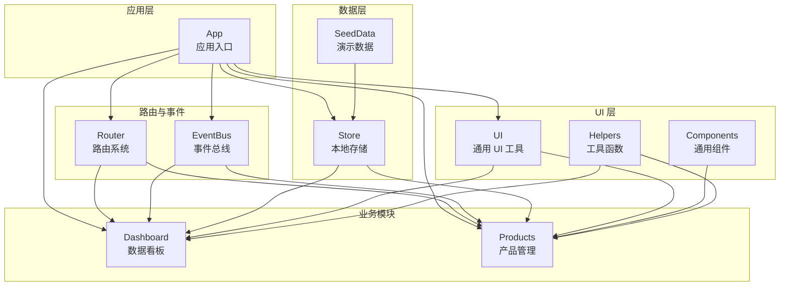
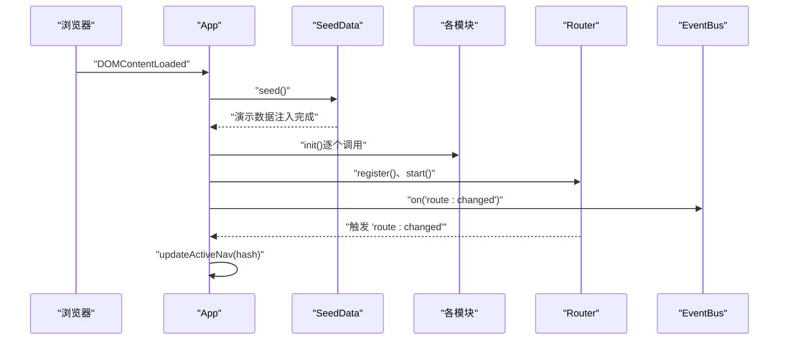
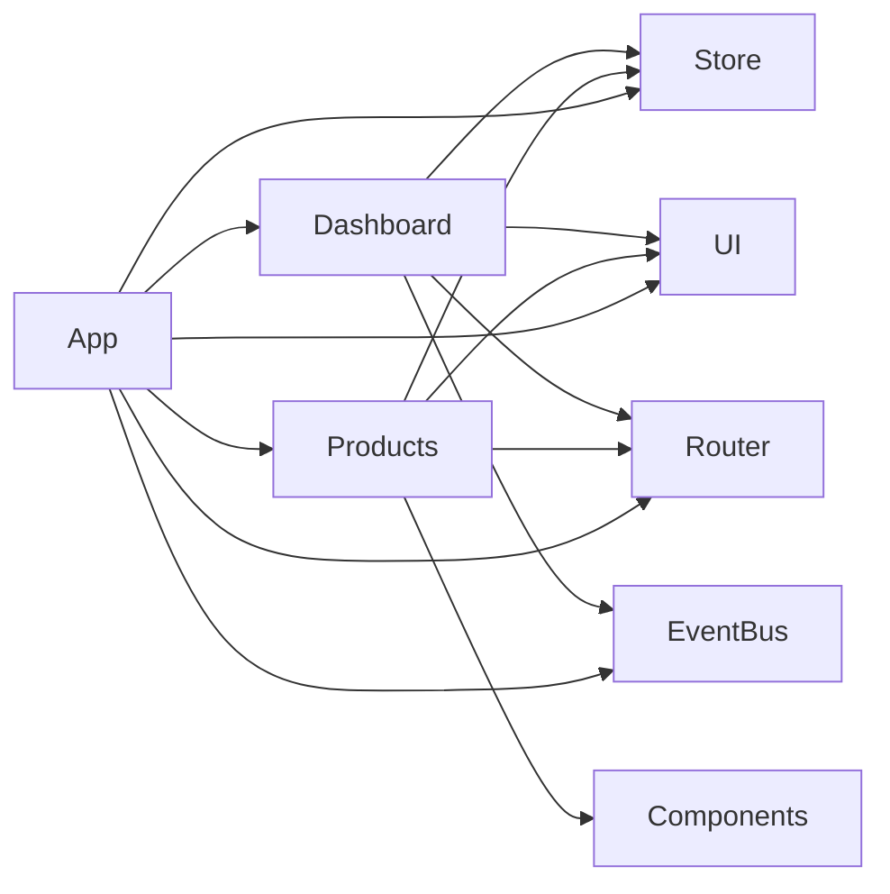

# 模块开发

<cite>
**本文引用的文件列表**
- [app.js](file://js/app.js)
- [events.js](file://js/events.js)
- [store.js](file://js/store.js)
- [router.js](file://js/router.js)
- [ui.js](file://js/ui.js)
- [components.js](file://js/components.js)
- [helpers.js](file://js/utils/helpers.js)
- [seed.js](file://js/utils/seed.js)
- [dashboard.js](file://js/modules/dashboard.js)
- [products.js](file://js/modules/products.js)
</cite>

## 目录
1. [引言](#引言)
2. [项目结构](#项目结构)
3. [核心组件](#核心组件)
4. [架构总览](#架构总览)
5. [详细组件分析](#详细组件分析)
6. [依赖关系分析](#依赖关系分析)
7. [性能考量](#性能考量)
8. [故障排查指南](#故障排查指南)
9. [结论](#结论)
10. [附录：模板与示例路径](#附录模板与示例路径)

## 引言
本指南面向希望在 CRM 系统中开发新业务模块的开发者，目标是帮助你快速理解系统架构、掌握模块基本结构与生命周期、学会使用事件总线与 Store 进行数据交互，并完成 UI 集成与用户交互处理。文档将结合现有模块示例，给出可直接参考的模板与最佳实践。

## 项目结构
系统采用“模块化 + 轻量前端框架”的组织方式：
- 应用入口负责初始化与路由绑定
- 模块以命名空间对象形式存在，每个模块包含 init、render、destroy 等方法
- 事件总线用于模块间解耦通信
- Store 提供本地持久化数据访问
- Router 基于 hash 的简单路由
- UI 与 Components 提供通用 UI 组件与工具
- Helpers 提供通用工具函数
- SeedData 在首次运行时注入演示数据

图表来源
- [app.js:1-316](file://js/app.js#L1-L316)
- [router.js:1-62](file://js/router.js#L1-L62)
- [events.js:1-36](file://js/events.js#L1-L36)
- [store.js:1-139](file://js/store.js#L1-L139)
- [ui.js:1-364](file://js/ui.js#L1-L364)
- [components.js:1-324](file://js/components.js#L1-L324)
- [helpers.js:1-113](file://js/utils/helpers.js#L1-L113)
- [seed.js:1-142](file://js/utils/seed.js#L1-L142)
- [dashboard.js:1-220](file://js/modules/dashboard.js#L1-L220)
- [products.js:1-175](file://js/modules/products.js#L1-L175)

章节来源
- [app.js:1-316](file://js/app.js#L1-L316)
- [router.js:1-62](file://js/router.js#L1-L62)
- [events.js:1-36](file://js/events.js#L1-L36)
- [store.js:1-139](file://js/store.js#L1-L139)
- [ui.js:1-364](file://js/ui.js#L1-L364)
- [components.js:1-324](file://js/components.js#L1-L324)
- [helpers.js:1-113](file://js/utils/helpers.js#L1-L113)
- [seed.js:1-142](file://js/utils/seed.js#L1-L142)
- [dashboard.js:1-220](file://js/modules/dashboard.js#L1-L220)
- [products.js:1-175](file://js/modules/products.js#L1-L175)

## 核心组件
- 应用入口 App：负责注入演示数据、初始化各模块、注册路由、绑定导航与搜索、启动路由、监听路由变化并更新导航高亮。
- 路由 Router：基于 hash 的简单路由，支持模式匹配与参数提取，触发路由变更事件。
- 事件总线 EventBus：提供 on/off/emit/clear，支持通配符事件名，用于模块间解耦通信。
- 数据层 Store：封装 localStorage 的 CRUD、查询、计数、导入导出、清空等能力，并在变更时通过 EventBus 发布事件。
- UI 与 Components：提供通用 UI 组件（如数据表格、详情卡片、标签页、模态框、表单等），以及页面渲染与通知工具。
- 工具函数 Helpers：提供 ID 生成、日期/金额格式化、防抖、截断、HTML 转义、颜色哈希、时间戳等。
- 演示数据 SeedData：在首次运行时注入演示数据，便于快速体验。

章节来源
- [app.js:1-316](file://js/app.js#L1-L316)
- [router.js:1-62](file://js/router.js#L1-L62)
- [events.js:1-36](file://js/events.js#L1-L36)
- [store.js:1-139](file://js/store.js#L1-L139)
- [ui.js:1-364](file://js/ui.js#L1-L364)
- [components.js:1-324](file://js/components.js#L1-L324)
- [helpers.js:1-113](file://js/utils/helpers.js#L1-L113)
- [seed.js:1-142](file://js/utils/seed.js#L1-L142)

## 架构总览
下面的序列图展示了应用启动流程与模块初始化顺序，以及路由变化时的导航高亮更新。

图表来源
- [app.js:1-41](file://js/app.js#L1-L41)
- [seed.js:10-134](file://js/utils/seed.js#L10-L134)
- [router.js:53-60](file://js/router.js#L53-L60)
- [events.js:36-38](file://js/events.js#L36-L38)

章节来源
- [app.js:1-41](file://js/app.js#L1-L41)
- [seed.js:10-134](file://js/utils/seed.js#L10-L134)
- [router.js:53-60](file://js/router.js#L53-L60)
- [events.js:36-38](file://js/events.js#L36-L38)

## 详细组件分析

### 模块生命周期与基本结构
- 模块应至少包含以下方法：
  - init：注册路由、订阅事件、绑定必要的全局行为
  - render：根据当前路由参数渲染页面内容
  - destroy（可选）：清理事件监听、定时器、DOM 事件等资源
- 模块内部通常会：
  - 使用 Router.register 注册页面路由
  - 使用 Store 查询/更新/删除数据
  - 使用 UI.setPageTitle/UI.render 渲染页面
  - 使用 EventBus.on/emit 进行跨模块通信
  - 使用 Components 组件构建复杂 UI

示例参考：
- [dashboard.js:211-218](file://js/modules/dashboard.js#L211-L218)
- [products.js:170-173](file://js/modules/products.js#L170-L173)

章节来源
- [dashboard.js:211-218](file://js/modules/dashboard.js#L211-L218)
- [products.js:170-173](file://js/modules/products.js#L170-L173)

### 事件总线 EventBus 使用指南
- 订阅事件：EventBus.on('事件名', 回调)
- 取消订阅：EventBus.off('事件名', 回调)
- 发布事件：EventBus.emit('事件名', ...args)
- 通配符：支持 '前缀:*'，例如 'data:changed:*'
- Store 在 create/update/delete/clear/imported 时会发布相应事件，模块可订阅实现联动刷新

示例参考：
- [events.js:7-30](file://js/events.js#L7-L30)
- [store.js:65-95](file://js/store.js#L65-L95)
- [store.js:115](file://js/store.js#L115)
- [store.js:130](file://js/store.js#L130)
- [dashboard.js:214-217](file://js/modules/dashboard.js#L214-L217)

章节来源
- [events.js:7-30](file://js/events.js#L7-L30)
- [store.js:65-95](file://js/store.js#L65-L95)
- [store.js:115](file://js/store.js#L115)
- [store.js:130](file://js/store.js#L130)
- [dashboard.js:214-217](file://js/modules/dashboard.js#L214-L217)

### UI 集成与用户交互
- 页面渲染：
  - 使用 UI.setPageTitle 设置页面标题与面包屑
  - 使用 UI.render 将 DOM 片段插入到 #app-content
- 通用组件：
  - DataTable：支持搜索、排序、分页、筛选、行点击、操作按钮等
  - DetailCard：用于展示详情字段
  - Tabs：标签页切换
  - Badge：状态标签
- 交互提示：
  - UI.toast：轻提示
  - UI.confirm：确认对话框
  - UI.modal/formModal：模态框与表单模态框

示例参考：
- [products.js:22-74](file://js/modules/products.js#L22-L74)
- [products.js:77-124](file://js/modules/products.js#L77-L124)
- [components.js:6-271](file://js/components.js#L6-L271)
- [ui.js:48-191](file://js/ui.js#L48-L191)

章节来源
- [products.js:22-74](file://js/modules/products.js#L22-L74)
- [products.js:77-124](file://js/modules/products.js#L77-L124)
- [components.js:6-271](file://js/components.js#L6-L271)
- [ui.js:48-191](file://js/ui.js#L48-L191)

### Store 集成：数据获取、更新与删除
- 获取数据：
  - Store.getAll(collection)：获取集合
  - Store.getById(collection, id)：按 ID 获取
  - Store.query(collection, filterFn)：条件查询
  - Store.count(collection, filterFn?)：计数
- 写入数据：
  - Store.create(collection, data)：新增，返回新记录
  - Store.update(collection, id, data)：更新，返回新记录
  - Store.delete(collection, id)：删除，返回布尔
- 导入导出与清空：
  - Store.exportAll()/importAll(data)/clear(collection?)
- 事件联动：
  - Store 在写入/删除/清空后会发布 data:changed:* 事件，模块可订阅实现自动刷新

示例参考：
- [store.js:33-51](file://js/store.js#L33-L51)
- [store.js:54-96](file://js/store.js#L54-L96)
- [store.js:98-132](file://js/store.js#L98-L132)
- [products.js:134-149](file://js/modules/products.js#L134-L149)
- [dashboard.js:9-24](file://js/modules/dashboard.js#L9-L24)

章节来源
- [store.js:33-51](file://js/store.js#L33-L51)
- [store.js:54-96](file://js/store.js#L54-L96)
- [store.js:98-132](file://js/store.js#L98-L132)
- [products.js:134-149](file://js/modules/products.js#L134-L149)
- [dashboard.js:9-24](file://js/modules/dashboard.js#L9-L24)

### 路由与导航
- Router.register(pattern, handler)：注册路由模式（支持 :param）
- Router.navigate(hash)：编程式导航
- Router.start()：启动监听 hashchange
- Router.current()：获取当前路由
- App 中监听 'route:changed' 并更新导航高亮

示例参考：
- [router.js:8-36](file://js/router.js#L8-L36)
- [router.js:38-60](file://js/router.js#L38-L60)
- [app.js:36-61](file://js/app.js#L36-L61)
- [products.js:170-173](file://js/modules/products.js#L170-L173)

章节来源
- [router.js:8-36](file://js/router.js#L8-L36)
- [router.js:38-60](file://js/router.js#L38-L60)
- [app.js:36-61](file://js/app.js#L36-L61)
- [products.js:170-173](file://js/modules/products.js#L170-L173)

### 模块间事件通信与联动刷新
- Store 写入/删除/清空后会发布 data:changed:集合名 事件
- 模块可在 init 中订阅 data:changed:*，当当前路由命中时自动刷新 render
- Dashboard 示例展示了订阅通配符事件并在路由命中时刷新

示例参考：
- [store.js:65-95](file://js/store.js#L65-L95)
- [dashboard.js:214-217](file://js/modules/dashboard.js#L214-L217)

章节来源
- [store.js:65-95](file://js/store.js#L65-L95)
- [dashboard.js:214-217](file://js/modules/dashboard.js#L214-L217)

### 搜索与全局交互
- App.bindGlobalSearch：基于 Store.getAll 对多集合进行搜索，支持防抖与 ESC 关闭
- App.updateActiveNav：根据路由 hash 更新导航高亮
- App.bindNavigation/App.bindMobileSidebar：侧边栏与导航绑定

示例参考：
- [app.js:63-160](file://js/app.js#L63-L160)
- [app.js:43-61](file://js/app.js#L43-L61)

章节来源
- [app.js:63-160](file://js/app.js#L63-L160)
- [app.js:43-61](file://js/app.js#L43-L61)

## 依赖关系分析
- 模块对 Store 的依赖：所有模块均通过 Store 访问/修改数据
- 模块对 Router 的依赖：通过 Router.register 注册路由，使用 Router.navigate 进行导航
- 模块对 UI/Components 的依赖：通过 UI.setPageTitle/UI.render 渲染页面；通过 Components 组件构建复杂 UI
- 模块对 EventBus 的依赖：通过订阅/发布事件实现模块间解耦
- App 对各模块的依赖：在 App.init 中逐一调用各模块的 init 方法

图表来源
- [dashboard.js:1-220](file://js/modules/dashboard.js#L1-L220)
- [products.js:1-175](file://js/modules/products.js#L1-L175)
- [app.js:1-316](file://js/app.js#L1-L316)
- [router.js:1-62](file://js/router.js#L1-L62)
- [events.js:1-36](file://js/events.js#L1-L36)
- [store.js:1-139](file://js/store.js#L1-L139)
- [ui.js:1-364](file://js/ui.js#L1-L364)
- [components.js:1-324](file://js/components.js#L1-L324)

章节来源
- [dashboard.js:1-220](file://js/modules/dashboard.js#L1-L220)
- [products.js:1-175](file://js/modules/products.js#L1-L175)
- [app.js:1-316](file://js/app.js#L1-L316)
- [router.js:1-62](file://js/router.js#L1-L62)
- [events.js:1-36](file://js/events.js#L1-L36)
- [store.js:1-139](file://js/store.js#L1-L139)
- [ui.js:1-364](file://js/ui.js#L1-L364)
- [components.js:1-324](file://js/components.js#L1-L324)

## 性能考量
- 防抖：全局搜索与表格搜索均使用 Helpers.debounce 减少频繁计算
- 分页与排序：DataTable 组件内置分页与排序，避免一次性渲染大量数据
- 缓存：Store 内部对集合进行内存缓存，减少 localStorage 读取次数
- 事件订阅：模块应在 destroy 中取消订阅，避免重复订阅导致内存泄漏
- 渲染策略：优先使用 UI.render 插入 DOM，避免频繁重排

章节来源
- [app.js:70-142](file://js/app.js#L70-L142)
- [components.js:188-200](file://js/components.js#L188-L200)
- [store.js:9-30](file://js/store.js#L9-L30)
- [helpers.js:64-70](file://js/utils/helpers.js#L64-L70)

## 故障排查指南
- 页面不刷新或数据不同步
  - 检查是否正确订阅了 data:changed:* 事件并在当前路由命中时刷新
  - 参考：[dashboard.js:214-217](file://js/modules/dashboard.js#L214-L217)
- 路由不生效或无法导航
  - 确认 Router.register 是否正确注册，Router.start 是否已调用
  - 参考：[router.js:8-36](file://js/router.js#L8-L36), [router.js:53-60](file://js/router.js#L53-L60)
- 数据保存失败或存储空间不足
  - Store 会在保存失败时输出错误日志并提示 toast
  - 参考：[store.js:24-29](file://js/store.js#L24-L29)
- 搜索无结果或结果异常
  - 检查 App.bindGlobalSearch 的搜索逻辑与集合字段
  - 参考：[app.js:80-110](file://js/app.js#L80-L110)
- 模态框或表单验证问题
  - 使用 UI.formModal 与 UI.getFormData，确保字段定义与 required 校验一致
  - 参考：[ui.js:165-191](file://js/ui.js#L165-L191), [ui.js:277-316](file://js/ui.js#L277-L316)

章节来源
- [dashboard.js:214-217](file://js/modules/dashboard.js#L214-L217)
- [router.js:8-36](file://js/router.js#L8-L36)
- [router.js:53-60](file://js/router.js#L53-L60)
- [store.js:24-29](file://js/store.js#L24-L29)
- [app.js:80-110](file://js/app.js#L80-L110)
- [ui.js:165-191](file://js/ui.js#L165-L191)
- [ui.js:277-316](file://js/ui.js#L277-L316)

## 结论
通过遵循模块化结构（init/render/destroy）、合理使用 EventBus 与 Store、配合 UI/Components 组件与 Router，开发者可以快速构建稳定、可维护的业务模块。建议在开发过程中：
- 在 init 中注册路由与事件订阅
- 在 render 中完成页面渲染与交互绑定
- 在 destroy 中清理事件与资源
- 使用 Store 的 CRUD 与事件机制实现模块间解耦
- 借助 DataTable、DetailCard、Tabs 等组件提升开发效率

## 附录：模板与示例路径
- 模块模板（结构与方法）
  - [dashboard.js:211-218](file://js/modules/dashboard.js#L211-L218)
  - [products.js:170-173](file://js/modules/products.js#L170-L173)
- 事件总线使用
  - [events.js:7-30](file://js/events.js#L7-L30)
  - [store.js:65-95](file://js/store.js#L65-L95)
- UI 集成与组件
  - [ui.js:48-191](file://js/ui.js#L48-L191)
  - [components.js:6-271](file://js/components.js#L6-L271)
- 路由与导航
  - [router.js:8-36](file://js/router.js#L8-L36)
  - [app.js:36-61](file://js/app.js#L36-L61)
- 数据层与演示数据
  - [store.js:33-51](file://js/store.js#L33-L51)
  - [store.js:54-96](file://js/store.js#L54-L96)
  - [seed.js:10-134](file://js/utils/seed.js#L10-L134)