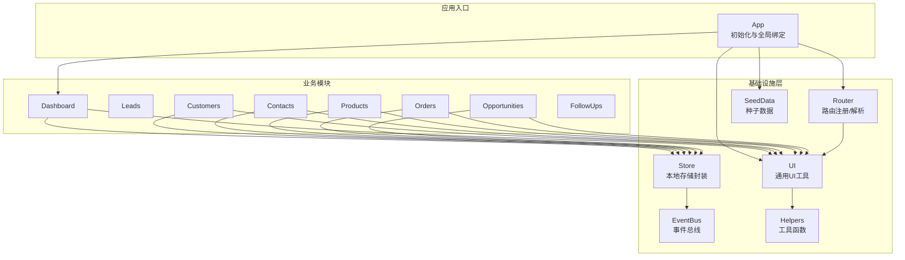
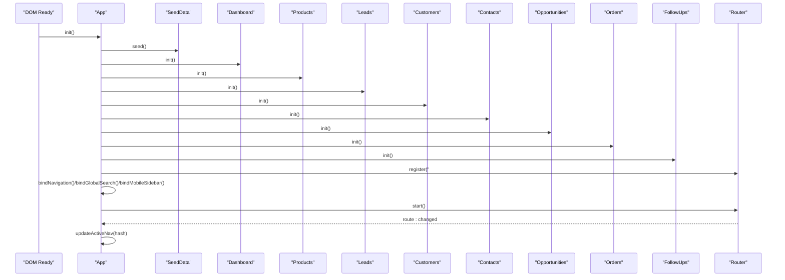
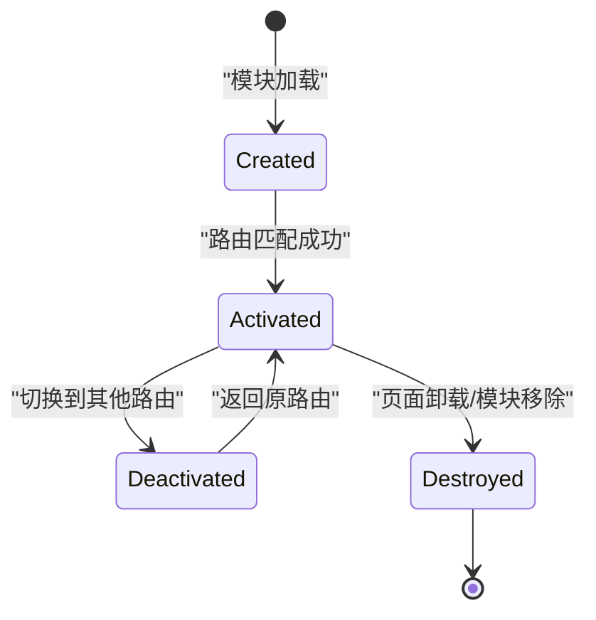
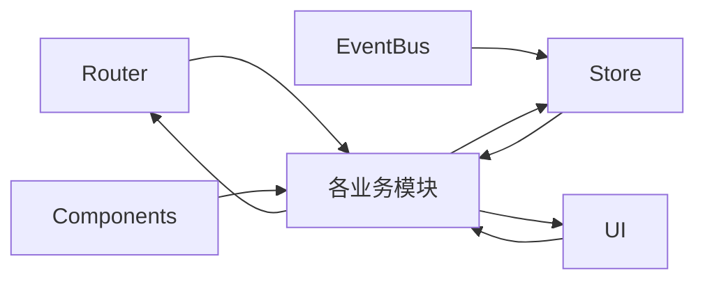
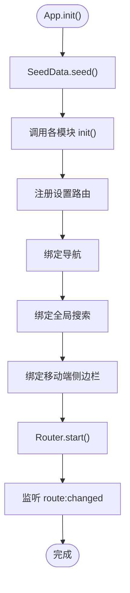
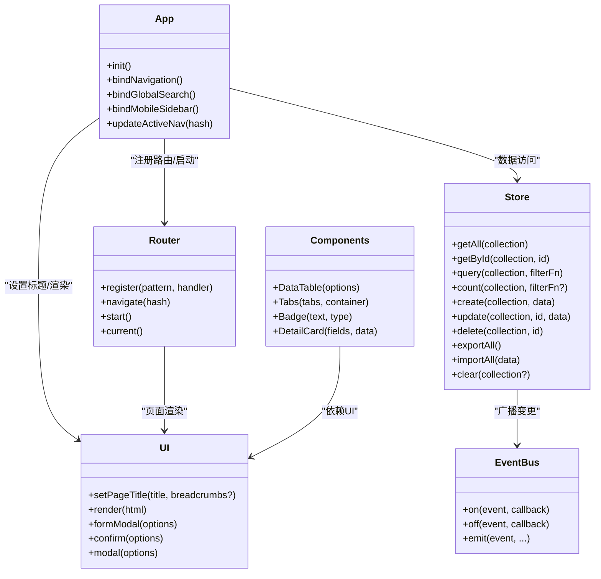

# 模块结构设计

<cite>
**本文档引用的文件**
- [app.js](file://js/app.js)
- [router.js](file://js/router.js)
- [events.js](file://js/events.js)
- [store.js](file://js/store.js)
- [ui.js](file://js/ui.js)
- [helpers.js](file://js/utils/helpers.js)
- [seed.js](file://js/utils/seed.js)
- [components.js](file://js/components.js)
- [dashboard.js](file://js/modules/dashboard.js)
- [contacts.js](file://js/modules/contacts.js)
- [customers.js](file://js/modules/customers.js)
- [products.js](file://js/modules/products.js)
- [orders.js](file://js/modules/orders.js)
- [opportunities.js](file://js/modules/opportunities.js)
</cite>

## 目录
1. [引言](#引言)
2. [项目结构](#项目结构)
3. [核心组件](#核心组件)
4. [架构总览](#架构总览)
5. [详细组件分析](#详细组件分析)
6. [依赖关系分析](#依赖关系分析)
7. [性能考虑](#性能考虑)
8. [故障排除指南](#故障排除指南)
9. [结论](#结论)
10. [附录](#附录)

## 引言
本指南面向CRM系统的前端模块化开发，旨在建立统一的模块结构设计规范，明确模块的职责边界、生命周期管理与交互方式。文档围绕以下目标展开：
- 规范模块的基本结构与必需方法：init() 初始化、render() 渲染、destroy() 销毁
- 明确模块命名规范与文件组织方式
- 提供模块模板与最佳实践
- 解释模块间依赖关系与初始化顺序
- 说明模块生命周期管理与路由联动机制

## 项目结构
项目采用“按功能域分层”的模块组织方式，核心目录如下：
- js/app.js：应用入口与全局初始化
- js/modules/：业务模块目录，每个模块一个文件，遵循统一结构
- js/utils/：工具函数与种子数据
- js/components.js：通用组件库
- js/router.js、js/events.js、js/store.js、js/ui.js：基础设施层

图表来源
- [app.js:1-41](file://js/app.js#L1-L41)
- [router.js:1-62](file://js/router.js#L1-L62)
- [events.js:1-36](file://js/events.js#L1-L36)
- [store.js:1-139](file://js/store.js#L1-L139)
- [ui.js:1-364](file://js/ui.js#L1-L364)
- [helpers.js:1-113](file://js/utils/helpers.js#L1-L113)
- [seed.js:1-142](file://js/utils/seed.js#L1-L142)
- [components.js:1-324](file://js/components.js#L1-L324)

章节来源
- [app.js:1-41](file://js/app.js#L1-L41)
- [router.js:1-62](file://js/router.js#L1-L62)
- [store.js:1-139](file://js/store.js#L1-L139)
- [ui.js:1-364](file://js/ui.js#L1-L364)
- [helpers.js:1-113](file://js/utils/helpers.js#L1-L113)
- [seed.js:1-142](file://js/utils/seed.js#L1-L142)
- [components.js:1-324](file://js/components.js#L1-L324)

## 核心组件
本节聚焦于模块结构设计的核心要素：init()、render()、destroy() 的职责与实现要求；以及模块命名与文件组织规范。

- init() 初始化方法
  - 职责：注册路由、订阅事件、绑定导航、绑定全局搜索等
  - 实现要求：在 App.init() 中按模块顺序调用，确保依赖模块先于当前模块初始化
  - 示例参考：[app.js:10-18](file://js/app.js#L10-L18)、[dashboard.js:211-218](file://js/modules/dashboard.js#L211-L218)

- render() 渲染方法
  - 职责：构建页面DOM、绑定交互事件、调用UI.render()输出
  - 实现要求：使用UI.setPageTitle()设置标题与面包屑；使用UI.render()输出内容；避免直接操作全局状态
  - 示例参考：[dashboard.js:6-209](file://js/modules/dashboard.js#L6-L209)、[customers.js:23-91](file://js/modules/customers.js#L23-L91)

- destroy() 销毁方法
  - 职责：清理事件监听、移除DOM、释放资源
  - 实现要求：在路由切换或模块卸载时调用；确保不遗留内存泄漏
  - 注意：当前多数模块未显式实现destroy()，建议在复杂交互场景补充

- 模块命名规范与文件组织
  - 文件名：模块名全小写，如 contacts.js、customers.js
  - 目录：js/modules/
  - 结构：每个模块文件包含常量定义（COLLECTION、FIELDS）、init()、render()、showForm()、handleDelete() 等
  - 示例参考：[contacts.js:1-185](file://js/modules/contacts.js#L1-L185)、[customers.js:1-229](file://js/modules/customers.js#L1-L229)

章节来源
- [app.js:10-18](file://js/app.js#L10-L18)
- [dashboard.js:6-209](file://js/modules/dashboard.js#L6-L209)
- [dashboard.js:211-218](file://js/modules/dashboard.js#L211-L218)
- [contacts.js:1-185](file://js/modules/contacts.js#L1-L185)
- [customers.js:1-229](file://js/modules/customers.js#L1-L229)

## 架构总览
下图展示了模块初始化顺序与路由注册流程，体现App.init()如何串联各模块。

图表来源
- [app.js:6-41](file://js/app.js#L6-L41)
- [dashboard.js:211-218](file://js/modules/dashboard.js#L211-L218)
- [products.js:170-173](file://js/modules/products.js#L170-L173)
- [orders.js:229-232](file://js/modules/orders.js#L229-L232)
- [opportunities.js:480-483](file://js/modules/opportunities.js#L480-L483)
- [router.js:54-60](file://js/router.js#L54-L60)

章节来源
- [app.js:6-41](file://js/app.js#L6-L41)
- [router.js:1-62](file://js/router.js#L1-L62)

## 详细组件分析

### 模块模板与最佳实践
- 模板结构
  - 常量定义：COLLECTION、FIELDS、STATUS_MAP/STAGES 等
  - init()：注册路由（如 "#/xxx" 与 "#/xxx/view/:id"）
  - renderList()：列表页渲染与DataTable组件使用
  - renderDetail(id)：详情页渲染与Tabs组件使用
  - showForm(id?)：表单弹窗与UI.formModal集成
  - handleDelete(id)：删除确认与Store操作
  - renderSubList(...)：嵌入其他模块的子列表（如客户详情中的联系人、商机、订单）

- 模板参考路径
  - [contacts.js:1-185](file://js/modules/contacts.js#L1-L185)
  - [customers.js:1-229](file://js/modules/customers.js#L1-L229)
  - [products.js:1-175](file://js/modules/products.js#L1-L175)
  - [orders.js:1-234](file://js/modules/orders.js#L1-L234)
  - [opportunities.js:1-485](file://js/modules/opportunities.js#L1-L485)

- 最佳实践
  - 使用UI.setPageTitle()设置页面标题与面包屑
  - 使用UI.formModal()统一表单弹窗，配合UI.buildForm()与UI.getFormData()进行表单构建与校验
  - 使用Components.DataTable()与Components.Tabs()提升复用性
  - 在Store.create/update/delete后通过EventBus.emit("data:changed:*")驱动视图刷新
  - 列表页使用搜索、筛选、排序与分页，详情页使用Tab分组展示

章节来源
- [contacts.js:1-185](file://js/modules/contacts.js#L1-L185)
- [customers.js:1-229](file://js/modules/customers.js#L1-L229)
- [products.js:1-175](file://js/modules/products.js#L1-L175)
- [orders.js:1-234](file://js/modules/orders.js#L1-L234)
- [opportunities.js:1-485](file://js/modules/opportunities.js#L1-L485)
- [ui.js:164-191](file://js/ui.js#L164-L191)
- [components.js:1-324](file://js/components.js#L1-L324)
- [store.js:65-96](file://js/store.js#L65-L96)

### 模块生命周期管理
- 创建：模块文件加载后，App.init()调用各模块init()完成路由注册
- 激活：Router根据hash匹配路由，调用对应模块render()渲染页面
- 停用：当前模块不再处于活跃路由时，应清理事件与DOM（建议实现destroy()）
- 销毁：页面卸载或模块不再需要时，释放资源

[本图为概念性流程图，无需图表来源]

### 模块间依赖关系
- 路由依赖：各模块通过Router.register注册路由，App.init()统一启动
- 数据依赖：各模块通过Store访问数据，Store通过EventBus广播变更
- UI依赖：各模块依赖UI组件（UI.setPageTitle、UI.render、UI.formModal等）
- 组件依赖：各模块依赖Components库（DataTable、Tabs、Badge、DetailCard）

图表来源
- [router.js:1-62](file://js/router.js#L1-L62)
- [store.js:1-139](file://js/store.js#L1-L139)
- [ui.js:1-364](file://js/ui.js#L1-L364)
- [components.js:1-324](file://js/components.js#L1-L324)
- [events.js:1-36](file://js/events.js#L1-L36)

章节来源
- [router.js:1-62](file://js/router.js#L1-L62)
- [store.js:1-139](file://js/store.js#L1-L139)
- [ui.js:1-364](file://js/ui.js#L1-L364)
- [components.js:1-324](file://js/components.js#L1-L324)
- [events.js:1-36](file://js/events.js#L1-L36)

### 初始化顺序与App.init()流程
- 步骤
  1) 注入种子数据（首次运行）
  2) 依次调用各模块init()注册路由
  3) 注册设置页路由
  4) 绑定导航、全局搜索、移动端侧边栏
  5) 启动Router并监听route:changed事件

图表来源
- [app.js:6-41](file://js/app.js#L6-L41)

章节来源
- [app.js:6-41](file://js/app.js#L6-L41)

## 依赖关系分析
- 模块到Store：所有模块均通过Store访问数据，遵循统一的数据读写接口
- 模块到UI：统一使用UI.setPageTitle/UI.render/UI.formModal等
- 模块到Router：通过Router.register注册路由，支持静态与动态参数
- 模块到EventBus：通过EventBus.emit("data:changed:*")通知视图刷新
- 模块到Components：使用DataTable/Tabs/Badge/DetailCard等通用组件

图表来源
- [app.js:1-41](file://js/app.js#L1-L41)
- [router.js:1-62](file://js/router.js#L1-L62)
- [store.js:1-139](file://js/store.js#L1-L139)
- [ui.js:1-364](file://js/ui.js#L1-L364)
- [events.js:1-36](file://js/events.js#L1-L36)
- [components.js:1-324](file://js/components.js#L1-L324)

章节来源
- [app.js:1-41](file://js/app.js#L1-L41)
- [router.js:1-62](file://js/router.js#L1-L62)
- [store.js:1-139](file://js/store.js#L1-L139)
- [ui.js:1-364](file://js/ui.js#L1-L364)
- [events.js:1-36](file://js/events.js#L1-L36)
- [components.js:1-324](file://js/components.js#L1-L324)

## 性能考虑
- 数据缓存：Store内部使用内存缓存减少localStorage频繁读写
- 事件防抖：全局搜索使用Helpers.debounce降低输入事件频率
- 懒渲染：列表页使用Components.DataTable内置分页与虚拟滚动能力
- 路由懒加载：当前为同步加载，后续可考虑按需加载模块以减小首屏体积

[本节为通用性能建议，无需章节来源]

## 故障排除指南
- 页面空白或路由不生效
  - 检查App.init()是否正确调用各模块init()
  - 检查Router.register是否正确注册路由
  - 参考：[app.js:6-41](file://js/app.js#L6-L41)、[router.js:8-36](file://js/router.js#L8-L36)

- 数据无法持久化
  - 检查localStorage可用性与容量
  - Store.saveCollection()异常会通过UI.toast提示
  - 参考：[store.js:23-29](file://js/store.js#L23-L29)

- 表单校验失败
  - 确认UI.getFormData()返回有效数据
  - 检查必填字段与类型转换
  - 参考：[ui.js:276-316](file://js/ui.js#L276-L316)

- 搜索无结果
  - 检查全局搜索绑定与防抖逻辑
  - 参考：[app.js:63-160](file://js/app.js#L63-L160)

章节来源
- [app.js:6-41](file://js/app.js#L6-L41)
- [router.js:8-36](file://js/router.js#L8-L36)
- [store.js:23-29](file://js/store.js#L23-L29)
- [ui.js:276-316](file://js/ui.js#L276-L316)
- [app.js:63-160](file://js/app.js#L63-L160)

## 结论
本指南建立了CRM系统模块化的结构设计规范，明确了模块职责、生命周期与依赖关系，并提供了模板与最佳实践。遵循这些规范有助于：
- 统一模块结构，提升可维护性
- 明确初始化顺序，避免依赖问题
- 提升开发效率，减少重复劳动
- 保障用户体验，优化性能与稳定性

[本节为总结性内容，无需章节来源]

## 附录

### 模块模板（结构与职责）
- 常量定义
  - COLLECTION：集合名称
  - FIELDS：表单字段定义
  - STATUS_MAP/STAGES：状态映射或阶段枚举
- 方法清单
  - init()：注册路由
  - renderList()：列表页渲染
  - renderDetail(id)：详情页渲染
  - showForm(id?)：表单弹窗
  - handleDelete(id)：删除确认
  - renderSubList(...)：子列表（嵌入其他模块）
- 参考实现
  - [contacts.js:1-185](file://js/modules/contacts.js#L1-L185)
  - [customers.js:1-229](file://js/modules/customers.js#L1-L229)
  - [products.js:1-175](file://js/modules/products.js#L1-L175)
  - [orders.js:1-234](file://js/modules/orders.js#L1-L234)
  - [opportunities.js:1-485](file://js/modules/opportunities.js#L1-L485)

### 初始化顺序清单（App.init）
- SeedData.seed()
- Dashboard.init()
- Products.init()
- Leads.init()
- Customers.init()
- Contacts.init()
- Opportunities.init()
- Orders.init()
- FollowUps.init()

章节来源
- [app.js:6-41](file://js/app.js#L6-L41)