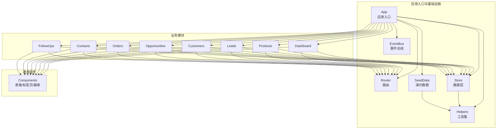
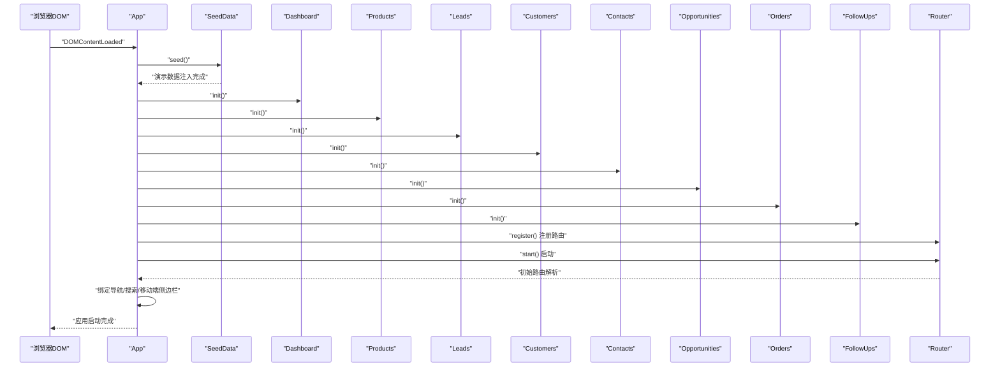
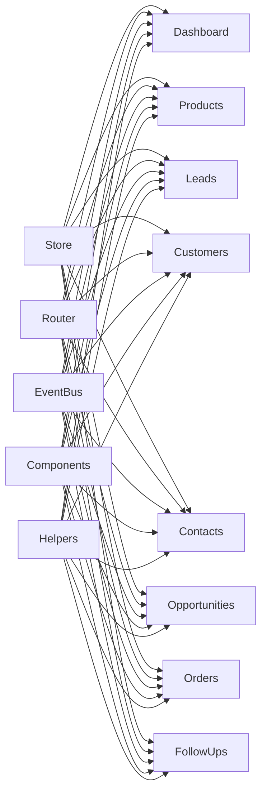

# 生命周期管理

<cite>
**本文引用的文件**
- [app.js](file://js/app.js)
- [router.js](file://js/router.js)
- [events.js](file://js/events.js)
- [store.js](file://js/store.js)
- [helpers.js](file://js/utils/helpers.js)
- [seed.js](file://js/utils/seed.js)
- [components.js](file://js/components.js)
- [dashboard.js](file://js/modules/dashboard.js)
- [products.js](file://js/modules/products.js)
- [leads.js](file://js/modules/leads.js)
- [customers.js](file://js/modules/customers.js)
- [opportunities.js](file://js/modules/opportunities.js)
- [orders.js](file://js/modules/orders.js)
- [contacts.js](file://js/modules/contacts.js)
- [followups.js](file://js/modules/followups.js)
</cite>

## 目录
1. [引言](#引言)
2. [项目结构](#项目结构)
3. [核心组件](#核心组件)
4. [架构总览](#架构总览)
5. [详细组件分析](#详细组件分析)
6. [依赖分析](#依赖分析)
7. [性能考虑](#性能考虑)
8. [故障排查指南](#故障排查指南)
9. [结论](#结论)
10. [附录](#附录)

## 引言
本指南聚焦于CRM系统的模块生命周期管理，围绕“初始化—运行—销毁”三个阶段，系统阐述模块的启动顺序、依赖关系、状态管理、模块间协调、资源清理、热重载与动态加载支持，以及测试与调试方法。目标是帮助开发者在不破坏现有功能的前提下，安全地扩展与维护模块。

## 项目结构
系统采用“入口应用 + 模块化业务模块 + 通用工具与基础设施”的分层组织方式：
- 入口与框架：app.js（应用启动）、router.js（路由）、events.js（事件总线）、store.js（本地存储与数据层）、helpers.js（工具集）、seed.js（演示数据注入）。
- 业务模块：dashboard、products、leads、customers、opportunities、orders、contacts、followups。
- 通用组件：components.js（表格、标签页、徽章等通用UI组件）。

图表来源
- [app.js:1-316](file://js/app.js#L1-L316)
- [router.js:1-62](file://js/router.js#L1-L62)
- [events.js:1-36](file://js/events.js#L1-L36)
- [store.js:1-139](file://js/store.js#L1-L139)
- [helpers.js:1-113](file://js/utils/helpers.js#L1-L113)
- [seed.js:1-142](file://js/utils/seed.js#L1-L142)
- [components.js:1-324](file://js/components.js#L1-L324)

章节来源
- [app.js:1-316](file://js/app.js#L1-L316)
- [router.js:1-62](file://js/router.js#L1-L62)
- [events.js:1-36](file://js/events.js#L1-L36)
- [store.js:1-139](file://js/store.js#L1-L139)
- [helpers.js:1-113](file://js/utils/helpers.js#L1-L113)
- [seed.js:1-142](file://js/utils/seed.js#L1-L142)
- [components.js:1-324](file://js/components.js#L1-L324)

## 核心组件
- 应用入口 App：负责演示数据注入、模块初始化、路由注册、导航绑定、全局搜索、移动端侧边栏、路由变更后的导航高亮更新。
- 路由 Router：基于hash的轻量路由，支持模式匹配与参数提取，提供编程式导航与初始启动。
- 事件总线 EventBus：发布/订阅模式，支持通配符事件，用于模块间解耦通信与状态广播。
- 数据层 Store：封装localStorage访问、缓存、CRUD、导入导出、清空与计数；通过事件总线广播数据变更。
- 工具集 Helpers：ID生成、日期/金额格式化、防抖、截断、HTML转义、颜色哈希、时间戳等。
- 演示数据 SeedData：按需注入演示数据，避免重复注入。
- 通用组件 Components：数据表格、详情卡片、标签页、徽章等，统一UI交互与行为。

章节来源
- [app.js:1-316](file://js/app.js#L1-L316)
- [router.js:1-62](file://js/router.js#L1-L62)
- [events.js:1-36](file://js/events.js#L1-L36)
- [store.js:1-139](file://js/store.js#L1-L139)
- [helpers.js:1-113](file://js/utils/helpers.js#L1-L113)
- [seed.js:1-142](file://js/utils/seed.js#L1-L142)
- [components.js:1-324](file://js/components.js#L1-L324)

## 架构总览
应用启动流程与模块初始化顺序如下：

图表来源
- [app.js:6-41](file://js/app.js#L6-L41)
- [seed.js:10-134](file://js/utils/seed.js#L10-L134)
- [dashboard.js:211-218](file://js/modules/dashboard.js#L211-L218)
- [products.js:170-173](file://js/modules/products.js#L170-L173)
- [leads.js:281-284](file://js/modules/leads.js#L281-L284)
- [customers.js:224-227](file://js/modules/customers.js#L224-L227)
- [contacts.js:181-183](file://js/modules/contacts.js#L181-L183)
- [opportunities.js:480-483](file://js/modules/opportunities.js#L480-L483)
- [orders.js:229-232](file://js/modules/orders.js#L229-L232)
- [followups.js:185-187](file://js/modules/followups.js#L185-L187)
- [router.js:54-60](file://js/router.js#L54-L60)

章节来源
- [app.js:6-41](file://js/app.js#L6-L41)
- [router.js:54-60](file://js/router.js#L54-L60)

## 详细组件分析

### 初始化阶段：准备工作与模块注册
- 演示数据注入：应用启动时调用 SeedData.seed()，若检测为空库则注入演示数据，避免重复注入。
- 模块初始化：App.init() 中依次调用各模块的 init() 方法，完成路由注册与模块级事件绑定。
- 路由启动：Router.start() 监听 hash 变化并解析初始路由。
- 导航与搜索：绑定侧边栏导航、全局搜索、移动端侧边栏遮罩点击关闭。
- 路由高亮：监听 EventBus 的 route:changed 事件，根据当前路由更新导航高亮。

章节来源
- [app.js:6-41](file://js/app.js#L6-L41)
- [seed.js:6-134](file://js/utils/seed.js#L6-L134)
- [router.js:54-60](file://js/router.js#L54-L60)
- [events.js:7-30](file://js/events.js#L7-L30)

### 运行阶段：功能实现与状态流转
- 数据驱动：Store 提供 CRUD 与批量操作，每次变更通过 EventBus 广播 data:changed:* 事件，实现模块间解耦。
- 视图渲染：各模块通过 Components 组件构建表格、详情卡片、标签页等，结合 UI.render() 渲染到页面。
- 路由驱动：Router.register() 注册各模块的列表与详情路由，支持参数提取与编程式导航。
- 事件联动：Dashboard 监听 data:changed:* 自动刷新；FollowUps/Opportunities/Customers 等模块在创建/更新后触发相应刷新逻辑。

章节来源
- [store.js:54-96](file://js/store.js#L54-L96)
- [events.js:18-30](file://js/events.js#L18-L30)
- [dashboard.js:211-218](file://js/modules/dashboard.js#L211-L218)
- [components.js:6-271](file://js/components.js#L6-L271)
- [router.js:9-36](file://js/router.js#L9-L36)

### 销毁阶段：资源清理与内存管理
- DOM 清理：页面切换时，建议在模块内部或上层统一调用 UI.render() 替换容器，以自然回收旧DOM树。
- 事件解绑：全局事件（如搜索输入、侧边栏遮罩）在 App.init() 中一次性绑定；若需动态卸载，应保留事件句柄并在模块销毁时移除。
- 缓存与存储：Store 使用内存缓存 + localStorage；模块销毁不需显式清理，但可通过 Store.clear() 或局部清空避免数据污染。
- 模块级事件：各模块 init() 中注册的路由与事件，应在模块卸载时通过 Router.off() 或 EventBus.off() 解绑（当前代码未实现，建议补充）。

章节来源
- [app.js:63-170](file://js/app.js#L63-L170)
- [store.js:23-30](file://js/store.js#L23-L30)

### 模块状态管理最佳实践
- 状态定义：每个模块维护 COLLECTION 常量与 FIELDS 字段定义，作为状态结构与UI字段映射的基础。
- 状态转换：通过 Store.update() 与 EventBus.emit() 实现状态变更与广播；例如商机阶段推进、线索转化、订单创建等。
- 持久化：Store 将数据写入 localStorage，确保刷新后状态不丢失；同时提供 exportAll/importAll/clear 以支持备份与重置。
- UI一致性：通过 UI.formModal/UI.modal/UI.toast 等统一交互，保证状态变更后的提示与刷新一致。

章节来源
- [opportunities.js:167-181](file://js/modules/opportunities.js#L167-L181)
- [leads.js:198-279](file://js/modules/leads.js#L198-L279)
- [orders.js:193-210](file://js/modules/orders.js#L193-L210)
- [store.js:98-132](file://js/store.js#L98-L132)

### 模块间协调与同步机制
- 事件总线：通过 EventBus.on/off/emit 支持跨模块通信；Dashboard 监听 data:changed:* 实现自动刷新。
- 路由联动：模块间通过 Router.navigate() 进行导航跳转，配合 EventBus.route:changed 更新导航高亮。
- 数据依赖：模块通过 Store.query/getById/getAll 获取关联数据，避免直接耦合。

章节来源
- [events.js:7-30](file://js/events.js#L7-L30)
- [dashboard.js:213-217](file://js/modules/dashboard.js#L213-L217)
- [router.js:39-51](file://js/router.js#L39-L51)

### 资源清理与内存管理
- 事件监听器：App.init() 中绑定的事件（如搜索、侧边栏、导航）应提供解绑能力；建议在模块销毁时移除。
- DOM元素：UI.render() 会替换容器内容，旧DOM由GC回收；避免在模块外持有长生命周期引用。
- 存储清理：Store.clear() 支持按集合或全量清空；配合 EventBus.data:cleared/data:changed:* 通知其他模块。

章节来源
- [app.js:63-170](file://js/app.js#L63-L170)
- [store.js:118-132](file://js/store.js#L118-L132)

### 模块的热重载与动态加载支持
- 现状：当前模块通过静态引入与 App.init() 顺序初始化，未实现动态加载。
- 建议：
  - 将模块 init() 抽离为可调用的工厂函数，按需 require 或 import。
  - 在 App.init() 中增加模块懒加载策略，结合路由命中再加载对应模块。
  - 为模块提供 destroy()/unmount() 接口，统一清理事件与DOM。
  - 通过模块清单与依赖图，控制加载顺序与循环依赖检测。

[本节为概念性建议，不直接分析具体文件]

### 模块测试与调试方法
- 单元测试：针对 Store 的 CRUD、Helpers 的格式化与工具函数、Router 的路由解析与导航进行单元测试。
- 集成测试：模拟 App.init() 流程，验证模块初始化顺序、路由注册、事件广播与UI渲染的一致性。
- 调试技巧：
  - 使用 console.log 与浏览器断点定位事件流与数据流。
  - 通过 EventBus.emit('data:changed:*') 手动触发刷新，验证 Dashboard 等模块的响应。
  - 使用 UI.toast 与 UI.modal 辅助定位交互问题。

[本节为通用指导，不直接分析具体文件]

## 依赖分析
模块间依赖关系与耦合度：
- 模块对 Store 的依赖：所有模块均依赖 Store 进行数据读写，耦合度高但职责清晰。
- 模块对 Router 的依赖：各模块注册自身路由，彼此通过 Router.navigate() 联动。
- 模块对 EventBus 的依赖：通过事件总线实现解耦刷新与跨模块通信。
- 模块对 Components 的依赖：统一UI组件，降低样式与交互差异。
- 模块对 Helpers 的依赖：格式化、防抖、ID生成等工具函数。

图表来源
- [store.js:1-139](file://js/store.js#L1-L139)
- [router.js:1-62](file://js/router.js#L1-L62)
- [events.js:1-36](file://js/events.js#L1-L36)
- [components.js:1-324](file://js/components.js#L1-L324)
- [helpers.js:1-113](file://js/utils/helpers.js#L1-L113)

章节来源
- [store.js:1-139](file://js/store.js#L1-L139)
- [router.js:1-62](file://js/router.js#L1-L62)
- [events.js:1-36](file://js/events.js#L1-L36)
- [components.js:1-324](file://js/components.js#L1-L324)
- [helpers.js:1-113](file://js/utils/helpers.js#L1-L113)

## 性能考虑
- 渲染优化：DataTable 组件内置搜索、排序、分页与防抖，减少不必要的重渲染。
- 缓存策略：Store 对集合进行内存缓存，避免频繁读取localStorage带来的性能损耗。
- 事件去抖：全局搜索使用 Helpers.debounce 控制输入频率，降低计算压力。
- 大数据量场景：建议在 Store 层增加分页与懒加载策略，避免一次性渲染过多DOM节点。

章节来源
- [components.js:6-271](file://js/components.js#L6-L271)
- [store.js:8-20](file://js/store.js#L8-L20)
- [helpers.js:63-70](file://js/utils/helpers.js#L63-L70)

## 故障排查指南
- 页面空白或模块不显示：
  - 检查 App.init() 是否正确调用各模块 init()。
  - 确认 Router.start() 已启动且初始路由解析成功。
- 数据不刷新：
  - 确认 Store.create/update/delete 后是否正确触发 EventBus.emit。
  - 检查模块是否监听 data:changed:* 事件并刷新视图。
- 路由跳转无效：
  - 检查 Router.register() 是否正确注册，参数是否匹配。
  - 确认 Router.navigate() 调用与 hash 变更事件是否生效。
- 搜索无结果：
  - 检查全局搜索绑定与防抖逻辑，确认输入事件是否触发。
  - 确认 Store.getAll() 查询范围与字段匹配。

章节来源
- [app.js:6-41](file://js/app.js#L6-L41)
- [store.js:65-95](file://js/store.js#L65-L95)
- [dashboard.js:213-217](file://js/modules/dashboard.js#L213-L217)
- [router.js:39-60](file://js/router.js#L39-L60)
- [app.js:63-170](file://js/app.js#L63-L170)

## 结论
该CRM系统通过 App.init() 的集中初始化、Router 的路由驱动、EventBus 的事件解耦与 Store 的数据持久化，形成了清晰的模块生命周期管理框架。建议后续增强模块的动态加载与销毁接口，完善事件解绑与DOM清理，以进一步提升可维护性与性能表现。

## 附录
- 模块初始化顺序（按 App.init() 调用顺序）：Dashboard → Products → Leads → Customers → Contacts → Opportunities → Orders → FollowUps。
- 关键事件与路由：
  - 事件：data:changed:*、route:changed、data:imported、data:cleared。
  - 路由：各模块的列表与详情路由，支持参数提取与编程式导航。

章节来源
- [app.js:10-18](file://js/app.js#L10-L18)
- [events.js:18-30](file://js/events.js#L18-L30)
- [router.js:9-36](file://js/router.js#L9-L36)