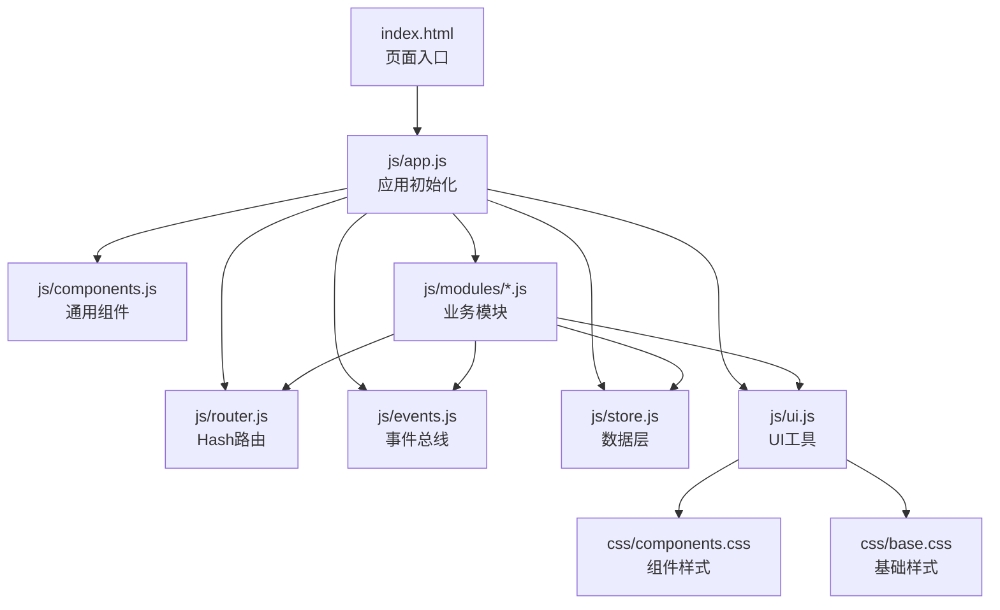
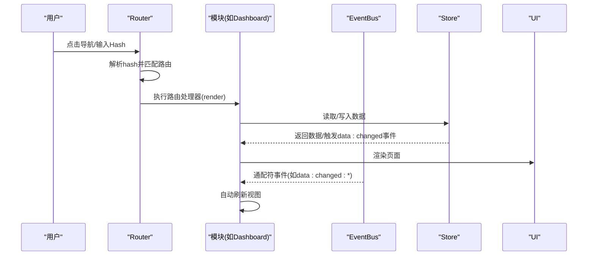
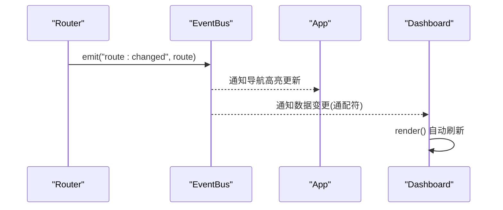
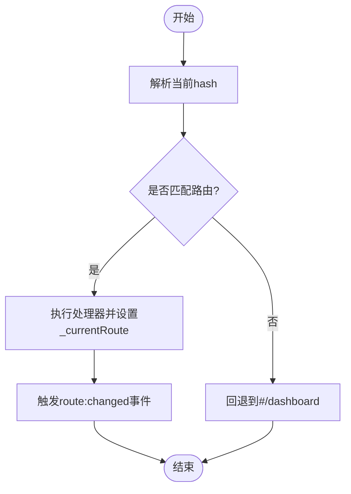
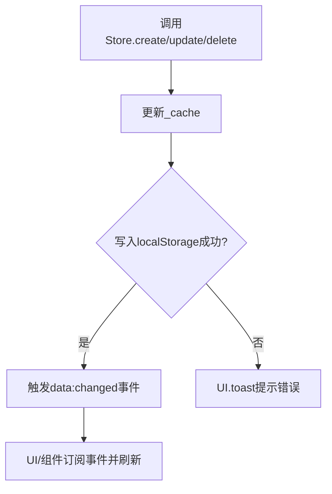
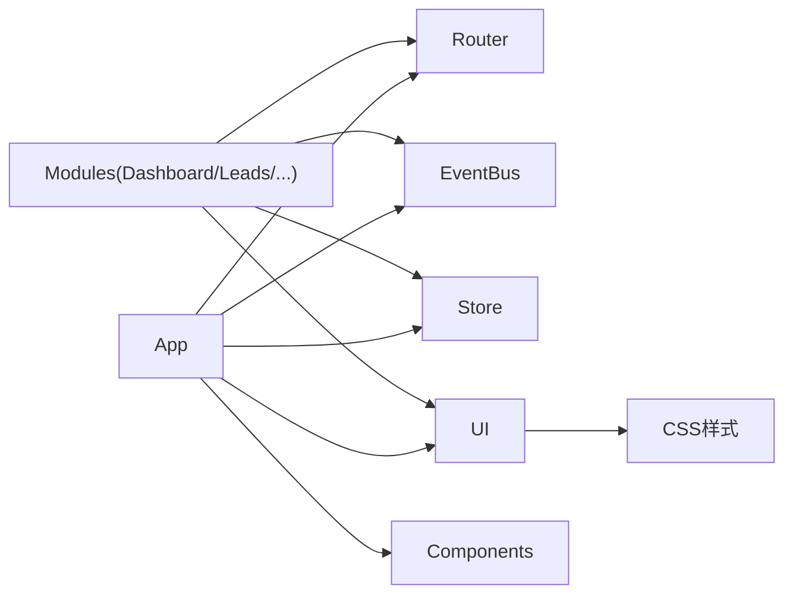

# 调试技巧

<cite>
**本文档引用的文件**
- [index.html](file://index.html)
- [app.js](file://js/app.js)
- [events.js](file://js/events.js)
- [router.js](file://js/router.js)
- [store.js](file://js/store.js)
- [ui.js](file://js/ui.js)
- [components.js](file://js/components.js)
- [helpers.js](file://js/utils/helpers.js)
- [dashboard.js](file://js/modules/dashboard.js)
- [leads.js](file://js/modules/leads.js)
- [base.css](file://css/base.css)
- [components.css](file://css/components.css)
</cite>

## 目录
1. [简介](#简介)
2. [项目结构](#项目结构)
3. [核心组件](#核心组件)
4. [架构总览](#架构总览)
5. [详细组件调试指南](#详细组件调试指南)
6. [依赖关系分析](#依赖关系分析)
7. [性能与内存调试](#性能与内存调试)
8. [常见问题排查流程](#常见问题排查流程)
9. [结论](#结论)

## 简介
本指南面向使用该 CRM 系统的开发者与测试人员，提供一套完整的调试方法论与实操步骤，涵盖：
- 浏览器开发者工具断点调试、变量监控与网络请求分析
- 事件系统 EventBus 的监听与触发调试
- Hash 路由的状态跟踪与页面切换问题排查
- Store 模块的数据状态检查与 localStorage 问题诊断
- UI 组件的 DOM 检查与样式问题排查
- 常见性能与内存问题的检测与优化建议

## 项目结构
该系统采用模块化前端架构，核心文件组织如下：
- 入口与应用控制：index.html、js/app.js
- 事件与路由：js/events.js、js/router.js
- 数据层：js/store.js
- UI 与组件：js/ui.js、js/components.js、js/utils/helpers.js
- 页面模块：js/modules/dashboard.js、leads.js 等
- 样式：css/base.css、css/components.css

图表来源
- [index.html](file://index.html)
- [app.js](file://js/app.js)
- [router.js](file://js/router.js)
- [events.js](file://js/events.js)
- [store.js](file://js/store.js)
- [ui.js](file://js/ui.js)
- [components.js](file://js/components.js)
- [base.css](file://css/base.css)
- [components.css](file://css/components.css)

章节来源
- [index.html](file://index.html)
- [app.js](file://js/app.js)

## 核心组件
- 应用入口与初始化：负责注册模块、绑定导航与搜索、启动路由、监听路由变化并更新导航高亮。
- 事件总线 EventBus：提供 on/off/emit/clear 方法，支持通配符事件，用于模块间解耦通信。
- Hash 路由 Router：注册路由模式、解析 hash、匹配处理器、触发路由变更事件。
- Store：封装 localStorage 的读写、缓存、增删改查、导入导出与清理。
- UI 工具 UI：提供 Toast、模态框、确认框、表单构建与渲染等通用 UI 能力。
- 通用组件 Components：提供数据表格、标签页、状态标签等可复用组件。
- 工具函数 Helpers：提供防抖、日期格式化、金额格式化、HTML 转义等工具。

章节来源
- [app.js](file://js/app.js)
- [events.js](file://js/events.js)
- [router.js](file://js/router.js)
- [store.js](file://js/store.js)
- [ui.js](file://js/ui.js)
- [components.js](file://js/components.js)
- [helpers.js](file://js/utils/helpers.js)

## 架构总览
系统采用“模块化 + 事件驱动 + 路由驱动”的前端架构：
- 模块通过 Router 注册路由，根据 hash 渲染对应页面。
- Store 提供统一数据访问与持久化，配合 EventBus 实现跨模块通信。
- UI 与 Components 提供一致的交互体验与组件复用。

图表来源
- [router.js](file://js/router.js)
- [dashboard.js](file://js/modules/dashboard.js)
- [store.js](file://js/store.js)
- [events.js](file://js/events.js)
- [ui.js](file://js/ui.js)

## 详细组件调试指南

### 浏览器开发者工具断点调试
- 断点位置建议
  - 应用初始化：在应用入口处设置断点，观察模块注册、导航绑定、路由启动流程。
  - 路由处理：在 Router 的处理器内部设置断点，观察参数解析与页面渲染。
  - 数据变更：在 Store 的 create/update/delete 中设置断点，观察数据流向与事件触发。
  - UI 渲染：在 UI.render 与组件 render 中设置断点，观察 DOM 更新。
- 变量监控
  - 在断点处使用监视面板观察 Router.current()、Store._cache、EventBus._listeners 等关键状态。
  - 使用 Console 执行 Store.count('leads')、UI.setPageTitle() 等命令快速验证。
- 网络请求分析
  - 在 Network 面板观察 localStorage 读写、文件导入导出、页面资源加载情况。
  - 对于导入导出，关注 MIME 类型与响应状态，确保 JSON 格式正确。

章节来源
- [app.js](file://js/app.js)
- [router.js](file://js/router.js)
- [store.js](file://js/store.js)
- [ui.js](file://js/ui.js)

### 事件系统调试（EventBus）
- 监听与触发
  - 在控制台使用 EventBus.on('route:changed', ...) 注册监听，观察路由变化事件是否被触发。
  - 在控制台使用 EventBus.emit('route:changed', { hash, pattern, params }) 手动触发，验证监听器是否收到参数。
  - 使用通配符事件：EventBus.on('data:changed:*', ...) 观察 Store 的 create/update/delete 是否触发相应事件。
- 事件清理
  - 使用 EventBus.off('event', callback) 取消特定监听，避免重复监听导致的内存泄漏。
  - 使用 EventBus.clear() 清理所有监听，便于彻底重置调试环境。

图表来源
- [router.js](file://js/router.js)
- [events.js](file://js/events.js)
- [app.js](file://js/app.js)
- [dashboard.js](file://js/modules/dashboard.js)

章节来源
- [events.js](file://js/events.js)
- [router.js](file://js/router.js)
- [app.js](file://js/app.js)
- [dashboard.js](file://js/modules/dashboard.js)

### 路由系统调试（Hash 路由）
- 状态跟踪
  - 在控制台执行 Router.current() 查看当前路由对象，包含 hash、pattern、params。
  - 在控制台执行 Router.register('#/leads/view/:id', handler) 注册自定义路由，验证正则匹配与参数提取。
- 页面切换排查
  - 使用 Router.navigate('#/leads') 强制导航，若 hash 相同，手动触发解析逻辑。
  - 观察 hashchange 事件是否触发，以及 EventBus.emit('route:changed', ...) 是否被调用。
- 参数与通配符
  - 在 Handler 中打印 params，确认命名捕获组是否正确。
  - 若路由未匹配，Router 会回退到默认路由，检查路由注册顺序与正则表达式。

图表来源
- [router.js](file://js/router.js)

章节来源
- [router.js](file://js/router.js)

### Store 模块调试
- 数据状态检查
  - 在控制台执行 Store.getAll('leads')、Store.count('customers') 等命令，验证缓存与本地存储一致性。
  - 使用 Store.query('opportunities', fn) 进行条件查询，结合 Helpers.formatMoney() 验证格式化输出。
- localStorage 问题诊断
  - 在 Application 面板查看 localStorage，确认键前缀与数据结构。
  - 使用 Store.exportAll()/importAll() 导出/导入数据，观察异常提示与缓存同步。
  - 若出现“存储空间不足”错误，检查浏览器存储配额与数据体积。
- 事件联动
  - 在 Store.create/update/delete 后，观察 EventBus.emit('data:changed:xxx') 是否触发，进而驱动 UI 自动刷新。

图表来源
- [store.js](file://js/store.js)

章节来源
- [store.js](file://js/store.js)

### UI 组件调试策略
- DOM 检查
  - 使用 Elements 面板检查组件容器类名（如 data-table-container、card、tabs），定位渲染节点。
  - 在组件 render 中设置断点，观察容器.innerHTML 与事件绑定过程。
- 样式问题排查
  - 使用 Styles 面板检查组件样式类（如 .data-table、.badge-*、.modal-*），确认主题变量与响应式断点。
  - 在 CSS 文件中定位组件样式，如 .data-table-container、.table-toolbar、.pagination 等。
- 交互行为
  - 在 Console 中直接调用 UI.setPageTitle()、UI.render() 验证页面标题与内容渲染。
  - 使用 UI.modal()/UI.confirm()/UI.formModal() 快速验证弹窗与表单交互。

章节来源
- [ui.js](file://js/ui.js)
- [components.js](file://js/components.js)
- [base.css](file://css/base.css)
- [components.css](file://css/components.css)

### 业务模块调试示例（以 Leads 模块为例）
- 列表渲染与筛选
  - 在 DataTable 组件中设置断点，观察 applySearch/applySort/render 流程。
  - 使用 UI.confirm() 删除线索，验证 Store.delete() 与 Router.navigate('#/leads')。
- 详情页与转化
  - 在 renderDetail 中设置断点，观察面包屑与 Tab 渲染。
  - 在 convertToCustomer 中设置断点，验证线索转化为客户的完整流程（创建客户、更新线索、创建联系人与跟进记录）。

章节来源
- [leads.js](file://js/modules/leads.js)
- [components.js](file://js/components.js)
- [ui.js](file://js/ui.js)
- [store.js](file://js/store.js)

## 依赖关系分析
- 模块耦合
  - App 依赖 Router、EventBus、Store、UI、Components，形成高层协调者角色。
  - 各模块（Dashboard、Leads 等）依赖 Router、Store、UI、EventBus，实现页面渲染与数据联动。
- 外部依赖
  - 浏览器原生 API：localStorage、hashchange、fetch（导入导出）、FileReader（导入文件）。
  - CSS 变量与动画：通过 CSS 变量控制主题与过渡效果。

图表来源
- [app.js](file://js/app.js)
- [router.js](file://js/router.js)
- [events.js](file://js/events.js)
- [store.js](file://js/store.js)
- [ui.js](file://js/ui.js)
- [components.js](file://js/components.js)
- [base.css](file://css/base.css)
- [components.css](file://css/components.css)

章节来源
- [app.js](file://js/app.js)
- [router.js](file://js/router.js)
- [events.js](file://js/events.js)
- [store.js](file://js/store.js)
- [ui.js](file://js/ui.js)
- [components.js](file://js/components.js)

## 性能与内存调试
- 性能热点定位
  - 使用 Performance 面板录制页面交互（如搜索、分页、排序），定位耗时操作。
  - 关注 DataTable 的 applySearch/applySort/render 与 UI.render 的调用频率。
- 内存泄漏排查
  - 使用 Memory 面板快照对比，检查是否存在未移除的事件监听器或 DOM 节点。
  - 确保在组件销毁或页面切换时，移除事件监听（如 DataTable 的事件绑定）。
- 存储与缓存
  - Store._cache 作为内存缓存，避免频繁读写 localStorage；在数据量大时注意缓存同步。
  - 导入/导出数据时，避免一次性渲染大量 DOM，建议分批处理或虚拟滚动。

[本节为通用指导，无需具体文件来源]

## 常见问题排查流程

### 路由不生效或页面不更新
- 步骤
  - 在控制台执行 Router.current()，确认当前路由对象。
  - 检查 Router.register 的注册顺序与正则表达式，确保优先级正确。
  - 观察 EventBus.emit('route:changed', ...) 是否触发，确认 App.updateActiveNav() 是否执行。
- 相关文件
  - [router.js](file://js/router.js)
  - [app.js](file://js/app.js)

章节来源
- [router.js](file://js/router.js)
- [app.js](file://js/app.js)

### 数据未持久化或丢失
- 步骤
  - 在 Application 面板检查 localStorage 键值，确认前缀与数据结构。
  - 在 Store._saveCollection() 中设置断点，观察异常提示与错误栈。
  - 使用 Store.exportAll()/importAll() 验证数据完整性。
- 相关文件
  - [store.js](file://js/store.js)

章节来源
- [store.js](file://js/store.js)

### UI 不显示或样式错乱
- 步骤
  - 在 Elements 面板检查容器类名与结构，确认 UI.render() 是否正确插入内容。
  - 在 Styles 面板检查组件样式类，核对 CSS 变量与媒体查询。
  - 使用 UI.setPageTitle() 验证面包屑与标题渲染。
- 相关文件
  - [ui.js](file://js/ui.js)
  - [components.css](file://css/components.css)
  - [base.css](file://css/base.css)

章节来源
- [ui.js](file://js/ui.js)
- [components.css](file://css/components.css)
- [base.css](file://css/base.css)

### 事件未触发或重复触发
- 步骤
  - 在控制台使用 EventBus.on('data:changed:*', ...) 注册监听，观察事件是否按预期触发。
  - 使用 EventBus.off('event', callback) 取消监听，避免重复绑定。
  - 在 Store 的 create/update/delete 中设置断点，确认 emit 调用次数与参数。
- 相关文件
  - [events.js](file://js/events.js)
  - [store.js](file://js/store.js)

章节来源
- [events.js](file://js/events.js)
- [store.js](file://js/store.js)

## 结论
通过上述调试方法，可以系统性地定位与解决 CRM 系统中的路由、事件、数据与 UI 相关问题。建议在日常开发中：
- 将关键流程（路由、事件、数据变更）纳入断点调试清单
- 使用控制台命令快速验证状态与行为
- 借助浏览器性能与内存面板持续优化用户体验
- 在模块边界处加强日志与断言，提升可维护性