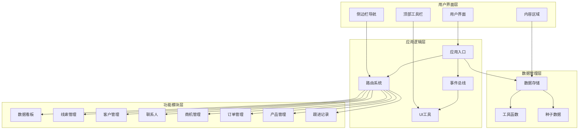
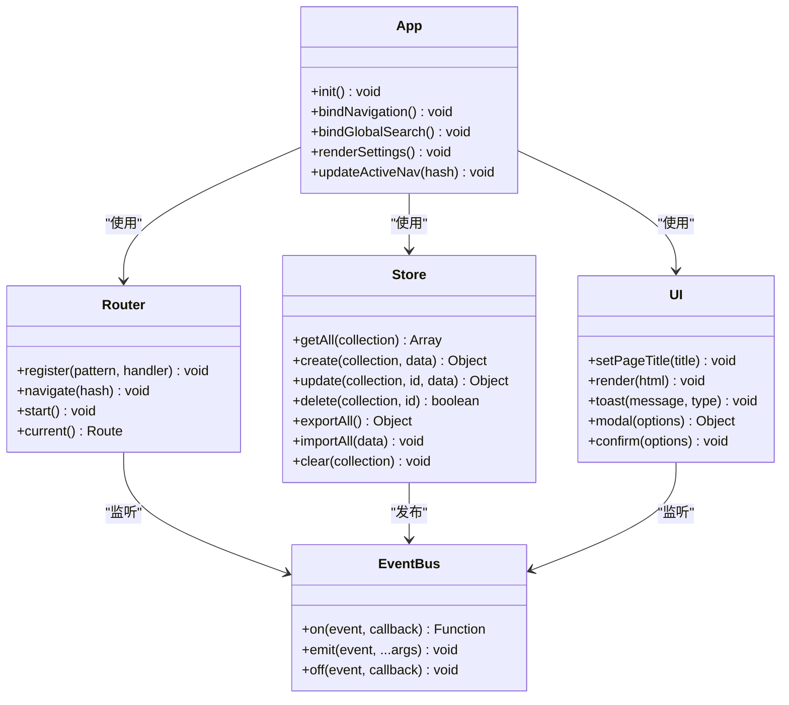
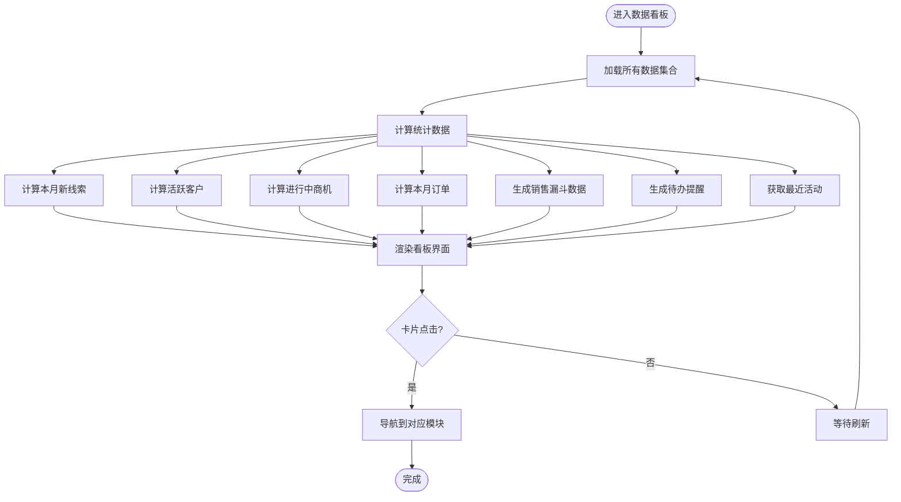
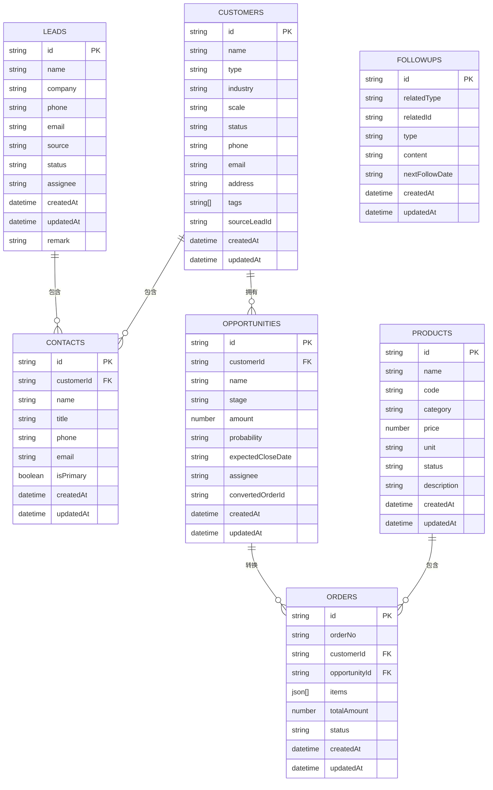
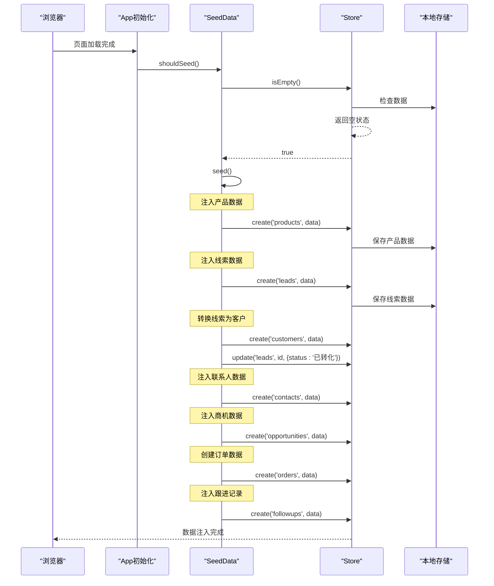
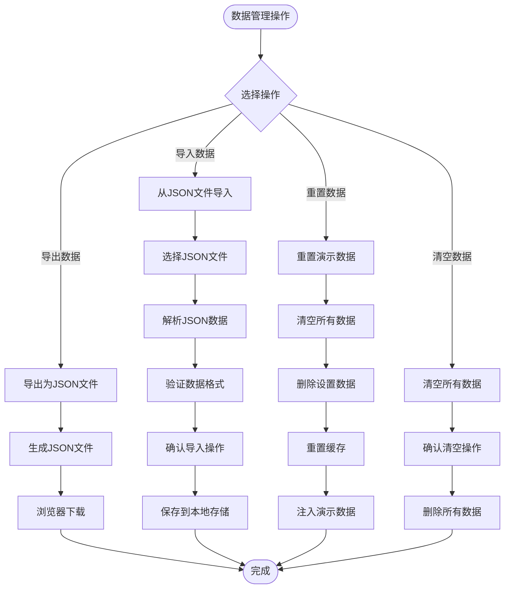
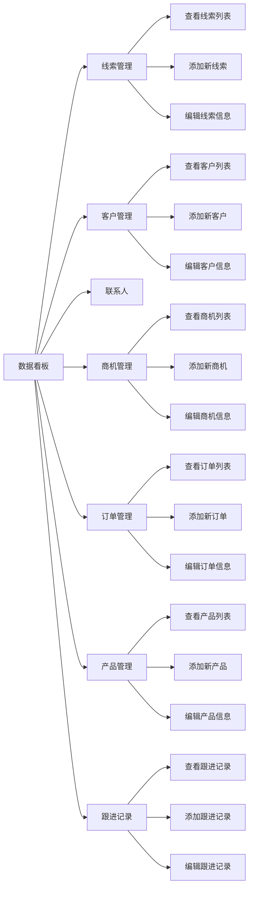

# 快速开始

<cite>
**本文档引用的文件**
- [index.html](file://index.html)
- [app.js](file://js/app.js)
- [store.js](file://js/store.js)
- [router.js](file://js/router.js)
- [events.js](file://js/events.js)
- [ui.js](file://js/ui.js)
- [helpers.js](file://js/utils/helpers.js)
- [seed.js](file://js/utils/seed.js)
- [dashboard.js](file://js/modules/dashboard.js)
- [variables.css](file://css/variables.css)
- [base.css](file://css/base.css)
- [layout.css](file://css/layout.css)
</cite>

## 目录
1. [简介](#简介)
2. [环境要求](#环境要求)
3. [安装部署](#安装部署)
4. [系统架构](#系统架构)
5. [核心功能模块](#核心功能模块)
6. [演示数据使用](#演示数据使用)
7. [基本操作指南](#基本操作指南)
8. [常见使用场景](#常见使用场景)
9. [故障排除](#故障排除)
10. [常见问题解答](#常见问题解答)
11. [总结](#总结)

## 简介

CRM客户关系管理系统是一个基于纯前端技术构建的现代化客户关系管理工具。该系统采用HTML5、CSS3和JavaScript技术栈，无需服务器端支持即可直接运行。系统提供了完整的客户关系管理功能，包括线索管理、客户管理、商机管理、订单管理、产品管理和跟进记录等功能模块。

系统的核心特点：
- **纯前端实现**：基于本地存储的数据持久化
- **响应式设计**：支持桌面端和移动端访问
- **实时数据同步**：通过事件总线实现模块间数据通信
- **丰富的演示数据**：内置完整的业务场景数据集
- **直观的用户界面**：采用现代化的设计语言

## 环境要求

### 浏览器兼容性

系统支持以下现代浏览器的最新版本：

**桌面浏览器**
- Chrome 80+
- Firefox 74+
- Safari 13+
- Edge 80+

**移动浏览器**
- iOS Safari 13+
- Android Chrome 80+
- 微信内置浏览器（Android）

### 系统依赖

- **无服务器依赖**：完全基于浏览器本地存储
- **无网络依赖**：可离线运行，无需网络连接
- **无插件要求**：纯HTML/CSS/JavaScript实现

### 存储要求

- **本地存储**：每个用户约占用5-10MB存储空间
- **演示数据**：包含约50条记录的完整数据集
- **缓存机制**：内存缓存提升数据访问性能

## 安装部署

### 本地部署

1. **下载项目文件**
   ```bash
   git clone https://github.com/your-repo/crm-system.git
   cd crm-system
   ```

2. **直接打开HTML文件**
   - 在项目根目录双击 `index.html` 文件
   - 或者在浏览器地址栏直接输入文件路径

3. **通过Web服务器运行**
   ```bash
   # 使用Python内置服务器
   python -m http.server 8000
   
   # 使用Node.js http-server
   npx http-server
   
   # 使用PHP内置服务器
   php -S localhost:8000
   ```

### 部署到生产环境

1. **静态文件部署**
   - 将整个项目文件夹上传到Web服务器
   - 确保服务器支持静态文件服务

2. **CDN部署**
   - 可以将CSS和JS文件部署到CDN加速
   - 保持相对路径引用不变

3. **HTTPS配置**
   - 建议在生产环境中启用HTTPS
   - 现代浏览器对localStorage有更严格的安全要求

## 系统架构

### 整体架构图



**架构图来源**
- [index.html:1-129](file://index.html#L1-L129)
- [app.js:1-316](file://js/app.js#L1-L316)
- [router.js:1-62](file://js/router.js#L1-L62)
- [store.js:1-139](file://js/store.js#L1-L139)

### 核心组件关系



**类图来源**
- [app.js:4-41](file://js/app.js#L4-L41)
- [router.js:4-61](file://js/router.js#L4-L61)
- [store.js:4-138](file://js/store.js#L4-L138)
- [events.js:4-35](file://js/events.js#L4-L35)
- [ui.js:4-363](file://js/ui.js#L4-L363)

**架构图来源**
- [index.html:110-126](file://index.html#L110-L126)
- [app.js:6-41](file://js/app.js#L6-L41)

## 核心功能模块

### 数据看板模块

数据看板是系统的主界面，提供销售数据的综合展示：



**流程图来源**
- [dashboard.js:6-209](file://js/modules/dashboard.js#L6-L209)

### 数据存储架构

系统采用本地存储作为数据持久化层：



**ER图来源**
- [seed.js:14-131](file://js/utils/seed.js#L14-L131)
- [store.js:33-96](file://js/store.js#L33-L96)

**功能模块图来源**
- [index.html:25-68](file://index.html#L25-L68)
- [app.js:10-18](file://js/app.js#L10-L18)

## 演示数据使用

### 数据注入机制

系统在首次运行时自动注入演示数据：



**序列图来源**
- [seed.js:10-134](file://js/utils/seed.js#L10-L134)
- [app.js:6-8](file://js/app.js#L6-L8)

### 数据结构详解

#### 产品数据结构
| 字段名 | 类型 | 描述 | 示例值 |
|--------|------|------|--------|
| id | string | 产品唯一标识 | P001 |
| name | string | 产品名称 | 企业版 ERP 系统 |
| code | string | 产品编码 | P001 |
| category | string | 产品分类 | 软件产品 |
| price | number | 产品价格 | 198000 |
| unit | string | 计量单位 | 套 |
| status | string | 产品状态 | 在售 |
| description | string | 产品描述 | 包含财务、采购、销售、库存等核心模块 |

#### 线索数据结构
| 字段名 | 类型 | 描述 | 示例值 |
|--------|------|------|--------|
| id | string | 线索唯一标识 | L001 |
| name | string | 姓名 | 张伟 |
| company | string | 公司名称 | 上海锦程科技有限公司 |
| phone | string | 电话号码 | 13812345678 |
| email | string | 邮箱地址 | zhangwei@jincheng.com |
| source | string | 线索来源 | 网站表单 |
| status | string | 线索状态 | 新线索 |
| assignee | string | 负责人 | 李明 |
| remark | string | 备注信息 | 需求与产品不匹配 |

#### 客户数据结构
| 字段名 | 类型 | 描述 | 示例值 |
|--------|------|------|--------|
| id | string | 客户唯一标识 | C001 |
| name | string | 客户名称 | 上海锦程科技有限公司 |
| type | string | 客户类型 | 企业客户 |
| industry | string | 所属行业 | 互联网/IT |
| scale | string | 公司规模 | 200-1000人 |
| status | string | 客户状态 | 活跃 |
| phone | string | 联系电话 | 021-55667788 |
| email | string | 邮箱地址 | contact@jincheng.com |
| address | string | 公司地址 | 上海市浦东新区张江高科技园区 |
| tags | string[] | 客户标签 | ["VIP", "重点客户"] |

#### 商机数据结构
| 字段名 | 类型 | 描述 | 示例值 |
|--------|------|------|--------|
| id | string | 商机唯一标识 | O001 |
| customerId | string | 客户ID | C001 |
| name | string | 商机名称 | 锦程科技ERP项目 |
| stage | string | 商机阶段 | 商务谈判 |
| amount | number | 期望金额 | 298000 |
| probability | string | 成交概率 | 80 |
| expectedCloseDate | string | 预计成交日期 | 2024-01-15 |
| assignee | string | 负责人 | 李明 |
| convertedOrderId | string | 转换订单ID | OR001 |

#### 订单数据结构
| 字段名 | 类型 | 描述 | 示例值 |
|--------|------|------|--------|
| id | string | 订单唯一标识 | OR001 |
| orderNo | string | 订单编号 | ORD-20240101-001 |
| customerId | string | 客户ID | C001 |
| opportunityId | string | 商机ID | O001 |
| items | json[] | 订单明细 | [{productId: P001, quantity: 1}] |
| totalAmount | number | 订单总金额 | 298000 |
| status | string | 订单状态 | 执行中 |

### 数据导入导出

系统提供完整的数据管理功能：



**流程图来源**
- [app.js:172-311](file://js/app.js#L172-L311)
- [store.js:98-132](file://js/store.js#L98-L132)

## 基本操作指南

### 启动应用

1. **打开应用程序**
   - 双击 `index.html` 文件
   - 或在浏览器中打开文件路径

2. **首次启动**
   - 系统自动注入演示数据
   - 自动跳转到数据看板页面

3. **界面布局**
   - **左侧侧边栏**：导航菜单
   - **顶部工具栏**：搜索和面包屑导航
   - **主要内容区**：功能模块显示

### 导航系统



**导航图来源**
- [index.html:25-76](file://index.html#L25-L76)
- [app.js:43-61](file://js/app.js#L43-L61)

### 搜索功能

系统提供全局搜索功能：

1. **搜索位置**
   - 顶部工具栏的搜索框
   - 支持实时搜索建议

2. **搜索范围**
   - 线索：姓名、公司名称
   - 客户：客户名称
   - 商机：商机名称
   - 订单：订单编号
   - 产品：产品名称、产品编码

3. **搜索结果**
   - 实时显示搜索结果
   - 支持键盘导航
   - 点击跳转到详情页

### 数据管理

#### 添加记录
1. 在相应模块点击"添加"按钮
2. 填写表单字段
3. 点击"保存"按钮
4. 系统自动保存到本地存储

#### 编辑记录
1. 在列表中点击记录
2. 点击"编辑"按钮
3. 修改所需字段
4. 点击"保存"按钮

#### 删除记录
1. 在列表中选择要删除的记录
2. 点击"删除"按钮
3. 确认删除操作
4. 系统从本地存储中移除

## 常见使用场景

### 场景一：管理销售线索

**目标**：跟踪潜在客户并将其转化为实际客户

**操作流程**：
1. 进入"线索管理"模块
2. 查看所有线索列表
3. 根据线索状态进行分类处理
4. 将有价值的线索分配给销售人员
5. 记录跟进情况和沟通结果

**关键指标**：
- 新线索数量：反映营销效果
- 转化率：线索到客户的转化比例
- 平均跟进次数：评估跟进质量

### 场景二：客户关系维护

**目标**：维护现有客户关系，提高客户满意度

**操作流程**：
1. 进入"客户管理"模块
2. 查看客户基本信息和标签
3. 查看客户历史交易记录
4. 分析客户购买行为模式
5. 制定个性化服务策略

**关键指标**：
- 客户活跃度：活跃客户占比
- 客户生命周期价值：长期价值评估
- 客户满意度：定期回访和调查

### 场景三：商机跟踪

**目标**：有效跟踪销售机会，提高成交率

**操作流程**：
1. 进入"商机管理"模块
2. 查看所有商机的当前阶段
3. 更新商机状态和预期成交日期
4. 记录与客户的沟通内容
5. 预测成交概率和金额

**关键指标**：
- 销售漏斗效率：各阶段转化率
- 平均成交周期：从初次接触到成交的时间
- 成交金额分布：不同阶段的金额分布

### 场景四：订单管理

**目标**：确保订单按时交付，提高客户满意度

**操作流程**：
1. 进入"订单管理"模块
2. 查看所有订单的状态
3. 跟踪订单执行进度
4. 处理订单变更和异常情况
5. 确认订单完成和收款

**关键指标**：
- 订单及时交付率：按时完成的订单比例
- 订单金额：月度和年度收入
- 订单取消率：客户取消订单的比例

### 场景五：产品管理

**目标**：优化产品组合，提高产品销售效率

**操作流程**：
1. 进入"产品管理"模块
2. 查看所有产品的销售情况
3. 分析产品利润和销量
4. 调整产品定价和促销策略
5. 管理产品库存和供应链

**关键指标**：
- 产品销售额：各产品的销售贡献
- 产品利润率：不同产品的盈利能力
- 库存周转率：产品库存管理效率

## 故障排除

### 常见问题及解决方案

#### 问题1：页面无法正常加载

**症状**：页面空白或加载缓慢

**可能原因**：
- 浏览器不支持本地存储
- 文件路径错误
- JavaScript被禁用

**解决方法**：
1. 检查浏览器控制台是否有错误信息
2. 确认所有文件都在正确的位置
3. 启用JavaScript支持
4. 清除浏览器缓存

#### 问题2：数据丢失或显示异常

**症状**：数据不显示或显示错误

**可能原因**：
- 本地存储空间不足
- 数据格式损坏
- 浏览器隐私模式限制

**解决方法**：
1. 检查浏览器存储空间
2. 使用"重置演示数据"功能
3. 在隐私模式下禁用扩展程序
4. 清理浏览器数据

#### 问题3：搜索功能失效

**症状**：全局搜索无结果或无响应

**可能原因**：
- 搜索功能JavaScript错误
- 数据量过大导致性能问题
- 浏览器兼容性问题

**解决方法**：
1. 刷新页面重新加载
2. 减少数据量测试
3. 更换浏览器测试
4. 检查网络连接

#### 问题4：移动端显示问题

**症状**：移动端界面显示异常

**可能原因**：
- 屏幕尺寸适配问题
- 触摸事件处理错误
- CSS样式冲突

**解决方法**：
1. 调整浏览器窗口大小测试
2. 检查CSS媒体查询
3. 测试不同设备分辨率
4. 检查触摸事件兼容性

### 性能优化建议

#### 数据优化
1. **定期清理历史数据**
   - 删除超过一年的过期记录
   - 清理无效的测试数据
   - 合并重复的客户信息

2. **数据分页加载**
   - 对大量数据使用分页显示
   - 实现虚拟滚动优化
   - 延迟加载非关键数据

#### 浏览器优化
1. **缓存策略**
   - 启用浏览器缓存
   - 使用CDN加速静态资源
   - 压缩CSS和JavaScript文件

2. **内存管理**
   - 及时释放不需要的对象
   - 避免内存泄漏
   - 监控内存使用情况

#### 用户体验优化
1. **加载状态**
   - 显示加载指示器
   - 提供进度反馈
   - 实现优雅降级

2. **错误处理**
   - 捕获和处理异常
   - 提供友好的错误提示
   - 记录错误日志

## 常见问题解答

### Q1：系统需要服务器吗？

**A1**：不需要。这是一个纯前端应用，所有数据都存储在浏览器的本地存储中。你可以直接双击 `index.html` 文件运行，无需任何服务器配置。

### Q2：数据会丢失吗？

**A2**：不会永久丢失。数据存储在浏览器的本地存储中，只要不清理浏览器数据就不会丢失。如果需要备份，可以使用系统提供的数据导出功能。

### Q3：支持多用户吗？

**A3**：当前版本是单用户应用。所有数据都存储在同一浏览器实例中。如果需要多用户支持，可以在服务器端部署版本。

### Q4：如何备份我的数据？

**A4**：系统提供多种备份方式：
1. 使用"系统设置"中的"导出数据"功能
2. 浏览器开发者工具查看本地存储
3. 浏览器自带的存储管理功能

### Q5：数据量大了怎么办？

**A5**：系统针对大数据量进行了优化：
1. 内存缓存提升访问速度
2. 分页加载减少内存占用
3. 搜索功能支持实时过滤
4. 可以定期清理历史数据

### Q6：如何更新数据？

**A6**：系统支持多种数据更新方式：
1. 通过界面直接添加/编辑记录
2. 使用"导入数据"功能批量导入
3. 重置演示数据恢复默认值
4. 清空所有数据重新开始

### Q7：支持离线使用吗？

**A7**：完全支持离线使用。所有数据都存储在本地，不需要网络连接即可正常工作。网络恢复后数据会自动同步。

### Q8：如何自定义界面？

**A8**：系统界面基于CSS变量，可以轻松定制：
1. 修改 `css/variables.css` 中的颜色变量
2. 调整字体和间距设置
3. 自定义主题颜色
4. 修改布局参数

## 总结

CRM客户关系管理系统是一个功能完整、易于使用的客户关系管理工具。通过本文档的学习，您应该能够：

1. **快速部署**：理解系统架构和部署要求
2. **熟练使用**：掌握各个功能模块的操作方法
3. **数据管理**：学会使用演示数据和管理自己的数据
4. **故障排除**：具备基本的问题诊断和解决能力

### 下一步建议

1. **深入学习**：研究各个模块的详细功能
2. **实践应用**：结合实际业务场景使用系统
3. **数据迁移**：将现有数据迁移到系统中
4. **功能扩展**：根据需要定制和扩展功能

### 技术优势

- **零配置部署**：无需服务器，直接运行
- **数据安全**：数据存储在本地，隐私保护
- **跨平台兼容**：支持各种现代浏览器
- **响应式设计**：适配各种设备屏幕
- **性能优化**：针对大数据量进行优化

希望这个快速开始指南能帮助您快速上手CRM系统。如需进一步的技术支持，请参考系统源码和相关文档。