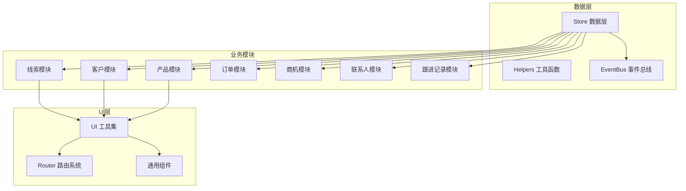
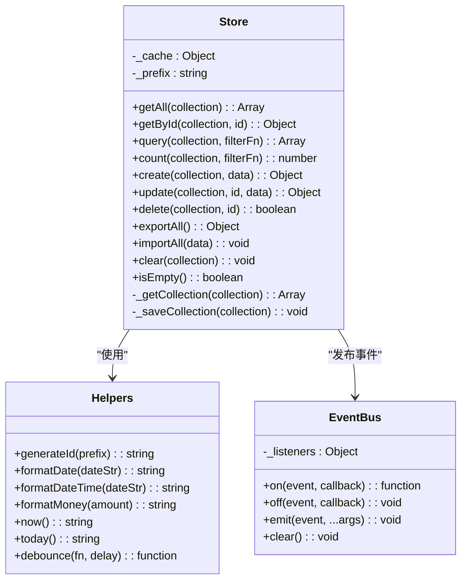
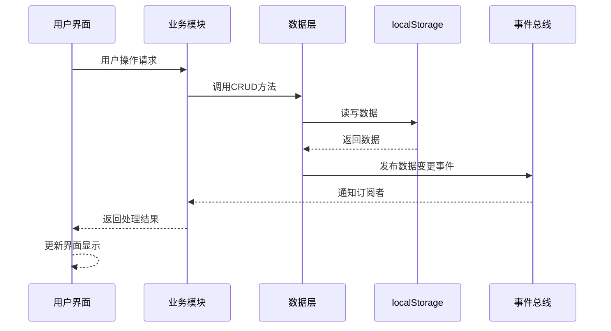
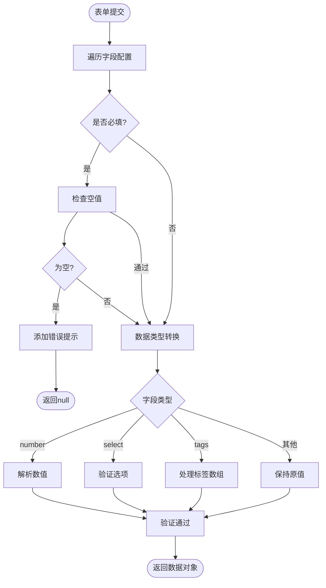
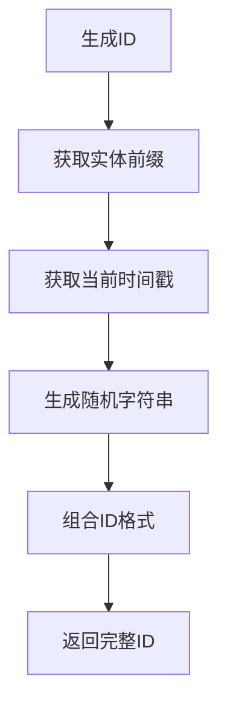
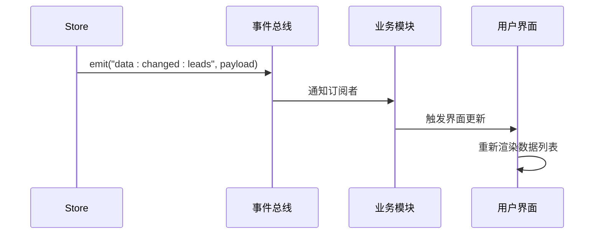
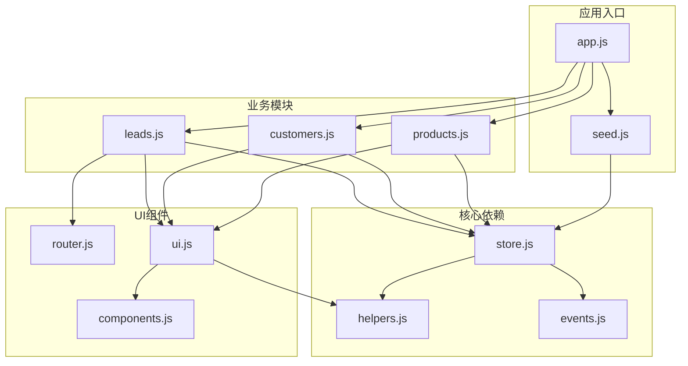

# CRUD操作

<cite>
**本文档引用的文件**
- [store.js](file://js/store.js)
- [helpers.js](file://js/utils/helpers.js)
- [seed.js](file://js/utils/seed.js)
- [leads.js](file://js/modules/leads.js)
- [customers.js](file://js/modules/customers.js)
- [products.js](file://js/modules/products.js)
- [router.js](file://js/router.js)
- [events.js](file://js/events.js)
- [ui.js](file://js/ui.js)
- [components.js](file://js/components.js)
- [app.js](file://js/app.js)
</cite>

## 目录
1. [简介](#简介)
2. [项目结构](#项目结构)
3. [核心组件](#核心组件)
4. [架构概览](#架构概览)
5. [详细组件分析](#详细组件分析)
6. [依赖分析](#依赖分析)
7. [性能考虑](#性能考虑)
8. [故障排除指南](#故障排除指南)
9. [结论](#结论)
10. [附录](#附录)

## 简介
本文件详细说明CRM系统的CRUD（创建、读取、更新、删除）操作实现。系统采用纯前端架构，使用localStorage作为持久化存储，通过统一的数据层Store提供标准化的CRUD接口，并结合模块化的业务逻辑实现完整的客户关系管理功能。

## 项目结构
CRM系统采用模块化架构，主要分为以下层次：
- **数据层（Store）**：统一的数据访问接口，封装localStorage操作
- **业务模块**：线索、客户、产品等具体业务实体的CRUD实现
- **UI层**：通用组件和用户界面交互
- **工具层**：辅助函数、事件总线、路由系统

**图表来源**
- [store.js:1-139](file://js/store.js#L1-L139)
- [leads.js:1-286](file://js/modules/leads.js#L1-L286)
- [customers.js:1-229](file://js/modules/customers.js#L1-L229)
- [products.js:1-175](file://js/modules/products.js#L1-L175)
- [router.js:1-62](file://js/router.js#L1-L62)
- [ui.js:1-364](file://js/ui.js#L1-L364)
- [events.js:1-36](file://js/events.js#L1-L36)

**章节来源**
- [store.js:1-139](file://js/store.js#L1-L139)
- [router.js:1-62](file://js/router.js#L1-L62)
- [ui.js:1-364](file://js/ui.js#L1-L364)

## 核心组件
系统的核心是统一的数据层Store，它提供了标准化的CRUD接口和数据管理能力。

### Store数据层
Store是整个系统的核心数据抽象，负责：
- **数据持久化**：基于localStorage的本地存储
- **缓存管理**：内存中的数据缓存机制
- **事件通知**：数据变更后的事件广播
- **批量操作**：支持数据导入导出和清空操作

**图表来源**
- [store.js:4-139](file://js/store.js#L4-L139)
- [helpers.js:4-113](file://js/utils/helpers.js#L4-L113)
- [events.js:4-36](file://js/events.js#L4-L36)

**章节来源**
- [store.js:1-139](file://js/store.js#L1-L139)
- [helpers.js:1-113](file://js/utils/helpers.js#L1-L113)
- [events.js:1-36](file://js/events.js#L1-L36)

## 架构概览
系统采用分层架构，每层职责明确，耦合度低，便于维护和扩展。

**图表来源**
- [leads.js:159-180](file://js/modules/leads.js#L159-L180)
- [store.js:53-96](file://js/store.js#L53-L96)
- [events.js:18-30](file://js/events.js#L18-L30)

## 详细组件分析

### 数据验证流程
系统实现了多层次的数据验证机制：

#### 字段验证
- **必填字段检查**：通过表单构建器自动添加必填标识
- **数据类型验证**：根据字段类型进行相应的数据转换
- **业务规则校验**：特定场景下的业务逻辑验证

#### 验证实现机制

**图表来源**
- [ui.js:276-316](file://js/ui.js#L276-L316)
- [ui.js:194-274](file://js/ui.js#L194-L274)

**章节来源**
- [ui.js:276-316](file://js/ui.js#L276-L316)
- [ui.js:194-274](file://js/ui.js#L194-L274)

### ID生成机制
系统采用复合ID生成策略，确保唯一性和可读性：

#### ID生成算法
- **前缀标识**：基于实体类型（如"lead_"、"customer_"）
- **时间戳**：精确到毫秒的时间戳
- **随机字符串**：6位字母数字组合
- **格式示例**：`lead_1700000000000_a1b2c3`

#### 实现细节

**图表来源**
- [helpers.js:6-8](file://js/utils/helpers.js#L6-L8)
- [store.js:59](file://js/store.js#L59)

**章节来源**
- [helpers.js:6-8](file://js/utils/helpers.js#L6-L8)
- [store.js:59](file://js/store.js#L59)

### 时间戳管理
系统实现了完整的时间戳管理体系：

#### 时间戳字段
- **createdAt**：记录创建时间
- **updatedAt**：记录最后更新时间
- **格式**：ISO 8601标准字符串

#### 时间戳更新策略
- **创建时**：同时设置createdAt和updatedAt
- **更新时**：仅更新updatedAt
- **查询时**：保持原始时间戳不变

**章节来源**
- [store.js:56-80](file://js/store.js#L56-L80)
- [helpers.js:108-111](file://js/utils/helpers.js#L108-L111)

### 数据同步策略
系统采用事件驱动的数据同步机制：

#### 事件传播链

**图表来源**
- [store.js:65](file://js/store.js#L65)
- [store.js:83](file://js/store.js#L83)
- [store.js:94](file://js/store.js#L94)
- [events.js:18-30](file://js/events.js#L18-L30)

**章节来源**
- [store.js:65-96](file://js/store.js#L65-L96)
- [events.js:18-30](file://js/events.js#L18-L30)

### 批量操作支持
系统提供了完整的批量数据管理功能：

#### 导出功能
- **全量导出**：导出所有业务实体数据
- **格式化输出**：JSON格式，便于备份和迁移
- **文件命名**：包含日期信息的文件名

#### 导入功能
- **数据验证**：导入前进行格式检查
- **覆盖策略**：导入会完全覆盖现有数据
- **确认机制**：导入前需要用户确认

#### 清空功能
- **选择性清空**：可清空指定实体
- **全量清空**：清空所有业务数据
- **演示数据重置**：一键恢复初始状态

**章节来源**
- [store.js:98-132](file://js/store.js#L98-L132)
- [app.js:235-311](file://js/app.js#L235-L311)

### 事务处理机制
系统采用乐观锁机制实现数据一致性：

#### 事务特性
- **原子性**：单个CRUD操作要么成功要么失败
- **一致性**：数据在操作前后保持一致状态
- **隔离性**：并发操作相互隔离
- **持久性**：操作结果持久化到localStorage

#### 错误处理
- **存储异常**：捕获localStorage写入失败
- **数据异常**：处理JSON解析错误
- **用户反馈**：通过Toast通知用户

**章节来源**
- [store.js:14-29](file://js/store.js#L14-L29)
- [store.js:53-96](file://js/store.js#L53-L96)

### 数据查询与过滤
系统提供了灵活的数据查询和过滤能力：

#### 查询接口
- **条件查询**：支持任意过滤函数
- **计数统计**：快速获取数据数量
- **分页支持**：内置分页功能

#### 过滤条件
- **状态过滤**：按业务状态筛选
- **关键字搜索**：多字段模糊匹配
- **自定义过滤**：支持复杂业务逻辑

#### 排序规则
- **多字段排序**：支持多个字段排序
- **升序降序**：灵活的排序方向控制
- **默认排序**：按创建时间倒序排列

**章节来源**
- [store.js:42-51](file://js/store.js#L42-L51)
- [components.js:34-56](file://js/components.js#L34-L56)
- [components.js:45-55](file://js/components.js#L45-L55)

## 依赖分析

**图表来源**
- [store.js:1-139](file://js/store.js#L1-L139)
- [leads.js:1-286](file://js/modules/leads.js#L1-L286)
- [customers.js:1-229](file://js/modules/customers.js#L1-L229)
- [products.js:1-175](file://js/modules/products.js#L1-L175)
- [ui.js:1-364](file://js/ui.js#L1-L364)
- [router.js:1-62](file://js/router.js#L1-L62)
- [app.js:1-316](file://js/app.js#L1-L316)
- [seed.js:1-142](file://js/utils/seed.js#L1-L142)

**章节来源**
- [store.js:1-139](file://js/store.js#L1-L139)
- [leads.js:1-286](file://js/modules/leads.js#L1-L286)
- [customers.js:1-229](file://js/modules/customers.js#L1-L229)
- [products.js:1-175](file://js/modules/products.js#L1-L175)

## 性能考虑
系统在设计时充分考虑了性能优化：

### 缓存策略
- **内存缓存**：避免重复读取localStorage
- **懒加载**：只在需要时才加载数据集合
- **缓存失效**：数据变更时自动更新缓存

### 渲染优化
- **虚拟滚动**：大数据量时的滚动优化
- **防抖处理**：搜索和过滤的防抖机制
- **增量更新**：局部UI更新而非整页刷新

### 存储优化
- **数据压缩**：合理的数据结构设计
- **批量操作**：减少localStorage频繁读写
- **清理机制**：定期清理无效数据

## 故障排除指南

### 常见问题及解决方案

#### 数据无法保存
**症状**：新增或更新数据后刷新页面丢失
**原因**：localStorage存储空间不足或权限问题
**解决**：检查浏览器存储限制，清理不必要的数据

#### 数据不同步
**症状**：一个模块的数据更新后其他模块未反映
**原因**：事件监听器未正确注册
**解决**：检查EventBus订阅关系，重新初始化模块

#### 表单验证失败
**症状**：必填字段无法通过验证
**原因**：字段配置错误或数据类型不匹配
**解决**：检查FIELDS配置，确保required属性正确设置

#### 性能问题
**症状**：页面加载缓慢或操作卡顿
**原因**：数据量过大或DOM操作过多
**解决**：启用分页，优化查询条件，使用虚拟滚动

**章节来源**
- [store.js:14-29](file://js/store.js#L14-L29)
- [ui.js:276-316](file://js/ui.js#L276-L316)

## 结论
CRM系统的CRUD操作实现了完整的数据生命周期管理，具有以下特点：

- **统一抽象**：通过Store层提供标准化的CRUD接口
- **事件驱动**：基于EventBus的响应式数据更新机制
- **灵活验证**：多层次的数据验证确保数据质量
- **性能优化**：缓存策略和防抖机制提升用户体验
- **扩展性强**：模块化设计便于功能扩展和维护

系统采用纯前端架构，在保证功能完整性的同时，实现了良好的性能表现和用户体验。

## 附录

### API接口规范

#### Store数据层接口
| 方法 | 参数 | 返回值 | 描述 |
|------|------|--------|------|
| getAll | collection: string | Array | 获取集合全部记录 |
| getById | collection: string, id: string | Object | 按ID获取记录 |
| query | collection: string, filterFn: function | Array | 条件查询 |
| count | collection: string, filterFn?: function | number | 计数统计 |
| create | collection: string, data: object | object | 创建记录 |
| update | collection: string, id: string, data: object | object | 更新记录 |
| delete | collection: string, id: string | boolean | 删除记录 |

#### 业务模块接口
每个业务模块都实现了标准的CRUD接口，包括：
- **列表展示**：renderList方法
- **详情展示**：renderDetail方法  
- **表单处理**：showForm方法
- **删除确认**：handleDelete方法
- **路由注册**：init方法

### 使用示例
系统提供了完整的演示数据，可通过以下方式体验CRUD操作：
1. 启动应用后自动注入演示数据
2. 在各个模块中进行增删改查操作
3. 通过设置页面进行数据导出导入
4. 使用全局搜索功能快速定位数据