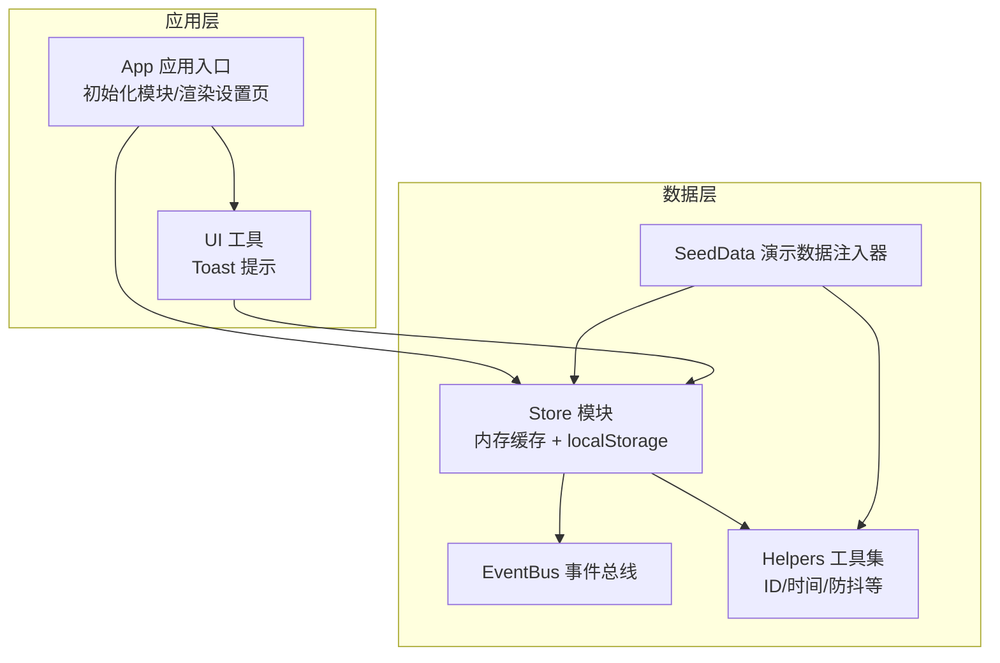
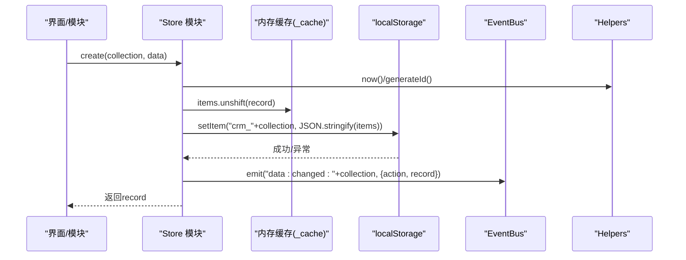
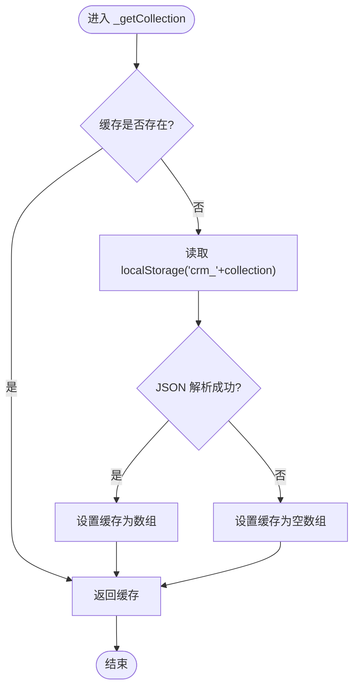
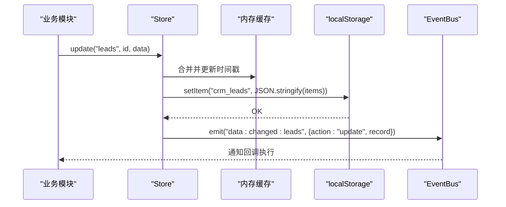
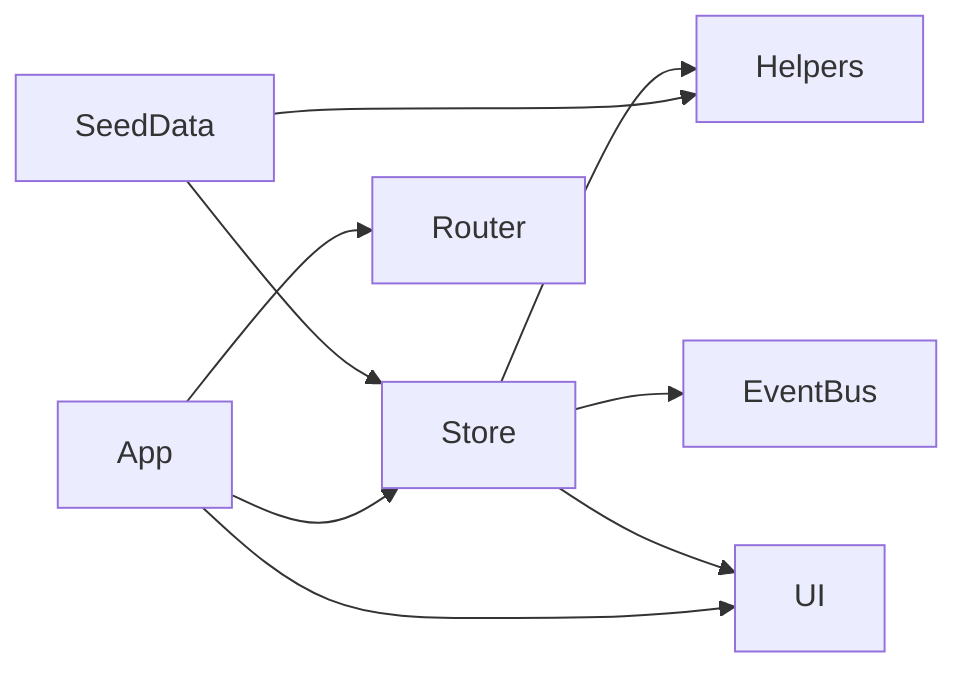

# 存储机制

<cite>
**本文引用的文件**
- [store.js](file://js/store.js)
- [app.js](file://js/app.js)
- [helpers.js](file://js/utils/helpers.js)
- [seed.js](file://js/utils/seed.js)
- [events.js](file://js/events.js)
- [ui.js](file://js/ui.js)
</cite>

## 目录
1. [引言](#引言)
2. [项目结构](#项目结构)
3. [核心组件](#核心组件)
4. [架构总览](#架构总览)
5. [详细组件分析](#详细组件分析)
6. [依赖分析](#依赖分析)
7. [性能考虑](#性能考虑)
8. [故障排查指南](#故障排查指南)
9. [结论](#结论)
10. [附录](#附录)

## 引言
本文件聚焦于CRM系统的本地存储机制，系统采用localStorage作为主要持久化介质，并通过内存缓存提升访问性能。本文将深入解析Store模块的设计与实现，包括数据前缀管理、缓存同步机制、错误恢复与数据完整性保障、存储限制处理、性能优化与最佳实践，以及容量监控与清理策略。

## 项目结构
围绕存储机制的关键文件与职责如下：
- js/store.js：定义Store模块，负责集合的增删改查、内存缓存、localStorage持久化、导入导出与清空。
- js/app.js：应用入口，初始化模块、渲染设置页、绑定数据导出/导入/清空等交互。
- js/utils/helpers.js：提供ID生成、时间戳、防抖、HTML转义等工具，被Store与SeedData使用。
- js/utils/seed.js：演示数据注入器，首次运行时根据Store.isEmpty判断是否注入默认数据。
- js/events.js：事件总线，Store在数据变更时通过事件通知订阅者。
- js/ui.js：UI工具，提供Toast提示，用于存储异常时的用户反馈。

图表来源
- [store.js:1-139](file://js/store.js#L1-L139)
- [app.js:1-316](file://js/app.js#L1-L316)
- [helpers.js:1-113](file://js/utils/helpers.js#L1-L113)
- [seed.js:1-142](file://js/utils/seed.js#L1-L142)
- [events.js:1-36](file://js/events.js#L1-L36)
- [ui.js:1-364](file://js/ui.js#L1-L364)

章节来源
- [store.js:1-139](file://js/store.js#L1-L139)
- [app.js:1-316](file://js/app.js#L1-L316)
- [helpers.js:1-113](file://js/utils/helpers.js#L1-L113)
- [seed.js:1-142](file://js/utils/seed.js#L1-L142)
- [events.js:1-36](file://js/events.js#L1-L36)
- [ui.js:1-364](file://js/ui.js#L1-L364)

## 核心组件
- Store模块
  - 内存缓存：_cache对象按集合名缓存数组，避免重复读取localStorage。
  - 前缀管理：统一使用“crm_”前缀，隔离命名空间，便于导出/导入与清理。
  - CRUD接口：getAll、getById、query、count、create、update、delete。
  - 同步机制：每次写操作后立即调用_saveCollection，确保内存与localStorage一致。
  - 导入导出：exportAll遍历预设集合，importAll批量写入并刷新缓存。
  - 清理：clear支持按集合或全量清理，同时触发事件通知。
  - 完整性检查：isEmpty用于首次运行判断。
- Helpers工具
  - generateId：为记录生成唯一ID；now：ISO时间戳；debounce：防抖；escapeHtml：安全输出。
- EventBus事件总线
  - on/off/emit，支持通配符，Store在create/update/delete后发出“data:changed:集合名”事件。
- SeedData演示数据
  - shouldSeed基于Store.isEmpty判断；seed注入多类数据并调用Store.create/update。
- UI工具
  - toast用于存储异常时的用户提示。

章节来源
- [store.js:1-139](file://js/store.js#L1-L139)
- [helpers.js:1-113](file://js/utils/helpers.js#L1-L113)
- [events.js:1-36](file://js/events.js#L1-L36)
- [seed.js:1-142](file://js/utils/seed.js#L1-L142)
- [ui.js:1-364](file://js/ui.js#L1-L364)

## 架构总览
Store模块以“内存缓存 + localStorage”的双层结构实现数据持久化，写路径保证一致性，读路径优先命中缓存，降低IO开销。事件总线在数据变更时广播，供UI或其他模块响应。

图表来源
- [store.js:54-67](file://js/store.js#L54-L67)
- [store.js:23-30](file://js/store.js#L23-L30)
- [events.js:18-30](file://js/events.js#L18-L30)
- [helpers.js:6-111](file://js/utils/helpers.js#L6-L111)

## 详细组件分析

### Store模块内部方法工作机制
- _getCollection(collection)
  - 若缓存不存在则从localStorage读取并JSON.parse，异常时返回空数组并记录错误。
  - 首次读取后缓存，后续读取直接返回缓存。
- _saveCollection(collection)
  - 将内存中的集合序列化后写入localStorage，异常时记录错误并通过UI.toast提示用户。
- create(collection, data)
  - 生成ID与时间戳，unshift到集合头部，立即保存并发出事件。
- update(collection, id, data)
  - 查找并合并字段，更新时间戳，立即保存并发出事件。
- delete(collection, id)
  - 查找并splice删除，立即保存并发出事件。
- exportAll/importAll/clear
  - exportAll遍历预设集合导出；importAll批量写入并刷新缓存；clear支持按集合或全量清理并发出事件。

图表来源
- [store.js:9-20](file://js/store.js#L9-L20)

章节来源
- [store.js:1-139](file://js/store.js#L1-L139)

### 数据缓存策略与同步机制
- 写路径一致性
  - 所有create/update/delete均先修改内存缓存，再调用_saveCollection写入localStorage，最后发出事件。
  - 这种顺序确保UI与事件监听者看到最新状态，避免竞态。
- 读路径优化
  - 首次读取集合时从localStorage加载并缓存；后续读取直接走内存，减少IO。
- 事件驱动
  - 通过EventBus.emit("data:changed:*")通知订阅者，支持通配符，便于模块间解耦。

图表来源
- [store.js:70-85](file://js/store.js#L70-L85)
- [events.js:18-30](file://js/events.js#L18-L30)

章节来源
- [store.js:54-96](file://js/store.js#L54-L96)
- [events.js:1-36](file://js/events.js#L1-L36)

### 存储限制处理、错误恢复与数据完整性
- 存储限制处理
  - 写入时捕获异常并记录日志，同时通过UI.toast提示“存储空间可能不足”，避免崩溃。
- 错误恢复
  - 读取失败时返回空数组，保证应用继续运行；随后正常写入可恢复数据。
- 数据完整性
  - create/update时自动维护createdAt/updatedAt；delete返回布尔值便于上层判断。
  - clear支持全量清理，避免残留数据污染。
  - exportAll仅导出存在数据的集合，importAll写入后刷新缓存，确保一致性。

章节来源
- [store.js:12-29](file://js/store.js#L12-L29)
- [store.js:99-116](file://js/store.js#L99-L116)
- [store.js:119-132](file://js/store.js#L119-L132)

### 导入/导出与演示数据注入
- 导出
  - App.renderSettings中调用Store.exportAll，生成JSON文件供用户下载。
- 导入
  - App.renderSettings中读取用户上传的JSON，校验后调用Store.importAll，刷新缓存并发出导入完成事件。
- 演示数据
  - SeedData.shouldSeed基于Store.isEmpty判断；SeedData.seed通过Store.create/update注入默认数据。

章节来源
- [app.js:235-275](file://js/app.js#L235-L275)
- [seed.js:6-134](file://js/utils/seed.js#L6-L134)
- [store.js:99-116](file://js/store.js#L99-L116)

## 依赖分析
- Store依赖
  - Helpers：ID生成、时间戳、防抖等。
  - EventBus：数据变更事件广播。
  - UI：存储异常时的用户提示。
- SeedData依赖
  - Store：写入演示数据。
  - Helpers：生成订单号、时间戳等。
- App依赖
  - Store：全局搜索、统计数据展示。
  - UI：设置页交互与提示。
  - Router：路由切换。

图表来源
- [store.js:1-139](file://js/store.js#L1-L139)
- [helpers.js:1-113](file://js/utils/helpers.js#L1-L113)
- [events.js:1-36](file://js/events.js#L1-L36)
- [seed.js:1-142](file://js/utils/seed.js#L1-L142)
- [app.js:1-316](file://js/app.js#L1-L316)

章节来源
- [store.js:1-139](file://js/store.js#L1-L139)
- [helpers.js:1-113](file://js/utils/helpers.js#L1-L113)
- [events.js:1-36](file://js/events.js#L1-L36)
- [seed.js:1-142](file://js/utils/seed.js#L1-L142)
- [app.js:1-316](file://js/app.js#L1-L316)

## 性能考虑
- 缓存命中率
  - 首次读取后缓存，后续读取直接返回，避免频繁IO。
- 写入时机
  - 每次写操作立即保存，保证一致性，但可能产生较多IO。可结合业务场景评估批量写入策略（需权衡一致性与性能）。
- 防抖与搜索
  - 全局搜索使用Helpers.debounce降低输入事件频率，减少Store.getAll调用次数。
- 数据规模
  - 当集合较大时，JSON序列化/反序列化成本上升；建议分页或懒加载策略。
- 事件风暴
  - 大量写入可能触发多次事件，订阅者应做好去抖或批量更新。

章节来源
- [store.js:9-20](file://js/store.js#L9-L20)
- [store.js:23-30](file://js/store.js#L23-L30)
- [helpers.js:64-70](file://js/utils/helpers.js#L64-L70)

## 故障排查指南
- 无法保存数据
  - 现象：控制台报错且UI提示“存储空间可能不足”。
  - 排查：检查浏览器隐私模式/无痕模式、localStorage可用性、磁盘空间；尝试清理缓存或禁用扩展。
- 读取数据为空
  - 现象：首次读取返回空数组。
  - 排查：确认localStorage中是否存在“crm_集合名”键；检查JSON格式是否有效；确认Store._cache是否被意外清空。
- 导入失败
  - 现象：导入弹窗提示“文件格式错误”。
  - 排查：确认上传文件为合法JSON；检查集合键是否存在于预设集合列表。
- 数据不同步
  - 现象：页面显示与localStorage不一致。
  - 排查：确认写入流程是否调用了_saveCollection；检查EventBus订阅是否正确；必要时手动刷新页面。
- 清空数据后仍显示
  - 现象：清空后页面仍显示旧数据。
  - 排查：确认clear是否调用；检查缓存是否被其他模块持有；确认UI渲染逻辑是否依赖缓存。

章节来源
- [store.js:12-29](file://js/store.js#L12-L29)
- [store.js:99-116](file://js/store.js#L99-L116)
- [store.js:119-132](file://js/store.js#L119-L132)
- [app.js:252-275](file://js/app.js#L252-L275)

## 结论
该存储机制通过“内存缓存 + localStorage + 事件总线”的组合，实现了高效、可靠且易维护的数据持久化方案。其关键优势在于：
- 读写分离：读取走缓存，写入即时落盘并发出事件，兼顾性能与一致性。
- 前缀隔离：统一“crm_”前缀，便于导入导出与清理。
- 错误兜底：异常捕获与用户提示，保障用户体验。
- 可扩展性：事件驱动使模块间解耦，便于后续扩展。

## 附录

### 最佳实践与优化建议
- 写入策略
  - 对高频写入场景，可考虑批量写入（如每N条或定时），减少IO次数，但需谨慎处理一致性。
- 数据压缩
  - 对超大数据集合，可考虑启用压缩后再序列化，降低存储体积。
- 分片存储
  - 将大集合拆分为多个子集合，按需加载，提升读取性能。
- 清理策略
  - 定期清理过期或冗余数据；提供“清理历史版本/临时数据”的选项。
- 监控与告警
  - 在导入导出与写入处埋点，统计存储使用量与异常率，及时预警。
- 用户提示
  - 在存储异常时，提供“清理缓存/重试/降级方案”的引导。

### 存储容量监控与清理策略
- 监控
  - 通过Store.count与集合大小估算localStorage占用；在设置页展示各集合数量与估算体积。
- 清理
  - 提供“按集合清理”“全量清理”“导出后清理”等选项；清理后刷新缓存并发出事件。
- 备份
  - 导出为JSON文件，定期备份；导入时提供覆盖确认，避免误操作。

章节来源
- [store.js:48-51](file://js/store.js#L48-L51)
- [store.js:119-132](file://js/store.js#L119-L132)
- [app.js:220-232](file://js/app.js#L220-L232)