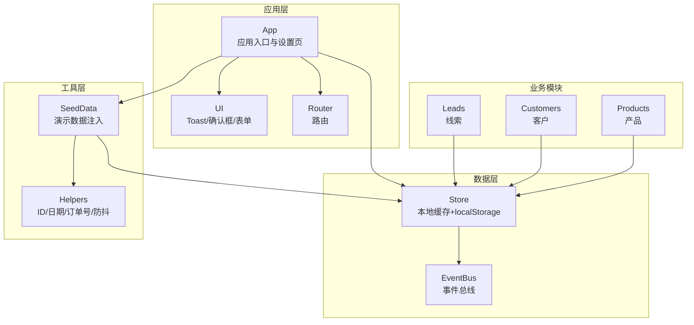
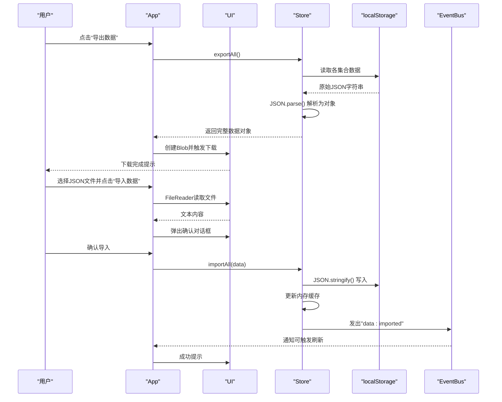
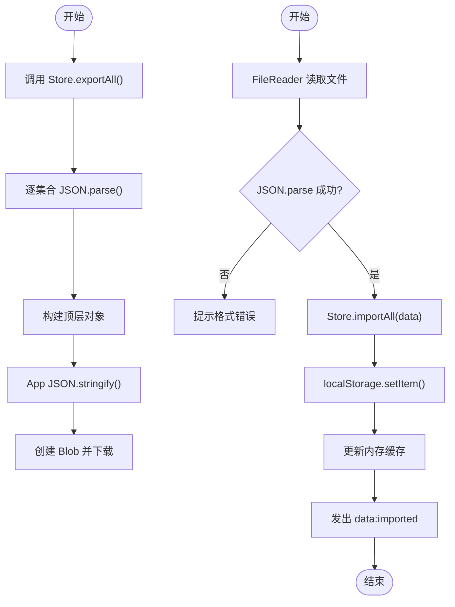
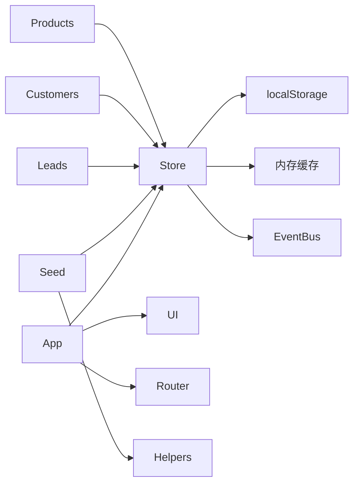

# 数据导入导出

<cite>
**本文引用的文件列表**
- [store.js](file://js/store.js)
- [app.js](file://js/app.js)
- [seed.js](file://js/utils/seed.js)
- [helpers.js](file://js/utils/helpers.js)
- [events.js](file://js/events.js)
- [ui.js](file://js/ui.js)
- [leads.js](file://js/modules/leads.js)
- [customers.js](file://js/modules/customers.js)
- [products.js](file://js/modules/products.js)
</cite>

## 目录
1. [简介](#简介)
2. [项目结构](#项目结构)
3. [核心组件](#核心组件)
4. [架构总览](#架构总览)
5. [详细组件分析](#详细组件分析)
6. [依赖关系分析](#依赖关系分析)
7. [性能考量](#性能考量)
8. [故障排查指南](#故障排查指南)
9. [结论](#结论)
10. [附录](#附录)

## 简介
本文件面向CRM系统的“数据导入导出”功能，围绕exportAll与importAll两个关键方法，系统性说明其数据序列化与反序列化机制、支持的数据格式与文件结构、数据完整性与格式校验策略、错误处理流程，以及演示数据重置（seed）与迁移最佳实践。同时给出批量处理的性能优化建议与用户体验设计要点，帮助开发者与使用者安全高效地完成数据备份、迁移与重置。

## 项目结构
系统采用模块化前端架构，数据持久化基于localStorage，通过统一的Store抽象层提供CRUD与导出导入能力；应用入口负责渲染“系统设置”页面，绑定导出/导入/重置/清空等交互；工具模块提供ID生成、日期格式化、订单号生成等辅助能力；事件总线用于模块间解耦通信；UI模块提供Toast、确认框、表单构建等通用组件。

图表来源
- [app.js:1-316](file://js/app.js#L1-L316)
- [store.js:1-139](file://js/store.js#L1-L139)
- [events.js:1-36](file://js/events.js#L1-L36)
- [helpers.js:1-113](file://js/utils/helpers.js#L1-L113)
- [seed.js:1-142](file://js/utils/seed.js#L1-L142)
- [leads.js:1-200](file://js/modules/leads.js#L1-L200)
- [customers.js:1-200](file://js/modules/customers.js#L1-L200)
- [products.js:1-175](file://js/modules/products.js#L1-L175)

章节来源
- [app.js:1-316](file://js/app.js#L1-L316)
- [store.js:1-139](file://js/store.js#L1-L139)

## 核心组件
- Store：封装localStorage访问、缓存、导出导入、清空、计数等能力，是数据导入导出的直接实现者。
- App：在“系统设置”页提供导出、导入、重置演示数据、清空数据的用户界面与交互。
- SeedData：在无数据时自动注入演示数据，支持重置演示数据。
- Helpers：提供ID生成、订单号生成、日期格式化等工具，被SeedData与其它模块使用。
- UI：提供Toast、确认框、表单构建等，用于导入导出的用户提示与交互确认。
- EventBus：模块间解耦通信，导入完成后触发事件。

章节来源
- [store.js:98-138](file://js/store.js#L98-L138)
- [app.js:172-311](file://js/app.js#L172-L311)
- [seed.js:6-142](file://js/utils/seed.js#L6-L142)
- [helpers.js:5-113](file://js/utils/helpers.js#L5-L113)
- [ui.js:48-162](file://js/ui.js#L48-L162)
- [events.js:4-35](file://js/events.js#L4-L35)

## 架构总览
导入导出流程以App为入口，Store为实现，UI为交互，EventBus为通知通道。导出时，Store遍历预定义集合，读取localStorage并序列化为JSON对象；导入时，Store将传入JSON写回localStorage并更新内存缓存，随后发出导入完成事件。SeedData在无数据时注入演示数据，支持一键重置。

图表来源
- [app.js:235-275](file://js/app.js#L235-L275)
- [store.js:98-116](file://js/store.js#L98-L116)
- [events.js:18-30](file://js/events.js#L18-L30)

## 详细组件分析

### Store：导出与导入实现
- exportAll
  - 预定义集合：leads、customers、contacts、opportunities、orders、followups、products、settings
  - 逐集合读取localStorage中的原始JSON字符串，若存在则解析为对象并加入返回结果
  - 返回顶层对象，键为集合名，值为该集合的数组
- importAll
  - 遍历传入对象的每个键（集合名），将对应数组序列化为JSON字符串写回localStorage
  - 同步更新内存缓存
  - 触发"data:imported"事件，便于订阅方刷新视图
- 错误处理
  - 读取localStorage时的异常会被捕获并记录日志，避免中断流程
  - 写入localStorage失败时会弹出错误提示（如存储空间不足）

章节来源
- [store.js:98-116](file://js/store.js#L98-L116)
- [store.js:23-30](file://js/store.js#L23-L30)
- [store.js:8-20](file://js/store.js#L8-L20)

### App：导入导出交互与数据统计
- 导出
  - 调用Store.exportAll()获取完整数据
  - 使用Blob与URL.createObjectURL创建下载链接，文件名为“crm-data-YYYY-MM-DD.json”
  - 下载完成后提示“数据已导出”
- 导入
  - 通过FileReader读取选中JSON文件
  - 使用UI.confirm进行二次确认（导入会覆盖现有数据）
  - 成功导入后提示“数据导入成功”，并重新渲染设置页
  - 若JSON.parse失败，提示“文件格式错误，请选择有效的 JSON 文件”
- 重置演示数据
  - 清空数据并移除settings键，重置内存缓存，再调用SeedData.seed()注入演示数据
- 清空数据
  - 支持按集合或全量清空，清空后发出相应事件

章节来源
- [app.js:235-275](file://js/app.js#L235-L275)
- [app.js:277-308](file://js/app.js#L277-L308)
- [ui.js:136-162](file://js/ui.js#L136-L162)

### SeedData：演示数据注入与重置
- shouldSeed
  - 当线索与客户集合均为空时，判定需要注入演示数据
- seed
  - 生成产品、线索、客户、联系人、商机、订单、跟进记录等演示数据
  - 使用Store.create与Store.update写入数据，确保主从关系与状态流转正确
  - 生成订单号时会更新settings中的计数器并持久化
- 重置
  - 在App中调用Store.clear()与清除settings键，然后重新注入演示数据

章节来源
- [seed.js:6-8](file://js/utils/seed.js#L6-L8)
- [seed.js:10-134](file://js/utils/seed.js#L10-L134)
- [helpers.js:52-61](file://js/utils/helpers.js#L52-L61)

### 数据完整性与格式校验
- 导出完整性
  - 预定义集合清单保证导出范围一致，避免遗漏
  - 对每个集合先判断是否存在原始字符串，仅在存在时解析，避免空集合报错
- 导入格式校验
  - 导入前通过JSON.parse进行语法校验，失败时提示“文件格式错误”
  - 导入后Store会将数组写回localStorage并更新内存缓存，确保一致性
- 错误处理
  - Store读取失败时记录错误并回退为空数组
  - 写入失败时弹出错误提示（如存储空间不足）

章节来源
- [store.js:98-116](file://js/store.js#L98-L116)
- [app.js:256-274](file://js/app.js#L256-L274)
- [store.js:23-30](file://js/store.js#L23-L30)

### 数据序列化与反序列化流程
- 序列化（导出）
  - Store.exportAll() -> JSON.parse() -> 返回对象
  - App导出时 -> JSON.stringify(data, null, 2) -> Blob -> 下载
- 反序列化（导入）
  - FileReader.readAsText() -> JSON.parse() -> Store.importAll()
  - Store.importAll() -> JSON.stringify() -> localStorage.setItem()

图表来源
- [store.js:98-116](file://js/store.js#L98-L116)
- [app.js:235-275](file://js/app.js#L235-L275)

## 依赖关系分析
- Store依赖localStorage与内存缓存，负责数据持久化与一致性
- App依赖UI与Router，负责用户交互与页面渲染
- SeedData依赖Store与Helpers，负责演示数据生成与注入
- EventBus为Store与App之间提供松耦合通知
- 各业务模块（Leads/Customer/Products等）通过Store访问数据

图表来源
- [store.js:1-139](file://js/store.js#L1-L139)
- [app.js:1-316](file://js/app.js#L1-L316)
- [seed.js:1-142](file://js/utils/seed.js#L1-L142)
- [events.js:1-36](file://js/events.js#L1-L36)

章节来源
- [store.js:1-139](file://js/store.js#L1-L139)
- [app.js:1-316](file://js/app.js#L1-L316)
- [seed.js:1-142](file://js/utils/seed.js#L1-L142)
- [events.js:1-36](file://js/events.js#L1-L36)

## 性能考量
- 批量导出
  - 预定义集合一次性读取，避免重复IO
  - JSON.parse与JSON.stringify在浏览器中由引擎优化，适合小中型数据集
- 批量导入
  - importAll遍历对象键并写入localStorage，复杂度与集合数量成正比
  - 建议控制单次导入文件大小，避免超大JSON导致主线程阻塞
- 用户体验
  - 导出时提供明确的文件命名（含日期）
  - 导入前使用UI.confirm进行二次确认，防止误操作
  - 导入失败时提供清晰错误提示
- 存储限制
  - localStorage容量有限，建议定期清理或分批导入
  - 写入失败时弹出错误提示，避免静默失败

[本节为通用性能建议，无需特定文件引用]

## 故障排查指南
- 导出文件为空或缺失字段
  - 检查集合是否存在于localStorage（Store逐集合读取）
  - 确认集合对应的原始字符串是否为有效JSON
- 导入失败
  - 确认文件为JSON格式且可被JSON.parse解析
  - 确认导入前的确认对话框已点击“确认导入”
- 存储空间不足
  - Store写入失败时会弹出错误提示，建议清理或减小导入文件
- 导入后数据未刷新
  - Store导入后会发出"data:imported"事件，订阅方应监听并刷新视图

章节来源
- [store.js:98-116](file://js/store.js#L98-L116)
- [app.js:256-274](file://js/app.js#L256-L274)
- [store.js:23-30](file://js/store.js#L23-L30)
- [events.js:18-30](file://js/events.js#L18-L30)

## 结论
本系统通过Store抽象实现了统一的导出导入机制，结合App的用户交互与UI的提示确认，提供了安全可靠的备份与迁移能力。SeedData确保首次使用时具备可用演示数据，支持一键重置。建议在生产环境中配合定期备份、分批导入与容量监控，以保障数据安全与系统稳定。

[本节为总结性内容，无需特定文件引用]

## 附录

### 支持的数据格式与文件结构
- 格式：JSON
- 文件扩展名：.json
- 文件命名：crm-data-YYYY-MM-DD.json
- 文件结构：顶层对象，键为集合名（如leads、customers等），值为该集合的数组

章节来源
- [app.js:238-245](file://js/app.js#L238-L245)
- [store.js:100-106](file://js/store.js#L100-L106)

### 数据完整性检查与格式验证
- 导出时逐集合存在性检查，仅解析存在的集合
- 导入时JSON.parse语法校验，失败则提示格式错误
- 写入localStorage失败时弹出错误提示

章节来源
- [store.js:98-116](file://js/store.js#L98-L116)
- [app.js:256-274](file://js/app.js#L256-L274)
- [store.js:23-30](file://js/store.js#L23-L30)

### 演示数据重置流程
- 触发条件：Store.isEmpty()为真
- 注入顺序：产品 -> 线索 -> 客户（并更新线索状态）-> 联系人 -> 商机 -> 订单 -> 跟进记录
- 重置操作：清空数据、移除settings键、重置内存缓存、重新注入演示数据

章节来源
- [seed.js:6-8](file://js/utils/seed.js#L6-L8)
- [seed.js:10-134](file://js/utils/seed.js#L10-L134)
- [app.js:277-293](file://js/app.js#L277-L293)

### 数据迁移指南（版本升级）
- 备份：使用导出功能生成JSON备份
- 迁移准备：对比新旧版本集合差异，必要时在导入前对JSON做字段映射与默认值填充
- 分批导入：对于大型数据集，建议拆分为多个较小的JSON文件分批导入
- 验证：导入后检查关键统计指标（集合数量、关键字段完整性）

[本节为通用迁移建议，无需特定文件引用]

### 数据备份与恢复最佳实践
- 定期导出：建议每周/每月固定时间点导出一次
- 版本化命名：在文件名中体现版本或时间戳，便于追溯
- 存储位置：将备份文件保存在安全可靠的位置（本地/云端）
- 恢复流程：使用导入功能恢复，导入前务必确认备份文件有效性

[本节为通用实践建议，无需特定文件引用]

### 批量数据处理的性能优化与用户体验
- 导出
  - 使用预定义集合清单，避免不必要的IO
  - 导出时提供进度提示（如“正在导出...”），完成后统一提示
- 导入
  - 导入前进行确认对话框，避免误操作
  - 对超大文件建议分批导入或提示用户调整文件大小
- 错误处理
  - 导入失败时提供明确错误信息与解决建议
  - 写入失败时弹出错误提示并引导用户清理空间或减小文件

[本节为通用优化建议，无需特定文件引用]