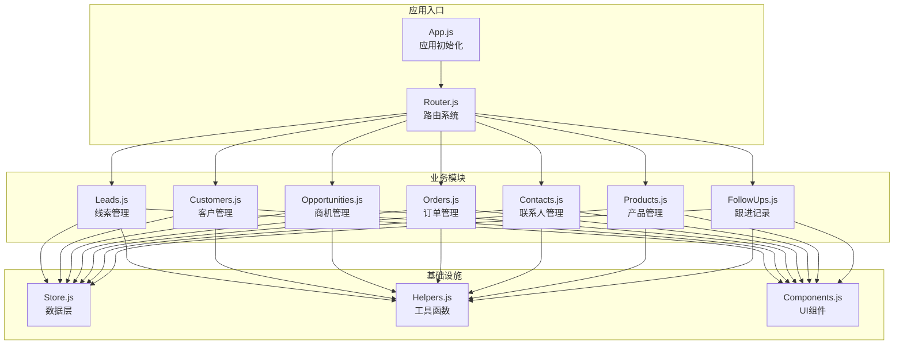
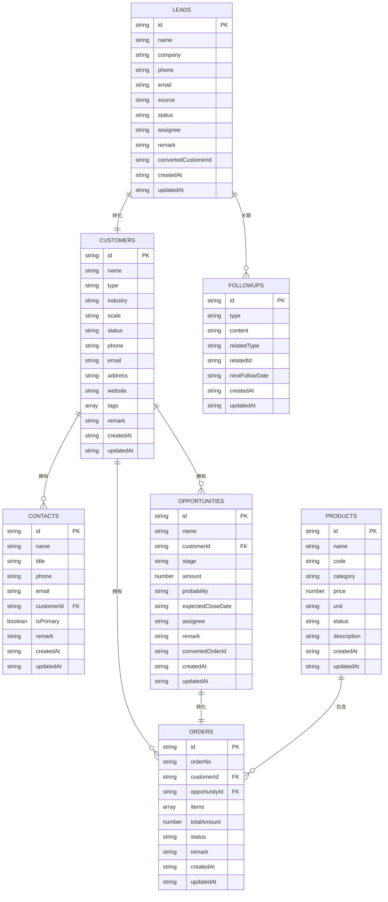
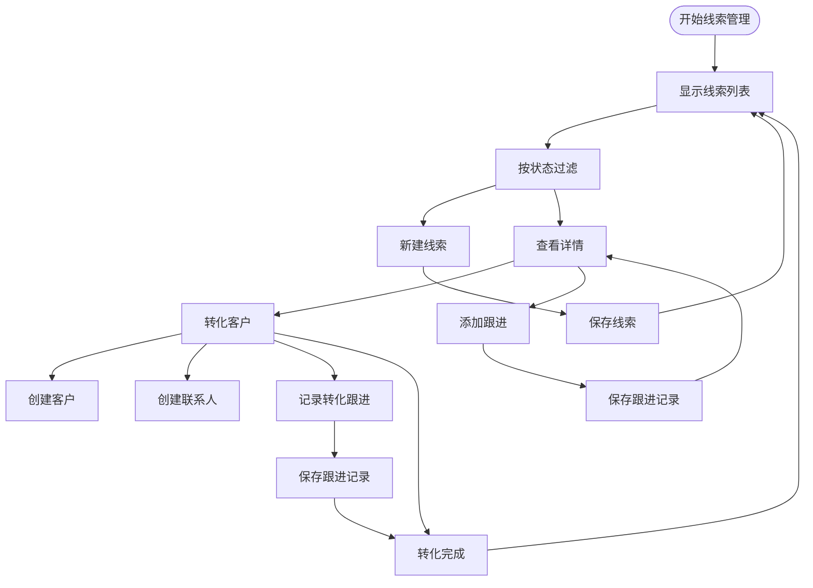
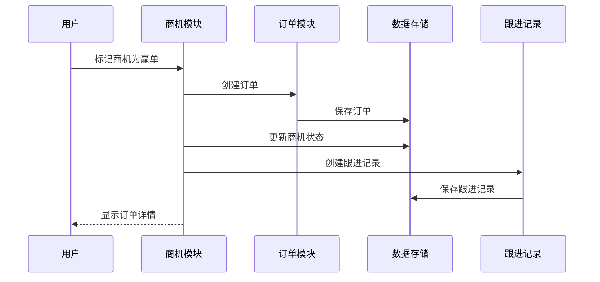
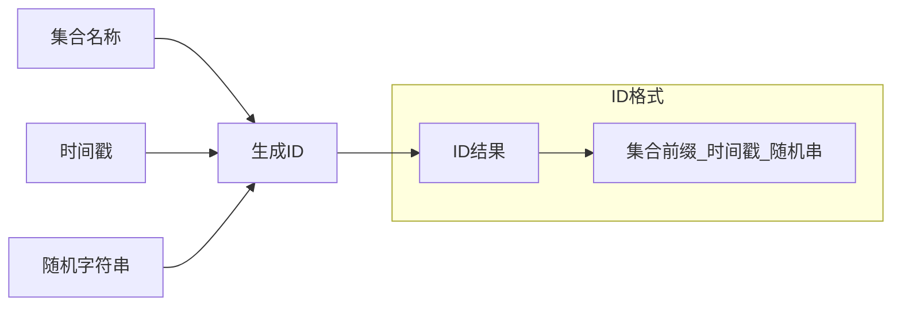
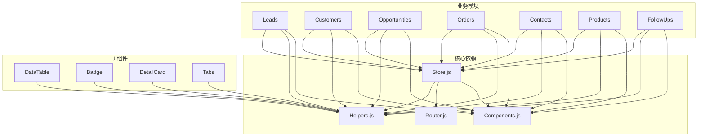
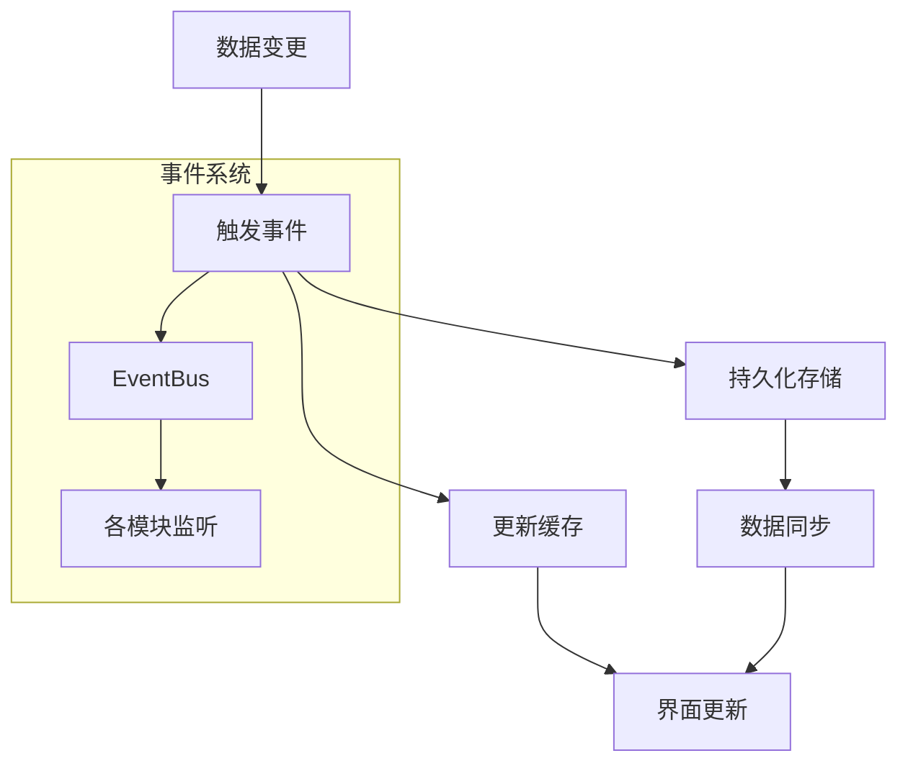
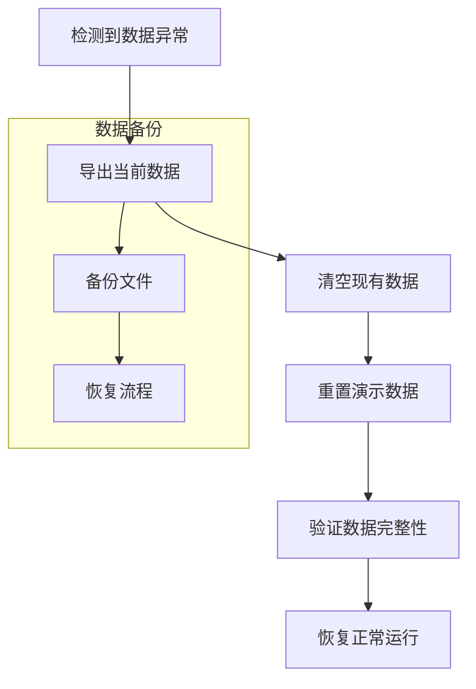

# 数据模型设计

<cite>
**本文档引用的文件**
- [leads.js](file://js/modules/leads.js)
- [customers.js](file://js/modules/customers.js)
- [opportunities.js](file://js/modules/opportunities.js)
- [orders.js](file://js/modules/orders.js)
- [followups.js](file://js/modules/followups.js)
- [contacts.js](file://js/modules/contacts.js)
- [products.js](file://js/modules/products.js)
- [store.js](file://js/store.js)
- [helpers.js](file://js/utils/helpers.js)
- [app.js](file://js/app.js)
- [components.js](file://js/components.js)
- [router.js](file://js/router.js)
</cite>

## 目录
1. [简介](#简介)
2. [项目结构](#项目结构)
3. [核心数据模型](#核心数据模型)
4. [架构概览](#架构概览)
5. [详细组件分析](#详细组件分析)
6. [依赖关系分析](#依赖关系分析)
7. [性能考虑](#性能考虑)
8. [故障排除指南](#故障排除指南)
9. [结论](#结论)

## 简介

CRM系统是一个基于浏览器的客户关系管理系统，采用纯JavaScript实现，使用localStorage作为数据存储后端。该系统实现了完整的销售生命周期管理，包括线索管理、客户管理、商机管理、订单管理、联系人管理和产品管理等核心功能模块。

系统采用模块化架构设计，每个业务实体都有独立的数据模型和业务逻辑，通过统一的Store层进行数据持久化管理。所有数据都存储在浏览器的localStorage中，支持数据导出和导入功能。

## 项目结构



**图表来源**
- [app.js:6-41](file://js/app.js#L6-L41)
- [store.js:4-138](file://js/store.js#L4-L138)
- [helpers.js:4-112](file://js/utils/helpers.js#L4-L112)

**章节来源**
- [app.js:1-316](file://js/app.js#L1-L316)
- [router.js:1-62](file://js/router.js#L1-L62)

## 核心数据模型

### 线索（Leads）数据模型

线索是销售流程的起点，代表潜在的商业机会来源。

| 字段名 | 类型 | 必填 | 默认值 | 描述 |
|--------|------|------|--------|------|
| id | string | 是 | 自动生成 | 唯一标识符 |
| name | string | 是 | - | 线索名称（姓名或公司名） |
| company | string | 否 | - | 所属公司 |
| phone | string | 否 | - | 联系电话 |
| email | string | 否 | - | 电子邮箱 |
| source | string | 是 | - | 来源渠道 |
| status | string | 是 | "新线索" | 线索状态 |
| assignee | string | 否 | - | 负责人 |
| remark | string | 否 | - | 备注信息 |
| convertedCustomerId | string | 否 | - | 转化后的客户ID |
| createdAt | string | 是 | 自动生成 | 创建时间 |
| updatedAt | string | 是 | 自动生成 | 更新时间 |

**状态映射**：
- 新线索：primary
- 跟进中：warning  
- 已转化：success
- 已关闭：gray

**来源映射**：
- 网站表单：info
- 电话咨询：primary
- 社交媒体：purple
- 转介绍：success
- 展会：warning
- 广告：danger
- 其他：gray

### 客户（Customers）数据模型

客户是CRM系统的核心实体，代表已建立业务关系的个人或组织。

| 字段名 | 类型 | 必填 | 默认值 | 描述 |
|--------|------|------|--------|------|
| id | string | 是 | 自动生成 | 唯一标识符 |
| name | string | 是 | - | 客户名称 |
| type | string | 是 | - | 客户类型 |
| industry | string | 否 | - | 所属行业 |
| scale | string | 否 | - | 公司规模 |
| status | string | 是 | "活跃" | 客户状态 |
| phone | string | 否 | - | 联系电话 |
| email | string | 否 | - | 电子邮箱 |
| address | string | 否 | - | 公司地址 |
| website | string | 否 | - | 官方网站 |
| tags | array | 否 | [] | 标签列表 |
| remark | string | 否 | - | 备注信息 |
| createdAt | string | 是 | 自动生成 | 创建时间 |
| updatedAt | string | 是 | 自动生成 | 更新时间 |

**状态映射**：
- 活跃：success
- 沉默：warning
- 流失：danger

### 商机（Opportunities）数据模型

商机代表销售过程中的具体交易机会，具有明确的金额和概率。

| 字段名 | 类型 | 必填 | 默认值 | 描述 |
|--------|------|------|--------|------|
| id | string | 是 | 自动生成 | 唯一标识符 |
| name | string | 是 | - | 商机名称 |
| customerId | string | 是 | - | 关联客户ID |
| stage | string | 是 | "需求待确认" | 销售阶段 |
| amount | number | 是 | - | 预估金额（元） |
| probability | string | 否 | "20" | 成交概率（%） |
| expectedCloseDate | string | 否 | - | 预计成交日期 |
| assignee | string | 否 | - | 负责人 |
| remark | string | 否 | - | 备注信息 |
| convertedOrderId | string | 否 | - | 转化后的订单ID |
| createdAt | string | 是 | 自动生成 | 创建时间 |
| updatedAt | string | 是 | 自动生成 | 更新时间 |

**销售阶段**：
- 需求待确认：10%
- 需求确认：30%
- 方案认可：50%
- 确定合作：70%
- 合同签约：90%
- 赢单：100%
- 输单：0%

### 订单（Orders）数据模型

订单代表已确认的销售交易，包含具体的产品和服务明细。

| 字段名 | 类型 | 必填 | 默认值 | 描述 |
|--------|------|------|--------|------|
| id | string | 是 | 自动生成 | 唯一标识符 |
| orderNo | string | 是 | 自动生成 | 订单编号 |
| customerId | string | 是 | - | 关联客户ID |
| opportunityId | string | 否 | - | 来源商机ID |
| items | array | 否 | [] | 订单明细 |
| totalAmount | number | 否 | 0 | 订单总金额 |
| status | string | 是 | "待确认" | 订单状态 |
| remark | string | 否 | - | 备注信息 |
| createdAt | string | 是 | 自动生成 | 创建时间 |
| updatedAt | string | 是 | 自动生成 | 更新时间 |

**订单状态映射**：
- 待确认：warning
- 已确认：primary
- 执行中：info
- 已完成：success
- 已取消：gray

### 联系人（Contacts）数据模型

联系人代表客户组织内的具体人员，用于建立更紧密的业务关系。

| 字段名 | 类型 | 必填 | 默认值 | 描述 |
|--------|------|------|--------|------|
| id | string | 是 | 自动生成 | 唯一标识符 |
| name | string | 是 | - | 姓名 |
| title | string | 否 | - | 职位 |
| phone | string | 否 | - | 电话 |
| email | string | 否 | - | 邮箱 |
| customerId | string | 否 | - | 所属客户ID |
| isPrimary | boolean | 否 | false | 是否为主要联系人 |
| remark | string | 否 | - | 备注信息 |
| createdAt | string | 是 | 自动生成 | 创建时间 |
| updatedAt | string | 是 | 自动生成 | 更新时间 |

### 产品（Products）数据模型

产品是订单中的基本交易单元，支持多种分类和定价模式。

| 字段名 | 类型 | 必填 | 默认值 | 描述 |
|--------|------|------|--------|------|
| id | string | 是 | 自动生成 | 唯一标识符 |
| name | string | 是 | - | 产品名称 |
| code | string | 是 | - | 产品编码 |
| category | string | 否 | - | 产品分类 |
| price | number | 是 | - | 标准单价（元） |
| unit | string | 否 | - | 计量单位 |
| status | string | 是 | "在售" | 产品状态 |
| description | string | 否 | - | 产品描述 |
| createdAt | string | 是 | 自动生成 | 创建时间 |
| updatedAt | string | 是 | 自动生成 | 更新时间 |

**产品状态映射**：
- 在售：success
- 停售：gray

### 跟进记录（FollowUps）数据模型

跟进记录用于跟踪与客户的所有沟通和互动历史。

| 字段名 | 类型 | 必填 | 默认值 | 描述 |
|--------|------|------|--------|------|
| id | string | 是 | 自动生成 | 唯一标识符 |
| type | string | 是 | "电话" | 跟进方式 |
| content | string | 是 | - | 跟进内容 |
| relatedType | string | 否 | - | 关联类型 |
| relatedId | string | 否 | - | 关联对象ID |
| nextFollowDate | string | 否 | - | 下次跟进日期 |
| createdAt | string | 是 | 自动生成 | 创建时间 |
| updatedAt | string | 是 | 自动生成 | 更新时间 |

**跟进方式映射**：
- 电话：primary
- 拜访：success
- 邮件：info
- 微信：success
- 会议：warning
- 其他：gray

## 架构概览

```mermaid
graph TB
subgraph "数据持久层"
LocalStorage[localStorage<br/>浏览器存储]
Store[Store.js<br/>数据访问层]
end
subgraph "业务逻辑层"
Leads[Leads模块]
Customers[Customers模块]
Opportunities[Opportunities模块]
Orders[Orders模块]
Contacts[Contacts模块]
Products[Products模块]
FollowUps[FollowUps模块]
end
subgraph "表现层"
UI[UI组件]
Components[通用组件]
Router[Router.js<br/>路由系统]
end
subgraph "工具层"
Helpers[Helpers.js<br/>工具函数]
EventBus[事件总线]
end
LocalStorage <- --> Store
Store <- --> Leads
Store <- --> Customers
Store <- --> Opportunities
Store <- --> Orders
Store <- --> Contacts
Store <- --> Products
Store <- --> FollowUps
Leads --> UI
Customers --> UI
Opportunities --> UI
Orders --> UI
Contacts --> UI
Products --> UI
FollowUps --> UI
Leads --> Components
Customers --> Components
Opportunities --> Components
Orders --> Components
Contacts --> Components
Products --> Components
FollowUps --> Components
Leads --> Helpers
Customers --> Helpers
Opportunities --> Helpers
Orders --> Helpers
Contacts --> Helpers
Products --> Helpers
FollowUps --> Helpers
Router --> Leads
Router --> Customers
Router --> Opportunities
Router --> Orders
Router --> Contacts
Router --> Products
Router --> FollowUps
EventBus -.-> Leads
EventBus -.-> Customers
EventBus -.-> Opportunities
EventBus -.-> Orders
EventBus -.-> Contacts
EventBus -.-> Products
EventBus -.-> FollowUps
```

**图表来源**
- [store.js:4-138](file://js/store.js#L4-L138)
- [app.js:6-41](file://js/app.js#L6-L41)
- [router.js:4-61](file://js/router.js#L4-L61)

## 详细组件分析

### 数据模型关系图



**图表来源**
- [leads.js:4-286](file://js/modules/leads.js#L4-L286)
- [customers.js:4-229](file://js/modules/customers.js#L4-L229)
- [opportunities.js:4-485](file://js/modules/opportunities.js#L4-L485)
- [orders.js:4-234](file://js/modules/orders.js#L4-L234)
- [contacts.js:4-185](file://js/modules/contacts.js#L4-L185)
- [products.js:4-175](file://js/modules/products.js#L4-L175)
- [followups.js:4-189](file://js/modules/followups.js#L4-L189)

### 线索管理流程



**图表来源**
- [leads.js:21-286](file://js/modules/leads.js#L21-L286)
- [customers.js:23-229](file://js/modules/customers.js#L23-L229)
- [contacts.js:68-185](file://js/modules/contacts.js#L68-L185)
- [followups.js:79-189](file://js/modules/followups.js#L79-L189)

### 商机管理流程



**图表来源**
- [opportunities.js:303-462](file://js/modules/opportunities.js#L303-L462)
- [orders.js:182-234](file://js/modules/orders.js#L182-L234)
- [followups.js:118-189](file://js/modules/followups.js#L118-L189)

### 数据验证规则

系统实现了多层次的数据验证机制：

1. **前端表单验证**：每个模块的FIELDS数组定义了字段的验证规则
2. **必填字段检查**：required属性标识必需字段
3. **数据类型验证**：type属性指定字段类型（text、number、email等）
4. **范围限制**：min、max、step等属性限制数值范围
5. **枚举值验证**：select类型的选项列表限制可选值

### ID生成策略

系统采用统一的ID生成策略：



**图表来源**
- [helpers.js:5-8](file://js/utils/helpers.js#L5-L8)
- [store.js:54-67](file://js/store.js#L54-L67)

### 时间戳管理机制

系统实现了完整的时间戳管理：

1. **创建时间**：createdAt字段自动设置为当前时间
2. **更新时间**：updatedAt字段在每次更新时自动刷新
3. **相对时间显示**：formatRelativeTime函数提供人性化时间显示
4. **本地化格式**：formatDate和formatDateTime提供本地化格式化

**章节来源**
- [store.js:54-85](file://js/store.js#L54-L85)
- [helpers.js:10-38](file://js/utils/helpers.js#L10-L38)

## 依赖关系分析



**图表来源**
- [store.js:4-138](file://js/store.js#L4-L138)
- [leads.js:4-286](file://js/modules/leads.js#L4-L286)
- [customers.js:4-229](file://js/modules/customers.js#L4-L229)
- [opportunities.js:4-485](file://js/modules/opportunities.js#L4-L485)
- [orders.js:4-234](file://js/modules/orders.js#L4-L234)
- [contacts.js:4-185](file://js/modules/contacts.js#L4-L185)
- [products.js:4-175](file://js/modules/products.js#L4-L175)
- [followups.js:4-189](file://js/modules/followups.js#L4-L189)

**章节来源**
- [components.js:6-324](file://js/components.js#L6-L324)

## 性能考虑

### 数据存储优化

1. **内存缓存**：Store模块使用_inMemoryCache减少localStorage访问频率
2. **批量操作**：支持批量数据导入导出
3. **增量更新**：只更新modified字段，避免全量重写

### 前端性能优化

1. **虚拟滚动**：大数据集时使用分页和虚拟滚动
2. **防抖处理**：搜索和输入操作使用防抖优化
3. **懒加载**：路由级别的模块懒加载

### 数据同步机制



**图表来源**
- [store.js:65-96](file://js/store.js#L65-L96)
- [app.js:36-38](file://js/app.js#L36-L38)

## 故障排除指南

### 常见问题及解决方案

1. **数据丢失问题**
   - 检查localStorage是否被清理
   - 使用数据导出功能备份数据
   - 通过设置页面重置演示数据

2. **页面加载缓慢**
   - 清理浏览器缓存
   - 检查网络连接状态
   - 减少同时打开的标签页数量

3. **数据不同步**
   - 刷新页面强制重新加载
   - 检查EventBus事件是否正常触发
   - 验证localStorage权限设置

4. **订单号重复**
   - 检查订单计数器状态
   - 重启应用以重置计数器
   - 手动调整订单号格式

**章节来源**
- [store.js:23-30](file://js/store.js#L23-L30)
- [helpers.js:52-61](file://js/utils/helpers.js#L52-L61)

### 数据恢复流程



**图表来源**
- [app.js:277-311](file://js/app.js#L277-L311)
- [store.js:98-137](file://js/store.js#L98-L137)

## 结论

CRM系统通过精心设计的数据模型和模块化架构，实现了完整的销售生命周期管理。系统的主要特点包括：

1. **清晰的数据模型**：每个业务实体都有明确的字段定义和业务规则
2. **灵活的模块化设计**：各模块职责分离，便于维护和扩展
3. **完善的事件驱动机制**：通过EventBus实现模块间的松耦合通信
4. **用户友好的界面**：基于组件化的UI设计，提供良好的用户体验
5. **可靠的数据持久化**：基于localStorage的本地存储方案

系统支持完整的销售流程管理，从线索获取到订单执行，涵盖了现代CRM系统的核心功能。通过合理的数据模型设计和架构组织，为后续的功能扩展和性能优化奠定了坚实基础。