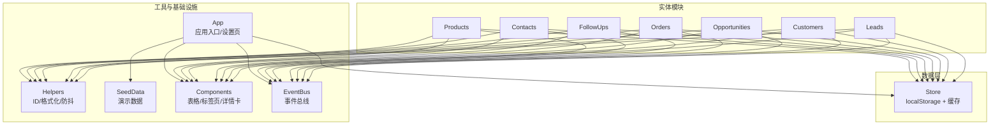
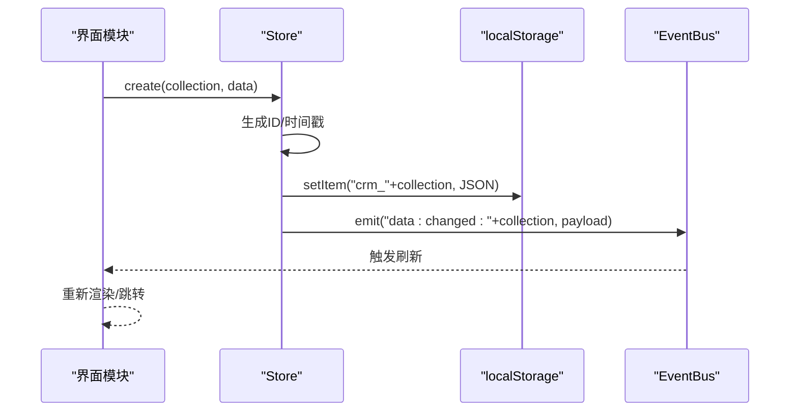
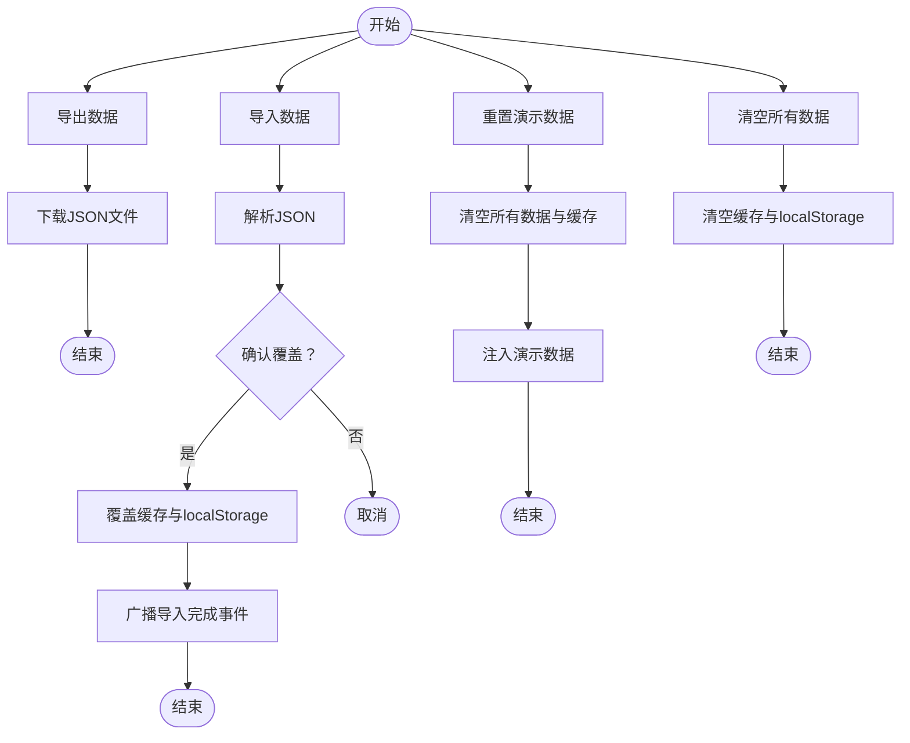
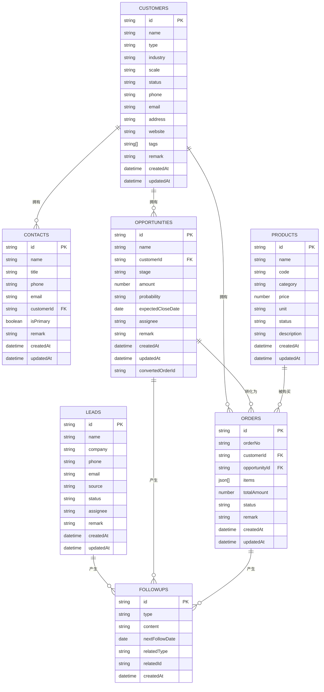
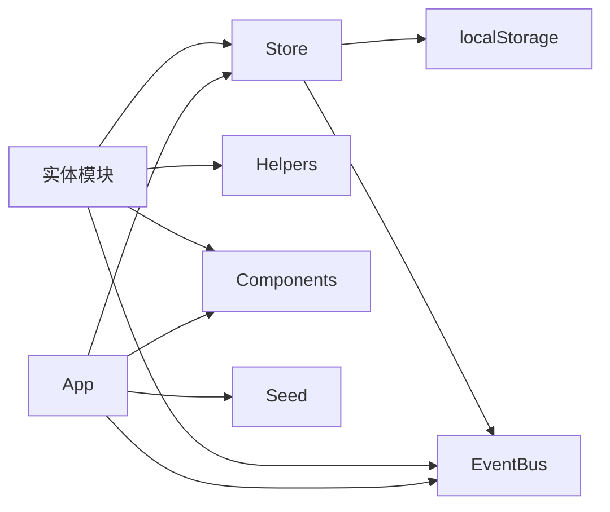

# 数据管理

<cite>
**本文引用的文件**
- [store.js](file://js/store.js)
- [helpers.js](file://js/utils/helpers.js)
- [seed.js](file://js/utils/seed.js)
- [leads.js](file://js/modules/leads.js)
- [customers.js](file://js/modules/customers.js)
- [opportunities.js](file://js/modules/opportunities.js)
- [orders.js](file://js/modules/orders.js)
- [followups.js](file://js/modules/followups.js)
- [contacts.js](file://js/modules/contacts.js)
- [products.js](file://js/modules/products.js)
- [app.js](file://js/app.js)
- [components.js](file://js/components.js)
- [events.js](file://js/events.js)
</cite>

## 目录
1. [简介](#简介)
2. [项目结构](#项目结构)
3. [核心组件](#核心组件)
4. [架构总览](#架构总览)
5. [详细组件分析](#详细组件分析)
6. [依赖分析](#依赖分析)
7. [性能考量](#性能考量)
8. [故障排查指南](#故障排查指南)
9. [结论](#结论)
10. [附录](#附录)

## 简介
本文件面向CRM系统的数据管理层，系统性梳理Store模块的设计理念与实现机制，重点说明基于localStorage的数据持久化策略；详细描述Leads、Customers、Opportunities、Orders、FollowUps、Contacts、Products等实体的数据模型与关系约束；阐述CRUD操作与数据验证机制；解释数据导入导出、演示数据重置与备份策略；并提供数据模型图与关系图，以及数据迁移与版本兼容建议。

## 项目结构
系统采用“模块化+组件化”的前端架构：
- 数据层：Store模块封装localStorage访问、缓存、CRUD与批量导出导入
- 实体模块：Leads、Customers、Opportunities、Orders、FollowUps、Contacts、Products各自负责本实体的UI、业务逻辑与路由
- 工具层：Helpers提供ID生成、格式化、防抖等工具；SeedData提供演示数据注入
- 通用组件：Components提供表格、标签页、详情卡片等可复用UI组件
- 事件总线：EventBus提供跨模块通信
- 应用入口：App负责初始化、路由注册、设置页与数据管理

图表来源
- [store.js:1-139](file://js/store.js#L1-L139)
- [leads.js:1-286](file://js/modules/leads.js#L1-L286)
- [customers.js:1-229](file://js/modules/customers.js#L1-L229)
- [opportunities.js:1-485](file://js/modules/opportunities.js#L1-L485)
- [orders.js:1-234](file://js/modules/orders.js#L1-L234)
- [followups.js:1-189](file://js/modules/followups.js#L1-L189)
- [contacts.js:1-185](file://js/modules/contacts.js#L1-L185)
- [products.js:1-175](file://js/modules/products.js#L1-L175)
- [helpers.js:1-113](file://js/utils/helpers.js#L1-L113)
- [components.js:1-324](file://js/components.js#L1-L324)
- [events.js:1-36](file://js/events.js#L1-L36)
- [app.js:1-316](file://js/app.js#L1-L316)

章节来源
- [store.js:1-139](file://js/store.js#L1-L139)
- [app.js:1-316](file://js/app.js#L1-L316)

## 核心组件
- Store：统一的数据持久化与缓存中心，提供集合级CRUD、条件查询、计数、导出导入、清空等能力，并通过EventBus广播数据变更事件
- Helpers：提供ID生成、日期/金额/相对时间格式化、防抖、截断、HTML转义、颜色哈希、订单号生成等工具
- SeedData：在首次运行或空数据时注入演示数据，涵盖Products、Leads、Customers、Contacts、Opportunities、Orders、FollowUps
- Components：通用UI组件，如DataTable、Badge、DetailCard、Tabs等
- EventBus：轻量事件总线，支持通配符监听
- App：应用入口，注册各模块路由、设置页、全局搜索、数据管理（导出/导入/重置/清空）

章节来源
- [store.js:1-139](file://js/store.js#L1-L139)
- [helpers.js:1-113](file://js/utils/helpers.js#L1-L113)
- [seed.js:1-142](file://js/utils/seed.js#L1-L142)
- [components.js:1-324](file://js/components.js#L1-L324)
- [events.js:1-36](file://js/events.js#L1-L36)
- [app.js:1-316](file://js/app.js#L1-L316)

## 架构总览
Store以“集合名”为键，将各实体数据序列化后存储于localStorage，同时在内存中维护一个简单缓存，避免重复解析。每次CRUD后同步写回localStorage，并通过EventBus发出“data:changed:*”事件，触发UI更新。设置页提供导出/导入/重置/清空等管理能力，均直接调用Store接口。

图表来源
- [store.js:54-67](file://js/store.js#L54-L67)
- [store.js:23-30](file://js/store.js#L23-L30)
- [events.js:18-30](file://js/events.js#L18-L30)

章节来源
- [store.js:1-139](file://js/store.js#L1-L139)
- [events.js:1-36](file://js/events.js#L1-L36)

## 详细组件分析

### Store模块（数据持久化与缓存）
- 设计要点
  - 前缀隔离：集合键统一加前缀“crm_”，避免命名冲突
  - 内存缓存：按集合缓存解析后的数组，减少重复JSON.parse
  - CRUD语义：create返回新记录；update返回更新后记录；delete返回布尔；getAll/query/count提供查询能力
  - 事件驱动：每次CRUD后emit对应事件，便于模块间解耦
  - 导入导出：exportAll收集指定集合，importAll覆盖缓存并广播导入完成事件
  - 清空：支持按集合或全量清空，清空后移除localStorage键并广播事件
- 性能与可靠性
  - 缓存命中：首次访问某集合时解析localStorage，后续直接使用缓存
  - 异常处理：读写localStorage失败时记录错误并提示用户
  - 存储上限：当容量不足时捕获异常并提示用户
- 使用建议
  - 批量操作建议先读取缓存，再一次性写回，减少多次localStorage IO
  - 大数据量场景建议分页或分批处理

章节来源
- [store.js:1-139](file://js/store.js#L1-L139)

### Helpers工具集
- ID与时间：generateId、now、today；订单号生成器结合settings中的计数器
- 格式化：日期/时间/相对时间、金额（含简写）、截断、HTML转义、首字母、颜色哈希
- 防抖：debounce(fn, delay)
- 订单号规则：基于日期与递增计数，确保唯一性

章节来源
- [helpers.js:1-113](file://js/utils/helpers.js#L1-L113)

### SeedData（演示数据）
- 注入时机：首次运行或Store.isEmpty()时自动注入
- 注入内容：Products、Leads、Customers、Contacts、Opportunities、Orders、FollowUps
- 注入流程：按顺序创建实体，部分实体之间存在外键/转换关系（如线索转客户、商机转订单）
- 重置：设置页提供“重置演示数据”，清空所有数据并重新注入

章节来源
- [seed.js:1-142](file://js/utils/seed.js#L1-L142)
- [app.js:277-293](file://js/app.js#L277-L293)

### 实体模块（字段定义与关系约束）
以下为各实体的核心字段与关系约束（以模块定义为准）：

- Leads（线索）
  - 字段：name、company、phone、email、source、status、assignee、remark、createdAt、updatedAt
  - 关系：可转化为Customers（convertedCustomerId），可产生FollowUps
  - 状态映射：新线索/跟进中/已转化/已关闭
  - 关联：Customers（一对一：已转化后指向客户）

- Customers（客户）
  - 字段：name、type、industry、scale、status、phone、email、address、website、tags、remark、createdAt、updatedAt
  - 关系：一对多：Contacts、Opportunities、Orders
  - 状态映射：活跃/沉默/流失

- Opportunities（商机）
  - 字段：name、customerId、stage、amount、probability、expectedCloseDate、assignee、remark、createdAt、updatedAt
  - 关系：一对一：Orders（convertedOrderId），可产生FollowUps
  - 阶段：需求待确认/需求确认/方案认可/确定合作/合同签约/赢单/输单
  - 概率：与阶段映射

- Orders（订单）
  - 字段：orderNo、customerId、opportunityId、items（数组：productId/productName/quantity/unitPrice/subtotal）、totalAmount、status、remark、createdAt、updatedAt
  - 关系：一对一：Opportunity（来源商机），一对多：Items
  - 状态：待确认/已确认/执行中/已完成/已取消

- FollowUps（跟进记录）
  - 字段：type、content、nextFollowDate、relatedType（lead/customer/opportunity）、relatedId、createdAt
  - 关系：与多个实体弱关联（通过relatedType/relatedId）

- Contacts（联系人）
  - 字段：name、title、phone、email、customerId、isPrimary、remark、createdAt、updatedAt
  - 关系：属于Customers（customerId）

- Products（产品）
  - 字段：name、code、category、price、unit、status、description、createdAt、updatedAt
  - 关系：被Orders引用（通过items）

章节来源
- [leads.js:7-16](file://js/modules/leads.js#L7-L16)
- [customers.js:7-19](file://js/modules/customers.js#L7-L19)
- [opportunities.js:11-20](file://js/modules/opportunities.js#L11-L20)
- [orders.js:9-13](file://js/modules/orders.js#L9-L13)
- [followups.js:9-13](file://js/modules/followups.js#L9-L13)
- [contacts.js:7-14](file://js/modules/contacts.js#L7-L14)
- [products.js:7-15](file://js/modules/products.js#L7-L15)

### CRUD与数据验证
- CRUD实现
  - create：生成ID与时间戳，插入数组头部，保存并广播事件
  - update：按ID查找并合并更新字段，更新时间戳，保存并广播事件
  - delete：按ID删除并保存，广播事件
  - query/count/getAll/getById：基于缓存与过滤器
- 数据验证
  - 表单层面：各模块在UI层定义字段属性（必填、类型、选项、默认值等），提交时由UI校验
  - 业务层面：部分字段存在互斥/派生关系（如线索转客户、商机阶段推进、订单明细校验）
  - 存储层面：Store不强制校验，但会捕获异常并提示用户

章节来源
- [store.js:54-96](file://js/store.js#L54-L96)
- [leads.js:159-180](file://js/modules/leads.js#L159-L180)
- [opportunities.js:277-301](file://js/modules/opportunities.js#L277-L301)
- [orders.js:182-211](file://js/modules/orders.js#L182-L211)
- [contacts.js:126-162](file://js/modules/contacts.js#L126-L162)
- [products.js:126-151](file://js/modules/products.js#L126-L151)

### 数据导入导出、重置与备份
- 导出
  - 设置页提供导出按钮，调用Store.exportAll()生成JSON并下载
- 导入
  - 设置页提供导入按钮，读取JSON文件并调用Store.importAll()覆盖缓存与localStorage，广播导入完成事件
- 重置演示数据
  - 清空所有数据与缓存，移除settings，重新注入演示数据
- 清空
  - 支持按集合或全量清空，不可逆
- 备份策略
  - 建议定期导出数据作为备份；导入前建议先备份当前数据

图表来源
- [app.js:235-311](file://js/app.js#L235-L311)
- [store.js:98-132](file://js/store.js#L98-L132)

章节来源
- [app.js:172-311](file://js/app.js#L172-L311)
- [store.js:98-132](file://js/store.js#L98-L132)

### 数据模型图与关系图

图表来源
- [leads.js:4-16](file://js/modules/leads.js#L4-L16)
- [customers.js:4-19](file://js/modules/customers.js#L4-L19)
- [contacts.js:4-14](file://js/modules/contacts.js#L4-L14)
- [opportunities.js:4-20](file://js/modules/opportunities.js#L4-L20)
- [orders.js:4-13](file://js/modules/orders.js#L4-L13)
- [products.js:4-15](file://js/modules/products.js#L4-L15)
- [followups.js:4-13](file://js/modules/followups.js#L4-L13)

## 依赖分析
- 模块耦合
  - 实体模块均依赖Store进行数据访问；依赖Helpers进行格式化与ID生成；依赖Components进行UI渲染；依赖EventBus进行跨模块通知
- 外部依赖
  - localStorage：持久化存储
  - Blob/FileReader：设置页导出/导入
- 循环依赖
  - 未发现循环依赖；Store不依赖具体模块，仅通过集合名交互
- 可能的改进
  - 对大集合增加分页/懒加载
  - 对频繁更新的集合增加批量写入策略

图表来源
- [store.js:1-139](file://js/store.js#L1-L139)
- [app.js:1-316](file://js/app.js#L1-L316)
- [events.js:1-36](file://js/events.js#L1-L36)

章节来源
- [store.js:1-139](file://js/store.js#L1-L139)
- [app.js:1-316](file://js/app.js#L1-L316)
- [events.js:1-36](file://js/events.js#L1-L36)

## 性能考量
- 缓存策略：Store对每个集合维护内存缓存，避免重复解析localStorage，显著降低IO开销
- 事件驱动：通过EventBus减少模块间的直接耦合，提升响应效率
- UI优化：Components提供分页、排序、搜索与防抖，改善大数据量下的交互体验
- 建议
  - 大数据量场景建议分页或分批处理
  - 导入/导出时避免在主线程长时间阻塞，必要时使用Web Worker或异步处理
  - 对频繁更新的集合，考虑批量写入与去抖

[本节为通用性能讨论，无需特定文件来源]

## 故障排查指南
- 数据保存失败
  - 现象：保存时报错或提示存储空间不足
  - 原因：localStorage写入异常或容量不足
  - 处理：清理浏览器缓存或删除不必要的数据，确保可用空间充足
- 数据导入失败
  - 现象：导入后无数据或报错
  - 原因：JSON格式不正确或字段缺失
  - 处理：检查JSON格式，确保包含集合键与合法数据；必要时先导出备份
- 数据丢失或为空
  - 现象：页面空白或统计数据为0
  - 原因：localStorage被清除或首次运行
  - 处理：使用“重置演示数据”恢复；或从备份文件导入
- 页面无法刷新
  - 现象：修改数据后页面未更新
  - 原因：未触发事件或缓存未更新
  - 处理：确认Store是否正确emit事件；必要时手动刷新页面

章节来源
- [store.js:23-30](file://js/store.js#L23-L30)
- [app.js:252-275](file://js/app.js#L252-L275)
- [app.js:277-293](file://js/app.js#L277-L293)

## 结论
该数据管理层以Store为核心，结合Helpers、SeedData与EventBus，构建了简洁可靠的前端数据持久化方案。实体模块围绕Store进行CRUD与业务逻辑，配合通用组件与设置页，实现了完整的数据生命周期管理。建议在生产环境中加强数据校验与备份策略，并根据数据规模优化缓存与IO策略。

[本节为总结，无需特定文件来源]

## 附录

### 数据迁移与版本兼容
- 迁移策略
  - 版本升级时，优先导出现有数据，再进行新版本部署
  - 若字段结构发生变更，需在导入前进行字段映射与清洗
- 兼容性建议
  - 保留集合键与基础字段的向后兼容
  - 对新增字段提供默认值或忽略策略
  - 在设置页提供“重置演示数据”作为安全回退手段

[本节为通用指导，无需特定文件来源]