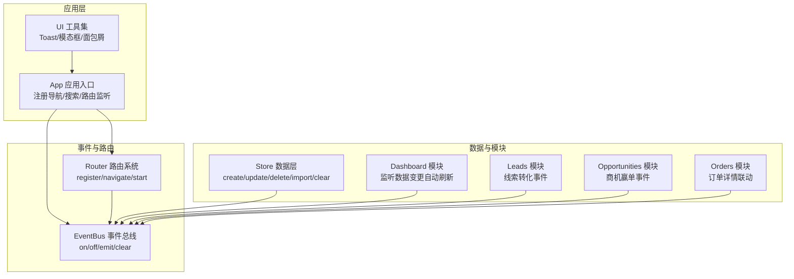
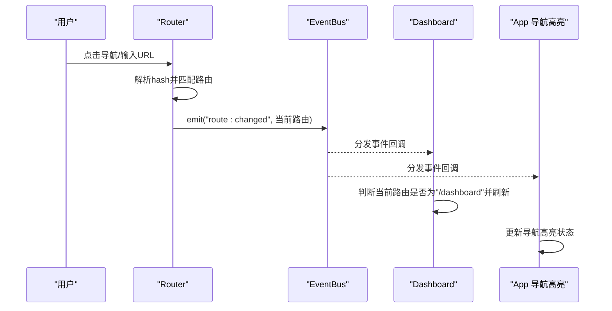
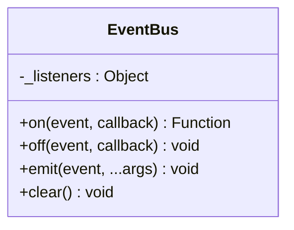
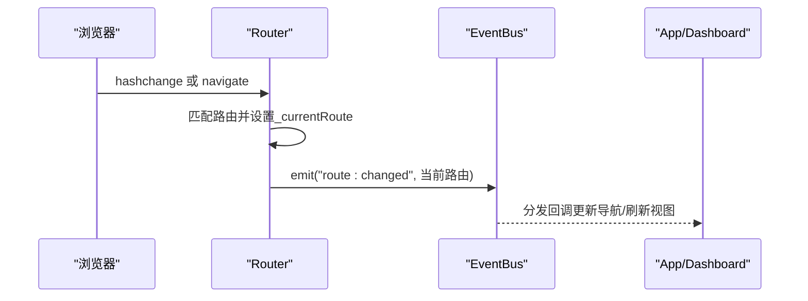
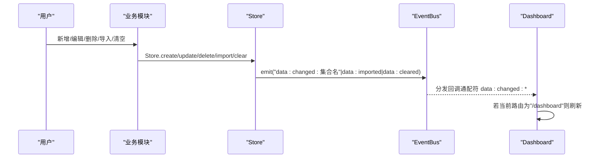
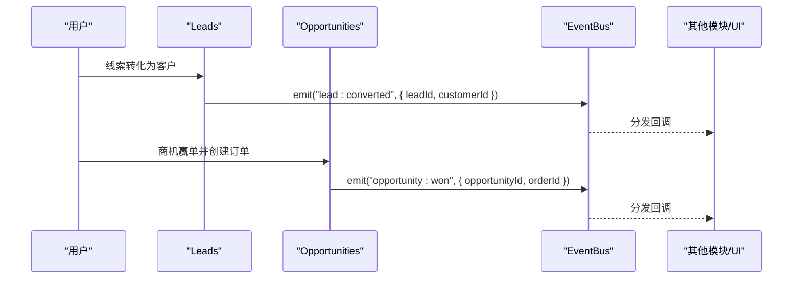
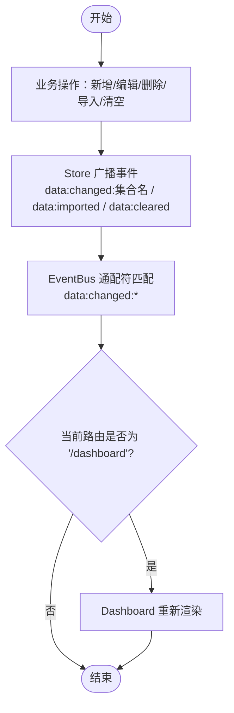
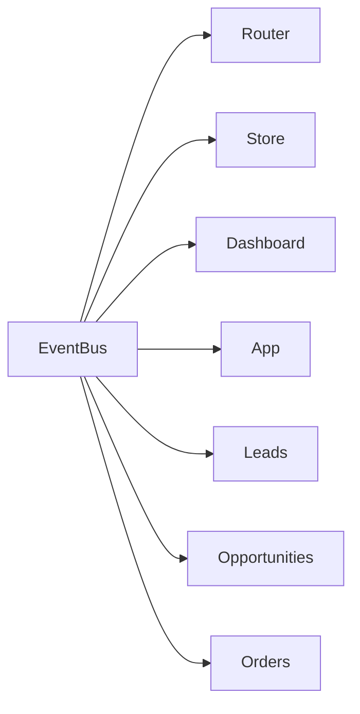

# 事件系统

<cite>
**本文引用的文件**
- [events.js](file://js/events.js)
- [router.js](file://js/router.js)
- [store.js](file://js/store.js)
- [app.js](file://js/app.js)
- [dashboard.js](file://js/modules/dashboard.js)
- [leads.js](file://js/modules/leads.js)
- [opportunities.js](file://js/modules/opportunities.js)
- [orders.js](file://js/modules/orders.js)
- [ui.js](file://js/ui.js)
</cite>

## 目录
1. [简介](#简介)
2. [项目结构](#项目结构)
3. [核心组件](#核心组件)
4. [架构总览](#架构总览)
5. [详细组件分析](#详细组件分析)
6. [依赖分析](#依赖分析)
7. [性能考量](#性能考量)
8. [故障排查指南](#故障排查指南)
9. [结论](#结论)
10. [附录](#附录)

## 简介
本文件面向CRM系统的事件系统，围绕EventBus事件总线的设计与实现展开，重点解释发布-订阅机制、事件命名规范、事件传递路径以及在模块间解耦通信中的作用。文档同时提供事件流程图、使用示例与最佳实践，帮助开发者正确使用与扩展事件系统。

## 项目结构
事件系统位于前端模块化架构中，采用“事件总线 + 路由 + 数据层”的协作模式：
- 事件总线：集中管理监听器注册、移除与事件分发
- 路由系统：负责页面导航与事件触发
- 数据层：负责业务数据变更并广播数据变更事件
- 模块：通过事件总线实现跨模块通信与联动

图表来源
- [events.js:1-36](file://js/events.js#L1-L36)
- [router.js:1-62](file://js/router.js#L1-L62)
- [store.js:1-139](file://js/store.js#L1-L139)
- [app.js:1-316](file://js/app.js#L1-L316)
- [dashboard.js:1-220](file://js/modules/dashboard.js#L1-L220)
- [leads.js:1-286](file://js/modules/leads.js#L1-L286)
- [opportunities.js:1-485](file://js/modules/opportunities.js#L1-L485)
- [orders.js:1-234](file://js/modules/orders.js#L1-L234)

章节来源
- [events.js:1-36](file://js/events.js#L1-L36)
- [router.js:1-62](file://js/router.js#L1-L62)
- [store.js:1-139](file://js/store.js#L1-L139)
- [app.js:1-316](file://js/app.js#L1-L316)

## 核心组件
- 事件总线（EventBus）
  - 提供 on(event, callback) 注册监听器，返回一个可调用的移除函数
  - 提供 off(event, callback) 移除指定监听器
  - 提供 emit(event, ...args) 触发事件，并支持通配符“模块:*”
  - 提供 clear() 清空所有监听器
- 路由系统（Router）
  - 在路由切换后通过 EventBus.emit('route:changed', route) 广播当前路由
- 数据层（Store）
  - 在 create/update/delete/import/clear 等操作后，广播对应的数据变更事件
  - 事件命名以“data:changed:集合名”或“data:imported/data:cleared”为主
- 模块（如 Dashboard/Leads/Opportunities/Orders）
  - 通过 EventBus.on(...) 订阅事件，实现跨模块联动与自动刷新

章节来源
- [events.js:4-35](file://js/events.js#L4-L35)
- [router.js:22-30](file://js/router.js#L22-L30)
- [store.js:54-96](file://js/store.js#L54-L96)
- [store.js:110-132](file://js/store.js#L110-L132)
- [dashboard.js:213-218](file://js/modules/dashboard.js#L213-L218)

## 架构总览
事件系统采用发布-订阅模式，形成“低耦合、高内聚”的模块交互：
- 发布者：路由系统、数据层、业务模块
- 订阅者：UI模块、仪表盘、其他业务模块
- 事件通道：EventBus统一调度，支持通配符事件

图表来源
- [router.js:22-30](file://js/router.js#L22-L30)
- [events.js:18-30](file://js/events.js#L18-L30)
- [app.js:35-40](file://js/app.js#L35-L40)
- [dashboard.js:213-218](file://js/modules/dashboard.js#L213-L218)

## 详细组件分析

### 事件总线（EventBus）类图
EventBus是一个单例对象，内部维护事件名到回调数组的映射，并提供注册、移除、触发与清理能力。

图表来源
- [events.js:4-35](file://js/events.js#L4-L35)

章节来源
- [events.js:4-35](file://js/events.js#L4-L35)

### 路由事件发布（route:changed）
- 路由解析成功后，通过 EventBus.emit('route:changed', route) 广播当前路由
- App 订阅该事件以更新导航高亮
- Dashboard 订阅以实现数据变更时的自动刷新

图表来源
- [router.js:22-30](file://js/router.js#L22-L30)
- [app.js:35-40](file://js/app.js#L35-L40)
- [dashboard.js:213-218](file://js/modules/dashboard.js#L213-L218)

章节来源
- [router.js:22-30](file://js/router.js#L22-L30)
- [app.js:35-40](file://js/app.js#L35-L40)
- [dashboard.js:213-218](file://js/modules/dashboard.js#L213-L218)

### 数据变更事件发布（data:changed:*）
- Store 在 create/update/delete/import/clear 后，广播对应事件
- 事件命名规范：data:changed:集合名 或 data:imported / data:cleared
- Dashboard 通过通配符“data:changed:*”订阅，实现任意集合数据变更时的自动刷新

图表来源
- [store.js:64-96](file://js/store.js#L64-L96)
- [store.js:114-132](file://js/store.js#L114-L132)
- [dashboard.js:213-218](file://js/modules/dashboard.js#L213-L218)

章节来源
- [store.js:64-96](file://js/store.js#L64-L96)
- [store.js:114-132](file://js/store.js#L114-L132)
- [dashboard.js:213-218](file://js/modules/dashboard.js#L213-L218)

### 业务事件发布（示例：线索转化、商机赢单）
- Leads 模块在线索转化为客户后，通过 EventBus.emit('lead:converted', payload) 广播
- Opportunities 模块在商机赢单并创建订单后，通过 EventBus.emit('opportunity:won', payload) 广播
- 订阅方可在收到事件后执行后续动作（如跳转、刷新、提示）

图表来源
- [leads.js:275-277](file://js/modules/leads.js#L275-L277)
- [opportunities.js:458-461](file://js/modules/opportunities.js#L458-L461)

章节来源
- [leads.js:275-277](file://js/modules/leads.js#L275-L277)
- [opportunities.js:458-461](file://js/modules/opportunities.js#L458-L461)

### 事件命名规范与传递机制
- 命名规范
  - 路由事件：route:changed
  - 数据事件：data:changed:集合名；批量事件：data:imported、data:cleared
  - 业务事件：模块:动作（如 lead:converted、opportunity:won）
- 传递机制
  - EventBus.emit(event, ...args) 逐个调用监听器
  - 通配符支持：当事件名为“模块:子事件”时，自动匹配“模块:*”
  - 返回值：on(...) 返回一个移除函数，便于在组件销毁时清理

章节来源
- [events.js:18-30](file://js/events.js#L18-L30)
- [router.js:28-30](file://js/router.js#L28-L30)
- [store.js:64-96](file://js/store.js#L64-L96)
- [store.js:114-132](file://js/store.js#L114-L132)
- [leads.js:275-277](file://js/modules/leads.js#L275-L277)
- [opportunities.js:458-461](file://js/modules/opportunities.js#L458-L461)

### 事件流程图（数据变更自动刷新）

图表来源
- [store.js:64-96](file://js/store.js#L64-L96)
- [store.js:114-132](file://js/store.js#L114-L132)
- [dashboard.js:213-218](file://js/modules/dashboard.js#L213-L218)
- [events.js:22-29](file://js/events.js#L22-L29)

## 依赖分析
- EventBus 作为中心枢纽，被多个模块依赖
- Router 与 Store 作为事件发布者，向 EventBus 发布事件
- Dashboard、App 等模块作为事件订阅者，响应事件并更新界面
- 事件命名与模块职责清晰分离，避免直接耦合

图表来源
- [events.js:1-36](file://js/events.js#L1-L36)
- [router.js:1-62](file://js/router.js#L1-L62)
- [store.js:1-139](file://js/store.js#L1-L139)
- [dashboard.js:1-220](file://js/modules/dashboard.js#L1-L220)
- [app.js:1-316](file://js/app.js#L1-L316)
- [leads.js:1-286](file://js/modules/leads.js#L1-L286)
- [opportunities.js:1-485](file://js/modules/opportunities.js#L1-L485)
- [orders.js:1-234](file://js/modules/orders.js#L1-L234)

章节来源
- [events.js:1-36](file://js/events.js#L1-L36)
- [router.js:1-62](file://js/router.js#L1-L62)
- [store.js:1-139](file://js/store.js#L1-L139)
- [dashboard.js:1-220](file://js/modules/dashboard.js#L1-L220)
- [app.js:1-316](file://js/app.js#L1-L316)
- [leads.js:1-286](file://js/modules/leads.js#L1-L286)
- [opportunities.js:1-485](file://js/modules/opportunities.js#L1-L485)
- [orders.js:1-234](file://js/modules/orders.js#L1-L234)

## 性能考量
- 监听器数量控制
  - 避免在短时间内大量注册监听器，建议在模块初始化时集中注册
  - 使用返回的移除函数在组件卸载时及时清理，防止内存泄漏
- 事件粒度与频率
  - 对高频事件（如输入搜索）建议结合防抖策略，减少事件风暴
  - 通配符事件虽然方便，但应避免在热路径上过度使用
- 视图刷新策略
  - Dashboard 通过通配符事件触发刷新，建议在路由判断后再执行昂贵的渲染逻辑
- 存储与序列化
  - Store 的本地持久化与事件广播同步进行，注意避免在事件回调中进行阻塞操作

[本节为通用性能建议，不直接分析具体文件]

## 故障排查指南
- 事件未触发
  - 检查事件名是否与发布一致（大小写、拼写、通配符）
  - 确认监听器是否在事件发布前注册
- 监听器未移除
  - 确保在组件销毁时调用 on(...) 返回的移除函数
  - 避免重复注册同一监听器
- 路由事件无效
  - 确认 Router 是否正确调用 emit('route:changed')
  - 检查 App/Dashboard 是否正确订阅该事件
- 数据变更未刷新
  - 确认 Store 的 create/update/delete/import/clear 是否正确发出事件
  - 检查 Dashboard 的通配符订阅逻辑与当前路由判断

章节来源
- [events.js:10-16](file://js/events.js#L10-L16)
- [router.js:28-30](file://js/router.js#L28-L30)
- [store.js:64-96](file://js/store.js#L64-L96)
- [store.js:114-132](file://js/store.js#L114-L132)
- [dashboard.js:213-218](file://js/modules/dashboard.js#L213-L218)
- [app.js:35-40](file://js/app.js#L35-L40)

## 结论
CRM系统的事件系统通过EventBus实现了模块间的松耦合通信：路由变化、数据变更与业务事件均可通过统一的发布-订阅机制传播。合理的事件命名规范与通配符支持提升了扩展性，配合监听器生命周期管理与性能优化策略，能够有效支撑复杂业务场景下的实时联动与自动刷新。

[本节为总结性内容，不直接分析具体文件]

## 附录

### 常见事件类型与使用场景
- 路由事件
  - route:changed：用于导航高亮与页面联动
  - 使用位置：App 导航高亮、Dashboard 路由感知
- 数据事件
  - data:changed:集合名：任意集合数据变更后的刷新
  - data:imported / data:cleared：导入/清空数据后的全局刷新
  - 使用位置：Dashboard 通配符订阅
- 业务事件
  - lead:converted：线索转化为客户的后续处理
  - opportunity:won：商机赢单并创建订单后的联动
  - 使用位置：跨模块联动与提示

章节来源
- [router.js:28-30](file://js/router.js#L28-L30)
- [store.js:64-96](file://js/store.js#L64-L96)
- [store.js:114-132](file://js/store.js#L114-L132)
- [leads.js:275-277](file://js/modules/leads.js#L275-L277)
- [opportunities.js:458-461](file://js/modules/opportunities.js#L458-L461)
- [dashboard.js:213-218](file://js/modules/dashboard.js#L213-L218)
- [app.js:35-40](file://js/app.js#L35-L40)