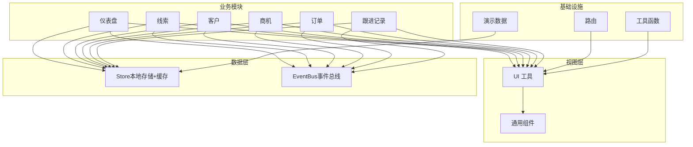
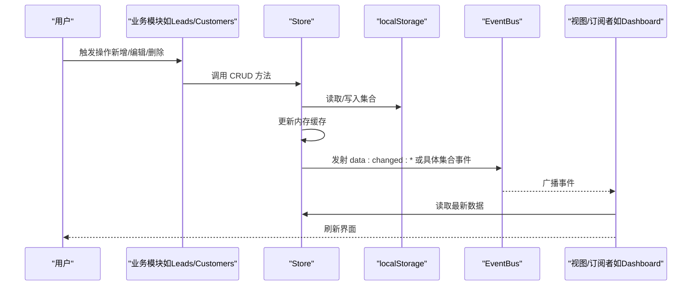
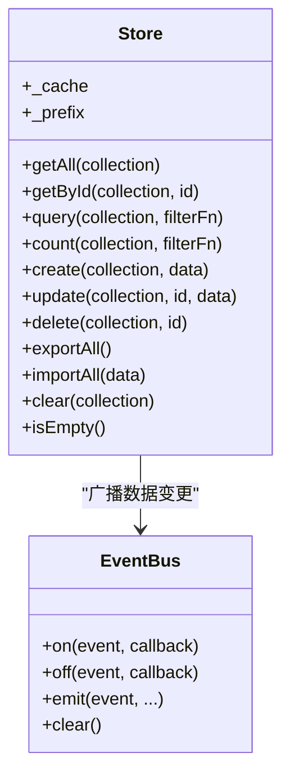
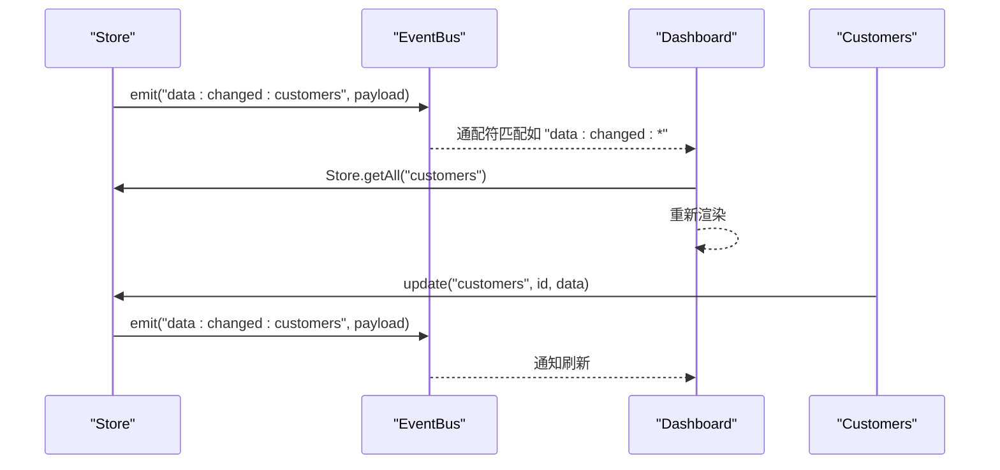
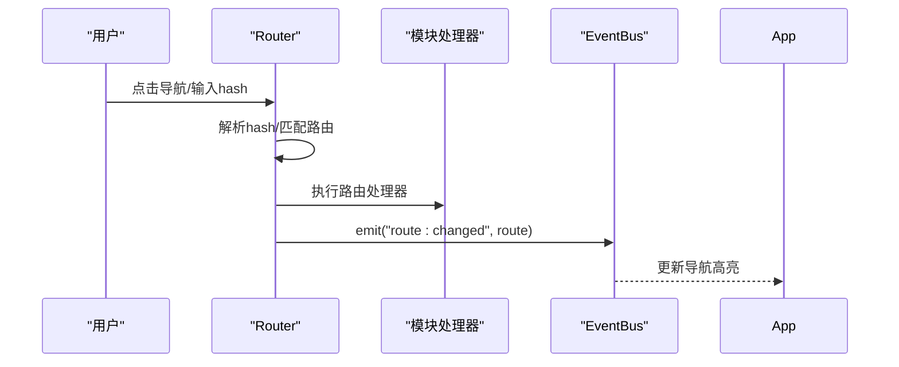
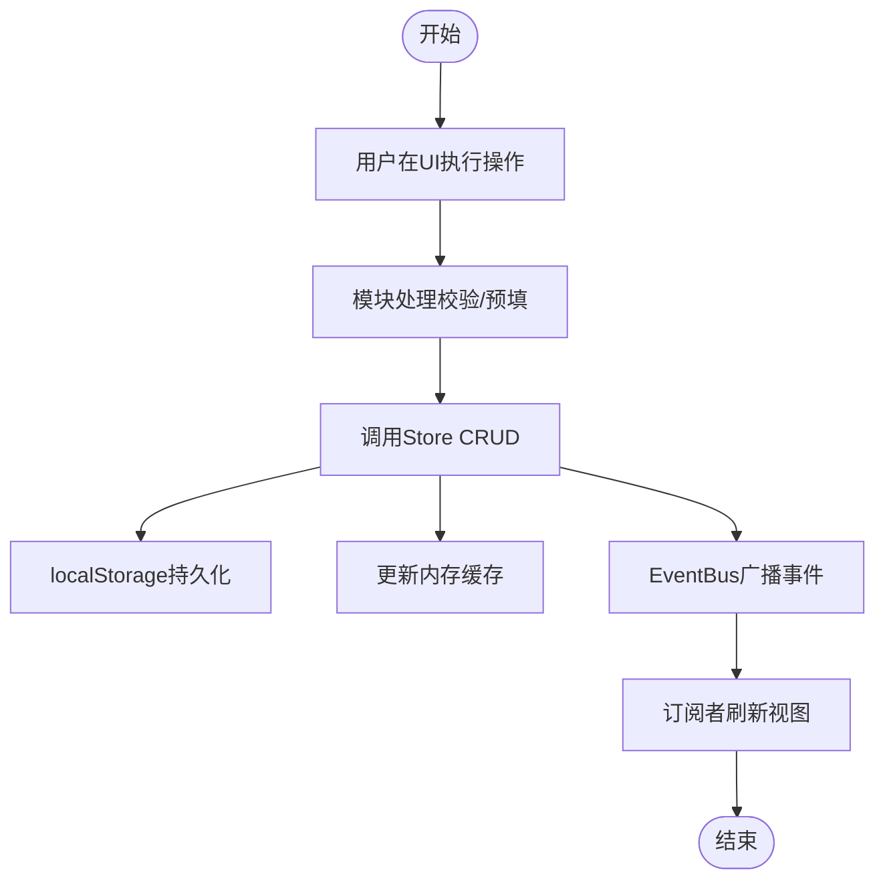
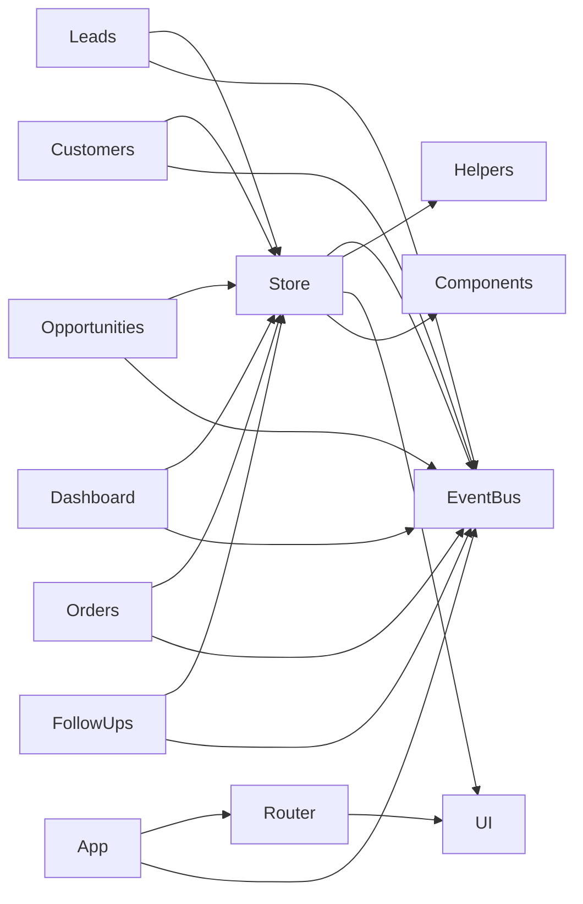

# 数据流设计

<cite>
**本文引用的文件**
- [store.js](file://js/store.js)
- [events.js](file://js/events.js)
- [router.js](file://js/router.js)
- [app.js](file://js/app.js)
- [helpers.js](file://js/utils/helpers.js)
- [seed.js](file://js/utils/seed.js)
- [dashboard.js](file://js/modules/dashboard.js)
- [leads.js](file://js/modules/leads.js)
- [customers.js](file://js/modules/customers.js)
- [opportunities.js](file://js/modules/opportunities.js)
- [orders.js](file://js/modules/orders.js)
- [followups.js](file://js/modules/followups.js)
- [ui.js](file://js/ui.js)
- [components.js](file://js/components.js)
</cite>

## 目录
1. [引言](#引言)
2. [项目结构](#项目结构)
3. [核心组件](#核心组件)
4. [架构总览](#架构总览)
5. [详细组件分析](#详细组件分析)
6. [依赖分析](#依赖分析)
7. [性能考虑](#性能考虑)
8. [故障排查指南](#故障排查指南)
9. [结论](#结论)
10. [附录](#附录)

## 引言
本文件面向CRM系统的数据流设计，聚焦以下目标：
- 描述从用户操作到数据持久化的完整数据流路径
- 解释Store模块作为数据层的设计理念与实现（CRUD、缓存、导入导出、清空）
- 分析EventBus如何实现数据变更的广播与订阅
- 提供数据流图与交互序列图，展示典型操作（新增、更新、删除、导入导出）
- 讨论数据一致性与并发控制策略（本地存储、事件驱动刷新）

## 项目结构
系统采用“模块化+事件驱动”的前端架构，核心文件组织如下：
- 数据层：Store（本地存储+内存缓存）
- 事件总线：EventBus（发布/订阅）
- 路由：Router（hash路由）
- 工具：Helpers（ID生成、格式化、防抖等）、SeedData（演示数据注入）
- 视图与交互：UI（Toast、模态框、表单）、Components（通用组件）
- 功能模块：Dashboard、Leads、Customers、Opportunities、Orders、FollowUps

图表来源
- [store.js](file://js/store.js)
- [events.js](file://js/events.js)
- [router.js](file://js/router.js)
- [ui.js](file://js/ui.js)
- [components.js](file://js/components.js)
- [dashboard.js](file://js/modules/dashboard.js)
- [leads.js](file://js/modules/leads.js)
- [customers.js](file://js/modules/customers.js)
- [opportunities.js](file://js/modules/opportunities.js)
- [orders.js](file://js/modules/orders.js)
- [followups.js](file://js/modules/followups.js)

章节来源
- [store.js](file://js/store.js)
- [events.js](file://js/events.js)
- [router.js](file://js/router.js)
- [ui.js](file://js/ui.js)
- [components.js](file://js/components.js)
- [dashboard.js](file://js/modules/dashboard.js)
- [leads.js](file://js/modules/leads.js)
- [customers.js](file://js/modules/customers.js)
- [opportunities.js](file://js/modules/opportunities.js)
- [orders.js](file://js/modules/orders.js)
- [followups.js](file://js/modules/followups.js)

## 核心组件
- Store：统一的数据访问层，负责集合读取、CRUD、计数、条件查询、导入导出、清空，并通过localStorage持久化，同时维护内存缓存以提升读取性能。
- EventBus：轻量事件总线，支持命名事件与通配符事件，用于跨模块广播数据变更。
- Router：基于hash的前端路由，负责页面切换与导航高亮。
- UI/Components：提供Toast、模态框、表单、数据表格等通用能力。
- Helpers/Seed：提供ID生成、格式化、防抖、订单号生成等工具，以及演示数据注入。

章节来源
- [store.js](file://js/store.js)
- [events.js](file://js/events.js)
- [router.js](file://js/router.js)
- [ui.js](file://js/ui.js)
- [components.js](file://js/components.js)
- [helpers.js](file://js/utils/helpers.js)
- [seed.js](file://js/utils/seed.js)

## 架构总览
系统采用“事件驱动 + 本地存储”的单页应用架构：
- 用户在UI层发起操作（新增/编辑/删除/导入/导出）
- 模块调用Store执行CRUD
- Store写入localStorage并更新内存缓存，随后通过EventBus广播“data:changed:*”或特定集合事件
- 订阅者（如Dashboard）监听事件并在必要时刷新视图
- Router负责页面导航与面包屑

图表来源
- [store.js](file://js/store.js)
- [events.js](file://js/events.js)
- [dashboard.js](file://js/modules/dashboard.js)

## 详细组件分析

### Store 模块：数据层设计与实现
- 设计理念
  - 本地持久化：所有数据以JSON形式存储于localStorage，键带前缀，便于隔离与清理
  - 内存缓存：首次访问集合时从localStorage读取并缓存，后续读取直接命中缓存，减少IO
  - 统一接口：提供getAll/getById/query/count/create/update/delete/importAll/exportAll/clear等方法
  - 事件联动：每次CRUD后通过EventBus广播事件，触发订阅者刷新
- CRUD 实现要点
  - create：生成唯一ID与时间戳，插入数组头部，保存并广播
  - update：定位索引，合并字段，更新时间戳，保存并广播
  - delete：定位索引，删除并保存，广播
  - query/count：基于过滤函数与可选过滤器计算长度
- 导入导出与清空
  - exportAll：遍历预设集合键，导出JSON数据
  - importAll：批量写入localStorage并更新缓存，广播“data:imported”
  - clear：支持按集合或全量清空，广播对应事件
- 性能与一致性
  - 读多写少场景下，内存缓存显著降低localStorage访问开销
  - 事务性：单次CRUD原子性；跨模块操作需依赖EventBus确保视图一致

图表来源
- [store.js](file://js/store.js)
- [events.js](file://js/events.js)

章节来源
- [store.js](file://js/store.js)

### EventBus：事件总线与通配符支持
- 事件模型
  - on/off注册/注销回调
  - emit广播事件，支持通配符“事件前缀:*”，便于“任意集合变更”监听
- 使用场景
  - Store在每次CRUD后发射“data:changed:集合名”事件
  - Dashboard订阅“data:changed:*”在仪表盘可见时自动刷新
  - 模块间解耦，避免直接互相调用

图表来源
- [events.js](file://js/events.js)
- [dashboard.js](file://js/modules/dashboard.js)
- [customers.js](file://js/modules/customers.js)

章节来源
- [events.js](file://js/events.js)
- [dashboard.js](file://js/modules/dashboard.js)
- [customers.js](file://js/modules/customers.js)

### 路由与导航：Hash 路由系统
- 能力
  - 注册正则路由，解析hash，支持参数捕获
  - navigate编程式跳转，hash变化时触发路由解析
  - 发射“route:changed”事件，App层用于更新导航高亮
- 与模块配合
  - 各模块在初始化时注册路由，渲染对应页面
  - 详情页通过“view/:id”模式传递主键

图表来源
- [router.js](file://js/router.js)
- [app.js](file://js/app.js)

章节来源
- [router.js](file://js/router.js)
- [app.js](file://js/app.js)

### 典型操作数据流图：新增/更新/删除/导入导出
- 新增
  - UI表单 -> 模块showForm -> Store.create -> localStorage写入 -> 缓存更新 -> 广播事件 -> 订阅者刷新
- 更新
  - UI编辑 -> 模块showForm -> Store.update -> localStorage写入 -> 缓存更新 -> 广播事件 -> 订阅者刷新
- 删除
  - UI确认 -> 模块handleDelete -> Store.delete -> localStorage写入 -> 缓存更新 -> 广播事件 -> 订阅者刷新
- 导入/导出
  - UI触发 -> App.renderSettings -> Store.exportAll/importAll -> localStorage批量写入/读取 -> 缓存同步 -> 广播事件 -> 重新渲染

图表来源
- [store.js](file://js/store.js)
- [events.js](file://js/events.js)
- [customers.js](file://js/modules/customers.js)
- [leads.js](file://js/modules/leads.js)
- [opportunities.js](file://js/modules/opportunities.js)
- [orders.js](file://js/modules/orders.js)
- [followups.js](file://js/modules/followups.js)
- [app.js](file://js/app.js)

章节来源
- [store.js](file://js/store.js)
- [events.js](file://js/events.js)
- [customers.js](file://js/modules/customers.js)
- [leads.js](file://js/modules/leads.js)
- [opportunities.js](file://js/modules/opportunities.js)
- [orders.js](file://js/modules/orders.js)
- [followups.js](file://js/modules/followups.js)
- [app.js](file://js/app.js)

### 数据一致性与并发控制策略
- 本地存储与缓存
  - Store在读取集合时从localStorage加载并缓存；写入时先更新缓存再持久化，保证读写一致性
- 事件驱动刷新
  - 通过EventBus统一广播，订阅者在收到事件后重新读取Store，避免脏读
- 并发与竞态
  - 单页应用中，同一时刻只有一个活跃视图；通过Router.current()判断当前路由，仅在可见模块刷新
  - 对于跨模块联动（如线索转化客户），模块内部顺序调用多个Store操作，保证原子性
- 失败与回退
  - localStorage写入异常时，Store抛出错误日志并通过UI提示；不影响其他模块正常运行

章节来源
- [store.js](file://js/store.js)
- [dashboard.js](file://js/modules/dashboard.js)
- [leads.js](file://js/modules/leads.js)
- [customers.js](file://js/modules/customers.js)
- [opportunities.js](file://js/modules/opportunities.js)
- [orders.js](file://js/modules/orders.js)
- [followups.js](file://js/modules/followups.js)

## 依赖分析
- 模块耦合
  - 业务模块（Leads/Customers/Opportunities/Orders/FollowUps/Dashboard）均依赖Store与UI/Components
  - Store与EventBus弱耦合，仅在CRUD后广播事件
  - Router独立于业务模块，通过事件与App协作
- 外部依赖
  - localStorage作为唯一持久化介质
  - 浏览器环境（DOM、事件、FileReader等）

图表来源
- [store.js](file://js/store.js)
- [events.js](file://js/events.js)
- [router.js](file://js/router.js)
- [ui.js](file://js/ui.js)
- [components.js](file://js/components.js)
- [dashboard.js](file://js/modules/dashboard.js)
- [leads.js](file://js/modules/leads.js)
- [customers.js](file://js/modules/customers.js)
- [opportunities.js](file://js/modules/opportunities.js)
- [orders.js](file://js/modules/orders.js)
- [followups.js](file://js/modules/followups.js)
- [app.js](file://js/app.js)

章节来源
- [store.js](file://js/store.js)
- [events.js](file://js/events.js)
- [router.js](file://js/router.js)
- [ui.js](file://js/ui.js)
- [components.js](file://js/components.js)
- [dashboard.js](file://js/modules/dashboard.js)
- [leads.js](file://js/modules/leads.js)
- [customers.js](file://js/modules/customers.js)
- [opportunities.js](file://js/modules/opportunities.js)
- [orders.js](file://js/modules/orders.js)
- [followups.js](file://js/modules/followups.js)
- [app.js](file://js/app.js)

## 性能考虑
- 读性能
  - Store使用内存缓存，避免重复解析localStorage，适合高频读取场景
- 写性能
  - 单次CRUD写入localStorage一次，批量写入建议合并操作
- 渲染性能
  - DataTable组件内置搜索、排序、分页与防抖，减少不必要的重渲染
- 事件风暴
  - 通过通配符事件与订阅者按需刷新，避免全站重绘

## 故障排查指南
- 无法保存/读取数据
  - 检查localStorage可用性与容量；Store在写入失败时会输出错误日志并提示
- 页面不刷新
  - 确认EventBus是否正确订阅“data:changed:*”；检查Router.current()是否在可见路由
- 导入失败
  - 确认JSON格式有效；导入前的确认对话与错误提示已在UI中处理
- 数据不同步
  - 确保订阅者在收到事件后重新调用Store读取最新数据

章节来源
- [store.js](file://js/store.js)
- [events.js](file://js/events.js)
- [dashboard.js](file://js/modules/dashboard.js)
- [app.js](file://js/app.js)

## 结论
本系统通过“Store + EventBus + Router”的组合，实现了清晰的数据流与松耦合的模块化架构。Store以本地存储为核心，结合内存缓存与事件广播，确保了数据的一致性与视图的实时更新。通过通配符事件与按需刷新，系统在单页场景下具备良好的扩展性与可维护性。

## 附录
- 演示数据注入：首次运行时根据Store.isEmpty()判断是否注入，涵盖产品、线索、客户、联系人、商机、订单、跟进记录等
- 工具函数：提供ID生成、格式化、防抖、订单号生成等能力，支撑业务模块的稳定运行

章节来源
- [seed.js](file://js/utils/seed.js)
- [helpers.js](file://js/utils/helpers.js)