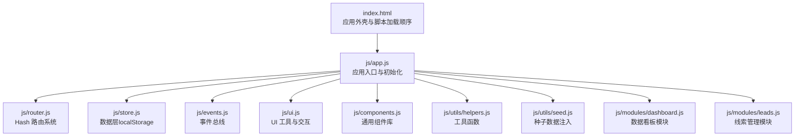
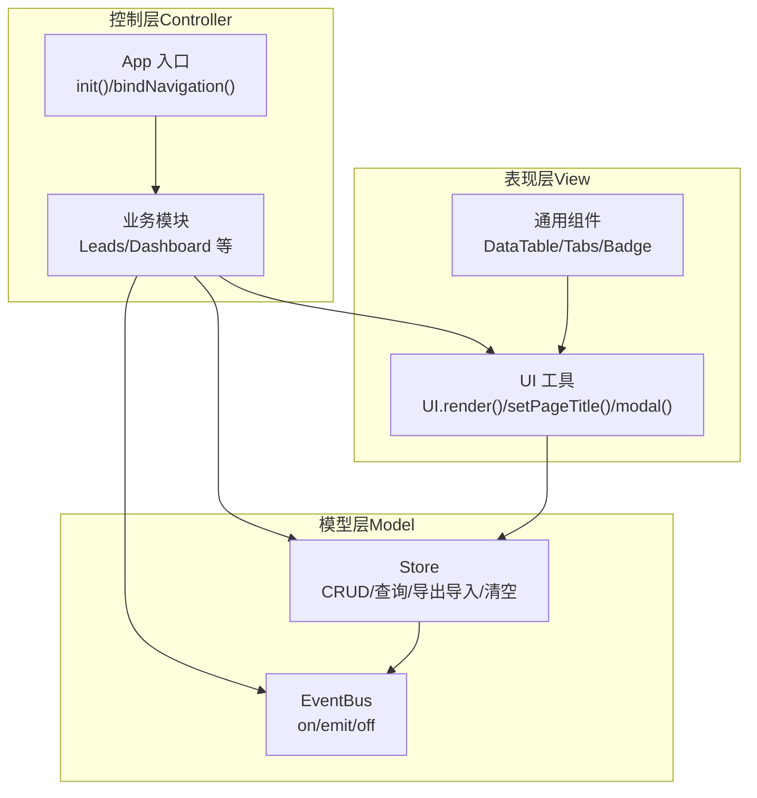
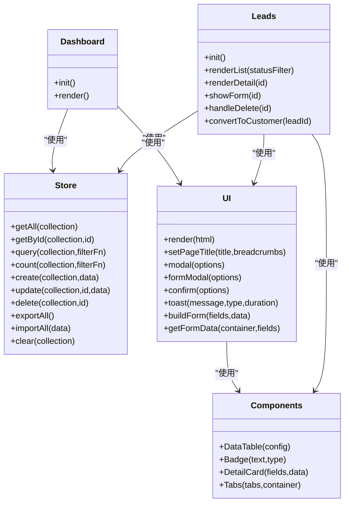
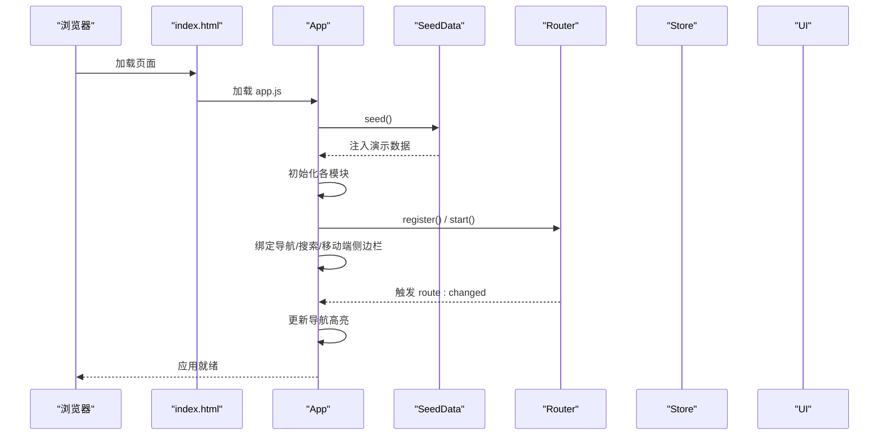
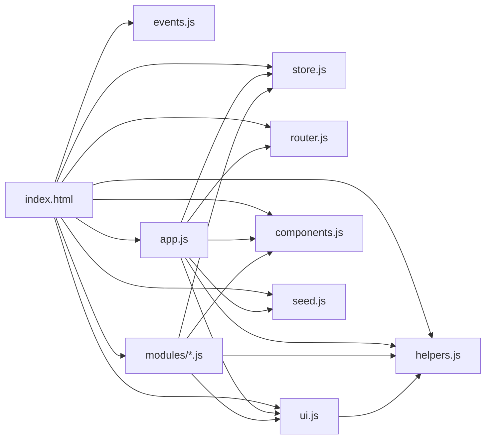

# 整体架构概览

<cite>
**本文档引用的文件**
- [index.html](file://index.html)
- [app.js](file://js/app.js)
- [router.js](file://js/router.js)
- [store.js](file://js/store.js)
- [events.js](file://js/events.js)
- [ui.js](file://js/ui.js)
- [helpers.js](file://js/utils/helpers.js)
- [seed.js](file://js/utils/seed.js)
- [components.js](file://js/components.js)
- [dashboard.js](file://js/modules/dashboard.js)
- [leads.js](file://js/modules/leads.js)
</cite>

## 目录
1. [引言](#引言)
2. [项目结构](#项目结构)
3. [核心组件](#核心组件)
4. [架构总览](#架构总览)
5. [详细组件分析](#详细组件分析)
6. [依赖关系分析](#依赖关系分析)
7. [性能考虑](#性能考虑)
8. [故障排查指南](#故障排查指南)
9. [结论](#结论)

## 引言
本文件为 CRM 系统的整体架构概览文档，面向开发者与产品人员，系统性阐述该系统的高层架构设计、MVC 分离实现、单页应用（SPA）理念与技术选型、启动流程与初始化过程、分层架构职责划分、核心设计原则与模式应用，并通过多种图示展示模块间交互关系与数据流。

## 项目结构
该项目采用“前端单页应用 + 本地持久化”的轻量架构，主要目录与文件如下：
- 根页面：index.html 提供应用外壳与资源引入顺序
- 核心入口：js/app.js 负责应用初始化、模块注册与事件绑定
- 路由系统：js/router.js 实现基于 hash 的 SPA 路由
- 数据层：js/store.js 基于 localStorage 的本地数据持久化
- 事件总线：js/events.js 提供模块间解耦通信
- UI 工具：js/ui.js 提供统一的 UI 组件与交互封装
- 通用工具：js/utils/helpers.js 提供格式化、防抖、ID 生成等工具
- 种子数据：js/utils/seed.js 在首次运行时注入演示数据
- 通用组件：js/components.js 提供可复用的 UI 组件（表格、标签页等）
- 功能模块：js/modules/*.js 实现业务模块（如 Leads、Dashboard 等）

图表来源
- [index.html:110-126](file://index.html#L110-L126)
- [app.js:1-41](file://js/app.js#L1-L41)
- [router.js:1-62](file://js/router.js#L1-L62)
- [store.js:1-139](file://js/store.js#L1-L139)
- [events.js:1-36](file://js/events.js#L1-L36)
- [ui.js:1-364](file://js/ui.js#L1-L364)
- [components.js:1-324](file://js/components.js#L1-L324)
- [helpers.js:1-113](file://js/utils/helpers.js#L1-L113)
- [seed.js:1-142](file://js/utils/seed.js#L1-L142)
- [dashboard.js:1-220](file://js/modules/dashboard.js#L1-L220)
- [leads.js:1-286](file://js/modules/leads.js#L1-L286)

章节来源
- [index.html:110-126](file://index.html#L110-L126)
- [app.js:1-41](file://js/app.js#L1-L41)

## 核心组件
- 应用入口与初始化：负责注入种子数据、初始化各模块、注册路由、绑定导航与搜索、启动路由、监听路由变化并更新导航高亮
- 路由系统：基于 hash 的轻量路由，支持参数匹配、编程式导航与 hashchange 监听
- 数据层：统一的数据访问接口，封装 localStorage 读写、缓存、增删改查、导出导入、清空等
- 事件总线：模块间解耦通信，支持通配符事件监听
- UI 工具：提供图标、Toast、模态框、表单构建与校验、面包屑与页面标题设置、内容渲染
- 通用组件：数据表格、状态标签、详情卡片、标签页等
- 通用工具：ID 生成、日期/金额格式化、防抖、截断、HTML 转义、颜色哈希、时间戳等
- 种子数据：首次运行时注入演示数据，包含产品、线索、客户、联系人、商机、订单、跟进记录

章节来源
- [app.js:1-41](file://js/app.js#L1-L41)
- [router.js:1-62](file://js/router.js#L1-L62)
- [store.js:1-139](file://js/store.js#L1-L139)
- [events.js:1-36](file://js/events.js#L1-L36)
- [ui.js:1-364](file://js/ui.js#L1-L364)
- [components.js:1-324](file://js/components.js#L1-L324)
- [helpers.js:1-113](file://js/utils/helpers.js#L1-L113)
- [seed.js:1-142](file://js/utils/seed.js#L1-L142)

## 架构总览
该系统采用“MVC 分离 + 事件驱动 + 组件化”的架构风格：
- Model：数据模型由 Store 抽象，统一管理各业务集合（线索、客户、联系人、商机、订单、跟进记录、产品），提供 CRUD 与查询能力
- View：由 UI 工具与通用组件组合，负责渲染页面结构、表格、表单、模态框等
- Controller：由各模块（如 Leads、Dashboard）承担，负责业务逻辑编排、路由响应、事件处理、与 Model/View 的协调
- 事件总线：用于模块间解耦通信，如数据变更广播、导入完成通知、路由变化通知等
- SPA 设计：基于 hash 的前端路由，页面无刷新切换，内容区域动态渲染

图表来源
- [app.js:1-41](file://js/app.js#L1-L41)
- [ui.js:1-364](file://js/ui.js#L1-L364)
- [components.js:1-324](file://js/components.js#L1-L324)
- [store.js:1-139](file://js/store.js#L1-L139)
- [events.js:1-36](file://js/events.js#L1-L36)
- [dashboard.js:1-220](file://js/modules/dashboard.js#L1-L220)
- [leads.js:1-286](file://js/modules/leads.js#L1-L286)

## 详细组件分析

### MVC 架构模式实现
- Model 层（Store）：集中管理数据集合，提供统一的增删改查、查询、计数、导出导入、清空等能力；内部使用 localStorage 作为持久化介质，并维护内存缓存以提升读取性能
- View 层（UI/Components）：通过 UI.render() 渲染页面内容，使用 DataTable、Tabs、Badge 等组件构建视图；提供表单构建与校验、模态框、Toast 等交互
- Controller 层（Modules/App）：各模块（如 Leads、Dashboard）负责业务逻辑与路由响应；App 负责应用初始化、导航绑定、全局搜索、移动端侧边栏、路由启动与导航高亮更新

图表来源
- [store.js:1-139](file://js/store.js#L1-L139)
- [ui.js:1-364](file://js/ui.js#L1-L364)
- [components.js:1-324](file://js/components.js#L1-L324)
- [leads.js:1-286](file://js/modules/leads.js#L1-L286)
- [dashboard.js:1-220](file://js/modules/dashboard.js#L1-L220)

章节来源
- [store.js:1-139](file://js/store.js#L1-L139)
- [ui.js:1-364](file://js/ui.js#L1-L364)
- [components.js:1-324](file://js/components.js#L1-L324)
- [leads.js:1-286](file://js/modules/leads.js#L1-L286)
- [dashboard.js:1-220](file://js/modules/dashboard.js#L1-L220)

### SPA 设计理念与技术选型
- 路由策略：采用 hash 路由，避免后端配置，适合静态部署与本地开发
- 页面切换：通过 Router.navigate() 改变 hash，触发路由解析与视图渲染，内容区域动态替换
- 交互体验：全局搜索、移动端侧边栏、面包屑、Toast、模态框等 UI 组件提升用户体验
- 数据持久化：localStorage 作为唯一后端，支持导出/导入/清空，便于演示与迁移

章节来源
- [router.js:1-62](file://js/router.js#L1-L62)
- [index.html:110-126](file://index.html#L110-L126)
- [ui.js:1-364](file://js/ui.js#L1-L364)

### 应用启动流程与初始化
- 资源加载顺序：events → helpers → store → router → ui → components → 各模块 → seed → app
- 初始化步骤：
  1) 注入种子数据（仅当 Store 为空时）
  2) 初始化各模块（Dashboard、Products、Leads、Customers、Contacts、Opportunities、Orders、FollowUps）
  3) 注册设置路由
  4) 绑定导航、全局搜索、移动端侧边栏
  5) 启动路由（监听 hashchange 并初始解析）
  6) 监听路由变化，更新导航高亮

图表来源
- [index.html:110-126](file://index.html#L110-L126)
- [app.js:1-41](file://js/app.js#L1-L41)
- [seed.js:1-142](file://js/utils/seed.js#L1-L142)
- [router.js:54-60](file://js/router.js#L54-L60)

章节来源
- [index.html:110-126](file://index.html#L110-L126)
- [app.js:1-41](file://js/app.js#L1-L41)

### 分层架构与职责划分
- 表现层（View）：负责页面渲染与用户交互，通过 UI 工具与通用组件实现
- 控制层（Controller）：模块负责业务编排与路由响应，App 负责全局初始化与事件绑定
- 模型层（Model）：Store 统一管理数据集合，提供 CRUD 与查询能力，并通过事件总线广播数据变更
- 基础设施层：EventBus 提供模块间解耦通信；Router 提供路由能力；Helpers 提供通用工具；Seed 提供演示数据

章节来源
- [ui.js:1-364](file://js/ui.js#L1-L364)
- [components.js:1-324](file://js/components.js#L1-L324)
- [store.js:1-139](file://js/store.js#L1-L139)
- [events.js:1-36](file://js/events.js#L1-L36)
- [router.js:1-62](file://js/router.js#L1-L62)
- [helpers.js:1-113](file://js/utils/helpers.js#L1-L113)
- [seed.js:1-142](file://js/utils/seed.js#L1-L142)

### 核心设计原则与设计模式
- 单一职责：每个模块专注于自身业务域，Store 专注数据，UI 专注界面，Router 专注路由
- 开闭原则：通过事件总线扩展模块间协作，无需修改既有模块
- 组件化：通用组件（DataTable、Tabs、Badge）提升复用性与一致性
- 事件驱动：数据变更通过 EventBus 广播，订阅者自动更新视图
- 防抖与缓存：搜索与列表渲染使用防抖与内存缓存优化性能

章节来源
- [events.js:1-36](file://js/events.js#L1-L36)
- [components.js:1-324](file://js/components.js#L1-L324)
- [helpers.js:63-70](file://js/utils/helpers.js#L63-L70)
- [store.js:8-30](file://js/store.js#L8-L30)

## 依赖关系分析
- 模块依赖：App 依赖 Router、Store、UI、Components、Helpers、Seed；各业务模块依赖 Store、UI、Components、Helpers；UI 依赖 Helpers；Router 与 EventBus 独立存在
- 运行时依赖：index.html 中的脚本加载顺序决定模块初始化顺序，必须先加载基础依赖再加载业务模块

图表来源
- [index.html:110-126](file://index.html#L110-L126)
- [app.js:1-41](file://js/app.js#L1-L41)
- [router.js:1-62](file://js/router.js#L1-L62)
- [store.js:1-139](file://js/store.js#L1-L139)
- [ui.js:1-364](file://js/ui.js#L1-L364)
- [components.js:1-324](file://js/components.js#L1-L324)
- [helpers.js:1-113](file://js/utils/helpers.js#L1-L113)
- [seed.js:1-142](file://js/utils/seed.js#L1-L142)

章节来源
- [index.html:110-126](file://index.html#L110-L126)
- [app.js:1-41](file://js/app.js#L1-L41)

## 性能考虑
- 内存缓存：Store 对集合进行内存缓存，减少重复解析 localStorage 的开销
- 防抖优化：全局搜索与表格搜索使用防抖，降低频繁计算与渲染压力
- 懒加载：模块按需初始化，避免一次性加载过多逻辑
- 本地存储：localStorage 读写为同步操作，建议控制单次写入数据量，避免阻塞主线程

章节来源
- [store.js:8-30](file://js/store.js#L8-L30)
- [helpers.js:63-70](file://js/utils/helpers.js#L63-L70)
- [app.js:70-140](file://js/app.js#L70-L140)

## 故障排查指南
- 数据异常：检查 Store 是否正确初始化与缓存；确认 localStorage 是否可用；必要时使用清空功能重置
- 路由不生效：确认 Router.start() 是否调用；检查 hashchange 事件是否正常触发；核对路由注册与参数匹配
- 搜索无结果：确认全局搜索输入框绑定与防抖逻辑；检查 Store 查询范围与字段映射
- UI 交互问题：检查 UI.render() 是否正确传入 HTML 或 DOM；确认事件绑定是否在渲染后执行
- 模态框/确认框：确认 UI.modal()/confirm() 参数与回调是否正确传递；注意 ESC 关闭与外部点击关闭逻辑

章节来源
- [store.js:1-139](file://js/store.js#L1-L139)
- [router.js:54-60](file://js/router.js#L54-L60)
- [app.js:63-160](file://js/app.js#L63-L160)
- [ui.js:80-162](file://js/ui.js#L80-L162)

## 结论
该 CRM 系统以“MVC 分离 + 事件驱动 + 组件化”为核心架构，结合 SPA 的 hash 路由与本地持久化，实现了清晰的职责划分与良好的可扩展性。通过统一的数据层、UI 工具与通用组件，系统在保证开发效率的同时，提供了良好的用户体验。建议后续可在以下方面持续演进：引入更完善的错误边界与日志记录、优化大数据量场景下的渲染性能、增强国际化与主题定制能力、完善单元测试与集成测试体系。