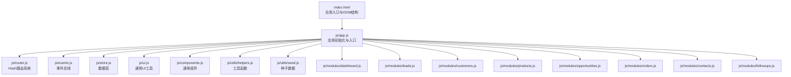
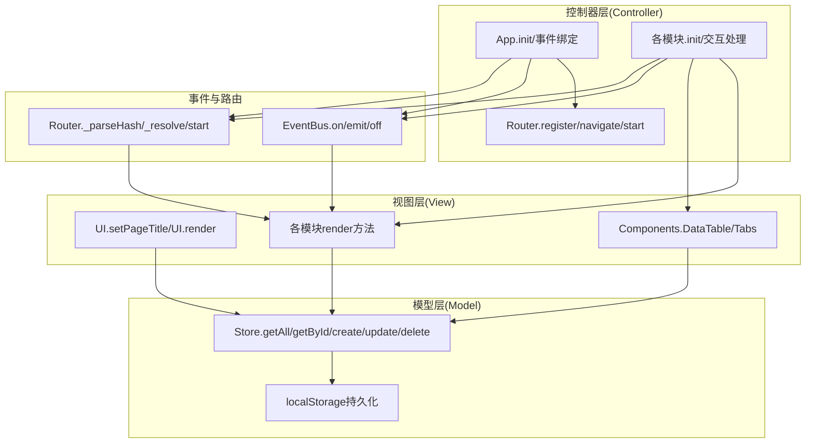
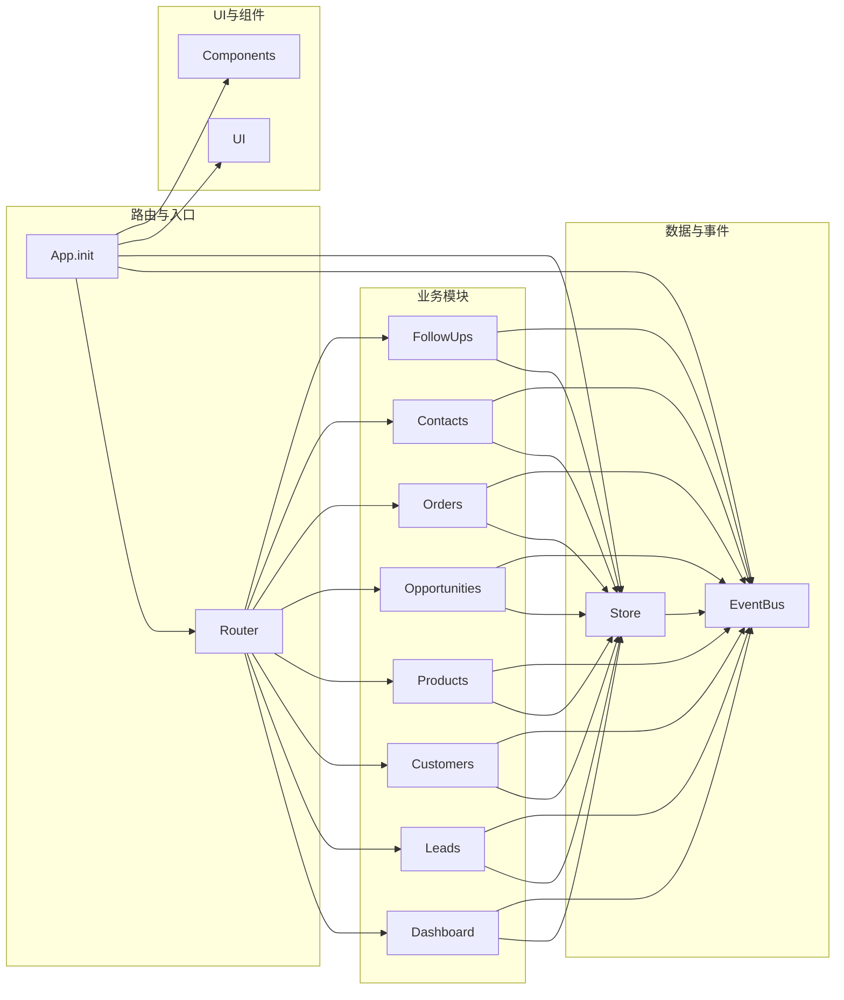
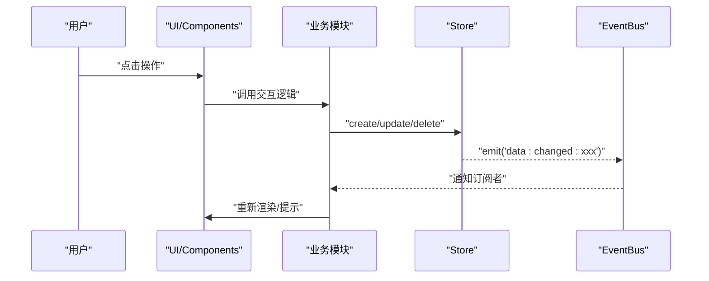
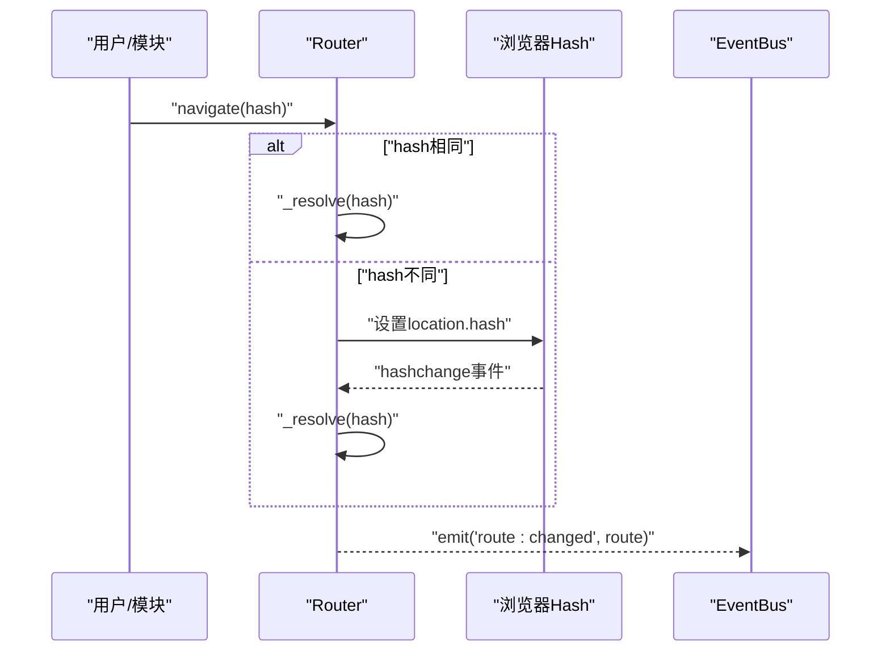
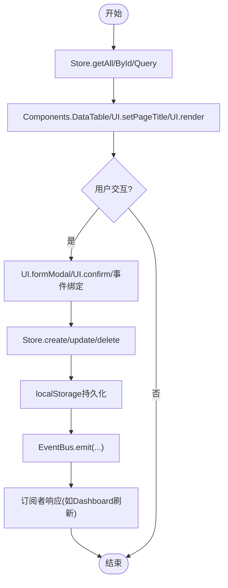
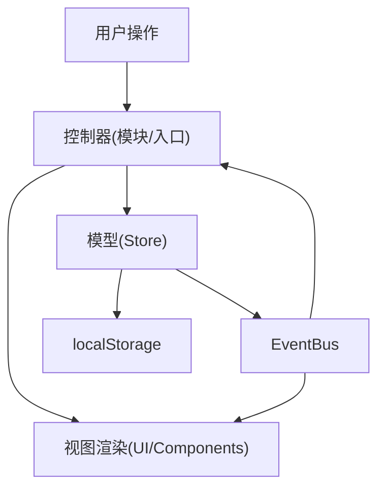
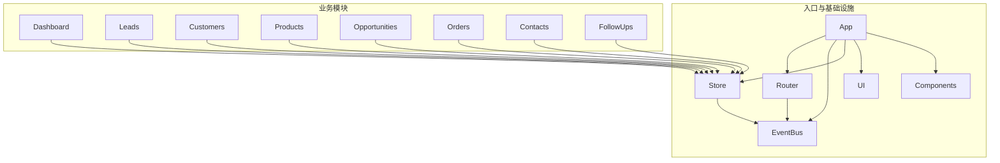

# 架构设计

<cite>
**本文引用的文件**
- [index.html](file://index.html)
- [app.js](file://js/app.js)
- [router.js](file://js/router.js)
- [events.js](file://js/events.js)
- [store.js](file://js/store.js)
- [components.js](file://js/components.js)
- [ui.js](file://js/ui.js)
- [helpers.js](file://js/utils/helpers.js)
- [seed.js](file://js/utils/seed.js)
- [dashboard.js](file://js/modules/dashboard.js)
- [leads.js](file://js/modules/leads.js)
- [customers.js](file://js/modules/customers.js)
- [products.js](file://js/modules/products.js)
- [opportunities.js](file://js/modules/opportunities.js)
- [orders.js](file://js/modules/orders.js)
- [contacts.js](file://js/modules/contacts.js)
- [followups.js](file://js/modules/followups.js)
</cite>

## 目录
1. [引言](#引言)
2. [项目结构](#项目结构)
3. [核心组件](#核心组件)
4. [架构总览](#架构总览)
5. [详细组件分析](#详细组件分析)
6. [依赖分析](#依赖分析)
7. [性能考虑](#性能考虑)
8. [故障排查指南](#故障排查指南)
9. [结论](#结论)
10. [附录](#附录)

## 引言
本文件面向CRM系统的架构设计与实现，围绕以下目标展开：
- 解释整体架构模式与MVC设计思想在项目中的落地方式（Model-View-Controller分离）。
- 描述模块化架构的设计理念与实现方式，梳理模块间依赖与通信机制。
- 阐述事件驱动架构的实现原理，包括EventBus的设计模式与发布-订阅机制。
- 解释单页应用（SPA）的路由体系，采用基于Hash的前端路由。
- 分析数据流向与组件交互模式，提供架构图与组件关系图。
- 讨论技术决策的权衡考虑与性能优化策略。

## 项目结构
该项目采用“前端单页应用 + 模块化组织”的结构，资源分为HTML模板、样式与脚本三部分。脚本层进一步细分为：
- 应用入口与初始化：app.js
- 路由系统：router.js
- 事件总线：events.js
- 数据层（本地持久化）：store.js
- 通用UI与组件：ui.js、components.js
- 工具函数：helpers.js
- 种子数据：seed.js
- 功能模块：modules 下的各业务模块（dashboard、leads、customers、products、opportunities、orders、contacts、followups）



图表来源
- [index.html](file://index.html)
- [app.js](file://js/app.js)
- [router.js](file://js/router.js)
- [events.js](file://js/events.js)
- [store.js](file://js/store.js)
- [ui.js](file://js/ui.js)
- [components.js](file://js/components.js)
- [helpers.js](file://js/utils/helpers.js)
- [seed.js](file://js/utils/seed.js)
- [dashboard.js](file://js/modules/dashboard.js)
- [leads.js](file://js/modules/leads.js)
- [customers.js](file://js/modules/customers.js)
- [products.js](file://js/modules/products.js)
- [opportunities.js](file://js/modules/opportunities.js)
- [orders.js](file://js/modules/orders.js)
- [contacts.js](file://js/modules/contacts.js)
- [followups.js](file://js/modules/followups.js)

章节来源
- [index.html](file://index.html)
- [app.js](file://js/app.js)

## 核心组件
- 应用入口与初始化（App）
  - 负责注入种子数据、初始化各模块、注册路由、绑定导航与搜索、启动路由、监听路由变化并更新导航高亮。
- 路由系统（Router）
  - 基于Hash的前端路由，支持路径参数解析、编程式导航、初始加载与hashchange事件监听。
- 事件总线（EventBus）
  - 发布-订阅模式，支持通配符事件，用于模块间解耦通信。
- 数据层（Store）
  - 以localStorage为持久化介质，提供集合的增删改查、导出/导入、清空、缓存与变更广播。
- 通用UI与组件（UI、Components）
  - 提供Toast、模态框、确认框、表单构建、通用数据表格、标签页等能力。
- 工具函数（Helpers）
  - 提供ID生成、日期/金额格式化、防抖、截断、HTML转义、颜色哈希、订单号生成等。
- 种子数据（SeedData）
  - 首次运行时注入演示数据，建立产品、线索、客户、联系人、商机、订单、跟进记录之间的关联。
- 功能模块（Modules）
  - dashboard、leads、customers、products、opportunities、orders、contacts、followups，每个模块负责自身视图渲染、数据查询与交互逻辑，并通过Store与EventBus与系统其他部分协作。

章节来源
- [app.js](file://js/app.js)
- [router.js](file://js/router.js)
- [events.js](file://js/events.js)
- [store.js](file://js/store.js)
- [ui.js](file://js/ui.js)
- [components.js](file://js/components.js)
- [helpers.js](file://js/utils/helpers.js)
- [seed.js](file://js/utils/seed.js)

## 架构总览
该系统采用“前端单页应用 + 模块化 + 事件驱动 + MVC分层”的混合架构：
- 视图层（View）：由各模块的render方法输出DOM，UI与Components提供通用UI能力。
- 控制器层（Controller）：各模块的init与交互处理逻辑承担控制器职责；App作为顶层控制器协调模块初始化与导航。
- 模型层（Model）：Store封装数据访问与持久化，提供统一的数据API。
- 事件驱动：EventBus实现跨模块解耦通信，如数据变更广播、路由变化通知等。
- 路由系统：Router负责URL与视图的映射，支持参数化路由与编程式导航。



图表来源
- [app.js](file://js/app.js)
- [router.js](file://js/router.js)
- [events.js](file://js/events.js)
- [store.js](file://js/store.js)
- [ui.js](file://js/ui.js)
- [components.js](file://js/components.js)
- [dashboard.js](file://js/modules/dashboard.js)
- [leads.js](file://js/modules/leads.js)
- [customers.js](file://js/modules/customers.js)
- [products.js](file://js/modules/products.js)
- [opportunities.js](file://js/modules/opportunities.js)
- [orders.js](file://js/modules/orders.js)
- [contacts.js](file://js/modules/contacts.js)
- [followups.js](file://js/modules/followups.js)

## 详细组件分析

### MVC 设计模式实现
- Model（Store）
  - 统一的数据访问接口，封装localStorage读写与缓存，提供create/update/delete/query/count等方法，并在变更时通过EventBus广播事件。
- View（各模块render与UI/Components）
  - 各模块通过UI.setPageTitle/UI.render输出页面，使用Components.DataTable/Tabs等通用组件渲染表格、筛选、排序、分页与标签页。
- Controller（App与各模块）
  - App负责顶层初始化、路由注册、导航绑定与事件监听；各模块负责自身路由注册、交互事件绑定与数据处理。

```mermaid
classDiagram
class Store {
+getAll(collection)
+getById(collection,id)
+create(collection,data)
+update(collection,id,data)
+delete(collection,id)
+exportAll()
+importAll(data)
+clear(collection?)
}
class EventBus {
+on(event, callback)
+off(event, callback)
+emit(event, ...args)
+clear()
}
class Router {
+register(pattern, handler)
+navigate(hash)
+current()
+start()
}
class UI {
+setPageTitle(title,breadcrumbs)
+render(html)
+toast(message,type,duration)
+modal(options)
+confirm(options)
+formModal(options)
+buildForm(fields,data)
+getFormData(container,fields)
}
class Components {
+DataTable(options)
+Badge(text,type)
+DetailCard(fields,data)
+Tabs(tabs,container)
}
class App {
+init()
+bindNavigation()
+updateActiveNav(hash)
+bindGlobalSearch()
+bindMobileSidebar()
+renderSettings()
}
App --> Router : "注册路由/启动"
App --> EventBus : "监听路由变化"
App --> UI : "渲染页面/弹窗"
App --> Store : "数据读取/导出"
App --> Components : "通用组件"
Router --> EventBus : "emit('route : changed')"
Store --> EventBus : "emit('data : changed : *')"
```

图表来源
- [store.js](file://js/store.js)
- [events.js](file://js/events.js)
- [router.js](file://js/router.js)
- [ui.js](file://js/ui.js)
- [components.js](file://js/components.js)
- [app.js](file://js/app.js)

章节来源
- [store.js](file://js/store.js)
- [events.js](file://js/events.js)
- [router.js](file://js/router.js)
- [ui.js](file://js/ui.js)
- [components.js](file://js/components.js)
- [app.js](file://js/app.js)

### 模块化架构与依赖关系
- 模块划分
  - dashboard、leads、customers、products、opportunities、orders、contacts、followups各自独立，通过Router注册路由，通过Store访问数据，通过UI/Components渲染视图。
- 依赖与通信
  - 模块间通过EventBus进行松耦合通信（如Dashboard监听数据变更自动刷新）。
  - 模块间导航通过Router.navigate进行，避免直接依赖。
  - 共享UI能力通过UI与Components提供，避免重复实现。



图表来源
- [app.js](file://js/app.js)
- [router.js](file://js/router.js)
- [events.js](file://js/events.js)
- [store.js](file://js/store.js)
- [ui.js](file://js/ui.js)
- [components.js](file://js/components.js)
- [dashboard.js](file://js/modules/dashboard.js)
- [leads.js](file://js/modules/leads.js)
- [customers.js](file://js/modules/customers.js)
- [products.js](file://js/modules/products.js)
- [opportunities.js](file://js/modules/opportunities.js)
- [orders.js](file://js/modules/orders.js)
- [contacts.js](file://js/modules/contacts.js)
- [followups.js](file://js/modules/followups.js)

章节来源
- [dashboard.js](file://js/modules/dashboard.js)
- [leads.js](file://js/modules/leads.js)
- [customers.js](file://js/modules/customers.js)
- [products.js](file://js/modules/products.js)
- [opportunities.js](file://js/modules/opportunities.js)
- [orders.js](file://js/modules/orders.js)
- [contacts.js](file://js/modules/contacts.js)
- [followups.js](file://js/modules/followups.js)

### 事件驱动架构与发布-订阅机制
- EventBus实现
  - 支持事件注册、移除、发布与通配符事件（如"data:changed:*"），便于模块订阅特定集合或任意集合的变更。
- 使用场景
  - Store在create/update/delete后通过EventBus广播事件，各模块可订阅以实现响应式更新（如Dashboard监听数据变更自动刷新）。
  - Router在路由切换后通过EventBus发出"route:changed"，App据此更新导航高亮。
- 优点
  - 降低模块间耦合，提升扩展性与可维护性。
- 注意
  - 需要合理管理订阅生命周期，避免内存泄漏。



图表来源
- [events.js](file://js/events.js)
- [store.js](file://js/store.js)
- [dashboard.js](file://js/modules/dashboard.js)

章节来源
- [events.js](file://js/events.js)
- [store.js](file://js/store.js)
- [dashboard.js](file://js/modules/dashboard.js)

### 单页应用与基于Hash的路由系统
- 路由注册与解析
  - Router.register支持路径参数占位符，内部转换为正则匹配；_resolve根据当前hash匹配处理器并执行。
- 编程式导航
  - Router.navigate支持相同hash的手动触发，否则通过window.location.hash跳转。
- 生命周期
  - Router.start监听hashchange并初始化加载，确保首次进入也能正确渲染对应视图。
- 与事件总线结合
  - 路由切换后通过EventBus.emit("route:changed")通知App更新导航高亮。



图表来源
- [router.js](file://js/router.js)
- [events.js](file://js/events.js)
- [app.js](file://js/app.js)

章节来源
- [router.js](file://js/router.js)
- [events.js](file://js/events.js)
- [app.js](file://js/app.js)

### 数据流向与组件交互
- 数据流
  - Store.getAll/getById/query等读取数据，create/update/delete写入数据并持久化，同时通过EventBus广播变更。
- 组件交互
  - Components.DataTable封装搜索、筛选、排序、分页与行点击/操作按钮事件，通过Helpers.debounce优化输入体验。
  - UI提供Toast、模态框、确认框、表单构建等通用能力，减少重复逻辑。
- 模块内交互
  - 各模块通过Router.navigate在模块内进行详情/列表切换，或跳转到其他模块。
  - 通过UI.confirm/UI.formModal等弹窗组件实现二次确认与表单提交。



图表来源
- [store.js](file://js/store.js)
- [components.js](file://js/components.js)
- [ui.js](file://js/ui.js)
- [dashboard.js](file://js/modules/dashboard.js)

章节来源
- [store.js](file://js/store.js)
- [components.js](file://js/components.js)
- [ui.js](file://js/ui.js)
- [dashboard.js](file://js/modules/dashboard.js)

### 概念性总览
以下为概念性流程图，展示从用户操作到数据持久化的整体过程，帮助理解MVC与事件驱动的协同工作方式。



## 依赖分析
- 模块内依赖
  - 各模块均依赖Store、UI、Components、Router、EventBus，形成清晰的分层依赖。
- 外部依赖
  - 无第三方库，完全基于原生JavaScript与浏览器API。
- 耦合与内聚
  - 通过EventBus与Router降低模块间耦合；Store提供统一数据入口，提高内聚性。
- 潜在风险
  - 由于无类型约束，建议引入静态检查工具（如ESLint）以提升可维护性。



图表来源
- [app.js](file://js/app.js)
- [router.js](file://js/router.js)
- [events.js](file://js/events.js)
- [store.js](file://js/store.js)
- [ui.js](file://js/ui.js)
- [components.js](file://js/components.js)
- [dashboard.js](file://js/modules/dashboard.js)
- [leads.js](file://js/modules/leads.js)
- [customers.js](file://js/modules/customers.js)
- [products.js](file://js/modules/products.js)
- [opportunities.js](file://js/modules/opportunities.js)
- [orders.js](file://js/modules/orders.js)
- [contacts.js](file://js/modules/contacts.js)
- [followups.js](file://js/modules/followups.js)

章节来源
- [app.js](file://js/app.js)
- [store.js](file://js/store.js)
- [router.js](file://js/router.js)
- [events.js](file://js/events.js)
- [ui.js](file://js/ui.js)
- [components.js](file://js/components.js)
- [dashboard.js](file://js/modules/dashboard.js)
- [leads.js](file://js/modules/leads.js)
- [customers.js](file://js/modules/customers.js)
- [products.js](file://js/modules/products.js)
- [opportunities.js](file://js/modules/opportunities.js)
- [orders.js](file://js/modules/orders.js)
- [contacts.js](file://js/modules/contacts.js)
- [followups.js](file://js/modules/followups.js)

## 性能考虑
- 渲染性能
  - Components.DataTable内置防抖搜索（Helpers.debounce），减少频繁重渲染。
  - 分页与排序在客户端完成，建议在数据量较大时考虑虚拟滚动或服务端分页。
- 存储与缓存
  - Store对集合进行内存缓存，避免频繁localStorage读取；但localStorage容量有限，建议控制单页数据量或拆分集合。
- 事件风暴
  - 大批量数据变更可能引发多次EventBus.emit，建议在高频场景下合并事件或节流。
- 路由切换
  - Router通过hashchange触发，避免整页刷新；建议在复杂视图中延迟渲染非首屏内容以提升首屏速度。

## 故障排查指南
- 路由不生效或循环跳转
  - 检查Router.register的pattern是否正确，以及navigate是否传入相同hash导致重复解析。
- 数据未更新或未持久化
  - 确认Store.create/update/delete返回值与localStorage写入是否成功；关注存储空间不足的错误提示。
- 事件未触发
  - 检查EventBus.on订阅是否正确，通配符事件是否按约定命名（如"data:changed:*"）。
- UI弹窗/确认框异常
  - 确认UI.modal/UI.confirm的调用参数与DOM挂载时机，避免重复创建或未清理。

章节来源
- [router.js](file://js/router.js)
- [store.js](file://js/store.js)
- [events.js](file://js/events.js)
- [ui.js](file://js/ui.js)

## 结论
本CRM系统通过“前端单页应用 + 模块化 + 事件驱动 + MVC分层”的架构，在无第三方依赖的前提下实现了清晰的职责分离与良好的扩展性。基于Hash的路由系统与EventBus使模块间通信解耦，Store统一数据访问与持久化，UI/Components提供一致的交互体验。未来可在类型检查、虚拟滚动、服务端分页与性能监控等方面进一步优化。

## 附录
- 技术选型权衡
  - 采用原生JS与localStorage，简化部署与学习成本，适合中小型团队与演示场景；若需更强一致性与并发控制，可考虑引入IndexedDB或服务端数据库。
- 最佳实践建议
  - 对高频交互使用防抖/节流；对大数据集采用分页/懒加载；对复杂表单引入校验与必填提示；对关键事件增加日志埋点以便追踪。