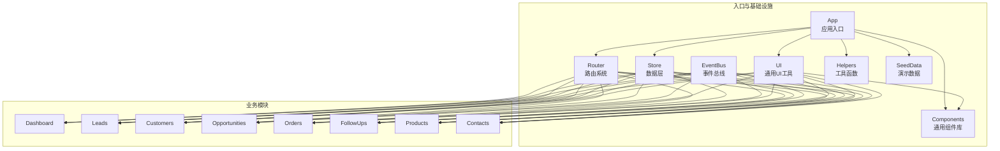
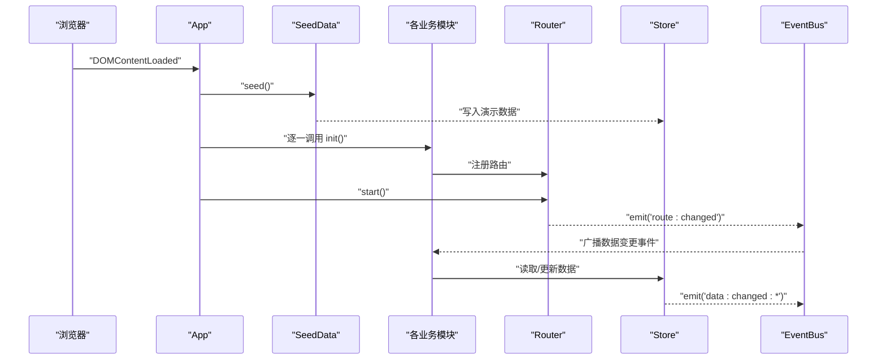
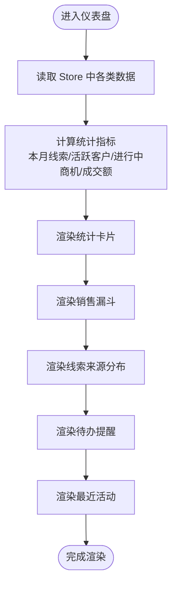
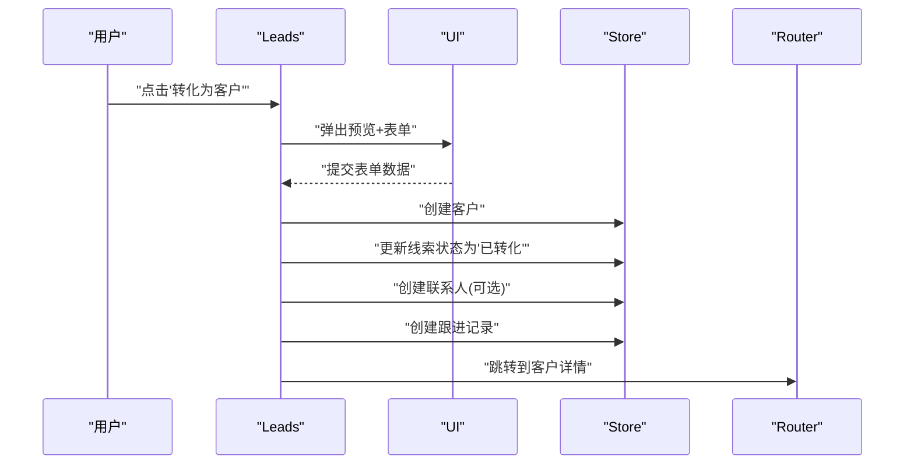
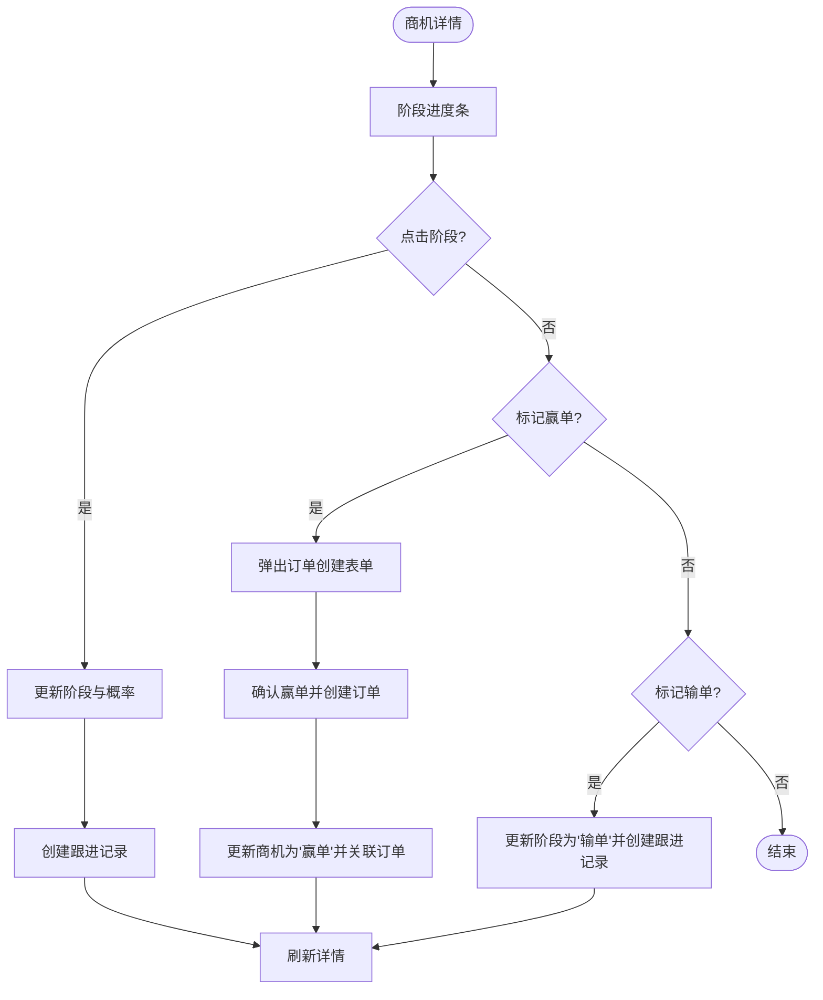
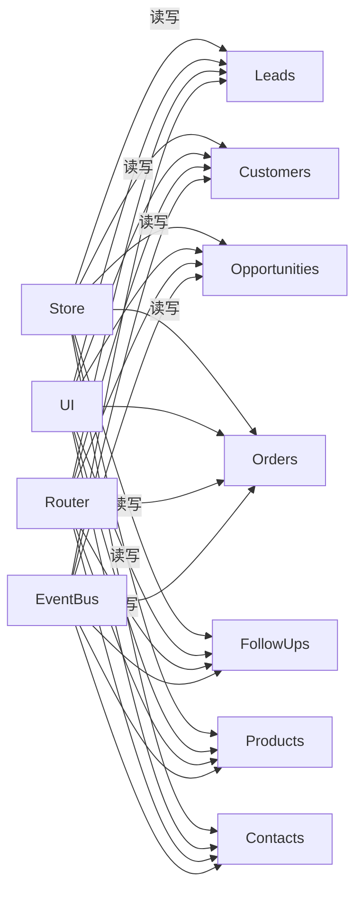

# 模块化设计

<cite>
**本文档引用的文件**
- [js/app.js](file://js/app.js)
- [js/router.js](file://js/router.js)
- [js/store.js](file://js/store.js)
- [js/events.js](file://js/events.js)
- [js/ui.js](file://js/ui.js)
- [js/components.js](file://js/components.js)
- [js/modules/dashboard.js](file://js/modules/dashboard.js)
- [js/modules/leads.js](file://js/modules/leads.js)
- [js/modules/customers.js](file://js/modules/customers.js)
- [js/modules/opportunities.js](file://js/modules/opportunities.js)
- [js/modules/orders.js](file://js/modules/orders.js)
- [js/modules/followups.js](file://js/modules/followups.js)
- [js/modules/products.js](file://js/modules/products.js)
- [js/modules/contacts.js](file://js/modules/contacts.js)
- [js/utils/helpers.js](file://js/utils/helpers.js)
- [js/utils/seed.js](file://js/utils/seed.js)
</cite>

## 目录
1. [引言](#引言)
2. [项目结构](#项目结构)
3. [核心组件](#核心组件)
4. [架构总览](#架构总览)
5. [详细组件分析](#详细组件分析)
6. [依赖分析](#依赖分析)
7. [性能考量](#性能考量)
8. [故障排查指南](#故障排查指南)
9. [结论](#结论)
10. [附录](#附录)

## 引言
本文件面向CRM系统的模块化设计，系统性阐述模块化架构的理念、实现方式与边界划分，解释模块间的依赖关系与通信机制，并给出模块初始化顺序与生命周期管理策略。文档同时分析各业务模块（Dashboard、Leads、Customers、Opportunities、Orders、FollowUps、Contacts、Products）的结构设计与实现模式，说明模块注册与加载机制、数据共享与状态同步策略，并提供模块关系图与依赖分析，总结模块化设计的优势与扩展性考虑。

## 项目结构
项目采用“按功能域分模块”的组织方式，前端代码位于 js/ 目录下，核心入口为 app.js；路由系统由 Router 统一管理；数据持久化通过 Store 抽象；事件总线 EventBus 提供跨模块解耦通信；UI 组件与通用工具分别封装在 ui.js、components.js 和 utils 下；业务模块集中在 js/modules/ 目录中，每个模块负责一个独立的业务领域。

图表来源
- [js/app.js:1-41](file://js/app.js#L1-L41)
- [js/router.js:1-62](file://js/router.js#L1-L62)
- [js/store.js:1-139](file://js/store.js#L1-L139)
- [js/events.js:1-36](file://js/events.js#L1-L36)
- [js/ui.js:1-364](file://js/ui.js#L1-L364)
- [js/components.js:1-324](file://js/components.js#L1-L324)
- [js/utils/helpers.js:1-113](file://js/utils/helpers.js#L1-L113)
- [js/utils/seed.js:1-142](file://js/utils/seed.js#L1-L142)

章节来源
- [js/app.js:1-41](file://js/app.js#L1-L41)
- [js/router.js:1-62](file://js/router.js#L1-L62)
- [js/store.js:1-139](file://js/store.js#L1-L139)
- [js/events.js:1-36](file://js/events.js#L1-L36)
- [js/ui.js:1-364](file://js/ui.js#L1-L364)
- [js/components.js:1-324](file://js/components.js#L1-L324)
- [js/utils/helpers.js:1-113](file://js/utils/helpers.js#L1-L113)
- [js/utils/seed.js:1-142](file://js/utils/seed.js#L1-L142)

## 核心组件
- 应用入口 App：负责初始化种子数据、启动各模块、注册设置路由、绑定导航与搜索、启动路由与事件监听。
- 路由系统 Router：基于 hash 的轻量路由，支持动态参数解析与事件广播。
- 数据层 Store：统一的数据持久化抽象，基于 localStorage，提供 CRUD、查询、计数、导入导出与缓存。
- 事件总线 EventBus：发布订阅模式，支持通配符事件，用于模块间解耦通信。
- 通用UI UI：提供图标、Toast、模态框、确认框、表单构建与渲染等能力。
- 通用组件 Components：提供数据表格、状态标签、详情卡片、标签页等可复用UI组件。
- 工具函数 Helpers：提供ID生成、日期格式化、金额格式化、防抖、截断、HTML转义、颜色哈希、订单号生成等。
- 演示数据 SeedData：在无数据时注入演示数据，支撑初始体验。

章节来源
- [js/app.js:1-41](file://js/app.js#L1-L41)
- [js/router.js:1-62](file://js/router.js#L1-L62)
- [js/store.js:1-139](file://js/store.js#L1-L139)
- [js/events.js:1-36](file://js/events.js#L1-L36)
- [js/ui.js:1-364](file://js/ui.js#L1-L364)
- [js/components.js:1-324](file://js/components.js#L1-L324)
- [js/utils/helpers.js:1-113](file://js/utils/helpers.js#L1-L113)
- [js/utils/seed.js:1-142](file://js/utils/seed.js#L1-L142)

## 架构总览
系统采用“入口集中初始化 + 模块自治 + 事件驱动 + 统一数据层”的架构模式。App 在启动时初始化种子数据并逐一调用各模块的 init 方法完成路由注册；Router 负责页面导航与事件广播；Store 提供统一的数据访问与变更通知；EventBus 实现模块间松耦合通信；UI 与 Components 提供一致的交互与展示能力。

图表来源
- [js/app.js:6-41](file://js/app.js#L6-L41)
- [js/utils/seed.js:10-134](file://js/utils/seed.js#L10-L134)
- [js/router.js:54-60](file://js/router.js#L54-L60)
- [js/store.js:65-96](file://js/store.js#L65-L96)
- [js/events.js:18-30](file://js/events.js#L18-L30)

## 详细组件分析

### Dashboard 模块
- 职责：展示销售数据概览、统计卡片、销售漏斗、线索来源分布、待办提醒与最近活动。
- 边界：仅消费 Store 数据并渲染，不直接修改数据；通过 Router 与 UI 进行交互。
- 生命周期：init 注册路由；监听数据变更事件并在当前路由为仪表盘时自动刷新。
- 关键点：统计计算、图表渲染、待办提醒逻辑、最近活动时间线。

图表来源
- [js/modules/dashboard.js:6-209](file://js/modules/dashboard.js#L6-L209)

章节来源
- [js/modules/dashboard.js:1-220](file://js/modules/dashboard.js#L1-L220)

### Leads 模块
- 职责：线索的增删改查、状态管理、线索转客户流程、与跟进记录联动。
- 边界：FIELDS 定义表单字段，STATUS_MAP/SOURCE_MAP 定义UI映射；通过 UI.formModal 与 Router 导航。
- 生命周期：init 注册列表与详情路由；提供列表过滤、搜索、排序与行点击跳转。
- 关键点：线索转客户（创建客户、更新线索状态、创建联系人、生成跟进记录）、详情页标签页与跟进时间线。

图表来源
- [js/modules/leads.js:198-279](file://js/modules/leads.js#L198-L279)

章节来源
- [js/modules/leads.js:1-286](file://js/modules/leads.js#L1-L286)

### Customers 模块
- 职责：客户信息管理、客户详情页聚合（联系人、商机、订单、跟进记录）。
- 边界：STATUS_MAP 映射状态；通过 UI.Tabs 在详情页内嵌多个子视图。
- 生命周期：init 注册列表与详情路由；详情页根据标签切换渲染不同子列表。
- 关键点：与 Contacts、Opportunities、Orders、FollowUps 的数据关联与导航跳转。

章节来源
- [js/modules/customers.js:1-229](file://js/modules/customers.js#L1-L229)

### Opportunities 模块
- 职责：商机全生命周期管理（阶段推进、赢单/输单、与订单关联）。
- 边界：STAGES/STAGE_PROB/STAGE_TYPE 定义阶段与概率；通过 UI.formModal 与 UI.modal 构建复杂表单。
- 生命周期：init 注册列表与详情路由；详情页支持阶段点击推进与阶段进度条。
- 关键点：赢单流程（创建订单、更新商机状态与关联、生成跟进记录）、与 Orders 的双向关联。

图表来源
- [js/modules/opportunities.js:137-237](file://js/modules/opportunities.js#L137-L237)
- [js/modules/opportunities.js:303-462](file://js/modules/opportunities.js#L303-L462)

章节来源
- [js/modules/opportunities.js:1-485](file://js/modules/opportunities.js#L1-L485)

### Orders 模块
- 职责：订单管理（状态流转、明细展示、与商机/客户的关联）。
- 边界：STATUS_MAP 定义状态映射；通过 UI.formModal 与 Components.DataTable 渲染。
- 生命周期：init 注册列表与详情路由；详情页展示订单明细与合计。
- 关键点：与 Customers、Opportunities 的关联展示与导航跳转。

章节来源
- [js/modules/orders.js:1-234](file://js/modules/orders.js#L1-L234)

### FollowUps 模块
- 职责：跟进记录的创建、列表展示与时间线渲染。
- 边界：TYPE_MAP 定义跟进方式映射；支持在详情页内嵌时间线。
- 生命周期：init 注册列表路由；支持动态选择关联类型与对象。
- 关键点：时间线渲染、内嵌添加跟进、关联对象跳转。

章节来源
- [js/modules/followups.js:1-189](file://js/modules/followups.js#L1-L189)

### Products 模块
- 职责：产品目录管理（分类、价格、状态、描述）。
- 边界：STATUS_MAP 定义状态映射；通过 Components.DataTable 渲染。
- 生命周期：init 注册列表与详情路由；支持点击产品名称跳转详情。
- 关键点：产品列表搜索与排序、详情页基本信息展示。

章节来源
- [js/modules/products.js:1-175](file://js/modules/products.js#L1-L175)

### Contacts 模块
- 职责：联系人管理（与客户关联、主联系人标识）。
- 边界：通过 renderSubList 在客户详情页内嵌联系人子列表。
- 生命周期：init 注册列表路由；支持在客户详情页直接添加/编辑/删除联系人。
- 关键点：主联系人标识、与客户详情页的联动。

章节来源
- [js/modules/contacts.js:1-185](file://js/modules/contacts.js#L1-L185)

## 依赖分析
- 模块耦合与内聚
  - 模块内部高内聚：每个模块聚焦单一业务域，职责清晰。
  - 模块间低耦合：通过 Store 与 EventBus 解耦，避免直接互相调用。
- 直接依赖
  - 所有模块均依赖 Store（读取/写入数据）、Router（导航）、UI/Components（UI能力）。
  - 业务模块之间存在数据依赖（如 Opportunities 依赖 Customers、Orders；Leads 依赖 Customers/Contacts/FollowUps）。
- 外部依赖
  - 浏览器环境（localStorage、DOM API、hashchange 事件）。
- 事件链路
  - Store 变更通过 EventBus 广播，模块监听后刷新视图或跳转路由。

图表来源
- [js/store.js:1-139](file://js/store.js#L1-L139)
- [js/ui.js:1-364](file://js/ui.js#L1-L364)
- [js/router.js:1-62](file://js/router.js#L1-L62)
- [js/events.js:1-36](file://js/events.js#L1-L36)

章节来源
- [js/store.js:1-139](file://js/store.js#L1-L139)
- [js/events.js:1-36](file://js/events.js#L1-L36)

## 性能考量
- 数据访问优化
  - Store 使用内存缓存（_cache）减少重复读取 localStorage 的开销。
  - 对大数据量列表采用前端分页与排序，避免一次性渲染过多节点。
- 事件与渲染
  - EventBus 事件广播应避免过于频繁的高频触发，建议在模块内部合并或节流。
  - 页面切换与刷新尽量按需渲染，避免不必要的 DOM 操作。
- 用户体验
  - 搜索与筛选采用防抖（Helpers.debounce），降低输入时的计算压力。
  - 大型表单与模态框采用延迟渲染与事件委托，提升交互流畅度。

## 故障排查指南
- 数据无法持久化
  - 检查 localStorage 是否可用；Store 在保存失败时会发出错误提示并弹出 Toast。
- 路由不生效
  - 确认模块已调用 init 注册路由；检查 Router.start 是否执行；核对 hash 值是否正确。
- 模块间状态未同步
  - 确认 Store 变更是否触发 EventBus 事件；检查模块是否监听对应事件并刷新视图。
- 表单校验失败
  - 检查 UI.getFormData 的返回值；确保必填字段已填写且格式正确。
- 演示数据未注入
  - 确认 SeedData.shouldSeed 判断逻辑；首次运行时 Store 应为空。

章节来源
- [js/store.js:23-30](file://js/store.js#L23-L30)
- [js/router.js:54-60](file://js/router.js#L54-L60)
- [js/events.js:18-30](file://js/events.js#L18-L30)
- [js/ui.js:276-316](file://js/ui.js#L276-L316)
- [js/utils/seed.js:6-8](file://js/utils/seed.js#L6-L8)

## 结论
该CRM系统通过模块化设计实现了清晰的职责划分与良好的扩展性。入口集中初始化、路由统一管理、数据层抽象与事件总线解耦，使得各业务模块既独立又协同。模块间通过 Store 与 EventBus 进行数据共享与状态同步，具备较强的可维护性与可演进性。未来可在以下方面进一步增强：引入更细粒度的模块间契约（接口）、增加单元测试覆盖、对高频事件进行节流与批处理、完善错误边界与降级策略。

## 附录
- 模块初始化顺序
  - App.init → SeedData.seed → 各模块 init（Dashboard、Products、Leads、Customers、Contacts、Opportunities、Orders、FollowUps）
- 模块注册与加载机制
  - 每个模块在 init 中调用 Router.register 注册路由；Router.start 后响应 hashchange 并触发相应模块渲染。
- 数据共享与状态同步
  - Store 提供统一 CRUD 与查询；EventBus 广播数据变更事件；模块监听后刷新视图或导航。

章节来源
- [js/app.js:6-41](file://js/app.js#L6-L41)
- [js/modules/dashboard.js:211-218](file://js/modules/dashboard.js#L211-L218)
- [js/modules/leads.js:281-284](file://js/modules/leads.js#L281-L284)
- [js/modules/customers.js:224-227](file://js/modules/customers.js#L224-L227)
- [js/modules/opportunities.js:480-483](file://js/modules/opportunities.js#L480-L483)
- [js/modules/orders.js:229-232](file://js/modules/orders.js#L229-L232)
- [js/modules/followups.js:185-187](file://js/modules/followups.js#L185-L187)
- [js/modules/products.js:170-173](file://js/modules/products.js#L170-L173)
- [js/modules/contacts.js:181-183](file://js/modules/contacts.js#L181-L183)