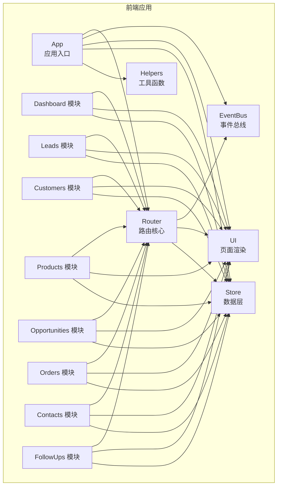
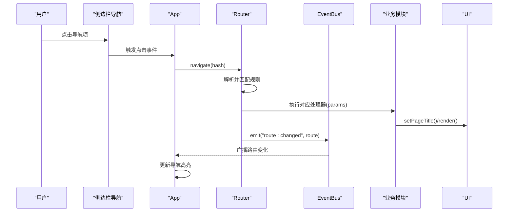
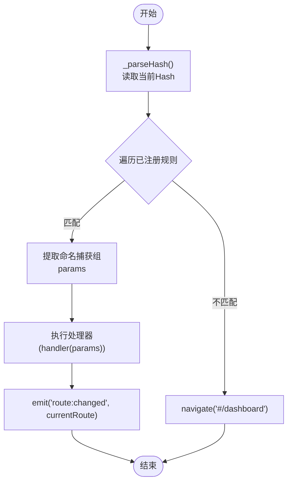
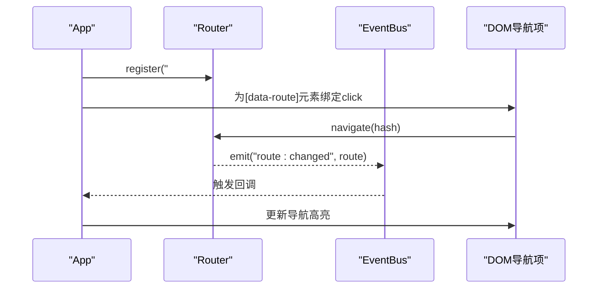
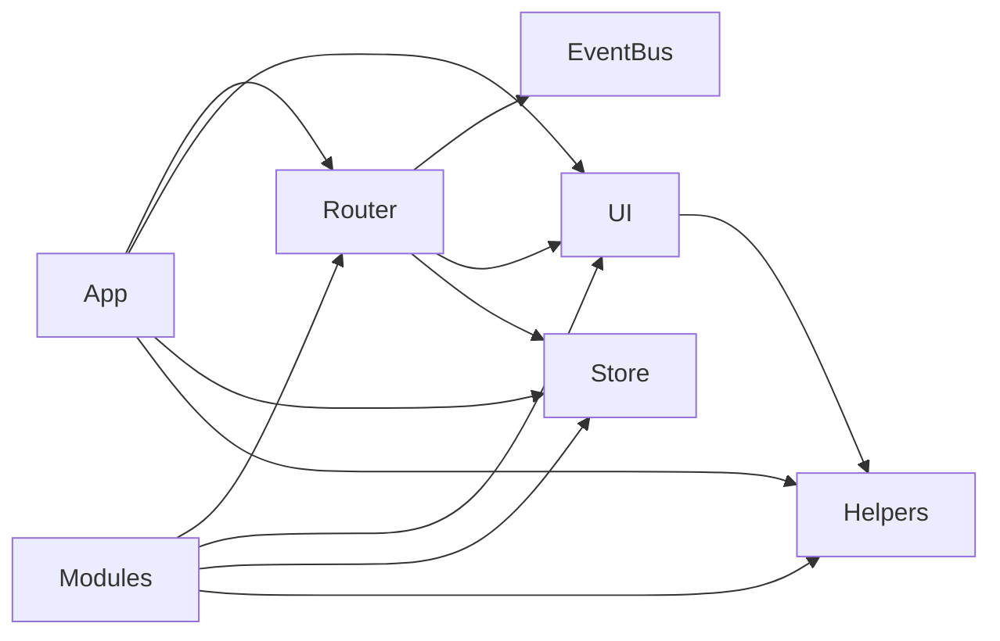

# 路由系统

<cite>
**本文档引用的文件**
- [router.js](file://js/router.js)
- [app.js](file://js/app.js)
- [events.js](file://js/events.js)
- [store.js](file://js/store.js)
- [ui.js](file://js/ui.js)
- [helpers.js](file://js/utils/helpers.js)
- [index.html](file://index.html)
- [dashboard.js](file://js/modules/dashboard.js)
- [leads.js](file://js/modules/leads.js)
- [customers.js](file://js/modules/customers.js)
- [products.js](file://js/modules/products.js)
- [opportunities.js](file://js/modules/opportunities.js)
- [orders.js](file://js/modules/orders.js)
- [contacts.js](file://js/modules/contacts.js)
- [followups.js](file://js/modules/followups.js)
</cite>

## 目录
1. [简介](#简介)
2. [项目结构](#项目结构)
3. [核心组件](#核心组件)
4. [架构总览](#架构总览)
5. [详细组件分析](#详细组件分析)
6. [依赖分析](#依赖分析)
7. [性能考虑](#性能考虑)
8. [故障排查指南](#故障排查指南)
9. [结论](#结论)
10. [附录](#附录)

## 简介
本文件面向CRM系统的前端路由系统，围绕基于Hash的路由实现进行深入解析。重点涵盖：
- 技术选型与实现原理：以原生Hash变更事件为核心，结合正则匹配与动态参数捕获。
- 路由注册机制：路由规则定义、动态参数处理、默认路由与未匹配处理。
- 导航控制与页面切换：编程式导航、路由变化监听、页面渲染流程与面包屑更新。
- 路由与模块绑定：路由如何驱动各业务模块页面内容更新，以及跨模块联动。
- 使用示例与最佳实践：路由配置、导航控制代码路径、扩展性与性能优化建议。

## 项目结构
路由系统位于前端单页应用骨架中，采用“路由中心 + 模块化页面”的组织方式：
- 路由核心：js/router.js 提供注册、解析、导航与启动能力。
- 应用入口：js/app.js 负责初始化模块、注册路由、绑定导航与事件。
- 事件总线：js/events.js 提供轻量事件发布订阅，用于路由变化广播与模块间解耦。
- 页面渲染：js/ui.js 提供统一的页面标题与内容渲染接口。
- 数据层：js/store.js 提供本地持久化与数据变更事件，驱动页面刷新。
- 工具函数：js/utils/helpers.js 提供防抖、格式化、ID生成等工具。
- 页面模板：index.html 定义主容器与侧边栏导航，承载动态内容区域。

图表来源
- [router.js](file://js/router.js)
- [app.js](file://js/app.js)
- [events.js](file://js/events.js)
- [ui.js](file://js/ui.js)
- [store.js](file://js/store.js)
- [helpers.js](file://js/utils/helpers.js)
- [dashboard.js](file://js/modules/dashboard.js)
- [leads.js](file://js/modules/leads.js)
- [customers.js](file://js/modules/customers.js)
- [products.js](file://js/modules/products.js)
- [opportunities.js](file://js/modules/opportunities.js)
- [orders.js](file://js/modules/orders.js)
- [contacts.js](file://js/modules/contacts.js)
- [followups.js](file://js/modules/followups.js)

章节来源
- [index.html](file://index.html)
- [router.js](file://js/router.js)
- [app.js](file://js/app.js)

## 核心组件
- Router（路由核心）
  - 职责：注册路由规则、解析当前Hash、匹配并执行处理器、编程式导航、启动监听、暴露当前路由。
  - 关键点：使用正则将“/path/:param”形式转换为命名捕获组，支持动态参数；未匹配时自动跳转到默认路由。
- EventBus（事件总线）
  - 职责：发布/订阅事件，支持通配符；路由变化通过事件广播，模块可订阅刷新。
- UI（页面渲染）
  - 职责：设置页面标题、渲染内容区、构建表单与模态框、Toast提示。
- Store（数据层）
  - 职责：本地存储封装、缓存、数据变更事件发布；模块通过事件感知数据变化并刷新视图。
- Helpers（工具函数）
  - 职责：防抖、金额/日期格式化、ID生成、HTML转义等。

章节来源
- [router.js](file://js/router.js)
- [events.js](file://js/events.js)
- [ui.js](file://js/ui.js)
- [store.js](file://js/store.js)
- [helpers.js](file://js/utils/helpers.js)

## 架构总览
下图展示了Hash路由从用户交互到页面渲染的完整链路，以及模块与路由的绑定关系。

图表来源
- [app.js](file://js/app.js)
- [router.js](file://js/router.js)
- [events.js](file://js/events.js)
- [ui.js](file://js/ui.js)

## 详细组件分析

### Router（路由核心）
- 注册机制
  - 接口：register(pattern, handler)
  - 实现：将“/path/:param”转换为带命名捕获组的正则；将pattern、regex、handler存入内部数组。
- 解析与匹配
  - _parseHash：读取当前Hash，默认兜底为“#/dashboard”。
  - _resolve：遍历已注册规则，使用正则匹配；命中后提取命名捕获组作为params，调用handler(params)，并发出“route:changed”事件。
- 导航控制
  - navigate(hash)：若目标Hash与当前相同，手动触发解析；否则写入window.location.hash。
- 启动与监听
  - start：监听hashchange事件，初始解析一次；确保首次进入也能正确渲染。
- 当前路由
  - current()：返回当前路由对象（包含hash、pattern、params）。

图表来源
- [router.js](file://js/router.js)

章节来源
- [router.js](file://js/router.js)

### 应用入口与导航绑定（App）
- 初始化流程
  - 注入种子数据、初始化各模块、注册“设置”路由、绑定导航、全局搜索、移动端侧边栏。
  - 启动Router，并监听“route:changed”事件以更新导航高亮。
- 导航绑定
  - 为带有data-route属性的导航项绑定点击事件，调用Router.navigate跳转。
- 导航高亮
  - 根据当前Hash的模块部分（如#/leads中的“leads”）更新侧边栏导航项的active类。

图表来源
- [app.js](file://js/app.js)
- [router.js](file://js/router.js)
- [events.js](file://js/events.js)

章节来源
- [app.js](file://js/app.js)

### 事件总线（EventBus）
- 支持通配符事件（如“data:changed:*”），便于模块订阅数据变更事件并响应。
- 在Store中广泛使用，模块可通过订阅事件实现“数据驱动视图”。

章节来源
- [events.js](file://js/events.js)
- [store.js](file://js/store.js)

### 页面渲染（UI）
- setPageTitle：支持面包屑导航，根据传入的面包屑数组动态生成导航链接。
- render：向内容区插入HTML或DOM节点，作为模块渲染的统一出口。

章节来源
- [ui.js](file://js/ui.js)

### 数据层（Store）
- 提供create/update/delete等CRUD操作，并在每次变更后通过EventBus发布事件。
- 模块可订阅对应事件，在路由为当前模块时刷新视图。

章节来源
- [store.js](file://js/store.js)

### 模块与路由绑定
- 每个模块在init中注册其路由规则，例如：
  - Dashboard：register("#/dashboard", ...)，并订阅数据变更事件以自动刷新。
  - Leads：register("#/leads", ...)、register("#/leads/view/:id", ...)。
  - Customers：register("#/customers", ...)、register("#/customers/view/:id", ...)。
  - Products：register("#/products", ...)、register("#/products/view/:id", ...)。
  - Opportunities：register("#/opportunities", ...)、register("#/opportunities/view/:id", ...)。
  - Orders：register("#/orders", ...)、register("#/orders/view/:id", ...)。
  - Contacts：register("#/contacts", ...)。
  - FollowUps：register("#/followups", ...)。
- 模块内部通过Router.navigate进行页面跳转，或在事件回调中刷新当前详情页。

章节来源
- [dashboard.js](file://js/modules/dashboard.js)
- [leads.js](file://js/modules/leads.js)
- [customers.js](file://js/modules/customers.js)
- [products.js](file://js/modules/products.js)
- [opportunities.js](file://js/modules/opportunities.js)
- [orders.js](file://js/modules/orders.js)
- [contacts.js](file://js/modules/contacts.js)
- [followups.js](file://js/modules/followups.js)

## 依赖分析
- 路由核心依赖
  - 依赖EventBus进行路由变化广播，模块通过订阅事件实现解耦。
  - 依赖UI进行页面标题与内容渲染。
  - 依赖Store进行数据访问与变更通知。
- 模块依赖
  - 各模块依赖Router进行导航与参数传递。
  - 依赖UI进行页面渲染与交互。
  - 依赖Store进行数据持久化与变更事件订阅。
- 工具函数
  - Helpers提供防抖、格式化、ID生成等，被App、UI、模块广泛使用。

图表来源
- [router.js](file://js/router.js)
- [events.js](file://js/events.js)
- [ui.js](file://js/ui.js)
- [store.js](file://js/store.js)
- [app.js](file://js/app.js)
- [helpers.js](file://js/utils/helpers.js)

章节来源
- [router.js](file://js/router.js)
- [events.js](file://js/events.js)
- [ui.js](file://js/ui.js)
- [store.js](file://js/store.js)
- [app.js](file://js/app.js)
- [helpers.js](file://js/utils/helpers.js)

## 性能考虑
- 正则匹配复杂度
  - 路由规则数量较多时，逐条匹配存在线性开销。建议：
    - 将高频路由置于前面，减少平均匹配次数。
    - 对于静态路由优先级高于动态路由，避免过多动态规则导致匹配成本上升。
- 事件风暴
  - 数据频繁变更会触发大量“data:changed:*”事件，模块订阅时应使用防抖或批量刷新策略（Helpers.debounce已在全局搜索中使用）。
- 页面渲染
  - UI.render直接替换innerHTML，简单高效；对于大型表格或复杂组件，建议模块内部做局部更新而非整页重绘。
- 存储与缓存
  - Store对集合进行内存缓存，避免重复读取localStorage；注意在数据量大时的内存占用与序列化开销。

## 故障排查指南
- 路由未生效或白屏
  - 检查Router是否已start，以及是否存在未匹配规则导致的兜底跳转。
  - 确认模块是否正确注册了路由规则。
- 导航高亮不更新
  - 检查App是否订阅了“route:changed”，以及updateActiveNav逻辑是否正确解析模块名。
- 详情页无法刷新
  - 检查模块是否订阅了对应“data:changed:*”事件并在当前路由时刷新。
- 导航跳转无效
  - 若点击同一Hash，需确保Router.navigate内部能触发手动解析（相同Hash时走_resolve分支）。

章节来源
- [router.js](file://js/router.js)
- [app.js](file://js/app.js)
- [events.js](file://js/events.js)
- [store.js](file://js/store.js)

## 结论
该Hash路由系统以简洁的API与清晰的职责划分实现了模块化页面的导航与渲染。通过事件总线与数据层的配合，模块能够以声明式的方式订阅数据变更并响应路由变化。在扩展性方面，新增模块只需注册路由规则并实现渲染逻辑；在性能方面，可通过规则排序、事件防抖与局部渲染进一步优化。

## 附录

### 路由配置示例与导航控制代码路径
- 注册路由
  - Dashboard：[dashboard.js](file://js/modules/dashboard.js)
  - Leads：[leads.js](file://js/modules/leads.js)
  - Customers：[customers.js](file://js/modules/customers.js)
  - Products：[products.js](file://js/modules/products.js)
  - Opportunities：[opportunities.js](file://js/modules/opportunities.js)
  - Orders：[orders.js](file://js/modules/orders.js)
  - Contacts：[contacts.js](file://js/modules/contacts.js)
  - FollowUps：[followups.js](file://js/modules/followups.js)
- 编程式导航
  - App侧：[app.js](file://js/app.js)
  - 模块内：各模块内部均使用Router.navigate进行跳转
- 路由启动
  - [router.js](file://js/router.js)

### 路由系统扩展性与性能优化建议
- 扩展性
  - 新增模块：在模块init中注册路由规则，实现render方法并通过UI.render输出内容。
  - 参数化路由：利用命名捕获组处理动态参数，保持路由语义清晰。
- 性能优化
  - 规则排序：将常用静态路由前置，减少匹配轮次。
  - 事件防抖：对高频数据变更采用防抖策略，降低渲染压力。
  - 局部更新：在模块内部对表格或列表做局部DOM更新，避免整页重绘。
  - 缓存策略：Store已内置内存缓存，注意在大数据场景下的清理与同步。