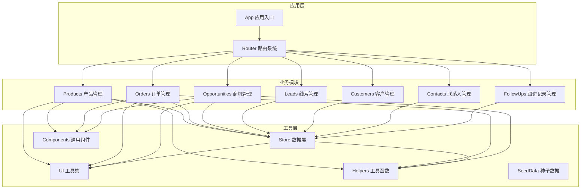
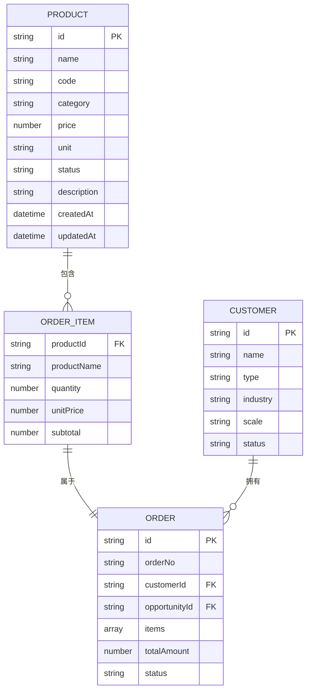
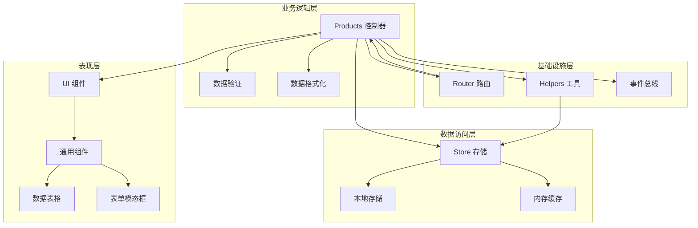
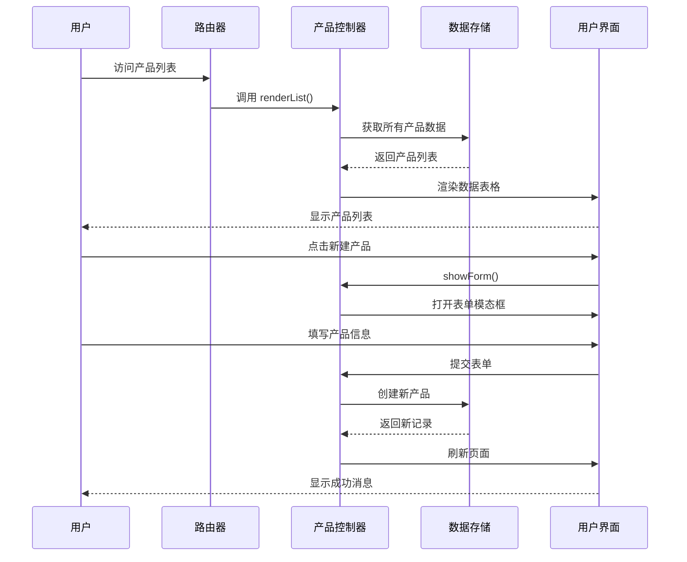
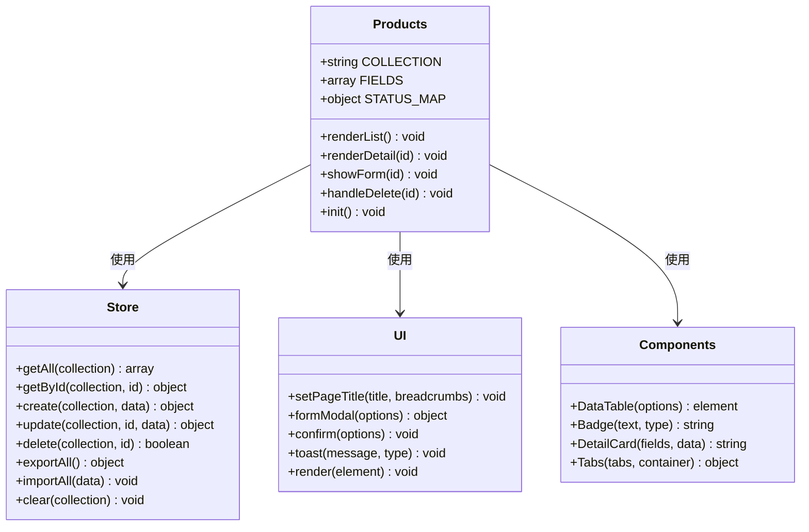
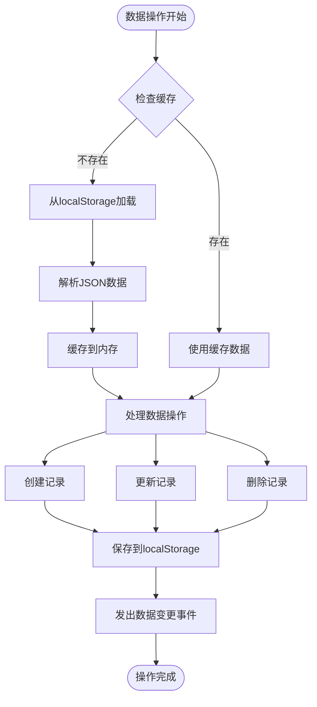
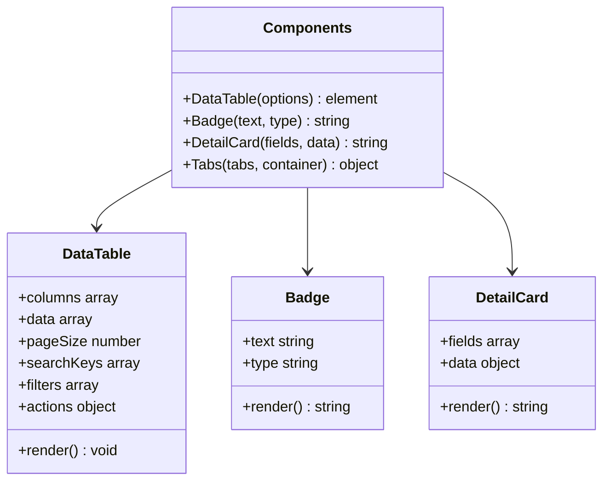
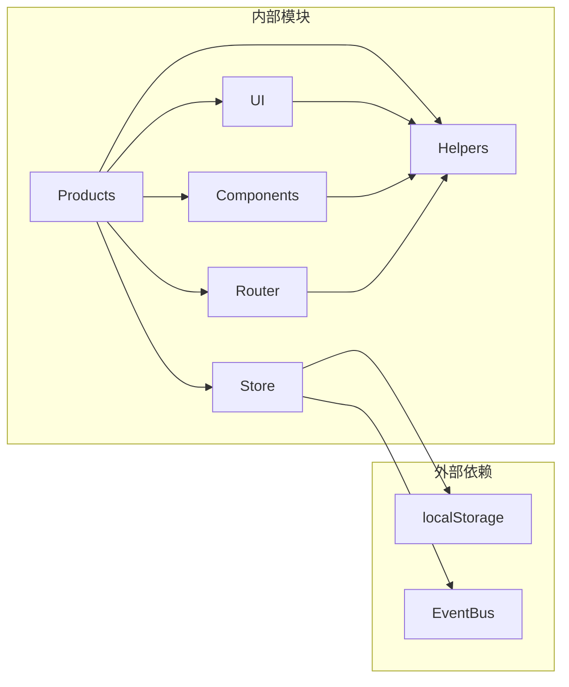
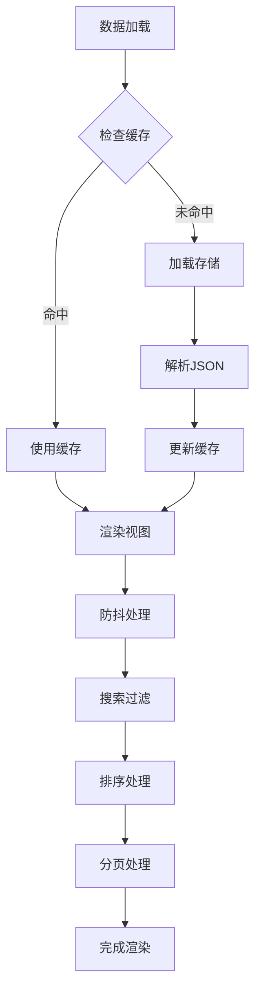

# 产品管理模块

<cite>
**本文档引用的文件**
- [products.js](file://js/modules/products.js)
- [store.js](file://js/store.js)
- [helpers.js](file://js/utils/helpers.js)
- [components.js](file://js/components.js)
- [ui.js](file://js/ui.js)
- [router.js](file://js/router.js)
- [seed.js](file://js/utils/seed.js)
- [orders.js](file://js/modules/orders.js)
- [opportunities.js](file://js/modules/opportunities.js)
- [app.js](file://js/app.js)
</cite>

## 目录
1. [简介](#简介)
2. [项目结构](#项目结构)
3. [核心组件](#核心组件)
4. [架构概览](#架构概览)
5. [详细组件分析](#详细组件分析)
6. [依赖关系分析](#依赖关系分析)
7. [性能考虑](#性能考虑)
8. [故障排除指南](#故障排除指南)
9. [结论](#结论)

## 简介

产品管理模块是CRM系统的核心功能之一，负责维护和管理企业的产品信息。该模块提供了完整的产品生命周期管理能力，包括产品基本信息维护、分类管理、价格体系、状态控制等功能。通过直观的用户界面和强大的数据持久化机制，系统能够有效支持销售流程中的产品管理需求。

本模块采用现代化的前端架构设计，基于本地存储的数据持久化方案，确保数据的安全性和可靠性。同时，模块化的设计使得功能扩展和维护变得简单高效。

## 项目结构

CRM系统采用模块化的JavaScript架构，产品管理模块位于`js/modules/`目录下，与其他业务模块协同工作。

**图表来源**
- [app.js:6-41](file://js/app.js#L6-L41)
- [products.js:170-175](file://js/modules/products.js#L170-L175)
- [store.js:4-139](file://js/store.js#L4-L139)

**章节来源**
- [app.js:6-41](file://js/app.js#L6-L41)
- [products.js:1-175](file://js/modules/products.js#L1-L175)

## 核心组件

产品管理模块由多个核心组件构成，每个组件都有明确的职责和功能边界。

### 主要组件概述

| 组件名称 | 职责 | 关键特性 |
|---------|------|----------|
| Products | 产品管理主控制器 | CRUD操作、表单验证、视图渲染 |
| Store | 数据持久化层 | 本地存储、缓存管理、数据同步 |
| Components | 通用组件库 | 数据表格、表单组件、状态标签 |
| UI | 用户界面工具 | 模态框、提示、确认对话框 |
| Helpers | 工具函数库 | 格式化、ID生成、防抖处理 |

### 数据模型

产品模块采用标准化的数据模型，确保数据的一致性和完整性。

**图表来源**
- [products.js:7-15](file://js/modules/products.js#L7-L15)
- [orders.js:9-13](file://js/modules/orders.js#L9-L13)
- [seed.js:98-109](file://js/utils/seed.js#L98-L109)

**章节来源**
- [products.js:7-20](file://js/modules/products.js#L7-L20)
- [orders.js:9-13](file://js/modules/orders.js#L9-L13)

## 架构概览

产品管理模块采用分层架构设计，确保关注点分离和代码的可维护性。

**图表来源**
- [products.js:22-75](file://js/modules/products.js#L22-L75)
- [store.js:4-139](file://js/store.js#L4-L139)
- [components.js:6-271](file://js/components.js#L6-L271)

### 控制流分析

产品管理模块的典型操作流程如下：

**图表来源**
- [products.js:126-151](file://js/modules/products.js#L126-L151)
- [store.js:53-67](file://js/store.js#L53-L67)
- [ui.js:164-191](file://js/ui.js#L164-L191)

**章节来源**
- [products.js:22-175](file://js/modules/products.js#L22-L175)
- [store.js:4-139](file://js/store.js#L4-L139)

## 详细组件分析

### Products 控制器

Products控制器是产品管理模块的核心，负责处理所有与产品相关的业务逻辑。

#### 核心功能

**图表来源**
- [products.js:4-175](file://js/modules/products.js#L4-L175)
- [store.js:4-139](file://js/store.js#L4-L139)
- [ui.js:4-364](file://js/ui.js#L4-L364)
- [components.js:4-324](file://js/components.js#L4-L324)

#### 数据字段定义

产品模块定义了完整的数据字段结构：

| 字段名 | 类型 | 必填 | 描述 | 默认值 |
|--------|------|------|------|--------|
| name | text | 是 | 产品名称 | - |
| code | text | 是 | 产品编码 | - |
| category | select | 否 | 产品分类 | - |
| price | number | 是 | 标准单价 | - |
| unit | select | 否 | 计量单位 | - |
| status | select | 是 | 产品状态 | 在售 |
| description | textarea | 否 | 产品描述 | - |

#### 视图渲染机制

产品模块提供了两种主要的视图模式：

1. **列表视图**：展示产品的基本信息，支持搜索、排序和批量操作
2. **详情视图**：展示产品的完整信息，包括创建和更新时间

**章节来源**
- [products.js:7-20](file://js/modules/products.js#L7-L20)
- [products.js:22-124](file://js/modules/products.js#L22-L124)

### Store 数据层

Store模块实现了统一的数据持久化接口，为所有业务模块提供数据访问能力。

#### 核心特性

**图表来源**
- [store.js:8-96](file://js/store.js#L8-L96)

#### 数据操作流程

Store模块支持以下数据操作：

1. **创建操作**：生成唯一ID、设置时间戳、保存到存储
2. **读取操作**：从缓存或存储中获取数据
3. **更新操作**：更新时间戳、保存到存储
4. **删除操作**：从存储中移除记录

**章节来源**
- [store.js:53-96](file://js/store.js#L53-L96)

### UI 组件系统

UI模块提供了丰富的用户界面组件，支持产品管理的各种交互场景。

#### 通用组件

**图表来源**
- [components.js:6-324](file://js/components.js#L6-L324)
- [ui.js:164-317](file://js/ui.js#L164-L317)

#### 表单验证机制

UI模块实现了完整的表单验证功能：

1. **必填字段验证**：检查必需字段是否为空
2. **数据类型验证**：验证数字、日期等数据类型
3. **格式化处理**：自动格式化显示数据

**章节来源**
- [ui.js:164-317](file://js/ui.js#L164-L317)
- [components.js:6-271](file://js/components.js#L6-L271)

## 依赖关系分析

产品管理模块的依赖关系清晰明确，遵循单一职责原则。

**图表来源**
- [products.js:1-175](file://js/modules/products.js#L1-L175)
- [store.js:1-139](file://js/store.js#L1-L139)

### 模块间耦合度

| 依赖方向 | 耦合程度 | 说明 |
|----------|----------|------|
| Products → Store | 高 | 直接数据访问 |
| Products → UI | 中 | 视图渲染和用户交互 |
| Products → Components | 中 | 通用组件使用 |
| Store → Helpers | 低 | 工具函数辅助 |
| UI → Helpers | 低 | 格式化工具 |

**章节来源**
- [products.js:1-175](file://js/modules/products.js#L1-L175)
- [store.js:1-139](file://js/store.js#L1-L139)

## 性能考虑

产品管理模块在设计时充分考虑了性能优化，采用了多种策略来提升用户体验。

### 缓存策略

系统实现了多层次的缓存机制：

1. **内存缓存**：Store模块维护内存中的数据缓存
2. **本地存储**：使用localStorage实现持久化存储
3. **智能刷新**：只在必要时重新渲染视图

### 性能优化技术

**图表来源**
- [store.js:8-30](file://js/store.js#L8-L30)
- [components.js:34-67](file://js/components.js#L34-L67)

### 内存管理

系统采用垃圾回收友好的设计模式：

1. **事件监听器清理**：组件销毁时自动清理事件监听
2. **DOM元素管理**：统一的DOM操作接口
3. **循环引用避免**：避免对象间的循环引用

## 故障排除指南

### 常见问题及解决方案

#### 数据丢失问题

**症状**：产品数据在浏览器重启后消失
**原因**：localStorage存储空间不足或权限问题
**解决方案**：
1. 检查浏览器存储空间
2. 清理不必要的数据
3. 使用系统设置中的数据导出功能

#### 页面加载缓慢

**症状**：产品列表加载时间过长
**原因**：数据量过大或网络延迟
**解决方案**：
1. 实施分页加载
2. 优化数据库查询
3. 使用缓存策略

#### 表单验证错误

**症状**：表单提交时报验证错误
**原因**：必填字段缺失或数据格式不正确
**解决方案**：
1. 检查必填字段是否填写
2. 验证数据格式是否正确
3. 查看具体的错误提示信息

**章节来源**
- [store.js:23-29](file://js/store.js#L23-L29)
- [ui.js:48-78](file://js/ui.js#L48-L78)

### 调试技巧

1. **开发者工具**：使用浏览器开发者工具检查localStorage
2. **控制台日志**：利用console.log输出调试信息
3. **事件监控**：监听EventBus事件了解数据变更

## 结论

产品管理模块展现了现代前端应用的最佳实践，通过模块化设计、清晰的架构层次和完善的错误处理机制，为用户提供了一个强大而易用的产品管理解决方案。

### 主要优势

1. **模块化设计**：清晰的职责分离和依赖管理
2. **数据持久化**：可靠的本地存储方案
3. **用户友好**：直观的界面和流畅的交互体验
4. **可扩展性**：良好的架构支持功能扩展

### 改进建议

1. **库存管理**：当前版本缺少库存跟踪功能，建议增加库存数量、安全库存等字段
2. **价格体系**：可以扩展支持多价格策略、批量折扣等功能
3. **分类管理**：建议实现更灵活的分类体系，支持多级分类
4. **数据同步**：考虑实现云端数据同步功能

产品管理模块为CRM系统的销售流程提供了坚实的基础，通过持续的功能完善和性能优化，将为企业管理带来更大的价值。