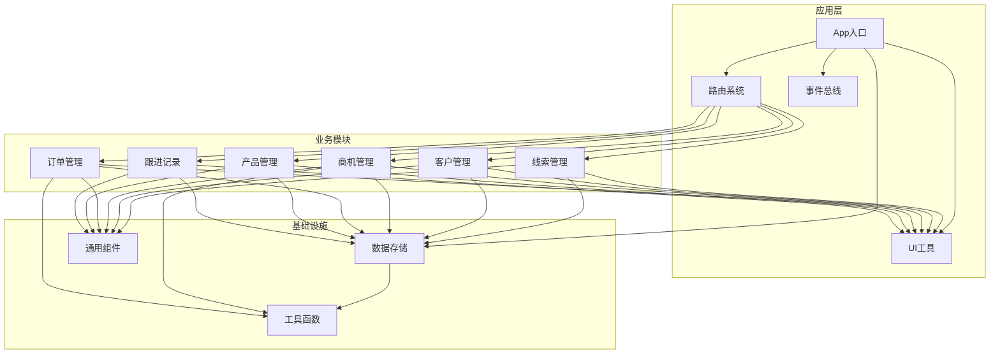
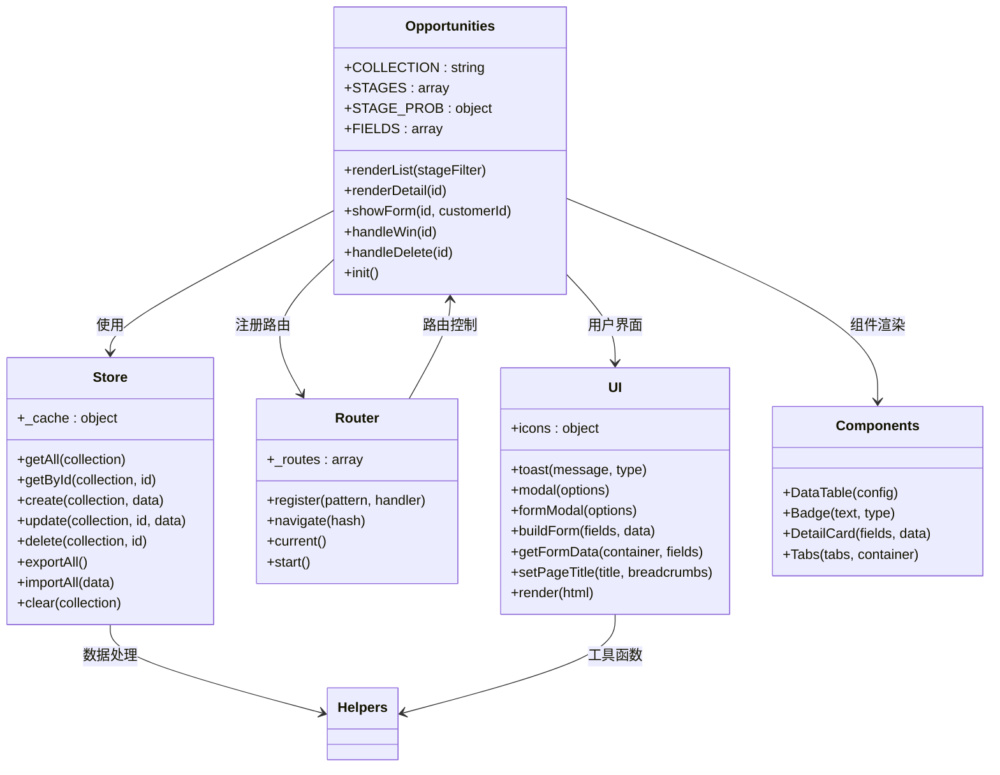
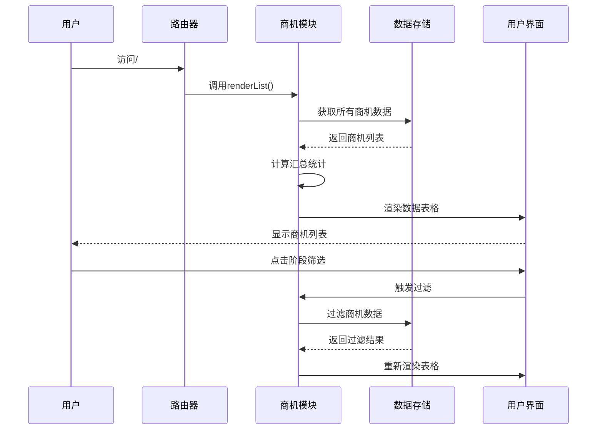
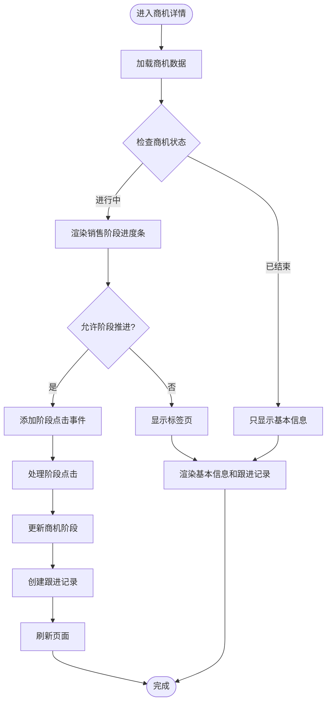
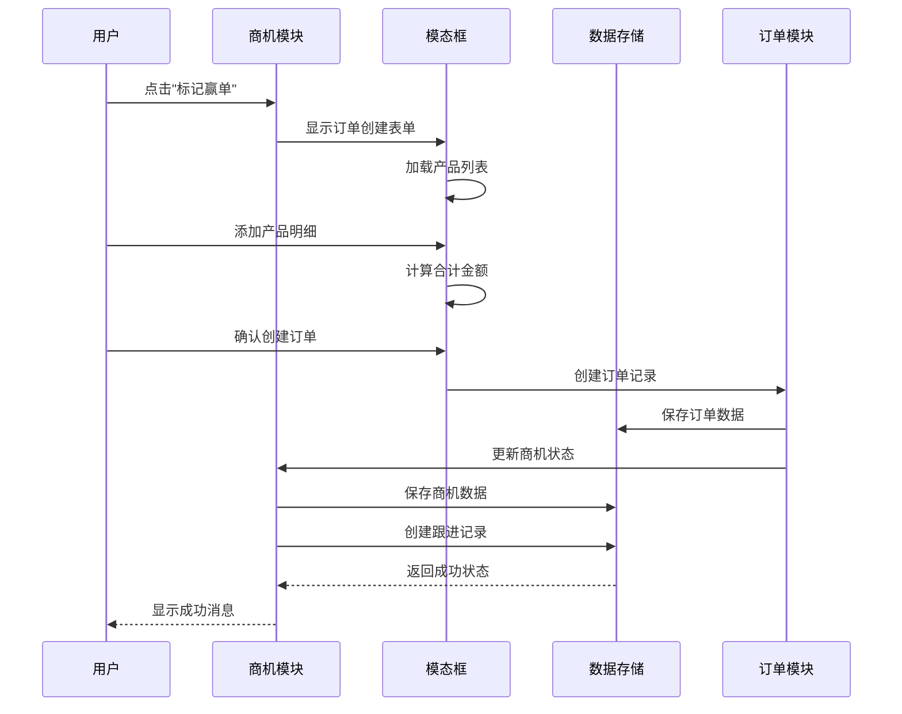
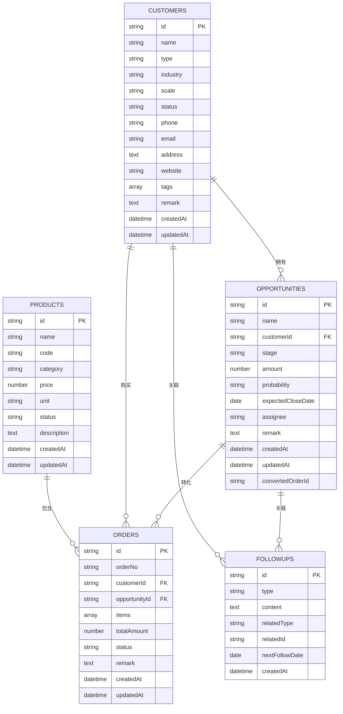
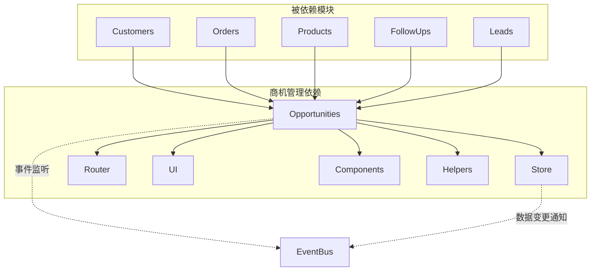

# 商机管理模块

<cite>
**本文档引用的文件**
- [opportunities.js](file://js/modules/opportunities.js)
- [leads.js](file://js/modules/leads.js)
- [customers.js](file://js/modules/customers.js)
- [products.js](file://js/modules/products.js)
- [orders.js](file://js/modules/orders.js)
- [followups.js](file://js/modules/followups.js)
- [store.js](file://js/store.js)
- [router.js](file://js/router.js)
- [ui.js](file://js/ui.js)
- [components.js](file://js/components.js)
- [helpers.js](file://js/utils/helpers.js)
- [events.js](file://js/events.js)
- [app.js](file://js/app.js)
</cite>

## 目录
1. [简介](#简介)
2. [项目结构](#项目结构)
3. [核心组件](#核心组件)
4. [架构概览](#架构概览)
5. [详细组件分析](#详细组件分析)
6. [依赖关系分析](#依赖关系分析)
7. [性能考虑](#性能考虑)
8. [故障排除指南](#故障排除指南)
9. [结论](#结论)
10. [附录](#附录)

## 简介

CRM系统中的商机管理模块是整个销售流程的核心，负责管理从潜在销售机会到最终成交的完整生命周期。该模块实现了完整的销售漏斗管理，包括商机创建、信息录入、阶段推进、金额管理、概率评估等功能，并与客户管理、产品管理、订单管理等相关模块深度集成。

## 项目结构

CRM系统采用模块化的JavaScript架构设计，每个业务领域都有独立的模块文件，通过统一的路由系统和数据层进行协调。

**图表来源**
- [app.js:6-41](file://js/app.js#L6-L41)
- [router.js:8-36](file://js/router.js#L8-L36)
- [store.js:4-138](file://js/store.js#L4-L138)

**章节来源**
- [app.js:6-41](file://js/app.js#L6-L41)
- [router.js:8-36](file://js/router.js#L8-L36)
- [store.js:4-138](file://js/store.js#L4-L138)

## 核心组件

商机管理模块包含以下核心组件：

### 销售漏斗阶段管理
系统定义了7个标准销售阶段：
- 需求待确认（需求待确认）
- 需求确认（需求确认）
- 方案认可（方案认可）
- 确定合作（确定合作）
- 合同签约（合同签约）
- 赢单（赢单）
- 输单（输单）

每个阶段都配有对应的颜色标识和概率值，便于直观识别商机状态。

### 金额管理与概率评估
- **预估金额**：支持精确到分的金额录入
- **成交概率**：预设5个概率等级（20%、40%、60%、80%、100%）
- **预期关闭日期**：可选的预计成交时间
- **自动概率计算**：根据阶段自动设置对应概率值

### 关联关系管理
- **客户关联**：一对一关联，支持从客户详情直接创建商机
- **产品关联**：通过订单明细关联产品
- **负责人分配**：支持商机负责人字段
- **跟进记录**：自动记录阶段变更和重要事件

**章节来源**
- [opportunities.js:7-20](file://js/modules/opportunities.js#L7-L20)
- [opportunities.js:22-31](file://js/modules/opportunities.js#L22-L31)

## 架构概览

商机管理模块采用MVVM架构模式，通过模块化设计实现高内聚低耦合。

**图表来源**
- [opportunities.js:4-485](file://js/modules/opportunities.js#L4-L485)
- [store.js:4-138](file://js/store.js#L4-L138)
- [router.js:4-61](file://js/router.js#L4-L61)
- [ui.js:4-363](file://js/ui.js#L4-L363)
- [components.js:4-323](file://js/components.js#L4-L323)

## 详细组件分析

### 商机列表管理

商机列表提供了完整的数据展示和交互功能：

**图表来源**
- [opportunities.js:33-101](file://js/modules/opportunities.js#L33-L101)
- [store.js:32-51](file://js/store.js#L32-L51)

#### 关键特性
- **实时统计**：显示进行中商机数量、总金额、已赢单金额
- **多维度筛选**：按阶段、客户、负责人等条件筛选
- **快速搜索**：支持商机名称、负责人等关键词搜索
- **批量操作**：支持查看、编辑、删除等批量操作

### 商机详情管理

商机详情页面提供了完整的商机信息展示和操作功能：

**图表来源**
- [opportunities.js:103-238](file://js/modules/opportunities.js#L103-L238)
- [opportunities.js:136-185](file://js/modules/opportunities.js#L136-L185)

#### 核心功能
- **销售阶段可视化**：进度条清晰展示当前阶段
- **阶段推进**：支持点击推进到下一阶段
- **状态管理**：自动更新概率和相关字段
- **跟进记录**：自动生成阶段变更记录

### 赢单流程管理

当商机达到赢单阶段时，系统会引导用户创建订单：

**图表来源**
- [opportunities.js:303-462](file://js/modules/opportunities.js#L303-L462)

#### 流程特点
- **产品关联**：自动加载在售产品供选择
- **明细管理**：支持多产品明细录入
- **金额计算**：实时计算订单合计
- **状态同步**：商机和订单状态双向同步

### 数据模型设计

商机管理模块的数据模型设计遵循标准化原则：

**图表来源**
- [opportunities.js:11-20](file://js/modules/opportunities.js#L11-L20)
- [customers.js:7-19](file://js/modules/customers.js#L7-L19)
- [orders.js:9-13](file://js/modules/orders.js#L9-L13)
- [followups.js:9-13](file://js/modules/followups.js#L9-L13)
- [products.js:7-15](file://js/modules/products.js#L7-L15)

**章节来源**
- [opportunities.js:11-20](file://js/modules/opportunities.js#L11-L20)
- [customers.js:7-19](file://js/modules/customers.js#L7-L19)
- [orders.js:9-13](file://js/modules/orders.js#L9-L13)
- [followups.js:9-13](file://js/modules/followups.js#L9-L13)
- [products.js:7-15](file://js/modules/products.js#L7-L15)

## 依赖关系分析

商机管理模块与其他模块存在紧密的依赖关系：

**图表来源**
- [opportunities.js:480-485](file://js/modules/opportunities.js#L480-L485)
- [store.js:65-95](file://js/store.js#L65-L95)
- [events.js:18-30](file://js/events.js#L18-L30)

### 关键依赖点

1. **数据存储依赖**：所有CRUD操作都通过Store模块
2. **路由依赖**：通过Router模块注册和处理路由
3. **UI组件依赖**：使用UI和Components模块构建用户界面
4. **工具函数依赖**：使用Helpers模块进行数据格式化
5. **事件通信**：通过EventBus实现模块间解耦通信

**章节来源**
- [opportunities.js:480-485](file://js/modules/opportunities.js#L480-L485)
- [store.js:65-95](file://js/store.js#L65-L95)
- [events.js:18-30](file://js/events.js#L18-L30)

## 性能考虑

### 数据存储优化
- **本地缓存**：Store模块使用内存缓存减少localStorage访问
- **批量操作**：支持批量数据导入导出
- **增量更新**：只更新修改的数据项

### 界面渲染优化
- **虚拟滚动**：大数据量时使用分页和虚拟滚动
- **防抖处理**：搜索和筛选操作使用防抖优化
- **懒加载**：详情页面按需加载数据

### 事件处理优化
- **事件委托**：使用事件委托减少事件监听器数量
- **内存泄漏防护**：及时清理事件监听器和定时器

## 故障排除指南

### 常见问题及解决方案

#### 商机数据丢失
**症状**：刷新页面后商机数据消失
**原因**：localStorage存储空间不足或浏览器兼容性问题
**解决**：检查浏览器存储容量，清理不必要的数据

#### 阶段推进异常
**症状**：点击阶段无法更新
**原因**：数据同步问题或网络异常
**解决**：检查网络连接，重新登录系统

#### 订单创建失败
**症状**：赢单后无法创建订单
**原因**：产品库存不足或数据验证失败
**解决**：检查产品状态，确保产品在售

#### 页面加载缓慢
**症状**：商机列表加载时间过长
**原因**：数据量过大或浏览器性能问题
**解决**：使用筛选功能减少数据量，清理浏览器缓存

**章节来源**
- [store.js:23-30](file://js/store.js#L23-L30)
- [opportunities.js:160-181](file://js/modules/opportunities.js#L160-L181)
- [orders.js:193-210](file://js/modules/orders.js#L193-L210)

## 结论

商机管理模块通过精心设计的架构和完善的业务逻辑，为CRM系统提供了强大的销售机会管理能力。模块具有以下优势：

1. **完整的销售漏斗**：覆盖从线索到成交的全生命周期
2. **直观的用户界面**：通过可视化的方式展示商机状态
3. **灵活的数据管理**：支持多种筛选、搜索和排序方式
4. **强关联关系**：与客户、产品、订单等模块深度集成
5. **可靠的事件系统**：通过EventBus实现模块间解耦通信

该模块的设计充分体现了现代Web应用的最佳实践，为后续的功能扩展和维护奠定了良好的基础。

## 附录

### 最佳实践建议

1. **数据完整性**：确保商机信息的完整性和准确性
2. **定期跟进**：建立定期跟进机制，及时更新商机状态
3. **团队协作**：合理分配商机负责人，避免重复跟进
4. **数据分析**：定期分析商机转化率和成功率
5. **系统维护**：定期清理无效数据，优化系统性能

### 扩展建议

1. **移动端适配**：增强移动端用户体验
2. **报表分析**：增加更多维度的统计分析功能
3. **自动化提醒**：增加智能提醒和预警功能
4. **集成第三方**：支持与邮件、日历等第三方服务集成