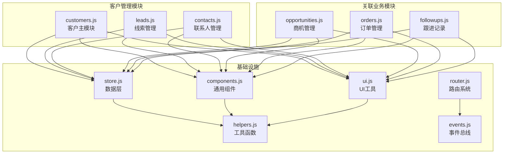
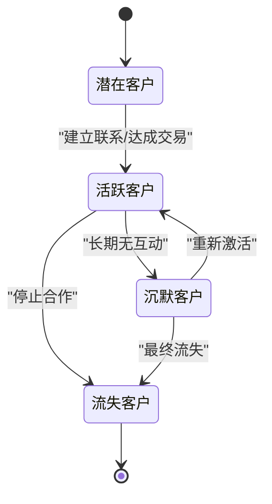
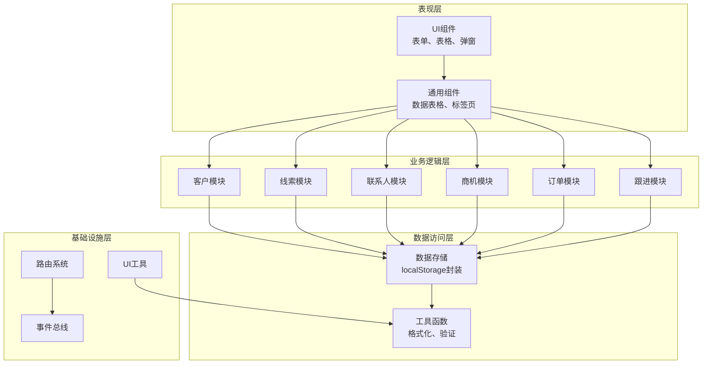
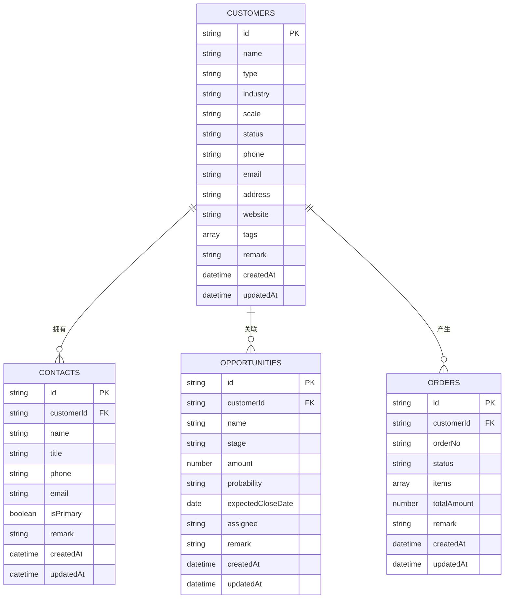
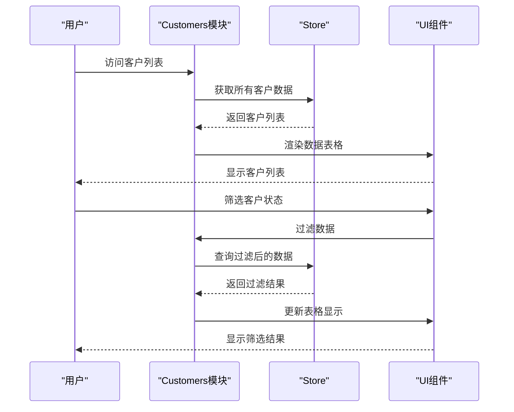
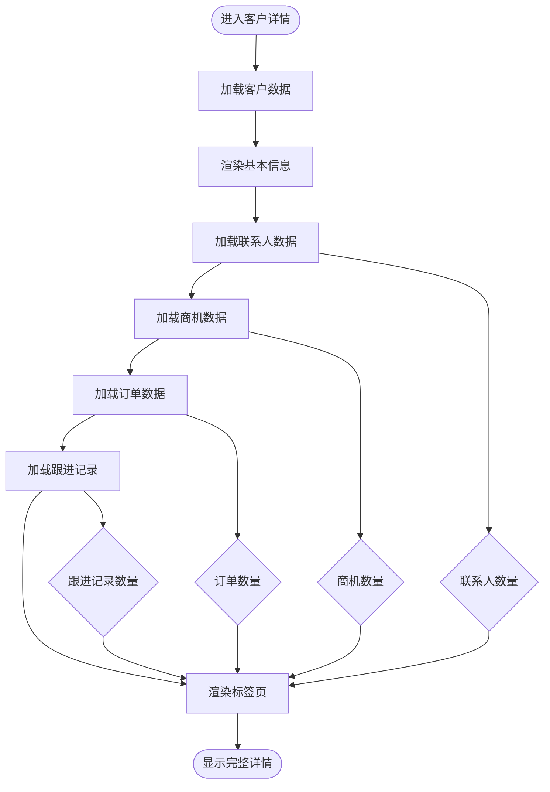
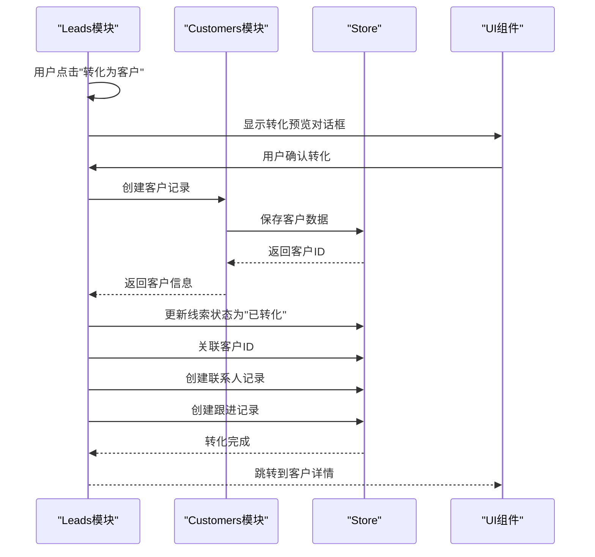
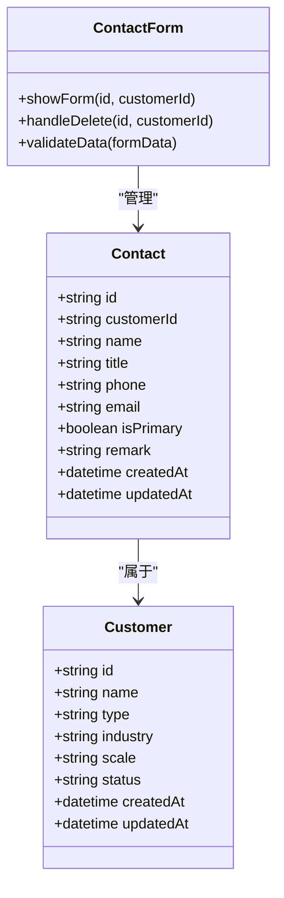
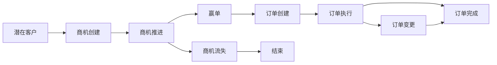
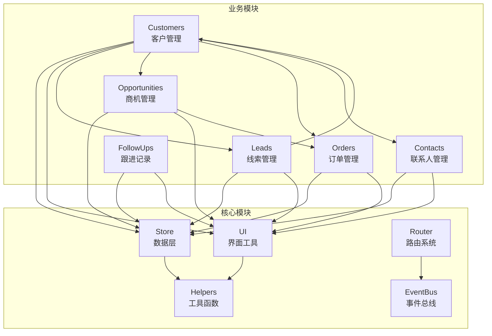

# 客户管理模块

<cite>
**本文档引用的文件**
- [customers.js](file://js/modules/customers.js)
- [leads.js](file://js/modules/leads.js)
- [contacts.js](file://js/modules/contacts.js)
- [opportunities.js](file://js/modules/opportunities.js)
- [orders.js](file://js/modules/orders.js)
- [followups.js](file://js/modules/followups.js)
- [store.js](file://js/store.js)
- [helpers.js](file://js/utils/helpers.js)
- [components.js](file://js/components.js)
- [ui.js](file://js/ui.js)
- [router.js](file://js/router.js)
- [events.js](file://js/events.js)
- [seed.js](file://js/utils/seed.js)
- [app.js](file://js/app.js)
</cite>

## 目录
1. [引言](#引言)
2. [项目结构](#项目结构)
3. [核心组件](#核心组件)
4. [架构概览](#架构概览)
5. [详细组件分析](#详细组件分析)
6. [依赖分析](#依赖分析)
7. [性能考虑](#性能考虑)
8. [故障排除指南](#故障排除指南)
9. [结论](#结论)
10. [附录](#附录)

## 引言

客户管理模块是CRM系统的核心功能之一，负责管理客户信息、客户状态、客户关联关系以及相关的业务流程。本模块实现了完整的客户生命周期管理，从潜在客户线索到活跃客户，再到流失客户的全生命周期跟踪。

该模块采用模块化设计，每个功能模块独立封装，通过统一的数据层接口进行数据交互，确保了代码的可维护性和扩展性。

## 项目结构

CRM系统采用模块化架构，客户管理模块位于`js/modules/`目录下，包含以下核心文件：



**图表来源**
- [customers.js:1-229](file://js/modules/customers.js#L1-L229)
- [store.js:1-139](file://js/store.js#L1-L139)
- [helpers.js:1-113](file://js/utils/helpers.js#L1-L113)

**章节来源**
- [customers.js:1-229](file://js/modules/customers.js#L1-L229)
- [leads.js:1-286](file://js/modules/leads.js#L1-L286)
- [contacts.js:1-185](file://js/modules/contacts.js#L1-L185)

## 核心组件

### 客户管理核心功能

客户管理模块提供了完整的企业级客户信息管理能力：

#### 客户基本信息管理
- **基础信息**：客户名称、类型、联系方式、地址等
- **分类信息**：行业分类、企业规模、客户标签
- **状态管理**：活跃、沉默、流失三种状态
- **关联信息**：联系人、商机、订单、跟进记录

#### 客户状态管理体系
系统实现了完整的客户状态流转机制：



**图表来源**
- [customers.js:11-21](file://js/modules/customers.js#L11-L21)

#### 客户分类体系
系统支持多维度的客户分类：

| 分类维度 | 可选值 | 用途 |
|---------|--------|------|
| 客户类型 | 企业客户、个人客户 | 业务模式区分 |
| 行业类别 | 互联网/IT、金融、制造业等 | 行业分析 |
| 企业规模 | 1-50人、50-200人等 | 市场定位 |
| 客户状态 | 活跃、沉默、流失 | 生命周期管理 |

**章节来源**
- [customers.js:7-19](file://js/modules/customers.js#L7-L19)
- [customers.js:21-21](file://js/modules/customers.js#L21-L21)

## 架构概览

客户管理模块采用分层架构设计，确保各层职责清晰：



**图表来源**
- [app.js:4-41](file://js/app.js#L4-L41)
- [store.js:4-138](file://js/store.js#L4-L138)

## 详细组件分析

### 客户管理模块 (Customers)

#### 数据模型设计



**图表来源**
- [customers.js:4-19](file://js/modules/customers.js#L4-L19)
- [contacts.js:4-14](file://js/modules/contacts.js#L4-L14)
- [opportunities.js:4-20](file://js/modules/opportunities.js#L4-L20)
- [orders.js:4-13](file://js/modules/orders.js#L4-L13)

#### 核心功能实现

##### 客户列表展示
客户列表页面实现了完整的数据展示和交互功能：



**图表来源**
- [customers.js:23-92](file://js/modules/customers.js#L23-L92)
- [store.js:33-51](file://js/store.js#L33-L51)

##### 客户详情展示
客户详情页面集成了多个关联模块的信息：



**图表来源**
- [customers.js:94-182](file://js/modules/customers.js#L94-L182)

**章节来源**
- [customers.js:23-182](file://js/modules/customers.js#L23-L182)

### 线索到客户的转化流程

系统实现了从潜在线索到正式客户的完整转化流程：



**图表来源**
- [leads.js:198-279](file://js/modules/leads.js#L198-L279)
- [customers.js:184-206](file://js/modules/customers.js#L184-L206)

**章节来源**
- [leads.js:198-279](file://js/modules/leads.js#L198-L279)

### 联系人管理模块

联系人管理模块提供了灵活的联系人维护功能：

#### 联系人数据模型
联系人模块支持主要联系人的设置和管理：



**图表来源**
- [contacts.js:4-14](file://js/modules/contacts.js#L4-L14)
- [contacts.js:126-162](file://js/modules/contacts.js#L126-L162)

**章节来源**
- [contacts.js:16-185](file://js/modules/contacts.js#L16-L185)

### 商机与订单关联

系统实现了客户、商机、订单之间的完整关联关系：

#### 销售漏斗流程


**图表来源**
- [opportunities.js:7-9](file://js/modules/opportunities.js#L7-L9)
- [orders.js:7-13](file://js/modules/orders.js#L7-L13)

**章节来源**
- [opportunities.js:33-101](file://js/modules/opportunities.js#L33-L101)
- [orders.js:15-78](file://js/modules/orders.js#L15-L78)

## 依赖分析

### 模块间依赖关系



**图表来源**
- [app.js:10-18](file://js/app.js#L10-L18)
- [store.js:4-138](file://js/store.js#L4-L138)

### 数据依赖分析

系统采用localStorage作为持久化存储，实现了完整的数据管理能力：

| 数据集合 | 主要用途 | 关联关系 | 约束条件 |
|---------|----------|----------|----------|
| customers | 客户信息 | 联系人、商机、订单 | 唯一标识、状态约束 |
| contacts | 联系人信息 | 客户 | 主要联系人唯一性 |
| opportunities | 商机信息 | 客户、订单 | 阶段状态机 |
| orders | 订单信息 | 客户、商机 | 状态流转 |
| leads | 线索信息 | 客户 | 转化关联 |
| followups | 跟进记录 | 所有实体 | 多态关联 |

**章节来源**
- [store.js:4-138](file://js/store.js#L4-L138)

## 性能考虑

### 数据存储优化

系统采用localStorage进行数据持久化，具有以下特点：

#### 缓存策略
- **内存缓存**：所有数据首次访问时加载到内存
- **延迟写入**：批量操作后统一写入localStorage
- **增量更新**：只更新修改的数据项

#### 性能优化措施
- **防抖处理**：搜索和筛选操作使用防抖机制
- **虚拟滚动**：大数据量时采用虚拟滚动技术
- **懒加载**：详情页面按需加载关联数据

### 响应式设计

系统支持多种设备的响应式布局：

| 设备类型 | 屏幕宽度 | 特性 |
|---------|----------|------|
| 移动设备 | < 768px | 折叠侧边栏、触摸手势 |
| 平板设备 | 768px - 1024px | 自适应表格、简化导航 |
| 桌面设备 | > 1024px | 完整功能、多列布局 |

## 故障排除指南

### 常见问题及解决方案

#### 数据同步问题
**问题描述**：多个浏览器标签页间数据不同步
**解决方案**：
1. 监听storage事件检测数据变化
2. 实现数据冲突解决机制
3. 提供手动刷新功能

#### 性能问题
**问题描述**：大量数据时页面响应缓慢
**解决方案**：
1. 实施分页加载
2. 优化DOM渲染
3. 使用Web Workers处理复杂计算

#### 数据丢失问题
**问题描述**：localStorage空间不足导致数据丢失
**解决方案**：
1. 实施数据压缩
2. 提供数据清理功能
3. 实现自动备份机制

**章节来源**
- [store.js:23-30](file://js/store.js#L23-L30)
- [helpers.js:64-70](file://js/utils/helpers.js#L64-L70)

### 调试工具

系统提供了完善的调试和监控功能：

#### 开发者工具
- **控制台日志**：详细的错误信息和警告
- **数据监控**：实时显示数据状态
- **性能分析**：页面加载和交互性能指标

#### 用户反馈
- **错误报告**：友好的错误提示界面
- **帮助文档**：在线帮助和使用指南
- **版本信息**：显示当前系统版本和更新日志

## 结论

客户管理模块通过模块化的设计理念，实现了完整的客户生命周期管理功能。模块间的清晰分工和统一的数据访问接口，确保了系统的可维护性和扩展性。

系统的主要优势包括：
- **完整的业务流程**：从线索到订单的全链路管理
- **灵活的分类体系**：支持多维度的客户分类和统计
- **强大的关联管理**：客户与联系人、商机、订单的紧密关联
- **优秀的用户体验**：直观的界面设计和流畅的操作体验

未来可以考虑的功能增强：
- **移动端优化**：针对移动设备的深度优化
- **实时协作**：多人协作和权限管理
- **智能分析**：基于AI的客户行为分析
- **集成能力**：与其他系统的API集成

## 附录

### API参考

#### 客户管理API
| 方法 | 参数 | 返回值 | 描述 |
|------|------|--------|------|
| renderList | statusFilter | HTMLElement | 渲染客户列表 |
| renderDetail | id | HTMLElement | 渲染客户详情 |
| showForm | id | void | 显示客户表单 |
| handleDelete | id | void | 删除客户记录 |

#### 数据操作API
| 方法 | 参数 | 返回值 | 描述 |
|------|------|--------|------|
| getAll | collection | Array | 获取所有记录 |
| getById | collection, id | Object | 根据ID获取记录 |
| create | collection, data | Object | 创建新记录 |
| update | collection, id, data | Object | 更新记录 |
| delete | collection, id | Boolean | 删除记录 |

### 配置选项

#### 客户状态配置
```javascript
STATUS_MAP: {
  '活跃': 'success',
  '沉默': 'warning', 
  '流失': 'danger'
}
```

#### 行业分类配置
```javascript
INDUSTRY_OPTIONS: [
  '互联网/IT', '金融', '制造业', '教育',
  '医疗', '房地产', '零售', '其他'
]
```

#### 规模分类配置
```javascript
SCALE_OPTIONS: [
  '1-50人', '50-200人', 
  '200-1000人', '1000人以上'
]
```