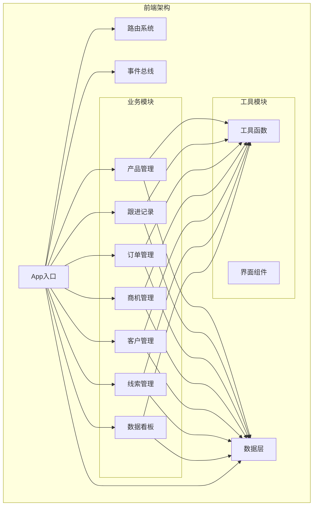
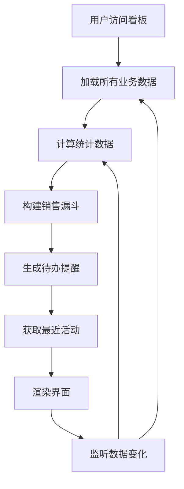
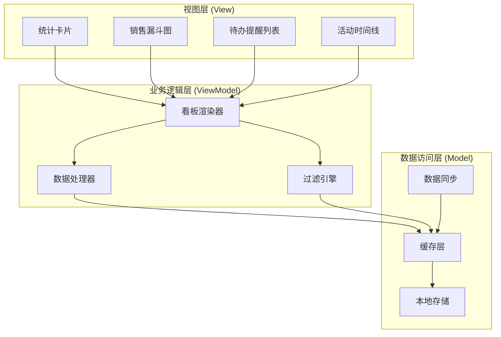
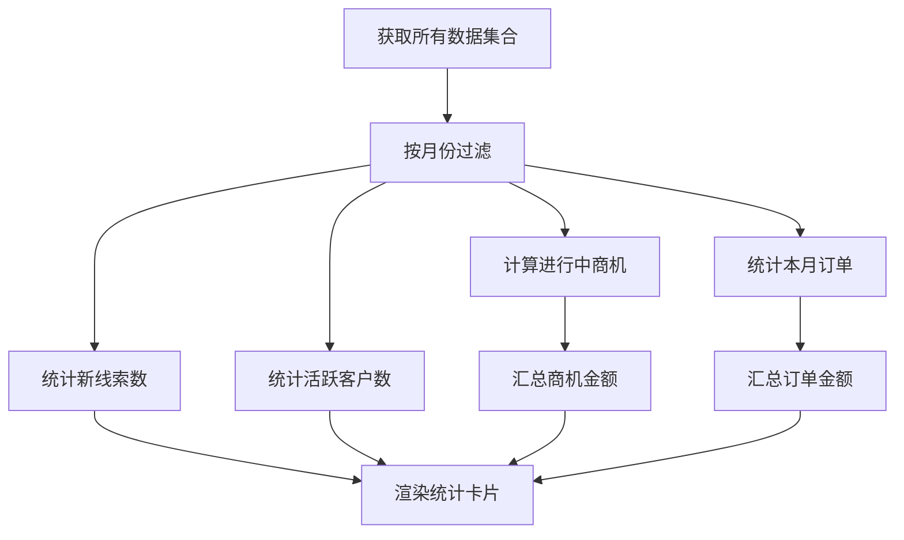
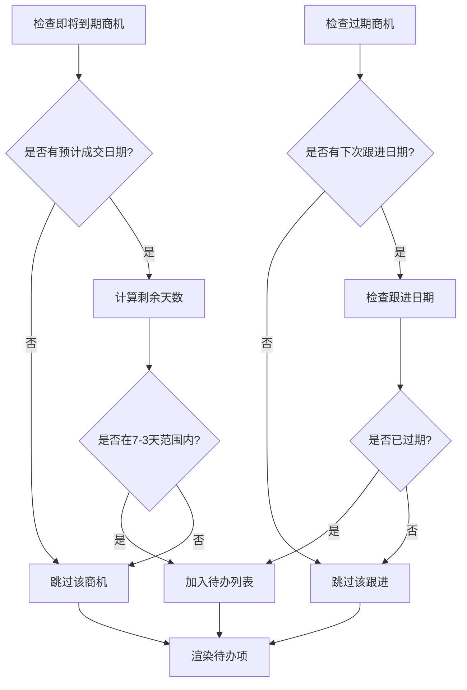
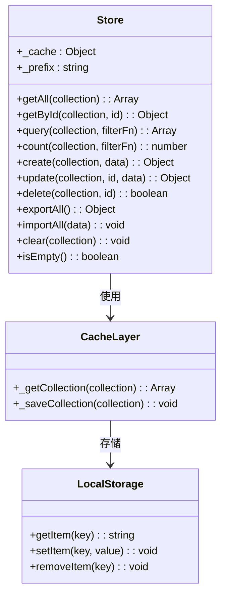
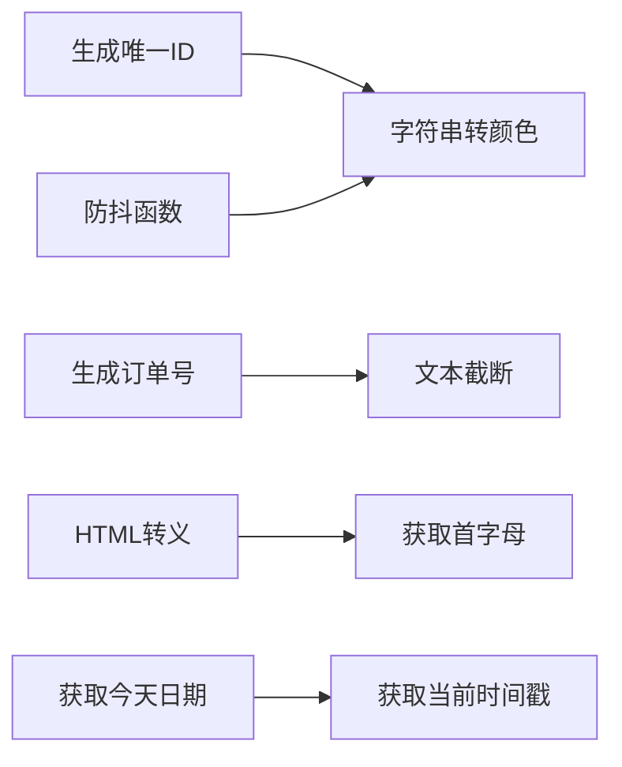
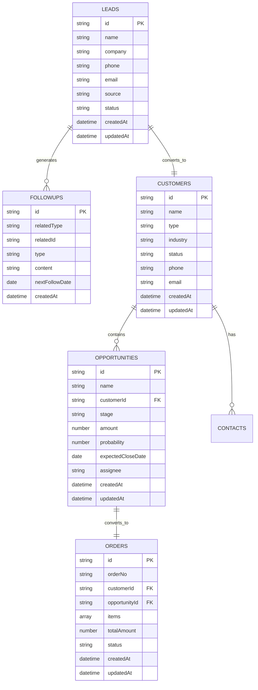
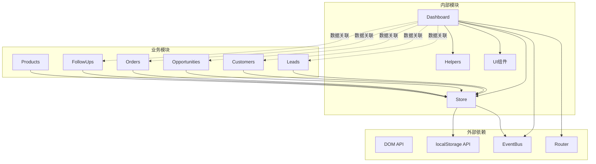

# 数据看板模块

<cite>
**本文档引用的文件**
- [dashboard.js](file://js/modules/dashboard.js)
- [store.js](file://js/store.js)
- [opportunities.js](file://js/modules/opportunities.js)
- [leads.js](file://js/modules/leads.js)
- [customers.js](file://js/modules/customers.js)
- [followups.js](file://js/modules/followups.js)
- [helpers.js](file://js/utils/helpers.js)
- [app.js](file://js/app.js)
- [router.js](file://js/router.js)
- [events.js](file://js/events.js)
- [seed.js](file://js/utils/seed.js)
</cite>

## 目录
1. [简介](#简介)
2. [项目结构](#项目结构)
3. [核心组件](#核心组件)
4. [架构概览](#架构概览)
5. [详细组件分析](#详细组件分析)
6. [依赖关系分析](#依赖关系分析)
7. [性能考虑](#性能考虑)
8. [故障排除指南](#故障排除指南)
9. [结论](#结论)

## 简介

数据看板模块是CRM系统的核心仪表板功能，为用户提供实时的销售数据概览和关键业务指标监控。该模块通过整合线索管理、客户管理、商机管理和订单管理等多个业务模块的数据，为销售团队提供全面的业务洞察。

数据看板的主要功能包括：
- **统计数据计算**：展示本月新线索数、活跃客户数、进行中商机数量和金额、本月成交额等关键指标
- **销售漏斗可视化**：直观显示销售流程各阶段的商机分布和金额统计
- **线索来源分布**：分析不同渠道获取线索的效果和占比
- **待办提醒系统**：智能识别过期和即将到期的商机，提醒销售人员及时跟进
- **最近活动追踪**：展示最新的跟进记录和业务动态

## 项目结构

CRM系统采用模块化架构设计，数据看板模块位于`js/modules/`目录下，与其它业务模块协同工作：

**图表来源**
- [app.js:1-41](file://js/app.js#L1-L41)
- [dashboard.js:1-220](file://js/modules/dashboard.js#L1-L220)

**章节来源**
- [app.js:1-41](file://js/app.js#L1-L41)
- [dashboard.js:1-220](file://js/modules/dashboard.js#L1-L220)

## 核心组件

数据看板模块由多个核心组件构成，每个组件负责特定的数据处理和展示功能：

### 主要组件职责

1. **Dashboard模块**：核心看板渲染器，负责数据聚合、统计计算和界面展示
2. **Store数据层**：提供统一的数据访问接口，支持本地存储和缓存
3. **Helpers工具函数**：提供格式化、日期处理、数据转换等通用功能
4. **Router路由系统**：管理页面导航和URL路由
5. **EventBus事件总线**：实现模块间通信和数据同步

### 数据流架构

**图表来源**
- [dashboard.js:6-220](file://js/modules/dashboard.js#L6-L220)

**章节来源**
- [dashboard.js:1-220](file://js/modules/dashboard.js#L1-L220)
- [store.js:1-139](file://js/store.js#L1-L139)

## 架构概览

数据看板模块采用MVVM架构模式，实现了清晰的分层设计：

**图表来源**
- [dashboard.js:1-220](file://js/modules/dashboard.js#L1-L220)
- [store.js:1-139](file://js/store.js#L1-L139)

### 核心设计原则

1. **单一职责原则**：每个模块专注于特定的功能领域
2. **开闭原则**：模块设计允许扩展而不修改现有代码
3. **依赖倒置**：高层模块不依赖低层模块的具体实现
4. **接口隔离**：提供清晰的API接口供其他模块调用

## 详细组件分析

### 数据看板渲染器 (Dashboard)

Dashboard模块是数据看板的核心，负责所有数据的收集、计算和展示：

#### 统计数据计算

**图表来源**
- [dashboard.js:15-25](file://js/modules/dashboard.js#L15-L25)

#### 销售漏斗实现

销售漏斗通过固定的标准阶段来展示销售流程的进展：

| 阶段 | 描述 | 颜色 |
|------|------|------|
| 初步沟通 | 初次接触潜在客户 | 主色调 |
| 需求确认 | 确认客户需求和痛点 | 浅主色调 |
| 方案报价 | 提供解决方案和报价 | 信息色 |
| 商务谈判 | 双方协商合同条款 | 警告色 |
| 赢单 | 成功达成交易 | 成功色 |

#### 待办提醒算法

待办提醒系统采用双重判断逻辑：

**图表来源**
- [dashboard.js:35-44](file://js/modules/dashboard.js#L35-L44)

**章节来源**
- [dashboard.js:1-220](file://js/modules/dashboard.js#L1-L220)

### 数据存储层 (Store)

Store模块提供了统一的数据访问接口，支持本地存储和缓存机制：

#### 数据持久化策略

**图表来源**
- [store.js:1-139](file://js/store.js#L1-L139)

#### 性能优化特性

1. **缓存机制**：避免重复读取localStorage
2. **批量操作**：支持数据的批量创建、更新和删除
3. **事件驱动**：通过EventBus实现数据变更通知
4. **内存管理**：合理控制缓存大小，避免内存泄漏

**章节来源**
- [store.js:1-139](file://js/store.js#L1-L139)

### 工具函数库 (Helpers)

Helpers模块提供了丰富的工具函数，支撑整个系统的数据处理需求：

#### 格式化功能

| 函数 | 功能 | 示例输出 |
|------|------|----------|
| formatMoney | 金额格式化 | ¥123,456.78 |
| formatMoneyShort | 简短金额格式化 | ¥12.3万 |
| formatDate | 日期格式化 | 2024-01-15 |
| formatRelativeTime | 相对时间格式化 | 2小时前 |

#### 实用工具

**图表来源**
- [helpers.js:1-113](file://js/utils/helpers.js#L1-L113)

**章节来源**
- [helpers.js:1-113](file://js/utils/helpers.js#L1-L113)

### 业务模块集成

数据看板模块与各个业务模块深度集成，实现数据的统一管理和展示：

#### 数据关联关系

**图表来源**
- [leads.js:1-286](file://js/modules/leads.js#L1-L286)
- [customers.js:1-229](file://js/modules/customers.js#L1-L229)
- [opportunities.js:1-485](file://js/modules/opportunities.js#L1-L485)
- [followups.js:1-189](file://js/modules/followups.js#L1-L189)

**章节来源**
- [leads.js:1-286](file://js/modules/leads.js#L1-L286)
- [customers.js:1-229](file://js/modules/customers.js#L1-L229)
- [opportunities.js:1-485](file://js/modules/opportunities.js#L1-L485)
- [followups.js:1-189](file://js/modules/followups.js#L1-L189)

## 依赖关系分析

数据看板模块的依赖关系体现了清晰的分层架构：

**图表来源**
- [dashboard.js:1-220](file://js/modules/dashboard.js#L1-L220)
- [store.js:1-139](file://js/store.js#L1-L139)
- [events.js:1-36](file://js/events.js#L1-L36)
- [router.js:1-62](file://js/router.js#L1-L62)

### 模块耦合度分析

| 模块 | 耦合度 | 说明 |
|------|--------|------|
| Dashboard | 中等 | 依赖Store和Helpers，但保持独立性 |
| Store | 低 | 纯数据层，无业务逻辑依赖 |
| Helpers | 低 | 工具函数，无外部依赖 |
| 业务模块 | 中等 | 与Dashboard存在数据关联，但相互独立 |

### 循环依赖检测

系统采用单向依赖结构，避免了循环依赖问题：
- Dashboard → Store → EventBus
- 业务模块之间通过Store进行数据交互
- UI组件与业务逻辑分离

**章节来源**
- [dashboard.js:1-220](file://js/modules/dashboard.js#L1-L220)
- [store.js:1-139](file://js/store.js#L1-L139)
- [events.js:1-36](file://js/events.js#L1-L36)

## 性能考虑

数据看板模块在设计时充分考虑了性能优化：

### 内存管理

1. **缓存策略**：Store模块使用内存缓存减少localStorage访问频率
2. **懒加载**：统计数据按需计算，避免不必要的数据处理
3. **垃圾回收**：及时清理DOM事件监听器和定时器

### 计算优化

1. **批量处理**：使用数组方法进行批量数据处理
2. **算法复杂度**：主要使用O(n)算法，适合大数据量场景
3. **条件过滤**：先过滤再计算，减少数据处理量

### 用户体验优化

1. **防抖机制**：输入搜索使用防抖，提升响应速度
2. **增量更新**：数据变更时只更新相关区域
3. **异步加载**：大型数据集采用异步处理

## 故障排除指南

### 常见问题及解决方案

#### 数据显示异常

**问题**：看板数据显示为空或不正确
**原因**：
1. localStorage存储空间不足
2. 数据格式不符合预期
3. 缓存数据损坏

**解决方案**：
1. 检查浏览器localStorage容量
2. 重置演示数据
3. 清空缓存后重新加载

#### 性能问题

**问题**：看板加载缓慢
**原因**：
1. 数据量过大
2. 频繁的数据变更
3. DOM操作过多

**解决方案**：
1. 分页加载大量数据
2. 减少不必要的数据刷新
3. 优化DOM操作

#### 事件监听问题

**问题**：数据变更后看板不更新
**原因**：
1. 事件订阅失败
2. 路由监听器未注册
3. 作用域问题

**解决方案**：
1. 检查EventBus订阅状态
2. 确认路由初始化顺序
3. 使用正确的事件命名空间

**章节来源**
- [store.js:23-30](file://js/store.js#L23-L30)
- [dashboard.js:211-218](file://js/modules/dashboard.js#L211-L218)

## 结论

数据看板模块作为CRM系统的核心仪表板，成功实现了以下目标：

### 技术成就

1. **模块化设计**：清晰的分层架构，便于维护和扩展
2. **数据集成**：有效整合多业务模块的数据，提供统一视图
3. **性能优化**：合理的缓存策略和计算优化，确保流畅体验
4. **用户体验**：直观的可视化展示和智能提醒功能

### 业务价值

1. **决策支持**：提供实时的业务指标，辅助管理层决策
2. **效率提升**：通过待办提醒和活动追踪，提高销售效率
3. **透明度增强**：销售流程的可视化，提升团队协作效果
4. **数据驱动**：基于实际数据的业务分析和预测

### 扩展建议

1. **实时数据**：考虑WebSocket实现实时数据更新
2. **移动端适配**：优化移动端的看板布局和交互
3. **自定义指标**：允许用户自定义关注的业务指标
4. **报表导出**：支持看板数据的导出和分享功能

数据看板模块为CRM系统的成功奠定了坚实基础，通过持续的优化和扩展，将进一步提升用户的业务管理水平。