# 核心业务模块

<cite>
**本文引用的文件**
- [js/app.js](file://js/app.js)
- [js/router.js](file://js/router.js)
- [js/events.js](file://js/events.js)
- [js/store.js](file://js/store.js)
- [js/ui.js](file://js/ui.js)
- [js/components.js](file://js/components.js)
- [js/utils/helpers.js](file://js/utils/helpers.js)
- [js/modules/dashboard.js](file://js/modules/dashboard.js)
- [js/modules/leads.js](file://js/modules/leads.js)
- [js/modules/customers.js](file://js/modules/customers.js)
- [js/modules/opportunities.js](file://js/modules/opportunities.js)
- [js/modules/orders.js](file://js/modules/orders.js)
- [js/modules/followups.js](file://js/modules/followups.js)
- [js/modules/contacts.js](file://js/modules/contacts.js)
- [js/modules/products.js](file://js/modules/products.js)
</cite>

## 目录
1. [简介](#简介)
2. [项目结构](#项目结构)
3. [核心组件](#核心组件)
4. [架构总览](#架构总览)
5. [详细组件分析](#详细组件分析)
6. [依赖分析](#依赖分析)
7. [性能考虑](#性能考虑)
8. [故障排查指南](#故障排查指南)
9. [结论](#结论)
10. [附录](#附录)

## 简介
本文件面向CRM系统的核心业务模块，围绕数据看板、线索管理、客户管理、商机管理、订单管理、跟进记录、联系人管理和产品管理八大模块，系统阐述其功能职责、业务价值与使用场景，解析模块间的数据关联与业务流程衔接，并提供模块功能概览图与业务流程图，说明扩展性设计与自定义能力，以及模块集成的最佳实践与注意事项。

## 项目结构
系统采用“模块化+单页应用”的前端架构，核心由以下层次组成：
- 应用入口与生命周期：负责初始化种子数据、注册模块、绑定导航与搜索、启动路由与事件总线。
- 路由系统：基于hash路由，支持动态参数与路由变更事件。
- 事件总线：统一发布订阅机制，驱动模块间松耦合联动。
- 数据层：基于localStorage的本地持久化，提供CRUD与批量导出/导入/清空能力。
- UI与组件：提供通用UI工具、表单构建器、模态框、Toast提示、数据表格、标签页等组件。
- 业务模块：八大核心模块各自封装视图渲染、交互逻辑与数据操作。

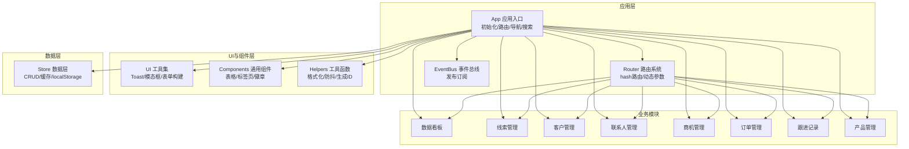

图表来源
- [js/app.js:6-41](file://js/app.js#L6-L41)
- [js/router.js:8-36](file://js/router.js#L8-L36)
- [js/events.js:7-30](file://js/events.js#L7-L30)
- [js/store.js:54-96](file://js/store.js#L54-L96)
- [js/ui.js:48-191](file://js/ui.js#L48-L191)
- [js/components.js:7-271](file://js/components.js#L7-L271)
- [js/utils/helpers.js:6-112](file://js/utils/helpers.js#L6-L112)

章节来源
- [js/app.js:6-41](file://js/app.js#L6-L41)
- [js/router.js:8-36](file://js/router.js#L8-L36)
- [js/events.js:7-30](file://js/events.js#L7-L30)
- [js/store.js:54-96](file://js/store.js#L54-L96)
- [js/ui.js:48-191](file://js/ui.js#L48-L191)
- [js/components.js:7-271](file://js/components.js#L7-L271)
- [js/utils/helpers.js:6-112](file://js/utils/helpers.js#L6-L112)

## 核心组件
- 应用入口 App：负责模块初始化、导航绑定、全局搜索、移动端侧边栏、路由启动与导航高亮更新。
- 路由 Router：注册hash路由模式，支持动态参数，监听hash变化并触发对应模块渲染。
- 事件总线 EventBus：提供on/off/emit/clear，支持通配符事件，驱动跨模块联动（如数据变更广播）。
- 数据层 Store：提供集合缓存、CRUD、查询、计数、导出/导入/清空，写入localStorage并发出数据变更事件。
- UI 工具 UI：提供Toast、模态框、确认框、表单构建器、面包屑、内容渲染等。
- 通用组件 Components：数据表格、徽章、详情卡片、标签页等，支持搜索、排序、分页、筛选。
- 工具函数 Helpers：ID生成、日期/时间/相对时间格式化、金额格式化、订单号生成、防抖、截断、HTML转义、颜色哈希、今日与当前时间等。

章节来源
- [js/app.js:43-61](file://js/app.js#L43-L61)
- [js/router.js:8-36](file://js/router.js#L8-L36)
- [js/events.js:7-30](file://js/events.js#L7-L30)
- [js/store.js:54-96](file://js/store.js#L54-L96)
- [js/ui.js:48-191](file://js/ui.js#L48-L191)
- [js/components.js:7-271](file://js/components.js#L7-L271)
- [js/utils/helpers.js:6-112](file://js/utils/helpers.js#L6-L112)

## 架构总览
系统通过App统一调度，Router根据hash路由分发到具体模块；模块内部通过Store访问数据，UI/Components提供一致的交互体验；EventBus在数据变更时广播事件，实现模块间松耦合联动；Helpers与UI/Components为模块提供通用能力支撑。

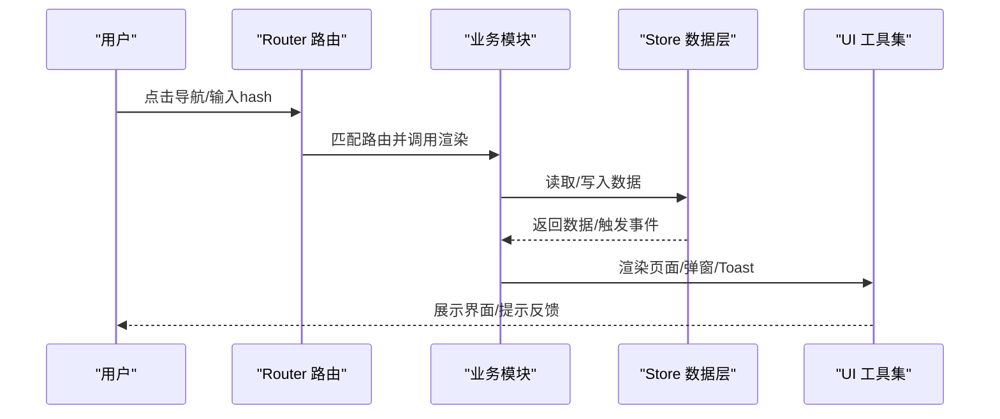

图表来源
- [js/router.js:22-36](file://js/router.js#L22-L36)
- [js/store.js:54-96](file://js/store.js#L54-L96)
- [js/ui.js:48-191](file://js/ui.js#L48-L191)

## 详细组件分析

### 数据看板模块（Dashboard）
- 职责与价值
  - 汇总线索、客户、商机、订单、跟进等关键指标，形成销售数据概览。
  - 提供销售漏斗、线索来源分布、待办提醒、最近活动等可视化视图，辅助决策。
- 关键流程
  - 读取全量数据，按时间与状态聚合统计。
  - 计算漏斗阶段数量与金额，生成来源分布柱状图。
  - 识别今日待办与即将到期商机，展示最近跟进活动。
  - 支持卡片点击跳转与刷新按钮。
- 与其他模块的关系
  - 依赖Store读取leads/customers/opportunities/orders/followups。
  - 通过Router与UI协作实现导航与渲染。
- 扩展性与自定义
  - 可新增统计维度（如按负责人/地区）。
  - 可替换图表类型或增加更多KPI卡片。

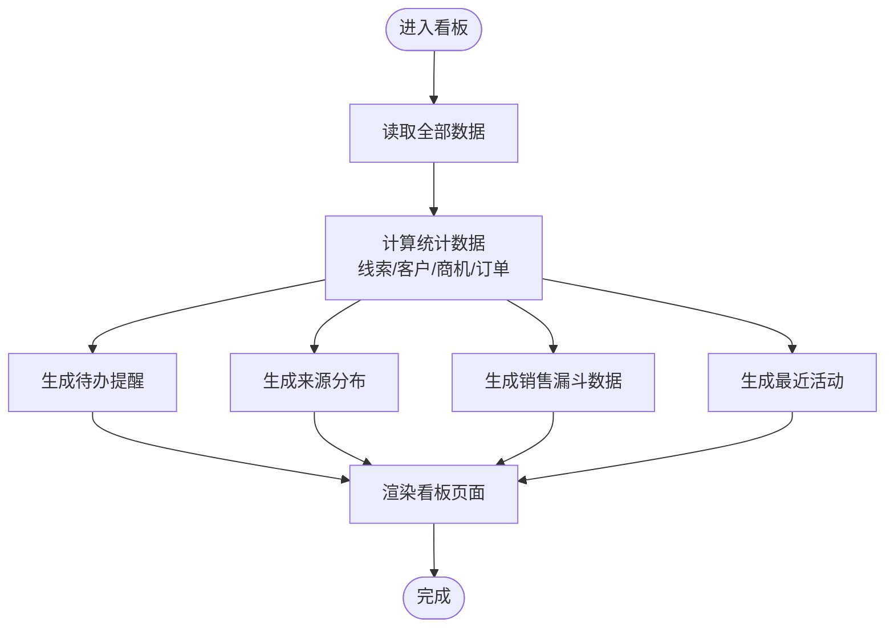

图表来源
- [js/modules/dashboard.js:9-209](file://js/modules/dashboard.js#L9-L209)

章节来源
- [js/modules/dashboard.js:4-220](file://js/modules/dashboard.js#L4-L220)

### 线索管理模块（Leads）
- 职责与价值
  - 管理潜在客户线索，支持状态流转与转化。
  - 提供线索列表、详情、跟进记录、转化客户等功能。
- 关键流程
  - 列表页：支持按状态过滤、搜索、排序、行点击查看详情。
  - 详情页：展示基本信息与跟进记录，支持编辑、删除、转化。
  - 转化流程：将线索转化为客户，自动创建联系人与跟进记录。
- 与其他模块的关系
  - 与Customers：转化后建立关联并创建联系人。
  - 与FollowUps：每次状态变更/转化均产生跟进记录。
- 扩展性与自定义
  - 可扩展状态枚举与来源映射。
  - 可增加线索评分/分配策略。

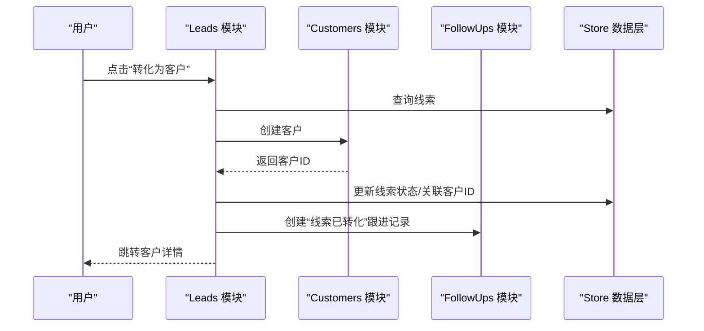

图表来源
- [js/modules/leads.js:198-279](file://js/modules/leads.js#L198-L279)
- [js/modules/customers.js:184-206](file://js/modules/customers.js#L184-L206)
- [js/modules/followups.js:118-154](file://js/modules/followups.js#L118-L154)

章节来源
- [js/modules/leads.js:4-286](file://js/modules/leads.js#L4-L286)

### 客户管理模块（Customers）
- 职责与价值
  - 维护客户档案与关系，支持客户状态管理与关联资源查看。
- 关键流程
  - 列表页：按状态过滤、搜索、排序，快速定位客户。
  - 详情页：基本信息、联系人、商机、订单、跟进记录五个标签页。
  - 支持新建商机、编辑、删除。
- 与其他模块的关系
  - 与Contacts：一对多关系，支持子列表展示与增删改。
  - 与Opportunities/Orders：作为商机/订单的关联对象。
- 扩展性与自定义
  - 可扩展客户类型、行业、规模等字段。
  - 可增加客户画像/标签体系。

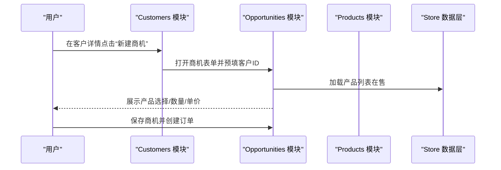

图表来源
- [js/modules/customers.js:177-179](file://js/modules/customers.js#L177-L179)
- [js/modules/opportunities.js:277-301](file://js/modules/opportunities.js#L277-L301)
- [js/modules/products.js:22-75](file://js/modules/products.js#L22-L75)

章节来源
- [js/modules/customers.js:4-229](file://js/modules/customers.js#L4-L229)

### 商机管理模块（Opportunities）
- 职责与价值
  - 管理销售机会，跟踪阶段推进与赢单/输单结果。
- 关键流程
  - 列表页：按阶段过滤、搜索、排序，展示金额与概率。
  - 详情页：阶段进度条、阶段切换、标记赢单/输单、跟进记录。
  - 赢单流程：弹窗创建订单，填充产品明细，生成订单并更新商机状态。
- 与其他模块的关系
  - 与Customers：一对一关联。
  - 与Orders：赢单后创建订单并建立关联。
  - 与Products：订单明细引用产品。
  - 与FollowUps：阶段推进与标记输赢均产生跟进记录。
- 扩展性与自定义
  - 可扩展阶段枚举与概率映射。
  - 可增加机会评分/预测模型。

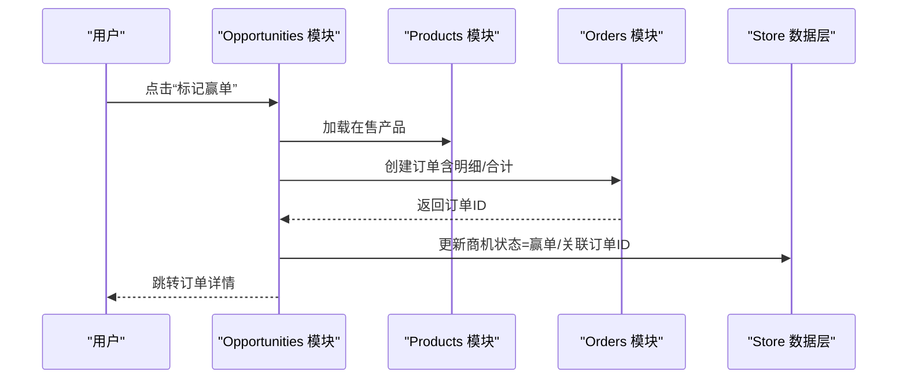

图表来源
- [js/modules/opportunities.js:303-462](file://js/modules/opportunities.js#L303-L462)
- [js/modules/products.js:22-75](file://js/modules/products.js#L22-L75)
- [js/modules/orders.js:182-211](file://js/modules/orders.js#L182-L211)

章节来源
- [js/modules/opportunities.js:4-485](file://js/modules/opportunities.js#L4-L485)

### 订单管理模块（Orders）
- 职责与价值
  - 管理销售订单，跟踪状态流转与明细构成。
- 关键流程
  - 列表页：按状态过滤、搜索、排序，展示订单号、客户、金额与状态。
  - 详情页：基本信息、订单明细、合计金额。
  - 支持编辑、删除。
- 与其他模块的关系
  - 与Customers：一对一关联。
  - 与Opportunities：可选来源关联。
  - 与Products：订单明细引用产品。
- 扩展性与自定义
  - 可扩展状态枚举与备注字段。
  - 可增加发票/回款跟踪。

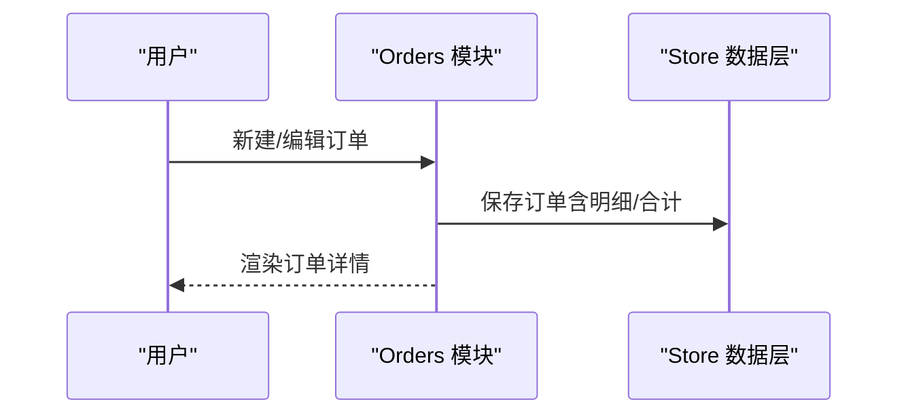

图表来源
- [js/modules/orders.js:15-78](file://js/modules/orders.js#L15-L78)
- [js/modules/orders.js:80-150](file://js/modules/orders.js#L80-L150)
- [js/modules/orders.js:182-211](file://js/modules/orders.js#L182-L211)

章节来源
- [js/modules/orders.js:4-234](file://js/modules/orders.js#L4-L234)

### 跟进记录模块（FollowUps）
- 职责与价值
  - 记录与线索、客户、商机相关的所有跟进活动，形成完整服务轨迹。
- 关键流程
  - 列表页：按关联类型/内容搜索、排序，展示下次跟进日期与时间线。
  - 时间线：在详情页内嵌展示，支持添加跟进。
  - 表单：支持选择关联类型与对象，或直接在详情页添加。
- 与其他模块的关系
  - 与Leads/Customers/Opportunities：三类关联对象。
  - 与UI：在各详情页内嵌展示。
- 扩展性与自定义
  - 可扩展跟进方式与关联类型。
  - 可增加提醒规则与到期标记。

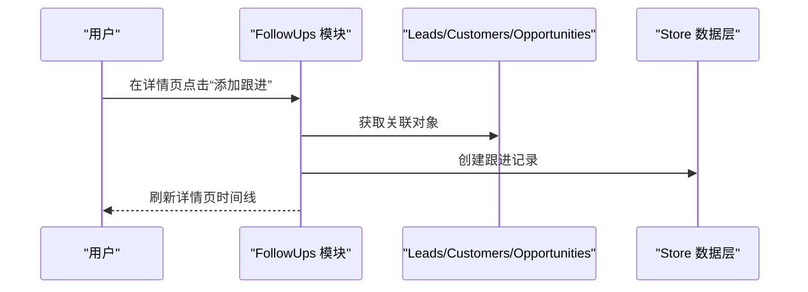

图表来源
- [js/modules/followups.js:79-116](file://js/modules/followups.js#L79-L116)
- [js/modules/followups.js:118-154](file://js/modules/followups.js#L118-L154)

章节来源
- [js/modules/followups.js:4-189](file://js/modules/followups.js#L4-L189)

### 联系人管理模块（Contacts）
- 职责与价值
  - 管理客户下的联系人，支持主联系人标识与快速拨号/邮件。
- 关键流程
  - 列表页：按姓名/职位/电话搜索，展示所属客户。
  - 子列表：在客户详情页展示联系人，支持增删改。
  - 表单：支持选择所属客户或在客户详情页直接添加。
- 与其他模块的关系
  - 与Customers：一对多关系。
- 扩展性与自定义
  - 可扩展职位、备注等字段。
  - 可增加联系人标签/角色。

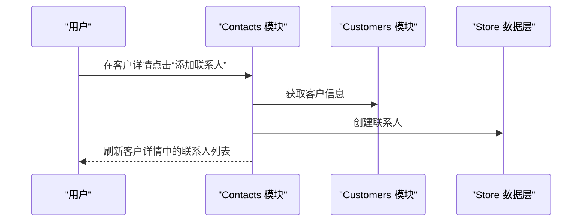

图表来源
- [js/modules/contacts.js:68-124](file://js/modules/contacts.js#L68-L124)
- [js/modules/contacts.js:126-162](file://js/modules/contacts.js#L126-L162)

章节来源
- [js/modules/contacts.js:4-185](file://js/modules/contacts.js#L4-L185)

### 产品管理模块（Products）
- 职责与价值
  - 维护产品目录与价格，支持在售/停售状态管理。
- 关键流程
  - 列表页：按名称/编码/分类搜索，展示单价与状态。
  - 详情页：展示产品基本信息。
  - 表单：支持新建/编辑。
- 与其他模块的关系
  - 与Orders：订单明细引用产品。
- 扩展性与自定义
  - 可扩展分类、单位、描述等字段。
  - 可增加图片/规格/库存等属性。

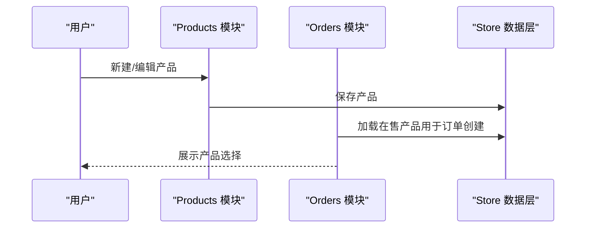

图表来源
- [js/modules/products.js:22-75](file://js/modules/products.js#L22-L75)
- [js/modules/products.js:77-124](file://js/modules/products.js#L77-L124)
- [js/modules/opportunities.js:308-332](file://js/modules/opportunities.js#L308-L332)

章节来源
- [js/modules/products.js:4-175](file://js/modules/products.js#L4-L175)

## 依赖分析
- 模块耦合与内聚
  - 各模块围绕自身领域模型内聚，通过Store与EventBus解耦。
  - Dashboard依赖多个模块的数据聚合，但不直接修改业务数据。
  - Leads与Customers、Opportunities与Orders之间存在强关联，体现销售闭环。
- 外部依赖与集成点
  - localStorage：持久化存储，支持导出/导入/清空。
  - UI/Components：统一交互风格与组件复用。
  - Helpers：提供跨模块共享的格式化与工具函数。
- 潜在循环依赖
  - 未发现直接循环依赖；EventBus提供通配符事件避免硬编码耦合。

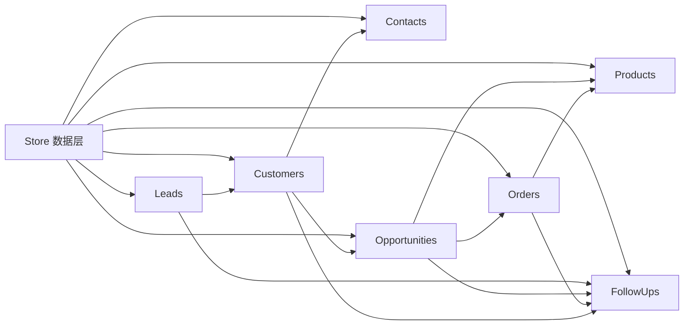

图表来源
- [js/store.js:54-96](file://js/store.js#L54-L96)
- [js/modules/leads.js:198-279](file://js/modules/leads.js#L198-L279)
- [js/modules/customers.js:148-172](file://js/modules/customers.js#L148-L172)
- [js/modules/opportunities.js:303-462](file://js/modules/opportunities.js#L303-L462)
- [js/modules/orders.js:182-211](file://js/modules/orders.js#L182-L211)
- [js/modules/followups.js:118-154](file://js/modules/followups.js#L118-L154)
- [js/modules/contacts.js:126-162](file://js/modules/contacts.js#L126-L162)
- [js/modules/products.js:22-75](file://js/modules/products.js#L22-L75)

章节来源
- [js/store.js:54-96](file://js/store.js#L54-L96)
- [js/modules/leads.js:198-279](file://js/modules/leads.js#L198-L279)
- [js/modules/customers.js:148-172](file://js/modules/customers.js#L148-L172)
- [js/modules/opportunities.js:303-462](file://js/modules/opportunities.js#L303-L462)
- [js/modules/orders.js:182-211](file://js/modules/orders.js#L182-L211)
- [js/modules/followups.js:118-154](file://js/modules/followups.js#L118-L154)
- [js/modules/contacts.js:126-162](file://js/modules/contacts.js#L126-L162)
- [js/modules/products.js:22-75](file://js/modules/products.js#L22-L75)

## 性能考虑
- 数据访问与缓存
  - Store对集合进行内存缓存，减少localStorage频繁读写。
  - 大数据量时建议分页与懒加载，组件DataTable已内置分页与搜索防抖。
- 渲染优化
  - 使用UI.render统一渲染，避免重复DOM操作。
  - 列表页支持搜索防抖与排序，降低重排压力。
- 事件与联动
  - EventBus通配符事件避免过度监听，减少不必要的重绘。
- 存储与容量
  - localStorage容量有限，建议定期导出备份，避免超限导致写入失败。

## 故障排查指南
- 数据无法保存/丢失
  - 检查localStorage可用性与容量；Store写入失败会弹出Toast提示。
  - 若出现异常，可通过系统设置中的“清空数据/重置演示数据”恢复。
- 页面不刷新/路由不生效
  - 确认Router是否正确注册路由；hash变化后是否触发_resolve。
  - 检查EventBus是否正确发出"data:changed:*"事件以触发看板刷新。
- 表单校验失败
  - UI.formModal在getFormData阶段进行必填校验，失败会显示错误提示。
- 导入/导出异常
  - 导入需JSON格式；导出为完整数据集，包含settings。

章节来源
- [js/store.js:23-30](file://js/store.js#L23-L30)
- [js/ui.js:137-162](file://js/ui.js#L137-L162)
- [js/app.js:236-311](file://js/app.js#L236-L311)

## 结论
该CRM系统以模块化为核心，通过统一的路由、事件与数据层，实现了线索—客户—商机—订单的销售闭环管理；UI与组件提供一致的交互体验；扩展性强，便于按业务需求增加字段、流程与报表。建议在生产环境中结合后端数据库与权限体系，完善审计日志与数据安全策略。

## 附录
- 模块功能概览图（概念示意）
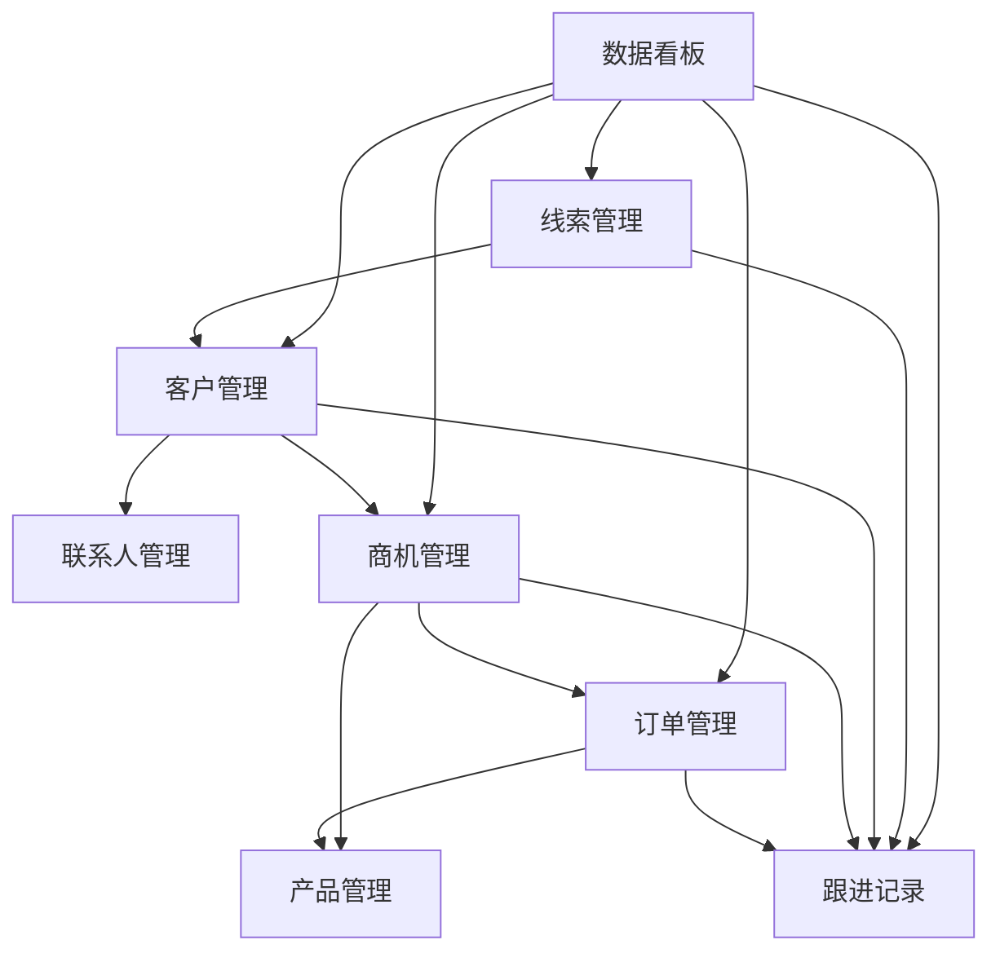

- 业务流程图（概念示意）
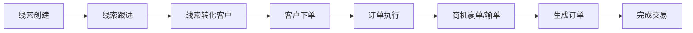