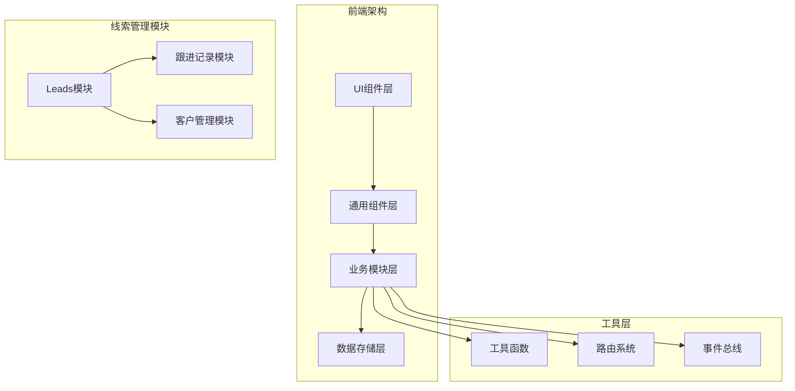
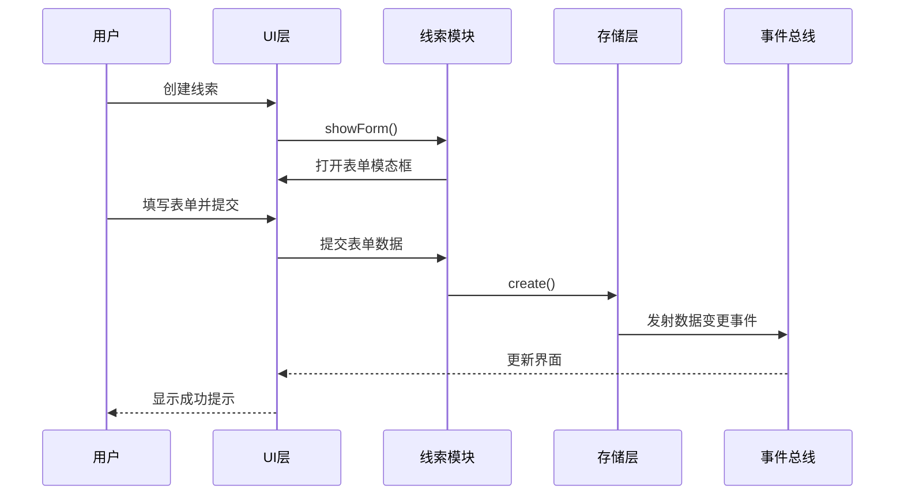
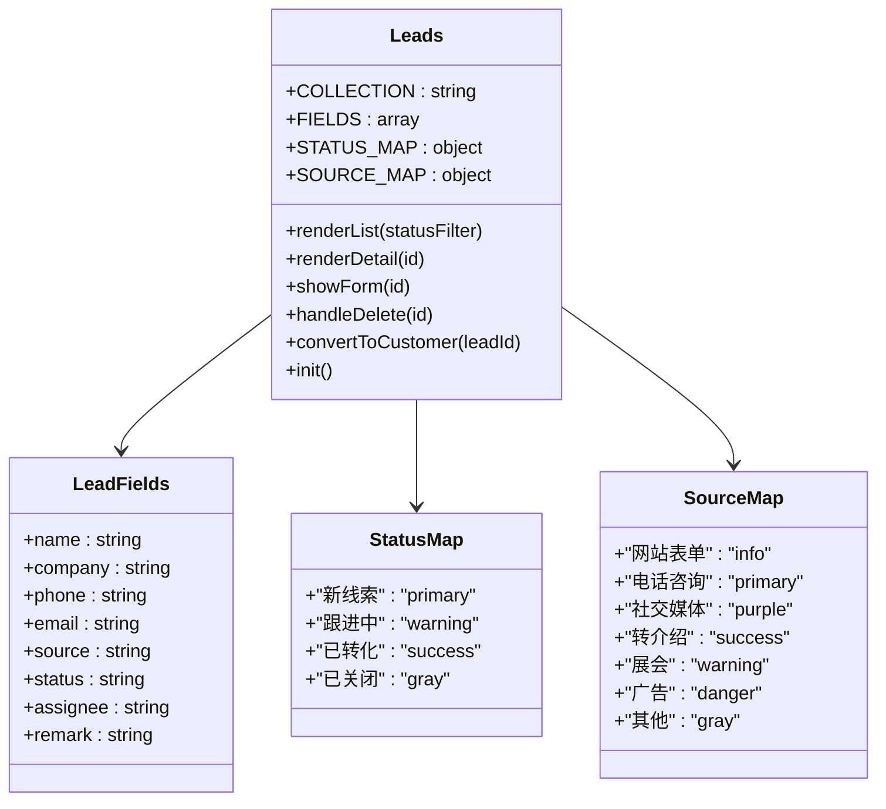
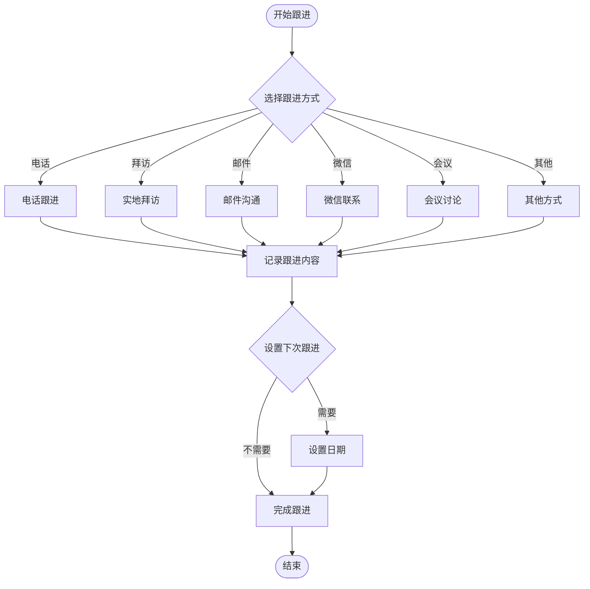
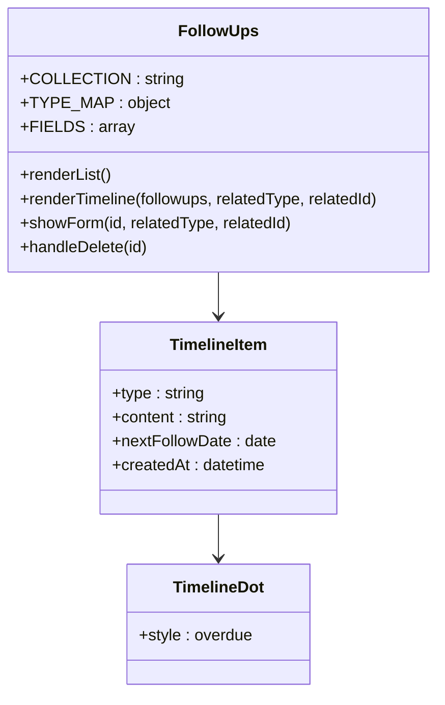
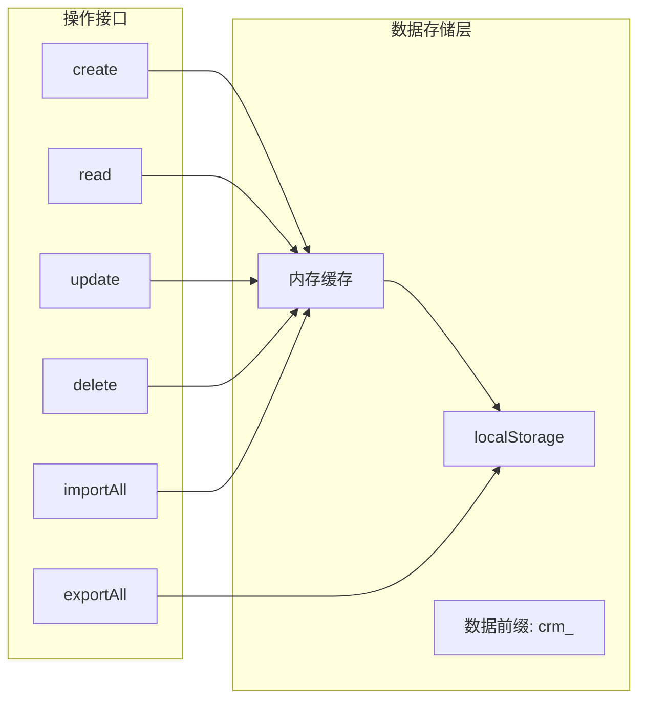
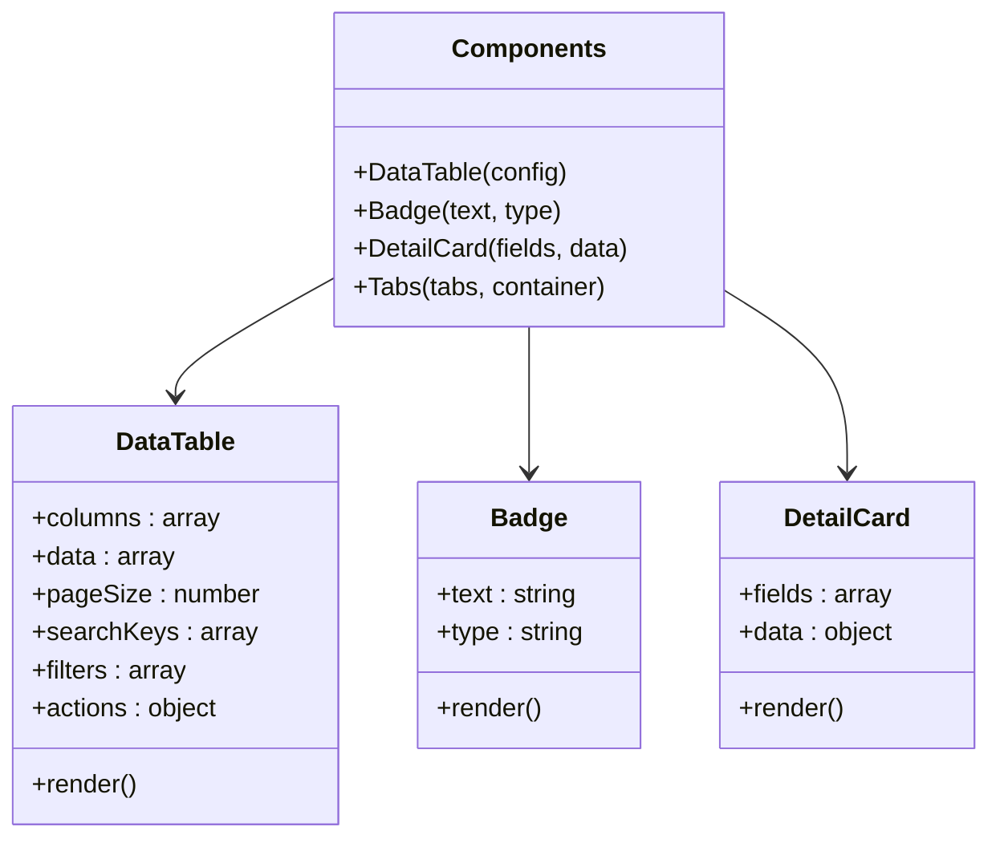
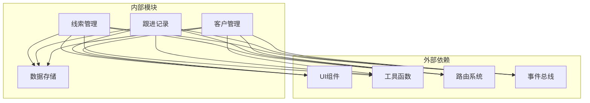
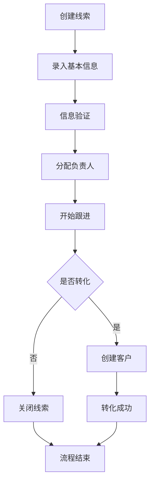
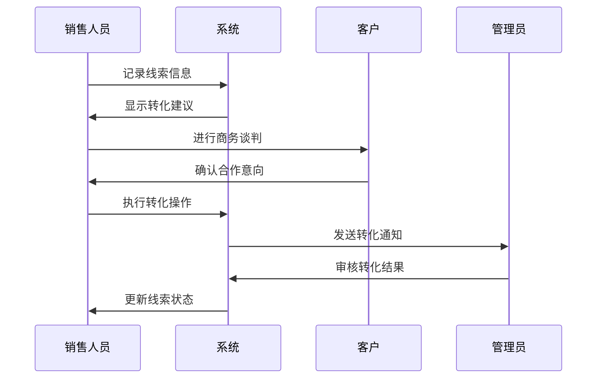

# 线索管理模块

<cite>
**本文档引用的文件**
- [leads.js](file://js/modules/leads.js)
- [followups.js](file://js/modules/followups.js)
- [store.js](file://js/store.js)
- [helpers.js](file://js/utils/helpers.js)
- [components.js](file://js/components.js)
- [ui.js](file://js/ui.js)
- [router.js](file://js/router.js)
- [events.js](file://js/events.js)
- [customers.js](file://js/modules/customers.js)
- [components.css](file://css/components.css)
- [pages.css](file://css/pages.css)
</cite>

## 目录
1. [简介](#简介)
2. [项目结构](#项目结构)
3. [核心组件](#核心组件)
4. [架构概览](#架构概览)
5. [详细组件分析](#详细组件分析)
6. [依赖关系分析](#依赖关系分析)
7. [性能考虑](#性能考虑)
8. [故障排除指南](#故障排除指南)
9. [最佳实践与业务流程](#最佳实践与业务流程)
10. [结论](#结论)

## 简介

线索管理模块是CRM系统中的核心功能模块，负责管理潜在客户的整个生命周期。该模块提供了完整的线索管理解决方案，包括线索创建、信息录入、状态跟踪、转化处理等功能。系统采用现代化的前端架构，使用本地存储技术实现数据持久化，提供直观的用户界面和流畅的用户体验。

## 项目结构

线索管理模块位于JavaScript模块化架构中，采用清晰的分层设计：

**图表来源**
- [leads.js:1-286](file://js/modules/leads.js#L1-L286)
- [followups.js:1-189](file://js/modules/followups.js#L1-L189)
- [store.js:1-139](file://js/store.js#L1-L139)

**章节来源**
- [leads.js:1-286](file://js/modules/leads.js#L1-L286)
- [store.js:1-139](file://js/store.js#L1-L139)

## 核心组件

线索管理模块包含以下核心组件：

### 线索管理组件
- **线索列表视图**：展示所有线索的表格界面，支持搜索、筛选、排序功能
- **线索详情视图**：显示线索的完整信息和相关操作
- **线索表单**：用于创建和编辑线索信息
- **状态管理**：维护线索的状态流转和颜色标识

### 跟进记录组件
- **跟进记录列表**：展示所有跟进活动的时间线
- **跟进表单**：记录各种形式的跟进活动
- **时间线渲染**：在详情页内嵌显示跟进历史

### 数据存储组件
- **本地存储**：基于localStorage的数据持久化
- **缓存机制**：提高数据访问性能
- **事件驱动**：通过事件总线实现模块间通信

**章节来源**
- [leads.js:7-19](file://js/modules/leads.js#L7-L19)
- [followups.js:7-13](file://js/modules/followups.js#L7-L13)
- [store.js:4-30](file://js/store.js#L4-L30)

## 架构概览

线索管理模块采用MVVM架构模式，通过模块化设计实现高内聚低耦合：

**图表来源**
- [leads.js:159-180](file://js/modules/leads.js#L159-L180)
- [store.js:53-67](file://js/store.js#L53-L67)
- [events.js:18-30](file://js/events.js#L18-L30)

**章节来源**
- [leads.js:281-286](file://js/modules/leads.js#L281-L286)
- [router.js:8-36](file://js/router.js#L8-L36)

## 详细组件分析

### 线索管理模块

#### 数据模型设计

线索模块定义了完整的数据模型和字段配置：

**图表来源**
- [leads.js:4-19](file://js/modules/leads.js#L4-L19)

#### 线索状态管理机制

系统实现了标准化的线索状态管理：

| 状态 | 颜色标识 | 描述 | 转换条件 |
|------|----------|------|----------|
| 新线索 | primary | 初次创建的潜在客户 | 需要进行初步沟通 |
| 跟进中 | warning | 正在进行沟通和跟进 | 需要持续跟进 |
| 已转化 | success | 成功转化为客户 | 完成转化流程 |
| 已关闭 | gray | 失败或放弃的线索 | 不再跟进 |

#### 线索来源分类系统

系统支持多种线索来源类型：

| 来源类型 | 颜色标识 | 适用场景 | 管理特点 |
|----------|----------|----------|----------|
| 网站表单 | info | 在线注册、咨询表单 | 自动收集，质量较高 |
| 电话咨询 | primary | 客服热线、销售来电 | 即时性强，信息完整 |
| 社交媒体 | purple | 微信、微博、LinkedIn | 互动性强，转化率高 |
| 转介绍 | success | 现有客户推荐 | 口碑传播，信任度高 |
| 展会 | warning | 行业展会、会议 | 集中获取，批量处理 |
| 广告 | danger | 搜索引擎、社交媒体广告 | 投入产出比评估 |
| 其他 | gray | 其他渠道 | 灵活多样，需要规范 |

**章节来源**
- [leads.js:7-19](file://js/modules/leads.js#L7-L19)

### 跟进记录模块

#### 跟进方式管理

跟进记录模块提供了全面的跟进方式支持：

**图表来源**
- [followups.js:9-13](file://js/modules/followups.js#L9-L13)

#### 时间线展示机制

系统采用时间线方式展示跟进历史：

**图表来源**
- [followups.js:79-116](file://js/modules/followups.js#L79-L116)

**章节来源**
- [followups.js:79-116](file://js/modules/followups.js#L79-L116)

### 数据存储与缓存

#### 本地存储架构

系统采用localStorage作为主要数据存储：

**图表来源**
- [store.js:4-30](file://js/store.js#L4-L30)

#### 缓存策略

系统实现了智能缓存机制：

- **懒加载**：首次访问时才从localStorage读取数据
- **实时更新**：每次数据操作后立即更新缓存
- **持久化**：确保数据在页面刷新后仍然可用
- **错误处理**：提供数据读取失败的降级处理

**章节来源**
- [store.js:8-30](file://js/store.js#L8-L30)

### UI组件系统

#### 通用组件架构

系统提供了丰富的UI组件：

**图表来源**
- [components.js:6-271](file://js/components.js#L6-L271)

#### 表单验证机制

系统内置了完善的表单验证：

- **必填字段检查**：自动验证required属性
- **数据类型验证**：数字、邮箱等格式验证
- **错误提示**：友好的错误消息显示
- **实时反馈**：输入过程中的即时验证

**章节来源**
- [components.js:6-271](file://js/components.js#L6-L271)

## 依赖关系分析

线索管理模块的依赖关系如下：

**图表来源**
- [leads.js:1-286](file://js/modules/leads.js#L1-L286)
- [followups.js:1-189](file://js/modules/followups.js#L1-L189)

**章节来源**
- [leads.js:1-286](file://js/modules/leads.js#L1-L286)
- [followups.js:1-189](file://js/modules/followups.js#L1-L189)

## 性能考虑

### 数据访问优化

- **缓存机制**：避免重复的localStorage读取操作
- **分页加载**：大数据量时采用分页显示
- **防抖处理**：搜索和过滤操作使用防抖优化
- **增量更新**：只更新受影响的数据区域

### 内存管理

- **及时清理**：组件销毁时清理事件监听器
- **垃圾回收**：避免内存泄漏的DOM引用
- **虚拟滚动**：长列表采用虚拟滚动技术

### 网络优化

- **本地存储**：完全基于客户端存储，无需网络请求
- **离线支持**：支持离线环境下的数据操作
- **数据压缩**：合理控制数据存储大小

## 故障排除指南

### 常见问题及解决方案

#### 数据丢失问题
**症状**：页面刷新后数据消失
**原因**：localStorage存储空间不足或浏览器隐私设置
**解决**：检查浏览器存储权限，清理不必要的数据

#### 界面显示异常
**症状**：表格显示错位或样式异常
**原因**：CSS样式冲突或组件初始化失败
**解决**：检查样式文件加载，确认组件正确初始化

#### 表单验证失败
**症状**：表单提交时报验证错误
**解决**：检查必填字段是否填写完整，确认数据格式正确

#### 路由跳转问题
**症状**：点击链接无法跳转到目标页面
**解决**：检查路由配置，确认URL格式正确

**章节来源**
- [store.js:24-29](file://js/store.js#L24-L29)
- [ui.js:48-78](file://js/ui.js#L48-L78)

## 最佳实践与业务流程

### 线索生命周期管理

#### 新线索创建流程

#### 线索状态转换规则

| 当前状态 | 可转换状态 | 触发条件 | 管理建议 |
|----------|------------|----------|----------|
| 新线索 | 跟进中 | 完成初次沟通 | 及时记录沟通要点 |
| 跟进中 | 已转化 | 达成合作意向 | 准备转化材料 |
| 跟进中 | 已关闭 | 无合作意向 | 归档处理 |
| 已转化 | 活跃 | 正常业务往来 | 持续维护关系 |
| 已转化 | 流失 | 长期无业务 | 分析流失原因 |

#### 线索分配策略

**按区域分配**：
- 根据客户地理位置分配相应区域负责人
- 考虑语言和文化差异因素

**按能力分配**：
- 将复杂项目分配给资深销售人员
- 新手销售人员负责简单项目

**按专业分配**：
- 不同行业分配给相应行业专家
- 提升转化成功率

#### 跟进记录最佳实践

**跟进频率**：
- 新线索：每周至少1次跟进
- 跟进中：每2-3天1次跟进
- 已转化：定期回访维护

**记录规范**：
- 详细记录沟通内容和结果
- 明确下次跟进时间和目标
- 保存重要决策和时间节点

**提醒机制**：
- 设置自动提醒功能
- 避免错过重要的跟进时机
- 建立跟进计划和优先级

### 业务流程优化

#### 转化流程管理

#### 数据质量管理

**数据完整性**：
- 确保关键字段完整填写
- 定期检查数据准确性
- 建立数据审核机制

**数据一致性**：
- 统一数据格式标准
- 避免重复数据录入
- 建立数据去重机制

**数据安全**：
- 保护客户隐私信息
- 控制数据访问权限
- 建立数据备份机制

### 系统集成建议

#### 与其他模块的协作

**与客户管理的集成**：
- 线索转化后自动创建客户档案
- 同步联系人信息和历史记录
- 维护客户关系的连续性

**与商机管理的集成**：
- 重要线索可直接升级为商机
- 跟进记录自动同步到商机跟踪
- 实现销售漏斗的完整管理

**与订单管理的集成**：
- 客户转化后可直接创建订单
- 跟进记录作为订单背景资料
- 支持订单执行过程的跟踪

#### 报表分析功能

**关键指标监控**：
- 线索转化率统计
- 各渠道效果对比
- 销售周期分析
- 员工绩效评估

**趋势分析**：
- 线索来源分布变化
- 转化效率趋势
- 季节性波动分析
- 市场机会识别

**决策支持**：
- 基于数据的业务决策
- 营销策略调整建议
- 资源配置优化方案
- 风险预警机制

通过以上完整的线索管理解决方案，系统能够有效支撑企业的销售管理工作，提升线索转化效率，优化客户关系管理，为企业创造更大的商业价值。