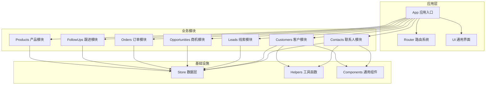
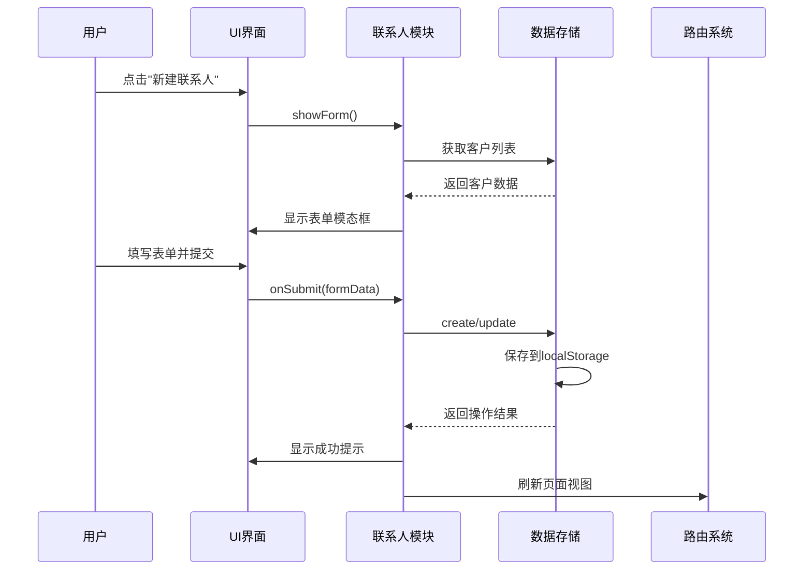
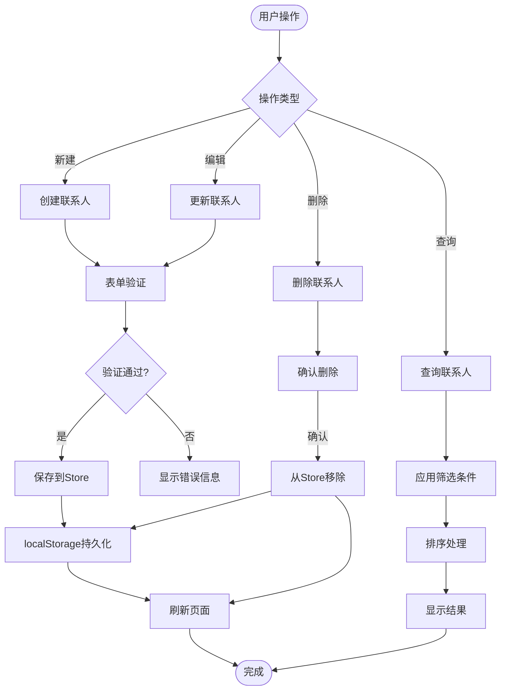
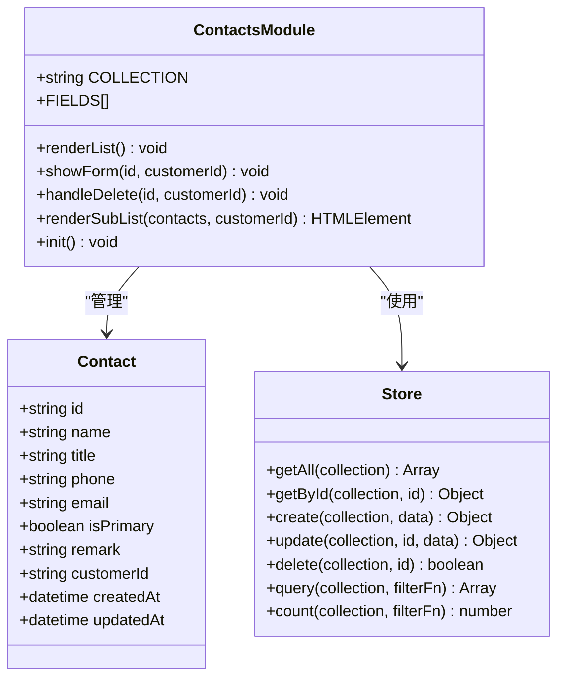
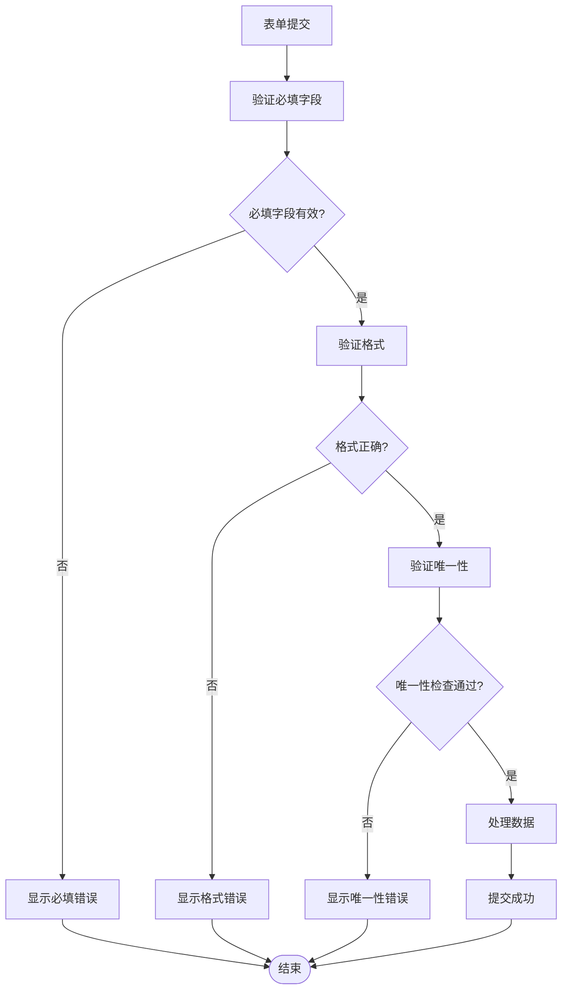
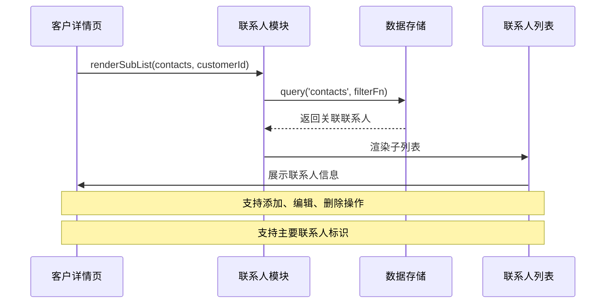
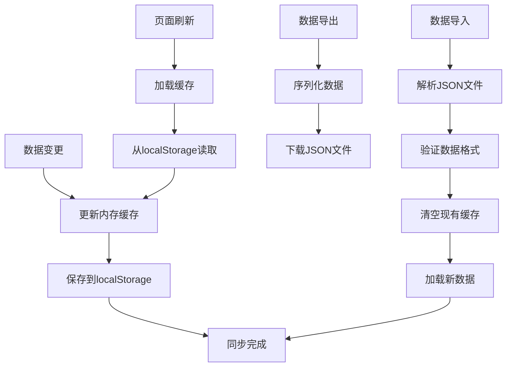
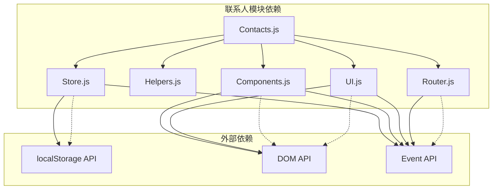

# 联系人管理模块

<cite>
**本文档引用的文件**
- [contacts.js](file://js/modules/contacts.js)
- [customers.js](file://js/modules/customers.js)
- [store.js](file://js/store.js)
- [app.js](file://js/app.js)
- [helpers.js](file://js/utils/helpers.js)
- [components.js](file://js/components.js)
- [router.js](file://js/router.js)
- [ui.js](file://js/ui.js)
- [seed.js](file://js/utils/seed.js)
- [base.css](file://css/base.css)
- [pages.css](file://css/pages.css)
</cite>

## 目录
1. [简介](#简介)
2. [项目结构](#项目结构)
3. [核心组件](#核心组件)
4. [架构概览](#架构概览)
5. [详细组件分析](#详细组件分析)
6. [依赖关系分析](#依赖关系分析)
7. [性能考虑](#性能考虑)
8. [故障排除指南](#故障排除指南)
9. [结论](#结论)

## 简介

联系人管理模块是CRM系统中的核心功能模块之一，负责管理客户联系人的完整生命周期。该模块提供了完整的联系人信息维护、职位管理、联系方式配置、部门归属等功能，支持联系人与客户的关系管理，包括主要联系人标识、联系人角色分配等高级功能。

本模块采用现代化的前端架构设计，基于本地存储的数据持久化方案，实现了响应式的用户界面和流畅的用户体验。通过模块化的代码组织和清晰的职责分离，确保了系统的可维护性和扩展性。

## 项目结构

CRM系统采用模块化架构设计，联系人管理模块位于`js/modules/`目录下，与其他核心模块协同工作：

**图表来源**
- [app.js:1-50](file://js/app.js#L1-L50)
- [contacts.js:1-20](file://js/modules/contacts.js#L1-L20)
- [customers.js:1-20](file://js/modules/customers.js#L1-L20)

**章节来源**
- [app.js:1-50](file://js/app.js#L1-L50)
- [contacts.js:1-20](file://js/modules/contacts.js#L1-L20)
- [customers.js:1-20](file://js/modules/customers.js#L1-L20)

## 核心组件

联系人管理模块包含以下核心组件：

### 数据模型定义

联系人数据模型采用灵活的字段配置系统，支持多种数据类型的输入和验证：

| 字段键名 | 标签名 | 类型 | 必填 | 描述 |
|---------|--------|------|------|------|
| name | 姓名 | text | 是 | 联系人全名 |
| title | 职位 | text | 否 | 在客户公司的职位 |
| phone | 电话 | text | 否 | 联系电话号码 |
| email | 邮箱 | email | 否 | 电子邮箱地址 |
| isPrimary | 主要联系人 | select | 否 | 是否为主要联系人标识 |
| remark | 备注 | textarea | 否 | 备注信息 |

### 功能特性

1. **完整的CRUD操作**：支持联系人的创建、读取、更新、删除
2. **搜索和筛选**：支持按姓名、职位、电话、邮箱的多维搜索
3. **主要联系人管理**：支持设置和标识主要联系人
4. **客户关联**：支持联系人与客户的双向关联
5. **嵌套列表展示**：在客户详情页中展示关联的联系人列表

**章节来源**
- [contacts.js:7-14](file://js/modules/contacts.js#L7-L14)
- [contacts.js:16-66](file://js/modules/contacts.js#L16-L66)

## 架构概览

联系人管理模块采用分层架构设计，各层职责明确，耦合度低：

**图表来源**
- [contacts.js:126-162](file://js/modules/contacts.js#L126-L162)
- [store.js:53-85](file://js/store.js#L53-L85)
- [ui.js:164-191](file://js/ui.js#L164-L191)

### 数据流分析

联系人管理的数据流遵循标准的CRUD模式：

**图表来源**
- [store.js:53-96](file://js/store.js#L53-L96)
- [contacts.js:164-179](file://js/modules/contacts.js#L164-L179)

**章节来源**
- [store.js:1-139](file://js/store.js#L1-L139)
- [contacts.js:164-179](file://js/modules/contacts.js#L164-L179)

## 详细组件分析

### 联系人模块核心实现

联系人模块是整个CRM系统中最复杂的业务模块之一，实现了完整的联系人管理功能：

#### 数据结构设计

联系人数据采用标准化的结构设计，支持灵活的字段配置和扩展：

**图表来源**
- [contacts.js:4-185](file://js/modules/contacts.js#L4-L185)
- [store.js:4-139](file://js/store.js#L4-L139)

#### 表单验证机制

联系人表单采用了多层次的验证机制，确保数据的完整性和准确性：

**图表来源**
- [ui.js:276-316](file://js/ui.js#L276-L316)
- [contacts.js:141-152](file://js/modules/contacts.js#L141-L152)

#### 搜索和筛选功能

联系人模块实现了强大的搜索和筛选功能，支持多维度的数据检索：

| 搜索维度 | 支持字段 | 搜索方式 | 性能特点 |
|---------|----------|----------|----------|
| 姓名搜索 | name | 模糊匹配 | O(n)复杂度 |
| 职位搜索 | title | 模糊匹配 | O(n)复杂度 |
| 电话搜索 | phone | 精确匹配 | O(n)复杂度 |
| 邮箱搜索 | email | 精确匹配 | O(n)复杂度 |
| 客户关联 | customerId | 关联查询 | O(n)复杂度 |

**章节来源**
- [contacts.js:50-51](file://js/modules/contacts.js#L50-L51)
- [components.js:34-43](file://js/components.js#L34-L43)

### 客户关联管理

联系人与客户之间建立了紧密的关联关系，支持双向导航和数据同步：

**图表来源**
- [customers.js:147-150](file://js/modules/customers.js#L147-L150)
- [contacts.js:69-124](file://js/modules/contacts.js#L69-L124)

#### 主要联系人标识

系统支持设置主要联系人，用于标识客户的主要对接人：

- **标识方式**：通过`isPrimary`字段标识
- **显示效果**：在列表中显示"主要"徽章
- **业务意义**：便于快速识别关键联系人
- **数据约束**：同一客户只能有一个主要联系人

**章节来源**
- [contacts.js:12-13](file://js/modules/contacts.js#L12-L13)
- [contacts.js:37-38](file://js/modules/contacts.js#L37-L38)

### 数据持久化机制

联系人管理模块采用localStorage作为数据持久化方案，实现了离线存储和数据恢复功能：

**图表来源**
- [store.js:23-30](file://js/store.js#L23-L30)
- [store.js:98-116](file://js/store.js#L98-L116)

**章节来源**
- [store.js:1-139](file://js/store.js#L1-L139)

## 依赖关系分析

联系人管理模块的依赖关系清晰明确，遵循单一职责原则：

**图表来源**
- [contacts.js:1-20](file://js/modules/contacts.js#L1-L20)
- [store.js:1-10](file://js/store.js#L1-L10)

### 模块间交互

联系人模块与系统其他模块的交互关系：

| 交互模块 | 交互方式 | 业务场景 | 数据流向 |
|---------|----------|----------|----------|
| 客户模块 | 查询关联 | 客户详情页展示 | 单向查询 |
| 数据存储 | CRUD操作 | 数据持久化 | 双向交互 |
| 路由系统 | 页面导航 | 页面跳转 | 单向导航 |
| UI组件 | 界面渲染 | 用户交互 | 双向交互 |
| 工具函数 | 数据处理 | 格式化、验证 | 单向调用 |

**章节来源**
- [contacts.js:181-185](file://js/modules/contacts.js#L181-L185)
- [customers.js:147-150](file://js/modules/customers.js#L147-L150)

## 性能考虑

联系人管理模块在性能优化方面采用了多项策略：

### 内存管理
- **缓存机制**：使用内存缓存减少localStorage访问频率
- **懒加载**：仅在需要时加载相关数据
- **垃圾回收**：及时清理不再使用的DOM元素

### 数据处理优化
- **防抖处理**：搜索输入采用防抖机制，避免频繁查询
- **分页显示**：大数据量时采用分页显示，提升渲染性能
- **虚拟滚动**：对于超大数据集考虑实现虚拟滚动

### 存储优化
- **增量更新**：只更新变更的数据项
- **批量操作**：支持批量数据导入导出
- **数据压缩**：对存储的数据进行必要的压缩处理

## 故障排除指南

### 常见问题及解决方案

#### 数据丢失问题
**症状**：联系人数据消失
**原因**：localStorage存储空间不足或浏览器兼容性问题
**解决方案**：
1. 检查浏览器localStorage容量限制
2. 清理浏览器缓存和Cookie
3. 使用数据导入功能恢复数据

#### 页面加载缓慢
**症状**：联系人列表加载时间过长
**原因**：数据量过大或网络延迟
**解决方案**：
1. 实施数据分页加载
2. 优化搜索算法
3. 考虑实现数据索引

#### 表单验证失败
**症状**：无法保存联系人信息
**原因**：必填字段缺失或格式不正确
**解决方案**：
1. 检查必填字段是否填写完整
2. 验证邮箱和电话号码格式
3. 查看具体的错误提示信息

#### 数据同步问题
**症状**：不同页面间数据不一致
**原因**：缓存未及时更新
**解决方案**：
1. 手动刷新页面
2. 检查EventBus事件监听
3. 验证数据持久化机制

**章节来源**
- [store.js:14-29](file://js/store.js#L14-L29)
- [ui.js:48-78](file://js/ui.js#L48-L78)

## 结论

联系人管理模块作为CRM系统的核心功能模块，展现了优秀的架构设计和实现质量。模块采用模块化设计，职责清晰，耦合度低，具有良好的可维护性和扩展性。

### 主要优势

1. **完整的功能覆盖**：实现了联系人管理的所有核心功能
2. **良好的用户体验**：响应式界面设计，操作流畅便捷
3. **可靠的数据持久化**：基于localStorage的本地存储方案
4. **灵活的扩展能力**：模块化设计便于功能扩展和定制
5. **完善的错误处理**：健壮的错误处理和用户反馈机制

### 技术亮点

- **分层架构设计**：清晰的职责分离和依赖管理
- **事件驱动机制**：基于EventBus的松耦合通信
- **响应式数据绑定**：自动化的界面更新机制
- **数据验证机制**：多层次的表单验证和数据校验

### 改进建议

1. **性能优化**：考虑实现虚拟滚动和数据分页
2. **功能增强**：添加联系人导入导出功能
3. **权限控制**：实现基于角色的访问控制
4. **数据同步**：支持多设备间的数据同步
5. **搜索优化**：实现更智能的全文搜索引擎

联系人管理模块为CRM系统的成功奠定了坚实的基础，其设计理念和实现方式值得其他类似项目的借鉴和参考。