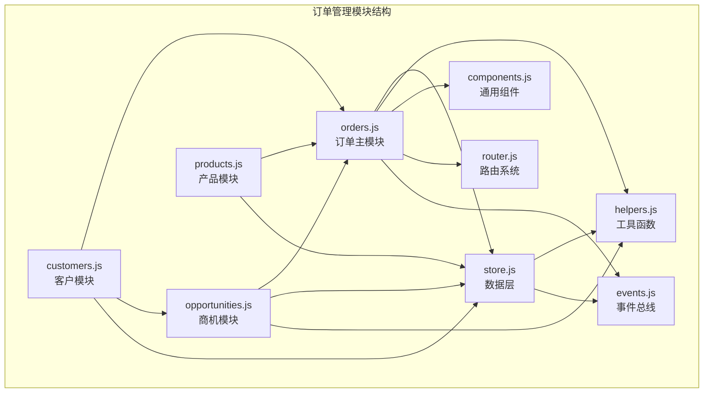
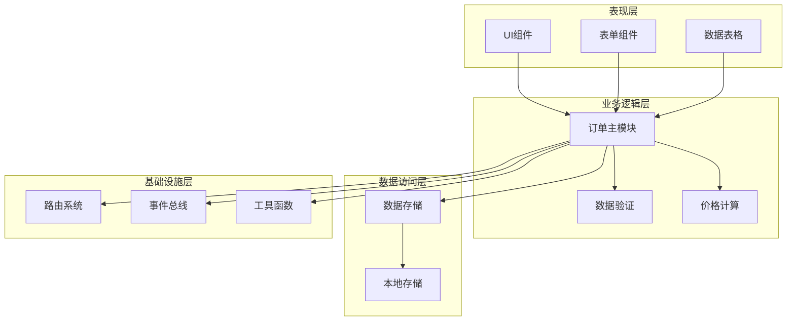
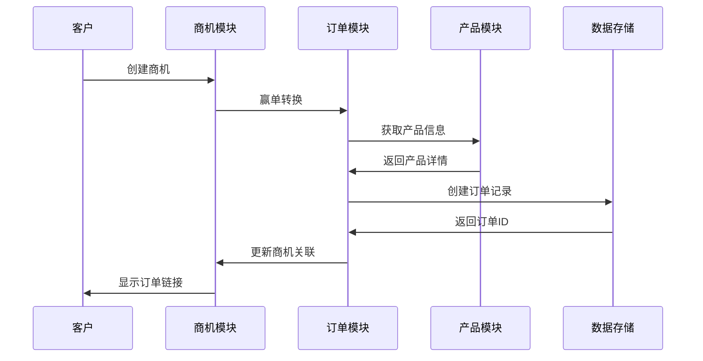
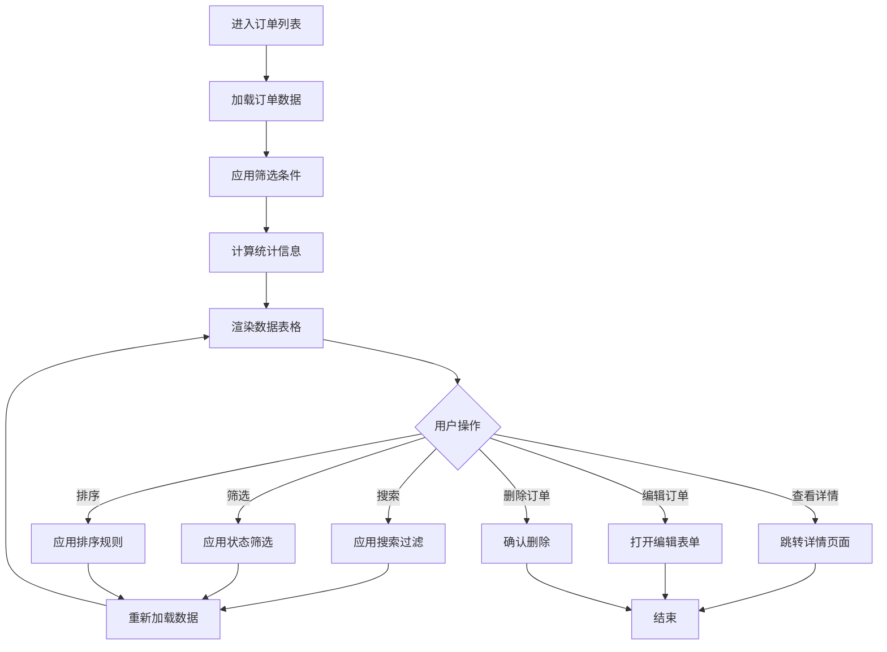
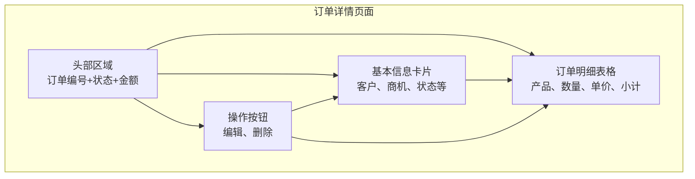
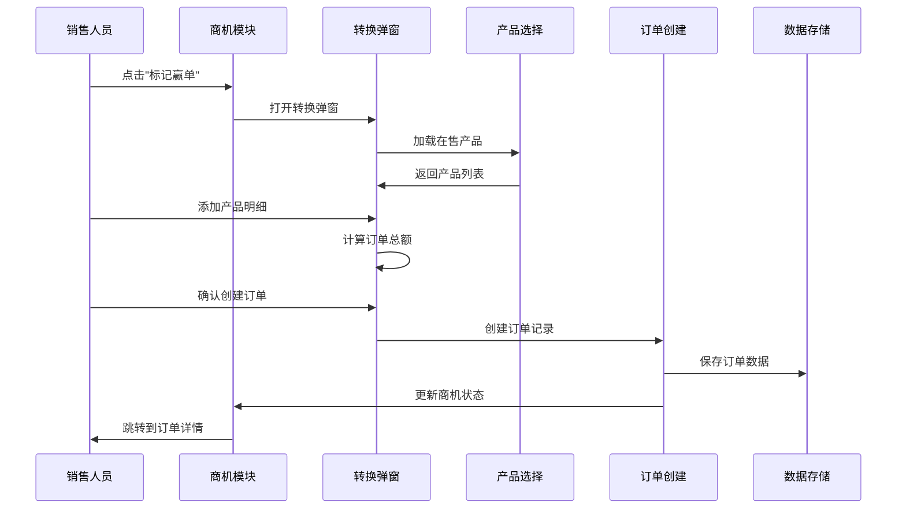
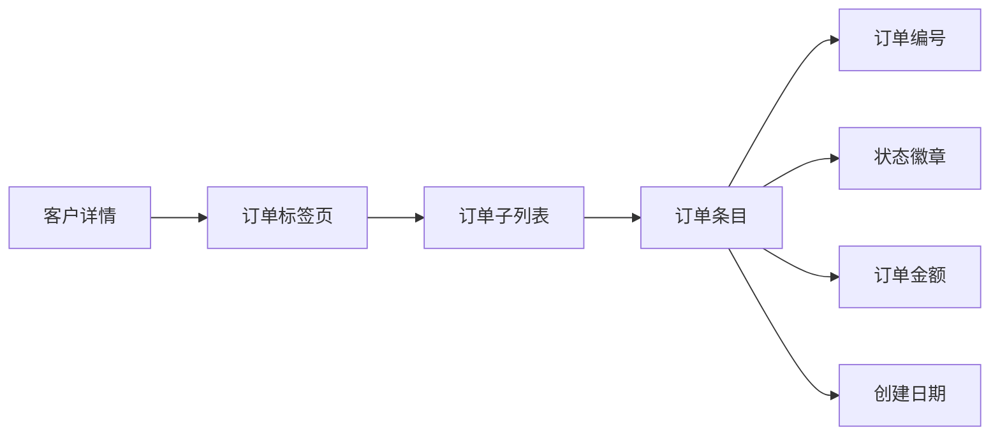
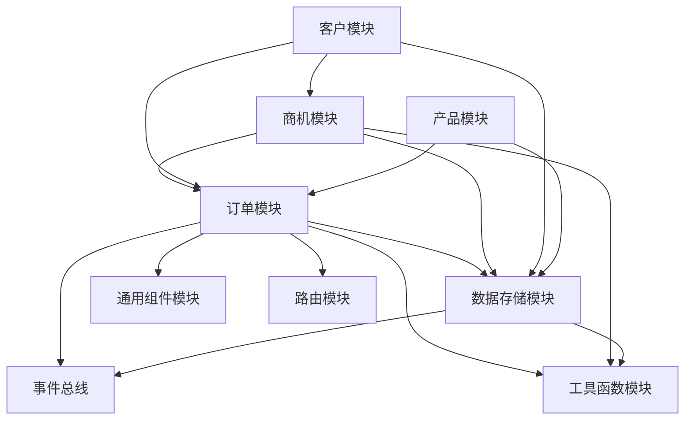
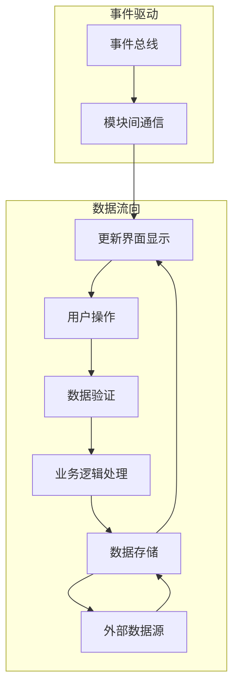

# 订单管理模块

<cite>
**本文档引用的文件**
- [orders.js](file://js/modules/orders.js)
- [opportunities.js](file://js/modules/opportunities.js)
- [customers.js](file://js/modules/customers.js)
- [products.js](file://js/modules/products.js)
- [store.js](file://js/store.js)
- [helpers.js](file://js/utils/helpers.js)
- [components.js](file://js/components.js)
- [router.js](file://js/router.js)
- [app.js](file://js/app.js)
- [seed.js](file://js/utils/seed.js)
- [events.js](file://js/events.js)
</cite>

## 目录
1. [简介](#简介)
2. [项目结构](#项目结构)
3. [核心组件](#核心组件)
4. [架构概览](#架构概览)
5. [详细组件分析](#详细组件分析)
6. [依赖关系分析](#依赖关系分析)
7. [性能考虑](#性能考虑)
8. [故障排除指南](#故障排除指南)
9. [结论](#结论)
10. [附录](#附录)

## 简介

订单管理模块是CRM系统的核心业务模块之一，负责管理客户订单的全生命周期。该模块实现了从订单创建、商品配置、价格计算到状态跟踪的完整业务流程，同时与商机管理、客户管理和产品管理模块紧密集成，形成了完整的销售闭环。

本模块采用模块化设计，基于本地存储的数据持久化方案，提供了直观的用户界面和完善的业务逻辑。通过事件总线机制实现模块间的解耦通信，确保系统的可扩展性和可维护性。

## 项目结构

订单管理模块位于js/modules目录下，采用标准的模块化组织方式：

**图表来源**
- [orders.js:1-234](file://js/modules/orders.js#L1-L234)
- [store.js:1-139](file://js/store.js#L1-L139)

**章节来源**
- [orders.js:1-234](file://js/modules/orders.js#L1-L234)
- [app.js:1-316](file://js/app.js#L1-L316)

## 核心组件

### 订单管理主模块

订单管理模块的核心是Orders对象，它封装了订单的所有业务逻辑：

- **数据模型管理**：订单集合、字段定义、状态映射
- **UI渲染**：列表视图、详情视图、表单视图
- **业务流程**：订单创建、编辑、删除、状态管理
- **数据交互**：与Store模块的集成，数据持久化

### 状态管理体系

系统实现了完整的订单状态管理：

| 状态 | 颜色标识 | 描述 | 流转规则 |
|------|----------|------|----------|
| 待确认 | warning | 订单已创建但未确认 | 新建订单 → 已确认 |
| 已确认 | primary | 客户已确认订单 | 待确认 → 执行中 |
| 执行中 | info | 订单正在执行 | 已确认 → 已完成/已取消 |
| 已完成 | success | 订单执行完毕 | 执行中 → 完成 |
| 已取消 | gray | 订单被取消 | 任意状态 → 取消 |

### 数据模型设计

订单数据模型包含以下关键字段：

- **基础信息**：订单编号、客户ID、状态、备注
- **商品明细**：产品ID、产品名称、数量、单价、小计
- **金额计算**：订单总额、优惠折扣、最终金额
- **时间戳**：创建时间、更新时间

**章节来源**
- [orders.js:7-13](file://js/modules/orders.js#L7-L13)
- [orders.js:194-198](file://js/modules/orders.js#L194-L198)

## 架构概览

订单管理模块采用分层架构设计，各层职责明确：

**图表来源**
- [orders.js:15-78](file://js/modules/orders.js#L15-L78)
- [store.js:32-96](file://js/store.js#L32-L96)

### 模块间协作关系

**图表来源**
- [opportunities.js:303-462](file://js/modules/opportunities.js#L303-L462)
- [orders.js:432-447](file://js/modules/orders.js#L432-L447)

**章节来源**
- [opportunities.js:303-462](file://js/modules/opportunities.js#L303-L462)
- [orders.js:432-447](file://js/modules/orders.js#L432-L447)

## 详细组件分析

### 订单列表管理

订单列表页面提供了完整的订单浏览和管理功能：

#### 列表展示功能

**图表来源**
- [orders.js:15-78](file://js/modules/orders.js#L15-L78)
- [components.js:6-271](file://js/components.js#L6-L271)

#### 状态统计与筛选

系统实现了智能的状态统计和筛选功能：

- **实时统计**：自动计算各状态订单数量
- **动态筛选**：根据状态变化动态更新筛选器
- **快速导航**：支持直接跳转到特定状态的订单

**章节来源**
- [orders.js:36-42](file://js/modules/orders.js#L36-L42)
- [orders.js:44-66](file://js/modules/orders.js#L44-L66)

### 订单详情管理

订单详情页面提供了全面的订单信息展示和操作功能：

#### 详情页面布局

**图表来源**
- [orders.js:80-150](file://js/modules/orders.js#L80-L150)

#### 金额计算逻辑

订单金额计算遵循以下规则：

1. **单项计算**：单项小计 = 数量 × 单价
2. **累计求和**：订单总额 = 所有单项小计之和
3. **格式化显示**：统一使用人民币格式显示

**章节来源**
- [orders.js:92-97](file://js/modules/orders.js#L92-L97)
- [orders.js:140-142](file://js/modules/orders.js#L140-L142)

### 订单表单管理

订单表单提供了灵活的订单创建和编辑功能：

#### 表单字段设计

| 字段名 | 类型 | 必填 | 说明 |
|--------|------|------|------|
| customerId | select | 是 | 客户选择 |
| status | select | 是 | 订单状态，默认待确认 |
| remark | textarea | 否 | 备注信息 |

#### 动态字段加载

表单支持动态加载客户选项，确保数据的实时性和准确性。

**章节来源**
- [orders.js:9-13](file://js/modules/orders.js#L9-L13)
- [orders.js:186-187](file://js/modules/orders.js#L186-L187)

### 商机到订单的转换

系统实现了从商机到订单的无缝转换流程：

**图表来源**
- [opportunities.js:303-462](file://js/modules/opportunities.js#L303-L462)

#### 转换流程特点

- **产品选择**：自动过滤在售产品
- **批量添加**：支持多产品明细添加
- **实时计算**：输入时即时计算小计和总额
- **数据同步**：自动更新商机关联信息

**章节来源**
- [opportunities.js:308-462](file://js/modules/opportunities.js#L308-L462)

### 客户关联管理

订单与客户建立了紧密的关联关系：

#### 客户子列表展示

**图表来源**
- [customers.js:160-165](file://js/modules/customers.js#L160-L165)
- [orders.js:153-180](file://js/modules/orders.js#L153-L180)

#### 关联统计功能

系统能够统计每个客户的所有订单数量和金额，为销售分析提供数据支撑。

**章节来源**
- [customers.js:160-165](file://js/modules/customers.js#L160-L165)
- [orders.js:153-180](file://js/modules/orders.js#L153-L180)

## 依赖关系分析

### 内部模块依赖

**图表来源**
- [orders.js:1-234](file://js/modules/orders.js#L1-L234)
- [store.js:1-139](file://js/store.js#L1-L139)

### 外部依赖关系

系统对外部依赖较少，主要依赖浏览器的本地存储API：

- **localStorage**：数据持久化存储
- **DOM API**：页面渲染和事件处理
- **事件总线**：模块间通信机制

**章节来源**
- [store.js:12-29](file://js/store.js#L12-L29)
- [events.js:1-36](file://js/events.js#L1-L36)

### 数据流分析

**图表来源**
- [store.js:54-96](file://js/store.js#L54-L96)
- [events.js:18-30](file://js/events.js#L18-L30)

**章节来源**
- [store.js:54-96](file://js/store.js#L54-L96)
- [events.js:18-30](file://js/events.js#L18-L30)

## 性能考虑

### 数据存储优化

系统采用本地存储方案，在性能方面具有以下优势：

- **零服务器延迟**：所有操作都在客户端完成
- **内存缓存**：Store模块实现了内存缓存机制
- **批量操作**：支持批量数据读写操作

### 渲染性能优化

- **虚拟滚动**：大数据量时采用虚拟滚动技术
- **防抖处理**：搜索和筛选操作使用防抖优化
- **增量更新**：只更新变化的数据部分

### 内存管理

- **垃圾回收**：及时释放不再使用的DOM元素
- **事件解绑**：组件销毁时自动解绑事件监听器
- **缓存清理**：定期清理过期的缓存数据

## 故障排除指南

### 常见问题及解决方案

#### 订单无法保存

**问题现象**：创建或编辑订单后数据丢失

**可能原因**：
1. 本地存储空间不足
2. 浏览器禁用了localStorage
3. 数据格式验证失败

**解决步骤**：
1. 检查浏览器控制台是否有错误信息
2. 确认localStorage可用性
3. 验证必填字段是否完整
4. 清理浏览器缓存后重试

#### 订单状态异常

**问题现象**：订单状态显示不正确或无法更新

**排查步骤**：
1. 检查状态映射配置是否正确
2. 验证状态流转规则
3. 确认事件总线通信正常
4. 查看日志输出定位问题

#### 数据同步问题

**问题现象**：不同模块间数据不一致

**解决方法**：
1. 检查事件总线订阅关系
2. 验证数据更新通知机制
3. 确认缓存一致性策略
4. 实施强制刷新机制

**章节来源**
- [store.js:12-29](file://js/store.js#L12-L29)
- [events.js:18-30](file://js/events.js#L18-L30)

### 调试技巧

#### 开发者工具使用

- **网络面板**：监控数据请求和响应
- **存储面板**：检查localStorage数据状态
- **控制台**：查看错误日志和调试信息
- **性能面板**：分析页面性能瓶颈

#### 日志记录

系统实现了完整的日志记录机制：

- **操作日志**：记录所有重要操作
- **错误日志**：捕获和记录异常信息
- **性能日志**：监控关键操作耗时
- **调试模式**：提供详细的调试信息

## 结论

订单管理模块作为CRM系统的核心业务模块，成功实现了订单全生命周期的管理。模块设计遵循了单一职责原则，通过清晰的层次结构和模块化设计，确保了系统的可维护性和可扩展性。

系统的主要优势包括：

1. **完整的业务流程**：从商机到订单的无缝转换
2. **直观的用户界面**：简洁易用的操作界面
3. **强大的数据管理**：完善的订单数据模型
4. **灵活的扩展机制**：模块化的架构设计

未来可以考虑的功能增强：

- **多租户支持**：支持多组织环境下的数据隔离
- **权限控制**：细化用户权限管理
- **报表分析**：增加订单统计和分析功能
- **移动端适配**：优化移动端用户体验

## 附录

### API参考

#### 订单模块公共方法

| 方法名 | 参数 | 返回值 | 描述 |
|--------|------|--------|------|
| renderList | statusFilter | HTMLElement | 渲染订单列表 |
| renderDetail | id | HTMLElement | 渲染订单详情 |
| showForm | id | void | 打开订单表单 |
| handleDelete | id | void | 删除订单 |
| init | 无 | void | 初始化模块 |

#### 数据存储接口

| 方法名 | 参数 | 返回值 | 描述 |
|--------|------|--------|------|
| create | collection, data | Record | 创建记录 |
| update | collection, id, data | Record | 更新记录 |
| delete | collection, id | boolean | 删除记录 |
| getAll | collection | Array | 获取所有记录 |
| getById | collection, id | Record | 根据ID获取记录 |

### 最佳实践

#### 订单创建规范

1. **必填字段完整性**：确保客户、状态等关键字段完整
2. **数据验证**：在提交前进行完整的数据验证
3. **状态初始化**：新订单默认状态应为"待确认"
4. **金额计算**：确保单价、数量、小计计算准确

#### 用户体验优化

1. **实时反馈**：操作后及时给予用户反馈
2. **错误提示**：提供清晰的错误信息和解决方案
3. **操作确认**：重要操作提供二次确认机制
4. **快捷操作**：提供常用操作的快捷方式