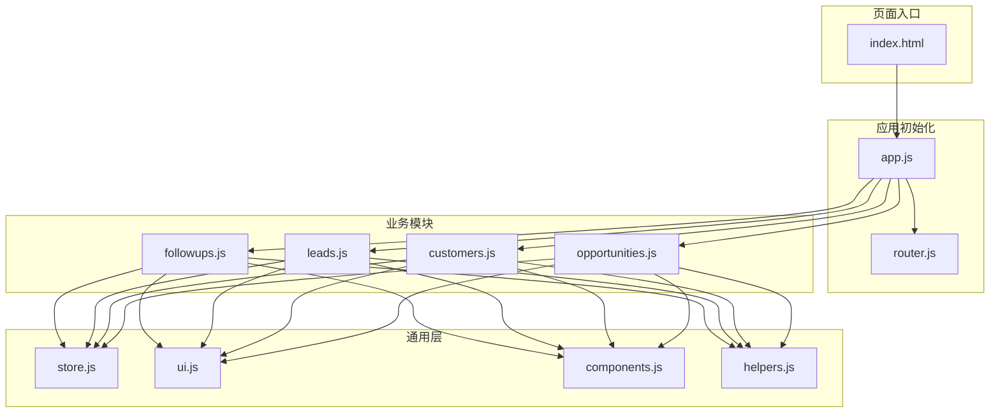
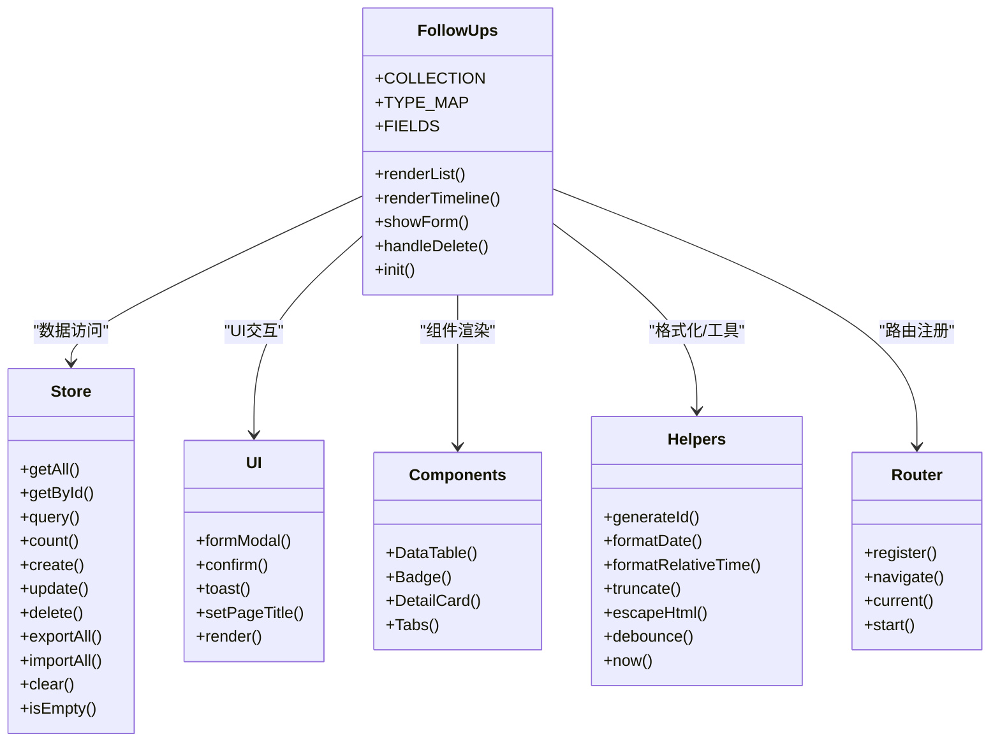
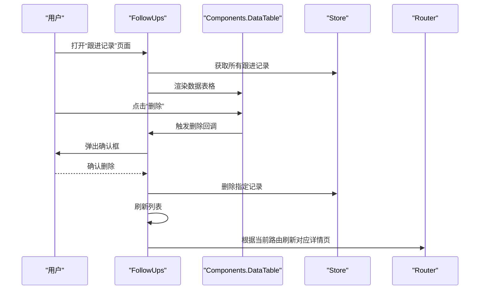
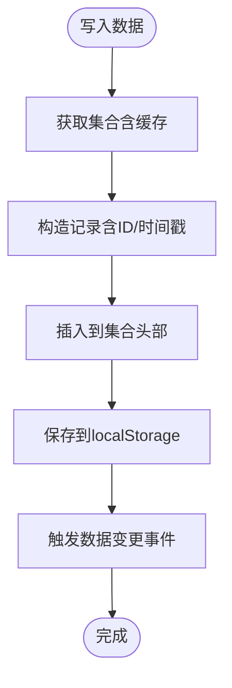
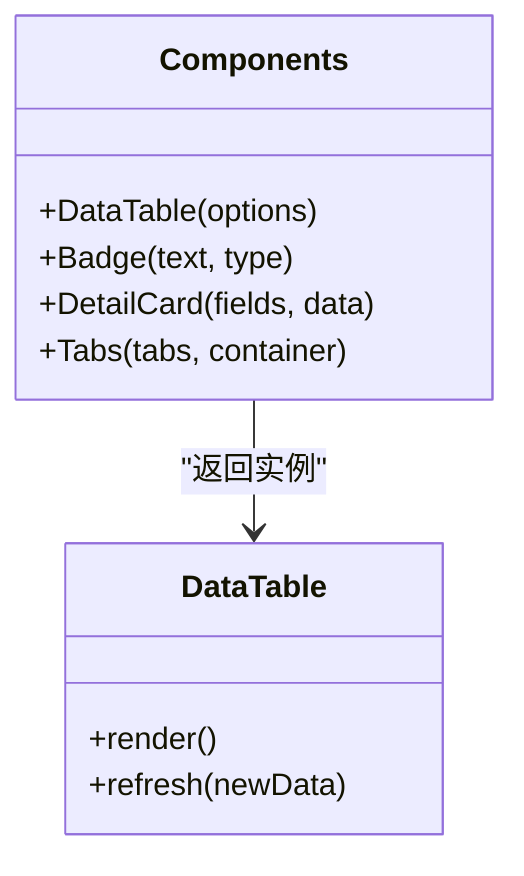
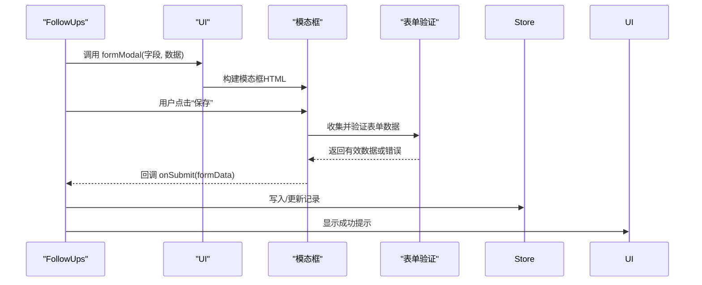
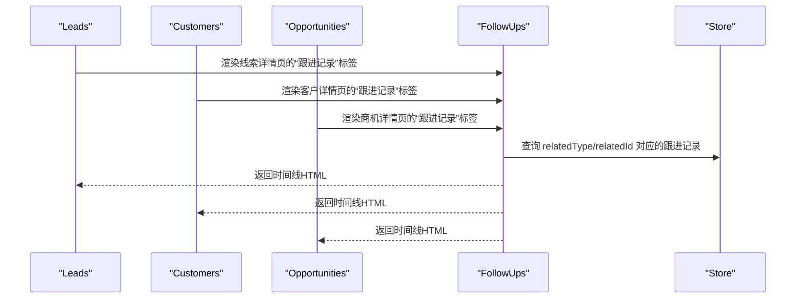
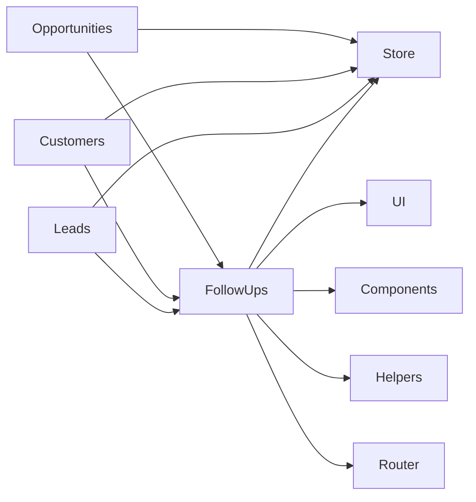

# 跟进记录模块

<cite>
**本文档引用的文件**
- [followups.js](file://js/modules/followups.js)
- [store.js](file://js/store.js)
- [helpers.js](file://js/utils/helpers.js)
- [components.js](file://js/components.js)
- [ui.js](file://js/ui.js)
- [router.js](file://js/router.js)
- [leads.js](file://js/modules/leads.js)
- [customers.js](file://js/modules/customers.js)
- [opportunities.js](file://js/modules/opportunities.js)
- [app.js](file://js/app.js)
- [index.html](file://index.html)
- [variables.css](file://css/variables.css)
- [components.css](file://css/components.css)
</cite>

## 目录
1. [简介](#简介)
2. [项目结构](#项目结构)
3. [核心组件](#核心组件)
4. [架构总览](#架构总览)
5. [详细组件分析](#详细组件分析)
6. [依赖关系分析](#依赖关系分析)
7. [性能考虑](#性能考虑)
8. [故障排除指南](#故障排除指南)
9. [结论](#结论)
10. [附录](#附录)

## 简介
本模块负责客户互动记录的全生命周期管理，涵盖跟进记录的创建、展示、关联业务对象、时间线呈现以及与线索、客户、商机等实体的深度集成。系统通过统一的数据层持久化、通用UI组件与路由机制，实现了跨模块的联动与一致的用户体验。

## 项目结构
跟进记录模块位于前端模块化架构中，采用“功能域+通用工具”的组织方式：
- 模块层：FollowUps（跟进记录）、Leads（线索）、Customers（客户）、Opportunities（商机）
- 通用层：Store（数据层）、UI（界面工具）、Components（通用组件）、Helpers（工具函数）、Router（路由）
- 页面入口：index.html 引入所有脚本并初始化应用

图表来源
- [index.html:110-126](file://index.html#L110-L126)
- [app.js:10-18](file://js/app.js#L10-L18)
- [followups.js:4-187](file://js/modules/followups.js#L4-L187)
- [store.js:4-138](file://js/store.js#L4-L138)
- [ui.js:4-363](file://js/ui.js#L4-L363)
- [components.js:4-323](file://js/components.js#L4-L323)
- [helpers.js:4-112](file://js/utils/helpers.js#L4-L112)
- [router.js:4-61](file://js/router.js#L4-L61)

章节来源
- [index.html:110-126](file://index.html#L110-L126)
- [app.js:6-41](file://js/app.js#L6-L41)

## 核心组件
- FollowUps 模块：负责跟进记录的列表展示、表单创建、时间线渲染、删除操作与路由注册
- Store 数据层：提供本地持久化、查询、计数、导入导出等能力
- UI 工具：提供模态框、确认框、表单构建、Toast 通知、页面标题设置等
- Components 通用组件：提供数据表格、状态标签、详情卡片、标签页等
- Helpers 工具：提供日期格式化、相对时间、截断文本、防抖、颜色哈希等
- Router 路由：基于 hash 的前端路由解析与导航

章节来源
- [followups.js:4-187](file://js/modules/followups.js#L4-L187)
- [store.js:4-138](file://js/store.js#L4-L138)
- [ui.js:4-363](file://js/ui.js#L4-L363)
- [components.js:4-323](file://js/components.js#L4-L323)
- [helpers.js:4-112](file://js/utils/helpers.js#L4-L112)
- [router.js:4-61](file://js/router.js#L4-L61)

## 架构总览
跟进记录模块遵循“模块自治 + 通用共享”的设计原则：
- 模块内部职责清晰：FollowUps 独立管理自身集合与视图
- 与 Store 解耦：通过统一接口访问数据，避免直接操作 localStorage
- 与 UI/Components 解耦：通过组件化封装，降低模板拼装复杂度
- 与 Router 解耦：通过路由注册实现页面级导航
- 与业务模块解耦：通过 relatedType/relatedId 关联线索、客户、商机

图表来源
- [followups.js:4-187](file://js/modules/followups.js#L4-L187)
- [store.js:4-138](file://js/store.js#L4-L138)
- [ui.js:4-363](file://js/ui.js#L4-L363)
- [components.js:4-323](file://js/components.js#L4-L323)
- [helpers.js:4-112](file://js/utils/helpers.js#L4-L112)
- [router.js:4-61](file://js/router.js#L4-L61)

## 详细组件分析

### 跟进记录模块（FollowUps）
- 类型系统：支持“电话”“拜访”“邮件”“微信”“会议”“其他”，并映射为不同语义色
- 字段定义：包含跟进方式、内容、下次跟进日期等
- 列表展示：使用通用数据表格组件，支持搜索、排序、删除
- 时间线渲染：在业务对象详情页内嵌展示，支持“添加跟进”快捷入口
- 表单创建：支持直接在业务对象详情页内打开，自动填充关联信息；也可在列表页选择关联类型与对象
- 删除确认：提供二次确认对话框，防止误删
- 路由注册：注册“跟进记录”页面路由

图表来源
- [followups.js:15-77](file://js/modules/followups.js#L15-L77)
- [followups.js:171-183](file://js/modules/followups.js#L171-L183)
- [store.js:87-96](file://js/store.js#L87-L96)
- [router.js:38-51](file://js/router.js#L38-L51)

章节来源
- [followups.js:4-187](file://js/modules/followups.js#L4-L187)

### 数据层（Store）
- 提供集合级 CRUD 操作，统一处理 localStorage 存储
- 支持查询、计数、导入导出、清空等
- 写入时触发事件总线，便于模块间解耦通信
- 读取失败时提供错误提示与降级策略

图表来源
- [store.js:53-67](file://js/store.js#L53-L67)

章节来源
- [store.js:4-138](file://js/store.js#L4-L138)

### 通用组件（Components）
- DataTable：支持搜索、排序、分页、筛选、行点击、操作列等
- Badge：状态标签组件，支持多种语义色
- DetailCard：详情卡片布局
- Tabs：标签页组件，支持切换与内容渲染

图表来源
- [components.js:6-271](file://js/components.js#L6-L271)

章节来源
- [components.js:4-323](file://js/components.js#L4-L323)

### UI 工具（UI）
- formModal：构建表单模态框，支持字段渲染、数据收集、验证与提交
- confirm：通用确认对话框，支持不同语义类型
- toast：通知组件，支持多类型与自动消失
- setPageTitle：设置页面标题与面包屑导航
- render：内容渲染入口

图表来源
- [ui.js:164-191](file://js/ui.js#L164-L191)
- [ui.js:276-316](file://js/ui.js#L276-L316)
- [followups.js:133-154](file://js/modules/followups.js#L133-L154)

章节来源
- [ui.js:4-363](file://js/ui.js#L4-L363)

### 工具函数（Helpers）
- 日期格式化：支持标准日期与日期时间格式
- 相对时间：根据当前时间计算“刚刚/几分钟前/几小时前/几天前”
- 文本处理：截断、HTML 转义、防抖
- 时间戳：生成 ISO 时间戳
- 颜色哈希：基于字符串生成稳定颜色

章节来源
- [helpers.js:4-112](file://js/utils/helpers.js#L4-L112)

### 路由系统（Router）
- 注册模式路由，支持参数提取
- hash 变更监听与初始解析
- 编程式导航与当前路由查询

章节来源
- [router.js:4-61](file://js/router.js#L4-L61)

### 业务对象集成
- 线索（Leads）：在线索详情页的“跟进记录”标签中展示时间线，并支持从线索页直接添加跟进
- 客户（Customers）：在客户详情页的“跟进记录”标签中展示时间线，并支持从客户页直接添加跟进
- 商机（Opportunities）：在商机详情页的“跟进记录”标签中展示时间线，并支持从商机页直接添加跟进

图表来源
- [leads.js:140-146](file://js/modules/leads.js#L140-L146)
- [customers.js:166-173](file://js/modules/customers.js#L166-L173)
- [opportunities.js:206-213](file://js/modules/opportunities.js#L206-L213)
- [followups.js:80-116](file://js/modules/followups.js#L80-L116)

章节来源
- [leads.js:88-157](file://js/modules/leads.js#L88-L157)
- [customers.js:94-182](file://js/modules/customers.js#L94-L182)
- [opportunities.js:103-238](file://js/modules/opportunities.js#L103-L238)
- [followups.js:80-116](file://js/modules/followups.js#L80-L116)

## 依赖关系分析
- FollowUps 依赖 Store 进行数据持久化，依赖 UI/Components 提供交互与渲染，依赖 Helpers 进行格式化，依赖 Router 进行页面导航
- 业务模块（Leads/Customer/Opportunity）通过 Store 查询跟进记录并与 FollowUps 的时间线组件组合使用
- UI/Components/Helpers/Router 在多个模块中复用，形成稳定的通用层

图表来源
- [followups.js:4-187](file://js/modules/followups.js#L4-L187)
- [leads.js:4-286](file://js/modules/leads.js#L4-L286)
- [customers.js:4-229](file://js/modules/customers.js#L4-L229)
- [opportunities.js:4-485](file://js/modules/opportunities.js#L4-L485)

章节来源
- [followups.js:4-187](file://js/modules/followups.js#L4-L187)
- [leads.js:4-286](file://js/modules/leads.js#L4-L286)
- [customers.js:4-229](file://js/modules/customers.js#L4-L229)
- [opportunities.js:4-485](file://js/modules/opportunities.js#L4-L485)

## 性能考虑
- 数据缓存：Store 使用内存缓存减少 localStorage 读取次数，提升渲染性能
- 防抖搜索：表格搜索使用防抖，降低频繁过滤带来的重排压力
- 懒渲染：时间线组件仅在标签切换时渲染，避免不必要的 DOM 生成
- 本地存储：采用 localStorage，无需网络请求，响应迅速但需关注容量限制

[本节为通用指导，不涉及具体文件分析]

## 故障排除指南
- 无法保存数据：检查 localStorage 是否可用，确认存储空间是否充足
- 删除确认无效：确认 UI.confirm 的回调逻辑是否正确绑定
- 时间线不显示：检查 relatedType/relatedId 是否正确传入，确认 Store 查询条件
- 页面跳转异常：检查 Router 的路由注册与 hash 变更监听是否正常

章节来源
- [store.js:23-29](file://js/store.js#L23-L29)
- [ui.js:136-162](file://js/ui.js#L136-L162)
- [followups.js:80-116](file://js/modules/followups.js#L80-L116)
- [router.js:54-60](file://js/router.js#L54-L60)

## 结论
跟进记录模块通过清晰的职责划分与通用组件复用，实现了与业务对象的深度集成与一致的用户体验。其以 Store 为核心的数据层抽象，配合 UI/Components 的组件化封装，使得后续扩展新的跟进类型或与其他业务模块联动变得简单可靠。

[本节为总结性内容，不涉及具体文件分析]

## 附录

### 跟进记录类型与样式映射
- 电话：主色
- 拜访：成功色
- 邮件：信息色
- 微信：成功色
- 会议：警告色
- 其他：中性色

章节来源
- [followups.js:7-13](file://js/modules/followups.js#L7-L13)

### 跟进记录字段定义
- 跟进方式：下拉选择（电话/拜访/邮件/微信/会议/其他）
- 跟进内容：多行文本，必填
- 下次跟进日期：日期选择

章节来源
- [followups.js:9-13](file://js/modules/followups.js#L9-L13)

### 与业务对象的关联关系
- relatedType：线索（lead）、客户（customer）、商机（opportunity）
- relatedId：对应业务对象的唯一标识
- 关联查询：Store.query('followups', f => f.relatedType === type && f.relatedId === id)

章节来源
- [leads.js:142-143](file://js/modules/leads.js#L142-L143)
- [customers.js:169-170](file://js/modules/customers.js#L169-L170)
- [opportunities.js:209-210](file://js/modules/opportunities.js#L209-L210)
- [store.js:43-45](file://js/store.js#L43-L45)

### 使用规范与最佳实践
- 创建跟进记录时优先选择明确的关联对象，确保后续检索与统计准确
- 合理填写“下次跟进日期”，以便在相关页面中识别逾期情况
- 使用“跟进内容”记录关键信息，避免遗漏重要细节
- 在业务对象详情页的“跟进记录”标签中进行日常维护，保持信息集中可见
- 定期清理过期或重复的跟进记录，保持数据整洁

[本节为通用指导，不涉及具体文件分析]