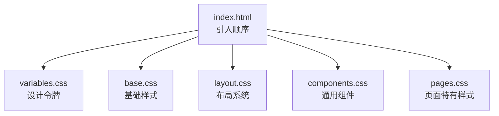
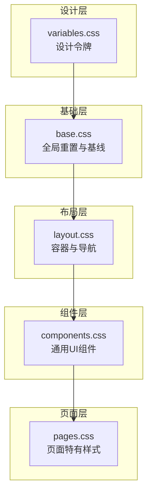
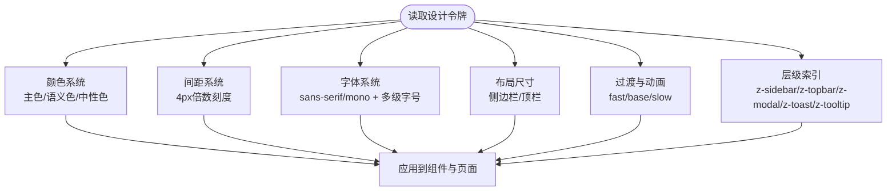
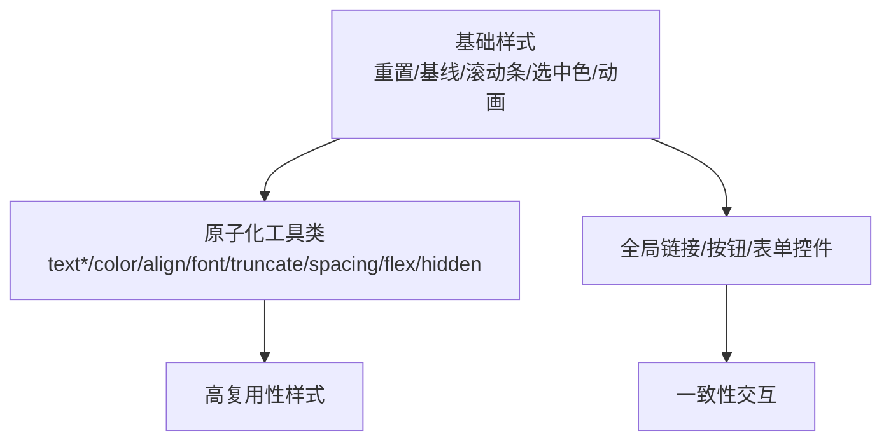
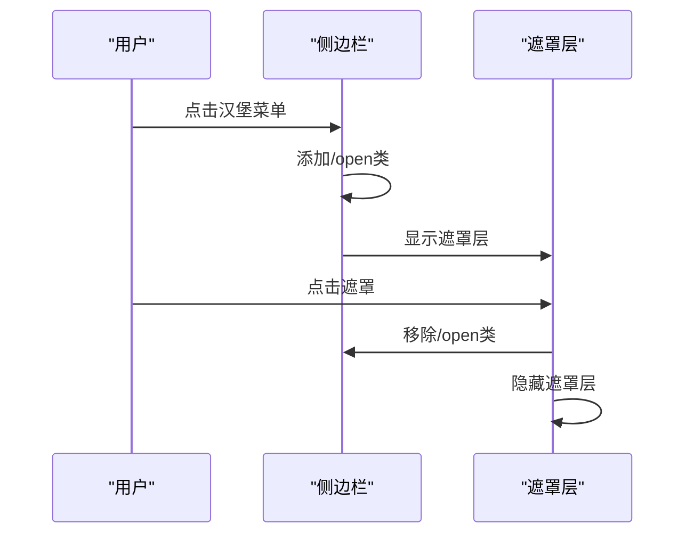
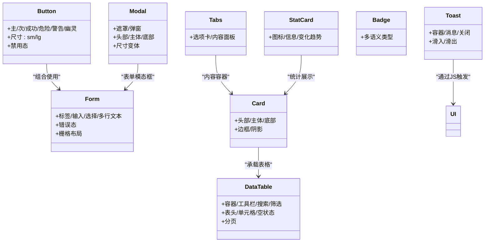
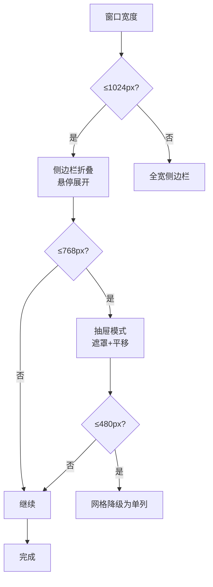
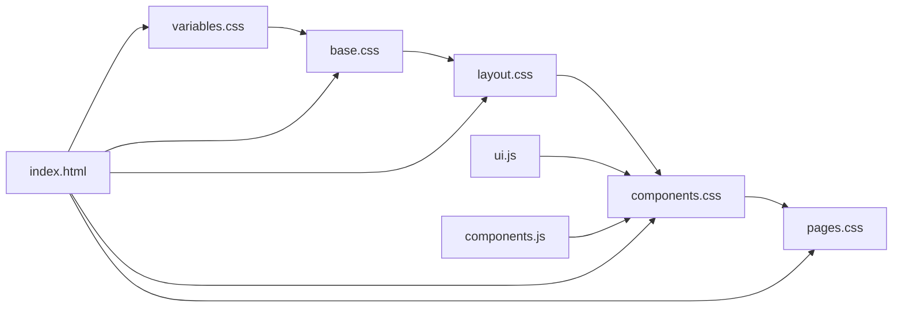

# CSS架构设计

<cite>
**本文档引用的文件**
- [variables.css](file://css/variables.css)
- [base.css](file://css/base.css)
- [layout.css](file://css/layout.css)
- [components.css](file://css/components.css)
- [pages.css](file://css/pages.css)
- [index.html](file://index.html)
- [ui.js](file://js/ui.js)
- [components.js](file://js/components.js)
</cite>

## 目录
1. [简介](#简介)
2. [项目结构](#项目结构)
3. [核心组件](#核心组件)
4. [架构总览](#架构总览)
5. [详细组件分析](#详细组件分析)
6. [依赖关系分析](#依赖关系分析)
7. [性能考虑](#性能考虑)
8. [故障排除指南](#故障排除指南)
9. [结论](#结论)
10. [附录](#附录)

## 简介
本文件系统性梳理CRM系统的CSS架构设计，重点围绕设计令牌系统、原子化CSS原则、响应式策略、布局系统、组件样式组织与作用域隔离、主题定制与颜色覆盖、以及最佳实践与性能优化进行深入解析。通过分层架构与模块化组织，确保样式具备可维护性、可扩展性和一致性。

## 项目结构
CSS采用“分层模块化”组织方式：
- 设计令牌：集中定义变量，统一颜色、间距、字体、阴影、圆角、过渡、Z-index等
- 基础样式：重置与全局默认样式，统一排版与交互基线
- 布局：主容器、侧边栏、顶栏、内容区、移动端抽屉等
- 组件：按钮、表单、卡片、数据表格、模态框、Toast、标签页、进度条、时间线等
- 页面：仪表盘、详情页、转化预览、订单明细、搜索结果等页面特有样式

图表来源
- [index.html:7-11](file://index.html#L7-L11)
- [variables.css:1-120](file://css/variables.css#L1-L120)
- [base.css:1-102](file://css/base.css#L1-L102)
- [layout.css:1-337](file://css/layout.css#L1-L337)
- [components.css:1-823](file://css/components.css#L1-L823)
- [pages.css:1-224](file://css/pages.css#L1-L224)

章节来源
- [index.html:7-11](file://index.html#L7-L11)

## 核心组件
本节聚焦设计令牌系统与原子化CSS原则，解释颜色系统、间距系统、字体系统、响应式断点与工具类的组织方式。

- 设计令牌系统
  - 颜色系统：主色调、语义色（成功/警告/危险/信息）、中性色（灰阶）、背景与文字色、边框与阴影
  - 间距系统：基于倍数的比例体系，从4px到64px
  - 字体系统：无衬线与等宽字体族，字号从12px到28px
  - 布局与尺寸：侧边栏宽度、折叠宽度、顶栏高度
  - 动画与过渡：多种缓动时长
  - 层级与索引：Z-index层级管理
- 原子化CSS与类名规范
  - 以功能命名为主，如文本对齐、颜色、字体、间距、隐藏、flex扩展等
  - 工具类优先，减少重复样式，提升复用性
- 响应式策略与断点
  - 侧边栏在1024px以下折叠；768px以下移动端抽屉模式；480px进一步简化网格
- 动画与过渡
  - 提供通用动画类，配合过渡时长变量统一动效体验

章节来源
- [variables.css:5-119](file://css/variables.css#L5-L119)
- [base.css:11-102](file://css/base.css#L11-L102)
- [components.css:807-822](file://css/components.css#L807-L822)
- [layout.css:291-336](file://css/layout.css#L291-L336)

## 架构总览
整体架构遵循“设计令牌驱动 + 分层样式 + 原子化工具”的模式，通过变量集中管理与组件化封装，实现跨页面一致的视觉与交互体验。

图表来源
- [variables.css:1-120](file://css/variables.css#L1-L120)
- [base.css:1-102](file://css/base.css#L1-L102)
- [layout.css:1-337](file://css/layout.css#L1-L337)
- [components.css:1-823](file://css/components.css#L1-L823)
- [pages.css:1-224](file://css/pages.css#L1-L224)

## 详细组件分析

### 设计令牌系统（颜色、间距、字体）
- 颜色系统
  - 主色调：HSL主色与明暗变体、前景色
  - 语义色：成功/警告/危险/信息，配套浅色背景与前景色
  - 中性色：从50到900的灰阶，用于背景、边框、文字
  - 背景与文字：主体背景、卡片背景、侧边栏、顶栏、遮罩等
  - 边框与阴影：边框色、轻量阴影到超大阴影
- 间距系统
  - 以4px为基准，构建12个等级的间距刻度，覆盖内边距、外边距、网格间距
- 字体系统
  - 无衬线字体族与等宽字体族，字号从xs到3xl，满足不同信息密度需求
- 布局与尺寸
  - 侧边栏展开/折叠宽度、顶栏高度
- 动画与过渡
  - fast/base/slow三种过渡时长，统一动效节奏
- 层级与索引
  - 侧边栏、顶栏、模态框、Toast、Tooltip的Z-index层级

图表来源
- [variables.css:5-119](file://css/variables.css#L5-L119)

章节来源
- [variables.css:5-119](file://css/variables.css#L5-L119)

### 基础样式与原子化工具类
- 全局重置与基线
  - 统一box-sizing、margin/padding归零、字体与行高、滚动条与选中色
  - 链接颜色与过渡、按钮/表单控件继承与聚焦态
- 动画基元
  - 提供淡入、滑入、缩放、旋转等关键帧，配合过渡时长变量
- 原子化工具类
  - 文本颜色/对齐/字体、截断、间距、flex扩展、隐藏等
  - 通过!important仅在必要场景使用，避免过度污染

图表来源
- [base.css:5-102](file://css/base.css#L5-L102)
- [components.css:807-822](file://css/components.css#L807-L822)

章节来源
- [base.css:5-102](file://css/base.css#L5-L102)
- [components.css:807-822](file://css/components.css#L807-L822)

### 布局系统（容器、侧边栏、顶栏、移动端抽屉）
- 主容器
  - Flex布局，占满视口，隐藏溢出
- 侧边栏
  - 固定宽度与最小宽度，背景与文字色，折叠过渡
  - 顶部Logo区域、导航项、徽章、底部区域
  - 导航项悬停与激活态，图标使用SVG
- 顶栏
  - 顶栏高度、背景与边框，左侧面包屑/标题，右侧搜索框
  - 搜索框聚焦态与占位符颜色
- 内容区
  - 弹性增长，纵向滚动，内边距
- 页面头部
  - 标题/副标题/右侧操作区，响应式排列
- 移动端抽屉
  - 遮罩层与固定定位，打开时平移进入
- 响应式断点
  - 1024px：侧边栏折叠，悬停展开
  - 768px：侧边栏抽屉模式，搜索框缩小，内容区内边距调整，页面头部垂直堆叠
  - 480px：进一步简化网格与卡片布局

图表来源
- [layout.css:13-144](file://css/layout.css#L13-L144)
- [layout.css:282-336](file://css/layout.css#L282-L336)

章节来源
- [layout.css:5-336](file://css/layout.css#L5-L336)

### 组件样式组织与作用域隔离
- 组件分类
  - 按钮：主次/成功/危险/警告/幽灵/尺寸/禁用态
  - 表单：标签、输入/选择/多行文本、错误态、栅格布局
  - 卡片：头部/主体/底部，边框与阴影
  - 数据表格：容器、工具栏、搜索/筛选、表头/单元格、空状态、分页
  - 标签/徽章：多语义类型与点状指示器
  - 模态框：遮罩、弹窗、头部/主体/底部、尺寸变体
  - Toast：右上角容器、消息与关闭按钮、滑入/滑出动画
  - 标签页：选项卡与内容面板
  - 确认框：图标/标题/消息
  - 商机阶段进度条：步骤完成/当前/胜/负状态
  - 时间线：虚线、节点、时间与类型标签
  - 详情页信息卡：自动列网格
  - 统计卡片：图标区/信息区/变化趋势
  - 漏斗图：阶段条与数值
  - 网格工具：2/3/4列栅格，移动端降级
  - 加载：旋转动画
- 作用域隔离
  - 类名采用语义化前缀（如.btn-*、.form-*、.card-*），避免跨组件冲突
  - 使用变量统一颜色与尺寸，减少硬编码
  - 通过局部容器类（如.data-table-container）限定影响范围

图表来源
- [components.css:5-823](file://css/components.css#L5-L823)

章节来源
- [components.css:5-823](file://css/components.css#L5-L823)

### 响应式设计与断点策略
- 断点与行为
  - 1024px：侧边栏宽度折叠，悬停展开，文本与徽章显隐
  - 768px：侧边栏抽屉模式，搜索框缩小，内容区内边距调整，页面头部垂直布局
  - 480px：统计卡片与详情网格降级为单列
- 媒体查询组织
  - 在组件内部就近放置媒体查询，便于维护与复用
  - 通过变量控制布局尺寸，保证断点切换的一致性

图表来源
- [layout.css:291-336](file://css/layout.css#L291-L336)
- [components.css:790-796](file://css/components.css#L790-L796)
- [pages.css:215-223](file://css/pages.css#L215-L223)

章节来源
- [layout.css:291-336](file://css/layout.css#L291-L336)
- [components.css:790-796](file://css/components.css#L790-L796)
- [pages.css:215-223](file://css/pages.css#L215-L223)

### 页面特有样式
- 仪表盘：网格布局、卡片溢出处理、标题样式
- 详情页：头部布局、头像/名称/元信息、动作区
- 转化预览：字段行布局
- 订单明细：表格列宽与合计行
- 搜索结果：绝对定位、阴影与悬停态

章节来源
- [pages.css:5-224](file://css/pages.css#L5-L224)

## 依赖关系分析
- 文件加载顺序
  - variables.css → base.css → layout.css → components.css → pages.css
  - 保证变量先定义，再被组件与页面引用
- 组件与JS的协作
  - UI工具：Toast、模态框、确认框、表单模态框、图标注入、页面标题更新
  - 通用组件：数据表格、状态标签、详情卡片、标签页
  - JS通过类名与HTML结构驱动样式表现，形成“结构-样式-行为”的清晰边界

图表来源
- [index.html:7-11](file://index.html#L7-L11)
- [variables.css:1-120](file://css/variables.css#L1-L120)
- [base.css:1-102](file://css/base.css#L1-L102)
- [layout.css:1-337](file://css/layout.css#L1-L337)
- [components.css:1-823](file://css/components.css#L1-L823)
- [pages.css:1-224](file://css/pages.css#L1-L224)
- [ui.js:48-191](file://js/ui.js#L48-L191)
- [components.js:6-271](file://js/components.js#L6-L271)

章节来源
- [index.html:7-11](file://index.html#L7-L11)
- [ui.js:48-191](file://js/ui.js#L48-L191)
- [components.js:6-271](file://js/components.js#L6-L271)

## 性能考虑
- 变量驱动的样式复用
  - 通过CSS变量统一颜色、间距、字体、阴影等，减少重复声明，降低体积
- 原子化工具类
  - 减少自定义类名数量，提高复用率，降低选择器复杂度
- 媒体查询就近组织
  - 将断点规则放在组件内部，避免全局样式膨胀
- 动画与过渡
  - 使用transform与opacity等高性能属性，配合变量控制时长
- 按需加载
  - 页面特有样式独立模块，避免无关样式进入首屏

## 故障排除指南
- 样式未生效
  - 检查CSS加载顺序是否正确（variables.css必须在其他样式之前）
  - 确认类名拼写与组件对应关系
- 颜色不一致
  - 使用语义化变量（如--primary、--success、--danger）而非硬编码颜色
- 响应式异常
  - 检查媒体查询断点与组件内样式是否冲突
  - 确认移动端抽屉开关逻辑与类名一致
- 动画不流畅
  - 避免频繁修改布局属性（如width/height），优先使用transform与opacity
- 模态框/Toast无法关闭
  - 确认JS事件绑定与关闭回调是否正确执行

章节来源
- [index.html:7-11](file://index.html#L7-L11)
- [layout.css:282-336](file://css/layout.css#L282-L336)
- [ui.js:80-134](file://js/ui.js#L80-L134)

## 结论
该CSS架构以设计令牌为核心，结合分层模块化与原子化工具类，实现了统一、可维护、可扩展的样式体系。通过明确的响应式断点与组件化封装，既保证了开发效率，也兼顾了性能与可访问性。建议在后续迭代中持续完善主题切换与颜色覆盖方案，进一步增强可定制性。

## 附录

### 设计令牌清单（节选）
- 颜色：主色、语义色、中性色、背景/文字/边框/阴影
- 间距：space-1到space-16
- 字体：sans-serif、mono、字号从xs到3xl
- 布局：sidebar-width、sidebar-collapsed-width、topbar-height
- 动画：transition-fast/base/slow
- 层级：z-sidebar/z-topbar/z-modal/z-toast/z-tooltip

章节来源
- [variables.css:5-119](file://css/variables.css#L5-L119)

### 原子化工具类清单（节选）
- 文本：text-primary/text-success/text-warning/text-danger/text-muted/text-right/text-center
- 字体：font-mono
- 截断：truncate
- 间距：mt-4/mb-4/mt-6/mb-6
- 布局：flex-1/hidden

章节来源
- [components.css:807-822](file://css/components.css#L807-L822)