# 原子化样式设计

<cite>
**本文档引用的文件**
- [variables.css](file://css/variables.css)
- [base.css](file://css/base.css)
- [layout.css](file://css/layout.css)
- [components.css](file://css/components.css)
- [pages.css](file://css/pages.css)
- [index.html](file://index.html)
</cite>

## 目录
1. [简介](#简介)
2. [项目结构](#项目结构)
3. [核心组件](#核心组件)
4. [架构概览](#架构概览)
5. [详细组件分析](#详细组件分析)
6. [依赖关系分析](#依赖关系分析)
7. [性能考虑](#性能考虑)
8. [故障排除指南](#故障排除指南)
9. [结论](#结论)

## 简介

本文件详细阐述了CRM系统中的原子化样式设计原则和实现策略。该系统采用原子化CSS设计理念，通过基础样式重置、组件化UI组件、响应式布局和设计令牌系统，构建了一个高度模块化、可维护且性能优异的前端样式架构。

原子化CSS的核心思想是将样式分解为最小的功能单元，每个类名代表单一的视觉属性或行为，通过组合这些原子类来构建复杂的界面。这种设计模式提供了极高的灵活性和一致性，同时保持了样式的简洁性和可复用性。

## 项目结构

CRM系统的样式架构采用模块化设计，按照功能和层次进行组织：

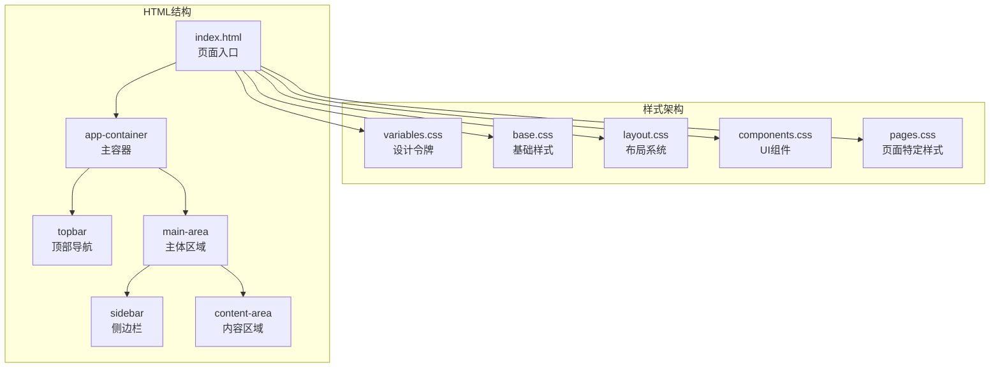

**图表来源**
- [index.html:14-119](file://index.html#L14-L119)
- [variables.css:6-127](file://css/variables.css#L6-L127)

**章节来源**
- [index.html:1-140](file://index.html#L1-L140)
- [variables.css:1-128](file://css/variables.css#L1-L128)

## 核心组件

### 设计令牌系统

设计令牌是整个样式系统的基础，定义了统一的颜色、间距、字体和动画参数：

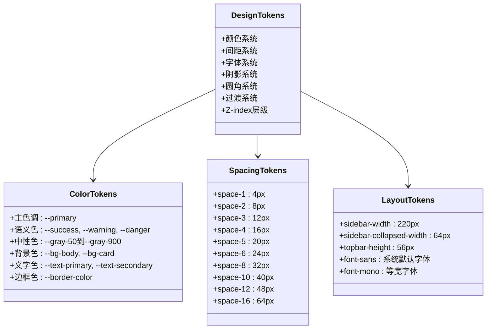

**图表来源**
- [variables.css:6-127](file://css/variables.css#L6-L127)

### 基础样式系统

基础样式负责全局重置和标准化，确保跨浏览器的一致性：

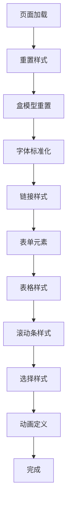

**图表来源**
- [base.css:5-102](file://css/base.css#L5-L102)

**章节来源**
- [base.css:1-102](file://css/base.css#L1-L102)
- [variables.css:1-128](file://css/variables.css#L1-L128)

## 架构概览

CRM系统的样式架构遵循原子化设计原则，通过以下层次结构实现：

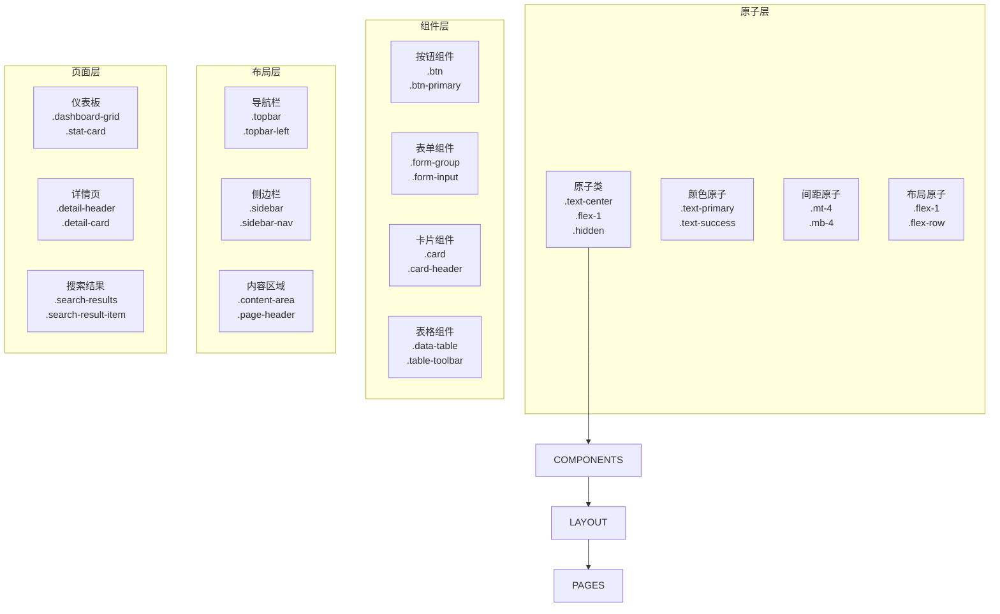

**图表来源**
- [components.css:6-823](file://css/components.css#L6-L823)
- [layout.css:7-482](file://css/layout.css#L7-L482)
- [pages.css:6-224](file://css/pages.css#L6-L224)

## 详细组件分析

### 按钮系统

按钮系统采用原子化设计，通过组合不同的修饰类实现多样化的按钮样式：

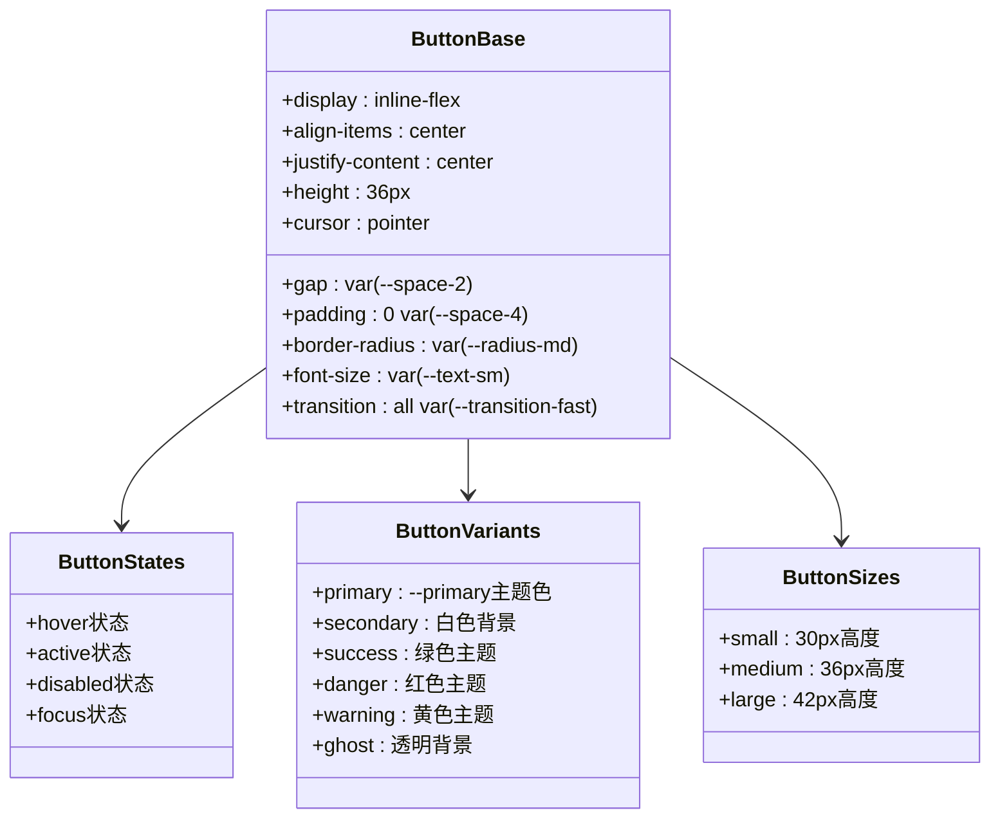

**图表来源**
- [components.css:6-61](file://css/components.css#L6-L61)

按钮系统的关键特性：
- **原子化组合**：基础按钮类与变体类、尺寸类可以自由组合
- **语义化命名**：使用语义明确的类名如 `.btn-primary`、`.btn-success`
- **响应式设计**：支持不同屏幕尺寸下的按钮适配
- **无障碍支持**：包含键盘导航和焦点状态管理

**章节来源**
- [components.css:6-61](file://css/components.css#L6-L61)

### 表单组件系统

表单组件系统提供了一套完整的表单控件解决方案：

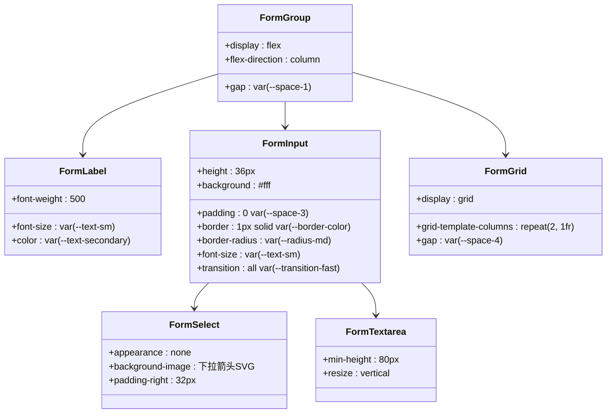

**图表来源**
- [components.css:63-131](file://css/components.css#L63-L131)

表单系统的核心功能：
- **栅格布局**：支持响应式表单网格布局
- **错误状态**：提供表单验证错误的视觉反馈
- **焦点状态**：优化用户体验的焦点管理
- **自适应设计**：在移动设备上的表单适配

**章节来源**
- [components.css:63-131](file://css/components.css#L63-L131)

### 数据表格系统

数据表格系统专为CRM场景设计，提供丰富的数据展示和操作功能：

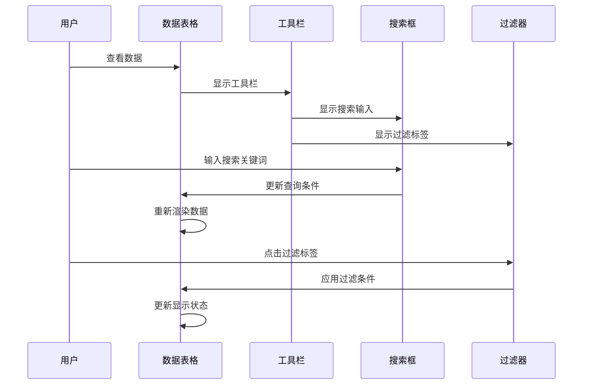

**图表来源**
- [components.css:160-361](file://css/components.css#L160-L361)

表格系统的关键特性：
- **工具栏集成**：搜索、过滤、分页等功能一体化
- **排序支持**：列标题点击排序功能
- **响应式设计**：移动端水平滚动支持
- **空状态处理**：无数据时的友好提示

**章节来源**
- [components.css:160-361](file://css/components.css#L160-L361)

### 卡片系统

卡片系统提供灵活的内容容器，支持多种布局和样式变体：

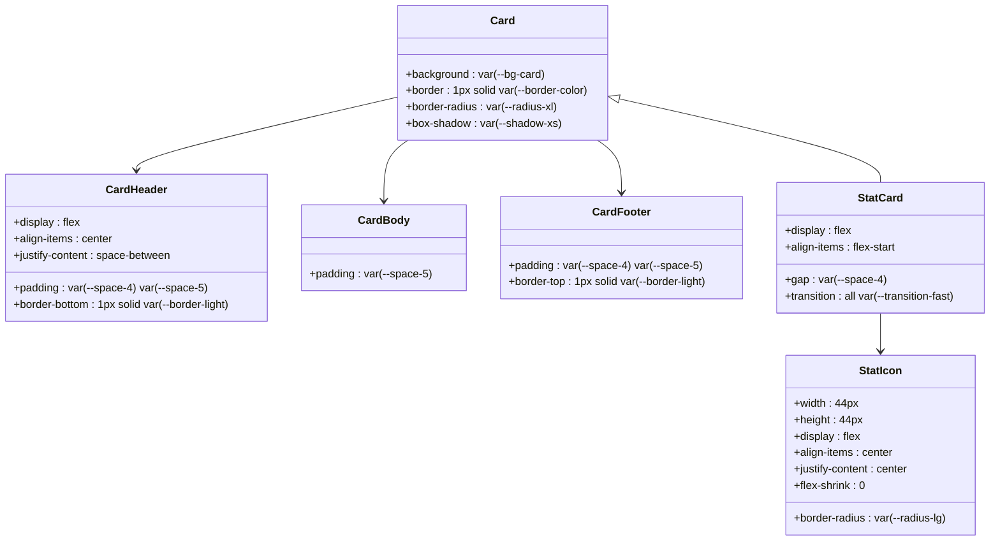

**图表来源**
- [components.css:132-158](file://css/components.css#L132-L158)
- [components.css:689-749](file://css/components.css#L689-L749)

**章节来源**
- [components.css:132-158](file://css/components.css#L132-L158)
- [components.css:689-749](file://css/components.css#L689-L749)

### 布局系统

布局系统采用Flexbox和CSS Grid技术，提供响应式的企业级布局解决方案：

```mermaid
graph TB
subgraph "主容器"
APP[app-container<br/>flex-column<br/>height: 100vh]
end
subgraph "顶部导航"
TOPBAR[topbar<br/>height: var(--topbar-height)<br/>gradient背景]
BRAND[topbar-brand<br/>品牌标识]
SEARCH[topbar-search<br/>搜索输入框]
USER[topbar-user<br/>用户信息]
end
subgraph "主体区域"
MAIN[main-area<br/>flex布局]
SIDEBAR[sidebar<br/>宽度: var(--sidebar-width)]
CONTENT[content-wrapper<br/>flex: 1]
AREA[content-area<br/>滚动区域]
end
APP --> TOPBAR
APP --> MAIN
TOPBAR --> BRAND
TOPBAR --> SEARCH
TOPBAR --> USER
MAIN --> SIDEBAR
MAIN --> CONTENT
CONTENT --> AREA
```

**图表来源**
- [layout.css:7-380](file://css/layout.css#L7-L380)

**章节来源**
- [layout.css:1-482](file://css/layout.css#L1-L482)

## 依赖关系分析

样式系统的依赖关系体现了清晰的层次结构和模块化设计：

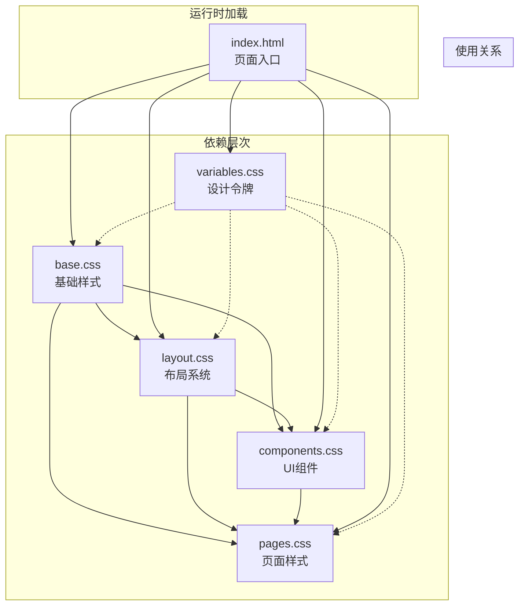

**图表来源**
- [index.html:7-11](file://index.html#L7-L11)
- [variables.css:6-127](file://css/variables.css#L6-L127)

**章节来源**
- [index.html:1-140](file://index.html#L1-L140)
- [variables.css:1-128](file://css/variables.css#L1-L128)

## 性能考虑

原子化样式设计在性能方面具有显著优势：

### 样式组合优化

原子化CSS通过类名组合实现样式复用，避免了传统CSS中的重复代码：

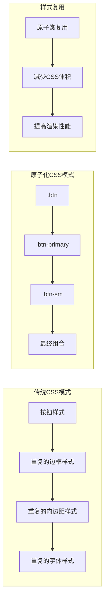

### 渲染性能优化

系统采用了多项渲染性能优化策略：

1. **CSS变量优化**：使用CSS变量替代硬编码值，便于维护和优化
2. **过渡动画优化**：仅对必要的属性应用过渡效果
3. **响应式媒体查询**：合理使用媒体查询减少不必要的样式计算
4. **选择器优化**：避免深层嵌套选择器，使用扁平化选择器结构

### 缓存策略

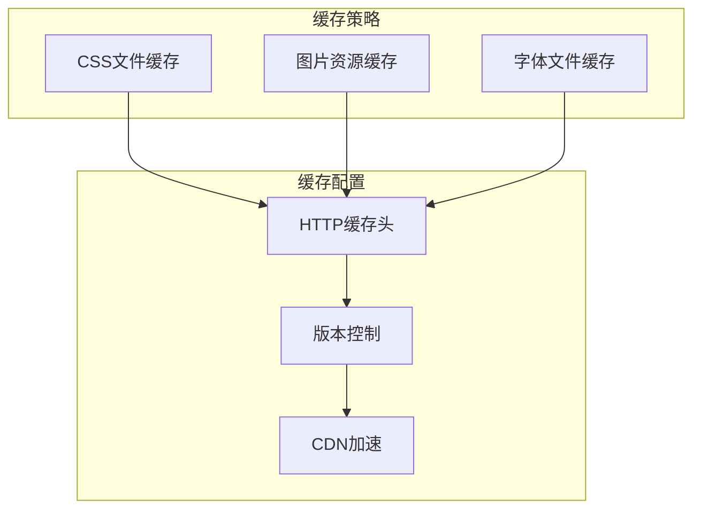

## 故障排除指南

### 常见问题诊断

#### 样式冲突问题

当出现样式冲突时，可以按以下步骤排查：

1. **检查类名优先级**：确认原子类的优先级是否正确
2. **验证CSS加载顺序**：确保基础样式先于组件样式加载
3. **检查媒体查询冲突**：验证响应式样式是否正确覆盖

#### 性能问题诊断

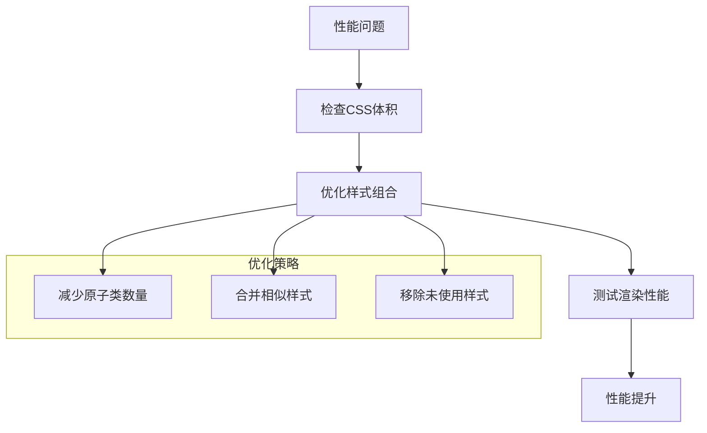

#### 响应式问题

针对响应式布局问题，建议：

1. **验证断点设置**：检查媒体查询断点是否合理
2. **测试多设备兼容性**：在不同设备上验证布局效果
3. **检查Flexbox/Grid兼容性**：确保目标浏览器支持相关属性

**章节来源**
- [components.css:807-823](file://css/components.css#L807-L823)
- [layout.css:432-482](file://css/layout.css#L432-L482)

## 结论

CRM系统的原子化样式设计展现了现代前端开发的最佳实践。通过精心设计的模块化架构、统一的设计令牌系统和高效的样式组合策略，该系统实现了：

### 核心优势

1. **高度模块化**：每个样式组件都可以独立开发和维护
2. **强一致性**：通过设计令牌确保视觉风格的统一性
3. **良好可扩展性**：原子化设计使得新功能的样式添加变得简单
4. **优秀性能**：通过样式组合和缓存策略优化渲染性能

### 设计原则总结

- **原子化思维**：将样式分解为最小的功能单元
- **语义化命名**：使用清晰易懂的类名结构
- **模块化组织**：按照功能和层次进行样式分类
- **响应式设计**：确保在各种设备上的良好体验
- **性能优先**：在保证功能的同时优化渲染性能

这套原子化样式设计不仅满足了当前CRM系统的需求，更为未来的功能扩展和技术演进奠定了坚实的基础。通过遵循这些设计原则和最佳实践，开发者可以快速构建高质量的用户界面，同时保持代码的可维护性和性能表现。