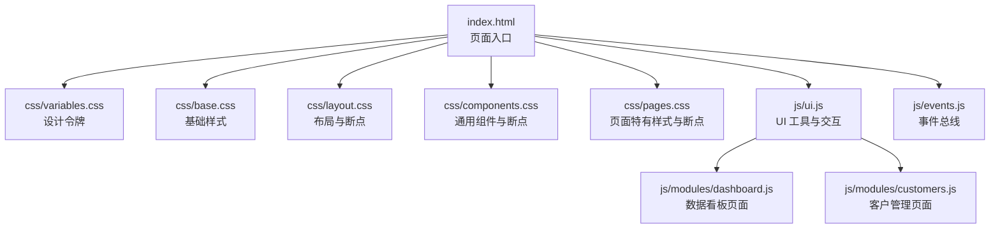
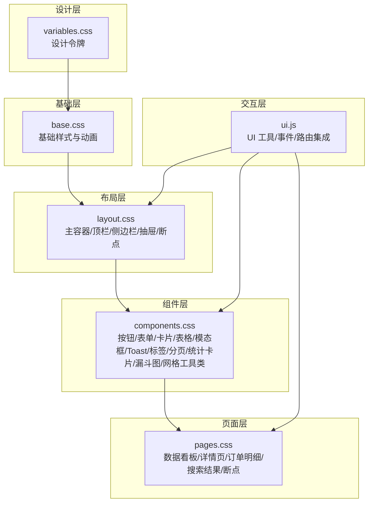
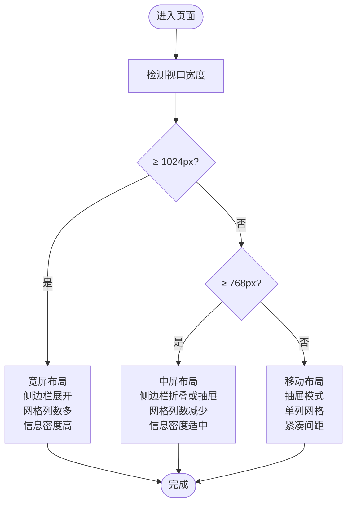
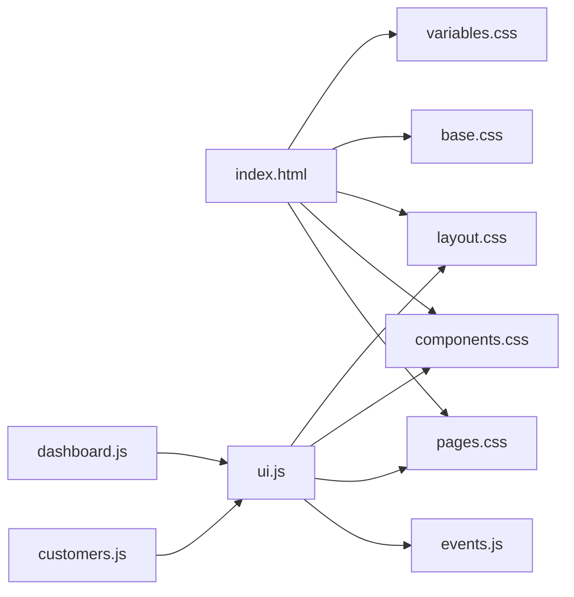

# 响应式设计系统

<cite>
**本文引用的文件**
- [index.html](file://index.html)
- [variables.css](file://css/variables.css)
- [base.css](file://css/base.css)
- [layout.css](file://css/layout.css)
- [components.css](file://css/components.css)
- [pages.css](file://css/pages.css)
- [ui.js](file://js/ui.js)
- [events.js](file://js/events.js)
- [dashboard.js](file://js/modules/dashboard.js)
- [customers.js](file://js/modules/customers.js)
</cite>

## 目录
1. [简介](#简介)
2. [项目结构](#项目结构)
3. [核心组件](#核心组件)
4. [架构总览](#架构总览)
5. [详细组件分析](#详细组件分析)
6. [依赖分析](#依赖分析)
7. [性能考量](#性能考量)
8. [故障排查指南](#故障排查指南)
9. [结论](#结论)
10. [附录](#附录)

## 简介
本文件系统性梳理 CRM 系统的响应式设计体系，围绕断点策略、移动端优先理念、网格与间距系统、页面布局适配、媒体查询规范与性能优化展开。文档同时结合实际页面（数据看板、列表页、详情页）与交互组件（模态框、Toast、表格、表单）的响应式行为，给出可操作的实践建议与最佳实践清单。

## 项目结构
- 视觉与交互层：HTML 结构定义容器与组件骨架；CSS 层负责设计令牌、基础样式、布局、组件与页面样式；JS 层通过 UI 工具与模块化页面逻辑驱动内容渲染与交互。
- 关键文件职责：
  - index.html：页面入口，引入设计令牌与各样式模块。
  - css/variables.css：统一设计令牌（颜色、间距、尺寸、阴影、圆角、字体、过渡、Z-index）。
  - css/base.css：全局基础样式与通用动画。
  - css/layout.css：主容器、顶栏、侧边栏、内容区、移动端抽屉与响应式断点。
  - css/components.css：通用组件（按钮、表单、卡片、表格、模态框、Toast、标签、分页、统计卡片、漏斗图、网格工具类等），含多处媒体查询。
  - css/pages.css：页面特有样式（数据看板网格、详情页、订单明细、搜索结果等），含断点适配。
  - js/ui.js：通用 UI 工具（图标库、Toast、模态框、确认框、表单构建与校验、面包屑与标题设置、内容渲染）。
  - js/events.js：事件总线（EventBus）。
  - js/modules/dashboard.js、js/modules/customers.js：页面模块，展示响应式布局与组件在具体页面中的应用。

图表来源
- [index.html:1-140](file://index.html#L1-L140)
- [variables.css:1-128](file://css/variables.css#L1-L128)
- [layout.css:1-482](file://css/layout.css#L1-L482)
- [components.css:1-893](file://css/components.css#L1-L893)
- [pages.css:1-224](file://css/pages.css#L1-L224)
- [ui.js:1-364](file://js/ui.js#L1-L364)
- [events.js:1-36](file://js/events.js#L1-L36)
- [dashboard.js:1-220](file://js/modules/dashboard.js#L1-L220)
- [customers.js:1-229](file://js/modules/customers.js#L1-L229)

章节来源
- [index.html:1-140](file://index.html#L1-L140)

## 核心组件
- 设计令牌（variables.css）
  - 颜色体系：主色、语义色、中性色、背景、文字、边框、阴影。
  - 间距系统：以 4px 为基准的倍数空间单位，覆盖从 1 到 16 的完整体系。
  - 尺寸与布局：侧边栏宽度、折叠宽度、顶部高度、圆角、字体族、字号、过渡时序。
  - Z-index：侧边栏、顶栏、模态框、Toast、Tooltip 的层级规划。
- 基础样式（base.css）
  - 重置盒模型与默认边距，统一字体与行高，优化字体渲染。
  - 通用动画：淡入、上滑、缩放、旋转等，配合过渡时序使用。
- 布局（layout.css）
  - 主容器采用 Flex 布局，顶栏深蓝渐变背景，侧边栏浅灰白底。
  - 移动端抽屉：固定定位 + transform 平移，叠加遮罩层，支持 hover 展开。
  - 断点：1024px（侧边栏折叠）、768px（抽屉模式、隐藏用户名、调整搜索宽度、内容区内边距、页面头部方向）。
- 组件（components.css）
  - 按钮、表单、卡片、数据表格、模态框、Toast、标签、分页、统计卡片、漏斗图、网格工具类。
  - 多处媒体查询：表单网格在小屏变为单列；统计卡片在 768px 折叠为双列，480px 折叠为单列；通用网格在 768px 折叠为单列。
- 页面（pages.css）
  - 数据看板网格：2 列，768px 折叠为 1 列；详情页在 768px 折叠为纵向布局；详情卡片在 768px 双列、480px 单列。
- 交互（ui.js）
  - 侧边栏开关：通过切换 sidebar 的 open 类控制 transform。
  - 模态框、Toast、确认框、表单构建与校验均基于 CSS 组件与断点进行响应式呈现。

章节来源
- [variables.css:1-128](file://css/variables.css#L1-L128)
- [base.css:1-102](file://css/base.css#L1-L102)
- [layout.css:1-482](file://css/layout.css#L1-L482)
- [components.css:1-893](file://css/components.css#L1-L893)
- [pages.css:1-224](file://css/pages.css#L1-L224)
- [ui.js:1-364](file://js/ui.js#L1-L364)

## 架构总览
响应式设计贯穿“设计令牌—基础样式—布局—组件—页面—交互”的全链路，形成“移动端优先 + 渐进增强”的策略：先保证移动端体验，再在更大屏幕下逐步增强布局密度与信息密度。

图表来源
- [variables.css:1-128](file://css/variables.css#L1-L128)
- [base.css:1-102](file://css/base.css#L1-L102)
- [layout.css:1-482](file://css/layout.css#L1-L482)
- [components.css:1-893](file://css/components.css#L1-L893)
- [pages.css:1-224](file://css/pages.css#L1-L224)
- [ui.js:1-364](file://js/ui.js#L1-L364)

## 详细组件分析

### 断点与移动端优先策略
- 断点定义
  - 1024px：侧边栏折叠，hover 展开，保留标题与徽标显示。
  - 768px：侧边栏抽屉模式，固定定位，transform 平移；隐藏用户名；搜索宽度缩小；内容区内外边距减小；页面头部改为纵向布局。
  - 640px：表单网格变为单列。
  - 768px：统计卡片双列，通用网格单列；详情卡片双列。
  - 480px：统计卡片单列；详情卡片单列。
- 移动端优先
  - 默认以窄屏为目标，使用较小的字体、紧凑的间距与更少的信息密度。
  - 在大屏上通过媒体查询增加列数、增大卡片密度与信息密度，避免过度拥挤。

章节来源
- [layout.css:432-482](file://css/layout.css#L432-L482)
- [components.css:148-157](file://css/components.css#L148-L157)
- [components.css:860-866](file://css/components.css#L860-L866)
- [pages.css:215-224](file://css/pages.css#L215-L224)

### 网格系统与间距系统
- 设计令牌中的间距体系
  - 以 4px 为基准，提供 1~16 的倍数空间单位，用于 margin、padding、gap、border-radius 等。
- 网格与列系统
  - 通用网格工具类：grid-2、grid-3、grid-4，分别生成相应列数的网格。
  - 页面网格：数据看板使用 2 列网格，详情页卡片使用自适应网格（auto-fit + minmax）。
  - 组件网格：表单网格在 640px 以下变为单列，提升移动端可读性与可触达性。
- 响应式行为
  - 通用网格在 768px 折叠为单列，统计卡片在 768px 折叠为双列、480px 折叠为单列。
  - 页面网格在 768px 折叠为单列，详情卡片在 768px 双列、480px 单列。

图表来源
- [layout.css:432-482](file://css/layout.css#L432-L482)
- [components.css:860-866](file://css/components.css#L860-L866)
- [pages.css:215-224](file://css/pages.css#L215-L224)

章节来源
- [variables.css:81-92](file://css/variables.css#L81-L92)
- [components.css:855-866](file://css/components.css#L855-L866)
- [pages.css:6-11](file://css/pages.css#L6-L11)

### 页面布局（pages.css）响应式适配
- 数据看板
  - 使用 2 列网格，768px 折叠为 1 列，确保在小屏下不拥挤。
- 详情页
  - 页面头部在 768px 下改为纵向布局，提升阅读体验。
  - 详情卡片在 768px 双列、480px 单列，兼顾信息密度与可读性。
- 订单明细
  - 表格在小屏下通过横向滚动容器适配，避免列过多导致的布局破坏。
- 搜索结果
  - 绝对定位的搜索结果面板在小屏下仍保持相对稳定的视觉位置，避免遮挡主要内容。

章节来源
- [pages.css:6-11](file://css/pages.css#L6-L11)
- [pages.css:215-224](file://css/pages.css#L215-L224)
- [pages.css:149-177](file://css/pages.css#L149-L177)
- [pages.css:179-193](file://css/pages.css#L179-L193)

### 媒体查询使用规范与性能考虑
- 媒体查询位置
  - 布局与组件样式中分散的媒体查询，遵循就近原则，便于维护与复用。
- 性能建议
  - 合理使用 transform 替代改变布局属性（如 display、position），减少重排。
  - 控制动画时长与缓动函数，避免在低端设备上造成掉帧。
  - 在大屏下适度增加列数，但避免过度拥挤导致可读性下降。
  - 使用 CSS Grid 与 Flex 混合布局，减少复杂选择器与嵌套层级。

章节来源
- [layout.css:432-482](file://css/layout.css#L432-L482)
- [components.css:148-157](file://css/components.css#L148-L157)
- [components.css:860-866](file://css/components.css#L860-L866)
- [pages.css:215-224](file://css/pages.css#L215-L224)

### 移动端交互优化最佳实践
- 侧边栏抽屉
  - 使用 transform 平移，配合 overlay 遮罩层，确保交互流畅且不触发页面滚动。
  - 通过切换 sidebar 的 open 类控制抽屉状态，避免频繁 DOM 操作。
- 模态框与 Toast
  - 模态框最大宽度在大屏下限制，小屏下铺满，确保内容可读性。
  - Toast 采用右上角固定定位，避免影响主要内容布局。
- 表单与表格
  - 表单在小屏下自动变为单列，提升输入效率。
  - 表格在小屏下提供横向滚动容器，避免列压缩导致的可读性问题。
- 点击与触摸
  - 按钮与交互元素的最小触控目标尺寸符合移动端可触达性要求。
  - 使用 CSS 动画与过渡提升反馈，避免阻塞主线程。

章节来源
- [layout.css:422-482](file://css/layout.css#L422-L482)
- [components.css:489-558](file://css/components.css#L489-L558)
- [components.css:560-607](file://css/components.css#L560-L607)
- [components.css:148-157](file://css/components.css#L148-L157)
- [components.css:280-288](file://css/components.css#L280-L288)

## 依赖分析
- 文件间依赖关系
  - index.html 引入 variables.css、base.css、layout.css、components.css、pages.css，构成完整的样式体系。
  - ui.js 依赖 EventBus 实现模块间通信，依赖各组件样式与页面样式实现交互。
  - 模块化页面（dashboard.js、customers.js）依赖 UI 工具与组件样式，渲染响应式页面。
- 耦合与内聚
  - 布局与组件样式解耦于页面样式，便于复用与维护。
  - 交互层（ui.js）与业务层（modules）通过路由与事件总线解耦，提高可测试性与可扩展性。

图表来源
- [index.html:1-140](file://index.html#L1-L140)
- [ui.js:1-364](file://js/ui.js#L1-L364)
- [events.js:1-36](file://js/events.js#L1-L36)
- [dashboard.js:1-220](file://js/modules/dashboard.js#L1-L220)
- [customers.js:1-229](file://js/modules/customers.js#L1-L229)

章节来源
- [index.html:1-140](file://index.html#L1-L140)
- [ui.js:1-364](file://js/ui.js#L1-L364)
- [events.js:1-36](file://js/events.js#L1-L36)
- [dashboard.js:1-220](file://js/modules/dashboard.js#L1-L220)
- [customers.js:1-229](file://js/modules/customers.js#L1-L229)

## 性能考量
- 渲染性能
  - 使用 transform 替代改变布局属性，减少重排与重绘。
  - 控制动画时长与缓动函数，避免在低端设备上造成掉帧。
- 网络与加载
  - 将设计令牌与基础样式拆分为独立文件，便于缓存与增量更新。
  - 组件与页面样式按需加载，避免一次性加载过多样式。
- 可访问性
  - 保持足够的对比度与可读性，避免在小屏下过度压缩字号与行高。
  - 提供足够的触控目标尺寸，确保移动端可操作性。

[本节为通用指导，无需特定文件来源]

## 故障排查指南
- 侧边栏抽屉无法打开
  - 检查是否正确切换 sidebar 的 open 类，确认 overlay 是否显示。
  - 确认按钮事件绑定是否生效。
- 表单在小屏下显示异常
  - 检查表单网格在 640px 以下是否正确变为单列。
  - 确认输入框焦点状态下的阴影与边框是否正常。
- 表格在小屏下不可滚动
  - 检查表格外层容器是否包含横向滚动容器类。
  - 确认表格列宽是否过大导致换行困难。
- Toast 或模态框位置异常
  - 检查固定定位与 z-index 是否冲突。
  - 确认 body 滚动是否被禁用导致遮罩层无法关闭。

章节来源
- [layout.css:422-482](file://css/layout.css#L422-L482)
- [components.css:148-157](file://css/components.css#L148-L157)
- [components.css:280-288](file://css/components.css#L280-L288)
- [components.css:489-558](file://css/components.css#L489-L558)
- [components.css:560-607](file://css/components.css#L560-L607)

## 结论
该 CRM 系统采用“移动端优先 + 渐进增强”的响应式策略，通过统一的设计令牌、清晰的布局结构、完善的组件体系与页面特有样式，在不同设备上实现了良好的可用性与一致性。媒体查询分布在布局、组件与页面样式中，配合 UI 工具与模块化页面逻辑，形成了可维护、可扩展的响应式设计系统。建议在后续迭代中持续关注低端设备性能表现，优化动画与交互细节，进一步提升移动端用户体验。

[本节为总结，无需特定文件来源]

## 附录
- 断点对照表
  - 1024px：侧边栏折叠，hover 展开。
  - 768px：抽屉模式、隐藏用户名、搜索宽度缩小、内容区内外边距减小、页面头部纵向布局。
  - 640px：表单网格单列。
  - 768px：统计卡片双列、通用网格单列、详情卡片双列。
  - 480px：统计卡片单列、详情卡片单列。

章节来源
- [layout.css:432-482](file://css/layout.css#L432-L482)
- [components.css:148-157](file://css/components.css#L148-L157)
- [components.css:860-866](file://css/components.css#L860-L866)
- [pages.css:215-224](file://css/pages.css#L215-L224)