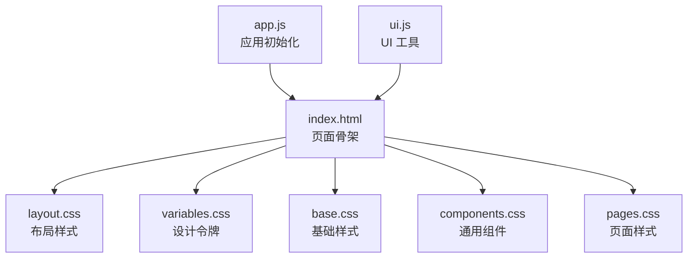
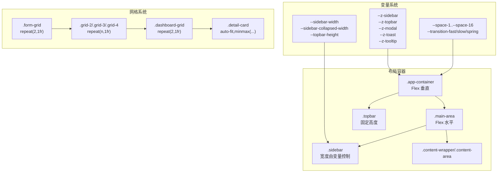
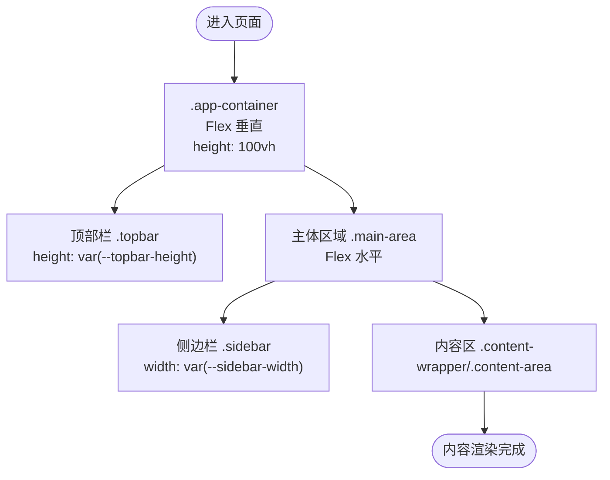
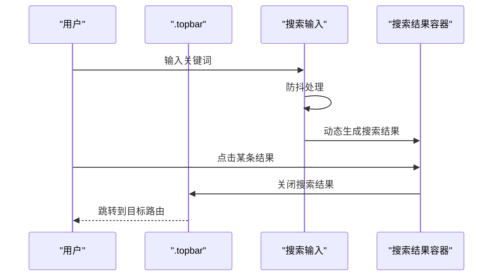
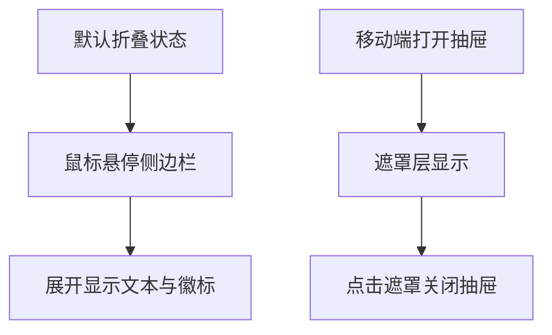
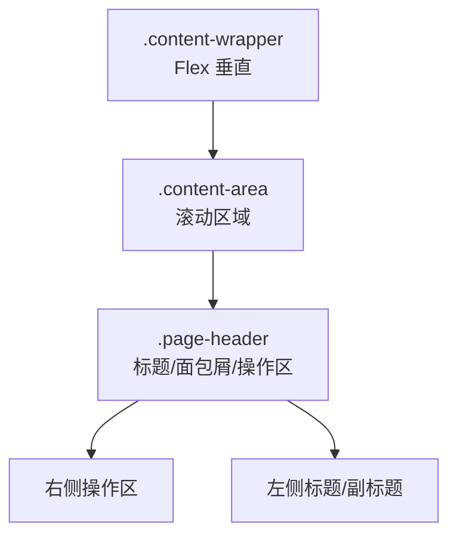
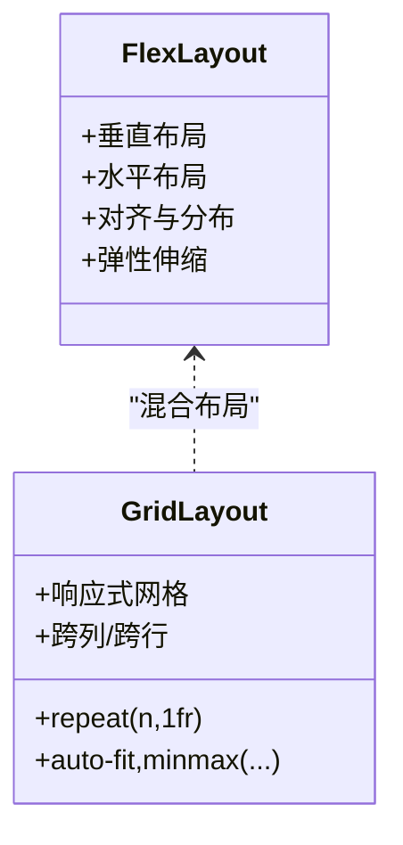
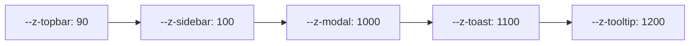
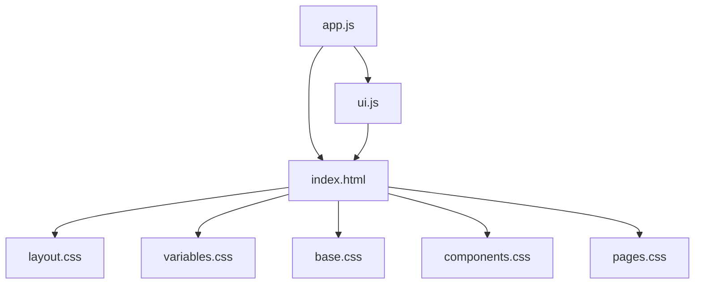

# 布局系统架构

<cite>
**本文档引用的文件**
- [index.html](file://index.html)
- [layout.css](file://css/layout.css)
- [variables.css](file://css/variables.css)
- [base.css](file://css/base.css)
- [components.css](file://css/components.css)
- [pages.css](file://css/pages.css)
- [app.js](file://js/app.js)
- [ui.js](file://js/ui.js)
</cite>

## 目录
1. [引言](#引言)
2. [项目结构](#项目结构)
3. [核心组件](#核心组件)
4. [架构总览](#架构总览)
5. [详细组件分析](#详细组件分析)
6. [依赖关系分析](#依赖关系分析)
7. [性能考量](#性能考量)
8. [故障排查指南](#故障排查指南)
9. [结论](#结论)
10. [附录](#附录)

## 引言
本文件系统性梳理 CRM 系统的布局系统架构，围绕主容器、顶部栏、侧边栏、主要内容区域的布局结构展开；解释布局变量系统（如 sidebar-width、topbar-height 等）的作用与使用方式；深入说明 Flexbox 与 CSS Grid 在布局中的应用（弹性布局、网格布局与混合布局）；阐述布局的嵌套关系与层级管理（z-index 系统与层叠上下文控制）；最后提供布局定制指南与常见问题的解决方案，帮助开发者快速理解并扩展布局体系。

## 项目结构
该布局系统以 HTML 结构为核心，配合 CSS 变量与多层样式文件协同实现响应式与可定制的界面布局。核心文件如下：
- HTML 结构：定义顶层容器与各功能区的骨架
- 变量系统：集中定义设计令牌（颜色、尺寸、间距、字体、过渡、z-index）
- 基础样式：统一基础排版、滚动条、动画与通用交互
- 布局样式：定义主容器、顶部栏、侧边栏、内容区、页面头部等
- 组件样式：通用 UI 组件（按钮、表单、卡片、表格、模态框等），包含大量 Grid 使用
- 页面样式：页面特定布局（仪表盘网格、详情页布局等）

图表来源
- [index.html:14-119](file://index.html#L14-L119)
- [layout.css:6-482](file://css/layout.css#L6-L482)
- [variables.css:6-127](file://css/variables.css#L6-L127)
- [base.css:11-25](file://css/base.css#L11-L25)
- [components.css:148-866](file://css/components.css#L148-L866)
- [pages.css:6-224](file://css/pages.css#L6-L224)

章节来源
- [index.html:14-119](file://index.html#L14-L119)
- [layout.css:6-482](file://css/layout.css#L6-L482)
- [variables.css:6-127](file://css/variables.css#L6-L127)
- [base.css:11-25](file://css/base.css#L11-L25)
- [components.css:148-866](file://css/components.css#L148-L866)
- [pages.css:6-224](file://css/pages.css#L6-L224)

## 核心组件
- 主容器（.app-container）：采用 Flex 垂直布局，占满视口高度，作为整个布局的根容器
- 顶部栏（.topbar）：固定高度，深蓝背景，内含品牌区、搜索、通知、用户信息等
- 侧边栏（.sidebar）：宽度由变量控制，支持折叠与移动端抽屉模式
- 主体区域（.main-area）：Flex 水平布局，容纳侧边栏与内容区
- 内容区（.content-wrapper/.content-area）：内容容器与滚动区域，承载页面内容
- 页面头部（.page-header）：页面级标题与面包屑、右侧操作区
- 响应式与移动端（媒体查询）：针对不同断点下的布局调整与交互行为

章节来源
- [layout.css:6-482](file://css/layout.css#L6-L482)
- [index.html:14-119](file://index.html#L14-L119)

## 架构总览
布局系统采用“变量驱动 + Flex/Grid 混合”的架构：
- 变量系统：通过 CSS 自定义属性集中管理尺寸、颜色、间距、字体、过渡与 z-index，确保主题一致性与易维护性
- Flex 布局：用于主容器、顶部栏、侧边栏导航项等一维排列场景
- CSS Grid：用于页面网格布局（仪表盘、详情页卡片、组件栅格等），实现二维空间的灵活排布
- 响应式策略：基于媒体查询在不同屏幕宽度下切换布局与交互（如侧边栏折叠、移动端抽屉）

图表来源
- [variables.css:93-127](file://css/variables.css#L93-L127)
- [layout.css:6-482](file://css/layout.css#L6-L482)
- [components.css:148-866](file://css/components.css#L148-L866)
- [pages.css:6-224](file://css/pages.css#L6-L224)

## 详细组件分析

### 主容器与主体区域
- 主容器采用 Flex 垂直布局，高度占满视口，隐藏溢出，确保内部子元素按需伸缩
- 主体区域水平排列，包含侧边栏与内容区，内容区使用 Flex 增长以填充剩余空间

图表来源
- [layout.css:6-482](file://css/layout.css#L6-L482)
- [index.html:14-119](file://index.html#L14-L119)

章节来源
- [layout.css:6-482](file://css/layout.css#L6-L482)
- [index.html:14-119](file://index.html#L14-L119)

### 顶部栏（Topbar）
- 固定高度，深蓝渐变背景，使用 z-index 控制层级
- 左侧包含品牌区与面包屑，右侧包含搜索、通知、用户信息等
- 使用 Flex 对齐与间隙，保证在不同断点下的自适应

图表来源
- [layout.css:14-241](file://css/layout.css#L14-L241)
- [app.js:63-160](file://js/app.js#L63-L160)

章节来源
- [layout.css:14-241](file://css/layout.css#L14-L241)
- [app.js:63-160](file://js/app.js#L63-L160)

### 侧边栏（Sidebar）
- 宽度由变量控制，支持折叠与展开两种状态
- 导航项采用 Flex 排列，悬停时展开显示文本与徽标
- 移动端使用抽屉模式，通过 transform 实现滑入，遮罩层控制点击外部关闭

图表来源
- [layout.css:250-481](file://css/layout.css#L250-L481)
- [index.html:48-108](file://index.html#L48-L108)
- [ui.js:318-356](file://js/ui.js#L318-L356)

章节来源
- [layout.css:250-481](file://css/layout.css#L250-L481)
- [index.html:48-108](file://index.html#L48-L108)
- [ui.js:318-356](file://js/ui.js#L318-L356)

### 内容区与页面头部
- 内容区采用 Flex 垂直方向，滚动区域使用平滑滚动与触摸滚动优化
- 页面头部支持左右布局，右侧操作区在窄屏下自动换行

图表来源
- [layout.css:365-421](file://css/layout.css#L365-L421)
- [base.css:377-386](file://css/base.css#L377-L386)

章节来源
- [layout.css:365-421](file://css/layout.css#L365-L421)
- [base.css:377-386](file://css/base.css#L377-L386)

### Flexbox 与 CSS Grid 的应用
- Flexbox
  - 主容器、顶部栏、侧边栏导航项、内容区、页面头部等均使用 Flex 进行一维布局
  - 通过 align-items、justify-content、gap、flex 等属性实现对齐、分布与弹性伸缩
- CSS Grid
  - 表单网格：.form-grid 默认两列，移动端一列
  - 页面网格：.dashboard-grid、.grid-2/3/4、.detail-card 等使用 repeat 与 auto-fit/minmax 实现响应式网格
  - 组件栅格：统计卡片、漏斗图等使用 Grid 实现复杂二维布局

图表来源
- [layout.css:6-482](file://css/layout.css#L6-L482)
- [components.css:148-866](file://css/components.css#L148-L866)
- [pages.css:6-224](file://css/pages.css#L6-L224)

章节来源
- [layout.css:6-482](file://css/layout.css#L6-L482)
- [components.css:148-866](file://css/components.css#L148-L866)
- [pages.css:6-224](file://css/pages.css#L6-L224)

### 嵌套关系与层级管理（z-index）
- z-index 系统集中定义于变量中，确保组件层级清晰可控
- 侧边栏层级高于顶部栏，模态框、Toast、Tooltip 等浮层拥有更高层级
- 通过相对定位与绝对定位配合 z-index，避免层级冲突与遮挡问题

图表来源
- [variables.css:117-122](file://css/variables.css#L117-L122)
- [layout.css:23-258](file://css/layout.css#L23-L258)
- [components.css:490-500](file://css/components.css#L490-L500)
- [components.css:560-570](file://css/components.css#L560-L570)

章节来源
- [variables.css:117-122](file://css/variables.css#L117-L122)
- [layout.css:23-258](file://css/layout.css#L23-L258)
- [components.css:490-500](file://css/components.css#L490-L500)
- [components.css:560-570](file://css/components.css#L560-L570)

## 依赖关系分析
- HTML 依赖 CSS 变量与样式文件，构建页面骨架
- JS 应用逻辑负责路由、导航高亮、移动端抽屉开关、搜索结果渲染等
- UI 工具负责页面标题更新、内容渲染、模态框、Toast 等通用交互

图表来源
- [index.html:7-11](file://index.html#L7-L11)
- [app.js:4-41](file://js/app.js#L4-L41)
- [ui.js:4-40](file://js/ui.js#L4-L40)

章节来源
- [index.html:7-11](file://index.html#L7-L11)
- [app.js:4-41](file://js/app.js#L4-L41)
- [ui.js:4-40](file://js/ui.js#L4-L40)

## 性能考量
- 平滑滚动与触摸滚动：内容区启用平滑滚动与触摸滚动，提升滚动体验
- 动画与过渡：统一使用变量化的过渡时间与缓动函数，保证动画流畅一致
- 响应式优化：在小屏设备上减少不必要的视觉元素与布局计算，优先保证交互性能
- 搜索防抖：全局搜索使用防抖，降低频繁查询带来的性能压力

章节来源
- [base.css:377-386](file://css/base.css#L377-L386)
- [variables.css:111-115](file://css/variables.css#L111-L115)
- [app.js:70-142](file://js/app.js#L70-L142)

## 故障排查指南
- 侧边栏不显示或无法折叠
  - 检查移动端抽屉类名与点击事件绑定是否正确
  - 确认遮罩层与侧边栏的 z-index 层级关系
- 顶部栏内容被遮挡
  - 检查 z-index 变量与定位属性，确保顶部栏层级最高
- 内容区滚动异常
  - 确认内容区启用平滑滚动与触摸滚动属性
- 响应式布局错乱
  - 检查媒体查询断点与 Grid/Flex 的断点规则
- 搜索结果不显示
  - 检查搜索输入事件绑定、防抖逻辑与结果容器插入位置

章节来源
- [layout.css:23-258](file://css/layout.css#L23-L258)
- [layout.css:377-386](file://css/layout.css#L377-L386)
- [layout.css:432-481](file://css/layout.css#L432-L481)
- [app.js:63-160](file://js/app.js#L63-L160)

## 结论
该布局系统以变量驱动为核心，结合 Flexbox 与 CSS Grid 实现了高度可定制、响应式的界面布局。通过清晰的层级管理与嵌套关系，确保在桌面与移动端均具备良好的用户体验。同时，统一的变量系统与组件样式为后续扩展与主题定制提供了坚实基础。

## 附录

### 布局变量系统详解
- 尺寸与间距
  - sidebar-width、sidebar-collapsed-width：控制侧边栏展开与折叠宽度
  - topbar-height：顶部栏固定高度
  - space-1..space-16：间距比例，用于统一布局间距
- 颜色与主题
  - primary 及其明暗版本、success/warning/danger/info 等语义色
  - bg-body、bg-card、bg-sidebar、bg-topbar、bg-overlay 等背景色
  - text-primary、text-secondary、text-muted、text-sidebar、text-sidebar-active 等文字色
- 圆角与阴影
  - radius-sm/md/lg/xl、shadow-xs/sm/md/lg/xl：统一圆角与阴影
- 字体与字号
  - font-sans、font-mono、text-xs..text-3xl：字体族与字号
- 过渡与动画
  - transition-fast/base/slow/spring：统一过渡时间与缓动
- 层级与浮层
  - z-sidebar、z-topbar、z-modal、z-toast、z-tooltip：浮层层级控制

章节来源
- [variables.css:6-127](file://css/variables.css#L6-L127)

### Flexbox 与 CSS Grid 混合布局实践
- Flexbox 适用于一维布局（主容器、导航项、页面头部等）
- CSS Grid 适用于二维布局（表单网格、页面网格、卡片栅格等）
- 混合策略：在内容区内部使用 Grid 实现复杂布局，在容器层面使用 Flex 实现整体排布

章节来源
- [layout.css:6-482](file://css/layout.css#L6-L482)
- [components.css:148-866](file://css/components.css#L148-L866)
- [pages.css:6-224](file://css/pages.css#L6-L224)

### 布局定制指南
- 修改侧边栏宽度：调整 --sidebar-width 与 --sidebar-collapsed-width
- 调整顶部栏高度：修改 --topbar-height
- 改变层级关系：调整 --z-sidebar、--z-topbar、--z-modal 等变量
- 扩展页面网格：使用 .grid-2/.grid-3/.grid-4 或自定义 Grid 规则
- 响应式适配：在媒体查询中调整 Grid 列数与 Flex 方向

章节来源
- [variables.css:93-127](file://css/variables.css#L93-L127)
- [components.css:855-866](file://css/components.css#L855-L866)
- [pages.css:215-223](file://css/pages.css#L215-L223)