# 设计令牌系统

<cite>
**本文档引用的文件**
- [variables.css](file://css/variables.css)
- [base.css](file://css/base.css)
- [layout.css](file://css/layout.css)
- [components.css](file://css/components.css)
- [pages.css](file://css/pages.css)
- [index.html](file://index.html)
</cite>

## 目录
1. [简介](#简介)
2. [项目结构](#项目结构)
3. [核心组件](#核心组件)
4. [架构总览](#架构总览)
5. [详细组件分析](#详细组件分析)
6. [依赖分析](#依赖分析)
7. [性能考虑](#性能考虑)
8. [故障排除指南](#故障排除指南)
9. [结论](#结论)

## 简介
本文件系统性梳理 CRM 系统的设计令牌体系，围绕 CSS 自定义属性（CSS Variables）构建的统一设计语言展开，覆盖主色调系统、语义色系统、中性色系统、背景色/文字色/边框色/阴影系统、间距系统、圆角系统、字体系统与字号层级，并给出最佳实践与自定义指南。该体系以 variables.css 为核心，通过基础样式 base.css、布局 layout.css、组件 components.css、页面 pages.css 的协同应用，形成可维护、可扩展、可主题化的视觉与交互规范。

## 项目结构
设计令牌系统在本项目中的组织方式如下：
- 核心：variables.css 定义所有设计令牌（CSS 变量），作为全局设计语言的唯一真相来源
- 基础：base.css 将变量应用于全局排版、颜色、滚动条、动画等基础层面
- 布局：layout.css 使用变量控制布局尺寸、间距、圆角、阴影、过渡与层级
- 组件：components.css 使用变量驱动按钮、表单、卡片、表格、模态框等通用 UI 组件
- 页面：pages.css 使用变量实现页面特定的网格、标题、列表等样式
- 引用：index.html 以 link 方式引入 variables.css 与其他样式文件，确保变量优先级与作用域正确

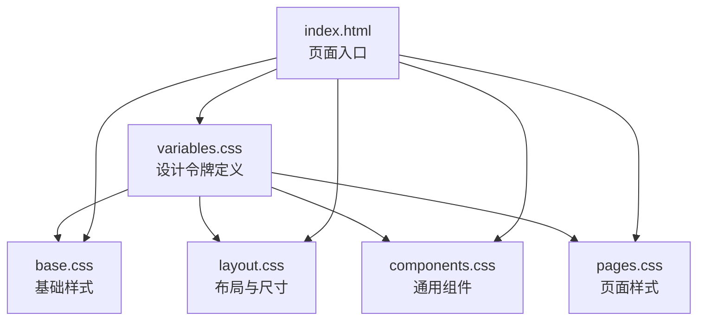

图表来源
- [variables.css:1-128](file://css/variables.css#L1-L128)
- [base.css:1-102](file://css/base.css#L1-L102)
- [layout.css:1-482](file://css/layout.css#L1-L482)
- [components.css:1-823](file://css/components.css#L1-L823)
- [pages.css:1-224](file://css/pages.css#L1-L224)
- [index.html:1-129](file://index.html#L1-L129)

章节来源
- [index.html:7-11](file://index.html#L7-L11)
- [variables.css:6-127](file://css/variables.css#L6-L127)

## 核心组件
本节从设计令牌的维度，逐项解析变量的命名、取值与使用场景，并说明其在系统中的职责与关系。

- 主色调系统（primary-h, primary-s, primary-l）
  - 设计理念：采用 HSL 色彩模型，通过 hue/saturation/lightness 三元组定义主色调及其变体，保证在不同明度下的一致性与可组合性
  - 关键变量：--primary-h/--primary-s/--primary-l 生成 --primary；并派生 --primary-light/--primary-lighter/--primary-dark 与 --primary-fg
  - 应用范围：链接色、按钮主色、侧边栏激活指示、Toast 图标色等
  - 参考路径：[主色调定义:8-15](file://css/variables.css#L8-L15)

- 语义色系统（success, warning, danger, info）
  - 设计理念：为业务状态与操作反馈提供明确的视觉信号，确保用户能快速识别成功、警告、危险与信息提示
  - 关键变量：--success/--success-light/--success-fg；--warning/--warning-light/--warning-fg；--danger/--danger-light/--danger-fg；--info/--info-light
  - 应用范围：状态标签、按钮、表格单元格链接、确认框图标、统计卡片图标等
  - 参考路径：[语义色定义:18-31](file://css/variables.css#L18-L31)

- 中性色系统（gray-50 到 gray-900）
  - 设计理念：提供从浅灰到深灰的连续色阶，满足背景、边框、文本、分隔线等多场景需求
  - 关键变量：--gray-50 至 --gray-900，以及 --border-color/--border-light
  - 应用范围：卡片背景、边框、滚动条、占位符、禁用态、选中色等
  - 参考路径：[中性色定义:34-43](file://css/variables.css#L34-L43)

- 背景色、文字色、边框色、阴影系统
  - 背景色：--bg-body/--bg-card/--bg-sidebar/--bg-sidebar-hover/--bg-sidebar-active/--bg-topbar/--bg-topbar-gradient/--bg-overlay
  - 文字色：--text-primary/--text-secondary/--text-muted/--text-sidebar/--text-sidebar-active
  - 边框色：--border-color/--border-light
  - 阴影：--shadow-xs/--shadow-sm/--shadow-md/--shadow-lg/--shadow-xl
  - 应用范围：整体背景、卡片、侧边栏、顶栏、遮罩层、表格、模态框、Toast 等
  - 参考路径：[背景/文字/边框/阴影定义:46-71](file://css/variables.css#L46-L71)

- 间距系统（space-1 到 space-16）
  - 设计理念：以 4px 为基准的离散倍数系统，便于在布局、内边距、外边距、栅格间隙中保持一致的比例关系
  - 关键变量：--space-1 至 --space-16（对应 4~64px）
  - 应用范围：按钮高度、表单控件尺寸、卡片内边距、网格间隙、页头间距等
  - 参考路径：[间距定义:82-91](file://css/variables.css#L82-L91)

- 圆角系统（radius-sm 到 radius-full）
  - 设计理念：从细小圆角到全圆角的渐进式半径，适配按钮、卡片、输入框、模态框等不同组件
  - 关键变量：--radius-sm/--radius-md/--radius-lg/--radius-xl/--radius-full/--radius-btn
  - 应用范围：按钮、卡片、输入框、模态框、Toast、时间线点等
  - 参考路径：[圆角定义:74-79](file://css/variables.css#L74-L79)

- 字体系统（font-sans, font-mono）与字号系统（text-xs 到 text-3xl）
  - 字体系统：--font-sans 提供跨平台无衬线字体栈；--font-mono 提供编程字体栈
  - 字号系统：--text-xs/--text-sm/--text-base/--text-lg/--text-xl/--text-2xl/--text-3xl
  - 应用范围：全局字体族、标题、正文、按钮、标签、表格、页头等
  - 参考路径：[字体与字号定义:99-109](file://css/variables.css#L99-L109)

- 过渡与层级（transition 与 z-index）
  - 过渡：--transition-fast/--transition-base/--transition-slow/--transition-spring
  - 层级：--z-sidebar/--z-topbar/--z-modal/--z-toast/--z-tooltip
  - 应用范围：动画时序、遮罩层、弹窗、Toast、Tooltip 等
  - 参考路径：[过渡与层级定义:112-122](file://css/variables.css#L112-L122)

章节来源
- [variables.css:6-127](file://css/variables.css#L6-L127)

## 架构总览
设计令牌系统遵循“单一真相源”的原则：所有视觉与交互参数均来自 variables.css，其他样式文件仅通过 var() 引用这些变量，从而实现：
- 主题一致性：同一变量在多处复用，避免色彩与间距的漂移
- 易于定制：修改 variables.css 即可批量调整风格
- 可维护性：变量命名清晰、分组明确，便于团队协作与知识沉淀

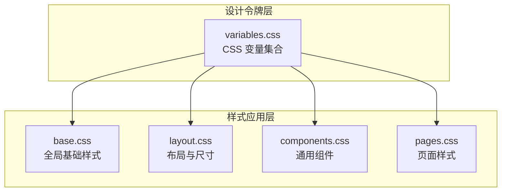

图表来源
- [variables.css:6-127](file://css/variables.css#L6-L127)
- [base.css:11-25](file://css/base.css#L11-L25)
- [layout.css:15-262](file://css/layout.css#L15-L262)
- [components.css:6-138](file://css/components.css#L6-L138)
- [pages.css:6-219](file://css/pages.css#L6-L219)

## 详细组件分析

### 主色调系统（HSL 主色 + 变体）
- 设计要点
  - 以 HSL 三元组定义主色，确保在不同明度下保持色相一致
  - 通过派生变量提供亮/暗/更亮等层次，满足悬停、激活、禁用等状态
  - 为按钮前景色提供对比色（--primary-fg），确保可读性
- 实现与使用
  - 在 buttons、sidebar active indicator、Toast icon 等组件中广泛使用
  - 参考路径：[主色调与变体:8-15](file://css/variables.css#L8-L15)，[按钮主色:24-28](file://css/components.css#L24-L28)，[侧边栏激活指示:319-328](file://css/layout.css#L319-L328)

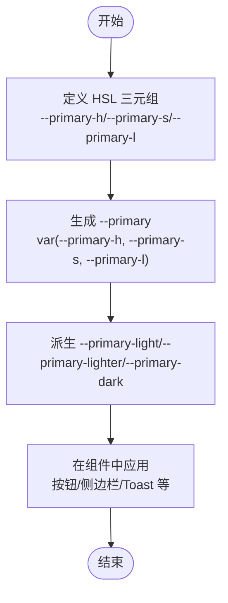

图表来源
- [variables.css:8-15](file://css/variables.css#L8-L15)
- [components.css:24-30](file://css/components.css#L24-L30)
- [layout.css:319-328](file://css/layout.css#L319-L328)

章节来源
- [variables.css:8-15](file://css/variables.css#L8-L15)
- [components.css:24-30](file://css/components.css#L24-L30)
- [layout.css:319-328](file://css/layout.css#L319-L328)

### 语义色系统（success/warning/danger/info）
- 设计要点
  - 成功/警告/危险/信息四类语义色分别用于不同业务状态与操作反馈
  - 搭配轻量背景色（如 --success-light）与前景对比色（如 --success-fg），提升可读性
- 实现与使用
  - 状态标签、按钮、表格链接、确认框图标、统计卡片图标等
  - 参考路径：[语义色定义:18-31](file://css/variables.css#L18-L31)，[状态标签:380-396](file://css/components.css#L380-L396)，[确认框图标:567-579](file://css/components.css#L567-L579)

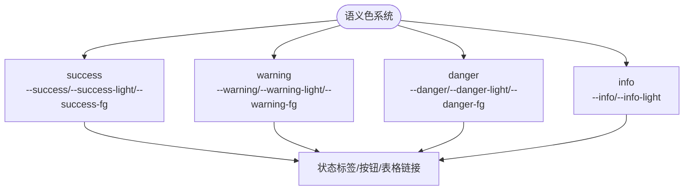

图表来源
- [variables.css:18-31](file://css/variables.css#L18-L31)
- [components.css:380-396](file://css/components.css#L380-L396)
- [components.css:567-579](file://css/components.css#L567-L579)

章节来源
- [variables.css:18-31](file://css/variables.css#L18-L31)
- [components.css:380-396](file://css/components.css#L380-L396)
- [components.css:567-579](file://css/components.css#L567-L579)

### 中性色系统（gray-50 到 gray-900）
- 设计要点
  - 从极浅灰到深灰的连续色阶，覆盖背景、边框、文本、分隔线等高频场景
  - 与 --border-color/--border-light 配合，满足不同层级的分隔需求
- 实现与使用
  - 卡片背景、滚动条、占位符、禁用态、选中色等
  - 参考路径：[中性色定义:34-43](file://css/variables.css#L34-L43)，[滚动条:55-61](file://css/base.css#L55-L61)，[卡片背景:133-138](file://css/components.css#L133-L138)

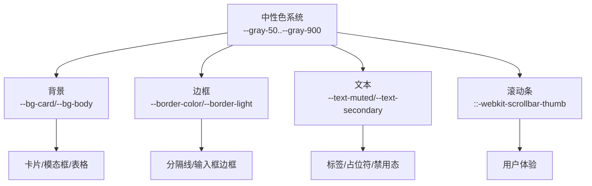

图表来源
- [variables.css:34-43](file://css/variables.css#L34-L43)
- [base.css:55-61](file://css/base.css#L55-L61)
- [components.css:133-138](file://css/components.css#L133-L138)

章节来源
- [variables.css:34-43](file://css/variables.css#L34-L43)
- [base.css:55-61](file://css/base.css#L55-L61)
- [components.css:133-138](file://css/components.css#L133-L138)

### 背景色、文字色、边框色、阴影系统
- 设计要点
  - 背景色：--bg-body/--bg-card/--bg-sidebar/--bg-topbar/--bg-overlay 等，支撑整体界面氛围
  - 文字色：--text-primary/--text-secondary/--text-muted 等，确保信息层级与可读性
  - 边框色：--border-color/--border-light，区分强弱分隔
  - 阴影：--shadow-xs/--shadow-sm/--shadow-md/--shadow-lg/--shadow-xl，表达层级与立体感
- 实现与使用
  - 顶栏、侧边栏、卡片、表格、模态框、Toast、时间线等
  - 参考路径：[背景/文字/边框/阴影定义:46-71](file://css/variables.css#L46-L71)，[顶栏与侧边栏:15-262](file://css/layout.css#L15-L262)，[卡片与表格:133-283](file://css/components.css#L133-L283)

```mermaid
flowchart TD
BG["背景色"] --> Body["--bg-body"]
BG --> Card["--bg-card"]
BG --> Sidebar["--bg-sidebar/--bg-sidebar-hover/--bg-sidebar-active"]
BG --> Topbar["--bg-topbar/--bg-topbar-gradient"]
BG --> Overlay["--bg-overlay"]
Text["文字色"] --> Primary["--text-primary"]
Text --> Secondary["--text-secondary"]
Text --> Muted["--text-muted"]
Text --> SidebarActive["--text-sidebar-active"]
Border["边框色"] --> Normal["--border-color"]
Border --> Light["--border-light"]
Shadow["阴影"] --> XS["--shadow-xs"]
Shadow --> SM["--shadow-sm"]
Shadow --> MD["--shadow-md"]
Shadow --> LG["--shadow-lg"]
Shadow --> XL["--shadow-xl"]
BG --> LayoutApply["布局应用"]
Text --> LayoutApply
Border --> CompApply["组件应用"]
Shadow --> CompApply
```

图表来源
- [variables.css:46-71](file://css/variables.css#L46-L71)
- [layout.css:15-262](file://css/layout.css#L15-L262)
- [components.css:133-283](file://css/components.css#L133-L283)

章节来源
- [variables.css:46-71](file://css/variables.css#L46-L71)
- [layout.css:15-262](file://css/layout.css#L15-L262)
- [components.css:133-283](file://css/components.css#L133-L283)

### 间距系统（space-1 到 space-16）
- 设计要点
  - 以 4px 为基准的离散倍数（1~16），确保布局比例与视觉节奏一致
  - 通过 var(--space-N) 在按钮、卡片、表格、网格等组件中统一使用
- 实现与使用
  - 按钮高度、内边距、表单控件尺寸、卡片内边距、网格间隙、页头间距等
  - 参考路径：[间距定义:82-91](file://css/variables.css#L82-L91)，[按钮尺寸与内边距:11-21](file://css/components.css#L11-L21)，[卡片内边距:144-158](file://css/components.css#L144-L158)

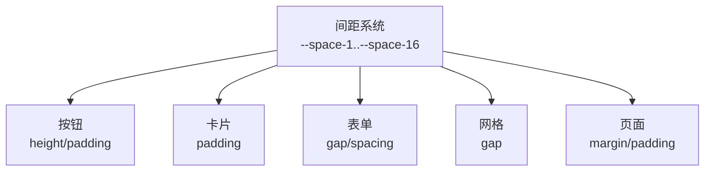

图表来源
- [variables.css:82-91](file://css/variables.css#L82-L91)
- [components.css:11-21](file://css/components.css#L11-L21)
- [components.css:144-158](file://css/components.css#L144-L158)

章节来源
- [variables.css:82-91](file://css/variables.css#L82-L91)
- [components.css:11-21](file://css/components.css#L11-L21)
- [components.css:144-158](file://css/components.css#L144-L158)

### 圆角系统（radius-sm 到 radius-full）
- 设计要点
  - 从细小圆角到全圆角的渐进式半径，适配不同组件的视觉权重
  - --radius-btn 专门用于按钮，确保与按钮高度协调
- 实现与使用
  - 按钮、卡片、输入框、模态框、Toast、时间线点等
  - 参考路径：[圆角定义:74-79](file://css/variables.css#L74-L79)，[按钮圆角](file://css/components.css#L13)，[卡片圆角](file://css/components.css#L136)

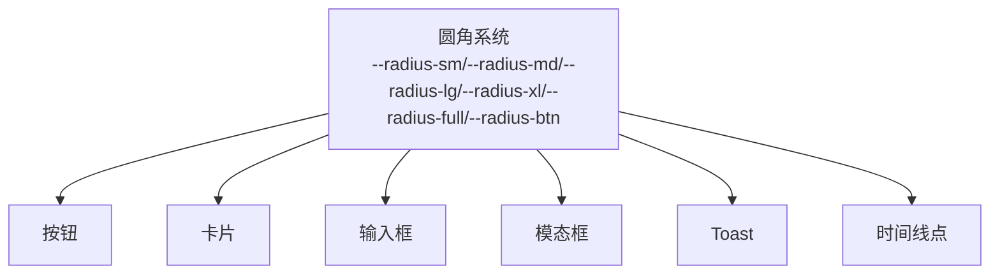

图表来源
- [variables.css:74-79](file://css/variables.css#L74-L79)
- [components.css:13](file://css/components.css#L13)
- [components.css:136](file://css/components.css#L136)

章节来源
- [variables.css:74-79](file://css/variables.css#L74-L79)
- [components.css:13](file://css/components.css#L13)
- [components.css:136](file://css/components.css#L136)

### 字体系统（font-sans, font-mono）与字号系统（text-xs 到 text-3xl）
- 设计要点
  - 字体栈：--font-sans 覆盖多平台无衬线字体；--font-mono 专用于代码与等宽场景
  - 字号层级：从 --text-xs 到 --text-3xl，形成清晰的信息层级
- 实现与使用
  - 全局字体族、标题、正文、按钮、标签、表格、页头等
  - 参考路径：[字体与字号定义:99-109](file://css/variables.css#L99-L109)，[全局字体与字号:12-20](file://css/base.css#L12-L20)，[页头字号:404-408](file://css/pages.css#L404-L408)

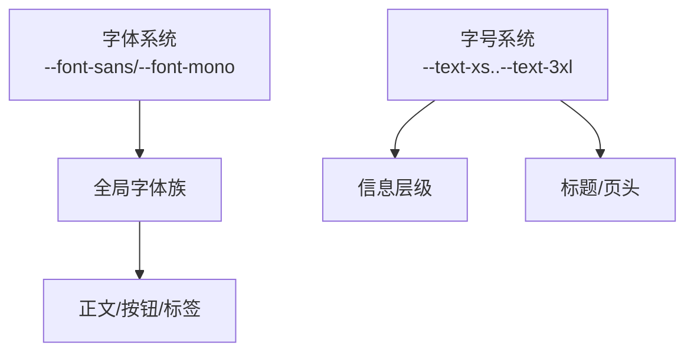

图表来源
- [variables.css:99-109](file://css/variables.css#L99-L109)
- [base.css:12-20](file://css/base.css#L12-L20)
- [pages.css:404-408](file://css/pages.css#L404-L408)

章节来源
- [variables.css:99-109](file://css/variables.css#L99-L109)
- [base.css:12-20](file://css/base.css#L12-L20)
- [pages.css:404-408](file://css/pages.css#L404-L408)

### 过渡与层级（transition 与 z-index）
- 设计要点
  - 过渡：--transition-fast/--transition-base/--transition-slow/--transition-spring，匹配不同交互节奏
  - 层级：--z-sidebar/--z-topbar/--z-modal/--z-toast/--z-tooltip，确保遮罩与弹层的正确堆叠
- 实现与使用
  - 动画时序、遮罩层、弹窗、Toast、Tooltip 等
  - 参考路径：[过渡与层级定义:112-122](file://css/variables.css#L112-L122)，[动画应用:99-101](file://css/base.css#L99-L101)，[遮罩与层级:423-430](file://css/layout.css#L423-L430)

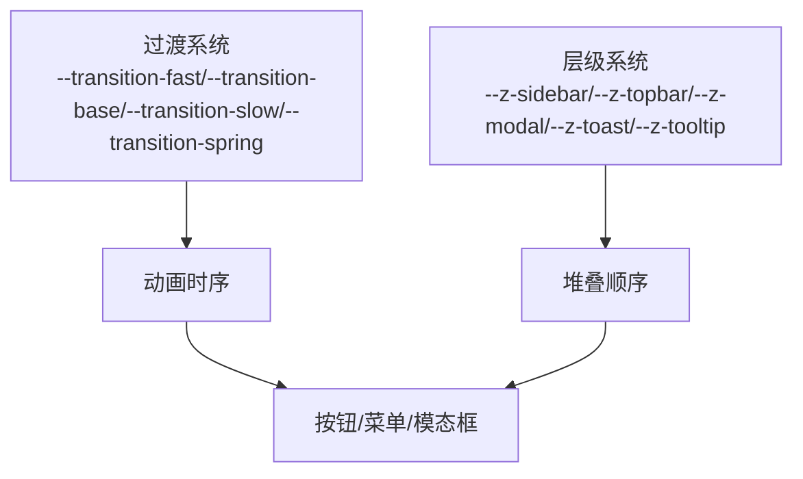

图表来源
- [variables.css:112-122](file://css/variables.css#L112-L122)
- [base.css:99-101](file://css/base.css#L99-L101)
- [layout.css:423-430](file://css/layout.css#L423-L430)

章节来源
- [variables.css:112-122](file://css/variables.css#L112-L122)
- [base.css:99-101](file://css/base.css#L99-L101)
- [layout.css:423-430](file://css/layout.css#L423-L430)

## 依赖分析
- 变量来源与依赖关系
  - variables.css 是唯一真相源，被 base.css、layout.css、components.css、pages.css 通过 var() 引用
  - index.html 以 link 方式引入样式文件，确保 variables.css 在最前，保证变量优先级
- 耦合与内聚
  - 各样式文件对变量的依赖高，内部耦合低，便于维护与扩展
  - 变量命名语义清晰，分组明确，内聚性好
- 外部依赖
  - 未发现外部依赖，所有样式均为本地资源

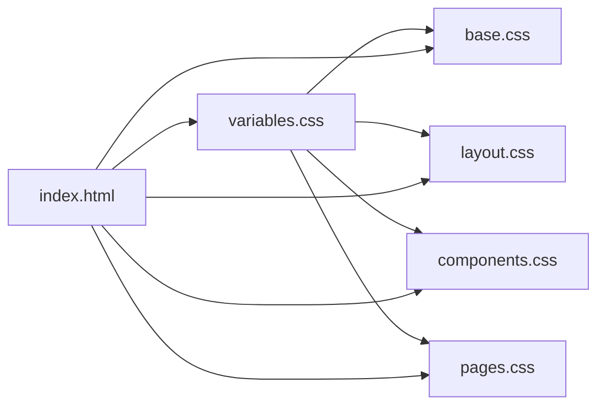

图表来源
- [index.html:7-11](file://index.html#L7-L11)
- [variables.css:6-127](file://css/variables.css#L6-L127)

章节来源
- [index.html:7-11](file://index.html#L7-L11)
- [variables.css:6-127](file://css/variables.css#L6-L127)

## 性能考虑
- 变量复用减少重复计算
  - 通过 var(--space-N)、var(--radius-*)、var(--shadow-*) 等复用，避免重复声明，降低 CSS 体积
- 减少重绘与回流
  - 使用 CSS 变量替代 JavaScript 动态样式切换，减少 DOM 操作带来的性能损耗
- 响应式与动画
  - 合理使用 --transition-* 与 --shadow-*，避免过度阴影与复杂动画导致的性能问题
- 建议
  - 控制变量数量与层级，避免过度嵌套与深层继承
  - 在组件中优先使用语义化变量名，减少选择器复杂度

## 故障排除指南
- 变量未生效
  - 检查 variables.css 是否在 index.html 中最先加载
  - 确认 var(--variable-name) 的拼写与大小写一致
  - 参考路径：[HTML 引入顺序:7-11](file://index.html#L7-L11)
- 颜色对比度不足
  - 使用 --text-primary 与 --primary-fg 等对比色变量，确保可读性
  - 参考路径：[主色调与前景色:14-15](file://css/variables.css#L14-L15)
- 圆角与按钮高度不匹配
  - 使用 --radius-btn 与按钮高度保持一致的比例
  - 参考路径：[圆角与按钮](file://css/variables.css#L79)，[按钮圆角](file://css/components.css#L13)
- 阴影层级混乱
  - 使用 --z-modal/--z-toast/--z-tooltip 等层级变量，避免遮挡与显示异常
  - 参考路径：[层级变量:118-122](file://css/variables.css#L118-L122)

章节来源
- [index.html:7-11](file://index.html#L7-L11)
- [variables.css:14-15](file://css/variables.css#L14-L15)
- [variables.css:79](file://css/variables.css#L79)
- [components.css:13](file://css/components.css#L13)
- [variables.css:118-122](file://css/variables.css#L118-L122)

## 结论
本设计令牌系统以 CSS 变量为核心，构建了从色彩、间距、圆角、字体到过渡与层级的完整视觉与交互规范。通过清晰的命名、合理的分组与严格的依赖关系，实现了主题一致性、易定制性与可维护性。建议在后续迭代中持续完善变量命名规范、补充暗色模式支持，并建立变量变更的审查流程，以保障设计系统长期稳定演进。