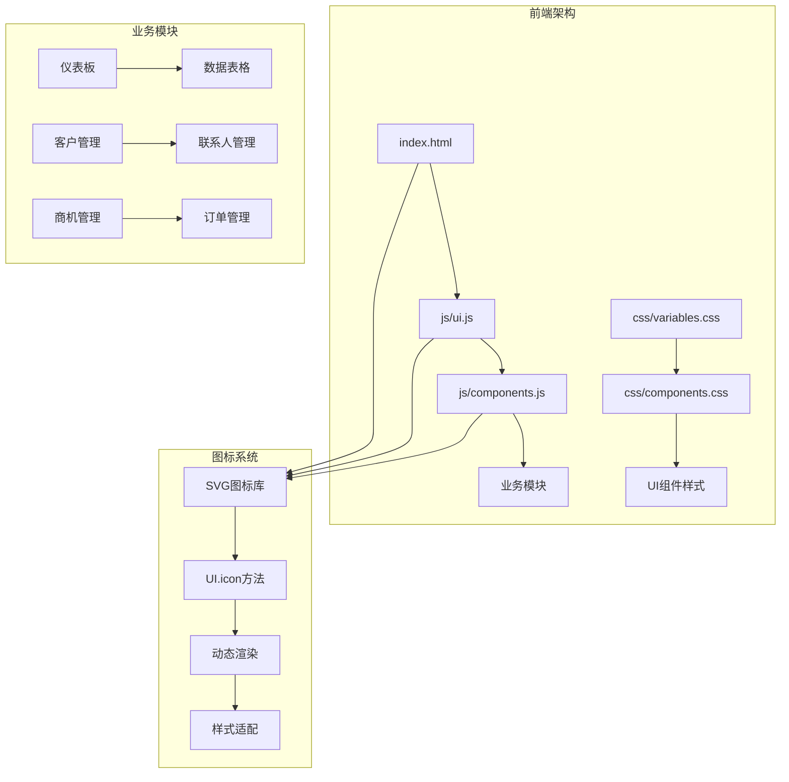
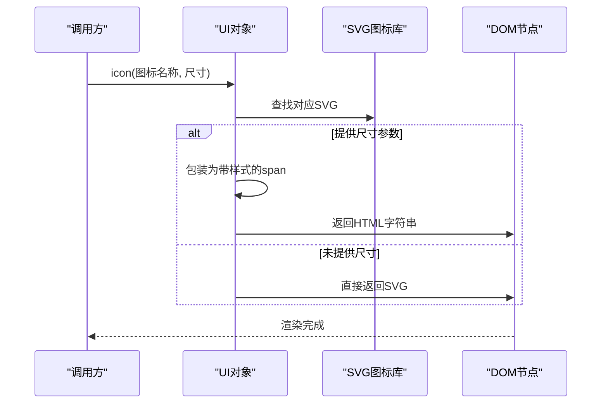
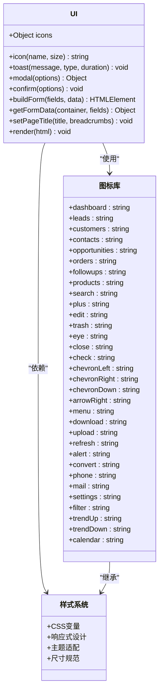
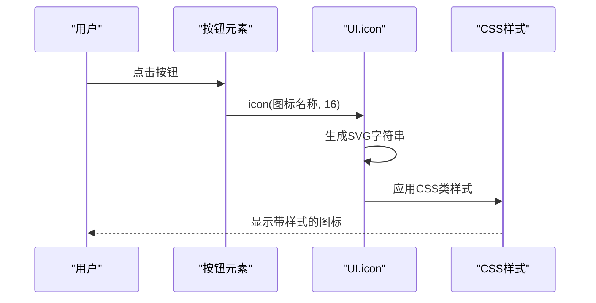
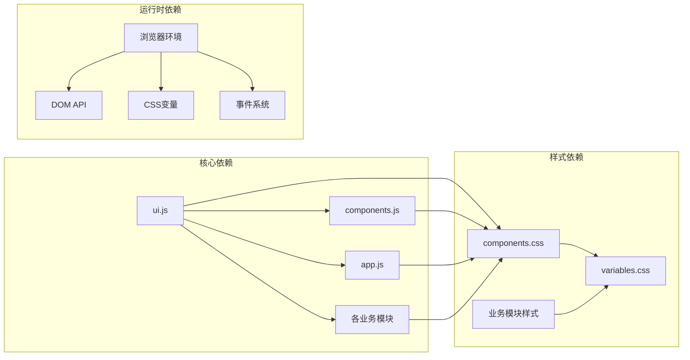

# SVG图标系统

<cite>
**本文档引用的文件**
- [ui.js](file://js/ui.js)
- [components.js](file://js/components.js)
- [components.css](file://css/components.css)
- [variables.css](file://css/variables.css)
- [app.js](file://js/app.js)
- [index.html](file://index.html)
</cite>

## 目录
1. [简介](#简介)
2. [项目结构](#项目结构)
3. [核心组件](#核心组件)
4. [架构概览](#架构概览)
5. [详细组件分析](#详细组件分析)
6. [依赖关系分析](#依赖关系分析)
7. [性能考虑](#性能考虑)
8. [故障排除指南](#故障排除指南)
9. [结论](#结论)

## 简介

CRM系统采用纯SVG图标库设计，通过JavaScript动态生成和管理图标。该系统提供了完整的图标解决方案，包括图标库、图标渲染方法、样式适配和响应式支持。系统包含33个精心设计的SVG图标，涵盖业务管理的各个方面，从基础功能到专业业务场景。

## 项目结构



**图表来源**
- [index.html:1-129](file://index.html#L1-L129)
- [ui.js:1-364](file://js/ui.js#L1-L364)
- [components.js:1-324](file://js/components.js#L1-L324)

**章节来源**
- [index.html:1-129](file://index.html#L1-L129)
- [ui.js:1-364](file://js/ui.js#L1-L364)

## 核心组件

### SVG图标库

系统内置了33个高质量SVG图标，每个图标都经过精心设计，具有以下特点：

- **统一的视口规范**: 所有图标使用24x24的视口坐标系统
- **一致的线条宽度**: 默认stroke-width为2，确保视觉一致性
- **可扩展性**: 基于矢量图形，支持任意缩放不失真
- **主题适配**: 使用CSS变量，自动适配不同主题

### icon()方法实现



**图表来源**
- [ui.js:41-46](file://js/ui.js#L41-L46)

**章节来源**
- [ui.js:41-46](file://js/ui.js#L41-L46)

## 架构概览



**图表来源**
- [ui.js:4-39](file://js/ui.js#L4-L39)
- [ui.js:41-46](file://js/ui.js#L41-L46)

**章节来源**
- [ui.js:4-39](file://js/ui.js#L4-L39)
- [ui.js:41-46](file://js/ui.js#L41-L46)

## 详细组件分析

### 图标库完整列表

系统提供33个功能完整的SVG图标，按功能分类如下：

#### 基础界面图标
- **dashboard**: 仪表板布局图标
- **menu**: 菜单汉堡图标
- **close**: 关闭/退出图标
- **check**: 确认/完成图标
- **search**: 搜索图标

#### 导航与方向
- **chevronLeft**: 左侧箭头
- **chevronRight**: 右侧箭头
- **chevronDown**: 下方箭头
- **arrowRight**: 右箭头

#### 操作与状态
- **plus**: 添加/新建
- **edit**: 编辑
- **trash**: 删除
- **eye**: 查看/隐藏
- **alert**: 警告/提示

#### 业务功能图标
- **leads**: 线索管理
- **customers**: 客户管理
- **contacts**: 联系人
- **opportunities**: 商机管理
- **orders**: 订单管理
- **followups**: 跟进记录
- **products**: 产品管理

#### 文件与数据操作
- **download**: 下载
- **upload**: 上传
- **refresh**: 刷新
- **filter**: 筛选
- **convert**: 转换

#### 通信与联系
- **phone**: 电话
- **mail**: 邮件
- **calendar**: 日历

#### 设置与配置
- **settings**: 设置
- **trendUp**: 上升趋势
- **trendDown**: 下降趋势

**章节来源**
- [ui.js:6-39](file://js/ui.js#L6-L39)

### 图标使用方式详解

#### 基本使用语法
```javascript
// 基本用法 - 返回SVG字符串
const iconHtml = UI.icon('dashboard');

// 带尺寸 - 返回带样式的span
const sizedIcon = UI.icon('plus', 20);
```

#### 参数说明
- **name**: 图标名称（必需），必须是图标库中存在的键名
- **size**: 图标尺寸（可选），以像素为单位的正整数

#### 返回值
- 未指定尺寸：直接返回SVG字符串
- 指定尺寸：返回包装在span中的HTML，包含内联样式

**章节来源**
- [ui.js:41-46](file://js/ui.js#L41-L46)

### 在组件中的应用

#### 数据表格组件中的图标使用

```mermaid
flowchart TD
A[DataTable组件] --> B[工具栏搜索]
B --> C[UI.icon('search')]
A --> D[操作列]
D --> E[查看按钮 UI.icon('eye')]
D --> F[编辑按钮 UI.icon('edit')]
D --> G[删除按钮 UI.icon('trash')]
A --> H[分页导航]
H --> I[上一页 UI.icon('chevronLeft')]
H --> J[下一页 UI.icon('chevronRight')]
```

**图表来源**
- [components.js:72-74](file://js/components.js#L72-L74)
- [components.js:114-118](file://js/components.js#L114-L118)
- [components.js:130-141](file://js/components.js#L130-L141)

#### 按钮组件中的图标集成



**图表来源**
- [components.css:22](file://css/components.css#L22)
- [components.css:310](file://css/components.css#L310)

**章节来源**
- [components.js:72-74](file://js/components.js#L72-L74)
- [components.js:114-118](file://js/components.js#L114-L118)
- [components.js:130-141](file://js/components.js#L130-L141)

### 样式系统与主题适配

#### CSS变量系统
系统使用CSS变量实现主题适配，所有图标颜色都会自动跟随主题变化：

```css
/* 主题颜色变量 */
--primary: #1a56db;        /* 主色调蓝色 */
--success: #059669;         /* 成功绿色 */
--warning: #d97706;         /* 警告橙色 */
--danger: #dc2626;          /* 错误红色 */
--text-primary: #1f2937;    /* 主要文字色 */
--text-secondary: #4b5563;  /* 次要文字色 */
```

#### 响应式尺寸规范
- **按钮图标**: 16px × 16px
- **操作按钮图标**: 15px × 15px  
- **模态框图标**: 18px × 18px
- **Toast图标**: 20px × 20px
- **统计卡片图标**: 22px × 22px
- **分页按钮图标**: 14px × 14px

**章节来源**
- [variables.css:6-61](file://css/variables.css#L6-L61)
- [components.css:22](file://css/components.css#L22)
- [components.css:310](file://css/components.css#L310)

## 依赖关系分析



**图表来源**
- [ui.js:1-364](file://js/ui.js#L1-L364)
- [components.js:1-324](file://js/components.js#L1-L324)
- [components.css:1-823](file://css/components.css#L1-L823)
- [variables.css:1-128](file://css/variables.css#L1-L128)

**章节来源**
- [ui.js:1-364](file://js/ui.js#L1-L364)
- [components.js:1-324](file://js/components.js#L1-L324)

## 性能考虑

### SVG图标的优势

#### 1. 矢量图形特性
- **无限缩放**: 不受分辨率限制，支持高DPI屏幕
- **文件体积小**: 相比位图图标更轻量
- **渲染性能佳**: 浏览器原生优化的矢量渲染

#### 2. 动态生成优势
- **按需加载**: 只渲染实际使用的图标
- **内存效率**: 避免重复的图片资源加载
- **主题适应**: 运行时根据CSS变量调整颜色

#### 3. 响应式特性
- **自适应布局**: 基于CSS的flexbox和grid系统
- **断点优化**: 针对不同屏幕尺寸的图标尺寸调整
- **触摸友好**: 合适的点击区域大小

### 性能优化策略

#### 图标缓存机制
系统通过JavaScript对象缓存SVG字符串，避免重复解析：
- 首次访问时生成SVG字符串
- 后续访问直接返回缓存结果
- 减少DOM操作和字符串拼接开销

#### 渲染优化
- **批量更新**: 在组件更新时一次性渲染所有图标
- **虚拟DOM**: 使用innerHTML进行高效DOM更新
- **事件委托**: 减少事件监听器数量

**章节来源**
- [ui.js:41-46](file://js/ui.js#L41-L46)

## 故障排除指南

### 常见问题及解决方案

#### 1. 图标不显示问题
**症状**: 调用UI.icon()返回空字符串
**原因**: 图标名称不存在或拼写错误
**解决**: 检查图标名称是否在图标库中存在

#### 2. 图标颜色异常
**症状**: 图标显示为默认黑色而非主题色
**原因**: CSS变量未正确设置或样式未加载
**解决**: 确保variables.css在components.css之前加载

#### 3. 图标尺寸不正确
**症状**: 图标过大或过小
**原因**: 未正确设置尺寸参数或CSS样式冲突
**解决**: 检查icon()方法的size参数和相关CSS类

#### 4. 性能问题
**症状**: 页面加载缓慢或滚动卡顿
**原因**: 大量图标同时渲染
**解决**: 使用懒加载或虚拟化技术

**章节来源**
- [ui.js:41-46](file://js/ui.js#L41-L46)
- [components.css:1-823](file://css/components.css#L1-L823)

### 调试技巧

#### 开发者工具检查
1. **Network面板**: 查看SVG字符串是否正确加载
2. **Elements面板**: 检查生成的HTML结构
3. **Console面板**: 监听图标渲染错误

#### 性能监控
- 使用Performance面板分析渲染时间
- 监控内存使用情况
- 检查DOM节点数量

## 结论

CRM系统的SVG图标系统是一个设计精良、功能完整的UI组件。通过纯JavaScript实现的图标库，结合CSS变量的主题适配机制，提供了高度的灵活性和可维护性。

### 主要优势
- **设计理念**: 简洁、一致、可扩展的图标系统
- **实现原理**: 基于SVG的矢量图形，支持任意缩放
- **性能表现**: 高效的缓存机制和渲染优化
- **用户体验**: 响应式设计和主题适配

### 最佳实践建议
1. **命名规范**: 使用语义化的图标名称
2. **尺寸控制**: 遵循统一的尺寸规范
3. **主题适配**: 充分利用CSS变量系统
4. **性能优化**: 合理使用图标，避免过度渲染

该图标系统为CRM系统的用户界面提供了坚实的基础，支持业务功能的完整表达和良好的用户体验。