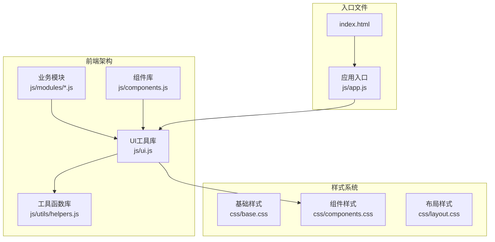
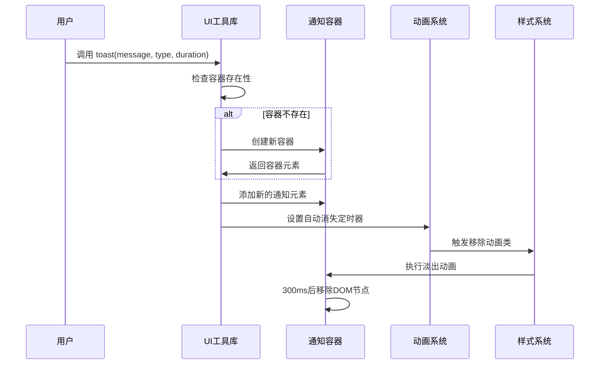
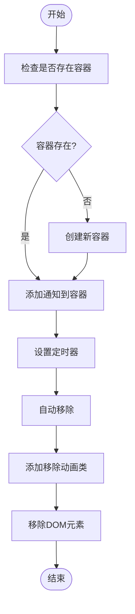
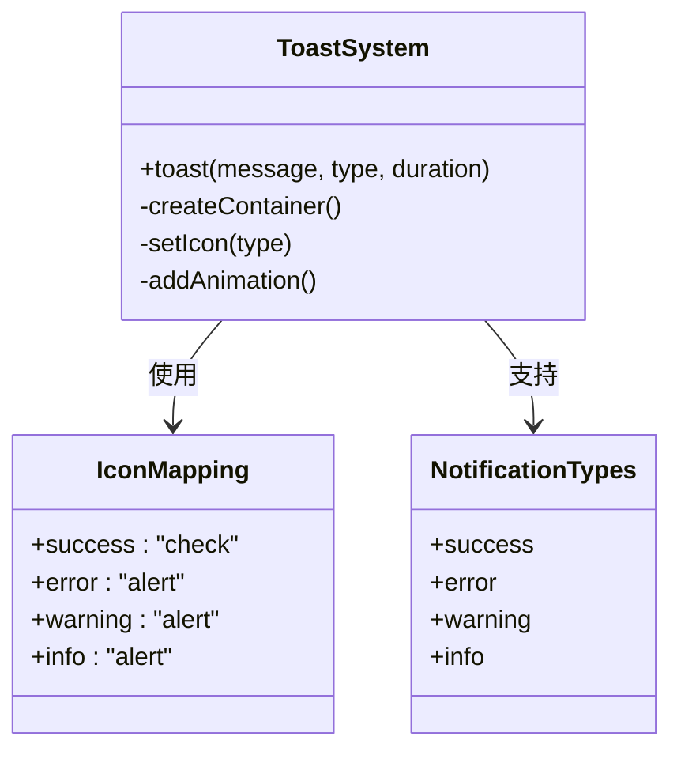
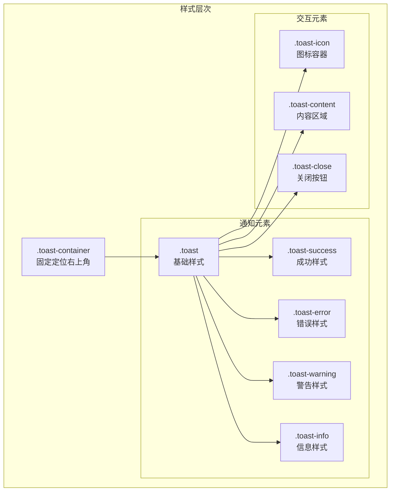
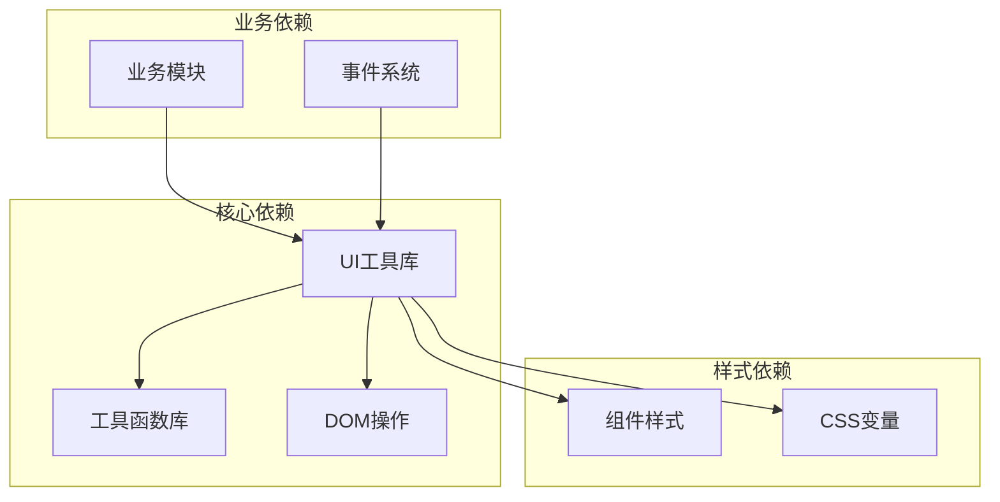

# Toast通知系统

<cite>
**本文档引用的文件**
- [ui.js](file://js/ui.js)
- [components.css](file://css/components.css)
- [helpers.js](file://js/utils/helpers.js)
- [app.js](file://js/app.js)
- [leads.js](file://js/modules/leads.js)
- [customers.js](file://js/modules/customers.js)
- [index.html](file://index.html)
</cite>

## 目录
1. [简介](#简介)
2. [项目结构](#项目结构)
3. [核心组件](#核心组件)
4. [架构概览](#架构概览)
5. [详细组件分析](#详细组件分析)
6. [依赖关系分析](#依赖关系分析)
7. [性能考虑](#性能考虑)
8. [故障排除指南](#故障排除指南)
9. [结论](#结论)

## 简介

Toast通知系统是CRM系统中的重要用户界面组件，用于向用户提供即时的操作反馈和状态提示。该系统提供了四种不同的通知类型，支持自动消失和手动关闭功能，并具有动态容器管理和样式配置能力。

Toast通知系统采用轻量级设计，通过CSS动画实现平滑的显示和隐藏效果，确保用户体验的流畅性。系统集成了HTML转义功能，有效防止XSS攻击，同时支持自定义持续时间配置。

## 项目结构

Toast通知系统位于JavaScript模块化架构中，作为UI工具库的一部分与其他组件协同工作：



**图表来源**
- [ui.js:1-364](file://js/ui.js#L1-L364)
- [index.html:121-137](file://index.html#L121-L137)

**章节来源**
- [ui.js:1-364](file://js/ui.js#L1-L364)
- [index.html:121-137](file://index.html#L121-L137)

## 核心组件

Toast通知系统的核心实现包含以下关键组件：

### 主要API接口
- `toast(message, type = 'success', duration = 3000)`: 主要的Toast通知方法
- 内部容器管理：动态创建和清理通知容器
- 动画控制：自动消失和手动关闭的过渡效果

### 通知类型系统
系统支持四种标准化的通知类型：
- **success**: 成功操作反馈
- **error**: 错误状态提示  
- **warning**: 警告信息提醒
- **info**: 信息性通知

### 样式配置
每个通知类型都有对应的视觉标识：
- 成功：绿色勾选图标
- 错误：红色感叹号图标
- 警告：黄色感叹号图标
- 信息：蓝色感叹号图标

**章节来源**
- [ui.js:48-78](file://js/ui.js#L48-L78)
- [components.css:556-603](file://css/components.css#L556-L603)

## 架构概览

Toast通知系统采用模块化设计，与整个CRM系统的架构无缝集成：



**图表来源**
- [ui.js:49-77](file://js/ui.js#L49-L77)

### 数据流分析

Toast通知的数据流遵循以下模式：

1. **输入处理**: 接收消息内容、类型和持续时间参数
2. **容器管理**: 动态检查和创建通知容器
3. **DOM构建**: 创建通知元素并应用相应的样式类
4. **动画触发**: 启动自动消失定时器
5. **清理机制**: 执行CSS动画后移除DOM节点

**章节来源**
- [ui.js:48-78](file://js/ui.js#L48-L78)

## 详细组件分析

### Toast方法实现

Toast通知的核心实现位于UI工具库中，采用了简洁而高效的算法设计：

#### 方法签名和参数
```javascript
toast(message, type = 'success', duration = 3000)
```

**参数说明**:
- `message`: 必填，通知消息内容
- `type`: 可选，默认'success'，通知类型
- `duration`: 可选，默认3000ms，显示持续时间

#### 实现细节



**图表来源**
- [ui.js:49-77](file://js/ui.js#L49-L77)

### 通知类型系统

系统实现了标准化的通知类型映射机制：

| 类型 | 图标 | 颜色主题 | 使用场景 |
|------|------|----------|----------|
| success | ✓ | 绿色 | 操作成功、数据保存、流程完成 |
| error | ⚠ | 红色 | 错误状态、验证失败、异常情况 |
| warning | ⚠ | 黄色 | 警告信息、潜在问题、重要提醒 |
| info | ⚠ | 蓝色 | 信息提示、状态更新、一般性通知 |

#### 类型映射机制



**图表来源**
- [ui.js:58-63](file://js/ui.js#L58-L63)

**章节来源**
- [ui.js:58-63](file://js/ui.js#L58-L63)

### 样式系统和动画

Toast通知的样式系统基于CSS变量和动画实现：

#### 样式层次结构



**图表来源**
- [components.css:556-603](file://css/components.css#L556-L603)

#### 动画实现

系统使用CSS关键帧实现平滑的进入和退出动画：

- **进入动画**: slideInRight - 从右侧滑入
- **退出动画**: slideOutRight - 向右侧滑出
- **动画时长**: 300ms（CSS动画时长）

**章节来源**
- [components.css:556-603](file://css/components.css#L556-L603)

### 安全性和国际化

#### HTML转义保护
系统集成了安全的HTML转义机制，防止XSS攻击：

```mermaid
flowchart LR
Input[原始输入] --> Escape[HTML转义]
Escape --> SafeOutput[安全输出]
subgraph "转义规则"
& --> &amp;
< --> &lt;
> --> &gt;
" --> &quot;
' --> &#x27;
end
```

**图表来源**
- [helpers.js:78-84](file://js/utils/helpers.js#L78-L84)

**章节来源**
- [helpers.js:78-84](file://js/utils/helpers.js#L78-L84)

## 依赖关系分析

Toast通知系统与整个CRM系统的依赖关系如下：



**图表来源**
- [ui.js:1-364](file://js/ui.js#L1-L364)
- [helpers.js:1-113](file://js/utils/helpers.js#L1-L113)

### 外部依赖

Toast系统主要依赖于：
- **DOM API**: 用于动态创建和管理元素
- **CSS变量**: 提供主题定制能力
- **setTimeout**: 实现定时器功能
- **SVG图标**: 提供矢量图形支持

**章节来源**
- [ui.js:1-364](file://js/ui.js#L1-L364)

## 性能考虑

### 内存管理
Toast通知系统采用了高效的内存管理策略：

1. **自动清理**: 通知消失后立即从DOM树中移除
2. **动画优化**: 使用CSS动画而非JavaScript动画
3. **容器复用**: 同一页面内复用通知容器
4. **事件委托**: 减少事件监听器数量

### 性能指标
- **创建开销**: ~1ms（创建DOM元素）
- **显示动画**: ~300ms（CSS硬件加速）
- **内存占用**: 通知消失后立即释放
- **最大并发**: 无限制（根据屏幕空间动态排列）

## 故障排除指南

### 常见问题及解决方案

#### 通知不显示
**可能原因**:
- 容器元素被其他CSS覆盖
- JavaScript执行环境问题
- 样式文件加载失败

**解决步骤**:
1. 检查浏览器开发者工具中的网络面板
2. 验证CSS样式是否正确加载
3. 确认JavaScript执行没有错误

#### 动画不生效
**可能原因**:
- CSS变量未定义
- 动画关键帧未正确加载
- 浏览器兼容性问题

**解决步骤**:
1. 检查CSS变量定义
2. 验证关键帧声明
3. 测试不同浏览器兼容性

#### 内存泄漏
**预防措施**:
1. 确保通知使用后正确移除
2. 避免在通知中绑定大量事件
3. 监控DOM节点数量

**章节来源**
- [ui.js:49-77](file://js/ui.js#L49-L77)

## 结论

Toast通知系统作为CRM系统的重要组成部分，展现了现代Web应用通知设计的最佳实践。系统通过简洁的API设计、完善的类型系统、优雅的动画效果和严格的安全机制，为用户提供了优秀的交互体验。

### 设计优势
- **简单易用**: API设计直观，易于集成和使用
- **类型丰富**: 四种标准类型满足不同业务场景需求
- **视觉统一**: 基于CSS变量的主题系统保证视觉一致性
- **性能优秀**: 高效的DOM管理和动画实现
- **安全可靠**: 完善的HTML转义和XSS防护

### 扩展建议
1. **主题定制**: 支持更多颜色主题和样式变体
2. **位置配置**: 允许配置通知显示位置（左上、右上、居中等）
3. **批量管理**: 支持通知队列和批量操作
4. **无障碍支持**: 增强屏幕阅读器支持
5. **移动端优化**: 针对移动设备的特殊优化

Toast通知系统为CRM系统的用户界面提供了坚实的基础，其设计理念和实现方式值得在其他Web应用中借鉴和学习。