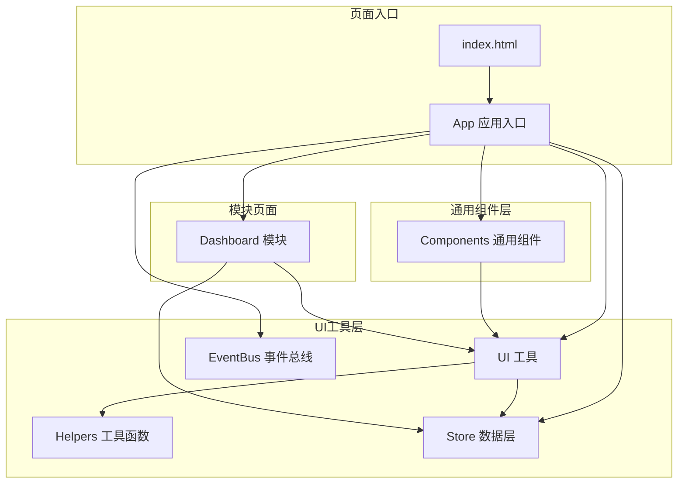
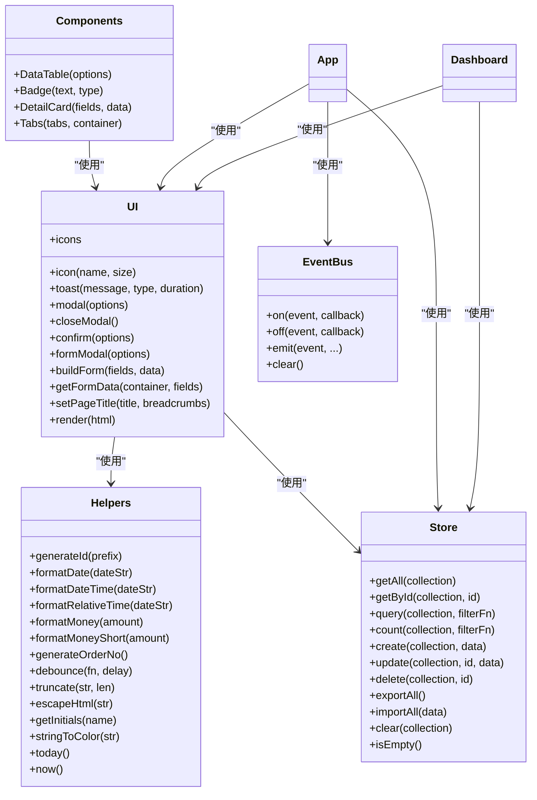
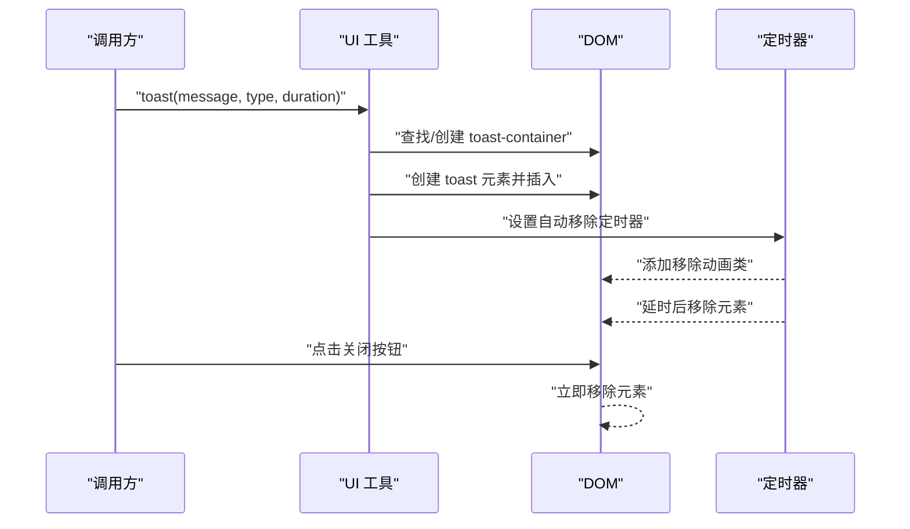
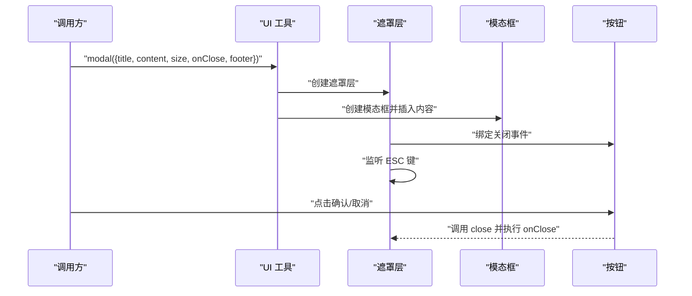
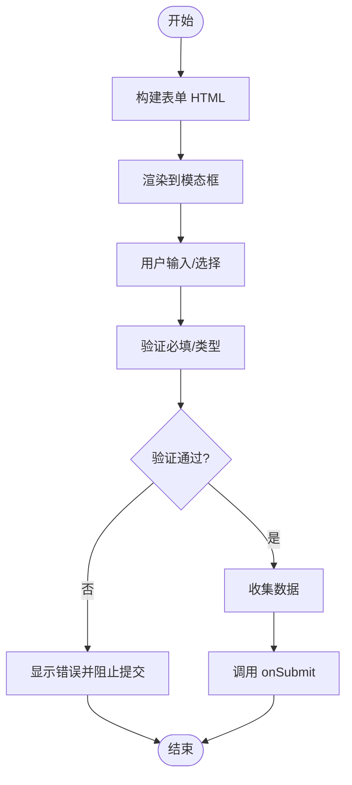
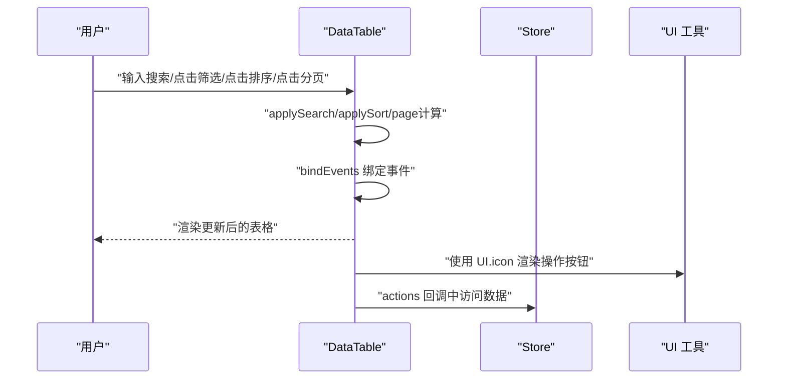
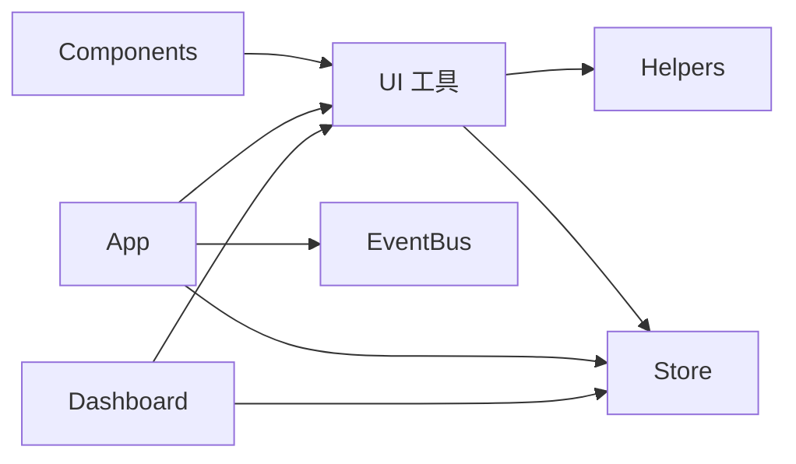

# UI组件系统

<cite>
**本文档引用的文件**
- [ui.js](file://js/ui.js)
- [components.js](file://js/components.js)
- [events.js](file://js/events.js)
- [helpers.js](file://js/utils/helpers.js)
- [store.js](file://js/store.js)
- [app.js](file://js/app.js)
- [dashboard.js](file://js/modules/dashboard.js)
- [index.html](file://index.html)
- [components.css](file://css/components.css)
- [base.css](file://css/base.css)
</cite>

## 目录
1. [简介](#简介)
2. [项目结构](#项目结构)
3. [核心组件](#核心组件)
4. [架构总览](#架构总览)
5. [详细组件分析](#详细组件分析)
6. [依赖关系分析](#依赖关系分析)
7. [性能考量](#性能考量)
8. [故障排查指南](#故障排查指南)
9. [结论](#结论)
10. [附录](#附录)

## 简介
本文件系统性梳理CRM系统的UI组件体系，涵盖设计理念、组件架构、SVG图标库、Toast通知、模态框、表单组件、组件API与事件通信机制。目标是帮助开发者快速理解并高效使用UI组件系统，同时为后续扩展提供清晰的参考路径。

## 项目结构
UI组件系统主要由以下模块构成：
- UI工具层：统一的UI能力封装（图标、Toast、模态框、表单构建、页面标题、内容渲染）
- 通用组件层：可复用的业务组件（数据表格、状态标签、详情卡片、标签页）
- 事件总线：轻量级事件发布订阅机制
- 工具函数：防抖、HTML转义、日期/金额格式化、颜色映射等
- 数据层：本地存储封装与变更事件
- 页面入口：应用初始化、路由绑定、导航高亮、全局搜索等

图表来源
- [index.html:1-129](file://index.html#L1-L129)
- [app.js:1-316](file://js/app.js#L1-L316)
- [ui.js:1-364](file://js/ui.js#L1-L364)
- [components.js:1-324](file://js/components.js#L1-L324)
- [events.js:1-36](file://js/events.js#L1-L36)
- [helpers.js:1-113](file://js/utils/helpers.js#L1-L113)
- [store.js:1-139](file://js/store.js#L1-L139)
- [dashboard.js:1-220](file://js/modules/dashboard.js#L1-L220)

章节来源
- [index.html:1-129](file://index.html#L1-L129)
- [app.js:1-316](file://js/app.js#L1-L316)

## 核心组件
本节概述UI工具层与通用组件层的关键能力与职责边界。

- UI工具层（UI）
  - SVG图标库：内置常用图标，支持按名称获取与尺寸控制
  - Toast通知：支持多种类型（成功/错误/警告/信息），自动消失与手动关闭
  - 模态框：基础模态框、确认框、表单模态框，支持尺寸、回调与键盘事件
  - 表单构建：支持多种输入类型（文本、数字、日期、下拉、多行、标签）、必填校验、数据收集
  - 页面标题与面包屑：动态设置页面标题与面包屑导航
  - 内容渲染：统一的DOM渲染接口，支持字符串与DOM节点

- 通用组件层（Components）
  - 数据表格：搜索、筛选、排序、分页、行点击、操作按钮、空状态
  - 状态标签：多种类型的状态徽章
  - 详情卡片：键值对展示，支持自定义渲染
  - 标签页：简单切换面板，支持内容渲染

章节来源
- [ui.js:1-364](file://js/ui.js#L1-L364)
- [components.js:1-324](file://js/components.js#L1-L324)

## 架构总览
UI组件系统采用“工具层+组件层+事件总线”的分层设计，通过统一的UI工具与事件总线实现模块间解耦；通用组件通过UI工具提供的能力完成渲染与交互；页面入口负责初始化与路由绑定。

图表来源
- [ui.js:1-364](file://js/ui.js#L1-L364)
- [components.js:1-324](file://js/components.js#L1-L324)
- [events.js:1-36](file://js/events.js#L1-L36)
- [helpers.js:1-113](file://js/utils/helpers.js#L1-L113)
- [store.js:1-139](file://js/store.js#L1-L139)
- [app.js:1-316](file://js/app.js#L1-L316)
- [dashboard.js:1-220](file://js/modules/dashboard.js#L1-L220)

## 详细组件分析

### SVG图标库
- 设计理念
  - 使用内联SVG字符串，避免外部资源请求，提升加载性能
  - 通过统一的命名空间管理图标，便于维护与扩展
  - 提供icon方法支持按名称获取图标，并可选传入尺寸以包裹为固定尺寸容器
- 使用规范
  - 命名：语义化命名，如dashboard、leads、customers、search、plus、edit、trash、eye、close、check、chevronLeft、chevronRight、chevronDown、arrowRight、menu、download、upload、refresh、alert、convert、phone、mail、settings、filter、trendUp、trendDown、calendar
  - 尺寸：调用icon(name, size)时，size为像素值，返回带固定宽高的span容器，内部包含对应SVG
  - 样式：图标默认继承父级字体大小，可通过CSS进一步定制颜色与尺寸
- 扩展建议
  - 新增图标时，遵循命名规范并在UI.icons中添加
  - 如需批量引入，可在构建阶段生成映射文件

章节来源
- [ui.js:6-46](file://js/ui.js#L6-L46)

### Toast通知系统
- 设计原理
  - 自动创建容器（首次使用时），每个Toast包含图标、内容与关闭按钮
  - 支持四种类型：success、error、warning、info，分别映射不同图标
  - 默认3秒自动消失，支持手动关闭
- 使用方法
  - UI.toast(message, type, duration)
  - 参数：message（消息文本）、type（类型）、duration（毫秒）
  - 类型映射：success→check，error→alert，warning→alert，info→alert
- 交互行为
  - 自动淡入，定时后触发移除动画
  - 点击关闭按钮立即移除
  - 多个Toast按垂直堆叠排列

图表来源
- [ui.js:48-78](file://js/ui.js#L48-L78)

章节来源
- [ui.js:48-78](file://js/ui.js#L48-L78)

### 模态框组件
- 基础模态框
  - UI.modal({ title, content, size, onClose, footer })
  - 支持三种尺寸：默认、sm、lg
  - 点击遮罩或按ESC键可关闭
  - 返回overlay与close方法，便于外部控制
- 确认框
  - UI.confirm({ title, message, type, confirmText, cancelText, onConfirm })
  - type支持danger、warning、success，映射不同图标与按钮样式
  - footer包含取消与确认按钮，确认后调用onConfirm回调
- 表单模态框
  - UI.formModal({ title, fields, data, size, onSubmit })
  - 通过buildForm生成表单，getFormData进行验证与收集
  - 支持回车提交（除textarea外）

图表来源
- [ui.js:80-134](file://js/ui.js#L80-L134)
- [ui.js:136-162](file://js/ui.js#L136-L162)
- [ui.js:164-191](file://js/ui.js#L164-L191)

章节来源
- [ui.js:80-191](file://js/ui.js#L80-L191)

### 表单组件系统
- 输入类型支持
  - 文本：普通文本输入
  - 数字：支持step、min、max
  - 日期：HTML5 date输入
  - 下拉：支持禁用与选项数组（字符串或对象）
  - 多行：textarea，支持rows
  - 标签：tags，支持回车添加与点击移除
- 验证机制
  - 必填字段：若为空则标记错误并显示错误提示
  - 数字字段：转换为浮点数
  - 标签字段：收集为数组
- 数据绑定与收集
  - getFormData根据fields定义收集数据，返回对象或null（验证失败）
  - buildForm根据fields生成HTML，支持fullWidth、placeholder、disabled、default等属性
- 交互细节
  - 标签输入：回车添加、点击×移除
  - 表单模态框：回车提交（除textarea）

图表来源
- [ui.js:194-274](file://js/ui.js#L194-L274)
- [ui.js:276-316](file://js/ui.js#L276-L316)

章节来源
- [ui.js:194-316](file://js/ui.js#L194-L316)

### 通用组件：数据表格
- 功能特性
  - 搜索：支持指定字段搜索，防抖处理
  - 筛选：快捷筛选标签，支持激活状态切换
  - 排序：列级排序，支持升/降序
  - 分页：智能分页范围计算
  - 操作：查看/编辑/删除按钮，支持自定义额外操作
  - 空状态：无数据时显示占位
- 事件绑定
  - 搜索输入、筛选标签、排序列、分页按钮、操作按钮、行点击
- 刷新机制
  - 返回容器并提供refresh方法，支持动态更新数据

图表来源
- [components.js:6-271](file://js/components.js#L6-L271)

章节来源
- [components.js:6-271](file://js/components.js#L6-L271)

### 通用组件：状态标签、详情卡片、标签页
- 状态标签（Badge）
  - 支持多种类型（gray/success/warning/danger/info/primary）
- 详情卡片（DetailCard）
  - 键值对展示，支持自定义render
- 标签页（Tabs）
  - 简单切换，支持内容渲染与切换方法

章节来源
- [components.js:273-324](file://js/components.js#L273-L324)

### 页面标题与面包屑
- UI.setPageTitle(title, breadcrumbs)
  - 支持面包屑导航，支持链接与纯文本
  - 支持汉堡菜单按钮绑定

章节来源
- [ui.js:318-349](file://js/ui.js#L318-L349)

### 内容渲染
- UI.render(html)
  - 支持字符串与DOM节点，统一渲染入口

章节来源
- [ui.js:351-362](file://js/ui.js#L351-L362)

## 依赖关系分析
- UI工具层依赖
  - Helpers：HTML转义、防抖、日期/金额格式化、颜色映射等
  - Store：数据访问与变更事件
- 通用组件层依赖
  - UI：图标、模态框、表单构建等
- 页面入口依赖
  - UI：页面标题、内容渲染
  - Store：数据访问
  - EventBus：路由变化与数据变更事件
  - Components：通用组件使用

图表来源
- [ui.js:1-364](file://js/ui.js#L1-L364)
- [components.js:1-324](file://js/components.js#L1-L324)
- [events.js:1-36](file://js/events.js#L1-L36)
- [helpers.js:1-113](file://js/utils/helpers.js#L1-L113)
- [store.js:1-139](file://js/store.js#L1-L139)
- [app.js:1-316](file://js/app.js#L1-L316)
- [dashboard.js:1-220](file://js/modules/dashboard.js#L1-L220)

章节来源
- [ui.js:1-364](file://js/ui.js#L1-L364)
- [components.js:1-324](file://js/components.js#L1-L324)
- [events.js:1-36](file://js/events.js#L1-L36)
- [helpers.js:1-113](file://js/utils/helpers.js#L1-L113)
- [store.js:1-139](file://js/store.js#L1-L139)
- [app.js:1-316](file://js/app.js#L1-L316)
- [dashboard.js:1-220](file://js/modules/dashboard.js#L1-L220)

## 性能考量
- 图标渲染
  - 内联SVG减少HTTP请求，但体积较大；建议仅保留常用图标，必要时按需懒加载
- 表单与表格
  - DataTable使用防抖搜索，避免频繁重绘
  - 表格分页与排序在客户端完成，建议大数据量时考虑服务端分页/排序
- 事件绑定
  - 通用组件在渲染时绑定事件，注意重复渲染导致的重复绑定；当前实现通过局部容器绑定避免全局泄漏
- 动画与过渡
  - 使用CSS动画与过渡，确保流畅体验；Toast移除使用CSS动画，避免阻塞主线程

## 故障排查指南
- Toast不显示
  - 检查是否正确调用UI.toast，确认容器是否存在
  - 确认样式文件已加载
- 模态框无法关闭
  - 确认遮罩层与ESC事件绑定正常
  - 检查onClose回调是否被意外覆盖
- 表单验证无效
  - 确认fields定义中的required字段与DOM name一致
  - 检查getFormData返回值，验证失败会返回null
- 数据表格无数据
  - 确认Store数据存在且字段名匹配
  - 检查searchKeys与filters配置
- 页面标题不更新
  - 确认UI.setPageTitle调用时机与DOM结构一致

章节来源
- [ui.js:48-191](file://js/ui.js#L48-L191)
- [components.js:58-271](file://js/components.js#L58-L271)
- [store.js:32-96](file://js/store.js#L32-L96)

## 结论
UI组件系统以简洁实用为核心，通过统一的UI工具与通用组件实现高复用与低耦合。SVG图标库、Toast通知、模态框与表单系统覆盖了常见的交互场景；数据表格组件提供了完善的搜索、筛选、排序与分页能力。配合事件总线与工具函数，系统具备良好的扩展性与可维护性。

## 附录

### 组件API速查

- UI 工具
  - icon(name, size): 获取指定图标HTML，size可选
  - toast(message, type='success', duration=3000): 显示通知
  - modal({ title, content, size, onClose, footer }): 打开基础模态框
  - closeModal(): 关闭当前模态框
  - confirm({ title, message, type='danger', confirmText='确认', cancelText='取消', onConfirm }): 打开确认框
  - formModal({ title, fields, data, size, onSubmit }): 打开表单模态框
  - buildForm(fields, data): 构建表单HTML
  - getFormData(container, fields): 收集并验证表单数据
  - setPageTitle(title, breadcrumbs): 设置页面标题与面包屑
  - render(html): 渲染内容

- Components 通用组件
  - DataTable(options): 数据表格组件
  - Badge(text, type='gray'): 状态标签
  - DetailCard(fields, data): 详情卡片
  - Tabs(tabs, container): 标签页组件

- EventBus 事件总线
  - on(event, callback): 订阅事件
  - off(event, callback): 取消订阅
  - emit(event, ...args): 发布事件
  - clear(): 清空订阅

- Helpers 工具函数
  - generateId(prefix), formatDate(dateStr), formatDateTime(dateStr), formatRelativeTime(dateStr), formatMoney(amount), formatMoneyShort(amount), generateOrderNo(), debounce(fn, delay), truncate(str, len), escapeHtml(str), getInitials(name), stringToColor(str), today(), now()

- Store 数据层
  - getAll(collection), getById(collection, id), query(collection, filterFn), count(collection, filterFn), create(collection, data), update(collection, id, data), delete(collection, id), exportAll(), importAll(data), clear(collection), isEmpty()

章节来源
- [ui.js:4-364](file://js/ui.js#L4-L364)
- [components.js:6-324](file://js/components.js#L6-L324)
- [events.js:4-35](file://js/events.js#L4-L35)
- [helpers.js:4-112](file://js/utils/helpers.js#L4-L112)
- [store.js:4-138](file://js/store.js#L4-L138)