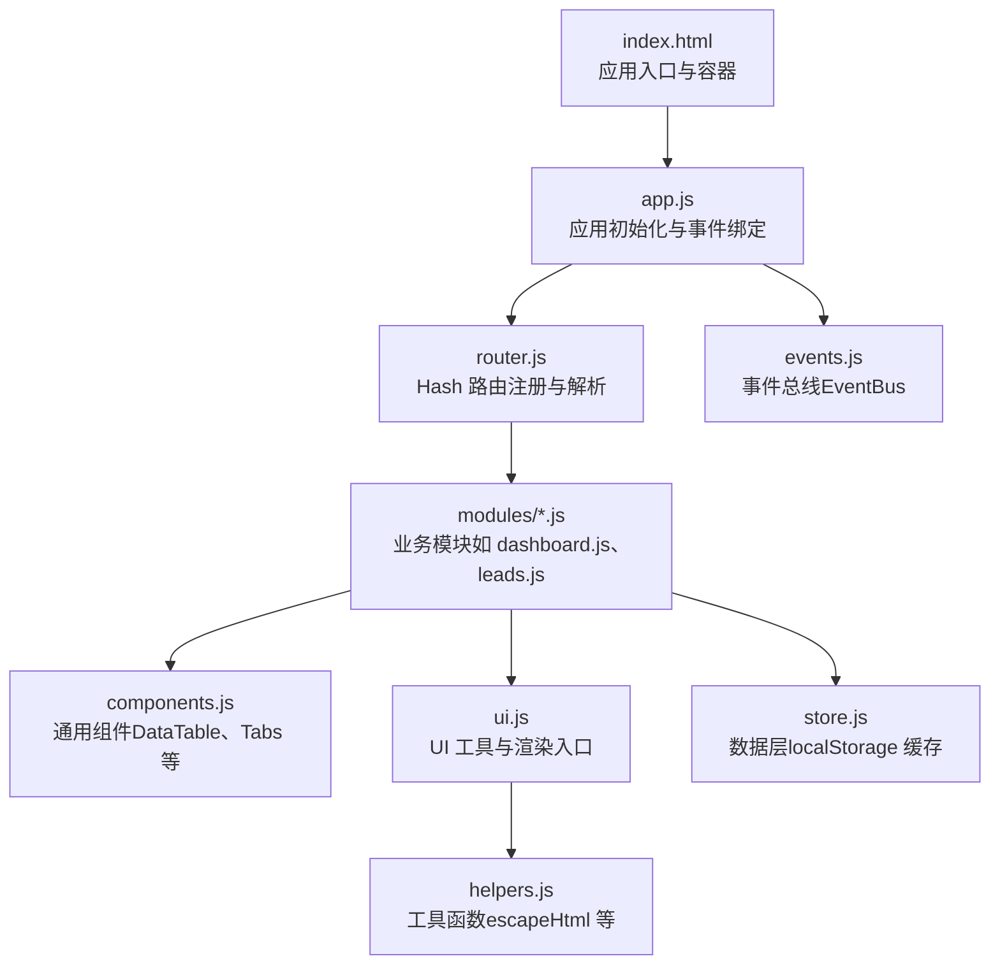
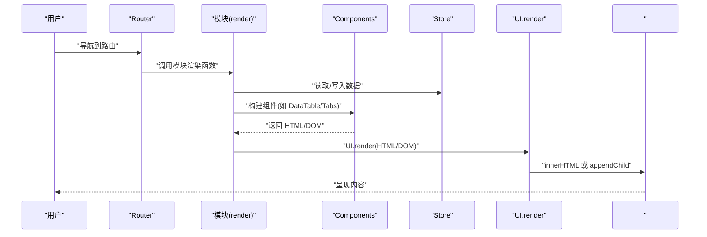
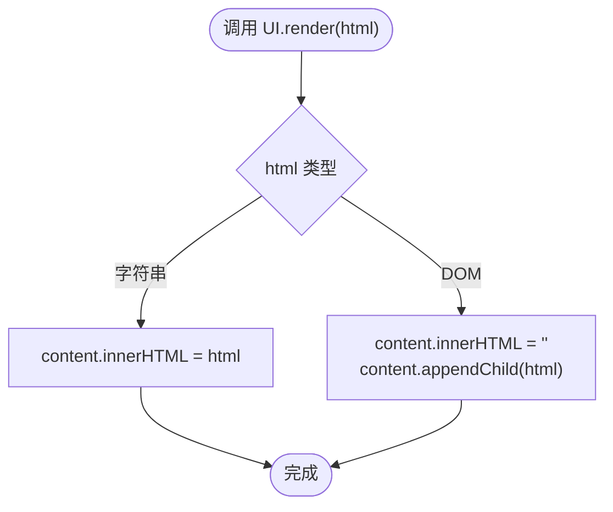
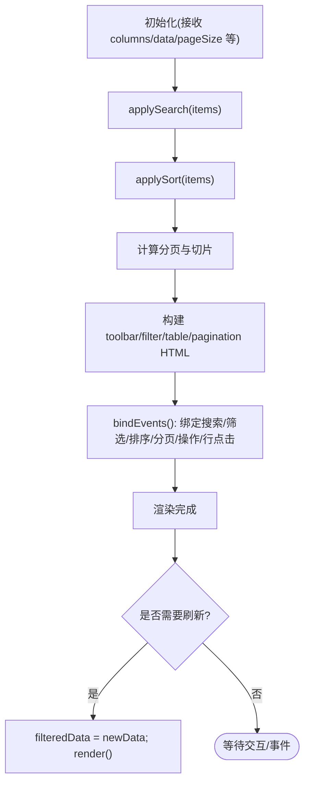
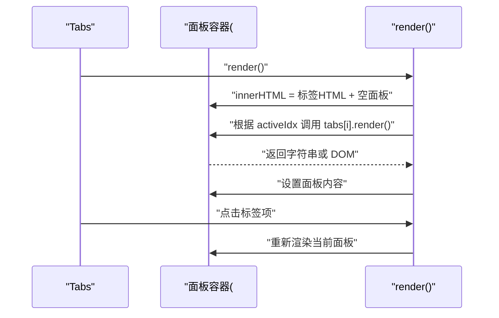
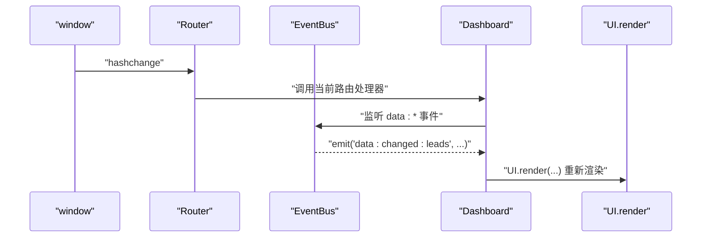
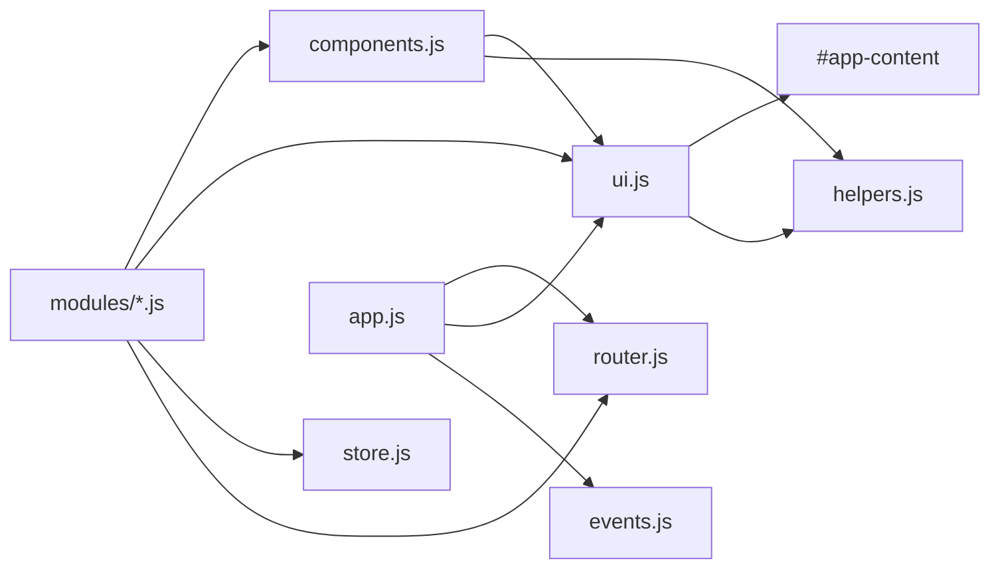

# 内容渲染系统

<cite>
**本文档引用的文件**
- [index.html](file://index.html)
- [app.js](file://js/app.js)
- [ui.js](file://js/ui.js)
- [components.js](file://js/components.js)
- [helpers.js](file://js/utils/helpers.js)
- [router.js](file://js/router.js)
- [events.js](file://js/events.js)
- [store.js](file://js/store.js)
- [dashboard.js](file://js/modules/dashboard.js)
- [leads.js](file://js/modules/leads.js)
</cite>

## 目录
1. [简介](#简介)
2. [项目结构](#项目结构)
3. [核心组件](#核心组件)
4. [架构总览](#架构总览)
5. [详细组件分析](#详细组件分析)
6. [依赖分析](#依赖分析)
7. [性能考虑](#性能考虑)
8. [故障排除指南](#故障排除指南)
9. [结论](#结论)
10. [附录](#附录)

## 简介
本文件系统性阐述 CRM 系统中的内容渲染体系，重点解析 UI.render() 方法的实现原理与工作机制，涵盖：
- HTML 字符串与 DOM 元素两种渲染路径
- 内容区域的动态更新流程与事件驱动机制
- 性能优化策略（防抖、增量更新、缓存）
- 安全考虑（HTML 转义、XSS 防护）
- 渲染 API 文档（参数、策略、错误处理）
- 不同内容类型的渲染示例（静态 HTML、动态生成、复杂组件）
- 扩展性设计（自定义渲染器、插槽机制）

## 项目结构
渲染系统围绕“应用入口 -> 路由 -> 页面模块 -> UI 渲染”的链路组织，采用模块化与组件化设计，确保可维护性与可扩展性。

图表来源
- [index.html:110-117](file://index.html#L110-L117)
- [app.js:10-34](file://js/app.js#L10-L34)
- [router.js:8-36](file://js/router.js#L8-L36)
- [ui.js:358-369](file://js/ui.js#L358-L369)
- [components.js:6-271](file://js/components.js#L6-L271)
- [store.js:4-138](file://js/store.js#L4-L138)
- [events.js:4-35](file://js/events.js#L4-L35)

章节来源
- [index.html:110-117](file://index.html#L110-L117)
- [app.js:10-34](file://js/app.js#L10-L34)
- [router.js:8-36](file://js/router.js#L8-L36)
- [ui.js:358-369](file://js/ui.js#L358-L369)
- [components.js:6-271](file://js/components.js#L6-L271)
- [store.js:4-138](file://js/store.js#L4-L138)
- [events.js:4-35](file://js/events.js#L4-L35)

## 核心组件
- UI.render(html): 内容区渲染入口，支持字符串与 DOM 元素两种输入，负责将内容挂载到 #app-content。
- Components.DataTable: 可搜索、可排序、可分页的数据表格组件，内置事件绑定与刷新能力。
- Components.Tabs: 标签页组件，支持动态渲染每个标签页内容（字符串或 DOM）。
- Helpers.escapeHtml: 安全转义工具，用于防止 XSS。
- Router: 基于 hash 的路由系统，负责页面切换与参数解析。
- EventBus: 事件总线，用于模块间解耦通信。
- Store: 数据层，提供 CRUD、查询、导出导入等能力，并维护内存缓存。

章节来源
- [ui.js:358-369](file://js/ui.js#L358-L369)
- [components.js:6-271](file://js/components.js#L6-L271)
- [helpers.js:78-84](file://js/utils/helpers.js#L78-L84)
- [router.js:8-36](file://js/router.js#L8-L36)
- [events.js:4-35](file://js/events.js#L4-L35)
- [store.js:4-138](file://js/store.js#L4-L138)

## 架构总览
渲染系统以 UI.render 为核心，通过 Router 触发模块渲染，模块内部组合 Components 与 Store，最终调用 UI.render 将结果注入 #app-content。事件总线贯穿模块间通信，保证低耦合与高内聚。

图表来源
- [router.js:22-36](file://js/router.js#L22-L36)
- [dashboard.js:6-209](file://js/modules/dashboard.js#L6-L209)
- [components.js:58-161](file://js/components.js#L58-L161)
- [store.js:32-96](file://js/store.js#L32-L96)
- [ui.js:358-369](file://js/ui.js#L358-L369)

## 详细组件分析

### UI.render() 实现原理
- 输入类型判断：若为字符串，直接赋值给 #app-content.innerHTML；若为 DOM 元素，则清空容器后追加子节点。
- 安全性保障：渲染前确保传入的是可信内容（字符串或 DOM），避免直接注入不受控的 HTML。
- 动态更新：每次渲染都会替换容器内容，适合页面级内容的整体替换。

图表来源
- [ui.js:358-369](file://js/ui.js#L358-L369)

章节来源
- [ui.js:358-369](file://js/ui.js#L358-L369)

### DataTable 组件渲染机制
- 数据处理：支持搜索、排序、分页三阶段处理，每一步均基于当前状态计算。
- 搜索：根据 searchKeys 对数据进行过滤，大小写不敏感。
- 排序：支持数字与字符串排序，支持升/降序切换。
- 分页：计算总页数与当前页范围，提供上一页/下一页与页码跳转。
- 事件绑定：在 render 完成后绑定搜索、筛选、排序、分页、操作按钮与行点击事件。
- 刷新：提供 container.refresh(newData) 以无副作用地更新数据并重新渲染。

图表来源
- [components.js:58-161](file://js/components.js#L58-L161)
- [components.js:184-260](file://js/components.js#L184-L260)

章节来源
- [components.js:6-271](file://js/components.js#L6-L271)

### Tabs 组件与插槽机制
- 插槽概念：每个标签页通过 render 函数返回内容（字符串或 DOM），实现“插槽”式的内容注入。
- 切换逻辑：点击标签项后更新 activeIdx 并重新渲染当前面板。
- 容器要求：调用方提供容器元素，Tabs 在其中渲染标签条与面板。

图表来源
- [components.js:290-322](file://js/components.js#L290-L322)

章节来源
- [components.js:290-322](file://js/components.js#L290-L322)

### 页面渲染示例

#### 静态 HTML 示例（系统设置页）
- 使用字符串拼接构建页面结构，包含标题、卡片、按钮与统计信息。
- 通过 UI.render 将字符串注入内容区。
- 事件绑定：导出、导入、重置、清空等按钮绑定相应逻辑。

章节来源
- [app.js:172-311](file://js/app.js#L172-L311)

#### 动态生成内容（数据看板）
- 从 Store 读取多集合数据，计算统计指标与可视化数据。
- 使用模板字符串与 Helpers.escapeHtml 进行安全渲染。
- 通过 UI.render 将 DOM 片段注入内容区。

章节来源
- [dashboard.js:6-209](file://js/modules/dashboard.js#L6-L209)

#### 复杂组件（线索列表）
- 使用 Components.DataTable 构建表格，配置列、搜索、筛选、动作与排序。
- 通过 UI.render 将组件返回的 DOM 元素注入内容区。

章节来源
- [leads.js:21-86](file://js/modules/leads.js#L21-L86)
- [components.js:6-271](file://js/components.js#L6-L271)

### 安全考虑与 XSS 防护
- HTML 转义：所有来自数据源或用户输入的文本在渲染前统一通过 Helpers.escapeHtml 转义，避免脚本注入。
- 内容注入控制：UI.render 仅接受字符串或 DOM，避免直接注入不受控的 HTML。
- 表单与模态框：UI.buildForm 与 UI.modal 中对标题、内容、占位符等均进行转义处理。
- 搜索结果：全局搜索结果也通过 Helpers.escapeHtml 转义后再插入 DOM。

章节来源
- [helpers.js:78-84](file://js/utils/helpers.js#L78-L84)
- [ui.js:358-369](file://js/ui.js#L358-L369)
- [ui.js:194-274](file://js/ui.js#L194-L274)
- [app.js:122-128](file://js/app.js#L122-L128)

### 渲染 API 文档

#### UI.render(html)
- 参数
  - html: string | HTMLElement
    - string：作为纯 HTML 字符串注入到 #app-content
    - HTMLElement：清空容器后追加该元素
- 返回值：无
- 错误处理：无显式异常抛出；若 #app-content 不存在则静默忽略
- 性能特性：整体替换，适合页面级内容更新

章节来源
- [ui.js:358-369](file://js/ui.js#L358-L369)

#### Components.DataTable(options)
- 参数
  - columns: 数组，每项包含 { key, label, width, sortable, render }
  - data: 数组，原始数据
  - pageSize/currentPage/searchKeys/searchPlaceholder/filters/activeFilter/onFilterChange/actions/toolbarExtra/emptyText/onRowClick/sortKey/sortOrder/onSort
- 返回
  - HTMLElement：表格容器，具备以下能力
    - container.refresh(newData)：无副作用更新数据并重新渲染
- 事件绑定
  - 搜索、筛选、排序、分页、操作按钮、行点击
- 性能特性
  - 搜索与排序在渲染时一次性完成，避免重复计算
  - 分页仅对当前页切片，减少 DOM 渲染量

章节来源
- [components.js:6-271](file://js/components.js#L6-L271)

#### Components.Tabs(tabs, container)
- 参数
  - tabs: 数组，每项包含 { label, render }
  - container: HTMLElement，作为标签与面板的宿主
- 返回
  - { switchTo(idx) }：切换到指定标签页并重新渲染
- 插槽机制
  - 每个标签页通过 render 返回字符串或 DOM，实现内容插槽

章节来源
- [components.js:290-322](file://js/components.js#L290-L322)

#### UI.setPageTitle(title, breadcrumbs)
- 功能：更新顶栏品牌区与面包屑，保持品牌区域不变
- 参数
  - title: string
  - breadcrumbs: 数组，元素为 { label, hash? }
- 安全性：对所有文本进行转义

章节来源
- [ui.js:318-356](file://js/ui.js#L318-L356)

#### UI.buildForm(fields, data)
- 功能：根据字段定义构建表单 HTML
- 参数
  - fields: 字段定义数组
  - data: 初始数据对象
- 返回
  - HTMLElement：表单容器，包含标签输入、日期、数字、选择等类型
- 安全性：对选项、占位符、默认值等进行转义

章节来源
- [ui.js:194-274](file://js/ui.js#L194-L274)

#### UI.getFormData(container, fields)
- 功能：从表单容器收集数据并进行基础校验
- 返回
  - 对象或 null：校验失败时返回 null
- 安全性：对标签集合等特殊字段进行处理

章节来源
- [ui.js:276-316](file://js/ui.js#L276-L316)

### 动态更新机制与事件驱动
- 路由驱动：Router.start 监听 hashchange，解析当前路由并触发对应模块渲染。
- 事件驱动：EventBus 提供 on/emit/off，模块通过事件总线进行解耦通信。
- 自动刷新：例如 Dashboard 监听数据变更事件，在当前路由为 #/dashboard 时自动重新渲染。

图表来源
- [router.js:54-60](file://js/router.js#L54-L60)
- [events.js:18-30](file://js/events.js#L18-L30)
- [dashboard.js:213-218](file://js/modules/dashboard.js#L213-L218)

章节来源
- [router.js:54-60](file://js/router.js#L54-L60)
- [events.js:18-30](file://js/events.js#L18-L30)
- [dashboard.js:213-218](file://js/modules/dashboard.js#L213-L218)

## 依赖分析
- UI.render 依赖 #app-content 容器存在性，依赖 Helpers.escapeHtml 进行安全渲染。
- Components.DataTable 依赖 UI.icons 与 Helpers 工具函数，内部封装事件绑定与刷新逻辑。
- Modules 依赖 Router 注册路由、Store 读写数据、UI 构建页面与组件。
- EventBus 为模块间通信提供解耦桥梁。

图表来源
- [ui.js:358-369](file://js/ui.js#L358-L369)
- [components.js:6-271](file://js/components.js#L6-L271)
- [store.js:4-138](file://js/store.js#L4-L138)
- [router.js:8-36](file://js/router.js#L8-L36)
- [events.js:4-35](file://js/events.js#L4-L35)
- [app.js:10-34](file://js/app.js#L10-L34)

章节来源
- [ui.js:358-369](file://js/ui.js#L358-L369)
- [components.js:6-271](file://js/components.js#L6-L271)
- [store.js:4-138](file://js/store.js#L4-L138)
- [router.js:8-36](file://js/router.js#L8-L36)
- [events.js:4-35](file://js/events.js#L4-L35)
- [app.js:10-34](file://js/app.js#L10-L34)

## 性能考虑
- 防抖优化：全局搜索与组件事件中广泛使用 Helpers.debounce，降低高频输入带来的重绘压力。
- 局部更新：DataTable 支持 container.refresh(newData)，在不重建整个组件的前提下更新数据。
- 内存缓存：Store 维护 _cache，避免频繁读取 localStorage。
- DOM 操作最小化：UI.render 采用整体替换策略，减少中间状态的复杂度；组件内部通过一次渲染生成完整 HTML 结构。
- 事件委托：组件内部事件绑定集中在容器上，减少重复绑定开销。

章节来源
- [app.js:70-142](file://js/app.js#L70-L142)
- [components.js:184-260](file://js/components.js#L184-L260)
- [store.js:8-30](file://js/store.js#L8-L30)
- [helpers.js:63-70](file://js/utils/helpers.js#L63-L70)

## 故障排除指南
- 内容未显示
  - 检查 #app-content 是否存在；确认 UI.render 被正确调用。
  - 章节来源
    - [ui.js:358-369](file://js/ui.js#L358-L369)
    - [index.html:110-117](file://index.html#L110-L117)
- 路由无效或页面不更新
  - 确认 Router.register 已注册目标路由；检查 Router.start 是否已调用。
  - 章节来源
    - [router.js:8-36](file://js/router.js#L8-L36)
    - [router.js:54-60](file://js/router.js#L54-L60)
- XSS 报错或脚本未执行
  - 确保所有用户输入与数据源文本均经过 Helpers.escapeHtml 转义。
  - 章节来源
    - [helpers.js:78-84](file://js/utils/helpers.js#L78-L84)
- 表单校验失败
  - 使用 UI.getFormData 获取数据，若返回 null，检查必填字段与类型转换。
  - 章节来源
    - [ui.js:276-316](file://js/ui.js#L276-L316)
- 组件事件未响应
  - 确认组件 render 完成后已调用 bindEvents；检查事件绑定范围与选择器。
  - 章节来源
    - [components.js:184-260](file://js/components.js#L184-L260)

## 结论
本渲染系统以 UI.render 为核心，结合 Router、EventBus、Store 与 Components，形成清晰的职责边界与可扩展架构。通过严格的 HTML 转义与事件驱动机制，系统在保证安全性的同时实现了良好的性能与可维护性。DataTable 与 Tabs 等组件提供了强大的复用能力，为复杂页面的快速构建奠定了基础。

## 附录

### 渲染策略对比
- 字符串渲染：适合静态或简单模板，UI.render 直接注入 innerHTML。
- DOM 渲染：适合复杂组件返回的 DOM 片段，UI.render 清空后追加，避免二次解析。
- 组件渲染：通过 Components 返回的 DOM，内部封装事件与状态，便于复用与升级。

章节来源
- [ui.js:358-369](file://js/ui.js#L358-L369)
- [components.js:6-271](file://js/components.js#L6-L271)