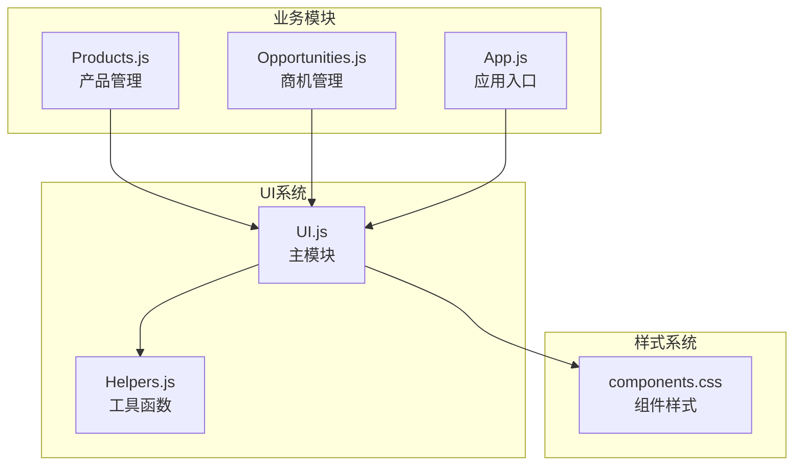
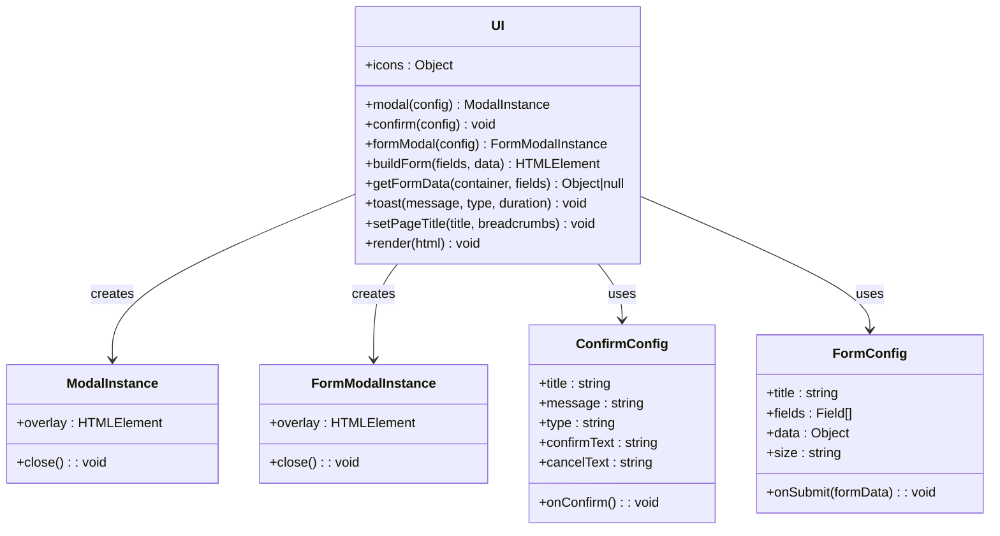
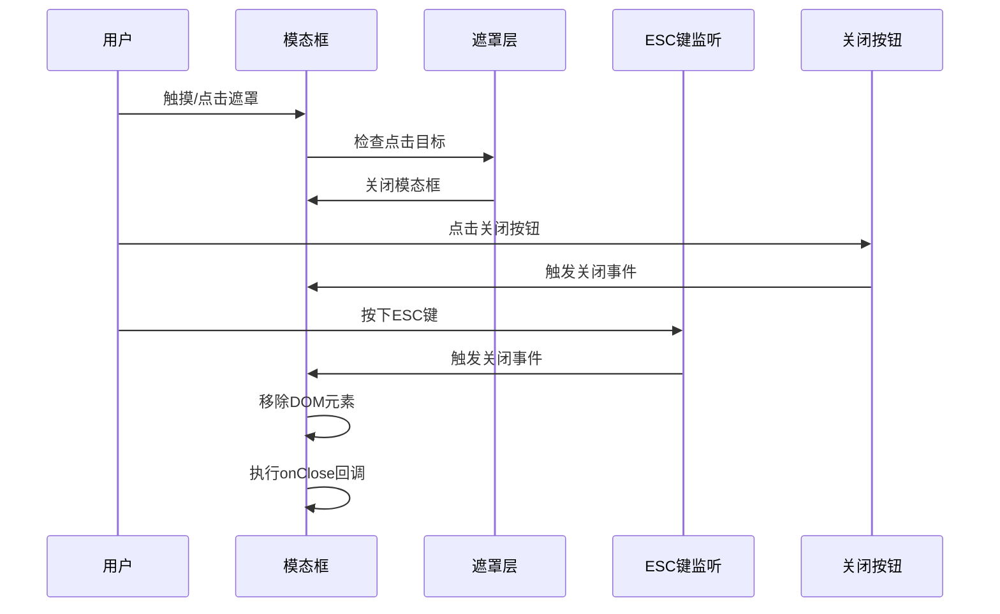
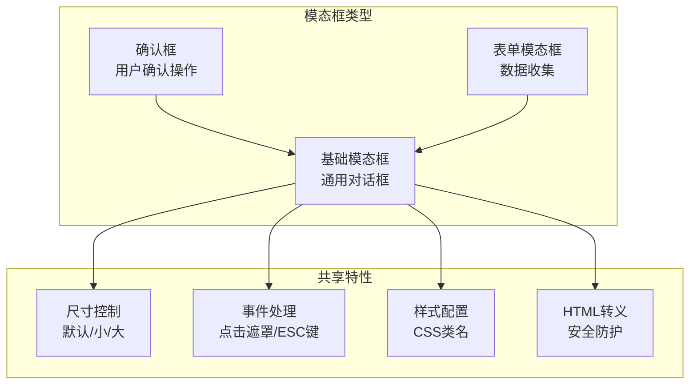
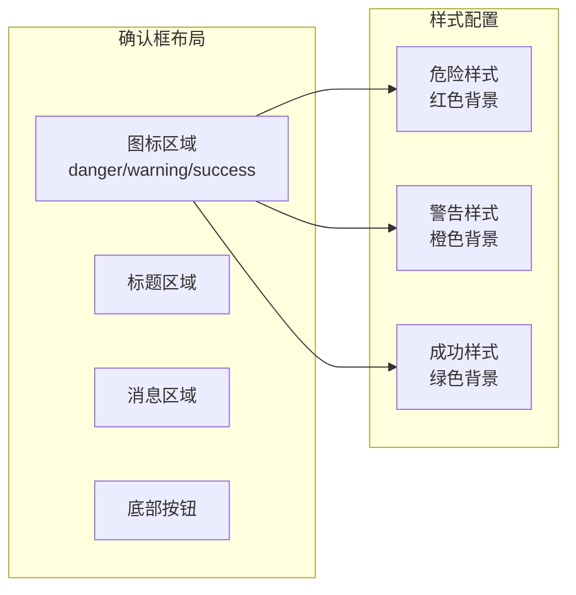
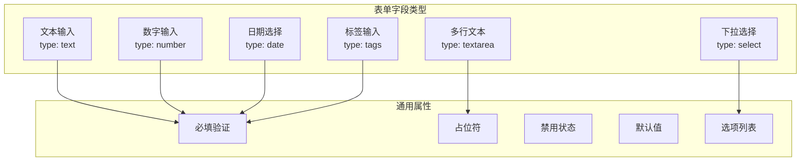
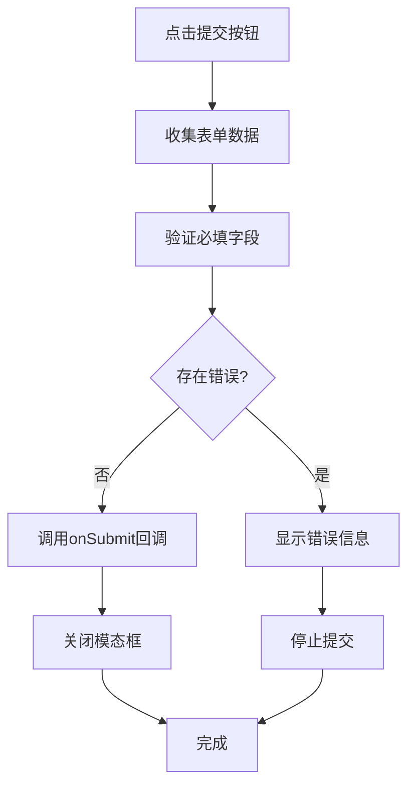
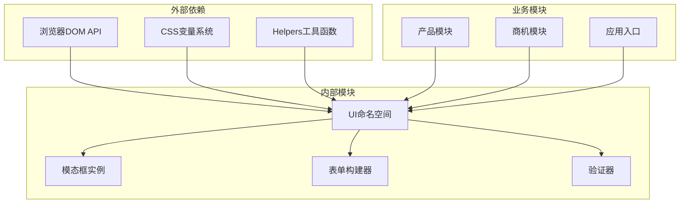
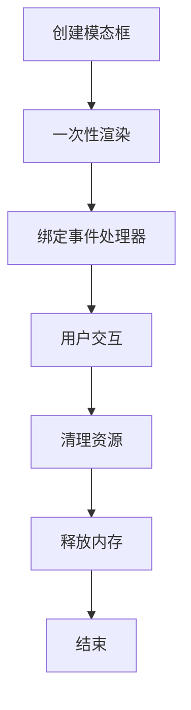

# 模态框系统

<cite>
**本文档引用的文件**
- [ui.js](file://js/ui.js)
- [helpers.js](file://js/utils/helpers.js)
- [components.css](file://css/components.css)
- [products.js](file://js/modules/products.js)
- [opportunities.js](file://js/modules/opportunities.js)
- [app.js](file://js/app.js)
</cite>

## 目录
1. [简介](#简介)
2. [项目结构](#项目结构)
3. [核心组件](#核心组件)
4. [架构概览](#架构概览)
5. [详细组件分析](#详细组件分析)
6. [依赖关系分析](#依赖关系分析)
7. [性能考虑](#性能考虑)
8. [故障排除指南](#故障排除指南)
9. [结论](#结论)
10. [附录](#附录)

## 简介

模态框系统是CRM系统中的重要交互组件，提供了统一的对话框解决方案。该系统包含三个主要类型：基础模态框、确认框和表单模态框，支持多种尺寸控制和丰富的事件处理机制。

模态框系统采用模块化设计，通过UI命名空间统一管理所有模态框相关的功能，确保了代码的可维护性和一致性。

## 项目结构

模态框系统主要分布在以下文件中：



**图表来源**
- [ui.js:1-364](file://js/ui.js#L1-L364)
- [components.css:489-688](file://css/components.css#L489-L688)

**章节来源**
- [ui.js:1-364](file://js/ui.js#L1-L364)
- [components.css:489-688](file://css/components.css#L489-L688)

## 核心组件

### 模态框基础架构

模态框系统的核心是UI命名空间中的modal()方法，它提供了完整的模态框生命周期管理：



**图表来源**
- [ui.js:80-191](file://js/ui.js#L80-L191)

### 事件处理机制

模态框系统实现了多层次的事件处理机制：



**图表来源**
- [ui.js:107-127](file://js/ui.js#L107-L127)

**章节来源**
- [ui.js:80-191](file://js/ui.js#L80-L191)

## 架构概览

### 模态框类型体系

模态框系统包含三种主要类型，每种都有特定的使用场景和实现方式：



**图表来源**
- [ui.js:80-191](file://js/ui.js#L80-L191)

### 尺寸控制系统

模态框支持三种尺寸配置：

| 尺寸类型 | CSS类名 | 最大宽度 | 使用场景 |
|---------|---------|----------|----------|
| 默认 | 无类名 | 560px | 标准内容展示 |
| 小型 | modal-sm | 400px | 简单确认框 |
| 大型 | modal-lg | 720px | 复杂表单/详情 |

**章节来源**
- [ui.js:85](file://js/ui.js#L85)
- [components.css:513-514](file://css/components.css#L513-L514)

## 详细组件分析

### 基础模态框 (modal)

基础模态框是所有模态框的基础实现，提供了最核心的功能：

#### 创建流程

```mermaid
flowchart TD
Start([调用 modal()]) --> RemoveExisting[移除现有模态框]
RemoveExisting --> CreateOverlay[创建遮罩层元素]
CreateOverlay --> SetSize[设置尺寸类名]
SetSize --> BuildHTML[构建HTML结构]
BuildHTML --> AppendToDOM[添加到DOM树]
AppendToDOM --> HandleContent{内容类型?}
HandleContent --> |字符串| StringContent[直接插入文本]
HandleContent --> |DOM元素| DOMContent[附加到body]
StringContent --> SetupEvents[设置事件监听器]
DOMContent --> SetupEvents
SetupEvents --> ESCListener[添加ESC键监听]
ESCListener --> ReturnInstance[返回实例]
ReturnInstance --> End([完成])
```

**图表来源**
- [ui.js:81-128](file://js/ui.js#L81-L128)

#### 事件处理机制

基础模态框实现了多重事件处理：

1. **遮罩层点击关闭**：点击模态框外部区域触发关闭
2. **关闭按钮事件**：点击右上角关闭按钮
3. **ESC键支持**：按下ESC键自动关闭
4. **回调执行**：关闭时执行onClose回调函数

**章节来源**
- [ui.js:107-127](file://js/ui.js#L107-L127)

### 确认框 (confirm)

确认框专门用于用户确认操作，具有特定的视觉设计和交互模式：

#### 设计特点



**图表来源**
- [ui.js:137-162](file://js/ui.js#L137-L162)

#### 类型映射规则

| 类型 | 图标 | 按钮样式 |
|------|------|----------|
| danger | 警告图标 | 危险按钮样式 |
| warning | 警告图标 | 警告按钮样式 |
| success | 对勾图标 | 主要按钮样式 |

**章节来源**
- [ui.js:137-162](file://js/ui.js#L137-L162)

### 表单模态框 (formModal)

表单模态框是最复杂的功能模块，支持多种输入类型和验证机制：

#### 表单字段类型



**图表来源**
- [ui.js:194-274](file://js/ui.js#L194-L274)

#### 表单验证流程



**图表来源**
- [ui.js:277-316](file://js/ui.js#L277-L316)

**章节来源**
- [ui.js:165-191](file://js/ui.js#L165-L191)
- [ui.js:194-274](file://js/ui.js#L194-L274)
- [ui.js:277-316](file://js/ui.js#L277-L316)

## 依赖关系分析

### 核心依赖链



**图表来源**
- [ui.js:1-364](file://js/ui.js#L1-L364)
- [helpers.js:1-113](file://js/utils/helpers.js#L1-L113)

### 样式依赖关系

模态框系统依赖于CSS变量系统来实现主题定制：

```mermaid
graph LR
subgraph "CSS变量"
ZIndex[--z-modal: 1000]
BGColor[--bg-overlay: rgba(0,0,0,0.5)]
CardBG[--bg-card: #ffffff]
Shadow[--shadow-xl: 0 20px 25px -5px rgba(0,0,0,0.1)]
end
subgraph "样式类"
Overlay[modal-overlay]
Modal[modal]
Header[modal-header]
Body[modal-body]
Footer[modal-footer]
end
ZIndex --> Overlay
BGColor --> Overlay
CardBG --> Modal
Shadow --> Modal
Overlay --> Header
Overlay --> Body
Overlay --> Footer
```

**图表来源**
- [components.css:490-558](file://css/components.css#L490-L558)

**章节来源**
- [ui.js:1-364](file://js/ui.js#L1-L364)
- [helpers.js:1-113](file://js/utils/helpers.js#L1-L113)
- [components.css:489-688](file://css/components.css#L489-L688)

## 性能考虑

### 内存管理

模态框系统采用了及时的内存清理机制：

1. **DOM元素移除**：模态框关闭时立即从DOM树中移除
2. **事件监听器清理**：ESC键监听器在关闭时自动移除
3. **回调函数执行**：确保onClose回调只执行一次

### 渲染优化



### 最佳实践建议

1. **避免重复创建**：使用UI.closeModal()确保同一时间只有一个模态框
2. **合理使用ESC键**：在复杂表单中谨慎使用ESC键功能
3. **优化事件处理**：避免在模态框中绑定过多的全局事件监听器

## 故障排除指南

### 常见问题及解决方案

#### 模态框无法关闭

**症状**：模态框显示但无法通过任何方式关闭

**可能原因**：
1. ESC键监听器被其他组件覆盖
2. 遮罩层事件冒泡被阻止
3. onClose回调中抛出异常

**解决方案**：
```javascript
// 确保正确处理ESC键
const escHandler = (e) => {
  if (e.key === 'Escape') {
    close();
    document.removeEventListener('keydown', escHandler);
  }
};
document.addEventListener('keydown', escHandler);
```

#### 表单验证不工作

**症状**：表单提交时验证逻辑失效

**可能原因**：
1. 字段配置错误
2. 数据类型转换问题
3. 验证规则冲突

**解决方案**：
```javascript
// 检查字段配置
const field = {
  key: 'fieldName',
  label: '字段名称',
  type: 'text',
  required: true,
  default: ''
};

// 确保数据类型正确
const value = el.value.trim();
if (f.type === 'number' && value !== '') {
  value = parseFloat(value);
}
```

**章节来源**
- [ui.js:107-127](file://js/ui.js#L107-L127)
- [ui.js:277-316](file://js/ui.js#L277-L316)

## 结论

模态框系统通过精心设计的架构和完善的事件处理机制，为CRM系统提供了强大而灵活的对话框解决方案。系统的主要优势包括：

1. **模块化设计**：清晰的职责分离和依赖关系
2. **安全性**：完整的HTML转义和输入验证
3. **可扩展性**：支持多种模态框类型和自定义配置
4. **用户体验**：直观的交互模式和响应式设计

该系统为后续的功能扩展奠定了良好的基础，可以轻松地添加新的模态框类型和增强现有功能。

## 附录

### API参考文档

#### modal() 方法

**参数**：
- `title` (string): 模态框标题
- `content` (string|HTMLElement): 内容文本或DOM元素
- `size` (string): 模态框尺寸 ('default'|'sm'|'lg')
- `onClose` (function): 关闭回调函数
- `footer` (string): 自定义底部区域HTML

**返回值**：
- `{ overlay, close }`: 模态框实例对象

**章节来源**
- [ui.js:80-128](file://js/ui.js#L80-L128)

#### confirm() 方法

**参数**：
- `title` (string): 确认标题
- `message` (string): 提示消息
- `type` (string): 类型 ('danger'|'warning'|'success')
- `confirmText` (string): 确认按钮文本
- `cancelText` (string): 取消按钮文本
- `onConfirm` (function): 确认回调函数

**章节来源**
- [ui.js:136-162](file://js/ui.js#L136-L162)

#### formModal() 方法

**参数**：
- `title` (string): 表单标题
- `fields` (Field[]): 字段定义数组
- `data` (Object): 默认表单数据
- `size` (string): 模态框尺寸
- `onSubmit` (function): 提交回调函数

**章节来源**
- [ui.js:164-191](file://js/ui.js#L164-L191)

### 使用示例

#### 基础模态框示例

```javascript
// 简单文本内容
UI.modal({
  title: '提示',
  content: '这是一条提示信息',
  size: 'sm'
});

// DOM元素内容
const customContent = document.createElement('div');
customContent.innerHTML = '<p>自定义内容</p>';
UI.modal({
  title: '自定义',
  content: customContent
});
```

#### 确认框示例

```javascript
UI.confirm({
  title: '删除确认',
  message: '确定要删除这条记录吗？此操作不可撤销。',
  type: 'danger',
  confirmText: '确认删除',
  onConfirm: () => {
    // 执行删除逻辑
    console.log('用户确认删除');
  }
});
```

#### 表单模态框示例

```javascript
const fields = [
  {
    key: 'name',
    label: '产品名称',
    type: 'text',
    required: true,
    placeholder: '请输入产品名称'
  },
  {
    key: 'price',
    label: '产品价格',
    type: 'number',
    required: true,
    min: 0,
    step: '0.01'
  }
];

UI.formModal({
  title: '新建产品',
  fields: fields,
  onSubmit: (formData) => {
    console.log('提交的数据:', formData);
    // 处理表单提交
  }
});
```

**章节来源**
- [products.js:126-151](file://js/modules/products.js#L126-L151)
- [opportunities.js:277-301](file://js/modules/opportunities.js#L277-L301)
- [opportunities.js:339](file://js/modules/opportunities.js#L339)