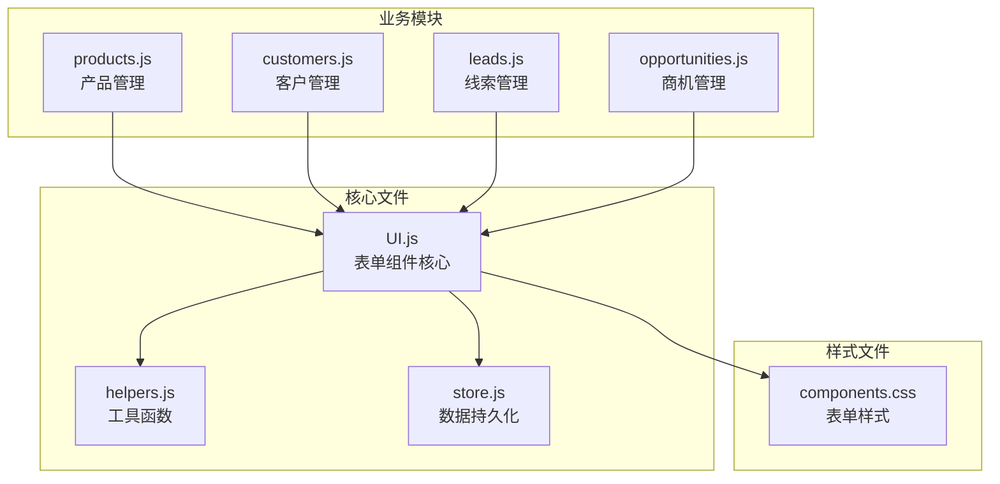
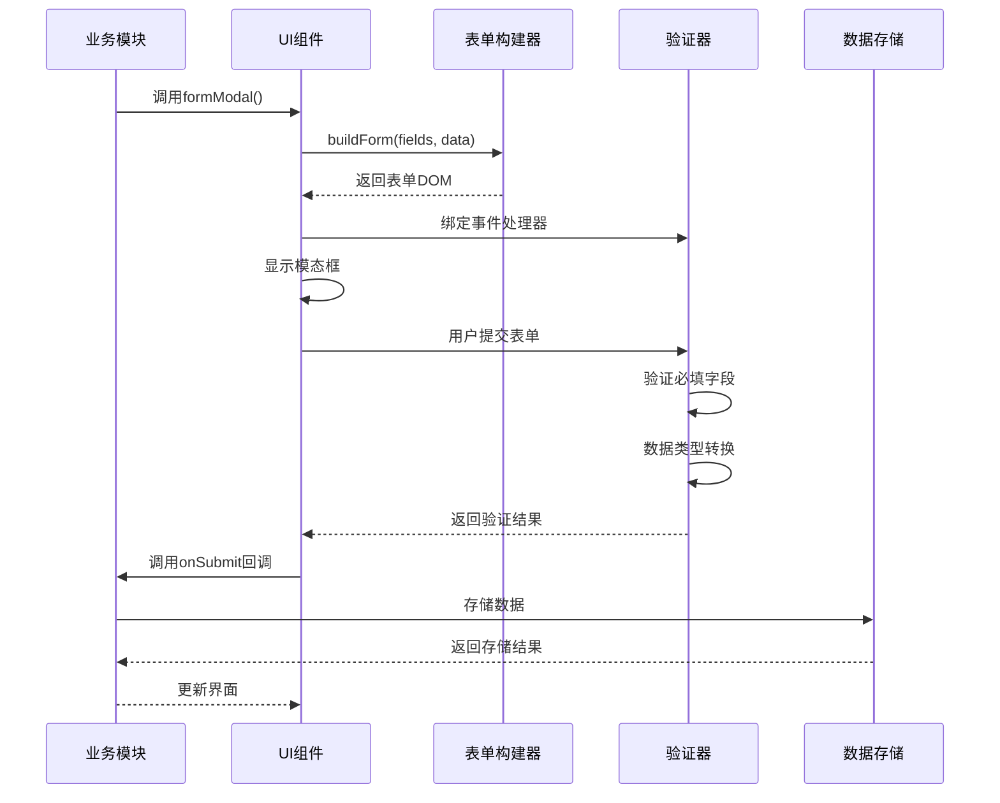
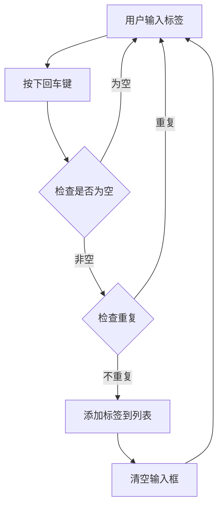
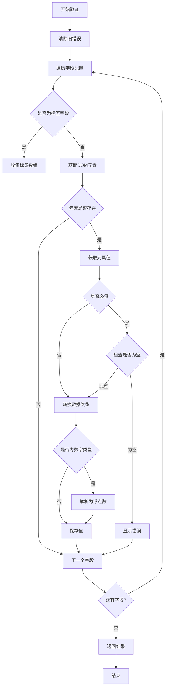
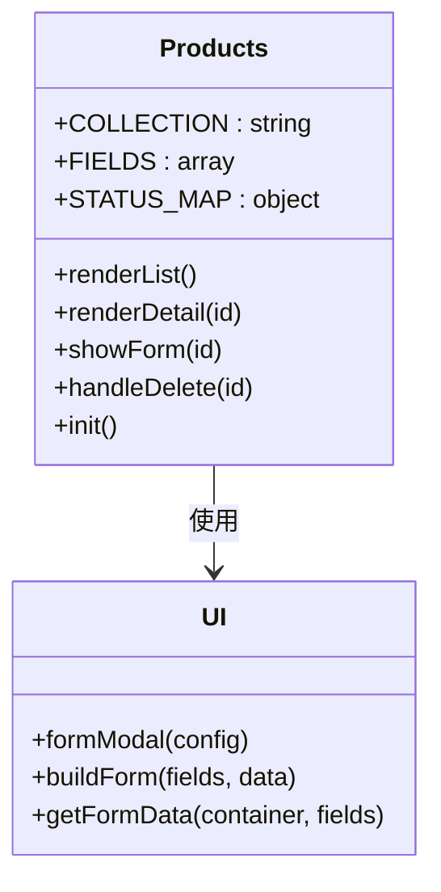
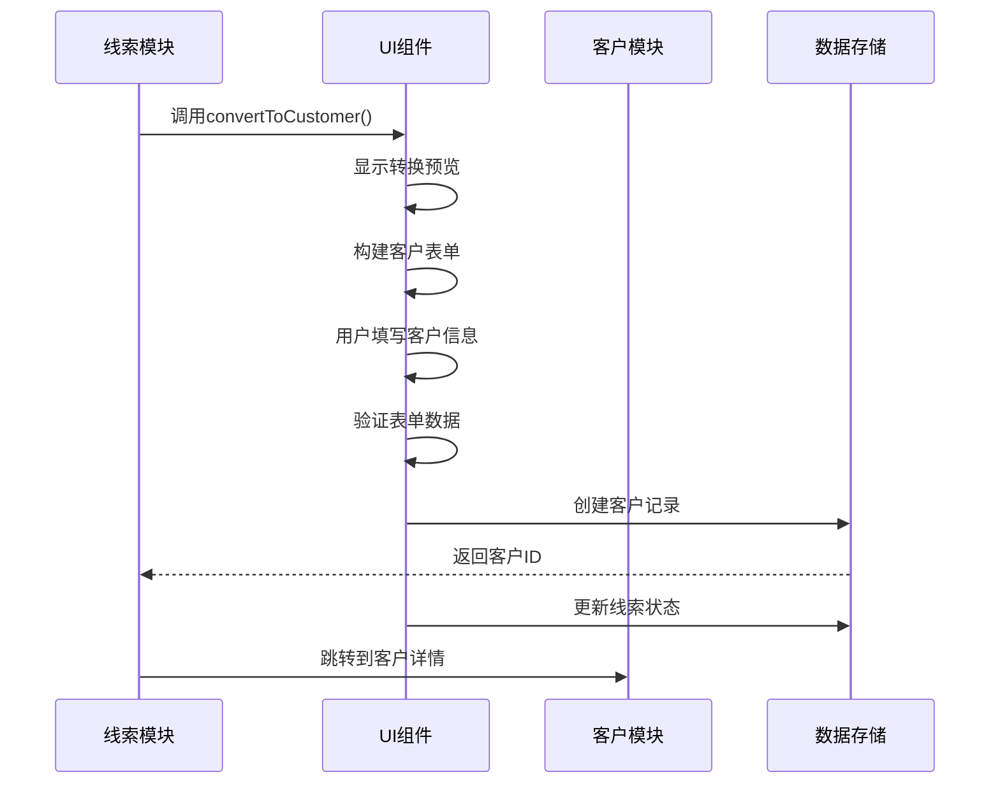
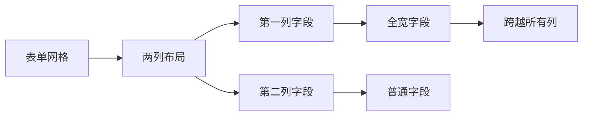
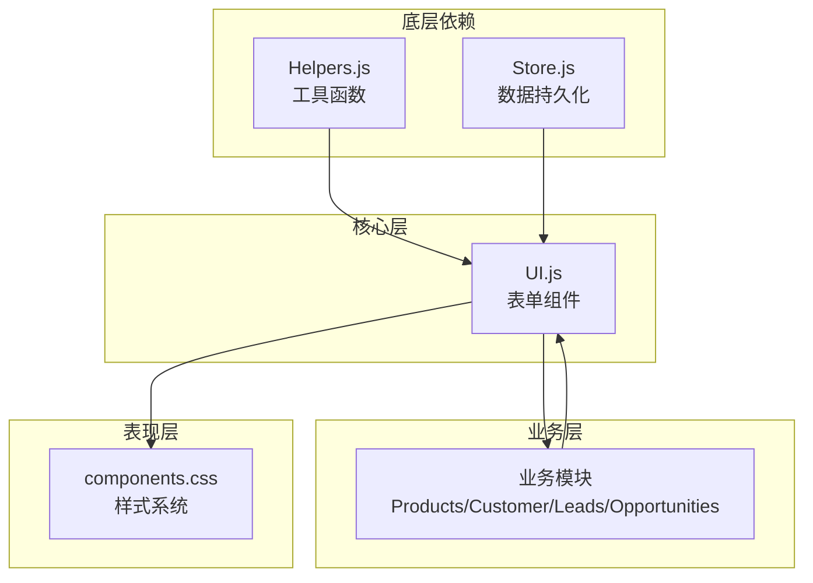

# 表单组件系统

<cite>
**本文档引用的文件**
- [ui.js](file://js/ui.js)
- [helpers.js](file://js/utils/helpers.js)
- [store.js](file://js/store.js)
- [products.js](file://js/modules/products.js)
- [customers.js](file://js/modules/customers.js)
- [leads.js](file://js/modules/leads.js)
- [opportunities.js](file://js/modules/opportunities.js)
- [components.css](file://css/components.css)
</cite>

## 目录
1. [简介](#简介)
2. [项目结构](#项目结构)
3. [核心组件](#核心组件)
4. [架构概览](#架构概览)
5. [详细组件分析](#详细组件分析)
6. [依赖关系分析](#依赖关系分析)
7. [性能考虑](#性能考虑)
8. [故障排除指南](#故障排除指南)
9. [结论](#结论)

## 简介

CRM系统采用模块化设计，通过统一的表单组件系统实现了跨模块的表单构建和数据管理功能。该系统提供了强大的表单生成器、验证机制和数据持久化能力，支持多种表单控件类型，包括文本输入、选择框、文本域、日期选择、数字输入和标签输入。

系统的核心优势在于：
- **统一的表单构建API**：通过buildForm()方法统一生成各种表单控件
- **内置验证机制**：支持必填字段验证和错误提示显示
- **灵活的数据收集**：通过getFormData()方法收集和验证表单数据
- **模块化设计**：每个业务模块都可以独立使用表单系统
- **响应式布局**：适配不同屏幕尺寸的表单显示

## 项目结构

表单组件系统主要分布在以下文件中：

**图表来源**
- [ui.js:194-316](file://js/ui.js#L194-L316)
- [helpers.js:1-113](file://js/utils/helpers.js#L1-L113)
- [store.js:1-139](file://js/store.js#L1-L139)

**章节来源**
- [ui.js:1-371](file://js/ui.js#L1-L371)
- [helpers.js:1-113](file://js/utils/helpers.js#L1-L113)
- [store.js:1-139](file://js/store.js#L1-L139)

## 核心组件

### UI表单组件系统

UI.js文件包含了完整的表单组件系统，主要包含以下核心功能：

#### 表单构建器 (buildForm)
- 支持多种输入类型：text、select、textarea、date、number、tags
- 动态生成表单HTML结构
- 处理标签输入的交互逻辑
- 支持全宽布局和禁用状态

#### 数据收集器 (getFormData)
- 验证必填字段
- 处理不同类型的数据转换
- 显示错误提示
- 返回标准化的数据对象

#### 表单模态框 (formModal)
- 集成表单构建和数据收集功能
- 提供确认和取消操作
- 支持自定义提交回调

**章节来源**
- [ui.js:194-316](file://js/ui.js#L194-L316)

## 架构概览

表单组件系统采用分层架构设计，确保了良好的模块分离和可维护性：

**图表来源**
- [ui.js:165-191](file://js/ui.js#L165-L191)
- [ui.js:194-274](file://js/ui.js#L194-L274)
- [ui.js:277-316](file://js/ui.js#L277-L316)

## 详细组件分析

### 表单构建器 (buildForm)

buildForm方法是整个表单系统的核心，负责根据字段配置生成相应的HTML元素：

#### 支持的表单控件类型

| 控件类型 | 用途 | 特殊属性 |
|---------|------|----------|
| text | 文本输入 | placeholder, disabled |
| select | 下拉选择 | options, disabled |
| textarea | 多行文本 | rows, disabled |
| date | 日期选择 | disabled |
| number | 数字输入 | step, min, disabled |
| tags | 标签输入 | 自动完成功能 |

#### 标签输入控件 (tags)

标签输入是一个特殊的控件，提供了独特的交互体验：

**图表来源**
- [ui.js:221-271](file://js/ui.js#L221-L271)

**章节来源**
- [ui.js:194-274](file://js/ui.js#L194-L274)

### 数据收集器 (getFormData)

getFormData方法负责收集表单数据并执行验证：

#### 验证流程

**图表来源**
- [ui.js:277-316](file://js/ui.js#L277-L316)

#### 数据类型处理

| 字段类型 | 数据处理 | 示例 |
|---------|----------|------|
| text | 字符串，去除空白字符 | "  hello  " → "hello" |
| number | 浮点数，转换失败返回原值 | "123.45" → 123.45 |
| select | 字符串或数字 | "option1" |
| textarea | 字符串，去除空白字符 | "多行文本" |
| date | 字符串，ISO格式日期 | "2024-01-01" |
| tags | 字符串数组 | ["标签1", "标签2"] |

**章节来源**
- [ui.js:277-316](file://js/ui.js#L277-L316)

### 业务模块集成

各个业务模块都集成了统一的表单系统：

#### 产品管理模块 (Products)

**图表来源**
- [products.js:1-175](file://js/modules/products.js#L1-L175)
- [ui.js:165-191](file://js/ui.js#L165-L191)

#### 客户管理模块 (Customers)

客户管理模块展示了复杂的表单配置，包括：

- **基础信息字段**：名称、类型、行业、规模、状态
- **联系方式**：电话、邮箱、地址、网站
- **高级功能**：标签输入、全宽文本域
- **状态映射**：活跃、沉默、流失对应不同颜色

#### 线索管理模块 (Leads)

线索管理模块提供了线索到客户的转换功能：

**图表来源**
- [leads.js:198-279](file://js/modules/leads.js#L198-L279)

**章节来源**
- [products.js:1-175](file://js/modules/products.js#L1-L175)
- [customers.js:1-229](file://js/modules/customers.js#L1-L229)
- [leads.js:1-286](file://js/modules/leads.js#L1-L286)

### 表单样式系统

表单组件的样式通过CSS变量和响应式设计实现：

#### 表单布局

**图表来源**
- [components.css:148-157](file://css/components.css#L148-L157)

#### 错误状态样式

表单元素支持错误状态的视觉反馈：

- **错误边框**：红色边框突出显示
- **错误图标**：红色警告图标
- **错误消息**：红色字体显示具体错误信息

**章节来源**
- [components.css:89-157](file://css/components.css#L89-L157)

## 依赖关系分析

表单组件系统展现了清晰的依赖层次：

**图表来源**
- [ui.js:1-371](file://js/ui.js#L1-L371)
- [helpers.js:1-113](file://js/utils/helpers.js#L1-L113)
- [store.js:1-139](file://js/store.js#L1-L139)

### 模块间耦合度

- **低耦合**：业务模块只依赖UI组件接口，不直接依赖具体实现
- **高内聚**：UI组件封装了完整的表单功能，包括构建、验证、存储
- **可扩展性**：新的业务模块可以轻松集成表单系统

**章节来源**
- [ui.js:1-371](file://js/ui.js#L1-L371)
- [products.js:126-151](file://js/modules/products.js#L126-L151)
- [customers.js:184-206](file://js/modules/customers.js#L184-L206)

## 性能考虑

### 内存优化

- **事件委托**：使用事件委托减少内存占用
- **防抖处理**：搜索和输入操作使用防抖优化性能
- **懒加载**：表单内容按需渲染

### 数据处理优化

- **批量操作**：支持批量数据处理和验证
- **缓存机制**：使用localStorage缓存数据
- **增量更新**：只更新变化的数据部分

### 响应式设计

- **自适应布局**：移动端和桌面端自动适配
- **触摸友好**：大按钮和触摸目标优化
- **加载状态**：提供视觉反馈和加载指示

## 故障排除指南

### 常见问题及解决方案

#### 表单验证失败

**症状**：提交表单时出现红色边框和错误消息

**原因**：
- 必填字段为空
- 数据类型不匹配
- 格式不符合要求

**解决方案**：
1. 检查字段配置中的required属性
2. 验证数据格式是否正确
3. 确认用户输入符合预期格式

#### 数据存储失败

**症状**：表单提交后数据没有保存

**原因**：
- localStorage空间不足
- 数据格式错误
- 网络异常

**解决方案**：
1. 检查浏览器localStorage容量
2. 验证数据结构完整性
3. 确认网络连接正常

#### 表单样式异常

**症状**：表单显示错位或样式不正确

**原因**：
- CSS文件加载失败
- 样式冲突
- 媒体查询问题

**解决方案**：
1. 检查CSS文件路径
2. 确认样式优先级
3. 测试不同屏幕尺寸

**章节来源**
- [store.js:22-30](file://js/store.js#L22-L30)
- [ui.js:277-316](file://js/ui.js#L277-L316)

## 结论

CRM系统的表单组件系统展现了优秀的架构设计和实现质量。通过统一的API设计、完善的验证机制和灵活的配置选项，系统为各个业务模块提供了强大而一致的表单处理能力。

### 主要优势

1. **统一性**：所有业务模块使用相同的表单API
2. **可扩展性**：易于添加新的表单控件类型
3. **可维护性**：清晰的模块分离和依赖关系
4. **用户体验**：直观的界面和及时的反馈

### 技术亮点

- **模块化设计**：遵循单一职责原则
- **响应式布局**：适配多种设备和屏幕尺寸
- **数据持久化**：本地存储确保数据安全
- **错误处理**：完善的错误提示和恢复机制

该表单组件系统为CRM系统的可扩展性和可维护性奠定了坚实的基础，是现代前端应用开发的优秀实践案例。